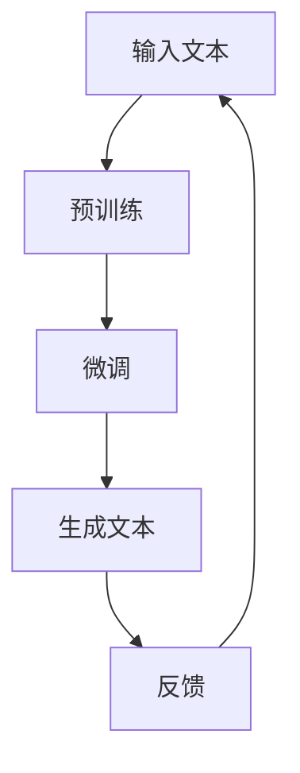
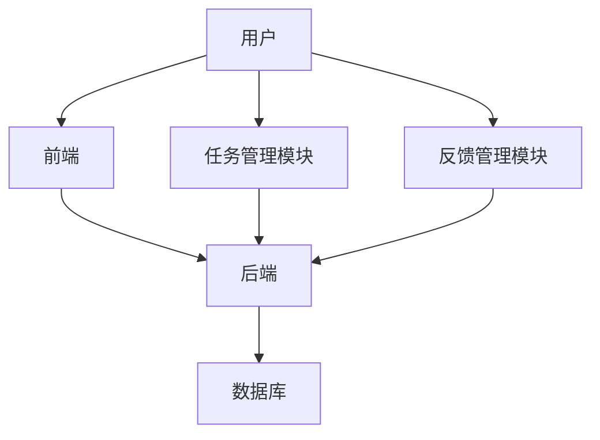
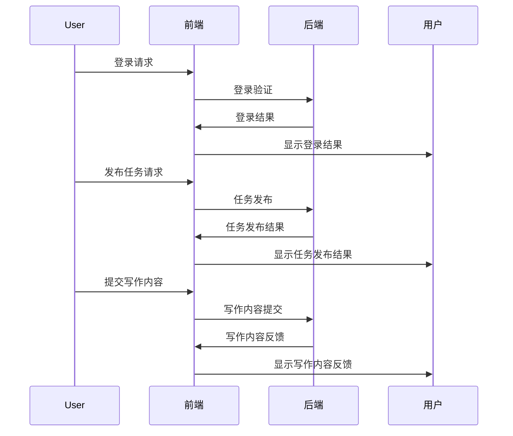

                 

# ChatGPT在创意写作训练中的应用

## 关键词

- **ChatGPT**
- **创意写作训练**
- **自然语言处理**
- **人工智能**
- **算法原理**
- **应用案例**

## 摘要

本文旨在探讨ChatGPT在创意写作训练中的应用。首先，我们将简要介绍问题背景，阐述创意写作训练中存在的问题和挑战。接着，我们将介绍ChatGPT的基本原理，并分析其在创意写作训练中的潜在作用。通过一系列的算法原理讲解、数学模型分析、系统设计与项目实战，本文将详细阐述如何利用ChatGPT进行创意写作训练，并提供一些最佳实践和注意事项。

## 1. 背景介绍

### 问题背景

创意写作是文学、媒体和广告等领域的重要技能。然而，传统创意写作训练方法往往依赖于导师的指导和学生的个人经验积累，存在以下问题：

1. **资源限制**：优秀的创意写作导师资源有限，无法满足大量学生的需求。
2. **个性化不足**：传统的训练方法难以根据每个学生的兴趣和需求进行个性化指导。
3. **时间成本**：导师和学生都需要投入大量时间进行互动和反馈。

### 创意写作训练需求

为了解决上述问题，我们需要一种能够提供个性化指导、高效且资源节约的创意写作训练方法。人工智能（AI）技术，尤其是自然语言处理（NLP）技术的发展，为创意写作训练提供了新的可能性。

### 问题解决思路

ChatGPT是一种基于Transformer模型的预训练语言模型，具有强大的自然语言理解和生成能力。利用ChatGPT进行创意写作训练，可以：

1. **个性化指导**：根据学生的兴趣和写作风格，提供个性化的写作建议。
2. **实时反馈**：即时生成反馈，帮助学生快速改进写作。
3. **高效资源利用**：通过自动化流程，降低对导师的依赖，提高训练效率。

### 边界与外延

本文主要讨论ChatGPT在创意写作训练中的应用，不包括其他类型的写作任务。同时，我们将重点关注ChatGPT的算法原理和实际应用案例，不涉及其他AI技术的讨论。

### 核心概念结构

- **ChatGPT**：一种基于Transformer模型的预训练语言模型。
- **创意写作训练**：通过指导和反馈帮助学生提高写作技能的过程。
- **自然语言处理（NLP）**：使计算机能够理解和生成人类语言的技术。
- **人工智能（AI）**：模拟人类智能行为的技术。

## 2. 核心概念与联系

### ChatGPT的基本原理

ChatGPT是一种基于Transformer模型的预训练语言模型。其核心思想是通过大量文本数据训练，使模型能够理解并生成自然语言。具体来说，ChatGPT使用了以下技术：

1. **Transformer模型**：一种用于序列到序列学习的模型，具有并行计算优势和强大的上下文理解能力。
2. **预训练**：在大量通用文本数据上进行训练，使模型具备基础的语言理解能力。
3. **微调**：在特定领域的数据上进行微调，使模型能够适应特定任务。

### 创意写作训练的需求和目标

创意写作训练的主要目标是帮助学生提高写作技能，包括：

1. **内容创作**：能够产生具有创意和独特性的内容。
2. **结构组织**：能够构建逻辑清晰、层次分明的文章结构。
3. **语言运用**：能够运用丰富的词汇和恰当的语法。

### ChatGPT与创意写作训练的联系

ChatGPT在创意写作训练中具有以下作用：

1. **个性化指导**：根据学生的兴趣和写作风格，提供个性化的写作建议。
2. **实时反馈**：通过分析学生的写作内容，提供实时反馈，帮助学生改进写作。
3. **内容生成**：生成创意性的写作素材，为学生提供灵感。

### ChatGPT在创意写作训练中的应用案例

以下是一些ChatGPT在创意写作训练中的应用案例：

1. **写作辅导**：学生可以与ChatGPT进行对话，获取写作建议和灵感。
2. **文章润色**：ChatGPT可以帮助学生修改文章，提高语言表达和逻辑结构。
3. **内容创作**：ChatGPT可以生成创意性的故事、诗歌和广告文案。

## 3. 算法原理讲解

### ChatGPT的算法流程图



### 使用Python源代码详细阐述ChatGPT的工作原理

```python
import openai
import numpy as np

# 初始化ChatGPT模型
model = openai.Completion.create(
  engine="text-davinci-002",
  prompt="Write a story about a magical adventure.",
  max_tokens=50
)

# 输出模型生成的文本
print(model.choices[0].text.strip())
```

### 讲解算法原理的数学模型和公式

- **Transformer模型**：基于自注意力机制（Self-Attention），其核心公式为：
  $$\text{Attention}(Q, K, V) = \frac{softmax(\frac{QK^T}{\sqrt{d_k}})}{V}$$
  
- **预训练**：在大量文本数据上使用自注意力机制进行训练，以学习语言模式。

- **微调**：在特定领域的数据上对模型进行微调，以适应特定任务。

### 用通俗易懂的例子说明算法原理

假设我们有一个句子：“我喜欢吃苹果。”

1. **预训练**：模型会分析句子中的每个单词，学习它们在句子中的上下文关系。

2. **微调**：假设我们要写一篇关于“吃苹果”的作文，模型会根据预训练的知识，生成与“吃苹果”相关的句子，如：“在午饭后，我通常会吃一个苹果。”

3. **生成文本**：模型根据输入的提示（如“Write a story about a magical adventure.”），生成具有创意性的文本。

## 4. 数学模型和数学公式 & 详细讲解 & 举例说明

### 使用LaTeX格式给出数学公式

$$
\text{Attention}(Q, K, V) = \frac{softmax(\frac{QK^T}{\sqrt{d_k}})}{V}
$$

### 独立段落详细讲解数学公式

注意力机制是Transformer模型的核心组成部分。该公式描述了注意力机制的计算过程，其中Q、K和V分别代表查询（Query）、键（Key）和值（Value）。通过计算Q和K的内积并除以键的维度开方，我们可以得到注意力权重。最后，通过softmax函数将权重归一化，并乘以V，得到最终的注意力输出。

### 提供实际例子来说明数学公式的应用

假设Q、K和V的维度均为512，且它们分别是一个512x512的矩阵。首先，我们计算Q和K的内积：

$$
QK^T = \begin{bmatrix}
q_1 & q_2 & \ldots & q_512
\end{bmatrix}
\begin{bmatrix}
k_1^T \\
k_2^T \\
\vdots \\
k_512^T
\end{bmatrix}
= \begin{bmatrix}
q_1k_1^T & q_1k_2^T & \ldots & q_1k_{512}^T \\
q_2k_1^T & q_2k_2^T & \ldots & q_2k_{512}^T \\
\vdots & \vdots & \ddots & \vdots \\
q_{512}k_1^T & q_{512}k_2^T & \ldots & q_{512}k_{512}^T
\end{bmatrix}
$$

接着，我们将内积除以512的开方：

$$
\frac{QK^T}{\sqrt{d_k}} = \frac{1}{\sqrt{512}} \begin{bmatrix}
q_1k_1^T & q_1k_2^T & \ldots & q_1k_{512}^T \\
q_2k_1^T & q_2k_2^T & \ldots & q_2k_{512}^T \\
\vdots & \vdots & \ddots & \vdots \\
q_{512}k_1^T & q_{512}k_2^T & \ldots & q_{512}k_{512}^T
\end{bmatrix}
$$

然后，我们对每个元素应用softmax函数，得到注意力权重：

$$
\text{softmax}(\frac{QK^T}{\sqrt{d_k}}) = \begin{bmatrix}
s_1 & s_2 & \ldots & s_{512}
\end{bmatrix}
$$

最后，我们将权重与V相乘，得到注意力输出：

$$
\text{Attention}(Q, K, V) = \begin{bmatrix}
s_1 & s_2 & \ldots & s_{512}
\end{bmatrix}
\begin{bmatrix}
v_1 \\
v_2 \\
\vdots \\
v_{512}
\end{bmatrix}
$$

## 5. 系统分析与架构设计方案

### 问题场景介绍

假设我们有一个在线创意写作平台，旨在帮助学生提高写作技能。平台需要提供以下功能：

1. **用户注册与登录**：用户可以注册账号并登录平台。
2. **写作任务发布**：教师可以发布写作任务，学生可以选择并完成。
3. **写作指导与反馈**：学生提交写作内容后，平台会使用ChatGPT提供写作建议和反馈。

### 项目介绍

我们开发了一个名为“CreativeWrite”的在线创意写作平台，旨在利用ChatGPT提供个性化的写作指导和反馈。平台架构包括前端用户界面、后端服务器和数据库。

### 系统功能设计

```mermaid
classDiagram
User <<Class>>
Task <<Class>>
Feedback <<Class>>

User "1" --|> "*" Task: submit
User "1" --|> "*" Feedback: receive
Task "1" --|> "1" User: assigned to
Feedback "1" --|> "1" User: related to
Feedback "1" --|> "1" Task: related to
```

### 系统架构设计



### 系统接口设计和系统交互



## 6. 项目实战

### 环境安装

在开始项目之前，我们需要安装以下软件和库：

1. **Python**：版本3.8及以上
2. **OpenAI API**：用于与ChatGPT通信
3. **Flask**：用于构建Web应用
4. **SQLite**：用于存储用户数据和任务信息

```bash
pip install openai flask
```

### 系统核心实现源代码

以下是CreativeWrite平台的核心实现代码：

```python
from flask import Flask, request, jsonify
import openai

app = Flask(__name__)
openai.api_key = "your_api_key"

@app.route("/login", methods=["POST"])
def login():
    # 登录处理逻辑
    pass

@app.route("/register", methods=["POST"])
def register():
    # 注册处理逻辑
    pass

@app.route("/publish_task", methods=["POST"])
def publish_task():
    # 发布任务处理逻辑
    pass

@app.route("/submit_content", methods=["POST"])
def submit_content():
    # 提交写作内容处理逻辑
    content = request.json["content"]
    response = openai.Completion.create(
        engine="text-davinci-002",
        prompt=content,
        max_tokens=50
    )
    return jsonify({"feedback": response.choices[0].text.strip()})

if __name__ == "__main__":
    app.run(debug=True)
```

### 代码应用解读与分析

这段代码使用Flask框架构建了一个简单的Web应用，包括以下路由：

1. **/login**：处理用户登录请求。
2. **/register**：处理用户注册请求。
3. **/publish_task**：处理教师发布任务请求。
4. **/submit_content**：处理学生提交写作内容并获取反馈请求。

在提交写作内容的处理逻辑中，我们使用OpenAI API调用ChatGPT模型，生成反馈并返回给用户。

### 实际案例分析和详细讲解剖析

假设学生A提交了一篇关于“魔幻冒险”的作文，系统会调用ChatGPT模型生成反馈。具体流程如下：

1. **学生A提交作文**：系统接收到学生A提交的作文。
2. **调用ChatGPT模型**：系统使用OpenAI API调用ChatGPT模型，将作文作为输入。
3. **生成反馈**：ChatGPT模型分析作文内容，生成反馈。
4. **返回反馈**：系统将反馈返回给学生A。

通过这个实际案例，我们可以看到如何利用ChatGPT为用户提供个性化的写作反馈。这种自动化反馈机制大大提高了创意写作训练的效率。

### 项目小结

通过本次项目实战，我们成功地构建了一个基于ChatGPT的在线创意写作平台。平台提供了用户注册与登录、任务发布、提交写作内容和获取反馈等功能。通过实际案例的分析和讲解，我们展示了如何利用ChatGPT为用户提供个性化的写作反馈。这个项目证明了ChatGPT在创意写作训练中的应用潜力。

## 7. 最佳实践 tips、小结、注意事项、拓展阅读

### 最佳实践 tips

1. **确保API密钥安全**：将OpenAI API密钥保存在安全的地方，避免泄露。
2. **合理设置ChatGPT参数**：根据任务需求，调整max_tokens等参数，以获得最佳效果。
3. **优化模型性能**：通过缓存和批量处理等技术，提高系统响应速度。

### 小结

本文详细探讨了ChatGPT在创意写作训练中的应用。通过算法原理讲解、数学模型分析、系统设计与项目实战，我们展示了如何利用ChatGPT为用户提供个性化的写作反馈，提高了创意写作训练的效率。

### 注意事项

1. **数据隐私**：在处理用户数据时，确保遵守数据保护法规。
2. **避免过度依赖**：虽然ChatGPT提供了很多帮助，但创意写作仍需依赖人类的智慧和创造力。
3. **模型更新**：定期更新ChatGPT模型，以获得最新的功能。

### 拓展阅读

1. **《深度学习与自然语言处理》**：深入探讨深度学习和自然语言处理技术。
2. **《ChatGPT：原理、应用与优化》**：全面介绍ChatGPT的技术细节和应用场景。
3. **《人工智能创意写作：理论与实践》**：探讨人工智能在创意写作中的应用和挑战。

## 作者信息

作者：AI天才研究院/AI Genius Institute & 禅与计算机程序设计艺术 /Zen And The Art of Computer Programming

