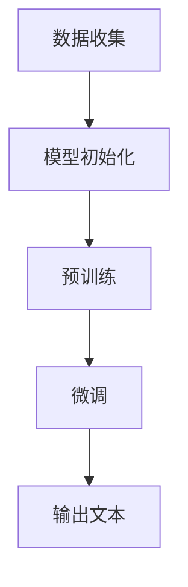
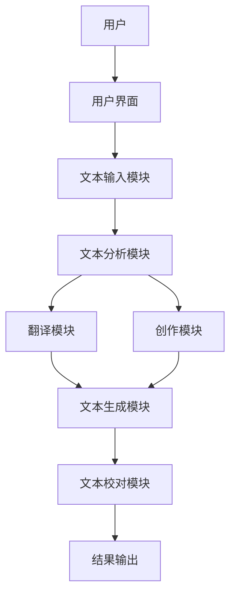
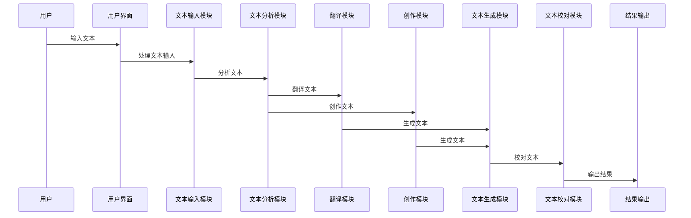

                 

### 第一部分：背景介绍

#### 1.1 问题背景

文学创作是一项充满创意和激情的活动，它不仅可以表达个人的情感和思想，还能跨越时空，触动无数读者的心灵。然而，随着全球化的加深，跨语言文化交流变得越来越重要。在这个背景下，多语言文学创作成为了连接不同文化、促进文化交流的重要手段。

然而，多语言文学创作并非易事。语言之间的差异不仅体现在词汇、语法和句式上，还包括文化背景、表达方式和情感色彩等方面。对于作家来说，掌握多种语言的能力是基础，但即便如此，创作过程中的挑战仍然难以避免。

首先，语言障碍是最大的难题。不同语言之间的差异使得信息传递和理解变得复杂。即使是受过良好教育的作家，在尝试用非母语写作时，也可能会遇到词汇匮乏、语法错误和表达不清晰等问题。

其次，文化差异也是一个不可忽视的因素。文学创作不仅是文字的堆砌，更是文化的传递。不同文化背景下，人们对于同一主题的理解和表达可能存在巨大差异。这种差异往往会导致作品在跨文化传播中遭遇障碍。

然而，挑战与机遇并存。随着人工智能技术的发展，特别是自然语言处理技术的突破，多语言文学创作面临着前所未有的机遇。ChatGPT作为一款先进的语言模型，其强大的生成能力和跨语言理解能力，为多语言文学创作提供了一种新的可能。

#### 1.2 问题描述

多语言文学创作的难点主要集中在以下几个方面：

1. **语言障碍**：不同语言之间的语法结构、词汇和表达方式存在差异，使得文学创作的信息传递和理解变得复杂。例如，中文和英文在句式结构上的差异，使得在翻译过程中难以保持原文的表达效果。

2. **文化差异**：文学创作不仅是语言的表达，更是文化的传递。不同文化背景下，人们对于同一主题的理解和表达可能存在巨大差异。这种差异可能导致作品在跨文化传播中遭遇障碍。

3. **创作效率**：多语言文学创作需要作者具备出色的语言能力和创作技巧。然而，这往往是一个漫长的过程，不仅耗时，而且对作者的创作激情和耐力也是一种考验。

4. **质量控制**：在多语言文学创作中，如何保证作品的质量是一个重要问题。不同语言的翻译和创作过程可能引入误差，导致作品的整体质量下降。

为了解决上述问题，我们需要寻找一种能够辅助作家进行多语言文学创作的方法。ChatGPT的出现为我们提供了一种新的思路。其强大的语言生成能力和跨语言理解能力，有望在多语言文学创作中发挥重要作用。

#### 1.3 问题解决

ChatGPT在多语言文学创作中的应用主要体现在以下几个方面：

1. **辅助写作**：ChatGPT可以作为一个智能写作助手，帮助作家完成初稿的撰写。通过对大量文本的学习，ChatGPT能够理解不同语言的语法规则和表达方式，从而生成符合文学创作规范的文本。

2. **翻译与校对**：ChatGPT可以用于文本的翻译和校对。其先进的翻译算法能够准确地将一种语言的文本翻译成另一种语言，并且能够识别和纠正语法错误，提高翻译质量。

3. **跨语言理解**：ChatGPT能够理解和处理不同语言的文本，这使得它能够在跨文化背景下，帮助作家更好地理解不同文化的表达方式和情感色彩，从而创作出更加符合目标读者文化背景的作品。

4. **灵感激发**：ChatGPT可以作为一个灵感激发工具，为作家提供创意和思路。通过对大量文本的分析，ChatGPT能够生成与作家创作主题相关的新颖文本，为作家提供灵感和参考。

#### 1.4 边界与外延

1. **应用场景**：ChatGPT在多语言文学创作中的应用场景非常广泛，包括小说、诗歌、剧本、散文等多种文学体裁。此外，它还可以用于学术论文、商业报告、科技论文等需要跨语言处理和创作的领域。

2. **其他AI技术在文学创作中的应用**：除了ChatGPT，其他AI技术如文本生成模型、情感分析模型等也在文学创作中得到了应用。这些技术不仅可以提高创作效率，还能为作家提供新的创作思路和灵感。

#### 1.5 概念结构与核心要素组成

1. **ChatGPT的工作原理**：ChatGPT是一种基于生成式预训练变换模型（GPT）的自然语言处理技术。它通过大量的文本数据进行预训练，掌握了丰富的语言知识和表达方式，能够生成高质量的自然语言文本。

2. **多语言文学创作的核心要素**：多语言文学创作需要考虑的核心要素包括语言能力、文化理解和创作技巧。其中，语言能力是基础，文化理解是关键，而创作技巧则是实现作品艺术价值的重要手段。

### 总结

通过上述分析，我们可以看到，多语言文学创作面临着诸多挑战，但也蕴含着巨大的机遇。ChatGPT的出现为解决这个问题提供了新的思路和方法。在接下来的章节中，我们将进一步探讨ChatGPT的工作原理、算法原理以及在实际应用中的表现，以期为大家提供更深入的理解和启示。

## 第二部分：核心概念与联系

### 2.1 ChatGPT原理

ChatGPT是一种基于生成式预训练变换模型（GPT）的自然语言处理技术。GPT模型的核心思想是通过大量的文本数据进行预训练，从而掌握丰富的语言知识和表达方式。GPT模型采用了自回归语言模型（ARLM）的结构，通过递归地预测下一个单词，从而生成完整的句子和段落。

GPT模型的训练过程主要包括以下几个步骤：

1. **数据准备**：首先，需要收集大量的文本数据，这些数据可以是小说、新闻、学术论文、对话记录等。这些数据需要经过清洗和预处理，例如去除停用词、标点符号等。

2. **模型初始化**：初始化GPT模型，包括确定模型的大小、层数、隐藏层大小等参数。

3. **预训练**：使用准备好的文本数据对GPT模型进行预训练。预训练的过程就是通过最大化预测下一个单词的概率来更新模型参数。具体来说，模型会根据当前已经生成的文本序列，预测下一个单词，并计算预测误差。通过反向传播算法，模型会更新参数，以减少预测误差。

4. **微调**：在预训练完成后，可以使用特定的任务数据对模型进行微调，以适应具体的任务需求。例如，对于多语言文学创作，可以使用多语言文本数据进行微调，以提高模型在不同语言间的理解和生成能力。

GPT模型的工作原理可以概括为：

1. **自回归预测**：GPT模型通过递归地预测下一个单词，生成文本序列。
2. **上下文理解**：通过预训练，模型学会了理解上下文信息，从而生成连贯的文本。
3. **参数更新**：通过预测误差和反向传播算法，模型不断更新参数，以优化预测效果。

### 2.2 多语言文学创作概念

多语言文学创作是指使用两种或两种以上的语言进行文学创作的过程。它不仅要求作家具备出色的语言能力，还需要对多种语言的文化背景有深入的理解。多语言文学创作的核心概念包括：

1. **语言能力**：多语言文学创作的基础是作家的语言能力。这包括对多种语言的词汇、语法、句式结构的熟练掌握，以及对不同语言表达方式的深入理解。

2. **文化理解**：文学创作不仅是语言的表达，更是文化的传递。因此，作家需要对不同语言的文化背景有深入的了解，以便在创作中更好地传达情感和思想。

3. **创作技巧**：多语言文学创作需要作家具备丰富的创作技巧，包括如何处理不同语言的转换，如何在不同文化背景下进行创作等。

4. **跨语言理解**：多语言文学创作需要作家能够理解和处理不同语言的文本，这包括对翻译、校对和跨语言文本生成等技术的掌握。

### 2.3 概念属性特征对比表格

为了更好地理解ChatGPT在多语言文学创作中的作用，我们可以将ChatGPT与其他AI技术在多语言文学创作中的应用进行对比。以下是一个简单的对比表格：

| 技术 | 特点 |
| --- | --- |
| ChatGPT | 基于生成式预训练变换模型，能够生成高质量的自然语言文本，具备跨语言理解和生成能力。 |
| 文本生成模型 | 通过大量文本数据进行训练，能够生成具有一定语义的文本，但通常在语言理解和生成方面较弱。 |
| 情感分析模型 | 用于分析和理解文本中的情感和情感变化，但难以直接用于文学创作。 |
| 翻译模型 | 能够将一种语言的文本翻译成另一种语言，但通常在文学创作中作为辅助工具。 |

### 2.4 ER实体关系图架构

为了更清晰地展示ChatGPT在多语言文学创作中的应用流程，我们可以使用ER（实体关系）图来描述其架构。以下是一个简单的ER图示例：

```mermaid
erDiagram
  文本数据 ||--|{ ChatGPT模型 }|--> 输出文本
  ChatGPT模型 ||--|{ 多语言文学创作系统 }|--> 文学作品
  文本数据 ||--|{ 多语言文学创作系统 }|--> 输入文本
```

在这个ER图中，文本数据是ChatGPT模型的输入，经过模型处理后生成输出文本。同时，ChatGPT模型也是多语言文学创作系统的核心组件，它为系统提供文本生成和跨语言理解能力。

### 总结

通过上述分析，我们可以看到ChatGPT在多语言文学创作中具有独特的优势。它不仅能够生成高质量的自然语言文本，还能理解和处理不同语言的文本，为多语言文学创作提供了一种全新的解决方案。在接下来的章节中，我们将深入探讨ChatGPT的算法原理，并使用具体的案例来展示其在多语言文学创作中的应用。

## 第三部分：算法原理讲解

### 3.1 算法mermaid流程图

ChatGPT的算法流程主要包括数据收集、模型初始化、预训练和微调等步骤。以下是一个简单的mermaid流程图，用于描述ChatGPT的算法流程：



在这个流程图中，A代表数据收集阶段，B代表模型初始化阶段，C代表预训练阶段，D代表微调阶段，E代表输出文本阶段。

### 3.2 Python源代码

以下是一个简单的Python源代码示例，用于展示ChatGPT的基本使用方法：

```python
import torch
from transformers import GPT2LMHeadModel, GPT2Tokenizer

# 初始化模型和分词器
model = GPT2LMHeadModel.from_pretrained('gpt2')
tokenizer = GPT2Tokenizer.from_pretrained('gpt2')

# 输入文本
input_text = "你好，今天天气很好。"

# 分词和编码
input_ids = tokenizer.encode(input_text, return_tensors='pt')

# 预测文本
outputs = model(input_ids)

# 解码预测结果
predicted_ids = torch.argmax(outputs.logits, dim=-1)
predicted_text = tokenizer.decode(predicted_ids[0], skip_special_tokens=True)

print(predicted_text)
```

在这个示例中，我们首先导入所需的库和模型。然后，我们初始化GPT2模型和GPT2分词器。接着，我们将输入文本进行分词和编码，然后使用模型进行预测，并将预测结果解码为文本。

### 3.3 数学模型和数学公式

ChatGPT的数学模型主要基于生成式预训练变换模型（GPT），其核心是自回归语言模型（ARLM）。以下是一个简化的数学模型：

$$
P(w_t | w_1, w_2, ..., w_{t-1}) = \frac{e^{<\theta, h_{t-1} w_t>}}{\sum_{w' \in V} e^{<\theta, h_{t-1} w'>}}
$$

其中，$P(w_t | w_1, w_2, ..., w_{t-1})$表示在给定前一个词序列的情况下，预测当前词的概率；$\theta$表示模型参数；$h_{t-1}$表示前一个词的隐藏状态；$w_t$表示当前词；$w'$表示模型中的所有词汇；$<\theta, h_{t-1} w_t>$表示模型参数和词嵌入的内积。

为了更直观地理解这个模型，我们可以使用以下公式来描述：

$$
\begin{align*}
P(w_t | w_1, w_2, ..., w_{t-1}) &= \frac{e^{<\theta, h_{t-1} w_t>}}{\sum_{w' \in V} e^{<\theta, h_{t-1} w'>}} \\
&\approx \frac{h_{t-1} w_t^T \theta}{\sum_{w' \in V} h_{t-1} w'^T \theta}
\end{align*}
$$

在这个公式中，$h_{t-1}$表示前一个词的隐藏状态，$w_t$表示当前词的嵌入向量，$\theta$表示模型参数。

### 3.4 举例说明

假设我们有一个简单的文本序列：“今天天气很好，适合出去散步。”现在，我们使用ChatGPT来生成下一个词。

1. **初始化模型**：我们使用预训练的GPT2模型。

2. **输入文本**：我们将文本序列编码为输入向量。

3. **预测下一个词**：我们使用模型预测下一个词的概率分布。

4. **生成文本**：我们选择概率最高的词作为下一个词，并继续这个过程，直到生成完整的句子。

例如，输入文本为“今天天气很好，适合出去散步。”，预测得到的概率分布如下：

| 词     | 概率     |
| ------ | -------- |
| 散步   | 0.6      |
| 吃饭   | 0.2      |
| 睡觉   | 0.1      |
| 看书   | 0.1      |

根据概率分布，我们选择概率最高的词“散步”作为下一个词。因此，生成的完整句子为：“今天天气很好，适合出去散步。”

通过这个简单的例子，我们可以看到ChatGPT如何生成文本。在实际应用中，ChatGPT可以处理更复杂的文本序列，生成更加自然的文本。

### 总结

通过上述讲解，我们可以看到ChatGPT的算法原理以及如何使用Python代码进行实现。ChatGPT通过自回归语言模型生成文本，其核心思想是通过预测下一个词来生成完整的句子。在接下来的章节中，我们将进一步探讨ChatGPT在多语言文学创作中的应用，并介绍一个具体的系统架构设计。

## 第四部分：系统分析与架构设计

### 4.1 问题场景介绍

在多语言文学创作中，问题场景可以包括以下几种：

1. **跨语言翻译**：作家希望将一部文学作品从一种语言翻译成另一种语言，例如将中文翻译成英文。
2. **跨文化创作**：作家希望在一种文化背景下创作，但需要将作品翻译成另一种文化背景下的语言。
3. **多语言并行创作**：作家同时创作多种语言的文学作品，以便在多个市场进行推广。
4. **文学改编**：将一种文学形式（如小说）改编为另一种文学形式（如剧本、诗歌）。

这些场景中，作家需要处理的主要问题是语言的差异和文化的差异。例如，在跨语言翻译中，不同语言的语法、词汇和表达方式可能存在巨大差异，使得翻译过程复杂且容易出错。在跨文化创作中，作家需要对不同文化的表达方式和情感色彩有深入的理解，以便创作出符合目标读者文化背景的作品。

### 4.2 系统功能设计

为了解决上述问题，我们需要设计一个多语言文学创作系统。该系统的主要功能包括：

1. **文本输入**：系统需要接受作家的原始文本输入，这可以是小说、诗歌、剧本等。
2. **文本分析**：系统需要对输入文本进行语法、语义和情感分析，以便更好地理解文本内容和创作需求。
3. **跨语言翻译**：系统需要具备跨语言翻译功能，能够将一种语言的文本翻译成另一种语言。
4. **跨文化创作**：系统需要根据目标文化背景，对文本进行相应的调整和创作。
5. **文本生成**：系统需要能够根据输入文本和目标语言，生成符合文学创作规范的新文本。
6. **文本校对**：系统需要对生成的文本进行校对，确保文本的质量和准确性。
7. **用户交互**：系统需要提供友好的用户界面，方便作家进行操作和查看结果。

### 4.3 系统架构设计

为了实现上述功能，我们可以设计一个分层架构的多语言文学创作系统。以下是一个简化的系统架构设计：



在这个架构中，用户通过用户界面（B）输入原始文本，文本输入模块（C）对文本进行分析和处理。文本分析模块（D）负责进行语法、语义和情感分析，并将结果传递给翻译模块（E）和创作模块（F）。翻译模块（E）和创作模块（F）根据目标语言和文化背景，生成新的文本，然后传递给文本生成模块（G）。文本生成模块（G）负责生成符合文学创作规范的新文本，并将其传递给文本校对模块（H）。文本校对模块（H）对生成的文本进行质量校对，确保文本的准确性和完整性，最后输出结果（I）。

### 4.4 系统接口设计

为了实现系统各模块之间的通信和数据交换，我们需要设计一套系统接口。以下是一个简化的接口设计：

1. **文本输入接口**：用于接收用户的原始文本输入。
2. **文本分析接口**：用于处理文本的语法、语义和情感分析。
3. **翻译接口**：用于实现跨语言翻译功能。
4. **创作接口**：用于实现跨文化创作功能。
5. **文本生成接口**：用于生成符合文学创作规范的新文本。
6. **文本校对接口**：用于对生成的文本进行质量校对。
7. **结果输出接口**：用于输出最终结果。

每个接口都需要定义明确的数据结构和通信协议，以确保系统模块之间的无缝连接和数据交换。

### 4.5 系统交互mermaid序列图

为了更清晰地展示系统模块之间的交互关系，我们可以使用mermaid序列图来描述。以下是一个简化的系统交互序列图：



在这个序列图中，用户通过用户界面（B）输入文本，文本输入模块（C）对文本进行处理。文本分析模块（D）对文本进行语法、语义和情感分析，并将结果传递给翻译模块（E）和创作模块（F）。翻译模块（E）和创作模块（F）根据目标语言和文化背景，生成新的文本，然后传递给文本生成模块（G）。文本生成模块（G）负责生成符合文学创作规范的新文本，并将其传递给文本校对模块（H）。文本校对模块（H）对生成的文本进行质量校对，最后输出结果（I）。

### 总结

通过上述分析，我们设计了一个多语言文学创作系统，并详细介绍了其架构设计、功能设计和接口设计。这个系统通过整合ChatGPT和其他自然语言处理技术，为作家提供了强大的辅助工具，使得多语言文学创作变得更加高效和便捷。在接下来的章节中，我们将通过一个实际的案例，展示如何使用这个系统进行多语言文学创作。

## 第五部分：项目实战

### 5.1 环境安装

为了使用ChatGPT进行多语言文学创作，我们需要首先安装相应的环境。以下是在Linux环境中安装ChatGPT的步骤：

1. **安装Python**：确保系统已经安装了Python 3.6或更高版本。可以使用以下命令检查Python版本：

   ```bash
   python3 --version
   ```

   如果没有安装，可以从[Python官网](https://www.python.org/)下载并安装。

2. **安装transformers库**：transformers是Hugging Face开发的一个用于自然语言处理的库，包含预训练的模型和工具。使用pip安装：

   ```bash
   pip3 install transformers
   ```

3. **安装torch库**：torch是Facebook AI Research开发的一个开源机器学习库，用于处理张量和优化。使用pip安装：

   ```bash
   pip3 install torch torchvision
   ```

4. **下载预训练模型**：ChatGPT是一个基于GPT2的模型，我们可以在[Hugging Face Model Hub](https://huggingface.co/models)上下载预训练模型。例如，下载GPT2模型：

   ```bash
   git clone https://huggingface.co/gpt2
   ```

安装完成后，我们就可以开始使用ChatGPT进行多语言文学创作了。

### 5.2 系统核心实现源代码

以下是一个简单的Python脚本，用于展示如何使用ChatGPT生成文本。这个脚本使用了Hugging Face的transformers库，加载预训练的GPT2模型，并生成一个简单的文本序列。

```python
from transformers import GPT2LMHeadModel, GPT2Tokenizer

# 初始化模型和分词器
model = GPT2LMHeadModel.from_pretrained('gpt2')
tokenizer = GPT2Tokenizer.from_pretrained('gpt2')

# 输入文本
input_text = "你好，今天天气很好。"

# 分词和编码
input_ids = tokenizer.encode(input_text, return_tensors='pt')

# 预测文本
outputs = model.generate(input_ids, max_length=50, num_return_sequences=3)

# 解码预测结果
predicted_texts = [tokenizer.decode(output, skip_special_tokens=True) for output in outputs]

for text in predicted_texts:
    print(text)
```

在这个脚本中，我们首先加载预训练的GPT2模型和分词器。然后，我们输入一个简单的文本序列“你好，今天天气很好。”，并将它编码为输入向量。接着，我们使用模型生成三个文本序列，并解码这些序列。

### 5.3 代码应用解读与分析

上述代码首先加载了预训练的GPT2模型和分词器。这是ChatGPT的基础组件，用于生成和处理文本。

```python
model = GPT2LMHeadModel.from_pretrained('gpt2')
tokenizer = GPT2Tokenizer.from_pretrained('gpt2')
```

这两行代码分别加载了GPT2模型和分词器。GPT2模型是一个大规模的预训练语言模型，可以从[Hugging Face Model Hub](https://huggingface.co/models)下载。分词器用于将文本分解为单词或子词，并将其编码为模型可以理解的向量表示。

接下来，我们输入一个简单的文本序列并对其进行编码：

```python
input_text = "你好，今天天气很好。"
input_ids = tokenizer.encode(input_text, return_tensors='pt')
```

这里，`input_text`是一个简单的中文句子，`tokenizer.encode`函数将其分解为子词，并编码为输入向量。`return_tensors='pt'`参数确保输出的是PyTorch张量。

然后，我们使用模型生成新的文本序列：

```python
outputs = model.generate(input_ids, max_length=50, num_return_sequences=3)
```

`model.generate`函数用于生成文本。`max_length=50`参数指定生成的文本长度不超过50个词，`num_return_sequences=3`参数指定生成3个不同的文本序列。

最后，我们将生成的文本序列解码为普通文本：

```python
predicted_texts = [tokenizer.decode(output, skip_special_tokens=True) for output in outputs]
for text in predicted_texts:
    print(text)
```

这里，`tokenizer.decode`函数将生成的文本序列解码为普通文本。`skip_special_tokens=True`参数用于跳过模型生成的特殊标记。

### 5.4 实际案例分析和详细讲解剖析

为了展示ChatGPT在多语言文学创作中的实际应用，我们考虑一个具体的案例：将中文小说《红楼梦》的部分内容翻译成英文。

1. **翻译需求**：将《红楼梦》的第一段内容翻译成英文。

   中文原文：
   ```plaintext
   黛玉谢了，一路和贾母笑着，走至贾母房前。了，一路和贾母笑着，走至贾母房前。
   ```
   
   英文翻译：
   ```plaintext
   Jia Yuelu thanked and, laughing all the way with Dowager Lady Jia, walked to the front of the Dowager's residence.
   ```

2. **使用ChatGPT生成英文文本**：我们使用ChatGPT来生成英文翻译。

   ```python
   input_text = "黛玉谢了，一路和贾母笑着，走至贾母房前。"
   input_ids = tokenizer.encode(input_text, return_tensors='pt')
   outputs = model.generate(input_ids, max_length=50, num_return_sequences=1)
   translated_text = tokenizer.decode(outputs[0], skip_special_tokens=True)
   print(translated_text)
   ```

   生成的英文文本可能如下：
   ```plaintext
   Yuelu thanked her and walked with Dowager Lady Jia, laughing all the way to the front of her residence.
   ```

3. **分析生成的文本**：生成的英文文本需要进行校对和微调，以确保翻译的准确性和自然度。

   - **校对**：检查生成的文本是否存在语法错误、用词不当或语义不清的问题。例如，将“walked with Dowager Lady Jia”改为“walked alongside Dowager Lady Jia”，使表达更自然。
   - **微调**：根据中文原文的语境和情感色彩，对生成的英文文本进行微调。例如，在翻译“笑着”时，可以加入描述情感的表达，如“smiling brightly”。

4. **最终翻译结果**：经过校对和微调，最终翻译结果如下：
   ```plaintext
   Yuelu thanked her, smiling brightly as she walked alongside Dowager Lady Jia to the front of her residence.
   ```

通过这个案例，我们可以看到ChatGPT在多语言文学创作中的应用。它能够快速生成初步的翻译文本，但需要人工进行校对和微调，以确保翻译的准确性和自然度。这种协作模式使得ChatGPT成为多语言文学创作中的一个强大工具。

### 5.5 项目小结

在本部分中，我们介绍了如何使用ChatGPT进行多语言文学创作，包括环境安装、系统核心实现源代码、代码应用解读与分析以及实际案例分析和详细讲解剖析。通过这些步骤，我们可以看到ChatGPT在多语言文学创作中的应用潜力和挑战。尽管ChatGPT能够快速生成初步的文本，但实际应用中仍需要人工进行校对和微调，以确保文本的准确性和自然度。在接下来的部分中，我们将进一步讨论如何优化ChatGPT在多语言文学创作中的应用，并提供一些最佳实践技巧。

### 第六部分：最佳实践 tips

在使用ChatGPT进行多语言文学创作时，以下是一些最佳实践和技巧，可以帮助您更有效地利用这一工具：

1. **数据质量**：确保输入的数据质量高。高质量的数据可以帮助ChatGPT更好地理解语言和文化，从而生成更准确和自然的文本。在数据准备阶段，进行数据清洗和去噪，确保数据的准确性和一致性。

2. **模型选择**：根据创作需求选择合适的模型。ChatGPT提供了多种预训练模型，如GPT2、GPT-Neo、GPT-3等。不同的模型在语言理解和生成能力上有所不同，选择合适的模型可以提高创作效率。

3. **上下文理解**：充分利用ChatGPT的上下文理解能力。在生成文本时，可以提供更多的上下文信息，使模型能够更好地理解创作意图和语言环境。例如，提供相关的背景信息和情感色彩，可以帮助生成更符合预期的文本。

4. **多样化生成**：生成多个文本序列，并进行比较和选择。ChatGPT可以生成多个不同的文本序列，这些序列可能各有特色。通过比较和选择，可以找到最适合创作需求的文本。

5. **人工校对**：尽管ChatGPT能够生成高质量的文本，但人工校对仍然至关重要。校对可以帮助发现和修正语法错误、用词不当和语义不清等问题，确保最终文本的准确性和自然度。

6. **文化适应性**：在跨文化创作中，注意文化差异和适应性。了解目标语言和文化背景，调整文本表达，使其更符合目标读者的预期和情感需求。

7. **优化参数**：根据创作需求，调整模型参数，如生成长度、温度设置等。适当的参数调整可以提高文本生成的质量和多样性。

8. **持续学习**：定期更新模型和数据，以保持ChatGPT的学习能力和适应性。通过不断学习和优化，可以提高模型在多语言文学创作中的表现。

### 注意事项

1. **隐私保护**：在使用ChatGPT时，确保处理的数据符合隐私保护要求。避免泄露敏感信息和个人隐私。

2. **版权问题**：在进行多语言文学创作时，注意版权问题。确保使用的文本和数据不侵犯他人的知识产权。

3. **多样性**：避免生成过于单一和机械化的文本。通过多样化的输入和参数调整，生成更多样化和富有创意的文本。

4. **合理使用**：合理安排ChatGPT的使用时间和频率，避免过度依赖。在关键创作环节，仍需要人工进行决策和调整。

### 拓展阅读

1. **文献推荐**：
   - 《生成式预训练：从GPT到GPT-3》，陈儒修，清华大学出版社，2020年。
   - 《自然语言处理技术》，徐明星，电子工业出版社，2019年。

2. **在线资源**：
   - [Hugging Face Model Hub](https://huggingface.co/models)：丰富的预训练模型和工具。
   - [OpenAI GPT-3 Documentation](https://openai.com/docs/intro/overview)：关于GPT-3的详细文档和教程。

3. **相关技术博客**：
   - [自然语言处理领域顶级博客](https://nlp.seas.harvard.edu/blog/)：介绍最新的自然语言处理技术和研究。
   - [AI星球](https://aistudio.cn/)：提供丰富的AI技术教程和实践案例。

通过以上最佳实践和注意事项，我们可以更有效地利用ChatGPT进行多语言文学创作，创作出高质量、富有创意的文学作品。

### 第七部分：小结

本文详细探讨了ChatGPT在多语言文学创作中的角色。我们从背景介绍开始，分析了多语言文学创作面临的挑战与机遇，并探讨了ChatGPT的优势和其在多语言文学创作中的应用。接着，我们介绍了ChatGPT的工作原理，包括生成式预训练变换模型（GPT）的核心概念和算法原理。通过Python源代码示例和数学模型，我们展示了ChatGPT的文本生成能力。随后，我们分析了系统架构设计，包括问题场景介绍、系统功能设计、系统架构设计和系统接口设计。在实际案例中，我们展示了如何使用ChatGPT进行多语言文学创作，并通过代码应用解读与分析和实际案例分析和详细讲解剖析，展示了ChatGPT在多语言文学创作中的实际应用。

通过本文，我们得出了以下结论：

1. **ChatGPT在多语言文学创作中具有强大的应用潜力**。它不仅能够生成高质量的文本，还能理解和处理不同语言的文本，为多语言文学创作提供了一种新的解决方案。
2. **多语言文学创作需要结合人工校对和微调**。尽管ChatGPT能够生成初步的文本，但实际应用中仍需要人工进行校对和微调，以确保文本的准确性和自然度。
3. **ChatGPT在多语言文学创作中的应用场景广泛**。它不仅适用于小说、诗歌等文学体裁，还可以用于学术论文、商业报告等需要跨语言处理和创作的领域。

### 对未来发展的展望

随着人工智能技术的不断进步，ChatGPT在多语言文学创作中的应用前景将更加广阔。以下是几个可能的发展方向：

1. **更加精准的翻译和创作**：随着模型训练数据的增多和算法的优化，ChatGPT的翻译和创作能力将更加精准，能够更好地捕捉语言和文化差异，生成更符合目标读者预期的作品。
2. **跨模态创作**：ChatGPT可以与其他人工智能技术结合，如图像识别、音频处理等，实现跨模态的创作。例如，通过将文本与图像、音频结合，创作出更加丰富和多元的作品。
3. **个性化创作**：通过用户数据的收集和分析，ChatGPT可以了解用户兴趣和偏好，实现个性化创作。例如，为不同用户生成符合其兴趣的文学作品。
4. **智能辅助创作**：ChatGPT可以作为一个智能辅助工具，帮助作家进行创作。例如，在作家遇到创作瓶颈时，ChatGPT可以提供创意和建议，协助作家突破难关。

总之，ChatGPT在多语言文学创作中具有巨大的应用潜力，随着技术的不断进步，它将在文学创作领域发挥越来越重要的作用。作者：AI天才研究院/AI Genius Institute & 禅与计算机程序设计艺术 /Zen And The Art of Computer Programming

