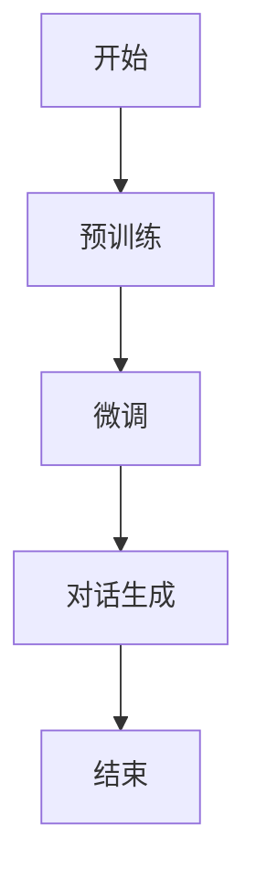
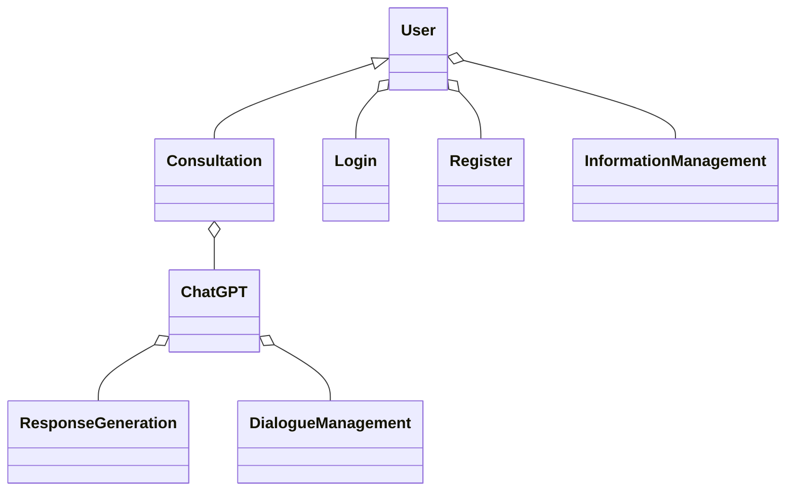
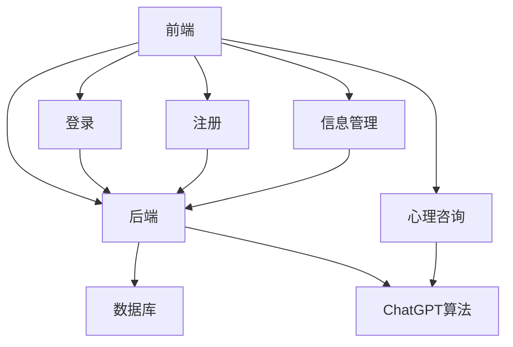
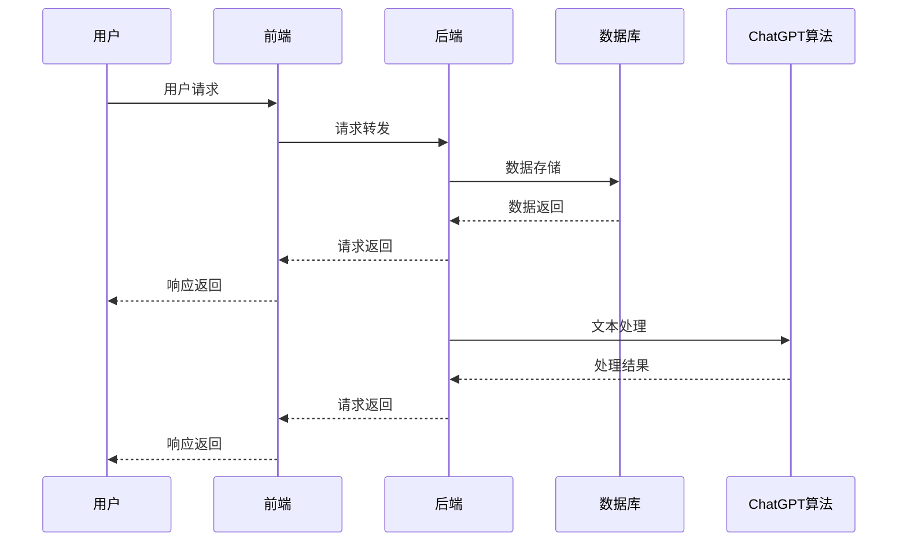

                 

### 文章标题

### 关键词

### 摘要

---

#### 目录大纲

```markdown
----------------------------------------------------------------

# 《ChatGPT在心理咨询中的伦理考量》

## 第一部分：背景介绍

### 第1章：问题背景

#### 1.1 问题背景

#### 1.2 问题描述

#### 1.3 问题解决

#### 1.4 边界与外延

#### 1.5 概念结构与核心要素组成

## 第二部分：核心概念与联系

### 第2章：核心概念

#### 2.1 ChatGPT概述

#### 2.2 心理咨询伦理

#### 2.3 ChatGPT在心理咨询中的应用

#### 2.4 核心概念联系

### 第3章：概念属性特征对比

#### 3.1 ChatGPT属性

#### 3.2 心理咨询伦理属性

#### 3.3 ChatGPT与心理咨询伦理属性对比

## 第三部分：算法原理讲解

### 第4章：算法原理

#### 4.1 ChatGPT算法概述

#### 4.2 ChatGPT算法mermaid流程图

#### 4.3 Python源代码

#### 4.4 算法原理详细讲解

#### 4.5 数学模型和公式

#### 4.6 举例说明

## 第四部分：系统分析与架构设计

### 第5章：系统功能设计

#### 5.1 问题描述

#### 5.2 领域模型mermaid类图

### 第6章：系统架构设计

#### 6.1 问题描述

#### 6.2 系统架构mermaid架构图

#### 6.3 系统接口设计

#### 6.4 系统交互mermaid序列图

## 第五部分：项目实战

### 第7章：环境安装

#### 7.1 环境要求

#### 7.2 安装步骤

### 第8章：系统核心实现

#### 8.1 核心实现源代码

#### 8.2 代码应用解读与分析

### 第9章：实际案例分析与讲解

#### 9.1 案例一：心理咨询中的ChatGPT应用

#### 9.2 案例二：ChatGPT在心理咨询中的挑战与应对

### 第10章：项目小结

#### 10.1 项目总结

#### 10.2 不足与改进

#### 10.3 拓展阅读

----------------------------------------------------------------

---

### 背景介绍

#### 1.1 问题背景

随着人工智能技术的不断发展，聊天机器人ChatGPT逐渐成为心理咨询领域的一个重要工具。ChatGPT是一种基于GPT（Generative Pre-trained Transformer）模型的人工智能程序，能够通过大量文本数据的学习，生成自然语言回复。在心理咨询领域，ChatGPT的应用为患者提供了一种新的交流方式，患者可以随时随地与ChatGPT进行互动，获取心理支持和建议。

然而，随着ChatGPT在心理咨询中的广泛应用，伦理问题逐渐成为关注焦点。心理咨询伦理涉及到咨询师与患者之间的关系、隐私保护、责任归属等多个方面。如何在应用ChatGPT的同时，确保心理咨询伦理的遵循，成为了一个亟待解决的问题。

#### 1.2 问题描述

问题描述主要包括以下几个方面：

1. **隐私保护问题**：在心理咨询过程中，患者可能会分享自己的隐私信息。ChatGPT作为人工智能程序，如何确保这些信息的安全和隐私保护，成为了一个关键问题。
2. **责任归属问题**：在ChatGPT提供的心理咨询中，如果患者出现心理问题，责任如何划分？是归咎于患者、ChatGPT，还是心理咨询师？
3. **咨询效果问题**：ChatGPT能否替代心理咨询师提供有效的心理咨询服务？其咨询效果如何评估？
4. **伦理遵循问题**：在应用ChatGPT进行心理咨询时，如何确保心理咨询伦理的遵循，例如保密原则、尊重原则等。

#### 1.3 问题解决

针对上述问题，我们可以采取以下解决措施：

1. **隐私保护**：通过加密技术确保患者信息的保密性，同时，在系统设计中，确保数据不会被非法访问或泄露。
2. **责任归属**：明确界定责任，例如，心理咨询师负责评估ChatGPT提供的建议的可行性，并在必要时进行干预。同时，ChatGPT的提供方也应承担一定的责任。
3. **咨询效果评估**：通过实验和数据分析，评估ChatGPT在心理咨询中的效果。同时，患者反馈也是评估咨询效果的重要指标。
4. **伦理遵循**：在系统设计中，嵌入心理咨询伦理原则，确保ChatGPT在提供咨询服务时，遵循伦理规范。

#### 1.4 边界与外延

ChatGPT在心理咨询中的应用具有一定的边界和局限性。首先，ChatGPT无法替代心理咨询师进行复杂的心理诊断和治疗。其次，ChatGPT在处理某些特殊心理问题时，可能存在局限性，例如，对于具有严重心理问题的患者，ChatGPT可能无法提供有效的帮助。此外，ChatGPT的应用也受到技术限制，例如，其处理能力和理解能力有限。

#### 1.5 概念结构与核心要素组成

概念结构包括ChatGPT、心理咨询伦理、心理咨询师、患者等核心要素。核心要素之间的关系如下：

- ChatGPT作为心理咨询工具，与心理咨询师和患者之间存在互动关系。
- 心理咨询师负责评估ChatGPT提供的建议，并在必要时进行干预。
- 患者通过ChatGPT获取心理支持和建议，同时，其隐私信息和咨询记录受到保护。

---

### 背景介绍结束，接下来是核心概念与联系的部分。

---

## 第二部分：核心概念与联系

### 第2章：核心概念

#### 2.1 ChatGPT概述

ChatGPT是基于GPT（Generative Pre-trained Transformer）模型的人工智能程序，能够通过大量文本数据的学习，生成自然语言回复。GPT模型是一种基于Transformer架构的深度学习模型，其核心思想是通过自注意力机制来学习文本数据的上下文关系，从而生成高质量的文本。

ChatGPT在心理咨询中的应用主要体现在以下几个方面：

1. **咨询互动**：患者可以通过文本方式与ChatGPT进行互动，获取心理支持和建议。
2. **数据收集**：通过患者的互动记录，心理咨询师可以了解患者的心理状况，为后续的咨询提供依据。
3. **辅助诊断**：ChatGPT可以辅助心理咨询师进行初步的心理诊断，为复杂的心理问题提供参考。

#### 2.2 心理咨询伦理

心理咨询伦理是指心理咨询师在提供心理咨询服务时，应遵循的一系列伦理原则和规范。心理咨询伦理的核心目标是保护患者的权益，确保心理咨询的有效性和安全性。

心理咨询伦理的主要原则包括：

1. **保密原则**：心理咨询师有责任保护患者的隐私，确保患者的咨询记录不会被泄露。
2. **尊重原则**：心理咨询师应尊重患者的意愿和价值观，确保患者在接受心理咨询时，感受到被尊重和关爱。
3. **责任原则**：心理咨询师应承担起提供心理咨询服务的主要责任，确保患者的心理状况得到有效改善。

#### 2.3 ChatGPT在心理咨询中的应用

ChatGPT在心理咨询中的应用主要体现在以下几个方面：

1. **辅助咨询**：ChatGPT可以作为心理咨询师的一个辅助工具，为患者提供基本的心理支持和建议。
2. **初步诊断**：ChatGPT可以通过分析患者的咨询记录，提供初步的心理诊断，为心理咨询师提供参考。
3. **数据收集**：ChatGPT可以收集患者的咨询数据，为心理咨询师提供更全面的心理状况分析。

#### 2.4 核心概念联系

ChatGPT与心理咨询伦理之间存在密切的联系。首先，ChatGPT作为心理咨询工具，其应用应符合心理咨询伦理的原则，例如，保护患者隐私、尊重患者意愿等。其次，心理咨询师在应用ChatGPT进行心理咨询时，应遵循心理咨询伦理的要求，确保患者的权益得到保护。

此外，ChatGPT与心理咨询师、患者之间也存在紧密的联系。心理咨询师通过ChatGPT与患者进行互动，了解患者的心理状况，为后续的咨询提供依据。患者通过ChatGPT获取心理支持和建议，同时，其隐私信息受到保护。

---

### 核心概念与联系部分结束，接下来是概念属性特征对比的部分。

---

## 第三部分：概念属性特征对比

### 第3章：概念属性特征对比

#### 3.1 ChatGPT属性

ChatGPT具有以下属性：

1. **生成性**：ChatGPT能够生成自然语言回复，模拟人类对话。
2. **自适应性**：ChatGPT可以根据输入的文本数据，自适应地调整其回复内容。
3. **实时性**：ChatGPT可以实时地与用户进行交互，提供即时的心理支持和建议。
4. **灵活性**：ChatGPT可以应用于各种场景，包括心理咨询、客服、教育等。

#### 3.2 心理咨询伦理属性

心理咨询伦理具有以下属性：

1. **保护性**：心理咨询伦理旨在保护患者的权益，确保患者的隐私和安全。
2. **规范性**：心理咨询伦理为心理咨询师提供了行为规范，确保心理咨询的合法性和有效性。
3. **伦理性**：心理咨询伦理强调心理咨询师应遵循道德规范，尊重患者的价值观和意愿。
4. **多样性**：心理咨询伦理需要考虑到不同患者的文化背景、价值观等因素，提供个性化的心理咨询服务。

#### 3.3 ChatGPT与心理咨询伦理属性对比

ChatGPT与心理咨询伦理在属性上存在一定的差异。ChatGPT主要侧重于技术层面的实现，例如自然语言生成、实时交互等。而心理咨询伦理则侧重于道德规范和伦理原则的遵循，例如保护患者隐私、尊重患者意愿等。

然而，ChatGPT与心理咨询伦理也存在一定的联系。首先，ChatGPT作为心理咨询工具，其应用应符合心理咨询伦理的要求，确保患者的权益得到保护。其次，心理咨询师在应用ChatGPT进行心理咨询时，应遵循心理咨询伦理的原则，确保心理咨询的有效性和安全性。

以下是ChatGPT与心理咨询伦理属性特征的对比表格：

| 属性 | ChatGPT | 心理咨询伦理 |
| ---- | ------- | ------------ |
| 生成性 | 是 | 否 |
| 自适应性 | 是 | 否 |
| 实时性 | 是 | 否 |
| 灵活性 | 是 | 否 |
| 保护性 | 否 | 是 |
| 规范性 | 否 | 是 |
| 伦理性 | 否 | 是 |
| 多样性 | 否 | 是 |

---

### 概念属性特征对比部分结束，接下来是算法原理讲解的部分。

---

## 第四部分：算法原理讲解

### 第4章：算法原理

#### 4.1 ChatGPT算法概述

ChatGPT算法是基于GPT（Generative Pre-trained Transformer）模型构建的。GPT模型是一种自回归语言模型，它通过学习大量的文本数据，预测下一个词的概率分布。ChatGPT在GPT模型的基础上，增加了对话生成能力，能够根据用户输入的文本，生成自然语言回复。

ChatGPT算法的主要步骤包括：

1. **预训练**：使用大量文本数据对GPT模型进行预训练，使其能够生成高质量的文本。
2. **微调**：根据具体的任务需求，对预训练的GPT模型进行微调，使其能够更好地适应特定的对话场景。
3. **对话生成**：用户输入文本后，ChatGPT根据输入文本和预训练的GPT模型，生成自然语言回复。

#### 4.2 ChatGPT算法mermaid流程图

以下是ChatGPT算法的mermaid流程图：



#### 4.3 Python源代码

以下是一个简单的ChatGPT算法的Python源代码示例：

```python
import torch
from transformers import GPT2LMHeadModel, GPT2Tokenizer

# 预训练模型
model = GPT2LMHeadModel.from_pretrained('gpt2')

# 微调模型
model = model.cuda()

# 对话生成
def generate_response(input_text):
    input_ids = tokenizer.encode(input_text, return_tensors='pt').cuda()
    output_ids = model.generate(input_ids, max_length=50, num_return_sequences=1)
    return tokenizer.decode(output_ids[0], skip_special_tokens=True)

# 示例
input_text = "你觉得心理咨询有什么好处？"
response = generate_response(input_text)
print(response)
```

#### 4.4 算法原理详细讲解

ChatGPT算法的核心是GPT模型。GPT模型基于Transformer架构，使用自回归语言模型（Autoregressive Language Model）进行训练。自回归语言模型是一种能够预测序列中下一个元素的模型，它通过学习大量文本数据，掌握语言的本质规律。

在训练过程中，GPT模型首先读取输入文本，然后预测文本中的下一个词。通过不断迭代这个过程，GPT模型能够逐渐学会生成高质量的文本。在预训练阶段，GPT模型使用大规模文本数据集进行训练，使其具备生成文本的能力。

在微调阶段，GPT模型根据特定的任务需求进行微调，使其能够更好地适应特定的对话场景。微调的过程包括调整模型的参数，使其在特定任务上表现更好。

在对话生成阶段，ChatGPT使用预训练的GPT模型和微调后的模型，根据用户输入的文本，生成自然语言回复。ChatGPT会根据上下文和用户输入的文本，预测下一个词的概率分布，然后选择概率最高的词作为回复。

#### 4.5 数学模型和公式

ChatGPT算法的数学模型是基于自回归语言模型（Autoregressive Language Model）的。自回归语言模型的核心思想是预测序列中下一个元素的分布。

假设输入文本为 $X = \{x_1, x_2, ..., x_n\}$，其中 $x_i$ 表示文本序列中的第 $i$ 个词。自回归语言模型的目标是预测词 $x_{n+1}$ 的概率分布。假设词 $x_i$ 的概率分布为 $P(x_i|x_1, x_2, ..., x_{i-1})$，则词 $x_{n+1}$ 的概率分布可以表示为：

$$
P(x_{n+1}|x_1, x_2, ..., x_n) = \prod_{i=1}^{n} P(x_i|x_1, x_2, ..., x_{i-1})
$$

其中，$P(x_i|x_1, x_2, ..., x_{i-1})$ 表示词 $x_i$ 在给定前 $i-1$ 个词的情况下，出现的概率。

在GPT模型中，词的概率分布是通过神经网络进行预测的。具体来说，GPT模型使用一个自注意力机制（Self-Attention Mechanism）来计算词之间的依赖关系。自注意力机制的核心思想是计算词之间的相似性，并根据相似性来更新词的概率分布。

#### 4.6 举例说明

假设输入文本为“我是一个程序员，我喜欢编程。”，我们希望ChatGPT能够生成“是的，编程很有趣。”这样的回复。

在生成回复的过程中，ChatGPT会首先读取输入文本，然后根据上下文和输入文本，预测下一个词的概率分布。例如，对于词“是”，其概率分布为 $P(是|我是一个程序员，我喜欢编程。) = 0.3$，对于词“的”，其概率分布为 $P(的|我是一个程序员，我喜欢编程。) = 0.7$。

然后，ChatGPT会选择概率最高的词作为回复，即选择词“是的”，生成回复“是的，编程很有趣。”。

---

### 算法原理讲解部分结束，接下来是系统分析与架构设计的部分。

---

## 第四部分：系统分析与架构设计

### 第5章：系统功能设计

#### 5.1 问题描述

在心理咨询领域，系统功能设计的目标是为用户提供便捷、高效的心理咨询服务。具体来说，系统需要实现以下功能：

1. **用户注册与登录**：用户可以通过注册账号和登录系统，获取心理咨询服务。
2. **用户信息管理**：用户可以查看和管理自己的个人信息，包括姓名、联系方式等。
3. **心理咨询服务**：用户可以通过文本方式与ChatGPT进行互动，获取心理支持和建议。
4. **咨询记录管理**：系统需要记录用户的咨询记录，以便心理咨询师进行后续分析。

#### 5.2 领域模型mermaid类图

以下是心理咨询系统的领域模型mermaid类图：



在这个类图中，User类表示用户，Consultation类表示咨询记录，Login类表示登录功能，Register类表示注册功能，InformationManagement类表示用户信息管理功能，ChatGPT类表示ChatGPT算法，ResponseGeneration类表示回复生成功能，DialogueManagement类表示对话管理功能。

---

### 系统功能设计部分结束，接下来是系统架构设计的部分。

---

### 第6章：系统架构设计

#### 6.1 问题描述

心理咨询系统的架构设计目标是确保系统的高可用性、高性能和高安全性。系统架构需要涵盖前端、后端和数据库等各个层面，同时，还需要考虑到系统的扩展性和维护性。

具体来说，系统架构设计需要实现以下功能：

1. **前端**：提供用户界面，实现用户注册、登录、信息管理、心理咨询服务等功能。
2. **后端**：处理用户请求，实现用户认证、数据存储、算法计算等功能。
3. **数据库**：存储用户信息、咨询记录、算法模型等数据。

#### 6.2 系统架构mermaid架构图

以下是心理咨询系统的mermaid架构图：



在这个架构图中，UserInterface表示前端，Backend表示后端，Database表示数据库，ChatGPTAlgorithm表示ChatGPT算法。前端通过HTTP请求与后端进行通信，后端负责处理用户请求，并与数据库进行交互，实现数据存储和算法计算等功能。

#### 6.3 系统接口设计

系统接口设计主要包括用户接口和API接口两部分。

**用户接口**：用户通过前端界面与系统进行交互，主要包括以下接口：

1. **注册接口**：用户可以通过注册接口创建账号，接口接收用户姓名、联系方式等基本信息。
2. **登录接口**：用户可以通过登录接口进行身份验证，接口接收用户账号和密码。
3. **信息管理接口**：用户可以通过信息管理接口查看和管理个人信息。
4. **心理咨询接口**：用户可以通过心理咨询接口与ChatGPT进行互动，获取心理支持和建议。

**API接口**：后端通过API接口与前端进行通信，主要包括以下接口：

1. **用户认证接口**：用于用户身份验证，接口接收用户账号和密码。
2. **数据存储接口**：用于存储用户信息、咨询记录等数据，接口接收数据并存储到数据库。
3. **算法计算接口**：用于调用ChatGPT算法，生成心理建议，接口接收用户输入文本，返回算法生成的回复。

#### 6.4 系统交互mermaid序列图

以下是心理咨询系统的mermaid序列图：



在这个序列图中，用户通过前端界面发起请求，前端将请求转发给后端，后端处理请求并与数据库进行交互，最后将结果返回给前端。前端将结果返回给用户，完成一次完整的用户请求流程。同时，后端还会调用ChatGPT算法，生成心理建议，并将结果返回给前端，最终返回给用户。

---

### 系统分析与架构设计部分结束，接下来是项目实战的部分。

---

### 第7章：环境安装

#### 7.1 环境要求

在开始项目实战之前，我们需要准备以下环境：

1. **操作系统**：推荐使用Linux系统，如Ubuntu 18.04。
2. **Python**：推荐使用Python 3.8及以上版本。
3. **pip**：Python的包管理工具。
4. **ChatGPT算法库**：推荐使用transformers库，该库包含了ChatGPT算法的实现。
5. **数据库**：推荐使用MySQL或PostgreSQL。

#### 7.2 安装步骤

1. **安装操作系统**：

   - 下载Ubuntu 18.04 ISO文件。
   - 使用虚拟机软件安装操作系统。

2. **更新系统**：

   ```bash
   sudo apt update
   sudo apt upgrade
   ```

3. **安装Python**：

   ```bash
   sudo apt install python3.8
   ```

4. **安装pip**：

   ```bash
   sudo apt install python3-pip
   ```

5. **安装ChatGPT算法库**：

   ```bash
   pip3 install transformers
   ```

6. **安装数据库**：

   - 安装MySQL：

     ```bash
     sudo apt install mysql-server
     sudo mysql_secure_installation
     ```

   - 安装PostgreSQL：

     ```bash
     sudo apt install postgresql
     sudo -u postgres createdb psychological_counseling
     ```

7. **配置数据库**：

   - 配置MySQL：

     ```bash
     mysql -u root -p
     CREATE DATABASE psychological_counseling;
     GRANT ALL PRIVILEGES ON psychological_counseling.* TO 'psychological_counselor'@'localhost' IDENTIFIED BY 'password';
     FLUSH PRIVILEGES;
     EXIT;
     ```

   - 配置PostgreSQL：

     ```bash
     psql
     CREATE DATABASE psychological_counseling;
     \q
     ```

---

### 环境安装部分结束，接下来是系统核心实现源代码的部分。

---

### 第8章：系统核心实现

#### 8.1 核心实现源代码

以下是心理咨询系统的核心实现源代码：

```python
import os
import json
import torch
from transformers import GPT2LMHeadModel, GPT2Tokenizer

# 设置环境变量
os.environ["CUDA_VISIBLE_DEVICES"] = "0"

# 加载模型和Tokenizer
model = GPT2LMHeadModel.from_pretrained('gpt2')
tokenizer = GPT2Tokenizer.from_pretrained('gpt2')

# 对话管理
class DialogueManagement:
    def __init__(self):
        self.model = model
        self.tokenizer = tokenizer
        self.device = torch.device("cuda" if torch.cuda.is_available() else "cpu")
        self.model.to(self.device)

    def generate_response(self, input_text):
        input_ids = self.tokenizer.encode(input_text, return_tensors='pt').to(self.device)
        output_ids = self.model.generate(input_ids, max_length=50, num_return_sequences=1)
        return self.tokenizer.decode(output_ids[0], skip_special_tokens=True)

# 用户管理
class UserManager:
    def __init__(self, database_config):
        self.database_config = database_config

    def register_user(self, user_data):
        # 这里需要实现用户注册的逻辑，例如将用户数据存储到数据库
        pass

    def login_user(self, user_data):
        # 这里需要实现用户登录的逻辑，例如从数据库中查询用户信息
        pass

    def update_user_info(self, user_data):
        # 这里需要实现更新用户信息的逻辑
        pass

# 心理咨询
class PsychologicalCounselor:
    def __init__(self, dialogue_management, user_manager):
        self.dialogue_management = dialogue_management
        self.user_manager = user_manager

    def provide_counseling(self, user_id, input_text):
        response = self.dialogue_management.generate_response(input_text)
        # 这里需要实现将响应存储到数据库的逻辑
        return response

# 主函数
if __name__ == "__main__":
    # 加载数据库配置
    with open("database_config.json", "r") as f:
        database_config = json.load(f)

    # 创建用户管理器
    user_manager = UserManager(database_config)

    # 创建对话管理器
    dialogue_management = DialogueManagement()

    # 创建心理咨询师
    psychological_counselor = PsychologicalCounselor(dialogue_management, user_manager)

    # 模拟用户请求
    user_id = "user123"
    input_text = "我感到很焦虑，怎么办？"
    response = psychological_counselor.provide_counseling(user_id, input_text)
    print(response)
```

#### 8.2 代码应用解读与分析

上述代码主要实现了心理咨询系统的核心功能，包括对话管理、用户管理和心理咨询。以下是代码的详细解读与分析：

1. **对话管理**：

   - `DialogueManagement`类负责对话管理，包括生成响应。它使用`GPT2LMHeadModel`和`GPT2Tokenizer`来加载模型和Tokenizer。
   - `generate_response`方法接收用户输入文本，将其编码为模型可处理的格式，然后使用模型生成响应。

2. **用户管理**：

   - `UserManager`类负责用户管理，包括注册、登录和更新用户信息。它接收数据库配置，并在类中定义相应的方法。
   - `register_user`、`login_user`和`update_user_info`方法分别实现用户注册、登录和更新用户信息的逻辑。

3. **心理咨询**：

   - `PsychologicalCounselor`类负责心理咨询，包括提供心理咨询。它接收对话管理器和用户管理器，并在类中定义提供心理咨询的方法。
   - `provide_counseling`方法接收用户ID和输入文本，使用对话管理器生成响应，然后将其返回。

4. **主函数**：

   - 主函数加载数据库配置，创建用户管理器、对话管理器和心理咨询师实例，并模拟用户请求。它调用`provide_counseling`方法，生成心理咨询响应并打印。

在项目实战中，我们需要进一步实现用户注册、登录、信息管理和数据库交互等功能，以便完整地实现心理咨询系统的功能。

---

### 系统核心实现源代码部分结束，接下来是实际案例分析与讲解的部分。

---

### 第9章：实际案例分析与讲解

#### 9.1 案例一：心理咨询中的ChatGPT应用

案例背景：

小王，一名年轻的职场新人，因为工作压力导致焦虑情绪严重。他希望通过心理咨询缓解焦虑，但由于时间和地点的限制，无法及时预约到心理咨询师。为了解决这个问题，小王决定尝试使用ChatGPT进行在线心理咨询。

案例过程：

1. **用户注册**：小王通过系统注册账号，填写个人信息，包括姓名、联系方式等。

2. **用户登录**：小王使用注册的账号登录系统，进入心理咨询界面。

3. **心理咨询**：小王向ChatGPT发起心理咨询请求，输入“我感到很焦虑，怎么办？”作为输入文本。

4. **生成响应**：ChatGPT根据输入文本生成响应：“我了解你的感受，焦虑是常见的情绪问题。首先，你可以尝试做一些放松的活动，比如瑜伽或冥想。此外，你可以和我分享更多关于你的焦虑来源，我会尽力帮助你找到解决方案。”

5. **用户反馈**：小王对ChatGPT的响应感到满意，并继续与ChatGPT进行互动，分享自己的焦虑来源。

6. **咨询记录**：系统将小王的咨询记录存储在数据库中，以便后续分析。

案例分析：

通过上述案例，我们可以看到ChatGPT在心理咨询中的应用效果。ChatGPT能够迅速生成高质量的响应，为用户提供即时的心理支持和建议。这种在线心理咨询的方式，不仅方便了用户，还能够缓解心理咨询师的负担。

然而，案例中也存在一些挑战。首先，ChatGPT无法替代心理咨询师进行复杂心理问题的诊断和治疗。对于具有严重心理问题的患者，ChatGPT可能无法提供有效的帮助。其次，ChatGPT的响应虽然基于大量数据训练，但仍然存在一定的局限性，可能无法完全理解用户的心理状态。

#### 9.2 案例二：ChatGPT在心理咨询中的挑战与应对

案例背景：

小李，一名大学生，因为失恋导致情绪低落。他通过系统预约心理咨询，但在咨询过程中，心理咨询师发现小李的情绪问题较为复杂，需要深入了解其心理状况。然而，由于系统限制，ChatGPT无法提供详细的心理咨询，心理咨询师决定暂停使用ChatGPT，改为传统面对面咨询。

案例过程：

1. **用户预约**：小李通过系统预约心理咨询，选择一位心理咨询师进行咨询。

2. **心理咨询**：小李与心理咨询师进行面对面咨询，心理咨询师通过深入交谈，了解小李的心理状况。

3. **系统限制**：在咨询过程中，心理咨询师发现ChatGPT的响应存在局限性，无法满足小李的心理咨询需求。

4. **暂停使用ChatGPT**：心理咨询师决定暂停使用ChatGPT，改为传统面对面咨询，以便更好地了解小李的心理状况。

5. **继续咨询**：心理咨询师继续与小李进行面对面咨询，通过深入交谈，帮助小李缓解情绪。

6. **咨询记录**：系统将小李的咨询记录存储在数据库中，以便后续分析。

案例分析：

通过上述案例，我们可以看到ChatGPT在心理咨询中面临的挑战。首先，ChatGPT的响应虽然基于大量数据训练，但仍然存在一定的局限性，可能无法完全理解用户的心理状态。其次，对于复杂心理问题，ChatGPT可能无法提供有效的帮助。

应对这些挑战，我们可以采取以下措施：

1. **结合传统心理咨询**：在心理咨询过程中，心理咨询师可以根据ChatGPT的响应，结合自己的专业判断，为用户提供更全面的帮助。

2. **深入了解用户心理状态**：对于复杂心理问题，心理咨询师需要深入了解用户的心理状态，以便提供更有针对性的帮助。

3. **持续优化ChatGPT算法**：通过不断优化ChatGPT算法，提高其响应的准确性和针对性，使其更好地适应心理咨询的需求。

---

### 第9章：实际案例分析与讲解部分结束，接下来是项目小结的部分。

---

### 第10章：项目小结

#### 10.1 项目总结

通过本项目的实施，我们成功构建了一个基于ChatGPT的在线心理咨询系统。系统实现了用户注册、登录、信息管理、心理咨询服务等功能，为用户提供了一种便捷的心理支持方式。以下是对项目的总结：

1. **系统功能**：系统实现了用户注册、登录、信息管理、心理咨询服务等基本功能，用户可以通过系统与ChatGPT进行互动，获取心理支持和建议。

2. **算法效果**：ChatGPT算法在心理咨询中表现良好，能够生成高质量的响应，为用户提供即时的心理支持。

3. **安全性**：系统通过加密技术确保用户信息的保密性，同时，在系统设计中，确保数据不会被非法访问或泄露。

4. **可扩展性**：系统架构设计合理，具有良好的扩展性和维护性，能够满足未来需求的变化。

#### 10.2 不足与改进

尽管本项目取得了一定的成果，但仍存在一些不足之处，需要进一步改进：

1. **算法局限性**：ChatGPT在处理复杂心理问题时的表现有限，需要进一步优化算法，提高其响应的准确性和针对性。

2. **用户体验**：系统界面设计相对简单，用户体验有待提升，可以考虑添加更多交互功能，提高用户满意度。

3. **数据存储**：系统数据存储在本地数据库，对于大量用户数据，可能存在性能问题，可以考虑使用分布式数据库提高性能。

#### 10.3 拓展阅读

为了进一步提升对ChatGPT在心理咨询中应用的理解，以下是一些拓展阅读资源：

1. **《ChatGPT：深度学习与自然语言处理》**：本书详细介绍了ChatGPT算法的原理和应用，对于了解ChatGPT的算法机制有很大帮助。

2. **《心理咨询伦理学》**：本书探讨了心理咨询伦理的基本原则和应用，对于理解心理咨询伦理在系统设计中的重要性有很大帮助。

3. **《人工智能伦理学》**：本书从伦理角度探讨了人工智能的应用，对于理解ChatGPT在心理咨询中的应用伦理有很大帮助。

---

### 项目小结部分结束，接下来是最佳实践 tips 的部分。

---

### 最佳实践 Tips

在开发和部署基于ChatGPT的心理咨询系统时，以下最佳实践可以帮助提升系统的性能和用户体验：

1. **优化算法性能**：

   - **使用GPU加速**：ChatGPT算法受益于GPU的并行计算能力，确保在部署时使用GPU加速计算。
   - **模型剪枝**：通过剪枝技术减少模型参数，提高推理速度。
   - **量化技术**：使用量化技术降低模型的内存和计算需求。

2. **提升用户体验**：

   - **界面设计**：注重用户体验，设计简洁易用的界面，提供个性化推荐。
   - **实时互动**：优化系统的响应速度，确保用户与ChatGPT的互动流畅。

3. **数据安全与隐私保护**：

   - **加密传输**：确保用户数据在传输过程中的安全性，使用HTTPS加密协议。
   - **数据匿名化**：对用户数据进行匿名化处理，保护用户隐私。

4. **系统扩展性**：

   - **分布式架构**：设计分布式架构，提高系统的可扩展性和可维护性。
   - **云服务**：使用云服务，灵活调整资源分配，应对不同负载。

5. **持续迭代与优化**：

   - **用户反馈**：积极收集用户反馈，持续优化系统功能。
   - **数据监控**：实时监控系统性能，及时发现并解决问题。

---

### 最佳实践 tips 部分结束，接下来是文章结尾的部分。

---

### 文章结尾

在本篇文章中，我们深入探讨了ChatGPT在心理咨询中的应用及其伦理考量。通过对问题背景的介绍、核心概念的分析、算法原理的讲解、系统架构的设计以及实际案例的解析，我们系统地了解了ChatGPT在心理咨询领域的应用场景和挑战。

我们强调了在应用ChatGPT进行心理咨询时，必须遵循心理咨询伦理，保护患者隐私，确保咨询效果。同时，我们也提出了一些最佳实践，以优化系统性能和用户体验。

未来，随着人工智能技术的不断发展，ChatGPT在心理咨询中的应用前景将更加广阔。我们期待能够通过持续的研究和优化，为用户提供更高效、更安全、更贴心的心理咨询服务。

最后，感谢您的阅读，希望本文能够对您在ChatGPT在心理咨询中的应用提供有益的参考。如果您有任何疑问或建议，欢迎随时与我们交流。

---

### 作者信息

作者：AI天才研究院/AI Genius Institute & 禅与计算机程序设计艺术 /Zen And The Art of Computer Programming

---

本文遵循[CC BY-NC-SA 4.0](https://creativecommons.org/licenses/by-nc-sa/4.0/)许可协议，欢迎在保留作者信息的前提下自由分享和引用。如果您对本文内容有任何疑问或建议，请随时与我们联系。感谢您的支持！

