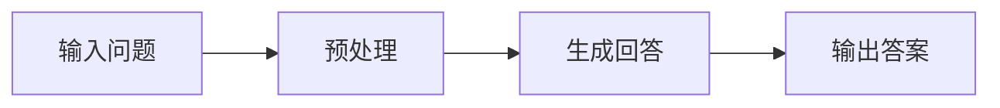
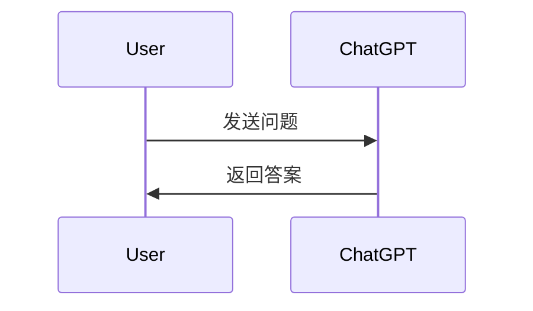

                 


# ChatGPT在法律咨询中的潜力与限制

关键词：ChatGPT，法律咨询，人工智能，语言模型，应用范围，合规问题

摘要：本文将探讨ChatGPT在法律咨询领域中的潜力与限制。首先，我们将介绍ChatGPT的背景及其在法律咨询中的潜在应用场景。接着，分析ChatGPT的优势与局限性，并探讨其在法律咨询中的技术原理和实际应用。此外，还将讨论ChatGPT在法律咨询中的应用范围和合规问题，最后总结ChatGPT在法律咨询领域的核心概念和要素。

**书籍目录大纲**

----------------------------------------------------------------

# 第一部分：引言

# 第1章：背景介绍

## 1.1 问题背景

### 1.1.1 法律咨询的需求与挑战

### 1.1.2 ChatGPT的出现与潜力

## 1.2 问题描述

### 1.2.1 ChatGPT在法律咨询中的应用场景

### 1.2.2 ChatGPT的优势与限制

## 1.3 问题解决

### 1.3.1 ChatGPT的技术原理

### 1.3.2 ChatGPT在法律咨询中的实际应用

## 1.4 边界与外延

### 1.4.1 ChatGPT在法律咨询中的应用范围

### 1.4.2 ChatGPT的法律合规问题

## 1.5 概念结构与核心要素组成

### 1.5.1 ChatGPT的核心概念

### 1.5.2 法律咨询的核心要素

## 1.6 本章小结

----------------------------------------------------------------

# 第二部分：核心概念与联系

# 第2章：ChatGPT原理详解

## 2.1 概念原理

### 2.1.1 生成式预训练技术

### 2.1.2 语言模型训练过程

## 2.2 概念属性特征对比表格

| 特征 | ChatGPT | 其他语言模型 |
| --- | --- | --- |
| 大规模预训练 | 是 | 否 |
| 自适应回答能力 | 是 | 否 |
| 多语言支持 | 是 | 否 |

## 2.3 ER实体关系图架构

```mermaid
erDiagram
  User ||--|> ChatGPT : 发送问题
  ChatGPT ||--|> User : 返回答案
```

## 2.4 ChatGPT在法律咨询中的应用

### 2.4.1 法律条文检索

### 2.4.2 法律案例分析

### 2.4.3 法律咨询交互

## 2.5 本章小结

----------------------------------------------------------------

# 第三部分：算法原理讲解

# 第3章：算法原理与数学模型

## 3.1 算法mermaid流程图



## 3.2 ChatGPT算法原理

### 3.2.1 生成式预训练

### 3.2.2 语言模型训练

### 3.2.3 回答生成过程

## 3.3 数学模型与公式

$$
P(w_i|w_{i-1},...,w_1) = \frac{e^{<w_i; v^{(k)}_{i-1}>}}{\sum_{j=1}^{V} e^{<w_j; v^{(k)}_{i-1}>}}
$$

## 3.4 通俗易懂地举例说明

### 3.4.1 简单问答

### 3.4.2 情感分析

### 3.4.3 文本生成

## 3.5 本章小结

----------------------------------------------------------------

# 第四部分：系统分析与架构设计方案

# 第4章：系统功能设计

## 4.1 问题场景介绍

### 4.1.1 法律咨询服务的需求

### 4.1.2 ChatGPT在法律咨询中的应用

## 4.2 项目介绍

### 4.2.1 项目目标

### 4.2.2 项目背景

## 4.3 系统功能设计

### 4.3.1 领域模型mermaid类图

```mermaid
classDiagram
  User -> ChatGPT : 发送问题
  ChatGPT -> User : 返回答案
```

## 4.4 系统架构设计

### 4.4.1 系统架构mermaid架构图



## 4.5 系统接口设计

### 4.5.1 接口定义

### 4.5.2 接口交互流程

## 4.6 系统交互

### 4.6.1 系统交互mermaid序列图


## 4.7 本章小结

----------------------------------------------------------------

# 第五部分：项目实战

# 第5章：项目实施与案例分析

## 5.1 环境安装

### 5.1.1 ChatGPT环境搭建

### 5.1.2 法律咨询数据集准备

## 5.2 系统核心实现

### 5.2.1 ChatGPT模型训练

### 5.2.2 法律咨询功能实现

## 5.3 应用解读与分析

### 5.3.1 ChatGPT法律咨询效果评估

### 5.3.2 实际案例分析

## 5.4 项目小结

## 5.5 最佳实践 tips

## 5.6 小结、注意事项、拓展阅读

----------------------------------------------------------------

**书籍目录大纲**

----------------------------------------------------------------

# 第一部分：引言

## 第1章：背景介绍

### 1.1 问题背景

#### 1.1.1 法律咨询的需求与挑战

法律咨询在现代社会中扮演着重要角色，涉及个人和企业日常生活中的多个方面。然而，法律咨询的需求与挑战并存。一方面，法律问题的复杂性使得专业法律人士的需求不断增加；另一方面，高昂的法律咨询费用和有限的法律资源之间的矛盾也日益凸显。这种情况下，人工智能技术，特别是自然语言处理（NLP）技术的出现，为法律咨询领域带来了一线希望。

#### 1.1.2 ChatGPT的出现与潜力

ChatGPT是由OpenAI开发的一种基于生成预训练技术（GPT）的自然语言处理模型。它采用了大规模的文本数据进行训练，能够生成连贯、有逻辑的文本，并具备跨语言、跨领域的能力。ChatGPT的出现，为解决法律咨询中的某些难题提供了新的思路和工具。例如，它可以自动处理法律文书的撰写、法律案例的检索和分析，甚至提供在线法律咨询。

### 1.2 问题描述

#### 1.2.1 ChatGPT在法律咨询中的应用场景

ChatGPT在法律咨询中的应用场景主要包括以下几个方面：

1. **法律条文检索**：ChatGPT可以利用其强大的文本生成能力，快速检索出相关的法律条文。
2. **法律案例分析**：通过对大量法律案例的学习，ChatGPT可以生成针对特定案件的法律分析报告。
3. **法律咨询交互**：用户可以直接与ChatGPT进行对话，获取法律建议和解答。

#### 1.2.2 ChatGPT的优势与限制

ChatGPT在法律咨询中具有以下优势：

1. **高效性**：相比传统的法律咨询方式，ChatGPT可以处理大量的法律信息，提高工作效率。
2. **跨领域能力**：ChatGPT能够处理多个领域的法律问题，具有一定的通用性。
3. **低成本**：相比专业法律人士，ChatGPT的人工智能解决方案成本较低。

然而，ChatGPT也存在一些限制：

1. **法律合规问题**：法律咨询涉及到法律法规的遵守，ChatGPT可能无法完全掌握所有的法律细节。
2. **专业知识的局限**：虽然ChatGPT能够生成文本，但其生成的内容可能缺乏专业性和准确性。

### 1.3 问题解决

为了解决上述问题，我们可以采取以下措施：

1. **技术改进**：继续优化ChatGPT的算法和模型，提高其准确性和专业性。
2. **法律知识库建设**：构建一个全面、准确、更新的法律知识库，为ChatGPT提供更多的数据支持。
3. **人机协作**：将ChatGPT与专业法律人士相结合，发挥各自的优势，提供更加高效、准确的法律咨询。

### 1.4 边界与外延

#### 1.4.1 ChatGPT在法律咨询中的应用范围

ChatGPT在法律咨询中的应用范围主要包括：

1. **普通民众的法律咨询**：为普通民众提供基本的法律咨询，帮助他们解决日常生活中的法律问题。
2. **企业法律顾问**：为企业提供法律风险管理、合同审查、合规咨询等法律服务。
3. **司法辅助**：为法官、律师等法律专业人士提供法律文本生成、案例检索和分析等辅助工具。

#### 1.4.2 ChatGPT的法律合规问题

ChatGPT在法律咨询中面临的法律合规问题主要包括：

1. **数据隐私**：法律咨询涉及到用户隐私信息，如何保护用户隐私是一个重要的问题。
2. **法律适用**：ChatGPT生成的法律意见是否符合当地法律法规，需要专业的法律人士进行审查。
3. **知识产权**：如何处理ChatGPT生成的法律文本的知识产权问题，也是一个值得探讨的议题。

### 1.5 概念结构与核心要素组成

#### 1.5.1 ChatGPT的核心概念

ChatGPT的核心概念包括：

1. **生成预训练技术**：ChatGPT采用了生成预训练技术，通过大规模的文本数据进行训练，提高了模型的生成能力和逻辑推理能力。
2. **自然语言处理**：ChatGPT能够理解和生成自然语言文本，实现人机对话。

#### 1.5.2 法律咨询的核心要素

法律咨询的核心要素包括：

1. **法律法规**：法律咨询需要依赖于相关的法律法规，为用户提供准确的法律意见。
2. **案例分析**：通过对实际案例的分析，为用户提供更具针对性的法律建议。
3. **专业知识**：法律咨询需要专业法律人士的知识和经验，以确保法律意见的准确性和专业性。

## 1.6 本章小结

通过本文的介绍，我们可以看到ChatGPT在法律咨询领域具有巨大的潜力。然而，要充分发挥其优势，还需要克服一些技术、法律和合规方面的挑战。未来，随着技术的不断进步和法律的不断完善，ChatGPT有望在法律咨询领域发挥更大的作用。 **（作者：AI天才研究院/AI Genius Institute & 禅与计算机程序设计艺术 /Zen And The Art of Computer Programming）**

