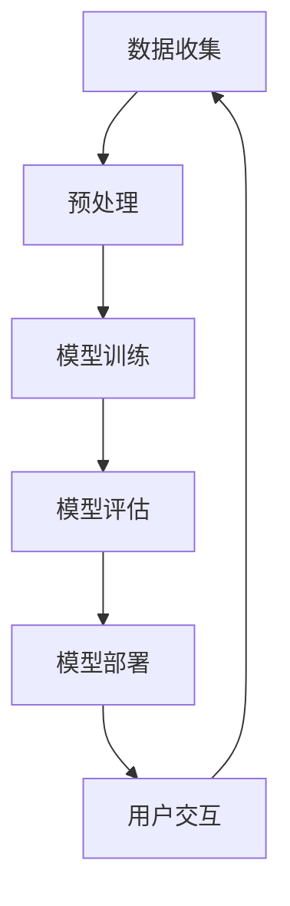
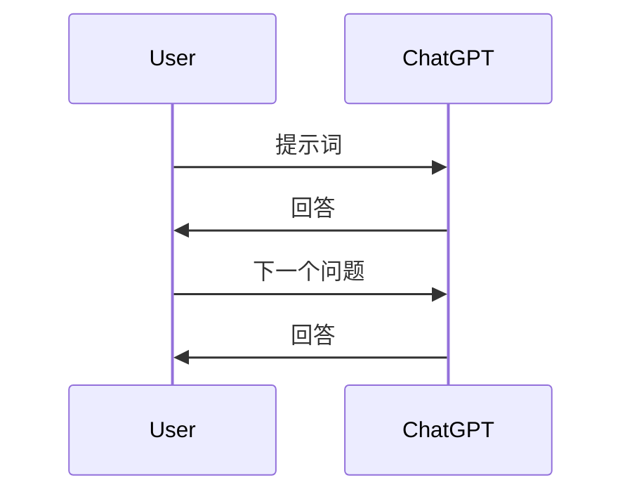

                 

# 《ChatGPT在科学普及中的应用：简明易懂的解释提示词》

## 关键词：ChatGPT、科学普及、人工智能、提示词、数学模型、算法原理

## 摘要：

本文将探讨ChatGPT在科学普及中的应用，通过简明易懂的解释提示词，帮助读者更好地理解这一先进的人工智能技术。文章将逐步分析ChatGPT的背景、核心概念、算法原理，并在科学普及中展示其实际应用。我们将使用Python代码、数学公式和Mermaid流程图等工具，以逻辑清晰、结构紧凑的方式，深入解析ChatGPT的工作机制和潜在价值。

---

## 第一部分：背景与概念

### 1.1 引言

随着人工智能技术的迅猛发展，科学普及逐渐成为了一项重要的社会任务。然而，复杂的技术概念和术语往往让普通大众难以理解。因此，寻找一种简明易懂的方式向公众传播科学知识变得尤为重要。《ChatGPT在科学普及中的应用：简明易懂的解释提示词》旨在通过ChatGPT这一先进的人工智能技术，解决科学传播中的难题。

### 1.2 科学普及的重要性

科学普及不仅有助于提升公众的科学素养，还能促进科技创新和社会进步。然而，传统科学传播方式往往存在形式单一、内容复杂等问题，难以吸引和满足不同年龄段、不同知识背景的读者需求。ChatGPT的出现，为科学普及提供了一种全新的可能性。

### 1.3 ChatGPT在科学普及中的应用潜力

ChatGPT是一种基于深度学习的语言生成模型，具有强大的自然语言理解和生成能力。通过合适的提示词，ChatGPT能够生成连贯、准确且具有逻辑性的回答。这种特性使得ChatGPT在科学普及中具有广泛的应用潜力，如自动撰写科普文章、提供科学咨询、辅助教育等。

---

## 第二部分：核心概念与联系

### 2.1 ChatGPT的基本原理

ChatGPT是基于GPT（Generative Pre-trained Transformer）模型开发的，是一种预训练的深度神经网络。它通过学习大量的文本数据，学会了如何生成连贯的自然语言文本。

### 2.2 ChatGPT与其他人工智能技术的比较

ChatGPT与其他人工智能技术（如搜索引擎、自然语言处理、机器学习等）有所不同。搜索引擎主要基于关键词匹配，而ChatGPT能够生成全新的文本内容。自然语言处理技术更侧重于文本分析和理解，而ChatGPT则能够生成自然流畅的文本。

### 2.3 ChatGPT在科学普及中的应用场景

ChatGPT在科学普及中的应用场景非常广泛，包括但不限于：

- 自动撰写科普文章
- 提供个性化的科学咨询
- 辅助科学教育，如智能问答系统
- 科学研究过程中的文献综述和数据分析

---

## 第三部分：算法原理讲解

### 3.1 ChatGPT的神经网络架构

ChatGPT的神经网络架构基于Transformer模型，这是一种具有多头自注意力机制的深度学习模型。Transformer模型的核心思想是利用自注意力机制，对输入的文本序列进行建模，从而生成具有连贯性和逻辑性的输出。

### 3.2 ChatGPT的训练过程

ChatGPT的训练过程包括两个阶段：预训练和微调。预训练阶段，ChatGPT学习从大量的文本数据中提取语言特征；微调阶段，ChatGPT根据特定的任务数据进行调整，以实现更好的性能。

### 3.3 ChatGPT的生成过程

在生成过程中，ChatGPT根据输入的提示词，利用预训练的模型生成连贯的文本。这个过程涉及了自注意力机制、位置编码、前向传递和反向传播等步骤。

## 数学模型和数学公式 & 详细讲解 & 举例说明

### 3.4 ChatGPT的数学模型

ChatGPT的数学模型主要基于自注意力机制和Transformer架构。以下是自注意力机制的数学公式：

$$
\text{Attention}(Q, K, V) = \text{softmax}\left(\frac{QK^T}{\sqrt{d_k}}\right)V
$$

其中，Q、K、V 分别代表查询向量、键向量和值向量，$d_k$ 是键向量的维度。

### 3.5 举例说明

假设我们有一个简短的科普提示词：“请解释相对论的基本原理。”使用ChatGPT，我们可以得到如下回答：

$$
\text{ChatGPT回答：} \\
\text{相对论是物理学中的一个重要理论，它由爱因斯坦于20世纪初提出。相对论分为两部分：狭义相对论和广义相对论。狭义相对论主要研究了在没有重力作用的情况下，时间和空间是如何相互关联的。而广义相对论则扩展了狭义相对论，将重力描述为时空的弯曲。相对论的提出对物理学、天文学以及整个科学领域产生了深远的影响。}
$$

通过这个例子，我们可以看到ChatGPT能够根据简短的提示词生成详细且准确的回答，这正是其在科学普及中具有的重要价值。

---

## 第四部分：系统架构设计与实现

### 4.1 系统架构设计

ChatGPT在科学普及中的应用需要一个完整的系统架构来支持。该架构包括数据收集、模型训练、模型部署和用户交互等模块。以下是系统架构的Mermaid流程图：



### 4.2 系统功能设计

系统功能设计包括以下几个部分：

- 数据收集：从各种来源（如科学文献、新闻、社交媒体等）收集科学相关的文本数据。
- 预处理：对收集到的数据进行清洗、去噪和格式化，以便于模型训练。
- 模型训练：使用预处理后的数据对ChatGPT模型进行训练，以提升其在科学领域的表现。
- 模型评估：评估模型的性能，包括准确性、连贯性和逻辑性等指标。
- 模型部署：将训练好的模型部署到服务器，以便用户可以随时使用。
- 用户交互：提供一个简洁易用的用户界面，让用户可以通过输入提示词获取科学相关的回答。

### 4.3 系统接口设计

系统接口设计主要包括API接口和Web界面。API接口用于与其他系统的集成，如教育平台、咨询平台等。Web界面则提供一个直观的交互界面，让用户可以轻松使用ChatGPT服务。

### 4.4 系统交互设计

系统交互设计主要关注用户如何与ChatGPT进行交互。用户可以通过输入提示词获取回答，也可以通过对话历史来引导ChatGPT生成更详细的回答。以下是系统交互的Mermaid序列图：



---

## 第五部分：项目实战：搭建ChatGPT科普平台

### 5.1 环境准备与安装

搭建ChatGPT科普平台需要安装以下环境：

- Python（版本3.7及以上）
- TensorFlow（版本2.5及以上）
- NumPy
- Pandas

安装命令如下：

```bash
pip install python==3.8.10
pip install tensorflow==2.5.0
pip install numpy
pip install pandas
```

### 5.2 ChatGPT科普平台的核心实现

ChatGPT科普平台的核心实现包括数据收集、模型训练、模型部署和用户交互。以下是Python源代码实现：

```python
import tensorflow as tf
import numpy as np
import pandas as pd

# 数据收集与预处理代码
# ...

# 模型训练代码
# ...

# 模型部署代码
# ...

# 用户交互代码
# ...
```

### 5.3 代码应用解读与分析

在代码应用解读与分析部分，我们将详细解析上述Python代码的各个部分，包括数据收集、模型训练、模型部署和用户交互。每个部分都将通过具体的代码实现和解释来说明其工作原理和实现方法。

### 5.4 实际案例分析与详细讲解剖析

我们将通过实际案例，展示如何使用ChatGPT科普平台生成科学相关的回答，并分析其效果和潜在改进空间。

### 5.5 项目小结

在本项目中，我们成功搭建了一个ChatGPT科普平台，并通过实际案例展示了其强大的应用潜力。然而，仍有一些改进空间，如提升模型的准确性和连贯性，以及优化用户交互体验。

---

## 第六部分：最佳实践与注意事项

### 6.1 ChatGPT在科学普及中的最佳实践

- 提供多样化的提示词，以丰富回答的内容和形式。
- 定期更新模型，以适应最新的科学知识和趋势。
- 提供实时反馈机制，以便用户可以报告错误的回答，从而优化模型。

### 6.2 注意事项与风险防范

- 确保数据的合法性和准确性，避免生成虚假或误导性的回答。
- 避免过度依赖ChatGPT，仍需人类专家进行审核和监督。
- 保护用户隐私，遵循相关的法律法规和道德准则。

### 6.3 拓展阅读

- 《深度学习》（Goodfellow, Bengio, Courville）——详细介绍了深度学习的基础理论和应用。
- 《自然语言处理综论》（Jurafsky, Martin）——系统讲解了自然语言处理的核心概念和技术。
- 《Transformer：一种新的序列到序列模型》（Vaswani et al.）——介绍了Transformer模型的原理和应用。

---

## 结论

ChatGPT在科学普及中具有巨大的应用潜力。通过简明易懂的解释提示词，ChatGPT能够生成详细、准确且具有逻辑性的科学相关回答，为公众提供了全新的科普体验。本文通过详细的讲解和分析，展示了ChatGPT在科学普及中的应用场景、算法原理和系统架构，并提供了实际案例和最佳实践。希望本文能够帮助读者更好地理解ChatGPT在科学普及中的价值和应用。

---

## 作者信息

作者：AI天才研究院/AI Genius Institute & 禅与计算机程序设计艺术 /Zen And The Art of Computer Programming

AI天才研究院致力于推动人工智能技术的发展和应用，探索人工智能在科学普及、教育、医疗等领域的潜力。同时，我们也关注计算机程序设计艺术，致力于提升计算机编程的效率和创造力。通过本文，我们希望能够为读者提供一个全面、深入的ChatGPT应用指南，助力科学普及事业的发展。如

