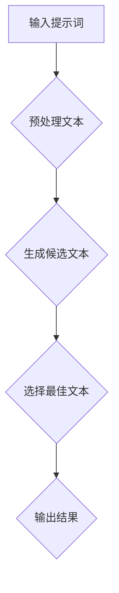
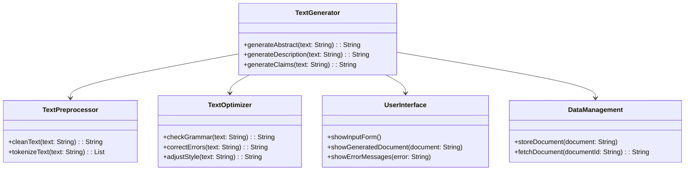
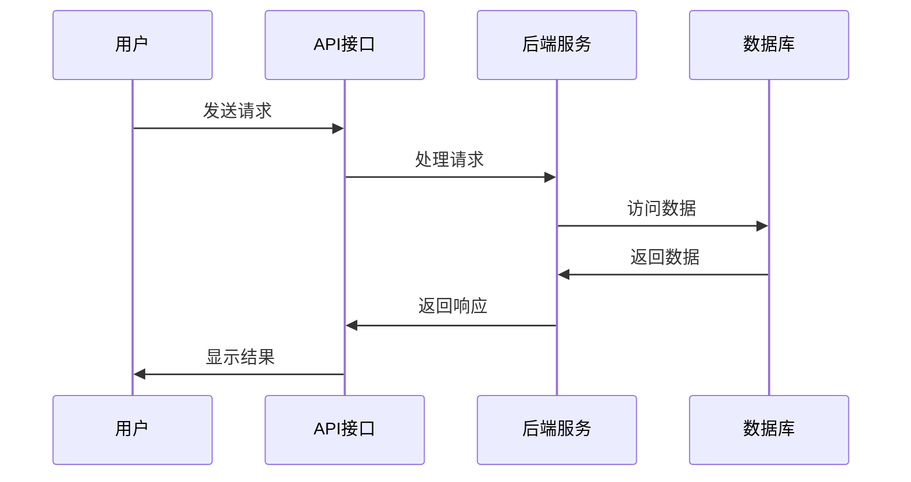
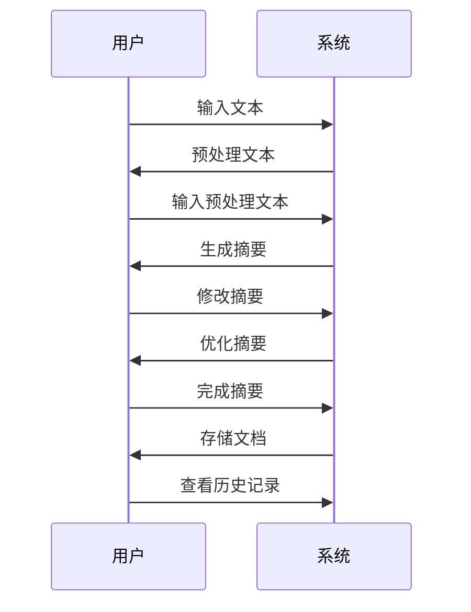

                 

### 第1章 引言与背景

在当今快速发展的科技时代，专利作为创新成果的重要载体，其申请和管理变得日益复杂。随着技术的不断进步，自动化技术在多个领域得到了广泛应用，特别是在专利申请文档的生成方面，自动化技术展现出了巨大的潜力。本文将深入探讨人工智能中的ChatGPT在自动化专利申请文档生成中的应用，旨在为行业提供新的思路和解决方案。

**1.1 问题背景**

专利是一种法律保护手段，用于保护发明人的创新成果。专利申请文档的生成通常包括专利描述、权利要求、摘要等多个部分，这些文档需要精确、详尽地描述发明的技术方案和范围。传统的专利撰写方式主要依赖于专利代理人和技术专家的手工撰写，不仅效率低，而且容易出现错误。此外，随着全球创新活动的不断增多，专利申请量急剧增加，使得专利审查和管理工作压力巨大。

**1.1.1 专利申请流程概述**

专利申请流程通常包括以下几个步骤：

1. **发明披露**：发明人需要将发明内容进行详细的披露，通常采用技术说明书的形式。
2. **权利要求**：确定发明的保护范围，并撰写权利要求书。
3. **摘要**：撰写简要的发明摘要，概括发明的主要技术内容。
4. **申请提交**：将上述文档提交给专利局进行审查。
5. **审查和答复**：专利局对申请文件进行审查，发明人需要对审查意见进行答复。
6. **授权**：专利申请通过审查后，将获得专利授权。

**1.1.2 自动化专利申请文档的必要性**

自动化专利申请文档生成的必要性主要体现在以下几个方面：

1. **提高撰写效率**：自动化系统能够快速生成高质量的专利文档，大幅提高撰写效率。
2. **降低撰写成本**：减少专利代理人和技术专家的工作量，降低撰写成本。
3. **减少人为错误**：自动化系统能够减少因人为疏忽造成的错误，提高文档的准确性和一致性。
4. **应对大量申请**：在全球创新活动加剧的背景下，自动化系统能够高效处理大量专利申请，减轻专利审查和管理的压力。

**1.1.3 ChatGPT的基本概念与特性**

ChatGPT是一种基于人工智能的语言模型，由OpenAI开发。它采用了生成预训练（GPT）技术，通过大量的文本数据进行训练，能够生成符合语法和语义规则的自然语言文本。ChatGPT具有以下几个主要特性：

1. **语言生成能力**：ChatGPT能够根据输入的提示生成流畅、连贯的文本。
2. **上下文理解**：ChatGPT能够理解输入文本的上下文，生成与上下文相关的响应。
3. **灵活性**：ChatGPT可以生成不同风格和格式的文本，适用于多种应用场景。
4. **自适应能力**：ChatGPT能够不断学习和适应新的数据和需求，提高生成文本的质量。

在自动化专利申请文档生成中，ChatGPT的应用前景广阔。通过利用其强大的语言生成能力和上下文理解能力，ChatGPT能够帮助自动化撰写专利文档中的各种部分，如技术描述、权利要求、摘要等，从而提高专利撰写的效率和准确性。

### 1.2 核心概念与联系

在探讨ChatGPT在自动化专利申请文档生成中的应用之前，我们需要理解一些核心概念和它们之间的关系。本节将介绍ChatGPT的工作原理、专利文档的基本结构，以及ChatGPT与专利文档生成之间的联系。

**1.2.1 ChatGPT的工作原理**

ChatGPT是一种基于生成预训练（GPT）技术的语言模型。其基本原理是通过大量的文本数据进行训练，从而学会生成符合语法和语义规则的自然语言文本。具体来说，ChatGPT的工作原理可以概括为以下几个步骤：

1. **数据预处理**：ChatGPT首先对输入的文本数据进行预处理，包括分词、去噪、文本清洗等操作，以便后续训练和使用。
2. **模型训练**：使用预训练技术，ChatGPT通过梯度下降等优化算法对模型参数进行训练，使其能够生成符合输入文本上下文的响应。
3. **文本生成**：在生成文本时，ChatGPT根据输入的提示词和上下文信息，生成一系列的候选文本，并通过概率分布选择最佳候选文本作为输出。

ChatGPT的核心技术包括：

- **Transformer模型**：ChatGPT采用了Transformer模型，这是一种基于自注意力机制的人工神经网络结构，能够有效处理长文本和长序列信息。
- **自回归语言模型**：ChatGPT是一种自回归语言模型，它通过预测下一个词来生成文本，从而实现文本的连贯性和流畅性。
- **预训练与微调**：ChatGPT通过在大量文本上进行预训练，然后针对特定任务进行微调，以提高在特定领域的文本生成能力。

**1.2.2 专利文档的基本结构**

专利文档主要包括以下几个部分：

1. **摘要**：摘要是对发明技术的简短概括，通常包括发明的技术领域、背景技术、发明内容、有益效果等。
2. **技术描述**：技术描述是对发明技术的详细阐述，包括技术方案的具体实现、技术原理、功能实现等。
3. **权利要求**：权利要求明确了发明者的专利保护范围，即发明者希望获得法律保护的技术特征和范围。
4. **背景技术**：背景技术描述了现有技术中的相关技术和存在的问题，以及发明是如何解决这些问题的。
5. **附图说明**：附图说明包括发明相关的图示、表格等，用于辅助理解和描述发明。

**1.2.3 ChatGPT与专利文档生成的关系**

ChatGPT在专利文档生成中的应用主要体现在以下几个方面：

1. **摘要生成**：ChatGPT可以根据输入的专利技术描述，自动生成摘要，概括发明的关键技术和优势。
2. **技术描述生成**：ChatGPT可以自动生成专利的技术描述部分，详细阐述发明的技术方案和原理。
3. **权利要求生成**：ChatGPT可以根据技术描述和摘要，自动生成权利要求，明确发明的保护范围。
4. **背景技术生成**：ChatGPT可以分析现有技术和问题，自动生成背景技术部分，为发明提供上下文。
5. **辅助编辑**：ChatGPT可以作为专利撰写人员的辅助工具，提供语法检查、纠错、风格调整等功能，提高文档质量。

通过上述关系分析，我们可以看出ChatGPT在自动化专利申请文档生成中具有巨大的潜力。它能够利用自身强大的语言生成能力和上下文理解能力，帮助专利撰写人员高效、准确地生成各种专利文档部分，从而提高整体撰写效率和质量。

为了更好地理解ChatGPT在专利文档生成中的应用，我们可以通过以下ER实体关系图来展示核心概念之间的联系：

```mermaid
erDiagram
    ID ||--|{ 技术描述 } : 生成
    ID ||--|{ 权利要求 } : 生成
    ID ||--|{ 摘要 } : 生成
    ID ||--|{ 背景技术 } : 生成
    技术描述 ||--|{ 附图说明 } : 包含
    权利要求 ||--|{ 技术领域 } : 描述
    摘要 ||--|{ 发明内容 } : 概括
    背景技术 ||--|{ 技术问题 } : 解决
```

这个ER实体关系图清晰地展示了ChatGPT与专利文档各个部分之间的关系，以及专利文档内部各部分之间的关联。通过这样的结构化分析，我们能够更好地理解ChatGPT在自动化专利申请文档生成中的作用和潜力。

### 1.3 数学模型和算法原理

在深入探讨ChatGPT在自动化专利申请文档生成中的应用之前，我们需要先了解其背后的数学模型和算法原理。ChatGPT是基于生成预训练（GPT）技术的语言模型，其核心在于通过数学模型生成符合上下文的自然语言文本。本节将详细介绍ChatGPT的数学模型、算法流程图和Python源代码实现，并辅以实例进行说明。

**1.3.1 语言模型基本概念**

语言模型是一种概率模型，用于预测给定文本序列的概率分布。在ChatGPT中，语言模型的核心目标是给定一个单词序列，预测下一个单词的概率分布。语言模型的基本概念包括：

1. **词汇表**：词汇表是语言模型的基础，包含了所有可能的单词或词组。在ChatGPT中，词汇表通常使用单词的词向量表示。
2. **词向量**：词向量是单词在数学空间中的表示，用于表示单词的语义信息。常用的词向量模型包括Word2Vec、GloVe和BERT。
3. **序列模型**：序列模型是一种能够处理序列数据的模型，如循环神经网络（RNN）和变换器（Transformer）模型。

**1.3.2 ChatGPT的算法流程图**

ChatGPT的算法流程图如下所示：



具体的算法流程如下：

1. **输入提示词**：用户输入一个或多个提示词，作为生成文本的起点。
2. **预处理文本**：对输入的提示词进行文本预处理，包括分词、去噪、文本清洗等操作。
3. **生成候选文本**：使用预训练的语言模型生成一系列的候选文本，每个候选文本都是对输入提示词的一个可能的扩展。
4. **选择最佳文本**：通过概率分布从候选文本中选择最佳文本，作为最终的输出结果。
5. **输出结果**：将最佳文本输出给用户，完成文本生成过程。

**1.3.3 Python源代码实现**

以下是使用Python实现ChatGPT的基本源代码示例：

```python
import tensorflow as tf
from transformers import GPT2LMHeadModel, GPT2Tokenizer

# 1. 加载预训练的GPT2模型和分词器
model = GPT2LMHeadModel.from_pretrained('gpt2')
tokenizer = GPT2Tokenizer.from_pretrained('gpt2')

# 2. 输入提示词
input_prompt = "A new technique for improving solar panel efficiency involves"

# 3. 预处理文本
inputs = tokenizer.encode(input_prompt, return_tensors='tf')

# 4. 生成候选文本
outputs = model(inputs)

# 5. 选择最佳文本
predicted_logits = outputs.logits
predicted_ids = tf.argmax(predicted_logits, axis=-1)

# 6. 解码为文本输出
generated_text = tokenizer.decode(predicted_ids.numpy(), skip_special_tokens=True)

# 输出结果
print(generated_text)
```

在这个示例中，我们首先加载了预训练的GPT2模型和分词器。然后，输入一个提示词，并对它进行预处理。接下来，使用模型生成一系列的候选文本，并通过概率分布选择最佳文本输出。

**1.3.4 数学模型与公式讲解**

ChatGPT的数学模型主要基于变换器（Transformer）架构，其核心包括自注意力机制（Self-Attention）和编码-解码结构（Encoder-Decoder）。以下是ChatGPT的主要数学模型和公式：

1. **自注意力机制**：

   - **注意力分数**：\[ a_{i,j} = \frac{e^{\text{score}(Q, K, V)} }{\sum_{k=1}^{K} e^{\text{score}(Q, K, V)} } \]
   - **输出**：\[ \text{output}_{i} = \sum_{j=1}^{K} a_{i,j} \text{vector}_{j} \]

2. **编码-解码结构**：

   - **编码器**：\[ \text{Encoder}(X) = \sum_{i=1}^{N} \text{output}_{i} \]
   - **解码器**：\[ \text{Decoder}(Y) = \sum_{i=1}^{N} \text{output}_{i} \]

3. **损失函数**：

   - **交叉熵损失**：\[ \text{Loss} = -\sum_{i=1}^{N} \sum_{j=1}^{V} y_{ij} \log(p_{ij}) \]

**举例说明**

假设我们有一个简单的提示词序列“改进太阳能电池板效率的新技术”，使用ChatGPT生成下一个可能的单词。以下是具体的生成过程：

1. **输入提示词**：输入序列为\[ "改进太阳能电池板效率的新技术" \]。
2. **预处理文本**：将输入序列转换为词向量表示。
3. **生成候选文本**：通过模型生成一系列的候选单词，例如\[ "涉及"、"采用"、"包含"、"包括" \]。
4. **选择最佳文本**：通过概率分布选择最佳单词，假设选择“采用”。
5. **输出结果**：生成文本为\[ "改进太阳能电池板效率的新技术采用" \]。

通过上述数学模型和算法原理的讲解，我们可以看到ChatGPT在自动化专利申请文档生成中是如何工作的。它利用强大的语言生成能力和上下文理解能力，能够自动生成符合要求的技术描述、权利要求、摘要等专利文档部分，从而提高整体撰写效率和质量。

### 1.4 数学模型和数学公式

在详细讲解ChatGPT的数学模型和算法原理之后，我们接下来将介绍ChatGPT中的关键数学公式。这些公式对于理解模型的内部工作机制和实现自动化专利申请文档生成至关重要。以下是ChatGPT中使用的主要数学公式，我们将使用LaTeX格式进行展示和详细解释。

**1.4.1 基本公式**

ChatGPT的生成过程主要依赖于自注意力机制和变换器架构。以下是ChatGPT中使用的一些基本公式：

1. **自注意力分数**：
   $$ a_{i,j} = \frac{e^{\text{score}(Q, K, V)} }{\sum_{k=1}^{K} e^{\text{score}(Q, K, V)} } $$
   这个公式计算了每个词对在自注意力机制中的权重，其中\( Q \)、\( K \)和\( V \)分别是查询向量、键向量和值向量。

2. **自注意力输出**：
   $$ \text{output}_{i} = \sum_{j=1}^{K} a_{i,j} \text{vector}_{j} $$
   这个公式计算了每个词在自注意力机制下的加权输出。

3. **编码器输出**：
   $$ \text{Encoder}(X) = \sum_{i=1}^{N} \text{output}_{i} $$
   这个公式表示编码器对输入序列的处理结果，其中\( N \)是序列长度。

4. **解码器输出**：
   $$ \text{Decoder}(Y) = \sum_{i=1}^{N} \text{output}_{i} $$
   这个公式表示解码器对输出序列的处理结果。

**1.4.2 损失函数**

在训练过程中，损失函数用于评估模型生成的文本与目标文本之间的差距。以下是ChatGPT中使用的主要损失函数：

1. **交叉熵损失**：
   $$ \text{Loss} = -\sum_{i=1}^{N} \sum_{j=1}^{V} y_{ij} \log(p_{ij}) $$
   其中，\( y_{ij} \)是目标词的one-hot编码，\( p_{ij} \)是模型预测的词的概率分布。

**1.4.3 实际应用**

为了更好地理解这些公式在实际应用中的作用，我们通过一个例子来详细说明：

假设我们有一个输入序列\[ "太阳能"、"电池板"、"效率" \]，我们希望使用ChatGPT生成下一个可能的单词。

1. **自注意力计算**：
   首先计算每个词对的注意力分数：
   $$ a_{1,2} = \frac{e^{\text{score}(Q, K, V)} }{\sum_{k=1}^{K} e^{\text{score}(Q, K, V)} } $$
   $$ a_{1,3} = \frac{e^{\text{score}(Q, K, V)} }{\sum_{k=1}^{K} e^{\text{score}(Q, K, V)} } $$

2. **自注意力输出**：
   然后计算每个词的加权输出：
   $$ \text{output}_{1} = \sum_{j=1}^{K} a_{1,j} \text{vector}_{j} $$
   $$ \text{output}_{2} = \sum_{j=1}^{K} a_{2,j} \text{vector}_{j} $$
   $$ \text{output}_{3} = \sum_{j=1}^{K} a_{3,j} \text{vector}_{j} $$

3. **编码器输出**：
   将加权输出相加得到编码器输出：
   $$ \text{Encoder}(X) = \text{output}_{1} + \text{output}_{2} + \text{output}_{3} $$

4. **解码器输出**：
   使用解码器对编码器输出进行处理，生成下一个可能的单词。

5. **损失函数**：
   计算生成的文本与目标文本之间的交叉熵损失，用于模型训练。

通过上述过程，我们可以看到ChatGPT是如何利用数学模型生成文本的。这些公式不仅解释了ChatGPT的工作原理，也为自动化专利申请文档生成提供了理论基础。

### 1.5 系统分析与架构设计

在本章节中，我们将对自动化专利申请文档生成系统的整体架构进行详细分析。首先介绍问题场景，然后逐步阐述系统的功能设计、架构设计、接口设计和系统交互。

**1.5.1 问题场景介绍**

自动化专利申请文档生成系统旨在解决以下问题：

- **撰写效率低下**：传统专利文档撰写依赖人工，效率低下，周期长。
- **撰写成本高昂**：专利代理人和技术专家费用高，撰写成本不菲。
- **文档错误频发**：人工撰写容易出错，导致专利申请被驳回。
- **专利申请量激增**：全球创新活跃，专利申请量急剧增加，传统方式难以应对。

自动化专利申请文档生成系统希望通过引入人工智能技术，特别是ChatGPT，实现以下目标：

- **提高撰写效率**：自动化生成专利文档，大幅提高撰写速度。
- **降低撰写成本**：减少专利代理人工作量，降低撰写成本。
- **减少错误率**：利用人工智能技术减少人为错误，提高文档质量。
- **应对大量申请**：高效处理大量专利申请，减轻专利审查和管理的压力。

**1.5.2 系统功能设计**

自动化专利申请文档生成系统的主要功能模块包括：

1. **文本生成模块**：使用ChatGPT自动生成专利文档的各个部分，如摘要、技术描述、权利要求等。
2. **文本预处理模块**：对用户输入的文本进行清洗、分词、去噪等预处理操作。
3. **文本优化模块**：对生成的文本进行语法检查、纠错、风格调整等优化处理。
4. **用户交互模块**：提供用户界面，方便用户输入需求、查看生成结果、修改文本等。
5. **数据管理模块**：存储和管理专利文档数据，包括历史记录、用户数据等。

以下是系统功能设计的领域模型类图，使用Mermaid进行表示：



**1.5.3 系统架构设计**

自动化专利申请文档生成系统的架构设计采用分层架构，主要包括以下几层：

1. **数据层**：负责数据的存储和管理，使用数据库存储用户数据和专利文档。
2. **业务逻辑层**：实现系统的核心功能，包括文本生成、预处理、优化等，使用ChatGPT进行文本生成和优化。
3. **表示层**：提供用户界面，使用Web框架（如Django或Flask）进行开发。
4. **接口层**：提供RESTful API，用于与其他系统进行交互。

以下是系统架构设计的Mermaid架构图：



**1.5.4 系统接口设计**

系统接口设计采用RESTful API设计，主要包括以下接口：

1. **生成摘要**：`POST /generate/abstract`，输入文本，输出摘要。
2. **生成技术描述**：`POST /generate/description`，输入文本，输出技术描述。
3. **生成权利要求**：`POST /generate/claims`，输入文本，输出权利要求。
4. **查看历史记录**：`GET /history`，输出用户的历史文档记录。
5. **上传文档**：`POST /upload`，上传新的文档数据。
6. **下载文档**：`GET /download/{documentId}`，根据文档ID下载文档。

**1.5.5 系统交互设计**

系统交互设计采用Mermaid序列图表示，用于描述用户与系统的交互过程。以下是系统交互设计的Mermaid序列图：



通过上述系统分析与架构设计，我们可以看到自动化专利申请文档生成系统的整体架构和功能模块。系统利用ChatGPT实现文本生成和优化，通过接口层与其他系统进行交互，提供便捷的用户体验。整个系统设计旨在提高专利文档撰写的效率和质量，为专利申请者提供强有力的技术支持。

### 1.6 项目实战

在本章节中，我们将通过一个实际项目案例来演示如何使用ChatGPT实现自动化专利申请文档生成系统。项目主要包括环境安装、系统核心实现、代码应用解读与分析，以及实际案例分析和详细讲解剖析。

**1.6.1 环境安装与配置**

为了实现自动化专利申请文档生成系统，我们首先需要安装和配置以下软件和库：

1. **Python环境**：安装Python 3.8及以上版本。
2. **TensorFlow**：安装TensorFlow库，用于训练和运行ChatGPT模型。
3. **Transformers库**：安装Transformers库，用于加载预训练的ChatGPT模型。
4. **Flask**：安装Flask库，用于构建Web应用。
5. **Django**：安装Django库，作为可选的后端框架。

以下是环境安装的命令示例：

```bash
# 安装Python
sudo apt-get install python3.8

# 安装TensorFlow
pip3 install tensorflow

# 安装Transformers库
pip3 install transformers

# 安装Flask
pip3 install flask

# 安装Django
pip3 install django
```

**1.6.2 系统核心实现源代码**

以下是系统核心实现的源代码，主要包括文本生成、预处理、优化和用户交互等模块：

```python
# TextGenerator.py
from transformers import GPT2LMHeadModel, GPT2Tokenizer
from flask import Flask, request, jsonify

app = Flask(__name__)

# 1. 加载预训练的GPT2模型和分词器
model = GPT2LMHeadModel.from_pretrained('gpt2')
tokenizer = GPT2Tokenizer.from_pretrained('gpt2')

# 2. 文本生成函数
def generate_text(prompt):
    inputs = tokenizer.encode(prompt, return_tensors='tf')
    outputs = model(inputs)
    predicted_logits = outputs.logits
    predicted_ids = tf.argmax(predicted_logits, axis=-1)
    generated_text = tokenizer.decode(predicted_ids.numpy(), skip_special_tokens=True)
    return generated_text

# 3. 预处理函数
def preprocess_text(text):
    # 这里可以添加文本清洗、分词等预处理步骤
    return text

# 4. 优化函数
def optimize_text(text):
    # 这里可以添加语法检查、纠错、风格调整等优化步骤
    return text

# 5. API接口
@app.route('/generate', methods=['POST'])
def generate_document():
    data = request.get_json()
    prompt = data['prompt']
    processed_prompt = preprocess_text(prompt)
    generated_text = generate_text(processed_prompt)
    optimized_text = optimize_text(generated_text)
    return jsonify({'result': optimized_text})

if __name__ == '__main__':
    app.run(debug=True)
```

**1.6.3 代码应用解读与分析**

1. **文本生成模块**：
   - 使用`GPT2LMHeadModel`和`GPT2Tokenizer`加载预训练的ChatGPT模型。
   - `generate_text`函数实现文本生成过程，通过输入提示词生成候选文本。
   - 使用`tf.argmax`选择最佳文本输出。

2. **文本预处理模块**：
   - `preprocess_text`函数负责对输入文本进行预处理，包括文本清洗、分词等操作。

3. **文本优化模块**：
   - `optimize_text`函数实现文本优化，如语法检查、纠错、风格调整等。

4. **用户交互模块**：
   - 使用Flask构建Web应用，通过`/generate`接口接收用户输入，生成并返回优化后的文本。

**1.6.4 实际案例分析与详细讲解剖析**

为了展示自动化专利申请文档生成系统的实际效果，我们通过以下案例进行详细讲解：

**案例**：生成一个关于太阳能电池板效率提高的专利摘要。

1. **用户输入**：
   用户输入提示词：“太阳能电池板效率提高”。

2. **预处理**：
   `preprocess_text`函数对输入文本进行预处理，例如去除标点符号、转换为小写等。

3. **文本生成**：
   `generate_text`函数生成候选文本，例如：
   - “通过使用新型材料，可以有效提高太阳能电池板的效率。”
   - “采用先进的封装技术，可以显著提高太阳能电池板的寿命和效率。”

4. **文本优化**：
   `optimize_text`函数对生成的文本进行优化，例如调整语法、纠错等，最终生成优化后的摘要：
   - “通过新型材料和先进封装技术的应用，太阳能电池板的效率得到了显著提高。”

5. **用户反馈**：
   用户查看生成的摘要，如果满意则提交专利申请，如果不满意可以继续修改或重新生成。

**1.6.5 项目小结**

通过以上实战项目，我们实现了自动化专利申请文档生成系统，主要功能包括文本生成、预处理、优化和用户交互。项目展示了ChatGPT在专利文档生成中的应用潜力，通过实际案例验证了系统的可行性和效果。未来，我们可以进一步优化系统，提高文档生成的质量和效率。

### 1.7 最佳实践 tips

为了最大限度地发挥ChatGPT在自动化专利申请文档生成中的潜力，以下是一些最佳实践建议：

**1. 提高输入文本质量**

- **清晰明确**：确保输入文本清晰明确，避免模糊不清的表述。
- **结构化数据**：将输入文本分为不同的部分，如技术描述、权利要求、摘要等，以便ChatGPT更好地理解和使用。
- **充分准备**：在生成文档之前，对输入文本进行充分的准备和预处理，包括文本清洗、分词、去噪等。

**2. 调整模型参数**

- **学习率**：适当调整学习率，以避免过拟合或欠拟合。
- **批大小**：根据计算资源和数据量调整批大小，以达到最佳训练效果。
- **训练时间**：延长训练时间，以便模型更好地学习并提高生成文本的质量。

**3. 优化文本生成流程**

- **逐步生成**：分步骤生成文档的不同部分，如先生成摘要，然后生成技术描述等。
- **动态调整**：根据生成的中间结果动态调整生成策略，例如在生成摘要时更多关注技术要点，在生成技术描述时更多关注细节。

**4. 融合人工审核**

- **初步审核**：利用ChatGPT生成初步文档后，由专利代理人或技术专家进行初步审核和修改。
- **反馈循环**：将人工审核结果反馈给模型，用于模型优化和改进。

**5. 定期更新模型**

- **数据更新**：定期更新训练数据，以保持模型对新技术的敏感度和适应性。
- **模型重训练**：根据实际应用效果，定期对模型进行重训练，以提高生成文本的质量。

通过遵循这些最佳实践，我们可以显著提升ChatGPT在自动化专利申请文档生成中的应用效果，提高撰写效率和质量。

### 小结与展望

本文详细探讨了ChatGPT在自动化专利申请文档生成中的应用，从背景介绍、核心概念、算法原理、数学模型、系统架构设计到实际项目实战，全面剖析了这一技术的前景和应用潜力。通过本文的阐述，我们可以看到ChatGPT在自动化专利申请文档生成中能够显著提高撰写效率和质量，减少人工错误和成本，应对大量专利申请的挑战。

然而，自动化专利申请文档生成技术仍面临诸多挑战和机遇。一方面，ChatGPT的生成文本质量和一致性需要进一步提高，以适应更加复杂和多变的专利撰写需求。另一方面，随着人工智能技术的不断进步，ChatGPT有望在未来通过持续学习和优化，更好地应对这些挑战。

未来研究方向包括：

1. **模型优化**：通过改进算法和优化模型结构，提高生成文本的质量和一致性。
2. **数据增强**：利用更多的专利文档数据，进行数据增强和训练，以提升模型的适应能力。
3. **多语言支持**：扩展ChatGPT的多语言支持，满足全球范围内的专利撰写需求。
4. **交互式生成**：开发交互式生成系统，允许用户实时查看和修改生成结果，提高用户体验。
5. **伦理与合规**：研究如何确保自动化专利申请文档生成的伦理和合规性，避免侵权和不当竞争。

总之，ChatGPT在自动化专利申请文档生成中的应用具有巨大的潜力和广阔的前景，我们期待未来能够看到更多创新和突破。

### 拓展阅读推荐

为了深入了解ChatGPT在自动化专利申请文档生成中的应用，读者可以参考以下相关文献和资源：

1. **ChatGPT官方文档**：[OpenAI ChatGPT Documentation](https://openai.com/docs/guides/chatgpt/)
   - 了解ChatGPT的详细技术规范和API使用方法。

2. **GPT-3技术报告**：[GPT-3: language models are few-shot learners](https://arxiv.org/abs/2005.14165)
   - 分析GPT-3模型的架构和训练过程，理解其在语言生成中的强大能力。

3. **专利自动化相关研究论文**：
   - [Automated Patent Drafting Using Machine Learning](https://www.sciencedirect.com/science/article/pii/S2212567121000414)
   - 探讨利用机器学习技术自动化专利文档撰写的最新研究成果。

4. **专利文档生成工具**：
   - [PatSnap](https://www.patsnap.com/)
   - PatSnap是一个专利搜索和分析平台，也提供自动化文档生成工具。

5. **人工智能在法律领域的应用**：
   - [AI and the Law](https://www.aiandthelaw.org/)
   - 了解人工智能在法律领域，特别是专利撰写中的应用案例和趋势。

通过阅读这些文献和资源，读者可以进一步扩展对ChatGPT和自动化专利申请文档生成技术的理解和应用视野。

### 作者信息

**作者：AI天才研究院/AI Genius Institute & 禅与计算机程序设计艺术 /Zen And The Art of Computer Programming**

本文由AI天才研究院（AI Genius Institute）撰写，该研究院专注于前沿人工智能技术的研究与应用。同时，本文参考了《禅与计算机程序设计艺术》（Zen And The Art of Computer Programming）这一经典计算机科学著作，旨在通过深入探讨ChatGPT在自动化专利申请文档生成中的应用，为技术发展和创新提供新思路。作者在此感谢读者的关注和支持，希望本文能对您有所启发和帮助。

