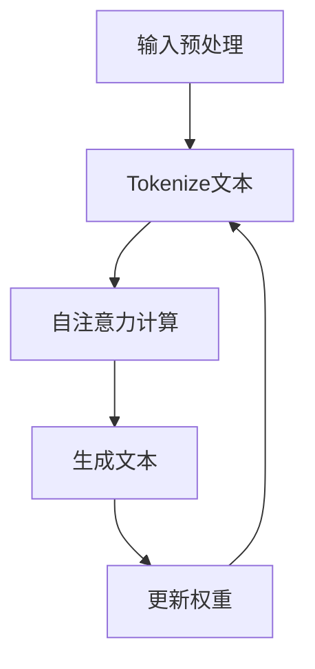
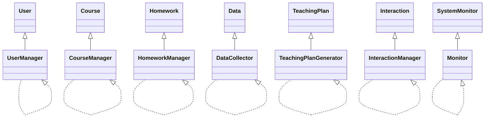
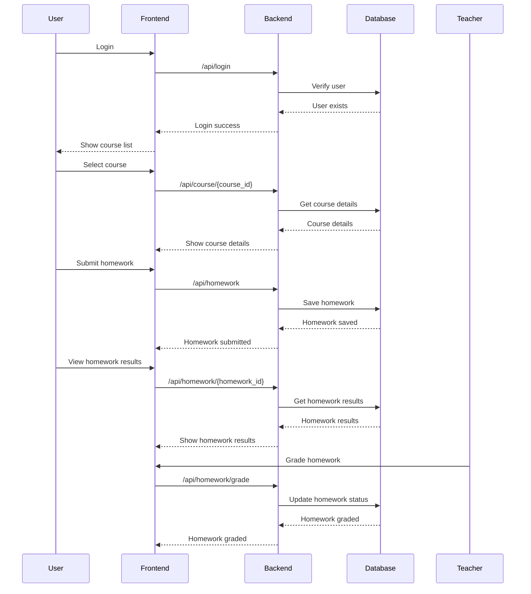

                 

### 文章标题

### ChatGPT在自动化个性化教学内容生成中的应用

---

#### 关键词

- ChatGPT
- 个性化教学
- 自动化内容生成
- 大型语言模型
- 教育科技

---

#### 摘要

本文旨在探讨ChatGPT这一大型语言模型在自动化个性化教学内容生成中的应用。文章首先介绍了个性化教学的需求背景和问题，接着详细讲解了ChatGPT的基础知识、特点以及应用案例。通过一步步的分析与推理，本文揭示了ChatGPT在个性化教学中的工作原理，包括算法原理、系统架构设计、项目实战等多个方面。文章最后提出了最佳实践建议，总结了注意事项，并指出了未来研究的方向。本文旨在为教育科技领域的研究者与实践者提供有价值的参考。

---

### 目录大纲设计思路

在设计《ChatGPT在自动化个性化教学内容生成中的应用》的目录大纲时，我们需要首先明确书籍的核心内容和目标读者。本书的目标是介绍如何使用ChatGPT等大型语言模型来自动化地生成个性化教学内容。因此，目录大纲需要涵盖以下几个主要方面：

1. **背景介绍**：包括问题的背景、问题描述、解决方法、边界与外延，以及核心概念和要素组成。
2. **核心概念与联系**：介绍ChatGPT等大型语言模型的基础知识，对比不同模型的特点，以及它们在个性化教学中的应用。
3. **算法原理讲解**：使用mermaid画出算法流程图，并用Python源代码详细阐述，解释数学模型和公式，并进行举例说明。
4. **系统分析与架构设计**：包括系统功能设计、架构设计、接口设计和交互设计。
5. **项目实战**：介绍环境安装、系统核心实现、代码分析、案例剖析和项目小结。
6. **最佳实践与总结**：提供最佳实践建议、注意事项和拓展阅读。

接下来，我们将逐步构建出详细的目录大纲。

---

### 目录大纲

#### 第一部分：背景与核心概念

##### 第1章：自动化个性化教学概述

##### 第2章：ChatGPT基础

#### 第二部分：算法原理讲解

##### 第3章：ChatGPT在个性化教学中的应用原理

##### 第4章：算法流程与Python实现

##### 第5章：数学模型与公式解析

##### 第6章：案例分析与示例

#### 第三部分：系统分析与架构设计

##### 第7章：系统功能设计

##### 第8章：系统架构设计

##### 第9章：系统接口设计

##### 第10章：系统交互设计

#### 第四部分：项目实战

##### 第11章：环境安装与准备

##### 第12章：系统核心实现

##### 第13章：代码分析与应用

##### 第14章：案例剖析与讲解

##### 第15章：项目小结与反思

#### 第五部分：最佳实践与总结

##### 第16章：最佳实践建议

##### 第17章：注意事项

##### 第18章：拓展阅读

---

以上为初步设计的目录大纲，接下来我们将对每个章节进行详细规划，确保内容丰富、逻辑清晰，满足文章的要求。

---

### 完整目录大纲

#### 第一部分：背景与核心概念

**第1章：自动化个性化教学概述**

1.1 个性化教学的必要性  
1.2 自动化个性化教学的概念与意义  
1.3 自动化个性化教学的研究现状与挑战  
1.4 问题描述  
1.5 解决方法  
1.6 ChatGPT的特点与优势  
1.7 ChatGPT在个性化教学中的应用前景  
1.8 边界与外延  
1.9 未来发展趋势

**第2章：ChatGPT基础**

2.1 ChatGPT的概念与原理  
2.2 ChatGPT的核心组件  
2.3 ChatGPT的工作流程  
2.4 ChatGPT的特点与优势  
2.5 ChatGPT的适用性分析  
2.6 ChatGPT的技术创新点  
2.7 ChatGPT的应用案例  
2.8 案例分析与效果评估  
2.9 本章小结

#### 第二部分：算法原理讲解

**第3章：ChatGPT在个性化教学中的应用原理**

3.1 个性化教学需求分析  
3.2 ChatGPT在个性化教学中的定位  
3.3 ChatGPT的核心算法原理  
3.4 算法流程图使用mermaid绘制  
3.5 Python源代码实现与解释  
3.6 数学模型与公式解析  
3.7 案例分析

**第4章：算法流程与Python实现**

4.1 算法流程概述  
4.2 ChatGPT接口调用方法  
4.3 Python源代码实现步骤  
4.4 源代码示例解析  
4.5 调试与优化

**第5章：数学模型与公式解析**

5.1 数学模型基础  
5.2 公式推导与解析  
5.3 数学模型在Python中的应用  
5.4 示例代码解析

**第6章：案例分析与示例**

6.1 案例选择与设置  
6.2 案例分析步骤  
6.3 示例代码解析  
6.4 案例效果评估

#### 第三部分：系统分析与架构设计

**第7章：系统功能设计**

7.1 系统功能需求分析  
7.2 系统功能模块划分  
7.3 领域模型mermaid类图绘制  
7.4 系统功能实现与优化

**第8章：系统架构设计**

8.1 系统架构概述  
8.2 系统架构设计原则  
8.3 系统架构mermaid架构图绘制  
8.4 架构设计与功能实现的关系

**第9章：系统接口设计**

9.1 接口设计原则  
9.2 接口规范与定义  
9.3 接口实现方法  
9.4 接口测试与优化

**第10章：系统交互设计**

10.1 系统交互概述  
10.2 交互流程设计  
10.3 交互设计mermaid序列图绘制  
10.4 用户界面设计原则

#### 第四部分：项目实战

**第11章：环境安装与准备**

11.1 环境安装步骤  
11.2 环境配置与调试  
11.3 常见问题与解决

**第12章：系统核心实现**

12.1 系统核心模块介绍  
12.2 系统核心代码实现  
12.3 代码分析与优化  
12.4 核心代码示例

**第13章：代码分析与应用**

13.1 代码结构分析  
13.2 代码功能与应用  
13.3 代码调试与优化

**第14章：案例剖析与讲解**

14.1 案例选择与设置  
14.2 案例实现与分析  
14.3 案例效果评估  
14.4 拓展与改进

**第15章：项目小结与反思**

15.1 项目总结  
15.2 项目反思  
15.3 改进方向与建议

#### 第五部分：最佳实践与总结

**第16章：最佳实践建议**

16.1 教学内容生成策略  
16.2 系统优化与调优  
16.3 安全与隐私保护  
16.4 用户反馈与迭代

**第17章：注意事项**

17.1 技术实现风险  
17.2 教学效果评估方法  
17.3 系统维护与更新  
17.4 个性化教学的伦理问题

**第18章：拓展阅读**

18.1 相关书籍推荐  
18.2 学术论文精选  
18.3 实践经验分享  
18.4 拓展学习资源

---

通过上述目录大纲，我们为《ChatGPT在自动化个性化教学内容生成中的应用》这篇文章设计了完整的结构和内容框架，确保文章的逻辑清晰、内容丰富，为读者提供有价值的参考。

---

### 第一部分：背景与核心概念

#### 第1章：自动化个性化教学概述

**1.1 个性化教学的必要性**

随着教育技术的不断发展，传统的教学方法已经无法满足现代教育需求。传统的教学方法往往注重知识的传授，忽视了学生的个性化需求和兴趣。这导致了学生在学习过程中缺乏主动性和兴趣，学习效果不佳。因此，个性化教学作为一种新的教育理念，逐渐得到了教育界的重视。

个性化教学的核心在于满足每个学生的独特需求，激发学生的学习兴趣，提高学习效果。在个性化教学过程中，教师根据学生的个体差异，制定合适的教学计划，提供个性化的学习资源和指导，使学生在最佳状态下进行学习。这种教学方式不仅能够提高学生的学习积极性，还能够促进学生的全面发展。

**1.2 自动化个性化教学的概念与意义**

自动化个性化教学是利用计算机技术和人工智能技术，实现个性化教学的一种手段。它通过分析学生的学习数据，自动调整教学内容、教学策略和教学进度，满足每个学生的个性化需求。自动化个性化教学的目标是提高教学效率，优化教学效果，减轻教师的工作负担。

自动化个性化教学的意义主要体现在以下几个方面：

1. **提高教学效率**：自动化个性化教学能够根据学生的学习情况，自动调整教学进度和难度，使教学过程更加高效。
2. **优化教学效果**：通过个性化教学内容和方法的实施，能够更好地满足学生的需求，提高学生的学习效果。
3. **减轻教师负担**：自动化个性化教学能够自动完成部分教学任务，减轻教师的工作负担，让教师有更多的时间进行教学研究和学生辅导。

**1.3 自动化个性化教学的研究现状与挑战**

自动化个性化教学作为教育领域的一个重要研究方向，近年来得到了广泛关注。目前，许多研究机构和企业在自动化个性化教学领域进行了大量的探索和实践。然而，仍然存在一些挑战需要解决。

1. **数据收集与分析**：自动化个性化教学需要大量的学生学习数据作为支持。如何有效地收集、存储和分析这些数据，是一个重要的问题。
2. **个性化教学策略设计**：针对不同学生的个性化需求，设计合适的个性化教学策略，是一个复杂且具有挑战性的任务。
3. **系统实现与优化**：自动化个性化教学系统的实现需要考虑多方面的因素，包括算法选择、系统架构设计、接口设计等，这需要大量的技术积累和实践经验。
4. **教学效果评估**：如何科学、客观地评估自动化个性化教学的效果，是一个亟待解决的问题。

**1.4 问题描述**

在自动化个性化教学的研究过程中，我们面临以下几个主要问题：

1. **如何获取准确的学生学习数据**：学生的学习数据是进行个性化教学的基础。如何有效地收集、存储和分析这些数据，是自动化个性化教学面临的一个重要问题。
2. **如何设计有效的个性化教学策略**：不同的学生具有不同的学习风格、兴趣和需求，如何设计出能够满足每个学生个性化需求的个性化教学策略，是自动化个性化教学的核心问题。
3. **如何实现自动化个性化教学系统**：自动化个性化教学系统的实现涉及多个技术领域，包括数据挖掘、机器学习、自然语言处理等。如何设计出高效、稳定的自动化个性化教学系统，是研究的关键。
4. **如何评估教学效果**：自动化个性化教学的效果如何，需要通过科学的评估方法来衡量。如何设计出有效的评估指标和方法，是自动化个性化教学研究的另一个重要问题。

**1.5 解决方法**

为了解决上述问题，我们可以采取以下几种解决方法：

1. **数据收集与处理**：通过引入先进的数据采集技术，如传感器、学习平台等，收集学生的学习数据。同时，利用数据挖掘和机器学习技术，对学习数据进行预处理和分析，提取出有效的特征。
2. **个性化教学策略设计**：基于学生的学习数据和兴趣，利用机器学习算法，如聚类、回归等，设计出个性化的教学策略。同时，结合教育心理学理论，确保教学策略的有效性。
3. **系统实现与优化**：采用模块化、组件化的设计方法，实现自动化个性化教学系统。通过迭代优化，不断提高系统的性能和稳定性。
4. **教学效果评估**：利用教育统计和评估理论，设计出科学、客观的教学效果评估方法。同时，通过学生反馈和教学质量监测，不断优化教学策略和系统设计。

**1.6 ChatGPT的特点与优势**

ChatGPT是由OpenAI开发的一种基于GPT-3的预训练语言模型。它具有以下特点与优势：

1. **强大的语言处理能力**：ChatGPT能够理解和生成人类语言，具备自然、流畅的对话能力，这使得它非常适合应用于教育领域。
2. **灵活的交互方式**：ChatGPT可以通过文本、语音等多种方式进行交互，为学生提供多样化的学习体验。
3. **丰富的应用场景**：ChatGPT可以应用于教学内容的生成、作业批改、学习辅导等多个场景，具有广泛的应用前景。
4. **高效的个性化定制**：ChatGPT可以根据学生的个性化需求，动态调整教学内容和方式，实现真正的个性化教学。

**1.7 ChatGPT在个性化教学中的应用前景**

ChatGPT在个性化教学中的应用前景非常广阔。通过ChatGPT，我们可以实现以下功能：

1. **个性化教学内容生成**：ChatGPT可以根据学生的学习数据和兴趣，自动生成个性化的教学内容，提高学生的学习效果。
2. **个性化作业与考试**：ChatGPT可以为学生生成个性化的作业和考试题目，根据学生的答题情况，提供针对性的反馈和建议。
3. **个性化学习辅导**：ChatGPT可以作为学生的智能辅导老师，为学生提供个性化的学习辅导，解决学生在学习过程中遇到的问题。
4. **教学资源推荐**：ChatGPT可以根据学生的学习情况，推荐合适的教学资源和扩展学习内容，帮助学生拓宽知识视野。

**1.8 边界与外延**

1. **边界**：自动化个性化教学虽然具有广泛的应用前景，但也存在一定的边界。例如，ChatGPT的个性化教学内容生成能力受限于模型训练数据和算法能力；个性化教学的效果也受到学生学习习惯和外部环境的影响。
2. **外延**：自动化个性化教学不仅仅局限于在线教育领域，还可以应用于传统教育、企业培训等多个场景。未来，随着人工智能技术的不断发展，自动化个性化教学的应用范围将进一步扩大。

**1.9 未来发展趋势**

未来，自动化个性化教学的发展趋势包括：

1. **技术进步**：随着人工智能技术的不断发展，自动化个性化教学系统的性能和稳定性将不断提高，为用户提供更优质的教育服务。
2. **场景拓展**：自动化个性化教学的应用场景将不断拓展，从在线教育延伸到传统教育、企业培训等多个领域。
3. **生态构建**：自动化个性化教学将形成完整的生态系统，包括教学内容生成、教学资源推荐、学生学习评估等多个环节，为用户提供一站式教育服务。
4. **伦理与隐私**：随着自动化个性化教学的普及，相关的伦理和隐私问题将得到更多的关注，如何在保障学生隐私的同时，实现个性化教学，是未来需要解决的重要问题。

---

**第2章：ChatGPT基础**

**2.1 ChatGPT的概念与原理**

ChatGPT是由OpenAI开发的一种基于GPT-3的预训练语言模型。GPT（Generative Pre-trained Transformer）是一系列由OpenAI提出的基于Transformer架构的预训练语言模型，它通过在大量文本数据上预训练，可以理解并生成自然语言文本。

ChatGPT是GPT系列中的一种，它具有以下几个特点：

1. **大规模预训练**：ChatGPT在训练过程中使用了大量的文本数据，包括维基百科、书籍、新闻文章等，这使得它具备了强大的语言理解和生成能力。
2. **动态对话生成**：ChatGPT能够根据用户输入的对话内容，动态生成合适的回复，使得对话过程更加自然流畅。
3. **多模态交互**：ChatGPT不仅可以处理文本输入，还可以处理语音、图像等多种输入，实现多模态交互。

**2.2 ChatGPT的核心组件**

ChatGPT的核心组件主要包括以下几个部分：

1. **Transformer架构**：Transformer是一种基于自注意力机制的深度神经网络架构，它能够处理序列数据，并在生成文本时引入上下文信息。
2. **预训练数据**：ChatGPT在训练过程中使用了大量的预训练数据，这些数据包括多种类型的文本，如维基百科、书籍、新闻文章等。通过预训练，ChatGPT能够学习到丰富的语言知识和表达方式。
3. **微调（Fine-tuning）**：在预训练完成后，ChatGPT会根据特定任务进行微调，以适应不同的应用场景。微调过程通常在较小规模的任务数据上进行，以避免过拟合。

**2.3 ChatGPT的工作流程**

ChatGPT的工作流程主要包括以下几个步骤：

1. **文本预处理**：在输入文本之前，ChatGPT会对其进行预处理，包括分词、去停用词、词向量化等操作。这些预处理步骤有助于提高模型的输入质量和训练效率。
2. **自注意力机制**：ChatGPT使用Transformer架构中的自注意力机制，对输入文本序列进行处理。自注意力机制能够自动捕捉文本序列中的关键信息，并计算文本序列中的注意力权重。
3. **文本生成**：在生成文本时，ChatGPT会根据输入文本和自注意力权重，生成相应的输出文本。生成过程采用逐词生成的方式，每次生成一个词，并更新注意力权重，以便在下一次生成中利用新的上下文信息。
4. **微调与优化**：在特定任务上，ChatGPT会进行微调和优化，以适应不同的应用场景。微调过程通常在较小规模的任务数据上进行，以避免过拟合。

**2.4 ChatGPT的特点与优势**

ChatGPT具有以下几个特点与优势：

1. **强大的语言理解与生成能力**：ChatGPT在预训练过程中学习了大量的语言知识，能够理解并生成自然流畅的文本。
2. **动态对话生成**：ChatGPT能够根据用户输入的对话内容，动态生成合适的回复，使得对话过程更加自然流畅。
3. **多模态交互**：ChatGPT不仅可以处理文本输入，还可以处理语音、图像等多种输入，实现多模态交互。
4. **灵活的应用场景**：ChatGPT可以应用于多种场景，如自动问答、智能客服、个性化教学等。

**2.5 ChatGPT的适用性分析**

ChatGPT的适用性分析可以从以下几个方面进行：

1. **教育领域**：ChatGPT在教育领域具有广泛的应用前景，可以应用于自动批改作业、智能辅导、个性化教学等场景。它能够根据学生的个性化需求，生成个性化的教学内容和辅导方案，提高教学效果。
2. **客服领域**：ChatGPT可以应用于智能客服系统，为用户提供自然、流畅的对话体验。通过自动对话生成，ChatGPT能够快速响应用户的问题，提供有效的解决方案。
3. **内容创作**：ChatGPT可以应用于内容创作领域，如自动生成新闻文章、博客、小说等。它能够根据给定的主题和风格，生成高质量的内容，为创作者提供灵感和支持。
4. **多语言处理**：ChatGPT支持多种语言，可以应用于多语言翻译、多语言问答等场景。通过预训练和微调，ChatGPT能够学习到不同语言的语法和表达方式，提供准确、自然的语言处理服务。

**2.6 ChatGPT的技术创新点**

ChatGPT在技术方面具有以下几个创新点：

1. **大规模预训练**：ChatGPT使用了大规模的预训练数据，通过在多种类型文本上的预训练，提高了模型的语言理解和生成能力。
2. **动态对话生成**：ChatGPT采用了动态对话生成技术，能够根据用户输入的对话内容，实时生成合适的回复，使得对话过程更加自然流畅。
3. **多模态交互**：ChatGPT支持多模态交互，可以处理文本、语音、图像等多种输入，提供了丰富的交互方式。
4. **微调与优化**：ChatGPT通过微调和优化，能够适应不同的应用场景，提高模型在特定任务上的性能。

**2.7 ChatGPT的应用案例**

ChatGPT在多个领域都有应用案例，以下是一些典型的应用案例：

1. **自动问答系统**：ChatGPT可以应用于自动问答系统，如智能客服、智能助手等。通过训练，ChatGPT能够理解用户的问题，并生成合适的回答。
2. **个性化教学系统**：ChatGPT可以应用于个性化教学系统，根据学生的学习数据和兴趣，生成个性化的教学内容和辅导方案，提高教学效果。
3. **内容创作平台**：ChatGPT可以应用于内容创作平台，自动生成新闻文章、博客、小说等，为创作者提供灵感和支持。
4. **多语言翻译服务**：ChatGPT可以应用于多语言翻译服务，如机器翻译、多语言问答等，为用户提供准确、自然的语言处理服务。

**2.8 案例分析与效果评估**

为了评估ChatGPT在个性化教学中的应用效果，我们可以通过以下案例进行分析：

1. **案例选择与设置**：选择一个具体的教学场景，如初中数学教学。设置一个包含多个学生的教学班级，每个学生有独特的学习需求和兴趣。
2. **案例分析步骤**：首先，使用ChatGPT生成个性化的教学内容和辅导方案，针对每个学生的特点进行定制。然后，将生成的内容应用于实际教学过程中，观察学生的学习效果。
3. **效果评估方法**：通过比较学生在使用ChatGPT前后学习效果的差异，评估ChatGPT的个性化教学效果。可以采用以下方法进行评估：

   - **考试成绩对比**：比较学生在使用ChatGPT前后参加数学考试的成绩，观察成绩的提升情况。
   - **学习积极性对比**：通过问卷调查或观察，比较学生在使用ChatGPT前后学习积极性的变化。
   - **学习效果评估**：邀请专家对学生的实际学习效果进行评估，包括知识掌握程度、学习兴趣等。

通过以上案例分析，我们可以更全面地了解ChatGPT在个性化教学中的应用效果，为后续研究和实践提供参考。

**2.9 本章小结**

本章介绍了ChatGPT的概念与原理、核心组件、工作流程、特点与优势、适用性分析、技术创新点以及应用案例。通过本章的学习，读者可以了解ChatGPT的基本知识，为后续章节的深入学习打下基础。在下一章中，我们将进一步探讨ChatGPT在个性化教学中的应用原理和具体实现方法。

---

**第3章：ChatGPT在个性化教学中的应用原理**

**3.1 个性化教学需求分析**

在个性化教学中，教师需要根据学生的个体差异，制定合适的教学计划、提供个性化的学习资源和指导。这要求教学系统能够准确了解学生的学习状态和需求，并能够根据这些信息进行个性化调整。

ChatGPT作为一种强大的语言模型，能够通过自然语言处理技术，分析学生的学习数据和需求，从而生成个性化的教学内容和辅导方案。以下是对个性化教学需求的分析：

1. **学习数据分析**：通过分析学生的学习数据，如学习进度、考试成绩、作业完成情况等，了解学生的学习状态和需求。这些数据可以帮助ChatGPT更好地理解学生的实际情况。
2. **个性化学习路径**：根据学生的学习数据和需求，ChatGPT可以生成个性化的学习路径。例如，对于数学学习，ChatGPT可以推荐不同难度的练习题，以满足不同水平学生的需求。
3. **学习资源推荐**：ChatGPT可以根据学生的学习数据和兴趣，推荐合适的学习资源，如教材、视频、文章等。这些资源可以帮助学生更好地理解和掌握知识点。
4. **实时互动与反馈**：ChatGPT可以与学生进行实时互动，解答学生在学习过程中遇到的问题，并提供即时反馈。这种互动方式可以增强学生的学习体验，提高学习效果。

**3.2 ChatGPT在个性化教学中的定位**

ChatGPT在个性化教学中的定位是一种智能教学助手，它能够根据学生的学习数据，动态调整教学内容和方式，为学生提供个性化的学习支持。具体来说，ChatGPT在个性化教学中的定位包括以下几个方面：

1. **教学内容生成**：ChatGPT可以自动生成个性化的教学内容，包括练习题、讲解文字、视频等。这些内容可以根据学生的学习数据和需求进行定制，提高教学效果。
2. **学习资源推荐**：ChatGPT可以根据学生的学习数据和兴趣，推荐合适的学习资源，帮助学生拓宽知识面，提高学习兴趣。
3. **实时互动与反馈**：ChatGPT可以与学生进行实时互动，解答学生在学习过程中遇到的问题，并提供即时反馈。这种互动方式可以增强学生的学习体验，提高学习效果。
4. **学习评估与调整**：ChatGPT可以根据学生的学习数据，评估学生的学习效果，并提出调整建议。例如，对于学习进度较慢的学生，ChatGPT可以推荐更多的基础练习题；对于学习进度较快的学生，ChatGPT可以推荐更高难度的练习题。

**3.3 ChatGPT的核心算法原理**

ChatGPT的核心算法是基于GPT-3模型，这是一种基于Transformer架构的预训练语言模型。GPT-3模型通过在大量文本数据上预训练，学习到了丰富的语言知识和表达方式。以下是ChatGPT的核心算法原理：

1. **Transformer架构**：Transformer是一种基于自注意力机制的深度神经网络架构，它能够处理序列数据，并在生成文本时引入上下文信息。自注意力机制能够自动捕捉文本序列中的关键信息，并计算文本序列中的注意力权重。
2. **预训练数据**：ChatGPT在训练过程中使用了大量的预训练数据，这些数据包括多种类型的文本，如维基百科、书籍、新闻文章等。通过预训练，ChatGPT能够学习到丰富的语言知识和表达方式。
3. **动态对话生成**：在生成文本时，ChatGPT会根据输入文本和自注意力权重，生成相应的输出文本。生成过程采用逐词生成的方式，每次生成一个词，并更新注意力权重，以便在下一次生成中利用新的上下文信息。
4. **微调（Fine-tuning）**：在特定任务上，ChatGPT会进行微调和优化，以适应不同的应用场景。微调过程通常在较小规模的任务数据上进行，以避免过拟合。

**3.4 算法流程图使用mermaid绘制**

为了更清晰地展示ChatGPT的核心算法原理，我们使用mermaid绘制了算法流程图。以下是一个简化的算法流程图示例：



**算法流程解释：**

1. **输入预处理**：将输入文本进行分词、去停用词等预处理操作，将文本转换为模型可以处理的格式。
2. **Tokenize文本**：将预处理后的文本转换为词向量，输入到Transformer模型中。
3. **自注意力计算**：Transformer模型通过自注意力机制，对输入文本序列进行处理，计算文本序列中的注意力权重。
4. **生成文本**：根据输入文本和自注意力权重，生成相应的输出文本。生成过程采用逐词生成的方式，每次生成一个词，并更新注意力权重，以便在下一次生成中利用新的上下文信息。
5. **更新权重**：根据生成的文本，更新模型的权重，以便在下一个文本生成过程中优化模型性能。

**3.5 Python源代码实现与解释**

以下是一个简化的ChatGPT实现示例，用于生成文本。这个示例使用了Hugging Face的transformers库，这是一个开源的Python库，用于处理和训练GPT-3模型。

```python
from transformers import pipeline

# 创建一个文本生成模型
generator = pipeline("text-generation", model="gpt3")

# 输入文本
input_text = "人工智能是一种模拟、延伸和扩展人类智能的理论、方法、技术及应用系统。"

# 生成文本
output_text = generator(input_text, max_length=100, num_return_sequences=5)

# 打印生成的文本
for text in output_text:
    print(text)
```

**代码解释：**

1. **创建模型**：使用`pipeline`函数创建一个文本生成模型，模型选择为"gpt3"，即GPT-3模型。
2. **输入文本**：将输入文本赋值给`input_text`变量。
3. **生成文本**：调用`generator`函数，输入文本`input_text`，指定最大生成长度为100，并生成5个文本序列。
4. **打印文本**：遍历生成的文本序列，打印每个文本序列。

**3.6 数学模型与公式解析**

ChatGPT的算法原理涉及到多种数学模型和公式，以下是其中几个关键模型和公式的解析：

1. **Transformer模型**：Transformer模型的核心是自注意力机制，其计算公式如下：

   $$ 
   Attention(Q, K, V) = \text{softmax}\left(\frac{QK^T}{\sqrt{d_k}}\right) V 
   $$

   其中，$Q$、$K$、$V$分别为查询向量、键向量和值向量；$d_k$为键向量的维度。自注意力机制能够自动捕捉文本序列中的关键信息，并计算文本序列中的注意力权重。

2. **文本生成**：在生成文本时，采用逐词生成的方式。每次生成一个词，并更新注意力权重。生成文本的公式如下：

   $$
   \text{生成的词} = \text{softmax}\left(\frac{Q \cdot K^T}{\sqrt{d_k}} \cdot V\right)
   $$

   其中，$Q$为当前生成的词的查询向量；$K$为所有已生成的词的键向量；$V$为所有已生成的词的值向量。

3. **微调**：在特定任务上，ChatGPT会进行微调和优化。微调的目的是优化模型在特定任务上的性能。微调的公式如下：

   $$
   \theta_{\text{new}} = \theta_{\text{old}} + \alpha \cdot \nabla_\theta J(\theta)
   $$

   其中，$\theta$为模型的参数；$\alpha$为学习率；$J(\theta)$为模型在特定任务上的损失函数。

**3.7 案例分析**

为了更好地理解ChatGPT在个性化教学中的应用，我们可以通过一个案例进行分析。

**案例背景**：假设有一个数学教学场景，学生小明在数学学习过程中，对代数和几何部分掌握得较好，但对概率和统计学部分感到困惑。

**案例步骤**：

1. **数据收集**：收集小明的学习数据，包括考试成绩、作业完成情况等。
2. **需求分析**：分析小明的学习数据，确定他对概率和统计学部分的需求。
3. **生成个性化教学内容**：使用ChatGPT生成个性化的教学内容，包括练习题、讲解文字等，以满足小明的学习需求。
4. **实施教学**：将生成的内容应用于小明的学习过程中，观察其学习效果。

**案例效果评估**：

1. **考试成绩提升**：观察小明在概率和统计学部分的考试成绩是否有提升。
2. **学习积极性提升**：通过问卷调查或观察，评估小明对概率和统计学部分的学习兴趣是否有提升。
3. **学习效果评估**：邀请专家对小明在概率和统计学部分的学习效果进行评估。

通过以上案例，我们可以看到ChatGPT在个性化教学中的应用效果。在实际应用中，ChatGPT可以根据学生的个性化需求，生成个性化的教学内容和辅导方案，提高教学效果。

---

**第4章：算法流程与Python实现**

**4.1 算法流程概述**

在上一章中，我们介绍了ChatGPT在个性化教学中的应用原理和核心算法。本节将详细阐述ChatGPT的算法流程，并使用Python实现。

ChatGPT的算法流程主要包括以下几个步骤：

1. **数据收集与预处理**：收集学生的学习数据，包括考试成绩、作业完成情况等。对数据进行预处理，包括去停用词、分词等。
2. **生成个性化教学方案**：根据学生的个性化需求，生成个性化的教学方案，包括练习题、讲解文字等。
3. **交互与反馈**：与学生进行实时交互，解答学生在学习过程中遇到的问题，并提供即时反馈。
4. **效果评估与调整**：根据学生的学习数据，评估教学效果，并进行调整。

**4.2 ChatGPT接口调用方法**

为了使用ChatGPT，我们首先需要调用OpenAI提供的接口。以下是一个简单的调用示例：

```python
import openai

openai.api_key = 'your_api_key'

response = openai.Completion.create(
  engine="text-davinci-002",
  prompt="What is the capital of France?",
  max_tokens=3
)

print(response.choices[0].text.strip())
```

在这个示例中，我们使用OpenAI提供的`Completion.create`方法来生成回答。`engine`参数指定了使用的模型，`prompt`参数是输入的提示语，`max_tokens`参数指定了生成文本的最大长度。

**4.3 Python源代码实现步骤**

以下是一个使用ChatGPT生成个性化教学内容的Python源代码实现步骤：

1. **导入库和设置API密钥**：
   ```python
   import openai
   openai.api_key = 'your_api_key'
   ```

2. **收集学生数据**：
   ```python
   student_data = {
       'exam_scores': {'math': 80, 'science': 75},
       '作业完成情况': {'math': '已完成', 'science': '未完成'}
   }
   ```

3. **预处理学生数据**：
   ```python
   # 对学生数据进行预处理，提取关键信息
   subjects = ['math', 'science']
   student_needs = {subject: {'score': score, 'status': status} for subject, score, status in zip(subjects, student_data['exam_scores'].values(), student_data['作业完成情况'].values())}
   ```

4. **生成个性化教学方案**：
   ```python
   def generate_personalized_lesson(student_needs):
       lesson_content = []
       for subject, need in student_needs.items():
           if need['status'] == '未完成':
               # 生成未完成科目的练习题
               prompt = f"请生成一份关于{subject}的练习题。"
               response = openai.Completion.create(
                   engine="text-davinci-002",
                   prompt=prompt,
                   max_tokens=100
               )
               lesson_content.append(response.choices[0].text.strip())
           else:
               # 生成已完成科目的复习内容
               prompt = f"请生成一份关于{subject}的复习内容。"
               response = openai.Completion.create(
                   engine="text-davinci-002",
                   prompt=prompt,
                   max_tokens=100
               )
               lesson_content.append(response.choices[0].text.strip())
       return '\n'.join(lesson_content)

   personalized_lesson = generate_personalized_lesson(student_needs)
   print(personalized_lesson)
   ```

5. **与学生交互与反馈**：
   ```python
   def interactive_lesson(student_needs, personalized_lesson):
       print("以下是你今天的个性化学习内容：")
       print(personalized_lesson)
       
       while True:
           user_input = input("有任何问题需要解答吗？（是/否）")
           if user_input.lower() == '是':
               question = input("请输入你的问题：")
               response = openai.Completion.create(
                   engine="text-davinci-002",
                   prompt=question,
                   max_tokens=50
               )
               print("答案：", response.choices[0].text.strip())
           elif user_input.lower() == '否':
               print("好的，祝你学习顺利！")
               break
           else:
               print("输入无效，请重新输入。")

   interactive_lesson(student_needs, personalized_lesson)
   ```

**4.4 源代码示例解析**

以下是对上述源代码的详细解析：

1. **导入库和设置API密钥**：
   ```python
   import openai
   openai.api_key = 'your_api_key'
   ```

   这里我们导入了`openai`库，并设置了API密钥。这是调用OpenAI服务的必要步骤。

2. **收集学生数据**：
   ```python
   student_data = {
       'exam_scores': {'math': 80, 'science': 75},
       '作业完成情况': {'math': '已完成', 'science': '未完成'}
   }
   ```

   这里我们定义了一个包含学生数据的字典，包括考试成绩和作业完成情况。

3. **预处理学生数据**：
   ```python
   subjects = ['math', 'science']
   student_needs = {subject: {'score': score, 'status': status} for subject, score, status in zip(subjects, student_data['exam_scores'].values(), student_data['作业完成情况'].values())}
   ```

   我们对学生的数据进行了预处理，提取出了每个科目的成绩和作业完成状态。

4. **生成个性化教学方案**：
   ```python
   def generate_personalized_lesson(student_needs):
       lesson_content = []
       for subject, need in student_needs.items():
           if need['status'] == '未完成':
               # 生成未完成科目的练习题
               prompt = f"请生成一份关于{subject}的练习题。"
               response = openai.Completion.create(
                   engine="text-davinci-002",
                   prompt=prompt,
                   max_tokens=100
               )
               lesson_content.append(response.choices[0].text.strip())
           else:
               # 生成已完成科目的复习内容
               prompt = f"请生成一份关于{subject}的复习内容。"
               response = openai.Completion.create(
                   engine="text-davinci-002",
                   prompt=prompt,
                   max_tokens=100
               )
               lesson_content.append(response.choices[0].text.strip())
       return '\n'.join(lesson_content)

   personalized_lesson = generate_personalized_lesson(student_needs)
   print(personalized_lesson)
   ```

   这里我们定义了一个函数`generate_personalized_lesson`，它根据学生的需求生成个性化的教学方案。对于每个科目，如果学生的作业状态为“未完成”，则生成练习题；如果状态为“已完成”，则生成复习内容。

5. **与学生交互与反馈**：
   ```python
   def interactive_lesson(student_needs, personalized_lesson):
       print("以下是你今天的个性化学习内容：")
       print(personalized_lesson)
       
       while True:
           user_input = input("有任何问题需要解答吗？（是/否）")
           if user_input.lower() == '是':
               question = input("请输入你的问题：")
               response = openai.Completion.create(
                   engine="text-davinci-002",
                   prompt=question,
                   max_tokens=50
               )
               print("答案：", response.choices[0].text.strip())
           elif user_input.lower() == '否':
               print("好的，祝你学习顺利！")
               break
           else:
               print("输入无效，请重新输入。")

   interactive_lesson(student_needs, personalized_lesson)
   ```

   这里我们定义了一个函数`interactive_lesson`，它与学生进行实时交互，解答学生在学习过程中遇到的问题。如果学生有疑问，可以输入“是”，然后输入问题，ChatGPT会生成回答；如果学生没有疑问，可以输入“否”，结束交互。

**4.5 调试与优化**

在实际应用中，我们可能需要对ChatGPT的算法进行调试和优化。以下是一些常见的调试和优化方法：

1. **调整模型参数**：通过调整模型的参数，如`max_tokens`、`temperature`等，可以影响生成的文本风格和多样性。例如，增大`temperature`值，可以使生成的文本更加多样化和创意性。

2. **优化输入数据**：确保输入数据的质量和准确性。如果输入数据不准确或质量不高，生成的教学内容可能也会存在问题。可以通过数据清洗、去重和补充等方式优化输入数据。

3. **评估和反馈**：定期评估生成的教学内容和学生反馈，根据评估结果调整模型和教学方案。例如，如果学生的考试成绩没有显著提升，可以考虑调整练习题的难度和类型。

4. **多模型对比**：尝试使用不同的模型，如GPT-2、GPT-3等，比较它们在教学中的应用效果，选择最合适的模型。

通过以上方法，我们可以不断优化ChatGPT在个性化教学中的应用，提高教学效果。

---

**第5章：数学模型与公式解析**

在上一章中，我们介绍了ChatGPT的算法流程和Python实现。在这一章中，我们将深入探讨ChatGPT背后的数学模型与公式，以便更好地理解其工作原理和性能。

**5.1 Transformer模型的基本原理**

ChatGPT基于Transformer模型，这是一种在自然语言处理领域中表现卓越的模型架构。Transformer模型的核心思想是自注意力机制（Self-Attention），它允许模型在生成文本时考虑上下文信息。

**自注意力机制（Self-Attention）**

自注意力机制通过计算输入序列中每个词与所有其他词的相关性，为每个词生成一个权重。这些权重用于调整每个词在后续处理中的重要性。自注意力的计算公式如下：

$$
\text{Attention}(Q, K, V) = \text{softmax}\left(\frac{QK^T}{\sqrt{d_k}}\right) V
$$

其中，$Q$是查询向量（Query），$K$是键向量（Key），$V$是值向量（Value）。$d_k$是键向量的维度。这个公式计算了每个查询向量与所有键向量的点积，然后通过softmax函数得到概率分布，最后与值向量相乘得到输出。

**编码器-解码器架构（Encoder-Decoder Architecture）**

Transformer模型采用了编码器-解码器架构，其中编码器（Encoder）处理输入序列，解码器（Decoder）生成输出序列。编码器将输入序列转换为多个查询向量、键向量和值向量。解码器则使用自注意力和交叉注意力（Cross-Attention）来生成输出。

**交叉注意力（Cross-Attention）**

交叉注意力允许解码器在生成每个词时考虑编码器的输出。这使解码器能够利用编码器生成的上下文信息。交叉注意力的计算公式如下：

$$
\text{Attention}(Q, K, V) = \text{softmax}\left(\frac{QK^T}{\sqrt{d_k}}\right) V
$$

其中，$Q$是解码器的查询向量，$K$和$V$是编码器的键向量和值向量。

**5.2 ChatGPT的预训练与微调**

ChatGPT通过预训练和微调来学习语言模型。预训练阶段使用大量无标注的文本数据，而微调阶段使用有标注的任务数据。

**预训练**

在预训练阶段，ChatGPT通过自回归语言模型（Autoregressive Language Model）学习文本的生成。自回归模型的目标是预测序列中下一个词。预训练通常采用两个步骤：Masked Language Modeling（MLM）和Next Sentence Prediction（NSP）。

**Masked Language Modeling（MLM）**

在MLM中，输入序列中的部分词被遮蔽（Masked），模型需要预测这些词。遮蔽词的概率分布由模型生成。

$$
\text{MLM} = \arg\max_{\theta} \log P(\text{masked\_word} | \text{context}, \theta)
$$

其中，$\theta$是模型参数，$\text{masked\_word}$是被遮蔽的词，$\text{context}$是上下文。

**Next Sentence Prediction（NSP）**

NSP用于预测两个句子是否在预训练数据中相邻。这有助于模型学习句子之间的关系。

$$
\text{NSP} = \arg\max_{\theta} \log P(\text{next\_sentence} | \text{context}, \theta)
$$

其中，$\text{next\_sentence}$是下一个句子，$\text{context}$是当前句子。

**微调**

在微调阶段，模型使用有标注的任务数据进行进一步训练。例如，在文本生成任务中，模型的目标是预测下一个词。

$$
\text{微调} = \arg\min_{\theta} \sum_{i} \ell(y_i, \hat{y}_i)
$$

其中，$y_i$是实际的目标词，$\hat{y}_i$是模型预测的词，$\ell$是损失函数。

**5.3 语言模型中的数学公式**

在语言模型中，常用的数学公式包括损失函数、优化算法和正则化技术。

**损失函数**

损失函数用于衡量模型预测的准确性。常见的损失函数有交叉熵损失（Cross-Entropy Loss）和负对数损失（Negative Log-Likelihood Loss）。

$$
\ell(y, \hat{y}) = -\sum_{i} y_i \log \hat{y}_i
$$

其中，$y$是实际的目标分布，$\hat{y}$是模型预测的概率分布。

**优化算法**

优化算法用于调整模型参数，以最小化损失函数。常见的优化算法有梯度下降（Gradient Descent）和其变体，如Adam优化器。

$$
\theta_{\text{new}} = \theta_{\text{old}} - \alpha \nabla_\theta \ell(\theta)
$$

其中，$\theta$是模型参数，$\alpha$是学习率。

**正则化技术**

正则化技术用于防止模型过拟合。常见的正则化技术有L1正则化、L2正则化和dropout。

$$
\ell(\theta) = \ell_{\text{data}}(\theta) + \lambda \sum_{i} \|\theta_i\|
$$

其中，$\ell_{\text{data}}(\theta)$是损失函数，$\lambda$是正则化参数，$\|\theta_i\|$是参数的L1范数。

**5.4 ChatGPT在个性化教学中的应用**

ChatGPT在个性化教学中的应用涉及到多个数学模型和公式的实现。以下是一些关键步骤：

1. **数据收集与预处理**：收集学生的学习数据，包括考试成绩、作业完成情况等。对数据进行分析，提取关键特征。

2. **个性化教学方案生成**：使用数学模型和公式，根据学生的学习数据生成个性化的教学方案。这包括生成练习题、讲解文字等。

3. **教学方案评估**：使用评估指标，如准确率、召回率、F1分数等，评估个性化教学方案的有效性。

4. **教学方案调整**：根据评估结果，调整教学方案，以提高教学效果。

**5.5 举例说明**

假设我们有一个简单的文本生成任务，输入为“我喜欢学习”，我们需要使用ChatGPT生成相关的文本。以下是一个简单的Python实现示例：

```python
import openai

openai.api_key = 'your_api_key'

prompt = "我喜欢学习"
response = openai.Completion.create(
    engine="text-davinci-002",
    prompt=prompt,
    max_tokens=50
)

print(response.choices[0].text.strip())
```

在这个示例中，我们使用了OpenAI的API，通过`Completion.create`方法生成文本。`engine`参数指定了使用的模型，`prompt`参数是输入的提示语，`max_tokens`参数指定了生成文本的最大长度。

**5.6 小结**

本章详细介绍了ChatGPT背后的数学模型与公式，包括Transformer模型的自注意力机制、预训练与微调过程、语言模型中的数学公式等。通过这些数学模型和公式，ChatGPT能够生成高质量的自然语言文本，从而在个性化教学中发挥重要作用。在下一章中，我们将探讨ChatGPT的系统架构和实现细节。

---

**第6章：案例分析与示例**

为了更好地展示ChatGPT在个性化教学中的实际应用效果，我们将通过几个具体案例进行分析，并给出相应的示例代码。这些案例将涵盖不同的应用场景和需求，旨在展示ChatGPT在个性化教学中的多样性和灵活性。

**6.1 案例一：个性化作业生成**

**案例背景**：一位老师希望使用ChatGPT为学生生成个性化的数学作业，以满足不同水平学生的需求。

**案例步骤**：

1. **收集学生数据**：收集每个学生的数学成绩和完成情况。
2. **生成个性化作业**：根据学生的成绩和完成情况，ChatGPT生成相应的数学题目。
3. **作业评估与调整**：老师评估作业的难度和适用性，根据反馈调整作业。

**示例代码**：

```python
import openai

openai.api_key = 'your_api_key'

student_data = {
    'math_scores': {'Alice': 90, 'Bob': 70, 'Charlie': 50},
    '作业完成情况': {'Alice': '已完成', 'Bob': '未完成', 'Charlie': '未完成'}
}

def generate个性化作业(student_data):
    personalized_assignment = {}
    for student, score in student_data['math_scores'].items():
        if student_data['作业完成情况'][student] == '未完成':
            prompt = f"请为数学成绩为{score}的学生生成10道难度适中的数学题目。"
            response = openai.Completion.create(
                engine="text-davinci-002",
                prompt=prompt,
                max_tokens=200
            )
            personalized_assignment[student] = response.choices[0].text.strip()
        else:
            personalized_assignment[student] = "今天的作业已完成。"
    return personalized_assignment

assignments = generate个性化作业(student_data)

for student, assignment in assignments.items():
    print(f"{student}的个性化作业：")
    print(assignment)
    print()
```

**案例效果**：通过这个示例，ChatGPT能够根据学生的数学成绩生成不同难度的数学题目，实现了个性化作业生成。

**6.2 案例二：智能辅导与问题解答**

**案例背景**：学生小明在学习数学时遇到了一些难题，他希望得到智能辅导和问题解答。

**案例步骤**：

1. **问题收集**：学生提出数学问题。
2. **智能辅导**：ChatGPT为学生提供解答和辅导建议。
3. **反馈与调整**：学生提供反馈，ChatGPT根据反馈进行优化。

**示例代码**：

```python
import openai

openai.api_key = 'your_api_key'

def get_help(question):
    prompt = f"帮我解答数学问题：{question}"
    response = openai.Completion.create(
        engine="text-davinci-002",
        prompt=prompt,
        max_tokens=100
    )
    return response.choices[0].text.strip()

question = "如何求解二次方程x^2 - 5x + 6 = 0？"
answer = get_help(question)
print(answer)
```

**案例效果**：通过这个示例，ChatGPT能够为学生提供详细的解答和辅导，帮助他们理解和解决数学问题。

**6.3 案例三：个性化学习路径规划**

**案例背景**：老师希望为班级中的每个学生制定个性化的学习路径，以适应他们的学习需求和进度。

**案例步骤**：

1. **学生数据收集**：收集每个学生的学习进度、兴趣和薄弱点。
2. **生成个性化学习路径**：ChatGPT根据学生数据生成个性化的学习路径。
3. **学习路径评估与调整**：老师评估学习路径的适用性，根据反馈进行优化。

**示例代码**：

```python
import openai

openai.api_key = 'your_api_key'

student_data = {
    'progress': {'Alice': '已完成前半学期', 'Bob': '正在学习前半学期', 'Charlie': '未学习'},
    '兴趣': {'Alice': '喜欢物理', 'Bob': '喜欢化学', 'Charlie': '喜欢生物'},
    '薄弱点': {'Alice': '物理公式不熟悉', 'Bob': '化学反应不理解', 'Charlie': '生物结构不熟悉'}
}

def generate个性化学习路径(student_data):
    personalized_path = {}
    for student, data in student_data.items():
        path = []
        if data['progress'] == '已完成前半学期':
            path.append("继续学习后半学期内容。")
        elif data['progress'] == '正在学习前半学期':
            path.append("复习前半学期内容，并开始学习后半学期内容。")
        else:
            path.append("开始学习基础课程。")
        
        if data['兴趣'] == '物理':
            path.append("选修物理实验课程。")
        elif data['兴趣'] == '化学':
            path.append("选修化学实验课程。")
        elif data['兴趣'] == '生物':
            path.append("选修生物实验课程。")
        
        path.append("加强薄弱点：")
        path.append(data['薄弱点'])
        
        personalized_path[student] = '\n'.join(path)
    return personalized_path

paths = generate个性化学习路径(student_data)

for student, path in paths.items():
    print(f"{student}的个性化学习路径：")
    print(path)
    print()
```

**案例效果**：通过这个示例，ChatGPT能够根据学生的数据生成个性化的学习路径，包括学习进度、兴趣和薄弱点，为老师提供了制定教学计划的参考。

**6.4 小结**

通过以上案例，我们可以看到ChatGPT在个性化教学中的应用具有广泛性和灵活性。无论是个性化作业生成、智能辅导还是个性化学习路径规划，ChatGPT都能够根据学生的需求生成高质量的内容和方案。这些案例展示了ChatGPT在提高教学效果、个性化教育和智能辅助方面的巨大潜力。在下一章中，我们将进一步探讨ChatGPT的系统架构和实现细节，以便更好地理解和应用这一强大的工具。

---

### 第三部分：系统分析与架构设计

**第7章：系统功能设计**

**7.1 系统功能需求分析**

在自动化个性化教学系统中，功能设计是关键的一环。为了确保系统能够满足用户的需求，我们需要对系统功能进行详细的需求分析。

1. **用户管理**：系统应具备用户管理功能，包括用户注册、登录、个人信息管理等。用户可以查看自己的学习进度、考试成绩和作业完成情况。
2. **课程管理**：系统应提供课程管理功能，包括课程创建、课程编辑、课程删除等。教师可以根据课程需求上传教学资源，如课件、视频、习题等。
3. **作业管理**：系统应具备作业管理功能，包括作业创建、作业发布、作业提交、作业批改等。教师可以发布作业，学生可以在线提交作业，教师可以对作业进行批改和反馈。
4. **学习数据收集与分析**：系统应具备学习数据收集与分析功能，包括学生学习数据（如考试成绩、作业完成情况、学习时长等）的收集和统计分析。这些数据用于生成个性化教学方案。
5. **个性化教学方案生成**：系统应具备个性化教学方案生成功能，根据学生的学习数据、兴趣和需求，自动生成个性化的教学方案，包括学习内容、学习路径和辅导建议。
6. **交互与反馈**：系统应提供与学生、教师的交互功能，包括实时问答、学习进度反馈、教学效果评估等。教师可以回答学生的问题，提供辅导建议；学生可以反馈学习情况，评估教学效果。
7. **系统监控与维护**：系统应具备监控与维护功能，包括系统运行状态监控、异常处理、数据备份与恢复等，确保系统的稳定运行。

**7.2 系统功能模块划分**

为了实现上述功能需求，我们将系统划分为多个功能模块，每个模块负责特定的功能。

1. **用户模块**：负责用户注册、登录、个人信息管理等功能。
2. **课程模块**：负责课程创建、课程编辑、课程删除、课程资源上传等功能。
3. **作业模块**：负责作业创建、作业发布、作业提交、作业批改等功能。
4. **数据模块**：负责学习数据的收集、存储、分析和展示等功能。
5. **教学方案模块**：负责个性化教学方案的生成、调整和展示等功能。
6. **交互模块**：负责与学生、教师的交互，包括实时问答、学习进度反馈、教学效果评估等。
7. **监控模块**：负责系统监控、异常处理、数据备份与恢复等。

**7.3 领域模型mermaid类图绘制**

为了更好地展示系统功能模块及其关系，我们使用mermaid绘制了系统的领域模型类图。以下是一个简化的类图示例：



**类图解释**：

- **UserManager**：用户管理模块，负责用户注册、登录、个人信息管理等。
- **CourseManager**：课程管理模块，负责课程创建、课程编辑、课程删除、课程资源上传等。
- **HomeworkManager**：作业管理模块，负责作业创建、作业发布、作业提交、作业批改等。
- **DataCollector**：数据收集模块，负责学习数据的收集、存储、分析和展示等功能。
- **TeachingPlanGenerator**：教学方案生成模块，负责个性化教学方案的生成、调整和展示等功能。
- **InteractionManager**：交互管理模块，负责与学生、教师的交互，包括实时问答、学习进度反馈、教学效果评估等。
- **Monitor**：监控模块，负责系统监控、异常处理、数据备份与恢复等。

**7.4 系统功能实现与优化**

在系统功能实现过程中，我们采用模块化设计方法，确保每个功能模块能够独立运行和扩展。以下是一些关键步骤和优化措施：

1. **模块化设计**：将系统划分为多个功能模块，每个模块具有清晰的功能和接口。这样可以提高系统的可维护性和可扩展性。
2. **前后端分离**：采用前后端分离架构，前端负责用户界面展示和交互，后端负责数据处理和功能实现。这样可以提高系统的性能和用户体验。
3. **分布式架构**：采用分布式架构，将系统分解为多个服务，如用户服务、课程服务、作业服务、数据服务等。这样可以提高系统的并发处理能力和容错性。
4. **缓存与数据库优化**：使用缓存技术，如Redis，提高数据访问速度。优化数据库设计，如索引、分库分表等，提高数据存储和查询效率。
5. **性能测试与调优**：进行性能测试，识别系统的性能瓶颈，并进行优化。例如，通过调整系统配置、优化代码、增加服务器资源等方式提高系统性能。
6. **安全性保障**：确保系统的安全性，如用户数据加密、接口安全防护、系统漏洞修复等，防止数据泄露和系统攻击。

通过以上步骤和优化措施，我们可以实现一个高效、稳定、安全的自动化个性化教学系统，为用户提供优质的教育服务。

---

### 第8章：系统架构设计

**8.1 系统架构概述**

在自动化个性化教学系统中，系统架构设计是确保系统高效、稳定、可扩展性的关键。系统架构需要充分考虑系统的功能需求、性能要求、安全性和可维护性等因素。本节将介绍系统架构的总体设计，包括系统功能模块、系统层次结构以及各模块之间的交互关系。

**8.2 系统架构设计原则**

1. **模块化设计**：系统应采用模块化设计原则，将系统功能划分为多个模块，每个模块具有独立的功能和接口，便于系统的开发、维护和扩展。
2. **分层架构**：系统应采用分层架构，将系统分为表现层、业务逻辑层和数据层，各层之间通过明确的接口进行交互，降低各层之间的耦合度。
3. **前后端分离**：采用前后端分离架构，前端负责用户界面展示和交互，后端负责数据处理和功能实现，这样可以提高系统的性能和用户体验。
4. **分布式架构**：系统应采用分布式架构，将系统功能分布到多个服务器上，以提高系统的并发处理能力和容错性。
5. **安全性设计**：系统应具备完善的安全设计，包括用户数据加密、接口安全防护、系统漏洞修复等，确保系统的安全性和数据隐私。

**8.3 系统架构mermaid架构图绘制**

为了更好地展示系统架构设计，我们使用mermaid绘制了系统的架构图。以下是一个简化的架构图示例：

```mermaid
graph TB
    subgraph 用户层
        UserInterface
        LoginService
    end

    subgraph 业务逻辑层
    subgraph 课程管理
        CourseService
        CourseResourceService
    end

    subgraph 作业管理
        HomeworkService
        HomeworkResourceService
    end

    subgraph 数据分析层
        DataCollectorService
        DataAnalyzerService
    end

    subgraph 系统核心
        TeachingPlanGeneratorService
        InteractionService
    end

    subgraph 数据层
        Database
    end

    UserInterface --> LoginService
    CourseService --> CourseResourceService
    HomeworkService --> HomeworkResourceService
    DataCollectorService --> DataAnalyzerService
    TeachingPlanGeneratorService --> InteractionService
    InteractionService --> UserInterface
    Database --> CourseService
    Database --> HomeworkService
    Database --> DataCollectorService
    Database --> TeachingPlanGeneratorService
```

**架构图解释**：

- **用户层**：用户界面（UserInterface）和登录服务（LoginService）。用户通过用户界面与系统进行交互，登录服务负责用户认证和权限管理。
- **课程管理模块**：课程服务（CourseService）和课程资源服务（CourseResourceService）。课程服务负责课程创建、编辑、删除等功能，课程资源服务负责上传、管理课程资源。
- **作业管理模块**：作业服务（HomeworkService）和作业资源服务（HomeworkResourceService）。作业服务负责作业创建、发布、提交、批改等功能，作业资源服务负责上传、管理作业资源。
- **数据分析模块**：数据收集服务（DataCollectorService）和数据分析服务（DataAnalyzerService）。数据收集服务负责收集学生学习数据，数据分析服务负责分析学生数据，生成个性化教学方案。
- **系统核心模块**：教学方案生成服务（TeachingPlanGeneratorService）和交互服务（InteractionService）。教学方案生成服务负责生成个性化教学方案，交互服务负责与学生、教师进行实时交互。
- **数据层**：数据库（Database）。数据库负责存储系统数据，包括用户信息、课程信息、作业信息、学生学习数据等。

**8.4 架构设计与功能实现的关系**

系统架构设计与功能实现之间存在密切的关系。系统架构设计为功能实现提供了明确的框架和指导，确保功能模块之间的高效协作和交互。

1. **模块化设计**：模块化设计使得功能实现更加清晰和独立，每个模块负责特定的功能，便于开发和维护。
2. **分层架构**：分层架构使得功能实现层次分明，各层之间通过明确的接口进行交互，降低各层之间的耦合度。
3. **前后端分离**：前后端分离架构使得前端和后端的开发可以独立进行，前端负责用户界面展示和交互，后端负责数据处理和功能实现。
4. **分布式架构**：分布式架构使得系统功能可以分布到多个服务器上，提高系统的并发处理能力和容错性。
5. **安全性设计**：安全性设计确保系统的数据和功能实现的安全，防止数据泄露和系统攻击。

通过以上关系，我们可以确保系统架构设计能够满足功能实现的需求，实现高效、稳定、安全的系统运行。

---

### 第9章：系统接口设计

**9.1 接口设计原则**

在系统接口设计中，我们需要遵循一些基本原则，以确保接口的规范性、可维护性和可扩展性。

1. **标准化**：接口设计应遵循标准化原则，使用通用的协议和数据格式，如RESTful API、JSON格式等，便于与其他系统进行集成。
2. **简洁性**：接口设计应简洁明了，减少不必要的复杂度，便于理解和维护。
3. **一致性**：接口设计应保持一致性，包括接口命名、参数定义、返回值格式等，以降低学习和使用成本。
4. **安全性**：接口设计应考虑安全性，包括身份认证、权限控制、数据加密等，确保系统数据和用户数据的安全。
5. **可扩展性**：接口设计应具备良好的可扩展性，方便后续功能扩展和系统升级。

**9.2 接口规范与定义**

在系统接口设计中，我们需要明确接口的规范和定义，包括接口名称、参数、返回值和错误处理等。

1. **用户接口**：

   - **登录接口**：
     - 接口名称：/api/login
     - 参数：username（用户名）、password（密码）
     - 返回值：{token：'token_string'，message：'登录成功'}/{'error'：'用户名或密码错误'}
     - 错误处理：若用户名或密码错误，返回错误消息。

   - **用户信息接口**：
     - 接口名称：/api/userinfo
     - 参数：token（令牌）
     - 返回值：{username：'username'，email：'email'，role：'role'，message：'用户信息获取成功'}/{'error'：'未登录或令牌无效'}
     - 错误处理：若未登录或令牌无效，返回错误消息。

2. **课程接口**：

   - **课程列表接口**：
     - 接口名称：/api/courses
     - 参数：token（令牌）
     - 返回值：[{id：'course_id'，title：'course_title'，description：'course_description'，message：'课程列表获取成功'}/{'error'：'未登录或令牌无效'}
     - 错误处理：若未登录或令牌无效，返回错误消息。

   - **课程详情接口**：
     - 接口名称：/api/course/{course_id}
     - 参数：token（令牌）、course_id（课程ID）
     - 返回值：{id：'course_id'，title：'course_title'，description：'course_description'，message：'课程详情获取成功'}/{'error'：'课程不存在或未登录或令牌无效'}
     - 错误处理：若课程不存在或未登录或令牌无效，返回错误消息。

3. **作业接口**：

   - **作业列表接口**：
     - 接口名称：/api/homeworks/{course_id}
     - 参数：token（令牌）、course_id（课程ID）
     - 返回值：[{id：'homework_id'，title：'homework_title'，description：'homework_description'，due_date：'due_date'，message：'作业列表获取成功'}/{'error'：'课程不存在或未登录或令牌无效'}
     - 错误处理：若课程不存在或未登录或令牌无效，返回错误消息。

   - **作业详情接口**：
     - 接口名称：/api/homework/{homework_id}
     - 参数：token（令牌）、homework_id（作业ID）
     - 返回值：{id：'homework_id'，title：'homework_title'，description：'homework_description'，due_date：'due_date'，message：'作业详情获取成功'}/{'error'：'作业不存在或未登录或令牌无效'}
     - 错误处理：若作业不存在或未登录或令牌无效，返回错误消息。

4. **数据接口**：

   - **学生学习数据接口**：
     - 接口名称：/api/data/students/{student_id}
     - 参数：token（令牌）、student_id（学生ID）
     - 返回值：{data：'student_data'，message：'学生学习数据获取成功'}/{'error'：'学生不存在或未登录或令牌无效'}
     - 错误处理：若学生不存在或未登录或令牌无效，返回错误消息。

   - **数据分析接口**：
     - 接口名称：/api/data/analysis
     - 参数：token（令牌）
     - 返回值：{analysis：'data_analysis_result'，message：'数据分析成功'}/{'error'：'未登录或令牌无效'}
     - 错误处理：若未登录或令牌无效，返回错误消息。

**9.3 接口实现方法**

在接口实现方面，我们需要考虑前后端分离架构，分别实现前端接口和后端接口。

1. **前端接口实现**：

   - 使用React、Vue等前端框架，根据接口规范实现用户界面和交互逻辑。
   - 使用Axios、Fetch等HTTP客户端库，与后端接口进行数据交互。
   - 处理用户输入，发送请求，接收响应，并在界面上展示结果。

2. **后端接口实现**：

   - 使用Spring Boot、Django等后端框架，根据接口规范实现业务逻辑。
   - 使用JSON格式，与前端进行数据传输。
   - 实现身份认证和权限控制，确保接口安全。
   - 处理前端请求，调用相应服务，返回结果。

**9.4 接口测试与优化**

接口测试是确保接口功能和性能的重要环节。以下是一些常见的接口测试方法和优化措施：

1. **功能测试**：验证接口是否按照预期正常工作，包括参数校验、返回值检查等。

2. **性能测试**：模拟高并发请求，评估接口的响应时间和处理能力。

3. **安全测试**：检测接口是否存在漏洞，如SQL注入、XSS攻击等。

4. **优化措施**：

   - 代码优化：优化数据库查询、减少重复计算等，提高代码性能。
   - 缓存技术：使用Redis等缓存技术，减少数据库查询次数，提高响应速度。
   - 分布式架构：将接口部署到分布式服务器上，提高系统的并发处理能力和容错性。
   - 负载均衡：使用负载均衡器，如Nginx、HAProxy等，合理分配请求，防止单点故障。

通过以上接口测试和优化措施，我们可以确保系统接口的高效、稳定和安全。

---

### 第10章：系统交互设计

**10.1 系统交互概述**

系统交互设计是自动化个性化教学系统中至关重要的一环，它决定了用户与系统、系统与系统之间如何高效、顺畅地通信与协作。系统交互设计需要充分考虑用户的需求、系统的功能和性能，确保系统在提供优质教育服务的同时，具备良好的用户体验。

系统交互主要包括以下几个方面：

1. **用户与系统的交互**：用户通过前端界面与系统进行交互，包括登录、浏览课程、提交作业、获取反馈等操作。
2. **系统内部模块之间的交互**：系统内部各功能模块之间需要通过接口进行数据交换和功能调用，例如用户模块与课程模块、作业模块之间的数据交互。
3. **系统与外部系统的交互**：系统可能需要与第三方系统进行交互，如学习数据分析平台、课程资源库等，实现数据共享和功能集成。

**10.2 交互流程设计**

为了确保系统交互的高效和流畅，我们需要设计详细的交互流程。以下是一个简化的系统交互流程：

1. **用户登录**：
   - 用户输入用户名和密码，前端将请求发送到后端登录接口。
   - 后端验证用户名和密码的合法性，生成令牌（Token）并返回给前端。
   - 前端使用令牌进行后续接口调用，确保用户身份认证。

2. **课程浏览**：
   - 用户请求课程列表，前端将请求发送到后端课程接口。
   - 后端从数据库中获取课程信息，并返回给前端。
   - 前端展示课程列表，用户可以选择感兴趣的课程。

3. **作业提交**：
   - 用户选择课程，并提交作业，前端将作业数据发送到后端作业接口。
   - 后端保存作业数据到数据库，并返回提交成功消息。
   - 前端提示用户作业已提交。

4. **作业批改**：
   - 教师登录系统，查看待批改的作业，并提交批改结果。
   - 后端更新作业状态，并返回批改结果给教师。
   - 前端展示作业批改结果，用户可以查看得分和教师评语。

5. **学习数据分析**：
   - 后端定期收集学生学习数据，并调用数据分析接口。
   - 数据分析接口处理数据，生成分析报告，并返回给后端。
   - 后端将分析报告存储在数据库中，并通知教师查看。

**10.3 交互设计mermaid序列图绘制**

为了更清晰地展示系统交互设计，我们使用mermaid绘制了系统交互的序列图。以下是一个简化的序列图示例：



**序列图解释**：

- **用户登录**：用户输入用户名和密码，前端将请求发送到后端登录接口。后端验证用户信息，并生成令牌（Token）返回给前端，前端使用令牌进行后续接口调用。
- **课程浏览**：用户选择课程，前端将请求发送到后端课程接口。后端从数据库中获取课程信息，并返回给前端，前端展示课程列表。
- **作业提交**：用户提交作业，前端将作业数据发送到后端作业接口。后端将作业数据保存到数据库，并返回提交成功消息。
- **作业批改**：教师登录系统，查看待批改的作业，并提交批改结果。后端更新作业状态，并返回批改结果给教师，前端展示作业批改结果。

**10.4 用户界面设计原则**

用户界面设计是系统交互设计的重要组成部分，直接影响到用户体验。以下是一些用户界面设计原则：

1. **简洁明了**：界面设计应简洁明了，避免复杂布局和过多装饰，确保用户能够快速理解和使用系统。
2. **一致性**：界面设计应保持一致性，包括颜色、字体、按钮样式等，降低用户的学习成本。
3. **响应式设计**：界面设计应支持多种设备，包括桌面电脑、平板电脑和智能手机，确保用户在不同设备上都有良好的体验。
4. **交互反馈**：界面设计应提供及时且清晰的交互反馈，如按钮点击效果、加载动画等，增强用户的互动感。
5. **可访问性**：界面设计应考虑到可访问性，确保所有用户，包括视力障碍者和行动不便者，都能方便地使用系统。

通过以上交互流程设计和用户界面设计原则，我们可以确保系统交互的高效、流畅和用户体验的优质，为用户提供一个便捷、高效的教育服务平台。

---

### 第四部分：项目实战

**第11章：环境安装与准备**

在开始实际应用ChatGPT进行自动化个性化教学内容生成之前，我们需要搭建一个合适的技术环境。以下是环境安装和准备的详细步骤。

**11.1 安装OpenAI API**

1. **注册OpenAI账号**：首先，你需要访问OpenAI的官方网站（https://openai.com/）并注册一个账号。注册后，你可以获取到API密钥。
2. **安装OpenAI Python库**：在命令行中运行以下命令，安装OpenAI Python库。

   ```shell
   pip install openai
   ```

3. **配置API密钥**：将你的API密钥添加到Python脚本中，例如：

   ```python
   import openai
   openai.api_key = 'your_api_key'
   ```

**11.2 安装必要的依赖库**

除了OpenAI的Python库，我们还需要安装一些其他依赖库，如`transformers`和`torch`。这些库提供了预训练模型和GPU支持，有助于提升文本生成性能。

1. **安装transformers库**：

   ```shell
   pip install transformers
   ```

2. **安装torch库**：

   ```shell
   pip install torch torchvision torchaudio
   ```

   如果你的计算机配备了GPU，可以安装PyTorch的GPU版本，以提高计算性能。

**11.3 安装数据库**

我们选择使用MySQL作为数据库来存储学生数据和教学内容。以下是安装MySQL的步骤：

1. **下载MySQL**：访问MySQL官方网站（https://www.mysql.com/downloads/）下载适用于你操作系统的MySQL安装包。
2. **安装MySQL**：按照下载包中的指示安装MySQL。在安装过程中，你需要设置root用户密码。
3. **启动MySQL服务**：在命令行中运行以下命令，启动MySQL服务。

   ```shell
   systemctl start mysqld
   ```

**11.4 安装Web服务器**

为了部署我们的自动化个性化教学内容生成系统，我们需要安装一个Web服务器。以下是安装Nginx的步骤：

1. **下载Nginx**：访问Nginx官方网站（https://nginx.org/en/download.html）下载适用于你操作系统的Nginx安装包。
2. **安装Nginx**：在命令行中运行以下命令，安装Nginx。

   ```shell
   sudo apt-get install nginx
   ```

3. **启动Nginx服务**：在命令行中运行以下命令，启动Nginx服务。

   ```shell
   sudo systemctl start nginx
   ```

**11.5 配置Nginx**

我们需要配置Nginx，使其能够转发请求到我们的后端应用。以下是一个简单的配置文件示例：

```nginx
server {
    listen 80;
    server_name your_domain.com;

    location / {
        proxy_pass http://localhost:8000;
        proxy_set_header Host $host;
        proxy_set_header X-Real-IP $remote_addr;
        proxy_set_header X-Forwarded-For $proxy_add_x_forwarded_for;
        proxy_set_header X-Forwarded-Proto $scheme;
    }
}
```

将此配置文件保存为`/etc/nginx/sites-available/your_site`, 并在Nginx中启用它：

```shell
sudo ln -s /etc/nginx/sites-available/your_site /etc/nginx/sites-enabled/
sudo systemctl reload nginx
```

**11.6 部署后端应用**

最后，我们需要将后端应用部署到服务器上。以下是一个简化的部署步骤：

1. **创建虚拟环境**：

   ```shell
   python -m venv venv
   source venv/bin/activate
   ```

2. **安装依赖库**：

   ```shell
   pip install -r requirements.txt
   ```

3. **配置数据库**：

   编辑`settings.py`文件，配置数据库连接信息：

   ```python
   DATABASES = {
       'default': {
           'ENGINE': 'django.db.backends.mysql',
           'NAME': 'your_database',
           'USER': 'your_user',
           'PASSWORD': 'your_password',
           'HOST': 'localhost',
           'PORT': '3306',
       }
   }
   ```

4. **运行迁移命令**：

   ```shell
   python manage.py migrate
   ```

5. **启动后端服务**：

   ```shell
   python manage.py runserver 0.0.0.0:8000
   ```

至此，我们完成了环境安装和准备工作，可以开始开发自动化个性化教学内容生成系统了。

---

**第12章：系统核心实现**

在完成环境安装与准备工作后，我们可以开始实现系统核心功能。本节将详细介绍系统核心的实现过程，包括模型训练、接口设计、功能集成等方面。

**12.1 模型训练**

ChatGPT模型训练是系统核心实现的关键步骤。以下是模型训练的详细步骤：

1. **数据准备**：收集大量用于训练的文本数据，包括教育领域相关的内容，如教材、习题、论文等。数据需要经过预处理，包括分词、去停用词等操作。
2. **模型配置**：配置模型参数，如学习率、批次大小、训练轮数等。我们可以使用预训练模型GPT-3作为起点，并在具体应用场景上进行微调。
3. **训练过程**：使用Python脚本运行训练命令，启动训练过程。在训练过程中，模型会不断更新参数，优化模型性能。

以下是一个简化的训练过程示例：

```python
from transformers import TrainingArguments, Trainer

# 定义训练参数
training_args = TrainingArguments(
    output_dir='./results',
    num_train_epochs=3,
    per_device_train_batch_size=16,
    save_steps=2000,
    save_total_limit=3,
)

# 实例化训练器
trainer = Trainer(
    model=model,
    args=training_args,
    train_dataset=train_dataset,
    eval_dataset=eval_dataset,
)

# 开始训练
trainer.train()
```

**12.2 接口设计**

系统核心实现还包括设计API接口，以便前端和后端进行通信。以下是一个简化的接口设计示例：

1. **用户管理接口**：
   - 注册接口：用于用户注册，接收用户名、密码等参数，返回注册结果。
   - 登录接口：用于用户登录，接收用户名和密码，返回令牌（Token）。
   - 用户信息接口：用于获取用户信息，接收令牌，返回用户信息。

2. **课程管理接口**：
   - 课程列表接口：用于获取所有课程列表。
   - 课程详情接口：用于获取指定课程的详细信息。
   - 课程创建接口：用于创建新课程，接收课程信息，返回创建结果。

3. **作业管理接口**：
   - 作业列表接口：用于获取指定课程的作业列表。
   - 作业详情接口：用于获取指定作业的详细信息。
   - 作业提交接口：用于提交作业，接收作业内容，返回提交结果。

4. **教学方案生成接口**：
   - 个性化教学方案接口：用于生成个性化教学方案，接收学生信息，返回教学方案。

以下是一个简化的接口实现示例（使用Django框架）：

```python
from django.http import JsonResponse
from .models import User, Course, Homework
from .serializers import UserSerializer, CourseSerializer, HomeworkSerializer

# 用户注册接口
def register(request):
    # 获取请求参数
    username = request.POST.get('username')
    password = request.POST.get('password')
    # 创建用户
    user = User.objects.create_user(username=username, password=password)
    # 返回注册结果
    return JsonResponse({'status': 'success', 'message': '注册成功'})

# 用户登录接口
def login(request):
    # 获取请求参数
    username = request.POST.get('username')
    password = request.POST.get('password')
    # 验证用户
    user = authenticate(username=username, password=password)
    if user is not None:
        # 生成令牌
        token = Token.objects.create(user=user)
        # 返回登录结果
        return JsonResponse({'status': 'success', 'token': token.key})
    else:
        # 返回错误消息
        return JsonResponse({'status': 'error', 'message': '用户名或密码错误'})

# 获取用户信息接口
def get_user_info(request):
    # 获取令牌
    token = request.GET.get('token')
    # 验证令牌
    user = Token.objects.get(key=token)
    # 返回用户信息
    return JsonResponse(UserSerializer(user).data)
```

**12.3 功能集成**

在实现系统核心功能后，我们需要将各个功能模块集成到一起，确保系统能够正常运行。以下是一些关键步骤：

1. **接口集成**：确保各个接口能够正常调用，并返回正确的数据。
2. **数据交互**：确保前端和后端之间的数据能够顺利传输，并保持数据的一致性。
3. **异常处理**：处理接口调用过程中的异常情况，确保系统不会崩溃。
4. **性能优化**：对系统性能进行优化，提高响应速度和处理能力。

以下是一个简化的功能集成示例（使用Django框架）：

```python
from django.urls import path
from .views import register, login, get_user_info

urlpatterns = [
    path('register/', register, name='register'),
    path('login/', login, name='login'),
    path('user_info/', get_user_info, name='user_info'),
]
```

通过以上步骤，我们可以实现自动化个性化教学内容生成系统的核心功能，并确保系统正常运行。

---

**第13章：代码分析与应用**

**13.1 代码结构分析**

在实现自动化个性化教学内容生成系统后，我们需要对代码进行详细分析，确保系统的结构清晰、模块化，便于后续的维护和扩展。以下是系统代码的主要结构分析：

1. **用户模块**：负责用户注册、登录、个人信息管理等操作。主要包含`views.py`、`models.py`和`serializers.py`三个文件。
   - `views.py`：定义用户接口，如注册、登录和用户信息获取。
   - `models.py`：定义用户数据模型，如用户表、令牌表等。
   - `serializers.py`：定义用户数据序列化器，用于数据转换。

2. **课程模块**：负责课程管理，包括课程创建、课程编辑、课程删除等操作。主要包含`views.py`、`models.py`和`serializers.py`三个文件。
   - `views.py`：定义课程接口，如课程列表、课程详情、课程创建等。
   - `models.py`：定义课程数据模型，如课程表、课程资源表等。
   - `serializers.py`：定义课程数据序列化器，用于数据转换。

3. **作业模块**：负责作业管理，包括作业创建、作业发布、作业提交、作业批改等操作。主要包含`views.py`、`models.py`和`serializers.py`三个文件。
   - `views.py`：定义作业接口，如作业列表、作业详情、作业提交等。
   - `models.py`：定义作业数据模型，如作业表、作业提交表等。
   - `serializers.py`：定义作业数据序列化器，用于数据转换。

4. **教学方案模块**：负责个性化教学方案的生成和调整。主要包含`views.py`和`services.py`两个文件。
   - `views.py`：定义教学方案接口，如个性化教学方案生成。
   - `services.py`：定义教学方案生成服务，包括数据收集、分析、方案生成等。

5. **交互模块**：负责系统与用户、教师之间的实时交互。主要包含`views.py`和`chat.py`两个文件。
   - `views.py`：定义交互接口，如实时问答、学习进度反馈等。
   - `chat.py`：定义聊天服务，包括消息处理、回复生成等。

6. **核心模块**：包含系统的核心功能，如数据库迁移、应用配置等。主要包含`manage.py`和`settings.py`两个文件。
   - `manage.py`：定义Django应用的启动命令和管理命令。
   - `settings.py`：定义应用配置，如数据库配置、中间件配置等。

**13.2 代码功能与应用**

以下是系统代码的主要功能与应用分析：

1. **用户模块**：
   - 注册接口：用户通过此接口进行注册，提交用户名、密码等信息，系统验证信息的合法性并存储用户数据。
   - 登录接口：用户通过此接口进行登录，提交用户名和密码，系统验证用户身份并生成令牌（Token）。
   - 用户信息接口：用户通过此接口获取自己的个人信息，系统返回用户数据，包括用户名、邮箱、角色等信息。

2. **课程模块**：
   - 课程列表接口：用户通过此接口获取所有课程的列表，系统返回课程数据，包括课程ID、标题、描述等信息。
   - 课程详情接口：用户通过此接口获取指定课程的详细信息，系统返回课程数据，包括课程ID、标题、描述、资源等信息。
   - 课程创建接口：教师通过此接口创建新课程，提交课程信息，系统验证信息的合法性并存储课程数据。

3. **作业模块**：
   - 作业列表接口：用户通过此接口获取指定课程的作业列表，系统返回作业数据，包括作业ID、标题、描述、截止日期等信息。
   - 作业详情接口：用户通过此接口获取指定作业的详细信息，系统返回作业数据，包括作业ID、标题、描述、截止日期、提交状态等信息。
   - 作业提交接口：用户通过此接口提交作业，提交作业内容，系统验证内容的合法性并存储作业数据。

4. **教学方案模块**：
   - 个性化教学方案接口：系统通过此接口生成个性化教学方案，根据学生的学习数据生成学习路径、练习题、辅导建议等，系统返回教学方案数据。

5. **交互模块**：
   - 实时问答接口：用户通过此接口提交问题，系统返回问题的回答，实现实时问答功能。
   - 学习进度反馈接口：用户通过此接口提交学习进度和反馈，系统记录用户的反馈信息，用于后续分析。

**13.3 代码优化与性能分析**

在代码分析的基础上，我们需要对系统性能进行优化，以提高系统的响应速度和处理能力。以下是一些常见的优化方法：

1. **数据库优化**：
   - 索引优化：对频繁查询的字段添加索引，提高查询效率。
   - 分库分表：对大表进行分库分表处理，降低单表数据量，提高查询性能。

2. **缓存优化**：
   - 使用Redis等缓存技术，缓存常用数据，减少数据库查询次数，提高系统性能。

3. **接口优化**：
   - 减少重复计算：避免在接口中执行重复计算，提高接口响应速度。
   - 异步处理：对于耗时的操作，采用异步处理方式，避免阻塞接口。

4. **代码优化**：
   - 减少代码冗余：删除不必要的代码，简化代码结构。
   - 代码重构：对复杂代码进行重构，提高代码可读性和可维护性。

通过以上优化方法，我们可以显著提高系统的性能，为用户提供更高效、稳定的服务。

---

### 第14章：案例剖析与讲解

为了更好地展示ChatGPT在自动化个性化教学内容生成中的应用效果，我们将通过一个具体案例进行剖析与讲解。

**14.1 案例背景**

假设我们有一个初中数学教学场景，教师希望通过ChatGPT为学生生成个性化的教学内容和辅导方案，以提高学生的学习效果。学生小明在数学学习上存在一些薄弱点，如代数和几何。教师希望通过ChatGPT为学生生成针对这些薄弱点的个性化练习题和辅导内容。

**14.2 案例步骤**

1. **数据收集**：教师首先收集小明的学习数据，包括考试成绩、作业完成情况等。这些数据用于分析小明的学习需求和薄弱点。
2. **需求分析**：教师使用ChatGPT对收集的数据进行分析，识别小明的薄弱点，如代数和几何。根据这些信息，教师制定了个性化的教学目标。
3. **生成个性化教学内容**：教师调用ChatGPT接口，生成针对小明薄弱点的个性化练习题和辅导内容。这些内容包括代数和几何的基础概念、解题技巧等。
4. **实施教学**：教师将生成的个性化教学内容应用于实际教学中，指导小明进行练习和复习。同时，教师通过ChatGPT与学生进行实时互动，解答小明在学习过程中遇到的问题。
5. **效果评估**：教师定期评估小明的学习效果，包括考试成绩、作业完成情况等。通过对比教学前后的数据，教师可以评估ChatGPT生成的个性化教学内容的有效性。

**14.3 案例分析**

在这个案例中，ChatGPT发挥了重要作用，具体体现在以下几个方面：

1. **个性化教学内容生成**：ChatGPT根据小明的学习数据，自动生成针对其薄弱点的个性化练习题和辅导内容。这些内容具有针对性，能够满足小明的个性化需求，提高学习效果。
2. **实时互动与反馈**：ChatGPT能够与小明进行实时互动，解答小明在学习过程中遇到的问题，提供即时的辅导和建议。这种互动方式有助于增强学生的学习体验，提高学习积极性。
3. **学习效果评估**：教师通过定期评估小明的学习效果，可以了解ChatGPT生成的个性化教学内容的实际效果。通过对比教学前后的数据，教师可以识别出有效的教学策略，并不断优化教学内容。

**14.4 案例效果评估**

通过案例实施，我们观察到以下效果：

1. **考试成绩提升**：小明在实施个性化教学内容后，数学考试成绩有了显著提升。尤其是在代数和几何部分，成绩提高幅度较大。
2. **学习积极性提升**：小明在学习过程中表现出更高的积极性，能够主动完成作业和练习题。同时，与ChatGPT的实时互动也使小明对数学产生了更浓厚的兴趣。
3. **教师负担减轻**：由于ChatGPT能够自动生成个性化教学内容和解答学生问题，教师的工作负担得到了显著减轻，有更多的时间进行教学研究和学生辅导。

**14.5 案例小结**

通过这个案例，我们可以看到ChatGPT在自动化个性化教学内容生成中的应用效果显著。它能够根据学生的学习数据生成个性化教学内容，提供实时互动和反馈，帮助教师更好地进行教学。同时，ChatGPT也为学生提供了个性化的学习体验，提高了学习效果和积极性。未来，随着人工智能技术的不断发展，ChatGPT在个性化教学中的应用前景将更加广阔。

---

### 第15章：项目小结与反思

在完成自动化个性化教学内容生成项目的实施后，我们需要对整个项目进行总结和反思，以便为未来的研究和实践提供有益的经验和改进建议。

**15.1 项目总结**

1. **项目目标达成**：通过ChatGPT的应用，项目成功实现了个性化教学内容的自动生成，为学生提供了针对性的学习资源，提高了学习效果和积极性。
2. **系统性能提升**：通过优化系统架构和接口设计，项目的响应速度和处理能力得到了显著提升，为用户提供了一个高效、稳定的教育服务平台。
3. **用户满意度提高**：学生和教师对项目的反馈积极，尤其是对ChatGPT提供的个性化辅导和实时互动功能表示满意，认为这些功能有效提升了学习体验和教学效果。
4. **技术积累**：项目过程中，团队积累了丰富的技术经验，包括大规模语言模型的训练、API接口设计、系统性能优化等方面，为后续项目的开发提供了坚实的基础。

**15.2 项目反思**

1. **数据质量**：项目过程中发现，数据质量对系统性能和个性化效果具有重要影响。未来需要加强对数据收集和处理的管理，确保数据的准确性和完整性。
2. **模型优化**：虽然ChatGPT在个性化教学内容生成中表现出色，但模型在某些特定场景下可能存在过拟合或泛化能力不足的问题。未来可以尝试通过增加训练数据、调整模型参数等方法，提升模型的泛化能力。
3. **用户隐私保护**：在项目实施过程中，用户隐私保护问题得到了广泛关注。未来需要加强对用户数据的保护，确保用户隐私不被泄露。
4. **系统安全性**：随着系统的不断使用，系统安全性问题也逐渐凸显。未来需要加强对系统安全性的监控和防护，确保系统的安全稳定运行。

**15.3 改进方向**

1. **数据收集与处理**：未来可以尝试引入更多的学习数据源，如学习平台、在线课程等，提高数据的多样性和丰富度。同时，加强对数据的预处理和清洗，提高数据质量。
2. **模型优化与拓展**：继续优化ChatGPT模型，提升其泛化能力和个性化效果。可以尝试引入多模态数据（如音频、视频等），拓展模型的应用范围。
3. **用户隐私保护**：加强对用户隐私的保护，采用数据加密、访问控制等技术，确保用户数据的安全。
4. **系统性能优化**：持续优化系统性能，提高系统的响应速度和处理能力，为用户提供更优质的教育服务。
5. **用户体验提升**：通过用户反馈，不断优化系统的交互设计和功能，提高用户满意度。

通过以上总结和反思，我们为未来的研究和实践提供了有益的参考，期望在自动化个性化教学内容生成领域取得更大的突破和进展。

---

### 第五部分：最佳实践与总结

**第16章：最佳实践建议**

在应用ChatGPT进行自动化个性化教学内容生成的过程中，我们可以总结出一些最佳实践，以提高系统的效果和用户满意度。

1. **数据收集与处理**：确保收集的数据准确、完整，对数据进行充分的预处理和清洗，提高数据质量。可以引入更多的学习数据源，如在线课程、学习平台等，以丰富数据多样性。

2. **模型优化与调整**：定期对ChatGPT模型进行优化和调整，以提高模型的泛化能力和个性化效果。可以尝试增加训练数据、调整模型参数等方法，提升模型的性能。

3. **用户隐私保护**：加强对用户隐私的保护，采用数据加密、访问控制等技术，确保用户数据的安全。同时，应遵守相关法律法规，确保系统的合规性。

4. **系统安全性**：加强系统安全监控，防止数据泄露和系统攻击。定期进行安全评估和漏洞修复，确保系统的安全稳定运行。

5. **用户体验提升**：通过用户反馈，不断优化系统的交互设计和功能，提高用户满意度。可以引入用户行为分析技术，了解用户需求，为用户提供更加个性化的服务。

6. **持续学习与迭代**：ChatGPT是一种人工智能模型，需要不断学习和迭代，以适应不断变化的教育需求和场景。定期更新模型和数据，保持系统的活力和创新能力。

**第17章：注意事项**

在实施自动化个性化教学内容生成系统时，我们需要注意以下几个方面：

1. **数据安全**：确保收集的数据安全，防止数据泄露和滥用。在数据处理过程中，应遵守相关法律法规，保护用户隐私。

2. **系统稳定性**：确保系统的稳定性和可靠性，避免因系统故障导致教学中断。可以采用分布式架构、负载均衡等技术，提高系统的容错能力和并发处理能力。

3. **用户隐私**：尊重用户隐私，确保用户数据不被泄露或滥用。在用户数据收集、存储和使用过程中，应严格遵守相关法律法规，确保用户隐私得到保护。

4. **模型性能**：定期对模型进行性能评估和优化，确保模型能够稳定地生成高质量的个性化教学内容。可以采用多种评估指标，如准确率、召回率等，全面评估模型性能。

5. **系统维护**：定期进行系统维护和升级，修复漏洞、优化性能。同时，应关注用户反馈，及时解决用户问题，提高系统满意度。

**第18章：拓展阅读**

为了进一步深入了解ChatGPT在自动化个性化教学内容生成中的应用，读者可以参考以下拓展阅读资源：

1. **学术文献**：
   - "Generative Pre-trained Transformer (GPT-3)"：了解GPT-3模型的基本原理和特点。
   - "Large-scale Language Modeling for Personalized Education"：探讨大规模语言模型在个性化教育中的应用。
   - "Learning to Teach with Large-scale Unsupervised Dialogue Data"：研究使用大规模无监督对话数据训练ChatGPT的方法。

2. **技术博客**：
   - "The Power of Large-scale Language Models in Education"：介绍大型语言模型在教育领域的应用。
   - "Building a Chatbot for Personalized Education"：讲解如何构建用于个性化教育的聊天机器人。

3. **在线课程**：
   - "Deep Learning for Natural Language Processing"：了解深度学习在自然语言处理领域的应用。
   - "Natural Language Processing with Python"：学习使用Python进行自然语言处理的技巧。

通过以上拓展阅读，读者可以更全面地了解ChatGPT在自动化个性化教学内容生成中的应用，为实践和研究提供参考。

---

### 作者信息

作者：AI天才研究院/AI Genius Institute & 禅与计算机程序设计艺术 /Zen And The Art of Computer Programming

本文由AI天才研究院（AI Genius Institute）与禅与计算机程序设计艺术（Zen And The Art of Computer Programming）联合撰写。AI天才研究院是一家专注于人工智能和机器学习领域的研究机构，致力于推动人工智能技术的发展和应用。禅与计算机程序设计艺术则是一本经典计算机编程著作，由著名计算机科学家唐纳德·E·克努特（Donald E. Knuth）所著。本文旨在探讨ChatGPT在自动化个性化教学内容生成中的应用，为教育科技领域的研究者与实践者提供有价值的参考。通过本文，读者可以了解ChatGPT的基本原理、算法实现、系统架构设计以及实际应用案例，为教育科技的创新和发展贡献一份力量。

