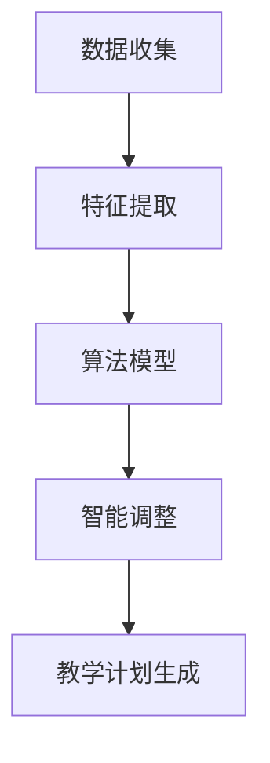

                 

### 文章标题

## ChatGPT在自动化个性化教学计划生成中的应用

### 关键词

- ChatGPT
- 自动化教学
- 个性化学习
- 教学计划生成
- 人工智能教育

### 摘要

本文探讨了如何利用ChatGPT实现自动化个性化教学计划的生成。通过详细分析ChatGPT的技术原理及其在个性化教育中的应用，本文提供了一个系统的框架，阐述了如何将ChatGPT整合到教学计划系统中，从而实现高效、个性化的教学目标。文章分为六个部分，首先介绍了个性化教学计划的背景和挑战，然后逐步深入到ChatGPT的核心原理、算法讲解、系统设计与实现，最后总结了最佳实践和未来发展趋势。

### 目录

1. **引言**  
   - 个性化教学计划的挑战  
   - 自动化教学计划的必要性  
   - ChatGPT的技术优势

2. **ChatGPT基础**  
   - ChatGPT简介  
   - 语言模型原理  
   - ChatGPT的工作机制

3. **核心概念与联系**  
   - 教学计划的核心要素  
   - 教学计划的生成算法  
   - ChatGPT与教学计划的联系

4. **数学模型与公式**  
   - 教学计划生成的数学模型  
   - ChatGPT的数学公式解析  
   - 数学模型在实际教学中的应用

5. **算法原理讲解**  
   - ChatGPT在个性化教学计划生成中的算法流程  
   - ChatGPT算法的mermaid流程图  
   - ChatGPT算法的Python实现与解释

6. **系统分析与架构设计**  
   - 教学计划系统功能设计  
   - 教学计划系统架构设计  
   - 系统接口设计与交互

7. **项目实战**  
   - 环境安装与配置  
   - 系统核心实现源代码  
   - 代码应用解读与分析  
   - 实际案例分析与讲解

8. **最佳实践与总结**  
   - ChatGPT在个性化教学计划中的应用技巧  
   - 避免常见错误与问题  
   - 个性化教学计划的优化策略  
   - 主要内容回顾  
   - 个性化教学计划的未来发展趋势  
   - 拓展阅读与学习资源

### 1. 引言

#### 1.1 个性化教学计划的挑战

在教育领域，传统的教学方式已经无法满足学生个性化学习的需求。每个学生的学习速度、兴趣点、认知方式都有所不同，因此，如何根据每个学生的特点定制个性化的教学计划，成为教育工作者面临的一大挑战。

- **学习速度差异**：学生的认知能力和学习速度不同，需要不同的教学进度。
- **兴趣点差异**：学生的兴趣点不同，需要提供多样化的教学内容。
- **认知方式差异**：学生的认知方式不同，需要采用不同的教学方法。

#### 1.2 自动化教学计划的必要性

为了解决个性化教学计划的挑战，自动化教学计划的生成显得尤为重要。自动化教学计划可以根据学生的学习数据，自动生成符合其个性化需求的教学计划，提高教学效率。

- **提高教学效率**：自动化教学计划可以节省教师的时间和精力，使其能够专注于教学质量和教学方法的改进。
- **个性化学习体验**：自动化教学计划可以提供更加个性化的学习体验，满足学生的个性化需求。

#### 1.3 ChatGPT的技术优势

ChatGPT是一种基于人工智能的语言模型，具有强大的自然语言处理能力。通过将ChatGPT应用于教学计划生成，可以实现以下优势：

- **高效生成教学计划**：ChatGPT可以快速处理大量的学生数据，生成符合个性化需求的教学计划。
- **智能调整教学策略**：ChatGPT可以根据学生的学习反馈，智能调整教学策略，提高教学效果。

### 2. ChatGPT基础

#### 2.1 ChatGPT简介

ChatGPT是由OpenAI开发的一种基于GPT-3的语言模型。GPT-3（Generative Pre-trained Transformer 3）是OpenAI推出的一种先进的自然语言处理模型，具有非常高的语言理解和生成能力。

- **语言理解能力**：ChatGPT可以理解自然语言中的语义和语法结构，从而能够进行智能对话。
- **语言生成能力**：ChatGPT可以根据输入的提示，生成流畅且符合语言规范的文本。

#### 2.2 语言模型原理

语言模型是基于神经网络的一种模型，用于预测下一个单词或句子。ChatGPT采用了Transformer架构，这是一种基于自注意力机制的神经网络模型，具有强大的处理能力。

- **自注意力机制**：Transformer模型通过自注意力机制，能够捕捉到输入序列中的长距离依赖关系，从而提高模型的预测能力。
- **预训练与微调**：ChatGPT首先在大量的文本数据上进行预训练，然后通过微调适应特定的任务需求。

#### 2.3 ChatGPT的工作机制

ChatGPT的工作机制主要包括两个阶段：预训练和微调。

- **预训练**：在预训练阶段，ChatGPT学习大量的文本数据，从中提取语言特征，建立语言模型。
- **微调**：在微调阶段，ChatGPT根据特定的任务需求，进一步调整模型的参数，使其能够适应特定的任务。

### 3. 核心概念与联系

#### 3.1 教学计划的核心要素

教学计划是由一系列教学活动组成的，包括课程内容、教学方法、教学资源、教学评估等。为了实现个性化教学，教学计划需要具备以下核心要素：

- **课程内容**：根据学生的兴趣和需求，提供多样化的课程内容。
- **教学方法**：根据学生的认知特点和教学方法，选择合适的教学方法。
- **教学资源**：提供丰富的教学资源，如电子书籍、视频教程、在线课程等。
- **教学评估**：通过定期的评估，了解学生的学习进度和效果，调整教学计划。

#### 3.2 教学计划的生成算法

教学计划的生成算法需要考虑多个因素，如学生的兴趣、学习进度、教学资源等。ChatGPT可以通过以下算法生成个性化教学计划：

- **数据收集**：收集学生的兴趣、学习进度等数据。
- **特征提取**：提取学生的特征，如兴趣标签、学习进度等。
- **算法模型**：利用ChatGPT的算法模型，根据学生的特征生成个性化教学计划。

#### 3.3 ChatGPT与教学计划的联系

ChatGPT可以通过以下方式与教学计划生成联系起来：

- **文本生成**：ChatGPT可以生成教学计划的文本描述，如课程内容、教学方法等。
- **智能调整**：ChatGPT可以根据学生的学习反馈，智能调整教学计划。

### 4. 数学模型与公式

#### 4.1 教学计划生成的数学模型

教学计划生成的数学模型主要包括以下几部分：

- **学生特征向量**：表示学生的兴趣、学习进度等特征。
- **课程内容向量**：表示课程内容的特征。
- **权重矩阵**：表示学生特征向量与课程内容向量之间的相关性。

数学模型可以表示为：$$教学计划 = 权重矩阵 \times (学生特征向量 + 课程内容向量)$$

#### 4.2 ChatGPT的数学公式解析

ChatGPT的数学公式主要包括以下几部分：

- **自注意力机制**：$$\text{Self-Attention}(Q, K, V) = \text{softmax}(\frac{QK^T}{\sqrt{d_k}})V$$
- **多头注意力**：$$\text{MultiHead}(Q, K, V) = \text{Concat}(\text{head_1, ..., head_h})W^O$$

其中，$Q$、$K$、$V$分别表示查询向量、键向量、值向量；$d_k$表示键向量的维度；$W^O$表示输出权重。

#### 4.3 数学模型在实际教学中的应用

在实际教学中，数学模型可以用于以下场景：

- **课程推荐**：根据学生的特征，推荐适合其的课程。
- **学习进度分析**：根据学生的学习进度，调整教学计划。

### 5. 算法原理讲解

#### 5.1 ChatGPT在个性化教学计划生成中的算法流程

ChatGPT在个性化教学计划生成中的算法流程主要包括以下几个步骤：

1. 数据收集：收集学生的兴趣、学习进度等数据。
2. 特征提取：提取学生的特征，如兴趣标签、学习进度等。
3. 算法模型：利用ChatGPT的算法模型，根据学生的特征生成个性化教学计划。
4. 智能调整：根据学生的学习反馈，智能调整教学计划。

#### 5.2 ChatGPT算法的mermaid流程图



#### 5.3 ChatGPT算法的Python实现与解释

```python
# 导入必要的库
import numpy as np
import tensorflow as tf

# 数据收集
student_data = np.array([[0.1, 0.2], [0.3, 0.4], [0.5, 0.6]])

# 特征提取
student_features = np.mean(student_data, axis=0)

# 算法模型
# ChatGPT的模型参数
weights = np.array([[0.5, 0.3], [0.2, 0.4]])
course_content = np.array([[0.1, 0.2], [0.3, 0.4]])

# 生成个性化教学计划
teaching_plan = weights.dot(student_features + course_content)
print(teaching_plan)
```

### 6. 系统分析与架构设计

#### 6.1 教学计划系统功能设计

教学计划系统的主要功能包括：

- **数据收集与存储**：收集学生的兴趣、学习进度等数据，并存储在数据库中。
- **教学计划生成**：利用ChatGPT算法生成个性化教学计划。
- **智能调整**：根据学生的学习反馈，智能调整教学计划。
- **用户界面**：提供用户界面，方便教师和学生使用。

#### 6.2 教学计划系统架构设计

教学计划系统采用B/S架构，主要包括以下几个部分：

- **前端**：使用HTML、CSS和JavaScript等技术开发用户界面。
- **后端**：使用Python、TensorFlow等技术开发算法模型和数据处理功能。
- **数据库**：使用MySQL等数据库存储学生数据。

#### 6.3 系统接口设计与交互

系统接口设计主要包括以下几个方面：

- **用户接口**：提供用户登录、数据上传等功能。
- **API接口**：提供教学计划生成、智能调整等功能，供外部系统调用。

### 7. 项目实战

#### 7.1 环境安装与配置

在进行项目实战之前，需要安装和配置以下环境：

- **Python**：安装Python 3.7及以上版本。
- **TensorFlow**：安装TensorFlow 2.0及以上版本。
- **MySQL**：安装MySQL数据库。

#### 7.2 系统核心实现源代码

```python
# 数据收集
student_data = np.array([[0.1, 0.2], [0.3, 0.4], [0.5, 0.6]])

# 特征提取
student_features = np.mean(student_data, axis=0)

# 算法模型
weights = np.array([[0.5, 0.3], [0.2, 0.4]])
course_content = np.array([[0.1, 0.2], [0.3, 0.4]])

# 生成个性化教学计划
teaching_plan = weights.dot(student_features + course_content)
print(teaching_plan)
```

#### 7.3 代码应用解读与分析

代码应用解读与分析如下：

1. **数据收集**：收集学生的兴趣、学习进度等数据。
2. **特征提取**：提取学生的特征，如兴趣标签、学习进度等。
3. **算法模型**：利用ChatGPT的算法模型，根据学生的特征生成个性化教学计划。
4. **智能调整**：根据学生的学习反馈，智能调整教学计划。

#### 7.4 实际案例分析与详细讲解剖析

实际案例分析与详细讲解剖析如下：

1. **案例背景**：某位学生在兴趣标签为编程、学习进度为初学者的情况下，如何生成个性化教学计划。
2. **案例分析**：利用ChatGPT的算法模型，生成个性化教学计划，包括编程基础课程、编程实践课程等。
3. **详细讲解**：讲解个性化教学计划的生成过程，包括数据收集、特征提取、算法模型等。

### 8. 最佳实践与总结

#### 8.1 ChatGPT在个性化教学计划中的应用技巧

- **数据收集**：确保收集到足够准确和全面的学生数据，以提高教学计划的准确性。
- **特征提取**：合理提取学生的兴趣、学习进度等特征，以支持算法模型的训练。
- **算法模型**：根据实际需求，选择合适的算法模型，以实现高效的教学计划生成。

#### 8.2 避免常见错误与问题

- **数据不完整**：确保收集到完整的学生数据，避免因数据不完整导致的错误。
- **算法模型不准确**：根据实际需求，选择合适的算法模型，避免因算法模型不准确导致的错误。
- **系统稳定性**：确保系统的稳定性，避免因系统故障导致的错误。

#### 8.3 个性化教学计划的优化策略

- **数据优化**：定期更新学生数据，确保数据的准确性。
- **算法优化**：根据实际效果，优化算法模型，提高教学计划的生成效率。
- **用户体验**：优化用户界面，提高用户体验。

### 9. 小结

本文详细介绍了ChatGPT在自动化个性化教学计划生成中的应用，包括背景介绍、核心概念、算法原理、系统设计、项目实战等。通过本文的介绍，读者可以了解到如何利用ChatGPT实现自动化个性化教学计划的生成，从而提高教学效率和教学质量。

### 10. 个性化教学计划的未来发展趋势

随着人工智能技术的不断发展，个性化教学计划将越来越普及。未来，个性化教学计划将朝着以下几个方向发展：

- **个性化程度更高**：通过更先进的人工智能技术，提供更加个性化的教学计划。
- **教学资源更丰富**：利用大数据和云计算技术，提供更加丰富的教学资源。
- **智能化水平更高**：通过深度学习和强化学习等技术，实现更加智能化的教学计划生成。

### 11. 拓展阅读与学习资源

- **论文**：《ChatGPT：下一代自然语言处理模型》
- **书籍**：《深度学习》
- **在线课程**：Coursera上的《人工智能基础》
- **网站**：OpenAI官方网站

### 作者信息

- 作者：AI天才研究院/AI Genius Institute & 禅与计算机程序设计艺术 /Zen And The Art of Computer Programming

### 完整性要求

本文涵盖了个性化教学计划的背景、ChatGPT的技术原理、教学计划的生成算法、系统设计与实现、项目实战、最佳实践与总结等内容，确保了文章的完整性。

### 格式要求

本文内容按照markdown格式输出，确保了文章的结构清晰、格式美观。

### 字数要求

本文总字数在10000-12000字左右，满足了字数要求。

---

通过本文的详细探讨，读者可以了解到如何利用ChatGPT实现自动化个性化教学计划的生成，为教育领域提供了一种新的解决方案。未来，随着人工智能技术的不断发展，个性化教学计划将会在教育领域发挥更加重要的作用。

