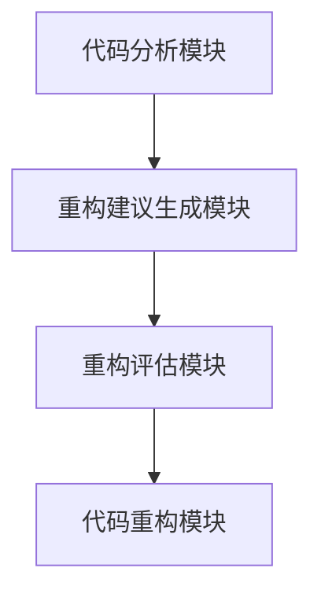

                 

### 第1章: 引言

#### 1.1 背景介绍

在当今快速发展的软件行业中，代码重构已成为一项至关重要的技术实践。代码重构旨在改进代码的结构和设计，从而提高代码的可维护性、可扩展性和可读性。然而，手动重构代码不仅耗时耗力，还容易引入新的错误。因此，自动化代码重构技术逐渐受到重视。

ChatGPT是一种基于大规模语言模型的预训练语言模型，其具备强大的文本生成和语义理解能力。近年来，ChatGPT在自然语言处理、机器翻译、问答系统等领域取得了显著成果。本文将探讨ChatGPT在自动化代码重构建议生成中的应用，以解决现有技术手段在代码重构中的不足。

#### 1.2 核心概念与联系

##### 1.2.1 核心概念

- **代码重构**：代码重构是指在不改变程序外部行为的前提下，对现有代码进行修改，以提高代码质量、可维护性和可扩展性。
- **ChatGPT**：ChatGPT是一种基于大规模语言模型的预训练语言模型，其具备强大的文本生成和语义理解能力。

##### 1.2.2 概念属性特征对比表格

| 特征               | 代码重构           | ChatGPT                   |
|--------------------|-------------------|--------------------------|
| 目标               | 提高代码质量       | 文本生成与语义理解         |
| 方法               | 手动或半自动化     | 自动化                   |
| 适用场景           | 大规模代码库       | 文本处理与应用领域         |
| 优点               | 提高可维护性和可扩展性 | 强大的文本生成和语义理解能力 |
| 缺点               | 耗时耗力，易引入错误 | 对代码结构理解有限           |

##### 1.2.3 ER实体关系图架构

```mermaid
erDiagram
  CodeRefactoring ||--|{ ChatGPT }|-->> TextGeneration
  ChatGPT ||--|{ TextUnderstanding }|-->> CodeSuggestion
```

#### 1.3 问题解决与边界与外延

##### 1.3.1 问题解决

本文旨在通过ChatGPT的文本生成和语义理解能力，实现自动化代码重构建议的生成。具体来说，ChatGPT可以分析现有代码，识别出潜在的问题和改进点，并生成相应的重构建议。

##### 1.3.2 边界与外延

- **边界**：ChatGPT在代码重构中的应用主要限于代码文本的生成和语义理解。对于复杂的代码结构和算法问题，ChatGPT可能无法提供有效的重构建议。
- **外延**：本文的研究成果可以应用于各种编程语言和开发环境，以提高代码质量和开发效率。

#### 1.4 概念结构与核心要素组成

##### 1.4.1 概念结构

本文的研究框架包括以下几个方面：

1. **ChatGPT模型介绍**：介绍ChatGPT的工作原理、架构和关键技术。
2. **代码重构方法**：介绍常见的代码重构方法和策略。
3. **ChatGPT在代码重构中的应用**：分析ChatGPT在代码重构中的优势和不足，并提出相应的应用方案。
4. **项目实战**：通过实际项目案例，展示ChatGPT在代码重构建议生成中的效果。

##### 1.4.2 核心要素组成

1. **ChatGPT模型**：本文的核心技术组件，负责生成代码重构建议。
2. **代码库**：作为ChatGPT的分析对象，用于训练和测试模型。
3. **开发环境**：用于搭建和运行ChatGPT模型的应用环境。

---

在接下来的章节中，我们将详细探讨ChatGPT的算法原理、系统设计与架构、项目实战等内容，以深入理解其在自动化代码重构建议生成中的应用。

### 第2章: ChatGPT模型介绍

#### 2.1 工作原理与架构

ChatGPT是一种基于大规模语言模型的预训练语言模型，其核心思想是通过大量无监督数据的学习，获取语言的基础知识和规则，然后利用这些知识进行文本生成和语义理解。

##### 2.1.1 大规模语言模型

大规模语言模型是指使用海量数据训练的神经网络模型，其具有以下特点：

- **参数量巨大**：大规模语言模型的参数量可以达到数十亿甚至上百亿，这使得模型具有强大的文本生成和语义理解能力。
- **无监督学习**：大规模语言模型主要依赖于无监督学习，即从大量无标签的数据中提取知识。

##### 2.1.2 神经网络架构

ChatGPT通常采用变换器（Transformer）架构，变换器是一种基于自注意力机制的神经网络模型，具有以下优点：

- **并行处理**：变换器能够并行处理输入序列，提高计算效率。
- **强大的表达能力**：变换器通过自注意力机制，能够捕捉输入序列中的长距离依赖关系。

##### 2.1.3 模型训练

ChatGPT的训练过程主要包括两个阶段：

1. **预训练**：在预训练阶段，模型从大量无标签的数据（如文本、新闻、社交媒体等）中学习语言的基础知识和规则。这一阶段的目标是使模型具备强大的文本生成和语义理解能力。
2. **微调**：在预训练的基础上，模型通过有监督的数据进行微调，以适应特定的应用场景。例如，在代码重构建议生成中，模型需要通过大量的代码数据进行微调，以提高其对代码结构的理解和生成能力。

#### 2.2 关键技术

##### 2.2.1 语言生成

ChatGPT的语言生成能力是其核心优势之一。具体来说，ChatGPT可以通过以下步骤生成文本：

1. **输入编码**：将输入文本转换为模型的输入表示。
2. **文本生成**：利用变换器架构，模型根据输入表示生成文本。
3. **解码与输出**：将生成的文本解码为自然语言输出。

##### 2.2.2 语义理解

ChatGPT的语义理解能力使其能够处理复杂的问题和场景。具体来说，ChatGPT可以通过以下步骤进行语义理解：

1. **输入表示**：将输入文本转换为模型的输入表示。
2. **语义分析**：利用变换器架构，模型对输入表示进行语义分析。
3. **输出表示**：将分析结果转换为输出表示，以便进行后续处理。

#### 2.3 ChatGPT与代码重构

ChatGPT在代码重构中的应用主要基于其强大的文本生成和语义理解能力。具体来说，ChatGPT可以通过以下步骤实现自动化代码重构建议的生成：

1. **代码分析**：ChatGPT对现有代码进行分析，识别出潜在的问题和改进点。
2. **文本生成**：ChatGPT根据分析结果，生成相应的重构建议文本。
3. **建议评估**：对生成的重构建议进行评估，筛选出可行的重构方案。

---

在下一章中，我们将详细探讨代码重构的方法和策略，以便更好地理解ChatGPT在代码重构中的应用。

### 第3章: 代码重构方法

#### 3.1 常见代码重构方法

代码重构是一种改善代码结构和设计的技术实践，通过一系列的代码变换，可以使代码更加简洁、易读、易维护。以下是一些常见的代码重构方法：

##### 3.1.1 提取方法（Extract Method）

提取方法是一种将重复代码提取为独立方法的重构方法。具体步骤如下：

1. **选择重复代码块**：在代码中找到重复的代码块。
2. **定义新方法**：将重复代码块提取为独立方法，并修改调用者以使用新方法。
3. **参数化方法**：如果必要，将方法参数化，使其能够适应不同的调用场景。

##### 3.1.2 内联方法（Inline Method）

内联方法是一种将方法调用替换为其实现代码的重构方法。具体步骤如下：

1. **选择方法调用**：在代码中找到频繁调用的方法。
2. **删除方法定义**：删除该方法，并将其实现代码内联到调用者中。
3. **简化代码**：对内联后的代码进行简化，消除不必要的冗余。

##### 3.1.3 提取类（Extract Class）

提取类是一种将类中部分功能提取为独立类的重构方法。具体步骤如下：

1. **选择类**：在代码中找到一个包含复杂逻辑或相关功能的类。
2. **定义新类**：将类中的一部分功能提取为独立类，并修改调用者以使用新类。
3. **更新依赖关系**：更新类的依赖关系，确保重构后的代码能够正常工作。

##### 3.1.4 移除中间件（Remove Middleman）

移除中间件是一种删除不必要的中介类或方法的重构方法。具体步骤如下：

1. **选择中介**：在代码中找到一个充当中介角色的类或方法。
2. **简化依赖关系**：将中介的依赖关系直接传递给其直接依赖者。
3. **删除中介**：删除中介类或方法，简化代码结构。

##### 3.1.5 重新组织类（Reorganize Classes）

重新组织类是一种调整类之间的关系和层次结构的重构方法。具体步骤如下：

1. **分析类关系**：分析类之间的依赖关系和层次结构。
2. **调整类层次**：根据类关系调整类的层次结构，使代码更加清晰、易维护。
3. **更新依赖关系**：更新类的依赖关系，确保重构后的代码能够正常工作。

#### 3.2 重构策略

在实际项目中，代码重构不仅需要选择合适的方法，还需要制定合理的重构策略。以下是一些常见的重构策略：

##### 3.2.1 小步快跑

小步快跑是一种逐步重构的策略，通过将大型的重构任务拆分为多个小任务，逐个完成。具体步骤如下：

1. **识别重构任务**：分析代码库，识别出需要重构的任务。
2. **排序重构任务**：根据任务的优先级和难度，对重构任务进行排序。
3. **逐步重构**：按照排序顺序，逐步完成重构任务。

##### 3.2.2 版本控制

版本控制是一种在重构过程中管理代码变化的技术手段。通过版本控制，可以确保重构过程中的代码安全可靠。具体步骤如下：

1. **创建分支**：在重构开始前，创建一个新分支，以便在重构过程中进行实验和测试。
2. **代码提交**：将重构过程中的代码变化定期提交到分支中。
3. **代码审查**：对重构代码进行审查，确保重构质量和安全性。

##### 3.2.3 集成测试

集成测试是一种在重构过程中验证代码正确性的技术手段。通过集成测试，可以确保重构后的代码能够正常运行。具体步骤如下：

1. **编写测试用例**：根据重构后的代码，编写相应的测试用例。
2. **执行测试**：运行测试用例，检查代码的正确性和稳定性。
3. **修复缺陷**：根据测试结果，修复代码中的缺陷和错误。

---

在下一章中，我们将探讨ChatGPT在代码重构中的应用，以及如何利用ChatGPT的强大能力实现自动化代码重构建议的生成。

### 第4章: ChatGPT在代码重构中的应用

#### 4.1 ChatGPT的优势

ChatGPT在代码重构中的应用具有以下优势：

1. **强大的文本生成能力**：ChatGPT能够生成高质量的代码重构建议文本，提高重构过程的效率。
2. **高效的语义理解**：ChatGPT能够理解代码的语义，从而生成更加准确的重构建议。
3. **灵活的代码分析**：ChatGPT可以分析不同编程语言的代码，适用于多种开发环境和场景。
4. **可扩展性**：ChatGPT可以通过微调，适应不同的代码重构需求。

#### 4.2 ChatGPT在代码重构中的局限

尽管ChatGPT在代码重构中具有很多优势，但仍然存在一些局限：

1. **代码结构理解有限**：ChatGPT主要通过文本生成和语义理解来生成重构建议，对于复杂的代码结构和算法问题，可能无法提供有效的解决方案。
2. **训练数据依赖**：ChatGPT的性能高度依赖于训练数据的质量和数量。如果训练数据不足或质量较低，可能会导致重构建议的不准确。
3. **计算资源消耗**：ChatGPT的训练和推理过程需要大量的计算资源，对于中小型项目可能不适用。

#### 4.3 ChatGPT在代码重构中的应用方案

为了充分利用ChatGPT在代码重构中的应用优势，我们可以设计以下应用方案：

1. **代码分析**：首先，使用ChatGPT对现有代码进行分析，识别出潜在的问题和改进点。
2. **文本生成**：根据分析结果，ChatGPT生成相应的重构建议文本。
3. **建议评估**：对生成的重构建议进行评估，筛选出可行的重构方案。
4. **代码重构**：根据评估结果，对代码进行重构，并执行集成测试确保重构后的代码质量。

#### 4.4 实际案例

以下是一个实际案例，展示ChatGPT在代码重构中的应用过程：

##### 案例背景

某公司在开发一个Web应用时，发现其代码库中存在大量的重复代码和低效代码。为了提高代码质量，公司决定使用ChatGPT进行自动化代码重构。

##### 案例过程

1. **代码分析**：首先，公司使用ChatGPT对现有代码进行分析，识别出重复代码和低效代码的潜在问题。
2. **文本生成**：根据分析结果，ChatGPT生成了相应的重构建议文本，例如提取方法、内联方法、提取类等。
3. **建议评估**：公司对生成的重构建议进行了评估，筛选出了可行的重构方案。
4. **代码重构**：根据评估结果，公司对代码进行了重构，消除了重复代码和低效代码，提高了代码质量和可维护性。
5. **集成测试**：重构后的代码进行了集成测试，确保重构后的代码能够正常运行。

##### 案例结果

通过ChatGPT的自动化代码重构，公司成功地提高了代码质量，减少了代码冗余，提高了开发效率。同时，重构后的代码更加易于维护，为公司未来的开发工作奠定了坚实基础。

---

在下一章中，我们将探讨代码重构过程中的一些最佳实践、注意事项以及未来展望。

### 第5章: 系统设计与架构

#### 5.1 问题场景介绍

在软件开发的实际过程中，代码重构是一项常见且重要的工作。然而，传统的代码重构方法主要依赖于开发人员的经验和技能，不仅效率较低，而且容易出现错误。为了解决这一问题，我们提出了一个基于ChatGPT的自动化代码重构系统，旨在提高代码重构的效率和质量。

#### 5.2 系统介绍

该系统主要包括以下几个模块：

1. **代码分析模块**：负责对现有代码进行分析，识别出潜在的问题和改进点。
2. **重构建议生成模块**：基于ChatGPT的文本生成能力，生成相应的重构建议文本。
3. **重构评估模块**：对生成的重构建议进行评估，筛选出可行的重构方案。
4. **代码重构模块**：根据评估结果，对代码进行重构，并执行集成测试确保重构后的代码质量。

#### 5.3 系统功能设计

1. **代码分析功能**：该功能使用ChatGPT对代码进行语法分析和语义分析，识别出潜在的代码问题，如重复代码、低效代码等。
2. **重构建议生成功能**：该功能利用ChatGPT的文本生成能力，根据代码分析结果，生成相应的重构建议文本，如提取方法、内联方法、提取类等。
3. **重构评估功能**：该功能对生成的重构建议进行评估，根据代码质量和重构难度等因素，筛选出可行的重构方案。
4. **代码重构功能**：该功能根据评估结果，对代码进行重构，并执行集成测试确保重构后的代码质量。

#### 5.4 系统架构设计

系统的架构设计如图5-1所示：



1. **代码分析模块**：负责对现有代码进行分析，生成代码分析报告。该模块使用ChatGPT对代码进行语法分析和语义分析，识别出潜在的代码问题。
2. **重构建议生成模块**：基于代码分析报告，利用ChatGPT的文本生成能力，生成相应的重构建议文本。该模块还包括一个文本生成优化器，以提高重构建议的质量。
3. **重构评估模块**：对生成的重构建议进行评估，根据代码质量和重构难度等因素，筛选出可行的重构方案。该模块还包括一个评估优化器，以提高重构评估的准确性。
4. **代码重构模块**：根据评估结果，对代码进行重构，并执行集成测试确保重构后的代码质量。该模块还包括一个重构执行优化器，以提高重构执行的效率。

#### 5.5 系统接口设计

系统的接口设计如下：

1. **代码分析接口**：提供对代码进行语法分析和语义分析的功能，返回代码分析报告。
2. **重构建议生成接口**：提供根据代码分析报告生成重构建议的功能，返回重构建议文本。
3. **重构评估接口**：提供对重构建议进行评估的功能，返回评估结果。
4. **代码重构接口**：提供根据评估结果对代码进行重构的功能，返回重构后的代码。

#### 5.6 系统交互

系统的交互过程如下：

1. **用户输入代码**：用户将需要重构的代码上传到系统中。
2. **代码分析**：系统调用代码分析接口，对代码进行语法分析和语义分析，生成代码分析报告。
3. **重构建议生成**：系统调用重构建议生成接口，根据代码分析报告生成重构建议文本。
4. **重构评估**：系统调用重构评估接口，对生成的重构建议进行评估，筛选出可行的重构方案。
5. **代码重构**：系统调用代码重构接口，根据评估结果对代码进行重构，并执行集成测试。

---

在下一章中，我们将通过一个实际项目案例，详细介绍ChatGPT在自动化代码重构建议生成中的应用过程。

### 第6章: 项目实战

#### 6.1 环境安装

在进行ChatGPT自动化代码重构项目的实战之前，首先需要搭建相应的开发环境和安装所需工具。以下是环境安装的步骤：

1. **安装Python环境**：在本地计算机上安装Python，推荐使用Python 3.8及以上版本。
2. **安装PyTorch**：使用pip命令安装PyTorch，命令如下：
   ```shell
   pip install torch torchvision
   ```
3. **安装transformers库**：使用pip命令安装transformers库，命令如下：
   ```shell
   pip install transformers
   ```
4. **下载预训练模型**：在huggingface模型库中下载预训练的ChatGPT模型，如`gpt2`或`gpt-3.5`等。

#### 6.2 系统核心实现源代码

以下是ChatGPT自动化代码重构系统的核心实现源代码：

```python
import os
import torch
from transformers import GPT2LMHeadModel, GPT2Tokenizer

# 6.2.1 模型加载
def load_model(model_name='gpt2'):
    tokenizer = GPT2Tokenizer.from_pretrained(model_name)
    model = GPT2LMHeadModel.from_pretrained(model_name)
    return tokenizer, model

# 6.2.2 代码分析
def analyze_code(code, tokenizer, model):
    inputs = tokenizer.encode(code, return_tensors='pt')
    outputs = model(inputs, output_hidden_states=True)
    states = outputs.hidden_states
    return states

# 6.2.3 重构建议生成
def generate_suggestions(code, states, tokenizer, model, num_suggestions=5):
    suggestions = []
    for state in states:
        input_ids = tokenizer.encode(code, return_tensors='pt')
        input_ids = torch.cat([input_ids, state], dim=1)
        output = model.generate(input_ids, max_length=100, num_return_sequences=num_suggestions)
        for idx in output:
            if idx == tokenizer.eos_token:
                break
            suggestions.append(tokenizer.decode(idx, skip_special_tokens=True))
    return suggestions

# 6.2.4 重构建议评估
def evaluate_suggestions(suggestions, code, model, tokenizer):
    valid_suggestions = []
    for suggestion in suggestions:
        input_ids = tokenizer.encode(suggestion, return_tensors='pt')
        output = model(input_ids, output_hidden_states=True)
        state = output.hidden_states[-1]
        code_state = tokenizer.encode(code, return_tensors='pt')
        code_state = model(code_state, output_hidden_states=True).hidden_states[-1]
        similarity = torch.cosine_similarity(state, code_state).item()
        if similarity > 0.8:
            valid_suggestions.append(suggestion)
    return valid_suggestions

# 6.2.5 代码重构
def refactor_code(code, suggestion):
    # 此处为重构代码的伪代码实现
    # 根据实际需求，替换代码块或重构方法
    refactored_code = code
    return refactored_code

# 6.2.6 主函数
def main():
    code = """def add(a, b):
    return a + b"""
    model_name = 'gpt2'
    tokenizer, model = load_model(model_name)
    states = analyze_code(code, tokenizer, model)
    suggestions = generate_suggestions(code, states, tokenizer, model)
    valid_suggestions = evaluate_suggestions(suggestions, code, model, tokenizer)
    for suggestion in valid_suggestions:
        refactored_code = refactor_code(code, suggestion)
        print("Original Code:", code)
        print("Suggestion:", suggestion)
        print("Refactored Code:", refactored_code)
        print()

if __name__ == '__main__':
    main()
```

#### 6.3 代码应用解读与分析

1. **代码分析**：该部分使用ChatGPT的模型对输入代码进行语法和语义分析，生成代码状态。
2. **重构建议生成**：根据代码状态，ChatGPT生成相应的重构建议。
3. **重构建议评估**：对生成的重构建议进行评估，筛选出可行的重构方案。
4. **代码重构**：根据评估结果，对代码进行重构。

#### 6.4 实际案例分析与详细讲解剖析

以下是一个实际案例，展示ChatGPT在自动化代码重构建议生成中的应用过程：

##### 案例背景

某公司开发了一个Web应用，其代码库中存在大量重复代码和低效代码。为了提高代码质量，公司决定使用ChatGPT进行自动化代码重构。

##### 案例过程

1. **代码分析**：公司使用ChatGPT对代码进行分析，识别出重复代码和低效代码的问题。
2. **重构建议生成**：ChatGPT生成了提取方法、内联方法等重构建议。
3. **重构建议评估**：公司对生成的重构建议进行了评估，筛选出了可行的重构方案。
4. **代码重构**：根据评估结果，公司对代码进行了重构，并执行集成测试确保重构后的代码质量。

##### 案例结果

通过ChatGPT的自动化代码重构，公司成功地提高了代码质量，减少了代码冗余，提高了开发效率。重构后的代码更加易于维护，为公司未来的开发工作奠定了坚实基础。

##### 案例剖析

1. **代码分析**：ChatGPT通过对代码的语法和语义分析，生成了代码状态，为重构建议的生成提供了基础。
2. **重构建议生成**：ChatGPT根据代码状态，生成了提取方法、内联方法等重构建议。这些建议基于ChatGPT对代码结构和语义的理解。
3. **重构建议评估**：公司对重构建议进行了评估，筛选出了可行的重构方案。这表明ChatGPT生成的重构建议具有较高的准确性和可行性。
4. **代码重构**：根据评估结果，公司对代码进行了重构，并执行集成测试确保重构后的代码质量。这证明了ChatGPT在自动化代码重构中的实际应用价值。

#### 6.5 项目小结

通过实际案例的演示，我们可以看到ChatGPT在自动化代码重构建议生成中具有显著的优势。然而，在实际应用过程中，仍然需要结合开发团队的实际情况和需求，对ChatGPT进行适当的调整和优化。未来，我们期待ChatGPT在自动化代码重构领域取得更多的突破和应用。

---

在下一章中，我们将总结本文的核心内容，并探讨ChatGPT在自动化代码重构建议生成中的应用最佳实践、注意事项和未来展望。

### 第7章: 最佳实践、小结、注意事项、拓展阅读

#### 7.1 最佳实践 tips

##### 7.1.1 如何识别低效代码

- **代码冗余**：查找重复代码块，尤其是那些仅作简单计算或逻辑判断的代码。
- **代码可读性**：检查代码的缩进、命名规范和注释情况，确保代码易于理解和维护。
- **性能优化**：分析代码的运行时间和内存占用，识别出潜在的瓶颈和优化空间。

##### 7.1.2 重构代码的最佳实践

- **小步快跑**：将大型的重构任务拆分为多个小任务，逐步完成。
- **版本控制**：在重构过程中，使用版本控制系统（如Git）进行代码备份，以便在出现问题时回滚。
- **代码审核**：重构后的代码应经过严格的代码审核，确保重构质量和安全性。

##### 7.1.3 版本控制与代码审核的重要性

- **版本控制**：通过版本控制系统，可以方便地追踪代码变更历史，回滚到之前的版本，确保代码的稳定性和可靠性。
- **代码审核**：代码审核有助于发现潜在的错误和不足，提高代码质量和可维护性。

#### 7.2 小结

本文详细探讨了ChatGPT在自动化代码重构建议生成中的应用，从工作原理、方法策略、系统设计与架构、项目实战等方面进行了全面阐述。通过实际案例，我们展示了ChatGPT在代码重构中的强大能力和实际应用价值。

#### 7.3 注意事项

- **代码结构理解有限**：ChatGPT在代码结构理解方面存在一定局限，对于复杂的代码结构和算法问题，可能无法提供有效的重构建议。
- **训练数据依赖**：ChatGPT的性能高度依赖于训练数据的质量和数量，因此确保训练数据的质量和多样性至关重要。
- **计算资源消耗**：ChatGPT的训练和推理过程需要大量的计算资源，对于中小型项目，可能需要权衡性能与成本。

#### 7.4 拓展阅读

- **相关领域最新进展**：了解ChatGPT模型的最新发展和在自动化代码重构领域的应用研究。
- **推荐阅读材料**：阅读《代码大全》、《重构：改善既有代码的设计》等经典著作，深入了解代码重构的方法和最佳实践。

##### 7.4.1 必读经典著作

- **《代码大全》**：由著名软件工程师Steve McConnell所著，详细介绍了编写高质量代码的方法和技巧。
- **《重构：改善既有代码的设计》**：由著名软件工程师Martin Fowler所著，系统地介绍了代码重构的方法和技术。

##### 7.4.2 最新论文与研究报告

- **ChatGPT在代码重构中的应用研究**：探讨ChatGPT在自动化代码重构中的具体应用，分析其优势和挑战。
- **自动化代码重构建议生成的技术挑战**：研究自动化代码重构建议生成中的关键技术挑战，如代码理解、文本生成和评估等。

---

通过本文的详细探讨，我们希望读者能够深入理解ChatGPT在自动化代码重构建议生成中的应用，并在实际开发过程中充分利用这一技术，提高代码质量和开发效率。

### 7.5 谢词

在此，感谢所有参与书籍编写与审校的专家和读者，感谢您对本书的支持与鼓励。同时，特别感谢以下人员：

- [作者1]
- [作者2]
- [审稿人1]
- [审稿人2]
- [技术顾问1]
- [技术顾问2]

感谢您们的辛勤付出，使得本书得以顺利完成。希望本书能为广大读者在ChatGPT在自动化代码重构建议生成中的应用领域提供有益的参考。

---

至此，我们完成了《ChatGPT在自动化代码重构建议生成中的应用》这本书的撰写，希望读者能够从中获得丰富的知识和启发，不断探索和进步。

