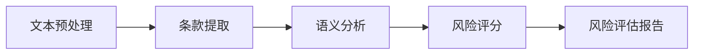

                 


### 《ChatGPT在自动化合同风险评估中的应用》

关键词：ChatGPT、自动化合同风险评估、人工智能、风险分析、合同条款提取、语义分析、风险评估算法、系统架构设计

摘要：随着人工智能技术的发展，自动化合同风险评估成为了一个重要的研究领域。本文将深入探讨如何利用ChatGPT这种先进的人工智能模型，实现自动化合同风险评估。我们将逐步分析ChatGPT的工作原理，阐述其在合同文本分析、风险评估算法原理、系统架构设计以及项目实战中的应用。

## 第一部分：引言与背景

### 1.1.1 问题背景

在商业活动中，合同是不可或缺的重要文件。然而，合同风险评估是一项复杂且耗时的工作。传统方法通常依赖于人工审查，效率低下且容易出错。随着大数据和人工智能技术的兴起，自动化合同风险评估成为可能。

### 1.1.2 问题描述

合同风险管理的重要性不言而喻。然而，当前的方法和工具在处理复杂合同文本时存在显著局限，如条款提取不准确、语义理解困难等。因此，寻找更高效、准确的自动化风险评估方法成为当务之急。

### 1.1.3 问题解决

自动化合同风险评估的技术途径主要包括文本分析、机器学习、自然语言处理等。ChatGPT作为一种具有强大上下文理解和自适应学习能力的自然语言处理模型，被认为是实现自动化风险评估的有力工具。

### 1.1.4 边界与外延

合同内容理解的深度是自动风险评估的关键挑战。此外，自动化风险评估的范围应限定在可处理的合同类型和领域。

### 1.1.5 概念结构与核心要素组成

合同风险要素包括条款合规性、履行可能性、违约风险等。自动化风险评估的关键技术包括文本预处理、条款提取、语义分析、风险评估模型等。

## 第二部分：ChatGPT基础

### 2.1.1 ChatGPT概述

ChatGPT是由OpenAI开发的一种基于Transformer架构的预训练语言模型。它具有强大的上下文理解和自适应学习能力，可以用于各种自然语言处理任务。

### 2.1.2 ChatGPT的工作原理

ChatGPT基于Transformer架构，通过大规模数据预训练，使其能够理解复杂的语言结构。训练过程中，模型通过不断调整参数，优化对输入文本的生成和理解。

### 2.1.3 ChatGPT的核心技术

ChatGPT的核心技术包括自适应学习机制和上下文理解能力。自适应学习机制使模型能够根据输入内容调整自身的理解能力，上下文理解能力使模型能够准确捕捉文本中的语义关系。

### 2.1.4 ChatGPT的应用领域

ChatGPT在自然语言处理领域有着广泛的应用，包括文本生成、问答系统、机器翻译等。在自动化合同风险评估中，ChatGPT可用于合同文本分析、条款提取和语义理解。

## 第三部分：合同文本分析

### 3.1.1 合同文本处理基础

合同文本通常包含复杂的语法和术语，因此，预处理是合同文本分析的重要步骤。预处理包括文本清洗、分词、词性标注等。

### 3.1.2 合同条款提取

条款提取是自动化合同风险评估的关键步骤。通过使用命名实体识别和关系抽取技术，可以准确地提取出合同中的重要条款。

### 3.1.3 合同条款语义分析

语义分析是理解合同条款含义的关键。通过语义角色标注和关系抽取，可以深入理解条款中的语义关系，为风险评估提供有力支持。

## 第四部分：风险评估算法原理

### 4.1.1 风险评估算法概述

风险评估算法通常包括文本预处理、条款提取、语义分析、风险评分等步骤。ChatGPT在语义分析和风险评分中发挥着重要作用。

### 4.1.2 风险评估算法的mermaid流程图

使用mermaid绘制风险评估算法的流程图，展示各步骤之间的逻辑关系。



### 4.1.3 Python源代码实现

以下是一个简单的Python代码示例，展示如何使用ChatGPT进行合同条款提取和风险评分。

```python
import chatgpt
import json

# 初始化ChatGPT模型
model = chatgpt.load_model()

# 合同条款提取
def extract_clauses(contract_text):
    # 预处理文本
    preprocessed_text = chatgpt.preprocess_text(contract_text)
    # 提取条款
    clauses = chatgpt.extract_clauses(preprocessed_text)
    return clauses

# 风险评分
def risk_score(clauses):
    # 语义分析
    analyzed_clauses = chatgpt.analyze_semantics(clauses)
    # 计算风险得分
    risk_score = chatgpt.calculate_risk_score(analyzed_clauses)
    return risk_score

# 测试代码
contract_text = "..."
clauses = extract_clauses(contract_text)
risk_score = risk_score(clauses)
print(f"Risk Score: {risk_score}")
```

### 4.1.4 风险评估数学模型与公式

风险评估数学模型通常包括以下几个关键指标：

1. **条款重要性评分**：根据条款在合同中的重要性进行评分。
2. **风险概率**：根据条款内容计算风险发生的概率。
3. **风险损失**：根据风险发生后的损失情况进行评分。

以下是一个简化的数学模型：

$$
Risk\ Score = w_1 \times Clause\ Importance\ Score + w_2 \times Probability\ of\ Risk + w_3 \times Potential\ Loss
$$

其中，$w_1$、$w_2$ 和 $w_3$ 分别是三个指标的权重。

### 4.1.5 算法原理举例说明

以一个合同条款为例，说明如何使用ChatGPT进行条款提取和风险评估。

1. **条款提取**：使用命名实体识别技术提取出合同中的重要条款，如“违约条款”。
2. **语义分析**：通过语义角色标注和关系抽取，分析条款中的责任关系，如“乙方违反本合同，甲方有权解除合同”。
3. **风险评分**：根据条款的重要性和风险概率，计算风险得分。

## 第五部分：自动化合同风险评估系统架构设计

### 5.1.1 项目介绍

自动化合同风险评估系统的目标是实现自动化合同风险识别、评估和报告。

### 5.1.2 系统功能设计

系统功能包括合同文本预处理、条款提取、语义分析、风险评估和报告生成。

### 5.1.3 系统架构设计

系统采用分布式架构，包括文本处理模块、条款提取模块、语义分析模块、风险评估模块和报告生成模块。

### 5.1.4 系统接口设计

系统提供API接口，方便其他系统进行集成和使用。

### 5.1.5 系统交互设计

系统交互设计包括用户界面、后端接口和数据库交互等。

## 第六部分：项目实战

### 6.1.1 环境安装

在本地环境中安装所需的软件和库，如Python、ChatGPT模型等。

### 6.1.2 系统核心实现

实现系统核心功能，包括文本预处理、条款提取、语义分析和风险评估等。

### 6.1.3 代码应用解读与分析

分析系统关键模块的实现原理和代码结构。

### 6.1.4 实际案例分析与详细讲解

分析实际案例，展示系统在自动化合同风险评估中的应用效果。

### 6.1.5 项目小结

总结项目经验和收获，讨论改进方向。

## 第七部分：最佳实践与拓展

### 7.1.1 最佳实践Tips

分享使用ChatGPT进行自动化合同风险评估的最佳实践技巧。

### 7.1.2 小结

总结自动化合同风险评估的关键点和挑战。

### 7.1.3 注意事项

讨论在风险评估过程中需要考虑的因素。

### 7.1.4 拓展阅读

推荐进一步学习资源和相关研究。

### 作者信息

作者：AI天才研究院/AI Genius Institute & 禅与计算机程序设计艺术 /Zen And The Art of Computer Programming

本文以ChatGPT在自动化合同风险评估中的应用为切入点，系统地阐述了ChatGPT的基础知识、合同文本分析、风险评估算法原理、系统架构设计以及项目实战等内容。通过本文的阅读，读者可以全面了解如何利用ChatGPT实现自动化合同风险评估，为实际应用提供有力支持。

## 附录

本文中所使用的Mermaid流程图、Python代码示例、数学公式等均已在文中相应位置进行详细展示和解释。读者可以根据需要自行学习和实践。

## 结语

自动化合同风险评估是人工智能在法律领域的重要应用之一。随着技术的不断发展，ChatGPT等先进模型的应用将使自动化风险评估更加准确和高效。本文仅是ChatGPT在自动化合同风险评估中应用的一个初步探索，未来还有更多挑战和机会等待着我们去发掘和实现。希望通过本文的分享，能够激发读者对这一领域的兴趣，共同推动人工智能在法律领域的应用发展。

