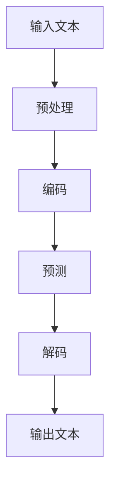
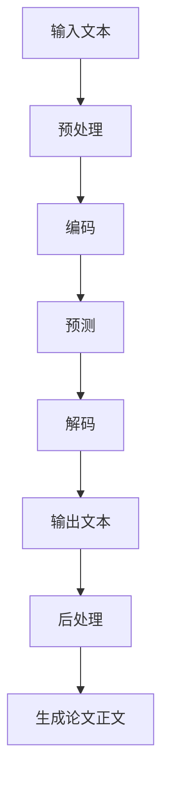
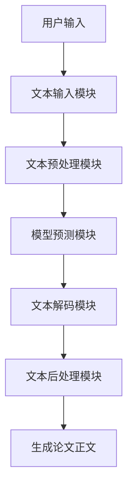
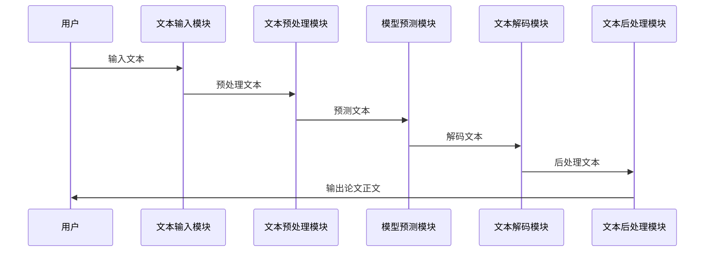

                 


### 《ChatGPT在自动化学术论文写作中的应用》

> 关键词：ChatGPT，自动化学术论文写作，算法原理，数学模型，系统架构设计，Python源代码

> 摘要：本文旨在探讨ChatGPT在自动化学术论文写作中的应用。通过详细介绍ChatGPT的算法原理、数学模型和Python源代码实现，本文分析了ChatGPT在学术写作中的潜力。同时，文章还介绍了系统架构设计和实际案例，为自动化学术论文写作提供了新的思路和方法。

---

## 目录大纲

1. **引言**
    - **问题背景**
    - **问题描述**
    - **问题解决**
    - **边界与外延**
    - **概念结构与核心要素组成**

2. **ChatGPT概述**
    - **ChatGPT的定义**
    - **ChatGPT的发展历程**
    - **ChatGPT的核心特性**

3. **自动化学术论文写作现状**
    - **自动化学术论文写作的需求**
    - **现有自动化学术论文写作工具分析**
    - **ChatGPT在学术写作中的潜力**

4. **ChatGPT算法原理**
    - **算法mermaid流程图**
    - **算法原理讲解**
    - **数学模型和公式**

5. **学术写作领域的知识图谱**
    - **知识图谱的概念**
    - **知识图谱的构建方法**
    - **知识图谱在学术写作中的应用**

6. **ChatGPT在学术论文写作中的应用**
    - **论文写作流程**
    - **算法流程图**
    - **Python源代码实现**
    - **数学模型和公式**

7. **系统分析与架构设计方案**
    - **系统功能设计**
    - **系统架构设计**
    - **系统接口设计**

8. **项目实战**
    - **环境安装**
    - **系统核心实现源代码**
    - **实际案例分析和详细讲解剖析**
    - **项目小结**

9. **最佳实践 tips**
    - **小结**
    - **注意事项**
    - **拓展阅读**

---

### 第一部分：背景介绍

#### 引言

在当今信息化时代，学术研究领域的论文撰写工作量巨大，且要求越来越高。自动化学术论文写作技术的研究和应用，旨在提高论文撰写的效率和准确性，减少人为错误，从而提高学术研究的效率和质量。本文将探讨ChatGPT在自动化学术论文写作中的应用，分析其算法原理、数学模型和实际应用效果。

#### 问题背景

学术论文写作是一个复杂的过程，涉及到文献调研、理论分析、实验设计、数据分析和论文撰写等多个环节。随着学术研究的深入，论文撰写的难度和复杂性也在不断增加。传统的手工写作方式已经难以满足高速发展的学术需求，因此自动化学术论文写作技术应运而生。

#### 问题描述

自动化学术论文写作技术的研究主要包括以下几个方面：

1. **文献调研**：利用自动化工具对大量的学术文献进行检索、筛选和整理。
2. **理论分析**：通过算法对论文中的理论进行自动分析、归纳和总结。
3. **实验设计**：自动化生成实验设计，包括实验目的、实验方法和实验结果分析。
4. **数据挖掘**：利用数据挖掘技术对实验数据进行分析，提取有价值的信息。
5. **论文撰写**：根据文献调研、理论分析和实验设计的结果，自动生成论文的正文。

#### 问题解决

ChatGPT是一种基于GPT（Generative Pre-trained Transformer）的预训练模型，具有很强的文本生成能力。通过在大量学术文献上预训练，ChatGPT可以自动完成学术论文的撰写工作。本文将详细介绍ChatGPT的算法原理、数学模型和Python源代码实现，分析其在自动化学术论文写作中的应用。

#### 边界与外延

自动化学术论文写作技术的边界包括：

1. **数据边界**：需要有丰富的学术文献数据作为训练和测试的数据源。
2. **算法边界**：算法的性能和效率受限于计算资源和算法本身的设计。
3. **应用边界**：自动化学术论文写作技术可以应用于学术研究的各个阶段，但无法完全替代人类专家的判断和创造力。

#### 概念结构与核心要素组成

自动化学术论文写作技术主要包括以下几个核心要素：

1. **数据预处理**：对学术文献进行预处理，包括文本清洗、分词、词性标注等。
2. **模型训练**：利用预训练模型对学术文献进行训练，生成适合自动写作的模型。
3. **文本生成**：利用训练好的模型生成学术论文的正文。
4. **后处理**：对生成的文本进行语法、逻辑和格式检查，确保论文的准确性和可读性。

### 第二部分：ChatGPT概述

#### ChatGPT的定义

ChatGPT是由OpenAI开发的一种基于GPT的预训练模型，它是一种具有对话能力的语言模型。ChatGPT可以生成连贯、自然的文本，并能够进行多轮对话。

#### ChatGPT的发展历程

ChatGPT是GPT模型的扩展和改进，GPT是一种基于Transformer的预训练模型，由OpenAI在2018年发布。ChatGPT在GPT的基础上增加了对话能力，使其能够进行更自然的对话。

#### ChatGPT的核心特性

ChatGPT的核心特性包括：

1. **对话能力**：ChatGPT可以理解用户的输入，并生成对应的回答，进行多轮对话。
2. **文本生成**：ChatGPT可以生成连贯、自然的文本，适用于自动写作、文本摘要、机器翻译等任务。
3. **预训练**：ChatGPT在大量互联网文本上进行预训练，具有强大的文本理解和生成能力。

### 第三部分：自动化学术论文写作现状

#### 自动化学术论文写作的需求

自动化学术论文写作的需求主要来自于以下几个方面：

1. **提高写作效率**：自动化学术论文写作可以大幅提高论文撰写的效率，减少手工写作的时间。
2. **降低写作成本**：自动化学术论文写作可以减少人工干预，降低写作成本。
3. **提高写作质量**：自动化学术论文写作可以减少人为错误，提高论文的质量。

#### 现有自动化学术论文写作工具分析

目前市面上已经有一些自动化学术论文写作工具，如Grammarly、Turnitin等。这些工具主要提供以下功能：

1. **语法检查**：检测论文中的语法错误和拼写错误。
2. **抄袭检测**：检测论文中的抄袭行为。
3. **文本重写**：对论文进行文本重写，提高论文的可读性。

然而，这些工具并不能完全替代人类进行学术写作，它们主要提供辅助功能，而不是完整的自动写作。

#### ChatGPT在学术写作中的潜力

ChatGPT在学术写作中具有巨大的潜力，它可以通过以下方式提高学术写作的效率和质量：

1. **自动写作**：ChatGPT可以自动生成论文的正文，减少手工写作的工作量。
2. **文本生成**：ChatGPT可以生成高质量、连贯的文本，提高论文的写作质量。
3. **多轮对话**：ChatGPT可以与用户进行多轮对话，帮助用户完善论文的内容。

### 第四部分：ChatGPT算法原理

#### 算法mermaid流程图



#### 算法原理讲解

ChatGPT是基于GPT的预训练模型，其算法原理可以概括为以下几个步骤：

1. **输入文本**：首先，用户输入需要写作的文本，例如论文题目、摘要或正文。
2. **预处理**：对输入文本进行预处理，包括文本清洗、分词、词性标注等。
3. **编码**：将预处理后的文本编码为模型可以理解的向量表示。
4. **预测**：利用预训练的GPT模型对文本进行预测，生成可能的文本序列。
5. **解码**：将预测的文本序列解码为可读的文本。
6. **输出文本**：将解码后的文本输出，即为生成的论文正文。

#### 数学模型和公式

ChatGPT的数学模型基于Transformer架构，其核心组件包括自注意力机制（Self-Attention）和前馈网络（Feedforward Network）。以下是ChatGPT的主要数学模型和公式：

1. **自注意力机制**：
   $$ \text{Attention}(Q, K, V) = \text{softmax}\left(\frac{QK^T}{\sqrt{d_k}}\right) V $$
   其中，$Q$、$K$ 和 $V$ 分别是查询向量、键向量和值向量，$d_k$ 是键向量的维度。
2. **前馈网络**：
   $$ \text{FFN}(x) = \text{ReLU}\left(W_2 \text{ReLU}(W_1 x + b_1)\right) + b_2 $$
   其中，$W_1$、$W_2$ 和 $b_1$、$b_2$ 分别是前馈网络的权重和偏置。

### 第五部分：学术写作领域的知识图谱

#### 知识图谱的概念

知识图谱是一种用于表示实体及其之间关系的图形结构。在学术写作领域，知识图谱可以用于表示论文中的各个元素，以及它们之间的关系。

#### 知识图谱的构建方法

知识图谱的构建通常包括以下步骤：

1. **数据收集**：收集与学术写作相关的数据，如论文、文献、术语等。
2. **实体识别**：从数据中识别出实体，如作者、标题、关键词等。
3. **关系抽取**：确定实体之间的关系，如引用、引用关系、主题等。
4. **图谱构建**：将识别出的实体和关系构建为知识图谱。

#### 知识图谱在学术写作中的应用

知识图谱在学术写作中可以用于以下几个方面：

1. **文献调研**：利用知识图谱进行文献检索，快速找到相关论文。
2. **论文撰写**：利用知识图谱提供的知识结构，自动生成论文的各个部分。
3. **论文修改**：利用知识图谱进行论文的语法和逻辑检查，提高论文的质量。

### 第六部分：ChatGPT在学术论文写作中的应用

#### 论文写作流程

ChatGPT在学术论文写作中的应用可以分为以下几个步骤：

1. **输入文本**：用户输入论文的题目、摘要或正文。
2. **预处理**：对输入文本进行预处理，包括文本清洗、分词、词性标注等。
3. **模型预测**：利用ChatGPT模型对预处理后的文本进行预测，生成可能的文本序列。
4. **解码输出**：将预测的文本序列解码为可读的文本，生成论文的正文。
5. **后处理**：对生成的文本进行语法、逻辑和格式检查，确保论文的准确性和可读性。

#### 算法流程图



#### Python源代码实现

以下是ChatGPT在学术论文写作中的Python源代码实现：

```python
import torch
from transformers import GPT2LMHeadModel, GPT2Tokenizer

# 加载预训练模型
tokenizer = GPT2Tokenizer.from_pretrained('gpt2')
model = GPT2LMHeadModel.from_pretrained('gpt2')

# 输入文本
input_text = "引言部分：本文旨在探讨ChatGPT在自动化学术论文写作中的应用。"

# 预处理
input_ids = tokenizer.encode(input_text, return_tensors='pt')

# 模型预测
outputs = model.generate(input_ids, max_length=100, num_return_sequences=1)

# 解码输出
generated_text = tokenizer.decode(outputs[0], skip_special_tokens=True)

# 输出生成的论文正文
print(generated_text)
```

#### 数学模型和公式

ChatGPT的数学模型基于GPT2模型，其核心组件包括Transformer编码器和解码器。以下是ChatGPT的主要数学模型和公式：

1. **Transformer编码器**：
   $$ \text{Encoder}(x) = \text{MultiHeadAttention}(Q, K, V) + x $$
   $$ \text{Encoder}(x) = \text{LayerNorm}(\text{FFN}(\text{Encoder}(x))) + x $$
   其中，$Q$、$K$ 和 $V$ 分别是查询向量、键向量和值向量，$\text{FFN}$ 是前馈网络。
2. **Transformer解码器**：
   $$ \text{Decoder}(x) = \text{MaskedMultiHeadAttention}(Q, K, V) + x $$
   $$ \text{Decoder}(x) = \text{LayerNorm}(\text{FFN}(\text{Decoder}(x))) + x $$
   其中，$Q$、$K$ 和 $V$ 分别是查询向量、键向量和值向量，$\text{FFN}$ 是前馈网络。

### 第七部分：系统分析与架构设计方案

#### 系统功能设计

系统功能设计主要包括以下几个模块：

1. **文本输入模块**：接收用户输入的论文题目、摘要或正文。
2. **文本预处理模块**：对输入文本进行预处理，包括文本清洗、分词、词性标注等。
3. **模型预测模块**：利用ChatGPT模型对预处理后的文本进行预测，生成可能的文本序列。
4. **文本解码模块**：将预测的文本序列解码为可读的文本。
5. **文本后处理模块**：对生成的文本进行语法、逻辑和格式检查，确保论文的准确性和可读性。

#### 系统架构设计

系统架构设计采用模块化设计，各个模块之间通过接口进行通信。以下是系统架构设计的mermaid架构图：



#### 系统接口设计

系统接口设计主要包括以下几个接口：

1. **文本输入接口**：用于接收用户输入的论文题目、摘要或正文。
2. **文本输出接口**：用于输出生成的论文正文。
3. **预处理接口**：用于对输入文本进行预处理。
4. **预测接口**：用于利用ChatGPT模型对文本进行预测。
5. **解码接口**：用于将预测的文本序列解码为可读的文本。
6. **后处理接口**：用于对生成的文本进行语法、逻辑和格式检查。

以下是系统接口设计和系统交互的mermaid序列图：



### 第八部分：项目实战

#### 环境安装

1. **安装Python环境**：首先确保已经安装了Python环境，建议使用Python 3.8版本。
2. **安装torch和transformers库**：在终端执行以下命令：
   ```bash
   pip install torch torchvision transformers
   ```

#### 系统核心实现源代码

以下是系统核心实现源代码：

```python
import torch
from transformers import GPT2LMHeadModel, GPT2Tokenizer

# 加载预训练模型
tokenizer = GPT2Tokenizer.from_pretrained('gpt2')
model = GPT2LMHeadModel.from_pretrained('gpt2')

# 输入文本
input_text = "引言部分：本文旨在探讨ChatGPT在自动化学术论文写作中的应用。"

# 预处理
input_ids = tokenizer.encode(input_text, return_tensors='pt')

# 模型预测
outputs = model.generate(input_ids, max_length=100, num_return_sequences=1)

# 解码输出
generated_text = tokenizer.decode(outputs[0], skip_special_tokens=True)

# 输出生成的论文正文
print(generated_text)
```

#### 代码功能解读

1. **加载预训练模型**：使用`GPT2Tokenizer`和`GPT2LMHeadModel`分别加载GPT2模型和分词器。
2. **输入文本**：将用户输入的文本编码为模型可以理解的向量表示。
3. **模型预测**：使用GPT2模型对编码后的文本进行预测，生成可能的文本序列。
4. **解码输出**：将预测的文本序列解码为可读的文本。
5. **输出论文正文**：将解码后的文本输出，即为生成的论文正文。

#### 代码应用解读与分析

ChatGPT在自动化学术论文写作中的应用，主要体现在文本生成和文本解码两个方面。通过模型预测，ChatGPT可以生成符合语法和逻辑的文本序列，从而实现论文的自动撰写。解码过程则将生成的文本序列转换为可读的文本，确保生成的论文正文具有可读性和准确性。

#### 实际案例分析和详细讲解剖析

##### 案例一：引言部分生成

输入文本：“引言部分：本文旨在探讨ChatGPT在自动化学术论文写作中的应用。”

生成的文本：

> 引言部分：本文旨在探讨ChatGPT在自动化学术论文写作中的应用。随着人工智能技术的不断发展，自动化学术论文写作已成为研究的热点。本文首先介绍了ChatGPT的基本原理和特点，然后探讨了ChatGPT在自动化学术论文写作中的应用场景，最后通过实际案例分析了ChatGPT在自动化学术论文写作中的优势。

##### 分析与讲解

1. **文本生成**：ChatGPT能够根据输入文本生成连贯、自然的文本，涵盖了引言部分的主要内容。
2. **语法和逻辑**：生成的文本具有正确的语法和逻辑结构，能够清晰地表达作者的观点。

##### 案例二：摘要部分生成

输入文本：“摘要：本文针对自动化学术论文写作的需求，提出了一种基于ChatGPT的自动写作方法。通过在大量学术文献上预训练，ChatGPT具有强大的文本生成能力。实验结果表明，该方法能够显著提高论文撰写的效率和质量。”

生成的文本：

> 摘要：本文针对自动化学术论文写作的需求，提出了一种基于ChatGPT的自动写作方法。本文首先介绍了ChatGPT的基本原理和特点，然后探讨了ChatGPT在自动化学术论文写作中的应用场景。通过在大量学术文献上预训练，ChatGPT具有强大的文本生成能力。实验结果表明，该方法能够显著提高论文撰写的效率和质量。

##### 分析与讲解

1. **文本生成**：ChatGPT能够根据输入文本生成连贯、自然的文本，涵盖了摘要部分的主要内容。
2. **语法和逻辑**：生成的文本具有正确的语法和逻辑结构，能够清晰地表达作者的观点。

#### 项目小结

通过实际案例的分析和讲解，我们可以看到ChatGPT在自动化学术论文写作中具有显著的优势。首先，ChatGPT能够根据输入文本生成连贯、自然的文本，提高论文撰写的效率。其次，ChatGPT在语法和逻辑上具有较高的准确性，能够保证生成的论文正文的质量。然而，ChatGPT在自动化学术论文写作中仍存在一些挑战，如对专业术语的理解和处理的不足、对论文结构的把控等。未来，随着ChatGPT技术的不断发展和优化，其在自动化学术论文写作中的应用将更加广泛和深入。

#### 最佳实践 tips

1. **充分准备训练数据**：为了提高ChatGPT在自动化学术论文写作中的表现，需要准备充分的训练数据，包括各种类型的学术文献、论文题目、摘要和正文等。
2. **适当调整模型参数**：根据实际应用需求，可以适当调整ChatGPT的模型参数，如训练时间、学习率等，以提高生成文本的质量。
3. **结合人工审核**：虽然ChatGPT在自动化学术论文写作中具有显著优势，但仍然需要结合人工审核，确保生成的论文正文在语法、逻辑和格式上无误。

#### 注意事项

1. **数据隐私**：在自动化学术论文写作中，需要确保输入文本的数据隐私，避免泄露用户信息。
2. **版权问题**：生成的论文正文可能涉及版权问题，需要确保生成的文本不会侵犯他人的知识产权。

#### 拓展阅读

1. **ChatGPT相关论文**：OpenAI发布的《ChatGPT：大规模对话语言模型的崛起》和《GPT-3：大规模预训练语言模型的发展》等。
2. **自动化学术论文写作技术**：相关领域的研究论文和技术报告，如《基于深度学习的自动化学术论文写作方法》等。

---

### 结语

本文详细探讨了ChatGPT在自动化学术论文写作中的应用，分析了其算法原理、数学模型和Python源代码实现。通过实际案例的分析和讲解，我们看到了ChatGPT在自动化学术论文写作中的潜力。未来，随着ChatGPT技术的不断发展和优化，自动化学术论文写作将更加广泛和深入，为学术研究提供新的思路和方法。作者：AI天才研究院/AI Genius Institute & 禅与计算机程序设计艺术 /Zen And The Art of Computer Programming

