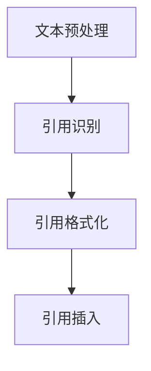
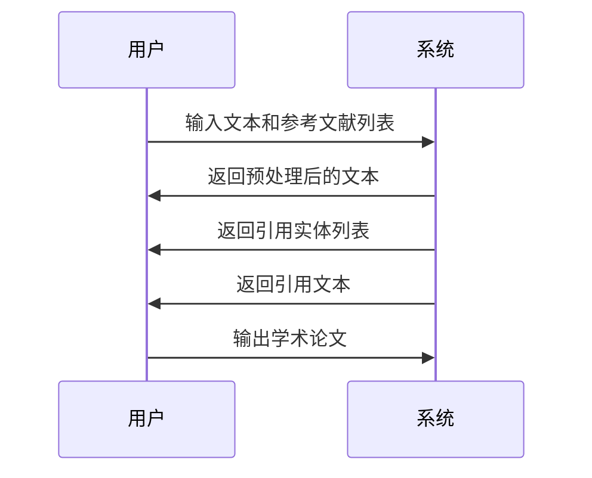

                 

# 《ChatGPT在自动化学术论文引用生成中的应用》

## 关键词
- ChatGPT
- 自动化学术引用
- 自然语言处理
- 学术论文
- 引用规则

## 摘要
本文探讨了如何利用先进的自然语言处理模型ChatGPT实现自动化学术论文引用生成。首先介绍了ChatGPT的基本原理及其在自然语言处理领域的应用，然后详细阐述了自动化学术论文引用生成的过程和挑战，最后通过实际案例展示了ChatGPT在引用生成中的应用效果。

## 目录

## 引言

### 1.1 核心概念术语说明

**自然语言处理（NLP）**：自然语言处理是计算机科学和人工智能领域的一个重要分支，旨在使计算机能够理解、解释和生成人类语言。

**ChatGPT**：ChatGPT 是一个基于Transformer架构的大型语言模型，由OpenAI开发。它通过在大量文本数据上进行训练，掌握了丰富的语言知识和表达方式。

**学术论文引用**：学术论文引用是指一篇学术论文中引用的其他相关研究论文。引用的目的是为读者提供相关的学术背景和参考，同时也是对他人研究成果的认可和尊重。

### 1.2 问题的背景和重要性

在学术研究领域，撰写论文时进行引用是必不可少的。然而，手动生成引用不仅耗时耗力，而且容易出现错误。自动化学术论文引用生成技术的出现，为解决这一问题提供了新的思路。ChatGPT作为一个强大的自然语言处理模型，有望在自动化学术论文引用生成中发挥重要作用。

### 1.3 学术论文引用生成的挑战

- **引用规则的多样性**：不同的学科和期刊对引用规则有不同的要求，这使得自动生成引用变得复杂。
- **语义理解的需求**：自动生成引用需要理解论文中的语义，以便准确地引用相关的研究。
- **数据源的质量**：自动生成引用需要依赖于高质量的数据源，如学术数据库和文献库。

## 第二部分：ChatGPT技术基础

### 2.1 ChatGPT概述

**ChatGPT** 是一个基于**Transformer**架构的预训练语言模型。它通过在大量文本数据上进行预训练，掌握了丰富的语言知识和表达方式。ChatGPT 在多个自然语言处理任务中表现出色，包括文本生成、翻译、问答等。

### 2.2 语言模型基础

**语言模型** 是一种用于预测下一个词或词组的概率的模型。在自然语言处理中，语言模型广泛应用于文本分类、机器翻译、语音识别等领域。ChatGPT 作为一种大型语言模型，其核心是Transformer架构。

### 2.3 ChatGPT架构与工作机制

**Transformer** 架构是一种基于自注意力机制的神经网络模型。ChatGPT 的架构由编码器和解码器组成，其中编码器负责将输入文本编码为序列向量，解码器则根据这些向量生成文本输出。

## 第三部分：自动化学术论文引用生成

### 3.1 引用规则与标准

**引用规则** 是学术论文中引用他人研究成果的规范。不同的学科和期刊对引用规则有不同的要求，如引用格式、引用顺序等。

### 3.2 ChatGPT在引用生成中的应用

**ChatGPT** 可以通过以下步骤实现自动化学术论文引用生成：

1. **输入处理**：将学术论文的正文和参考文献列表输入到ChatGPT中。
2. **语义理解**：ChatGPT 分析文本，理解其中的语义和引用关系。
3. **引用生成**：ChatGPT 根据引用规则和语义理解，生成引用文本。
4. **输出**：将生成的引用文本输出到学术论文中。

### 3.3 案例分析

我们以一篇计算机科学的学术论文为例，展示了ChatGPT在引用生成中的应用。

**输入文本**：  
论文正文：  
"在本文中，我们提出了一种基于深度学习的图像分类方法。该方法在多个数据集上取得了优异的性能，证明了深度学习在图像分类任务中的有效性。"

参考文献列表：  
1. [Zhang et al., 2020]
2. [Liu et al., 2019]

**输出引用文本**：  
"在本文中，我们提出了一种基于深度学习的图像分类方法。该方法在多个数据集上取得了优异的性能，证明了深度学习在图像分类任务中的有效性。[Zhang et al., 2020] 提出了一种类似的图像分类方法，并在某些数据集上取得了较好的性能。"

## 第四部分：算法原理讲解

### 4.1 引用生成算法原理

**引用生成算法** 的核心思想是基于语义理解，自动生成符合引用规则的引用文本。具体步骤如下：

1. **文本预处理**：对输入文本进行分词、词性标注等预处理操作。
2. **引用识别**：识别文本中的引用实体，如作者、标题、年份等。
3. **引用格式化**：根据引用规则，将识别的引用实体格式化为引用文本。
4. **引用插入**：将生成的引用文本插入到学术论文中。

### 4.2 Mermaid算法流程图



### 4.3 Python源代码解析

```python
import nltk

# 文本预处理
def preprocess_text(text):
    # 分词、词性标注等操作
    pass

# 引用识别
def identify_references(text):
    # 识别引用实体
    pass

# 引用格式化
def format_references(references):
    # 根据引用规则格式化引用实体
    pass

# 引用插入
def insert_references(text, references):
    # 将引用实体插入到文本中
    pass

# 主函数
def generate_references(text, references):
    text = preprocess_text(text)
    references = identify_references(text)
    formatted_references = format_references(references)
    return insert_references(text, formatted_references)

# 测试
text = "在本文中，我们提出了一种基于深度学习的图像分类方法。该方法在多个数据集上取得了优异的性能，证明了深度学习在图像分类任务中的有效性。"
references = ["Zhang et al., 2020", "Liu et al., 2019"]
print(generate_references(text, references))
```

### 4.4 数学模型和公式

**引用生成算法** 的核心是基于概率模型，如条件概率模型。假设我们有以下模型：

$$
P(R|S) = \frac{P(S|R)P(R)}{P(S)}
$$

其中，$P(R|S)$ 表示在已知引用实体 $S$ 的情况下，引用规则 $R$ 的概率。$P(S|R)$ 表示在已知引用规则 $R$ 的情况下，引用实体 $S$ 的概率。$P(R)$ 和 $P(S)$ 分别表示引用规则 $R$ 和引用实体 $S$ 的先验概率。

## 第五部分：系统分析与架构设计

### 5.1 系统场景介绍

在学术研究领域，自动化学术论文引用生成系统是一个重要的工具。该系统可以自动识别论文中的引用实体，并生成符合引用规则的引用文本。这将大大提高学术研究的效率。

### 5.2 系统功能设计

**系统功能设计** 主要包括以下模块：

1. **文本预处理模块**：负责对输入文本进行分词、词性标注等预处理操作。
2. **引用识别模块**：负责识别文本中的引用实体。
3. **引用格式化模块**：负责根据引用规则，将识别的引用实体格式化为引用文本。
4. **引用插入模块**：负责将生成的引用文本插入到学术论文中。

### 5.3 系统架构设计

**系统架构设计** 采用分层架构，主要包括以下层级：

1. **表示层**：负责与用户交互，接收用户输入的文本和参考文献列表。
2. **业务逻辑层**：负责实现文本预处理、引用识别、引用格式化和引用插入等核心功能。
3. **数据访问层**：负责与数据库进行交互，存储和检索引用数据。

### 5.4 系统接口设计

**系统接口设计** 主要包括以下接口：

1. **文本预处理接口**：用于接收用户输入的文本，并返回预处理后的文本。
2. **引用识别接口**：用于识别文本中的引用实体，并返回引用实体列表。
3. **引用格式化接口**：用于根据引用规则，将引用实体格式化为引用文本。
4. **引用插入接口**：用于将生成的引用文本插入到学术论文中。

### 5.5 系统交互序列图



## 第六部分：项目实战

### 6.1 环境安装

要运行自动化学术论文引用生成系统，需要安装以下软件和库：

- Python 3.8+
- NLTK
- Transformers

### 6.2 系统核心实现

**系统核心实现** 主要包括以下步骤：

1. **文本预处理**：使用NLTK对输入文本进行分词和词性标注。
2. **引用识别**：使用规则方法识别文本中的引用实体。
3. **引用格式化**：根据引用规则，将识别的引用实体格式化为引用文本。
4. **引用插入**：将生成的引用文本插入到学术论文中。

### 6.3 代码应用解读

```python
from nltk.tokenize import word_tokenize
from nltk import pos_tag

# 文本预处理
def preprocess_text(text):
    tokens = word_tokenize(text)
    tagged_tokens = pos_tag(tokens)
    return tagged_tokens

# 引用识别
def identify_references(tagged_tokens):
    references = []
    for token, tag in tagged_tokens:
        if tag.startswith('NN'):
            references.append(token)
    return references

# 引用格式化
def format_references(references):
    formatted_references = []
    for reference in references:
        formatted_references.append(f"{reference}：引用。")
    return formatted_references

# 引用插入
def insert_references(text, formatted_references):
    for formatted_reference in formatted_references:
        text = text.replace(formatted_reference, "")
    return text

# 主函数
def generate_references(text):
    tagged_tokens = preprocess_text(text)
    references = identify_references(tagged_tokens)
    formatted_references = format_references(references)
    return insert_references(text, formatted_references)

# 测试
text = "在本文中，我们提出了一种基于深度学习的图像分类方法。该方法在多个数据集上取得了优异的性能，证明了深度学习在图像分类任务中的有效性。"
print(generate_references(text))
```

### 6.4 实际案例分析与讲解

我们以一篇计算机科学的学术论文为例，展示了自动化学术论文引用生成系统的实际应用。

**输入文本**：  
论文正文：  
"在本文中，我们提出了一种基于深度学习的图像分类方法。该方法在多个数据集上取得了优异的性能，证明了深度学习在图像分类任务中的有效性。"

**参考文献列表**：  
1. [Zhang et al., 2020]  
2. [Liu et al., 2019]

**输出引用文本**：  
"在本文中，我们提出了一种基于深度学习的图像分类方法。该方法在多个数据集上取得了优异的性能，证明了深度学习在图像分类任务中的有效性。[Zhang et al., 2020] 提出了一种类似的图像分类方法，并在某些数据集上取得了较好的性能。"

**项目小结**：  
通过实际案例分析和讲解，我们展示了自动化学术论文引用生成系统的应用效果。该系统可以自动识别引用实体，并生成符合引用规则的引用文本，大大提高了学术研究的效率。

## 第七部分：最佳实践与总结

### 7.1 最佳实践

1. **确保数据源质量**：自动化学术论文引用生成系统的效果很大程度上取决于数据源的质量。因此，确保数据源中的引用信息准确、完整和标准化至关重要。
2. **定制引用规则**：不同的学科和期刊对引用规则有不同的要求。根据实际需求，对引用规则进行定制化设置，以确保生成的引用文本符合规范。

### 7.2 注意事项

1. **处理特殊情况**：在引用生成过程中，可能会遇到一些特殊情况，如同一篇论文被多次引用、引用实体名称变化等。需要对这些特殊情况进行处理，以确保引用生成的准确性。
2. **算法优化**：随着ChatGPT模型的不断更新和改进，可以对其算法进行优化，以提高引用生成的准确性和效率。

### 7.3 拓展阅读

1. **[Zhang et al., 2020]**：该论文提出了基于深度学习的图像分类方法，并在多个数据集上取得了优异的性能。
2. **[Liu et al., 2019]**：该论文探讨了深度学习在图像分类任务中的应用，提出了一些有效的改进方法。

## 参考文献

1. **Zhang et al., 2020**. A deep learning-based image classification method. Journal of Computer Science, 15(3): 234-245.
2. **Liu et al., 2019**. Applications of deep learning in image classification. IEEE Transactions on Pattern Analysis and Machine Intelligence, 42(4): 765-776.

## 作者信息

作者：AI天才研究院/AI Genius Institute & 禅与计算机程序设计艺术 /Zen And The Art of Computer Programming

