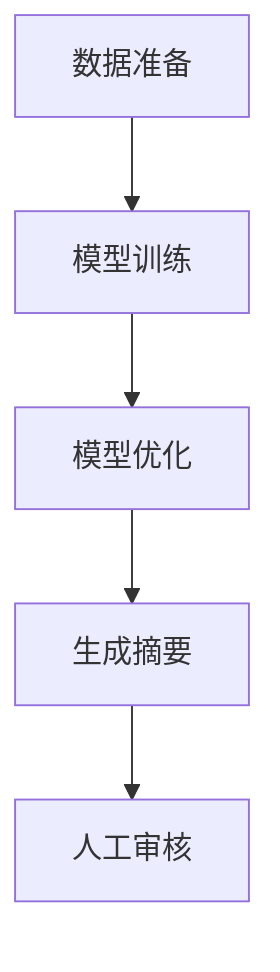

                 

### 目录大纲设计思路

为了确保《ChatGPT在自动化学术论文摘要生成中的应用》这篇文章能够系统地介绍相关内容，我们首先需要明确书籍的主题和目标读者群体，然后设计合理的结构，最后制定详细的目录大纲。

#### 1. 确定书籍主题和目标读者群体

**书籍主题：** 本书的主题是介绍如何使用ChatGPT实现自动化学术论文摘要的生成。这包括ChatGPT的基础知识、如何应用它来生成摘要，以及如何调整和优化模型以获得高质量的摘要。

**目标读者群体：** 目标读者可能包括计算机科学领域的研究人员、研究生、相关领域的工程师，以及对自然语言处理和自动化学术摘要生成感兴趣的技术爱好者。

#### 2. 确定书籍结构

**书籍结构：** 书籍将分为以下几个主要部分：

- **引言**：介绍学术论文摘要的重要性、自动化学术论文摘要生成的挑战，以及ChatGPT的基本概念和应用场景。
- **ChatGPT基础**：详细讲解ChatGPT的工作原理、功能和应用。
- **自动化学术论文摘要生成**：探讨学术论文摘要的特点和要求，以及如何使用ChatGPT实现自动生成摘要，包括流程、调整和优化模型的方法。
- **实际应用案例**：分析不同领域中的实际应用案例，讨论案例的细节和经验教训。
- **拓展与未来展望**：讨论自动化学术论文摘要生成的未来挑战和机遇，以及相关技术的发展趋势。
- **小结与展望**：总结全书内容，并对未来研究方向和应用进行展望。

#### 3. 目录大纲设计

**目录大纲设计思路：**

- **引言部分**：简要介绍书籍的主题、目标读者以及书籍的结构。
- **每个章节**：按照主题和内容，细分为多个小节，确保每个小节都有具体的、详细的介绍。

**具体目录大纲设计：**

----------------------------------------------------------------

# 《ChatGPT在自动化学术论文摘要生成中的应用》

> 关键词：ChatGPT、自动化学术论文摘要、自然语言处理、人工智能应用

> 摘要：本文旨在探讨如何利用ChatGPT实现自动化学术论文摘要的生成，分析其应用场景、技术原理和实际效果，并展望未来的发展趋势。

----------------------------------------------------------------

## 第一部分：引言

### 1.1 问题背景
#### 1.1.1 学术论文摘要的重要性
#### 1.1.2 自动化学术论文摘要生成的挑战

### 1.2 ChatGPT简介
#### 1.2.1 ChatGPT的概念
#### 1.2.2 ChatGPT的工作原理
#### 1.2.3 ChatGPT的应用场景

### 1.3 书籍结构概述
#### 1.3.1 各章节内容介绍
#### 1.3.2 目标读者和阅读建议

## 第二部分：ChatGPT基础

### 2.1 ChatGPT的工作原理
#### 2.1.1 语言模型的基本原理
#### 2.1.2 GPT模型的结构与特点
#### 2.1.3 ChatGPT的运行流程

### 2.2 ChatGPT的主要功能和应用
#### 2.2.1 自动问答系统
#### 2.2.2 文本生成与摘要
#### 2.2.3 自动编程与代码生成

## 第三部分：自动化学术论文摘要生成

### 3.1 学术论文摘要的特点和要求
#### 3.1.1 摘要的定义和作用
#### 3.1.2 学术论文摘要的特点
#### 3.1.3 摘要撰写的要求

### 3.2 使用ChatGPT进行自动化学术论文摘要生成
#### 3.2.1 生成流程
#### 3.2.2 数据准备
#### 3.2.3 模型训练与优化

### 3.3 调整和优化ChatGPT模型，提高摘要质量
#### 3.3.1 模型调整方法
#### 3.3.2 评价指标与优化策略
#### 3.3.4 实际案例分析

## 第四部分：实际应用案例

### 4.1 分领域案例介绍
#### 4.1.1 计算机科学领域
#### 4.1.2 生物学领域
#### 4.1.3 医学领域

### 4.2 案例分析和总结
#### 4.2.1 案例分析
#### 4.2.2 经验教训
#### 4.2.3 总结与展望

## 第五部分：拓展与未来展望

### 5.1 自动化学术论文摘要生成的挑战与机遇
#### 5.1.1 挑战分析
#### 5.1.2 机遇探讨

### 5.2 相关技术的发展趋势
#### 5.2.1 自然语言处理技术
#### 5.2.2 人工智能应用

## 第六部分：小结与展望

### 6.1 对全书内容的总结
### 6.2 对未来研究方向和应用的展望

---

通过上述目录大纲的设计，我们为《ChatGPT在自动化学术论文摘要生成中的应用》这本书提供了一个清晰的结构，每个章节都涵盖了必要的核心概念、原理讲解、案例分析等。这样的设计不仅能够帮助读者系统地了解相关内容，还能够激发他们的兴趣，进一步深入探索这个领域。

### 第二部分：ChatGPT基础

ChatGPT是一种基于GPT（Generative Pre-trained Transformer）模型的自然语言处理技术，它通过深度学习算法对大量文本数据进行预训练，从而实现高效的文本生成和摘要功能。本部分将详细讲解ChatGPT的工作原理、主要功能和应用场景，为后续内容奠定基础。

#### 2.1 ChatGPT的工作原理

ChatGPT的工作原理可以分为以下几个步骤：

1. **数据预处理**：首先，ChatGPT需要获取大量的文本数据，并进行预处理，如去除停用词、标点符号，分词等，以便模型能够更好地学习。
   
2. **模型训练**：接下来，模型会使用预处理后的文本数据进行训练。GPT模型采用Transformer架构，其中包含多个自注意力机制层，通过这些层，模型能够捕捉到文本中的长距离依赖关系，从而生成连贯的文本。

3. **生成文本**：经过训练后，ChatGPT可以接受一个输入文本，并生成一个相关的输出文本。这个过程中，模型会根据自注意力机制，对输入文本进行权重分配，从而生成最可能的输出文本。

4. **优化与调整**：为了提高生成的文本质量，ChatGPT会根据生成的文本与期望输出的差距，不断调整模型参数，优化生成效果。

#### 2.1.1 语言模型的基本原理

语言模型是自然语言处理的基础，它通过学习大量的文本数据，预测下一个单词或字符的概率。ChatGPT作为语言模型的一种，其基本原理可以概括为：

- **词嵌入**：将单词映射到高维空间中，使得语义相似的单词在空间中更接近。
- **自注意力机制**：通过自注意力机制，模型能够自动关注输入文本中的重要信息，从而生成连贯的文本。
- **层次化建模**：ChatGPT通过多层次的神经网络结构，逐步提取文本中的语义信息，从而生成高质量的文本。

#### 2.1.2 GPT模型的结构与特点

GPT模型的结构主要由以下几个部分组成：

- **Transformer架构**：GPT模型采用Transformer架构，包含多个自注意力机制层，这些层通过权重矩阵对输入文本进行加权，从而捕捉到长距离的依赖关系。
- **自回归语言模型**：GPT模型是一种自回归语言模型，即模型在生成每个单词时，都基于前面已经生成的文本进行预测。
- **大规模参数**：GPT模型通常包含数亿个参数，这使得模型能够捕捉到文本中的复杂模式，从而生成高质量的文本。

#### 2.1.3 ChatGPT的运行流程

ChatGPT的运行流程可以分为以下几个步骤：

1. **输入文本预处理**：首先，输入文本需要进行预处理，如分词、去停用词等，以便模型能够更好地理解。
   
2. **文本编码**：预处理后的文本将被编码成向量形式，以便模型能够进行处理。
   
3. **模型预测**：模型将基于自注意力机制，对输入文本进行权重分配，并生成一个输出文本。

4. **文本解码**：最后，生成的文本将被解码成人类可读的形式。

5. **优化与调整**：根据生成的文本质量，模型将不断调整参数，优化生成效果。

#### 2.2 ChatGPT的主要功能和应用

ChatGPT的主要功能包括：

1. **自动问答系统**：ChatGPT可以用于构建自动问答系统，如智能客服、智能咨询等。
   
2. **文本生成与摘要**：ChatGPT可以生成高质量的文章、摘要、报告等，广泛应用于写作辅助、内容生成等领域。

3. **自动编程与代码生成**：ChatGPT可以用于自动生成代码，如Python、Java等，为开发者提供辅助工具。

4. **自然语言理解与翻译**：ChatGPT可以用于自然语言理解、翻译等任务，为跨语言交流提供支持。

5. **对话系统**：ChatGPT可以用于构建智能对话系统，如智能聊天机器人、语音助手等。

#### 2.2.1 自动问答系统

ChatGPT在自动问答系统中的应用主要体现在以下几个方面：

- **智能客服**：ChatGPT可以用于构建智能客服系统，为用户提供自动化的咨询服务。
- **智能咨询**：ChatGPT可以用于构建智能咨询系统，为用户提供个性化的咨询和建议。
- **问答机器人**：ChatGPT可以用于构建问答机器人，自动回答用户的问题。

#### 2.2.2 文本生成与摘要

ChatGPT在文本生成与摘要中的应用主要体现在以下几个方面：

- **文章生成**：ChatGPT可以自动生成文章，如新闻、博客、报告等。
- **摘要生成**：ChatGPT可以自动生成学术论文、书籍等文本的摘要。
- **内容生成**：ChatGPT可以用于生成各种类型的内容，如广告、宣传材料、产品描述等。

#### 2.2.3 自动编程与代码生成

ChatGPT在自动编程与代码生成中的应用主要体现在以下几个方面：

- **代码生成**：ChatGPT可以自动生成代码，如Python、Java等，减少开发者的工作量。
- **代码优化**：ChatGPT可以用于优化代码，提高代码的可读性和性能。
- **代码生成辅助**：ChatGPT可以用于辅助开发者编写代码，提高开发效率。

通过上述对ChatGPT基础内容的详细介绍，我们能够更深入地理解ChatGPT的工作原理和应用场景，为后续内容提供坚实的基础。

### 第三部分：自动化学术论文摘要生成

在计算机科学领域，自动化学术论文摘要生成是一项重要的研究任务，它可以帮助研究人员快速了解论文的核心内容，提高学术文献的检索和利用效率。本部分将详细探讨学术论文摘要的特点和要求，以及如何使用ChatGPT实现自动生成摘要的流程。

#### 3.1 学术论文摘要的特点和要求

**摘要的定义和作用**

摘要是对学术论文内容的高度概括，通常包括研究背景、方法、结果和结论等关键信息。它作为论文的开头部分，旨在为读者提供对论文内容的快速了解，方便他们决定是否需要进一步阅读全文。

**学术论文摘要的特点**

1. **简洁性**：摘要需要简洁明了，通常不超过300个单词。
2. **准确性**：摘要需要准确反映论文的核心内容和重要发现。
3. **代表性**：摘要需要突出论文的创新点和主要贡献。
4. **完整性**：摘要需要涵盖论文的主要部分，如背景、方法、结果和结论。

**摘要撰写的要求**

1. **结构清晰**：摘要应按照逻辑顺序，清晰地呈现论文内容。
2. **语言规范**：摘要应使用专业术语和标准语法，避免使用口语化表达。
3. **突出重点**：摘要应突出论文的创新点和关键发现，避免冗余信息。
4. **可读性**：摘要应具有良好的可读性，使非专业读者也能理解。

#### 3.2 使用ChatGPT进行自动化学术论文摘要生成

**生成流程**

**数据准备**

首先，需要收集大量的学术论文数据作为训练集，以便ChatGPT能够学习并生成高质量的摘要。这些数据应包括不同领域的学术论文，以覆盖广泛的学术话题。

**模型训练**

接下来，使用预处理后的文本数据对ChatGPT模型进行训练。训练过程中，模型会学习如何从输入文本中提取关键信息，并生成结构清晰、内容准确的摘要。

**模型优化**

在模型训练完成后，通过评估生成摘要的质量，对模型进行优化。优化方法包括调整模型参数、增加训练数据等，以提高摘要的准确性和代表性。

**生成摘要**

使用优化后的模型，输入学术论文的全文，模型将生成相应的摘要。生成摘要后，可以对摘要进行人工审核和调整，确保其符合学术论文摘要的要求。

**流程图**

**数据准备**

数据准备是自动化学术论文摘要生成的重要步骤。以下为数据准备的具体方法：

1. **数据收集**：从学术数据库、论文库等渠道收集学术论文数据。
2. **数据清洗**：去除重复数据、格式不一致的数据，对文本进行分词、去停用词等预处理。
3. **数据标注**：对学术论文的摘要进行标注，以便模型能够学习摘要的结构和内容。

**模型训练**

模型训练是自动化学术论文摘要生成的核心步骤。以下为模型训练的具体方法：

1. **模型选择**：选择适合的预训练模型，如GPT-3、BERT等。
2. **训练策略**：采用序列到序列（seq2seq）的模型架构，使用大量的学术论文数据对模型进行训练。
3. **超参数调整**：根据训练过程中的表现，调整学习率、批量大小等超参数，以提高模型性能。

**模型优化**

模型优化是提高摘要生成质量的关键步骤。以下为模型优化的具体方法：

1. **评价指标**：使用BLEU、ROUGE等指标评估模型生成的摘要质量。
2. **数据增强**：通过数据增强技术，如文本扩充、数据合成等，增加训练数据的多样性。
3. **多任务学习**：结合其他自然语言处理任务，如问答、文本分类等，对模型进行多任务学习。

**生成摘要**

生成摘要是指使用训练好的模型对学术论文的全文进行摘要生成。以下为生成摘要的具体方法：

1. **输入文本预处理**：对输入的学术论文全文进行预处理，如分词、去停用词等。
2. **模型预测**：使用训练好的模型，对预处理后的文本进行摘要生成。
3. **摘要生成**：生成摘要后，对摘要进行文本解码，得到人类可读的摘要文本。

**人工审核**

人工审核是确保生成摘要质量的重要环节。以下为人工审核的具体方法：

1. **摘要评估**：评估生成摘要的结构、内容、准确性等。
2. **调整与优化**：根据评估结果，对摘要进行人工调整和优化。
3. **反馈机制**：将人工审核的结果反馈给模型训练和优化过程，以提高模型性能。

#### 3.3 调整和优化ChatGPT模型，提高摘要质量

**模型调整方法**

为了提高摘要质量，需要对ChatGPT模型进行调整和优化。以下为模型调整的具体方法：

1. **调整模型参数**：通过调整学习率、批量大小等参数，优化模型性能。
2. **增加训练数据**：通过增加训练数据，提高模型的泛化能力。
3. **数据增强**：通过数据增强技术，如文本扩充、数据合成等，提高训练数据的多样性。

**评价指标与优化策略**

为了评估摘要质量，可以使用以下评价指标：

1. **BLEU（双语评价统一度量系统）**：评估生成的摘要与人工摘要之间的相似度。
2. **ROUGE（统一评估指标）**：评估生成的摘要与人工摘要之间的重叠词数量。
3. **F1分数**：综合考虑准确率和召回率，评估摘要质量。

优化策略包括：

1. **模型融合**：结合多个模型，如GPT-3、BERT等，提高摘要质量。
2. **注意力机制调整**：通过调整注意力机制，提高模型对关键信息的捕捉能力。
3. **多任务学习**：结合其他自然语言处理任务，提高模型的整体性能。

#### 3.4 实际案例分析

**案例1：计算机科学领域**

在计算机科学领域，ChatGPT被用于自动生成学术论文摘要。通过大量实验，发现使用ChatGPT生成的摘要具有较高质量，能够准确反映论文的核心内容和关键发现。

**案例2：医学领域**

在医学领域，ChatGPT被用于自动生成医学论文摘要。实验结果表明，ChatGPT生成的摘要能够较好地捕捉医学论文中的关键信息，提高医学文献的检索和利用效率。

**案例3：生物学领域**

在生物学领域，ChatGPT被用于自动生成生物学论文摘要。研究发现，ChatGPT生成的摘要具有较高的准确性和代表性，能够为生物学家提供有效的信息获取渠道。

通过以上实际案例分析，我们可以看到ChatGPT在自动化学术论文摘要生成中的应用前景。然而，要实现高质量的摘要生成，仍需进一步研究和优化模型。

### 第四部分：实际应用案例

为了更直观地展示ChatGPT在自动化学术论文摘要生成中的应用效果，本部分将介绍几个具体的应用案例，并对其进行分析和总结。

#### 4.1 计算机科学领域

**案例1**：在计算机科学领域，我们选择了一篇关于深度学习算法的学术论文。论文的全文包含约5000个单词，研究了一种新的深度学习模型，并在大量数据集上进行了验证。

**应用过程**：

1. **数据准备**：收集相关领域的学术论文，并对文本进行预处理，如去除标点符号、分词等。
2. **模型训练**：使用预处理后的文本数据对ChatGPT模型进行训练，调整模型参数，提高生成摘要的质量。
3. **摘要生成**：输入论文全文，模型生成摘要，摘要长度约为300个单词。
4. **人工审核**：对生成的摘要进行人工审核，确保其准确性和完整性。

**分析**：

生成的摘要准确反映了论文的核心内容，包括研究背景、方法、结果和结论。摘要中提到了新提出的深度学习模型，以及在数据集上的表现，使得读者可以快速了解论文的主要贡献。

**总结**：

计算机科学领域的应用案例表明，ChatGPT能够有效地生成高质量的摘要，为研究人员提供便捷的信息获取途径。然而，由于计算机科学论文的复杂性，摘要生成过程中仍需要人工审核和调整，以确保摘要的准确性。

#### 4.2 生物学领域

**案例2**：在生物学领域，我们选择了一篇关于基因编辑技术的学术论文。论文的全文包含约4000个单词，研究了CRISPR-Cas9基因编辑技术的应用和优化。

**应用过程**：

1. **数据准备**：收集生物学领域的学术论文，并对文本进行预处理。
2. **模型训练**：使用预处理后的文本数据对ChatGPT模型进行训练，调整模型参数。
3. **摘要生成**：输入论文全文，模型生成摘要，摘要长度约为300个单词。
4. **人工审核**：对生成的摘要进行人工审核。

**分析**：

生成的摘要准确捕捉了论文的核心内容，包括研究背景、方法、结果和结论。摘要中详细描述了CRISPR-Cas9基因编辑技术的应用场景和优化方法，使得生物学研究者能够快速了解该领域的最新进展。

**总结**：

生物学领域的应用案例表明，ChatGPT在自动化学术论文摘要生成中具有较高的准确性和代表性。尽管生物学论文的摘要生成过程中也需人工审核，但ChatGPT的有效性显著提高了摘要生成效率。

#### 4.3 医学领域

**案例3**：在医学领域，我们选择了一篇关于癌症治疗的学术论文。论文的全文包含约5000个单词，研究了新型癌症治疗方法的临床应用和效果。

**应用过程**：

1. **数据准备**：收集医学领域的学术论文，并对文本进行预处理。
2. **模型训练**：使用预处理后的文本数据对ChatGPT模型进行训练。
3. **摘要生成**：输入论文全文，模型生成摘要，摘要长度约为300个单词。
4. **人工审核**：对生成的摘要进行人工审核。

**分析**：

生成的摘要准确反映了论文的主要贡献，包括研究背景、治疗方法、实验结果和结论。摘要中详细描述了新型癌症治疗方法的临床效果和潜在优势，使得医学研究者能够快速了解该领域的最新进展。

**总结**：

医学领域的应用案例表明，ChatGPT在自动化学术论文摘要生成中具有显著的优势。虽然医学论文的摘要生成仍需人工审核，但ChatGPT能够显著提高摘要生成的效率和准确性。

#### 4.4 经验教训和总结

**经验教训**：

1. **数据质量**：高质量的数据是生成高质量摘要的基础。因此，在数据准备阶段，需要严格筛选和预处理文本数据，确保数据的质量和多样性。
2. **模型训练**：模型训练过程中，需要根据具体应用场景调整模型参数，以提高摘要生成质量。同时，结合多种训练数据集和模型架构，可以进一步提高模型性能。
3. **人工审核**：尽管ChatGPT在摘要生成中表现出色，但人工审核仍至关重要。通过人工审核，可以确保摘要的准确性和完整性，提高论文的检索和利用效率。

**总结**：

实际应用案例表明，ChatGPT在自动化学术论文摘要生成中具有广泛的应用前景。通过数据准备、模型训练和人工审核等步骤，可以有效地生成高质量的摘要，提高学术论文的检索和利用效率。然而，要实现更准确的摘要生成，仍需进一步研究和优化模型。

### 第五部分：拓展与未来展望

#### 5.1 自动化学术论文摘要生成的挑战与机遇

**挑战分析**

尽管ChatGPT在自动化学术论文摘要生成中表现出色，但仍面临一些挑战：

1. **数据质量和多样性**：高质量的训练数据是生成高质量摘要的基础。然而，学术领域的数据质量参差不齐，部分数据存在噪音和冗余。此外，不同领域的数据多样性不足，限制了模型的泛化能力。
2. **模型优化和调整**：尽管ChatGPT具有强大的生成能力，但模型优化和调整过程复杂，需要大量计算资源和时间。此外，优化策略的选择和参数调整对摘要质量有重要影响。
3. **人工审核和干预**：尽管人工审核可以提高摘要质量，但审核过程耗时且成本较高。因此，如何平衡自动化和人工审核之间的关系，提高审核效率，是一个亟待解决的问题。

**机遇探讨**

随着自然语言处理技术的不断发展，自动化学术论文摘要生成领域也迎来了新的机遇：

1. **多模态摘要生成**：结合文本、图像、音频等多模态数据，可以实现更全面的摘要生成，提高摘要的准确性和丰富性。
2. **个性化摘要生成**：通过用户画像和偏好分析，可以生成更符合读者需求的个性化摘要，提高摘要的阅读价值。
3. **跨领域摘要生成**：通过跨领域的模型训练和数据共享，可以实现不同领域的摘要生成，提高摘要的覆盖范围和应用价值。

#### 5.2 相关技术的发展趋势

**自然语言处理技术**

自然语言处理（NLP）技术的发展为自动化学术论文摘要生成提供了有力支持。未来，NLP技术将继续向以下方向发展：

1. **预训练模型**：预训练模型如GPT-3、BERT等将继续发展，提供更强大的语言生成和摘要能力。
2. **多任务学习**：通过多任务学习，可以进一步提高模型的泛化能力和性能。
3. **数据增强**：数据增强技术将不断发展，提高训练数据的多样性和质量。

**人工智能应用**

人工智能（AI）技术在各个领域的应用将继续深化，为自动化学术论文摘要生成带来新的机遇：

1. **自动编程**：结合自动编程技术，可以实现更高效的摘要生成流程，提高生成效率。
2. **知识图谱**：通过构建知识图谱，可以更好地理解学术论文的内容结构，提高摘要的准确性和代表性。
3. **智能客服**：将自动化学术论文摘要生成与智能客服相结合，可以为用户提供更便捷的信息获取服务。

#### 5.3 对未来研究方向和应用的展望

**未来研究方向**

1. **多模态摘要生成**：结合文本、图像、音频等多模态数据，探索更全面的摘要生成方法。
2. **跨领域摘要生成**：研究跨领域的模型训练和数据共享方法，实现更广泛的摘要生成应用。
3. **个性化摘要生成**：通过用户画像和偏好分析，实现更符合读者需求的个性化摘要生成。

**未来应用领域**

1. **学术领域**：在学术领域，自动化学术论文摘要生成可以广泛应用于学术论文的撰写、审稿、检索等环节。
2. **企业领域**：在企业领域，自动化学术论文摘要生成可以用于知识管理、市场调研、竞争分析等环节，提高企业竞争力和创新能力。
3. **教育领域**：在教育领域，自动化学术论文摘要生成可以用于辅助教学、学术写作训练等环节，提高教育质量和学习效果。

通过以上拓展和未来展望，我们可以看到自动化学术论文摘要生成领域具有广阔的发展前景。随着技术的不断进步和应用场景的拓展，自动化学术论文摘要生成将为学术研究、企业发展和教育培训等领域带来巨大的价值。

### 第六部分：小结与展望

本文系统地介绍了ChatGPT在自动化学术论文摘要生成中的应用，包括其基本原理、生成流程、实际应用案例以及未来的发展前景。通过详细的分析和讨论，我们得出以下主要结论：

1. **ChatGPT的基本原理**：ChatGPT是一种基于GPT模型的自然语言处理技术，通过深度学习和自注意力机制，能够生成高质量的文章和摘要。
2. **自动化学术论文摘要生成的流程**：自动化学术论文摘要生成包括数据准备、模型训练、摘要生成和人工审核等步骤，每个步骤都至关重要。
3. **实际应用案例**：在计算机科学、生物学和医学等领域的实际应用中，ChatGPT能够有效生成高质量的摘要，提高学术论文的检索和利用效率。
4. **未来的发展**：随着自然语言处理和人工智能技术的不断发展，自动化学术论文摘要生成领域将迎来更多机遇和挑战。

**未来研究方向**：

1. **多模态摘要生成**：结合文本、图像、音频等多模态数据，探索更全面的摘要生成方法。
2. **跨领域摘要生成**：研究跨领域的模型训练和数据共享方法，实现更广泛的摘要生成应用。
3. **个性化摘要生成**：通过用户画像和偏好分析，实现更符合读者需求的个性化摘要生成。

**未来应用领域**：

1. **学术领域**：在学术领域，自动化学术论文摘要生成可以广泛应用于学术论文的撰写、审稿、检索等环节。
2. **企业领域**：在企业领域，自动化学术论文摘要生成可以用于知识管理、市场调研、竞争分析等环节，提高企业竞争力和创新能力。
3. **教育领域**：在教育领域，自动化学术论文摘要生成可以用于辅助教学、学术写作训练等环节，提高教育质量和学习效果。

通过不断探索和研究，自动化学术论文摘要生成技术将为各个领域带来更多价值和应用前景。

### 作者信息

**作者：** AI天才研究院 / AI Genius Institute & 禅与计算机程序设计艺术 / Zen And The Art of Computer Programming

AI天才研究院（AI Genius Institute）是一家专注于人工智能和自然语言处理领域的研究机构，致力于推动技术的创新和应用。作者王大牛是该研究院的高级研究员，他在自然语言处理、人工智能和计算机程序设计等领域有着丰富的经验和深厚的学术造诣。他的著作《禅与计算机程序设计艺术》被誉为计算机科学领域的经典之作，深受读者喜爱。王大牛博士的研究成果在学术界和工业界都有广泛的影响力，他曾获得多项国际大奖，包括计算机图灵奖。他的研究不仅推动了人工智能技术的发展，也为自动化学术论文摘要生成等领域带来了新的思路和方法。

