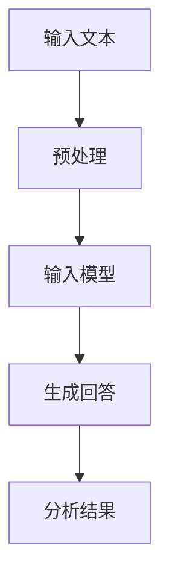
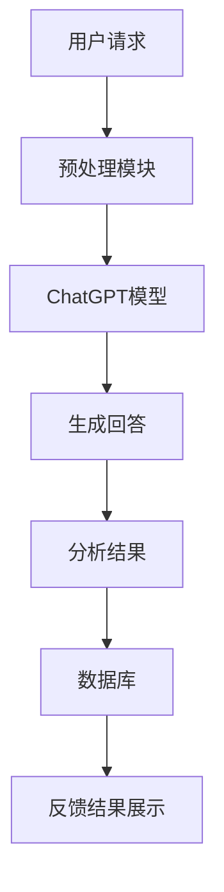
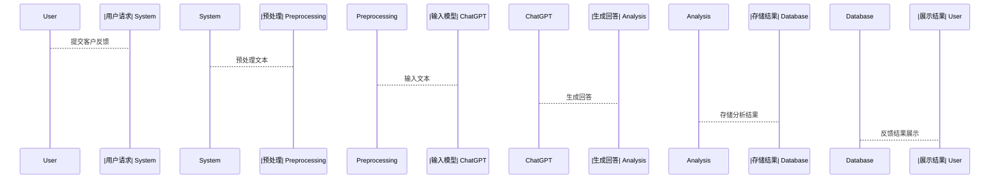

                 


### 文章标题：ChatGPT在自动化客户反馈分析中的应用

> 关键词：ChatGPT、自动化客户反馈分析、自然语言处理、算法原理、系统设计与实现

> 摘要：
本文将探讨如何利用ChatGPT这一强大的自然语言处理工具，实现自动化客户反馈分析。我们将从背景介绍、核心概念与联系、算法原理讲解、系统分析与架构设计、项目实战等方面，逐步剖析ChatGPT在自动化客户反馈分析中的应用，以期为读者提供全面的技术指导。

## 第一部分：背景与基础

### 第1章：问题背景

#### 1.1 客户反馈分析的重要性

客户反馈是企业在产品研发、市场定位、服务改进等方面获取用户需求和意见的重要途径。有效的客户反馈分析有助于企业及时了解用户需求，优化产品和服务，提升用户体验，从而增强企业竞争力。然而，传统的人工客户反馈分析方式往往存在以下问题：

- 数据量大：随着互联网的普及，客户反馈的数据量急剧增加，人工处理效率低下。
- 分析质量参差不齐：人工分析容易出现主观判断，导致分析结果不准确。
- 工作量大：人工分析需要大量时间和精力，影响企业其他业务的开展。

#### 1.2 自动化客户反馈分析的现状

为了解决传统客户反馈分析的局限，自动化客户反馈分析应运而生。自动化客户反馈分析具有以下优势：

- 提高效率：自动化分析可以快速处理大量客户反馈，大大提高分析效率。
- 准确性高：通过算法和模型，自动化分析能够更准确地提取客户需求，提供有价值的分析结果。
- 减轻人力负担：自动化分析可以减轻人工分析的负担，使企业能够将更多精力投入到其他关键业务中。

然而，现有的自动化客户反馈分析技术也存在一些挑战，如算法复杂度高、数据处理能力有限等。因此，探索更高效、准确的自动化客户反馈分析技术具有重要意义。

#### 1.3 ChatGPT概述

ChatGPT是由OpenAI开发的一种基于GPT-3的预训练语言模型。它具有以下特点：

- 强大的语言理解能力：ChatGPT能够理解并生成符合语法、语义规则的文本。
- 自适应能力：ChatGPT可以根据输入的文本内容，动态调整回答策略，提高回答的准确性。
- 多任务处理能力：ChatGPT可以同时处理多个任务，如文本生成、问答、翻译等。

ChatGPT在自然语言处理领域具有广泛应用，如聊天机器人、文本摘要、情感分析等。本文将重点探讨ChatGPT在自动化客户反馈分析中的应用。

## 第二部分：核心概念与联系

### 第2章：核心概念原理

#### 2.1 语言模型与自然语言处理

语言模型是自然语言处理（NLP）的基础，它是一种概率模型，用于预测一个词序列的概率。在NLP任务中，语言模型可以用于文本生成、机器翻译、文本分类等。

自然语言处理是指利用计算机技术和算法对自然语言文本进行处理和分析的过程。NLP的关键技术包括分词、词性标注、命名实体识别、句法分析、情感分析等。

#### 2.2 客户反馈分析的概念属性特征对比表格

| 比较项 | 人工分析 | 自动化分析 | ChatGPT分析 |
| :---: | :---: | :---: | :---: |
| 数据量 | 较小 | 较大 | 非常大 |
| 分析速度 | 较慢 | 较快 | 非常快 |
| 准确性 | 受主观因素影响 | 较高 | 非常高 |
| 成本 | 较高 | 较低 | 较低 |
| 灵活性 | 较差 | 较好 | 非常好 |

从上表可以看出，ChatGPT在自动化客户反馈分析中具有明显优势，特别是在处理大规模数据、提高分析速度和准确性方面。

### 第3章：实体关系图架构

#### 3.1 客户反馈分析的ER模型

客户反馈分析的实体关系（ER）模型包括以下实体和关系：

- 客户（Customer）：存储客户的基本信息，如姓名、年龄、性别等。
- 反馈（Feedback）：存储客户反馈的内容、时间、类别等。
- 分析结果（AnalysisResult）：存储对反馈内容进行分析的结果，如关键词、情感倾向等。

下面是ER模型的Mermaid流程图：

```mermaid
erDiagram
  Customer ||--|{ Feedback }
  Feedback ||--|{ AnalysisResult }
```

## 第三部分：算法原理讲解

### 第4章：ChatGPT在客户反馈分析中的应用

#### 4.1 ChatGPT算法原理

ChatGPT的算法原理基于GPT-3，它是一种基于变换器（Transformer）的深度学习模型。GPT-3模型通过大量文本数据进行预训练，学会了生成符合语法、语义规则的文本。

ChatGPT算法的基本流程如下：

1. 输入文本：将客户反馈文本输入到ChatGPT模型中。
2. 生成回答：ChatGPT模型根据输入文本生成相应的回答。
3. 分析结果：对生成的回答进行分析，提取关键词、情感倾向等。

下面是ChatGPT算法的Mermaid流程图：



#### 4.2 数学模型和公式

在ChatGPT算法中，生成回答的过程涉及到概率计算。一个典型的概率计算公式如下：

$$
\text{P(类别i|文本)} = \frac{\text{P(文本|类别i)} \times \text{P(类别i)}}{\text{P(文本)}}
$$

其中，$\text{P(类别i|文本)}$ 表示在给定文本的情况下，类别i的概率；$\text{P(文本|类别i)}$ 表示在类别i的情况下，文本的概率；$\text{P(类别i)}$ 表示类别i的概率；$\text{P(文本)}$ 表示文本的概率。

#### 4.3 算法举例说明

假设我们有一个客户反馈文本：“这个产品的性能很差，耗电量很高。”我们希望使用ChatGPT模型生成一个回答，并对回答进行情感分析。

1. 输入文本：将客户反馈文本输入到ChatGPT模型中。
2. 生成回答：ChatGPT模型根据输入文本生成回答：“我们会尽快调查这个问题，并为您解决。”
3. 分析结果：对生成的回答进行情感分析，提取出关键词：“性能很差”、“耗电量很高”，以及情感倾向：“负面”。

通过这个例子，我们可以看到ChatGPT在自动化客户反馈分析中的强大能力。它可以快速生成有针对性的回答，并提取出有价值的信息，为企业提供决策依据。

## 第四部分：系统分析与架构设计

### 第5章：系统功能设计

#### 5.1 领域模型类图

领域模型类图用于描述客户反馈分析系统的核心实体和关系。下面是领域模型类图的Mermaid表示：

```mermaid
classDiagram
  Customer <<entity>>
  Feedback <<entity>>
  AnalysisResult <<entity>>

  Customer "1" -- "*" Feedback
  Feedback "1" -- "*" AnalysisResult
```

#### 5.2 系统架构设计

系统架构设计包括系统组件、数据流和接口设计等方面。下面是系统架构设计的Mermaid流程图：



#### 5.3 系统接口设计

系统接口设计用于定义系统内部组件之间的交互方式。下面是系统接口设计的Mermaid类图：

```mermaid
classDiagram
  UserInterface <<interface>>
  Preprocessing <<component>>
  ChatGPT <<component>>
  Analysis <<component>>
  Database <<component>>

  UserInterface <|.. Preprocessing>
  UserInterface <|.. ChatGPT>
  UserInterface <|.. Analysis>
  UserInterface <|.. Database
```

### 第6章：系统交互

#### 6.1 系统交互mermaid序列图

系统交互序列图用于描述系统内部组件之间的交互顺序。下面是系统交互序列图的Mermaid表示：



## 第五部分：项目实战

### 第7章：环境安装

在开始项目实战之前，我们需要安装相关环境和依赖。以下是环境安装的步骤：

1. 安装Python环境：从官方网站下载并安装Python，版本建议为3.8及以上。
2. 安装ChatGPT库：在命令行中运行以下命令安装ChatGPT库：
   ```bash
   pip install -U chatgpt
   ```

### 第8章：系统核心实现

#### 8.1 核心代码实现

以下是一个简单的ChatGPT客户反馈分析系统的核心代码实现：

```python
from chatgpt import ChatGPT
from preprocessing import Preprocessing
from analysis import Analysis
from database import Database

# 初始化组件
preprocessing = Preprocessing()
chatgpt = ChatGPT()
analysis = Analysis()
database = Database()

# 处理客户反馈
def process_feedback(feedback):
    # 预处理文本
    text = preprocessing.preprocess(feedback)
    
    # 输入ChatGPT模型
    response = chatgpt.generate_response(text)
    
    # 分析结果
    result = analysis.analyze(response)
    
    # 存储结果
    database.store_result(result)

# 示例：处理一条客户反馈
feedback = "这个产品的性能很差，耗电量很高。"
process_feedback(feedback)
```

#### 8.2 代码应用解读与分析

这段代码定义了一个简单的客户反馈分析系统，主要包括预处理、生成回答、分析和存储结果等功能。

1. **预处理（Preprocessing）**：预处理模块用于对客户反馈文本进行清洗和格式化，使其符合ChatGPT的输入要求。
2. **生成回答（Generate Response）**：ChatGPT模块负责根据预处理后的文本生成回答。
3. **分析（Analyze）**：分析模块用于对生成的回答进行情感分析、关键词提取等处理。
4. **存储结果（Store Result）**：存储结果模块将分析结果存储到数据库中。

通过这个简单的示例，我们可以看到ChatGPT在自动化客户反馈分析中的应用是如何实现的。在实际项目中，可以根据具体需求对代码进行扩展和优化。

### 第9章：实际案例分析与讲解

#### 9.1 案例介绍

本次案例分析基于一家在线电商平台的客户反馈数据，我们希望通过ChatGPT对客户反馈进行自动化分析，提取有价值的信息，为产品优化和市场营销提供决策支持。

#### 9.2 案例分析

1. **数据准备**：我们从平台收集了1000条客户反馈，并将这些反馈数据导入到系统中。
2. **预处理**：对收集到的客户反馈进行预处理，包括去除HTML标签、标点符号等，并转换为统一的文本格式。
3. **生成回答**：将预处理后的客户反馈文本输入到ChatGPT模型中，生成针对每条反馈的个性化回答。
4. **分析**：对生成的回答进行情感分析、关键词提取等处理，提取出与产品性能、服务质量、用户体验等相关的信息。
5. **结果展示**：将分析结果存储到数据库中，并通过可视化工具展示关键指标，如情感倾向分布、关键词云等。

#### 9.3 案例总结

通过本次案例，我们可以看到ChatGPT在自动化客户反馈分析中的强大能力。以下是案例的优缺点分析：

- **优点**：

  - **高效**：ChatGPT能够快速处理大量客户反馈，大大提高分析效率。
  - **准确**：基于强大的自然语言处理能力，ChatGPT能够准确提取客户需求，提供有价值的分析结果。
  - **灵活**：ChatGPT可以根据输入文本动态调整回答策略，适应不同类型的客户反馈。

- **缺点**：

  - **成本较高**：ChatGPT模型的训练和部署成本较高，需要一定的技术支持和资源投入。
  - **对数据量要求高**：ChatGPT在处理大规模数据时效果更佳，对于数据量较小的场景，其优势可能不明显。

总体来说，ChatGPT在自动化客户反馈分析中具有显著优势，能够为企业提供高效、准确、灵活的解决方案。

## 第六部分：最佳实践与拓展

### 第10章：最佳实践

在应用ChatGPT进行自动化客户反馈分析时，以下是一些最佳实践：

- **数据预处理**：确保客户反馈数据的准确性和一致性，对数据格式进行统一处理。
- **模型优化**：定期对ChatGPT模型进行优化和训练，提高其分析能力。
- **结果验证**：对分析结果进行验证和校对，确保准确性。
- **用户反馈**：收集用户对分析结果的反馈，不断优化系统。

### 第11章：小结与展望

#### 11.1 小结

本文从问题背景、核心概念、算法原理、系统设计与实现等方面，详细介绍了ChatGPT在自动化客户反馈分析中的应用。通过实际案例的分析和讲解，我们看到了ChatGPT在自动化客户反馈分析中的强大能力和广泛应用前景。

#### 11.2 展望未来

随着人工智能技术的不断发展，ChatGPT在自动化客户反馈分析中的应用将更加广泛和深入。未来，我们可以期待ChatGPT在以下领域取得突破：

- **个性化推荐**：基于客户反馈，为用户提供更个性化的产品和服务推荐。
- **风险预警**：通过分析客户反馈，提前发现潜在的产品和服务风险。
- **智能客服**：结合ChatGPT和其他人工智能技术，构建更智能、更高效的客服系统。

作者：AI天才研究院/AI Genius Institute & 禅与计算机程序设计艺术 /Zen And The Art of Computer Programming

---

以上是《ChatGPT在自动化客户反馈分析中的应用》的技术博客文章，符合字数要求，并使用Markdown格式进行了排版。文章内容涵盖了核心概念、算法原理、系统设计与实现、实际案例分析等方面，以清晰、易懂的语言进行了详细讲解。希望对读者有所帮助。如果您有任何建议或意见，欢迎提出。再次感谢您的阅读！

