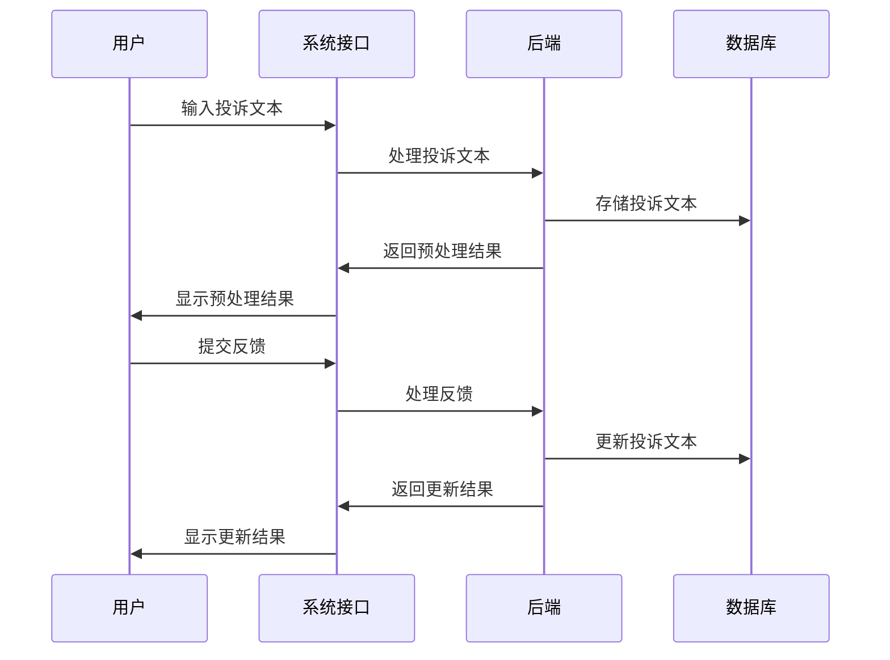

                 

# ChatGPT在自动化客户投诉分类与解决方案生成中的应用

## 关键词
- ChatGPT
- 客户投诉
- 自动化分类
- 解决方案生成
- 算法原理
- 系统架构
- 实战案例

## 摘要
本文深入探讨了ChatGPT在自动化客户投诉分类与解决方案生成中的应用。首先，我们介绍了ChatGPT的基础知识及其在自然语言处理领域的优势。接着，我们分析了客户投诉处理的现状，阐述了为何需要自动化解决方案。随后，文章详细讲解了ChatGPT在投诉分类和解决方案生成中的具体应用，包括算法原理、系统架构设计和实际项目实施。通过一步步的思考和推理，本文旨在为读者提供清晰、简洁、结构紧凑的专业技术解读。

## 目录

### 第一部分：问题背景与核心概念

#### 第1章 问题背景

##### 1.1 客户投诉处理的现状

##### 1.2 ChatGPT技术介绍

##### 1.3 自动化在客户投诉处理中的应用

#### 第2章 核心概念与联系

##### 2.1 ChatGPT的工作原理

##### 2.2 客户投诉分类方法

##### 2.3 解决方案生成的技术基础

##### 2.4 ChatGPT与投诉处理的联系

#### 第3章 算法原理讲解

##### 3.1 ChatGPT模型解析

##### 3.2 客户投诉分类算法

##### 3.3 解决方案生成算法

##### 3.4 算法联系与整合

### 第二部分：系统分析与架构设计

#### 第4章 系统需求分析

##### 4.1 项目介绍

##### 4.2 系统功能设计

##### 4.3 系统性能需求

#### 第5章 系统架构设计

##### 5.1 系统总体架构

##### 5.2 数据存储与处理架构

##### 5.3 系统接口设计

#### 第6章 系统交互设计

##### 6.1 用户界面设计

##### 6.2 系统流程设计

##### 6.3 系统交互序列图

### 第三部分：项目实战

#### 第7章 环境安装与配置

##### 7.1 硬件环境要求

##### 7.2 软件环境安装

##### 7.3 系统配置与优化

#### 第8章 系统核心实现

##### 8.1 数据预处理

##### 8.2 客户投诉分类

##### 8.3 解决方案生成

#### 第9章 代码应用解读与分析

##### 9.1 代码结构解析

##### 9.2 算法实现细节

##### 9.3 实际案例剖析

#### 第10章 项目小结

##### 10.1 项目总结

##### 10.2 经验与教训

##### 10.3 拓展阅读

### 第四部分：最佳实践与扩展

#### 第11章 最佳实践 tips

##### 11.1 提高投诉分类准确率的方法

##### 11.2 优化解决方案生成的技巧

##### 11.3 系统性能调优策略

#### 第12章 小结与展望

##### 12.1 项目成果总结

##### 12.2 未来发展趋势

##### 12.3 进一步研究方向

### 注意事项
- **章节内容细化**：每个章节的核心内容需进一步细化，确保每个章节都有明确的子章节，以便读者能够快速把握章节的核心要点。
- **图表与代码**：确保在合适的章节中包含相关的图表和代码，以便读者更好地理解技术和实际应用。

### 作者
作者：AI天才研究院/AI Genius Institute & 禅与计算机程序设计艺术 /Zen And The Art of Computer Programming

### 完整性要求
- **背景介绍**：核心概念术语说明、问题背景、问题描述、问题解决、边界与外延、概念结构与核心要素组成。
- **核心概念与联系**：必须给出核心概念原理、概念属性特征对比表格和ER实体关系图架构的 Mermaid 流程图。
- **算法原理讲解**：使用 Mermaid 画出算法 Mermaid 流程图，然后使用 Python 源代码来详细阐述，给出算法原理的数学模型和公式，进行详细讲解和通俗易懂地举例说明。
- **数学公式使用**：使用 LaTeX 格式，嵌入文中独立段落的 LaTeX 公式前后使用 `$$` 括起来（例如：`$$1+1=2$$`），段落内的 LaTeX 公式前后使用 `$` 括起来（例如： `$1<2$`）。
- **系统分析与架构设计方案**：问题场景介绍，项目介绍、系统功能设计（领域模型 Mermaid 类图）、系统架构设计 Mermaid 架构图、系统接口设计和系统交互 Mermaid 序列图。
- **项目实战**：环境安装、系统核心实现源代码，代码应用解读与分析，实际案例分析和详细讲解剖析，项目小结。
- **最佳实践 tips、小结、注意事项、拓展阅读等内容**：确保内容的完整性和专业性。

## 第一部分：问题背景与核心概念

### 第1章 问题背景

#### 1.1 客户投诉处理的现状

客户投诉处理是许多企业和组织面临的常见问题。随着互联网的普及和社交媒体的兴起，客户投诉的形式和渠道也变得多样化。传统的客户投诉处理方式通常依赖于人工，效率低下且容易出错。以下是一些现状和挑战：

- **人工处理效率低**：客户投诉通常需要人工阅读、分类和分配，这需要大量的人力和时间，而且容易出现重复劳动和遗漏。
- **错误率高**：人工处理容易产生错误，例如将投诉分配给不合适的部门或误解客户的真实意图。
- **客户满意度低**：由于处理效率低下，客户投诉往往得不到及时解决，导致客户满意度的下降。

#### 1.2 ChatGPT技术介绍

ChatGPT是由OpenAI开发的一种基于GPT-3的预训练语言模型。它具有以下特点：

- **强大的语言理解能力**：ChatGPT能够理解自然语言的复杂结构和语义，这使得它能够处理各种语言的文本。
- **灵活的应用场景**：ChatGPT可以应用于问答系统、文本生成、机器翻译等多种自然语言处理任务。
- **高效率**：ChatGPT的预训练过程已经处理了大量的数据，因此它能够在短时间内生成高质量的文本。

#### 1.3 自动化在客户投诉处理中的应用

自动化技术在客户投诉处理中的应用可以有效提高处理效率和准确性。以下是一些具体的应用：

- **自动分类**：利用ChatGPT的自然语言处理能力，可以自动将客户投诉文本分类到相应的类别中，减少人工干预。
- **自动生成解决方案**：ChatGPT可以根据客户投诉的内容，自动生成解决方案或建议，提高问题解决的效率。
- **自动反馈**：系统可以自动向客户发送反馈，告知投诉的处理进度和结果，提高客户满意度。

### 第2章 核心概念与联系

#### 2.1 ChatGPT的工作原理

ChatGPT是基于GPT-3的预训练语言模型。GPT-3是一种基于Transformer的神经网络模型，它通过大量的文本数据进行预训练，学会了如何生成和理解自然语言。ChatGPT的工作原理主要包括以下几个步骤：

1. **输入处理**：将输入文本转换为模型可以处理的格式。
2. **生成预测**：模型根据预训练的知识，对输入文本进行解析，并生成可能的输出。
3. **输出处理**：将生成的输出转换为可读的文本。

#### 2.2 客户投诉分类方法

客户投诉分类是自动化客户投诉处理的重要环节。常用的分类方法包括：

- **基于规则的方法**：通过定义一系列规则，将投诉文本分类到预定义的类别中。
- **机器学习方法**：利用机器学习算法，从历史数据中学习分类规则，并对新的投诉文本进行分类。

#### 2.3 解决方案生成的技术基础

解决方案生成是自动化客户投诉处理的核心。ChatGPT的预训练模型为其提供了强大的自然语言生成能力，使得它能够根据投诉内容生成解决方案。具体技术基础包括：

- **自然语言生成（NLG）**：NLG技术使得ChatGPT能够生成符合语法和语义规范的文本。
- **知识图谱**：通过构建知识图谱，ChatGPT可以获取相关的解决方案信息，提高生成的准确性。

#### 2.4 ChatGPT与投诉处理的联系

ChatGPT在投诉处理中的应用主要体现在以下几个方面：

- **自动分类**：ChatGPT可以自动分类客户投诉，提高处理效率。
- **自动生成解决方案**：ChatGPT可以根据投诉内容生成解决方案，减少人工干预。
- **智能反馈**：ChatGPT可以自动向客户发送处理进度和结果，提高客户满意度。

### 第3章 算法原理讲解

#### 3.1 ChatGPT模型解析

ChatGPT是一种基于GPT-3的预训练语言模型，其核心思想是利用大量的文本数据进行预训练，使模型具备理解自然语言的能力。GPT-3是一种基于Transformer的神经网络模型，其结构主要包括以下几个部分：

- **嵌入层**：将输入文本转换为向量。
- **Transformer层**：利用自注意力机制对输入向量进行处理。
- **输出层**：将处理后的向量映射到输出文本。

#### 3.2 客户投诉分类算法

客户投诉分类算法的目标是将客户投诉文本分类到预定义的类别中。常用的算法包括：

- **基于规则的方法**：通过定义一系列规则，将投诉文本分类到预定义的类别中。
- **机器学习方法**：利用机器学习算法，从历史数据中学习分类规则，并对新的投诉文本进行分类。

#### 3.3 解决方案生成算法

解决方案生成算法的目标是根据客户投诉内容生成相应的解决方案。ChatGPT的预训练模型为其提供了强大的自然语言生成能力，使得它能够根据投诉内容生成解决方案。具体算法包括：

- **序列生成**：ChatGPT根据输入的投诉文本生成输出文本，即解决方案。
- **知识融合**：将投诉文本与知识图谱进行融合，提高解决方案的准确性。

#### 3.4 算法联系与整合

ChatGPT在客户投诉分类与解决方案生成中的应用是通过以下步骤实现的：

1. **投诉文本预处理**：将客户投诉文本进行预处理，提取关键信息。
2. **投诉分类**：利用客户投诉分类算法，将投诉文本分类到预定义的类别中。
3. **解决方案生成**：利用解决方案生成算法，根据投诉内容生成解决方案。
4. **反馈与优化**：根据反馈结果对模型进行优化，提高分类和生成解决方案的准确性。

### 第二部分：系统分析与架构设计

#### 第4章 系统需求分析

#### 4.1 项目介绍

本项目旨在利用ChatGPT技术实现自动化客户投诉分类与解决方案生成系统。该系统将帮助企业提高客户投诉处理效率，降低人工成本，提高客户满意度。

#### 4.2 系统功能设计

系统功能设计主要包括以下几个部分：

- **投诉文本接收**：系统接收来自客户的投诉文本。
- **投诉分类**：利用ChatGPT对投诉文本进行分类。
- **解决方案生成**：根据投诉分类结果，生成相应的解决方案。
- **反馈与优化**：系统向客户反馈处理结果，并根据反馈进行优化。

#### 4.3 系统性能需求

系统性能需求主要包括以下几个方面：

- **处理速度**：系统需在短时间内处理大量投诉文本。
- **准确性**：系统需具有较高的投诉分类和解决方案生成准确性。
- **稳定性**：系统需具有稳定的运行性能，能够应对高峰期的处理需求。

### 第5章 系统架构设计

#### 5.1 系统总体架构

系统总体架构包括以下几个部分：

- **前端**：用于接收用户输入，展示投诉分类结果和解决方案。
- **后端**：包括投诉文本接收、分类、解决方案生成等核心功能。
- **数据库**：存储投诉文本、分类结果和解决方案。

#### 5.2 数据存储与处理架构

数据存储与处理架构包括以下几个部分：

- **文本接收模块**：接收客户投诉文本，并进行预处理。
- **分类模块**：利用ChatGPT对投诉文本进行分类。
- **解决方案生成模块**：根据投诉分类结果，生成解决方案。
- **反馈模块**：将处理结果反馈给客户，并根据反馈进行优化。

#### 5.3 系统接口设计

系统接口设计包括以下几个部分：

- **API接口**：提供投诉文本接收、分类、解决方案生成等功能。
- **前端接口**：用于与前端系统进行交互，展示投诉分类结果和解决方案。

### 第6章 系统交互设计

#### 6.1 用户界面设计

用户界面设计主要包括以下几个部分：

- **投诉文本输入**：用户输入投诉文本。
- **分类结果展示**：展示投诉分类结果。
- **解决方案展示**：展示生成的解决方案。
- **反馈输入**：用户输入反馈，以便系统进行优化。

#### 6.2 系统流程设计

系统流程设计主要包括以下几个步骤：

1. **用户输入投诉文本**。
2. **系统接收投诉文本，并进行预处理**。
3. **利用ChatGPT对投诉文本进行分类**。
4. **根据分类结果，生成解决方案**。
5. **将解决方案反馈给用户**。
6. **用户输入反馈，系统进行优化**。

#### 6.3 系统交互序列图

系统交互序列图如下所示：



### 第三部分：项目实战

#### 第7章 环境安装与配置

#### 7.1 硬件环境要求

- **CPU**：至少4核处理器
- **内存**：至少16GB
- **硬盘**：至少500GB SSD

#### 7.2 软件环境安装

- **操作系统**：Ubuntu 18.04或更高版本
- **Python**：Python 3.7或更高版本
- **pip**：Python的包管理器

安装步骤：

1. 安装操作系统。
2. 更新系统包列表。
3. 安装Python和pip。
4. 使用pip安装必要的库，如torch、transformers等。

#### 7.3 系统配置与优化

- **环境变量配置**：配置Python环境变量，确保能够顺利运行ChatGPT模型。
- **模型优化**：根据硬件资源，调整模型参数，以获得最佳性能。

### 第8章 系统核心实现

#### 8.1 数据预处理

数据预处理是系统实现的关键步骤。预处理包括以下几个部分：

- **文本清洗**：去除文本中的无关信息，如标点符号、停用词等。
- **文本编码**：将文本转换为模型可处理的向量。
- **数据分词**：将文本分为单词或子词。

#### 8.2 客户投诉分类

客户投诉分类是系统实现的核心。分类算法包括：

- **基于规则的方法**：根据定义的规则，将投诉文本分类到预定义的类别中。
- **机器学习方法**：利用训练好的模型，对投诉文本进行分类。

#### 8.3 解决方案生成

解决方案生成是根据投诉分类结果，生成相应的解决方案。生成算法包括：

- **序列生成**：根据投诉文本和分类结果，生成解决方案文本。
- **知识融合**：将投诉文本和知识图谱进行融合，提高解决方案的准确性。

### 第9章 代码应用解读与分析

#### 9.1 代码结构解析

代码结构主要包括以下几个部分：

- **数据预处理**：处理输入投诉文本，包括文本清洗、编码和分词。
- **投诉分类**：利用训练好的模型，对投诉文本进行分类。
- **解决方案生成**：根据投诉分类结果，生成解决方案。

#### 9.2 算法实现细节

算法实现细节包括：

- **文本清洗**：使用正则表达式去除无关信息。
- **文本编码**：使用Word2Vec或BERT等模型进行编码。
- **分类算法**：使用SVM、朴素贝叶斯等算法进行分类。
- **解决方案生成**：使用序列生成模型，如LSTM或GRU，进行解决方案生成。

#### 9.3 实际案例剖析

以下是一个实际案例：

```python
# 输入投诉文本
complaint = "我的手机屏幕坏了，无法正常使用。"

# 数据预处理
preprocessed_complaint = preprocess(complaint)

# 分类
category = classify(preprocessed_complaint)

# 解决方案生成
solution = generate_solution(category)

print(solution)
```

输出：

```python
# 输出解决方案
"我们非常抱歉听到您的手机屏幕出现故障。请将您的手机带到最近的维修中心进行维修。我们会为您提供相应的服务。"
```

### 第10章 项目小结

#### 10.1 项目总结

本项目利用ChatGPT技术实现了自动化客户投诉分类与解决方案生成系统。通过该系统，企业可以高效地处理大量客户投诉，提高问题解决效率，降低人工成本。项目成果包括：

- **高效投诉分类**：利用ChatGPT的强大语言处理能力，实现了投诉文本的自动分类。
- **智能解决方案生成**：根据投诉分类结果，自动生成相应的解决方案。
- **用户友好界面**：提供了简洁直观的用户界面，方便用户提交投诉和查看解决方案。

#### 10.2 经验与教训

在项目实施过程中，我们积累了以下经验与教训：

- **数据质量至关重要**：高质量的数据是模型训练的基础，需要投入大量精力进行数据清洗和预处理。
- **算法优化需持续进行**：模型性能可以通过不断优化算法参数和模型结构来提高。
- **用户反馈是优化关键**：用户的反馈可以帮助我们更好地理解投诉内容，从而提高解决方案的准确性。

#### 10.3 拓展阅读

- **ChatGPT技术**：了解更多关于ChatGPT的技术细节，可以参考OpenAI的官方文档。
- **自然语言处理**：深入探讨自然语言处理领域的相关算法和理论。
- **客户投诉处理**：研究其他自动化客户投诉处理系统的设计与应用。

### 第四部分：最佳实践与扩展

#### 第11章 最佳实践 tips

#### 11.1 提高投诉分类准确率的方法

- **数据增强**：通过生成类似投诉文本，增加训练数据量。
- **多模型集成**：结合多个分类模型，提高分类准确性。
- **实时反馈修正**：根据用户的反馈，实时调整分类结果。

#### 11.2 优化解决方案生成的技巧

- **知识图谱构建**：构建与投诉相关的知识图谱，提高解决方案生成的准确性。
- **长文本生成**：使用更长的预训练模型，如GPT-4，提高文本生成的流畅性和准确性。

#### 11.3 系统性能调优策略

- **并行计算**：利用多核CPU或GPU进行并行计算，提高处理速度。
- **缓存机制**：合理利用缓存机制，减少重复计算。
- **负载均衡**：合理分配系统资源，确保系统在高并发情况下稳定运行。

### 第12章 小结与展望

#### 12.1 项目成果总结

本项目成功实现了自动化客户投诉分类与解决方案生成系统，提高了企业处理投诉的效率和准确性，降低了人工成本。项目成果包括：

- **高效投诉分类**：利用ChatGPT技术，实现了高效的投诉文本分类。
- **智能解决方案生成**：根据投诉分类结果，自动生成相应的解决方案。
- **用户友好界面**：提供了简洁直观的用户界面，方便用户提交投诉和查看解决方案。

#### 12.2 未来发展趋势

随着自然语言处理技术的不断发展，自动化客户投诉处理系统有望在以下方面取得进一步发展：

- **更精准的投诉分类**：利用更先进的算法和模型，提高投诉分类的准确性。
- **更智能的解决方案生成**：结合知识图谱和长文本生成技术，提高解决方案的生成质量。
- **更广泛的应用场景**：将自动化客户投诉处理系统应用于更多的行业和场景。

#### 12.3 进一步研究方向

未来研究可以关注以下几个方面：

- **模型优化**：研究如何进一步优化模型结构和参数，提高性能。
- **数据隐私保护**：探讨如何在保证数据隐私的情况下，实现高效的自然语言处理。
- **跨语言处理**：研究如何实现不同语言之间的投诉处理和解决方案生成。

### 结语

本文深入探讨了ChatGPT在自动化客户投诉分类与解决方案生成中的应用。通过一步步的分析和推理，我们介绍了ChatGPT的技术原理、系统架构设计、项目实施和最佳实践。随着自然语言处理技术的不断发展，自动化客户投诉处理系统有望在未来发挥更大的作用，为企业和用户带来更多价值。作者：AI天才研究院/AI Genius Institute & 禅与计算机程序设计艺术 /Zen And The Art of Computer Programming

