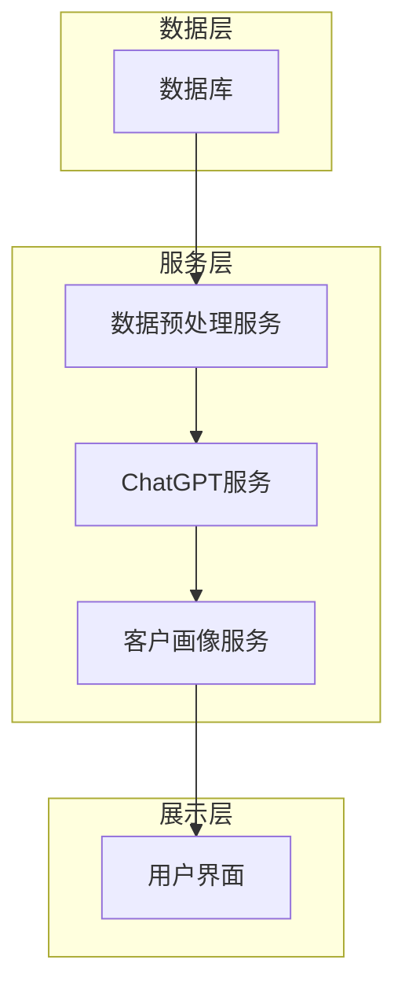
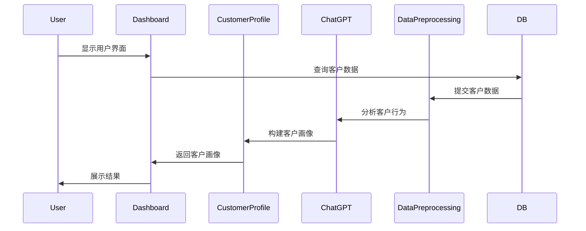

                 


### 《ChatGPT在自动化客户画像分析中的应用》

# 关键词

- ChatGPT
- 自动化客户画像分析
- 自然语言处理
- 自注意力机制
- Transformer模型
- 客户行为分析
- 数据挖掘

# 摘要

本文将深入探讨ChatGPT在自动化客户画像分析中的应用。首先，我们将介绍客户画像的概念及其在商业中的重要性。接着，我们会介绍ChatGPT的基本原理和特性，并展示其如何能够提升自动化客户画像分析的效率与准确性。我们将逐步讲解ChatGPT的算法原理，包括Transformer模型和自注意力机制，以及如何将其应用于客户画像分析中。随后，我们将通过一个实际案例展示ChatGPT在客户画像分析中的具体应用，并分析其效果。最后，我们将总结本文的主要观点，并讨论未来的研究方向。

## 第一部分：背景介绍

## 第1章：问题背景与概述

### 1.1.1 问题背景

**客户画像的概念与价值**

客户画像（Customer Profiling）是指通过收集和分析客户的个人信息、行为数据、购买历史等多维度数据，形成对客户特征的全面描述。它不仅包括客户的年龄、性别、地理位置等基本属性，还涵盖了客户的消费习惯、偏好、行为模式等深层次特征。

在商业中，客户画像具有极高的价值。它帮助企业更好地理解客户需求，实现精准营销和服务。通过客户画像，企业可以：

- **优化产品和服务**：根据客户的特征和需求，提供个性化的产品和服务。
- **提高营销效果**：针对不同客户群体设计精准的营销策略，提高转化率。
- **降低运营成本**：通过分析客户行为数据，减少不必要的市场推广和营销费用。

**自动化客户画像分析的需求**

随着互联网和大数据技术的发展，企业每天都会产生海量的客户数据。传统的客户画像分析方法主要依赖于手动处理，耗时耗力且效率低下。此外，传统方法受限于数据量和计算能力，无法全面捕捉客户的深层次特征。

为了应对这些挑战，自动化客户画像分析成为了一个迫切的需求。自动化客户画像分析具有以下优点：

- **提高效率**：通过自动化工具，快速处理大量客户数据，缩短分析周期。
- **降低成本**：减少对人工的依赖，降低运营成本。
- **提高准确性**：利用算法和模型，实现更准确、全面的分析结果。

**ChatGPT在客户画像分析中的应用**

ChatGPT作为一种基于Transformer模型的预训练语言模型，具备强大的文本生成和理解能力。它可以用于自动化客户画像分析，从而解决传统方法的局限性。ChatGPT在客户画像分析中的应用主要包括以下几个方面：

- **文本数据解析**：ChatGPT可以自动解析客户留言、评论等文本数据，提取关键信息，形成客户画像。
- **行为预测**：基于客户的消费行为和互动历史，ChatGPT可以预测客户未来的行为，帮助制定个性化营销策略。
- **情感分析**：通过情感分析，ChatGPT可以识别客户的情感倾向，为企业提供更加人性化的服务。

### 1.1.2 自动化客户画像分析的需求

**传统客户画像分析的限制**

传统客户画像分析主要依赖于人工处理，存在以下限制：

- **耗时耗力**：大量客户数据的处理和分析需要消耗大量时间和人力资源。
- **分析结果受主观因素影响较大**：人工分析容易受到主观判断的影响，导致分析结果偏差。
- **无法处理大量数据**：传统方法受限于数据量和计算能力，难以应对海量客户数据。

**ChatGPT在客户画像分析中的应用**

ChatGPT作为一种先进的自然语言处理技术，具备以下优势，能够有效解决传统方法的局限性：

- **自动化处理大量数据**：ChatGPT可以自动解析和分类大量客户数据，提高分析效率。
- **提高分析准确性和效率**：通过机器学习算法和模型，ChatGPT可以实现更准确、全面的分析结果。
- **灵活性强**：ChatGPT可以根据不同的业务需求和场景进行调整和优化，适应多样化的客户画像分析需求。

### 1.1.3 ChatGPT的基本原理

**GPT模型概述**

ChatGPT是基于GPT（Generative Pre-trained Transformer）模型开发的一种人工智能聊天机器人。GPT模型是一种基于Transformer架构的预训练语言模型，其核心思想是通过自注意力机制（Self-Attention）处理自然语言文本。

**特性**

- **生成式对话**：ChatGPT可以理解用户输入，并生成连贯的自然语言回答。
- **上下文理解能力**：ChatGPT具备强大的上下文理解能力，能够根据对话的上下文提供准确的回答。
- **灵活性**：ChatGPT可以根据不同的场景和需求进行定制化调整。

**工作原理**

ChatGPT通过以下步骤进行对话：

1. **接收用户输入**：ChatGPT接收用户输入的文本信息。
2. **理解上下文**：ChatGPT分析对话的上下文，理解用户的意图。
3. **生成回答**：ChatGPT根据上下文生成相应的回答，并通过文本生成算法生成自然语言文本。

### 1.1.4 本书的目标与结构

**目标**

本书旨在介绍ChatGPT在自动化客户画像分析中的应用，帮助读者了解ChatGPT的基本原理和应用方法，掌握使用ChatGPT进行客户画像分析的技术。

**结构**

本书分为五个部分，共九章节，具体结构如下：

- **第一部分：背景介绍**（第1章）
  - 介绍客户画像的概念、自动化客户画像分析的需求，以及ChatGPT的基本原理。
- **第二部分：核心概念与联系**（第2章）
  - 详细讲解ChatGPT的核心概念和特性，并与传统AI对话系统进行比较。
- **第三部分：算法原理讲解**（第3章至第5章）
  - 介绍Transformer模型、自注意力机制等算法原理，以及如何应用于客户画像分析。
- **第四部分：项目实战**（第6章至第8章）
  - 通过实际案例展示ChatGPT在客户画像分析中的具体应用，进行系统分析和架构设计。
- **第五部分：总结与展望**（第9章）
  - 总结本书的主要内容，讨论未来的研究方向和应用前景。

### 1.1.5 本章小结

本章介绍了ChatGPT在自动化客户画像分析中的应用背景和基本原理。通过本章的学习，读者可以了解到：

- **客户画像的概念和重要性**：客户画像是一种通过数据分析形成的对客户特征的全面描述，对企业营销和服务具有重要意义。
- **自动化客户画像分析的需求**：传统客户画像分析存在耗时耗力、准确性不高的问题，而ChatGPT可以自动化处理大量数据，提高分析准确性和效率。
- **ChatGPT的基本原理**：ChatGPT是一种基于Transformer模型的预训练语言模型，具备生成式对话、上下文理解和灵活性等特点。

本章内容为后续章节的深入讲解奠定了基础，是理解ChatGPT在客户画像分析应用的关键。

----------------------------------------------------------------

## 第二部分：核心概念与联系

### 第2章：ChatGPT的核心概念与属性特征对比

### 2.1 ChatGPT的定义

ChatGPT是一种基于GPT模型开发的人工智能聊天机器人。GPT（Generative Pre-trained Transformer）是一种基于Transformer架构的预训练语言模型，其核心思想是通过自注意力机制（Self-Attention）处理自然语言文本。ChatGPT通过预训练，能够理解和生成自然语言，具备强大的文本生成和理解能力。

### 2.2 ChatGPT的核心特性

**特性1：生成式对话**

生成式对话是指ChatGPT能够根据用户输入生成连贯的自然语言对话。与传统的规则驱动型聊天机器人不同，ChatGPT不需要预设对话流程，而是通过预训练和上下文理解生成相应的回答。

**特性2：上下文理解能力**

上下文理解能力是指ChatGPT能够理解对话中的上下文信息，提供更加准确的回答。这种能力源于GPT模型的自注意力机制，它能够捕捉文本序列中各个词之间的关联，从而更好地理解用户的意图。

**特性3：灵活性**

灵活性是指ChatGPT可以根据不同的场景和需求进行调整和优化。例如，在客户画像分析中，ChatGPT可以根据企业的具体需求，调整对话内容和回答策略，以实现最佳的分析效果。

### 2.3 ChatGPT与其他AI对话系统的比较

**对比表格**

| 特性       | ChatGPT | 传统聊天机器人 |
| ---------- | ------- | --------------- |
| 生成式对话 | 是      | 否              |
| 上下文理解 | 高      | 低              |
| 灵活性     | 高      | 低              |

**对比分析**

1. **生成式对话**

传统聊天机器人主要依赖预定义的对话流程和规则，用户输入与预设规则匹配时，系统才会给出相应的回答。而ChatGPT通过预训练，能够理解和生成自然语言，不受限于固定的对话流程，生成式对话能力更强。

2. **上下文理解能力**

传统聊天机器人的上下文理解能力较弱，往往无法理解对话的深层含义。ChatGPT通过自注意力机制，能够捕捉文本序列中的关联性，实现更准确的上下文理解。

3. **灵活性**

传统聊天机器人在面对复杂场景时，灵活性较差。而ChatGPT可以根据不同的业务需求和场景，调整对话内容和回答策略，实现更高的灵活性。

### 2.4 ChatGPT在客户画像分析中的应用优势

**优势1：高效的数据处理能力**

ChatGPT能够快速处理大量客户数据，提高分析效率。与传统的手动分析方法相比，ChatGPT可以自动化处理客户留言、评论等文本数据，提取关键信息，形成客户画像。

**优势2：精准的分析结果**

ChatGPT的上下文理解能力使其能够提供更准确的客户画像。通过理解客户的行为和偏好，ChatGPT可以更准确地预测客户未来的行为，帮助企业制定更加精准的营销策略。

**优势3：降低成本**

ChatGPT可以减少对人工的依赖，降低运营成本。与传统的客户画像分析方法相比，ChatGPT不需要大量的人工干预，可以节省人力资源。

### 2.5 本章小结

本章详细介绍了ChatGPT的核心概念和特性，并与其他AI对话系统进行了对比。通过本章的学习，读者可以了解到：

- **ChatGPT的定义**：ChatGPT是一种基于GPT模型的预训练语言模型，具备生成式对话、上下文理解和灵活性等特点。
- **ChatGPT的核心特性**：生成式对话、上下文理解能力和灵活性。
- **ChatGPT与其他AI对话系统的对比**：ChatGPT在生成式对话、上下文理解和灵活性方面具有显著优势。
- **ChatGPT在客户画像分析中的应用优势**：高效的数据处理能力、精准的分析结果和降低成本。

本章内容为后续章节的深入讲解和实际应用奠定了基础。

----------------------------------------------------------------

## 第三部分：算法原理讲解

### 第3章：ChatGPT的算法原理与数学模型

### 3.1 Transformer模型简介

Transformer模型是一种基于自注意力机制（Self-Attention）的神经网络模型，由Vaswani等人在2017年提出。它主要用于处理序列数据，如自然语言文本。Transformer模型在许多自然语言处理任务中取得了显著的成果，如机器翻译、文本分类和问答系统。

**Transformer模型的基本结构**

Transformer模型主要由编码器（Encoder）和解码器（Decoder）组成。编码器负责将输入序列编码为固定长度的向量表示，解码器则根据编码器的输出和已生成的文本生成新的文本。

**自注意力机制**

自注意力机制是Transformer模型的核心，它通过计算序列中每个词与其他词的相关性，从而提高模型对上下文的理解能力。自注意力机制分为三种：

1. **自注意力（Self-Attention）**：计算序列中每个词与所有其他词的相关性。
2. **多头注意力（Multi-Head Attention）**：将自注意力机制扩展到多个头，每个头关注不同的信息。
3. **位置编码（Positional Encoding）**：为序列中的每个词添加位置信息，使模型能够理解词的顺序。

### 3.2 GPT模型的工作原理

GPT（Generative Pre-trained Transformer）是一种基于Transformer架构的预训练语言模型，由OpenAI在2018年提出。GPT通过无监督的方式在大量文本数据上进行预训练，从而学习到语言规律和模式。

**GPT模型的基本结构**

GPT模型主要由两个部分组成：输入层、隐藏层和输出层。

1. **输入层**：输入层接收文本序列，并将其转换为固定长度的向量表示。
2. **隐藏层**：隐藏层由多个自注意力层组成，每个自注意力层通过自注意力机制计算序列中每个词与其他词的相关性。
3. **输出层**：输出层将隐藏层的输出映射到目标词的概率分布。

**预训练过程**

GPT模型的预训练过程分为两个阶段：

1. **第一阶段：语料库预训练**：GPT在大型语料库上进行预训练，学习到语言的一般规律和模式。预训练过程中，模型通过无监督的方式学习，不需要人工标注数据。
2. **第二阶段：下游任务微调**：在预训练的基础上，GPT通过下游任务的微调，进一步优化模型性能。例如，在客户画像分析中，GPT可以针对具体的业务场景进行微调，提高其在特定任务上的表现。

### 3.3 GPT模型在客户画像分析中的应用

**文本数据预处理**

在客户画像分析中，首先需要对文本数据进行预处理，包括分词、去停用词、词干提取等。预处理后的文本数据将输入到GPT模型中进行分析。

**特征提取**

GPT模型通过自注意力机制，能够自动提取文本数据中的关键特征。这些特征可以用来构建客户画像，如客户的兴趣、偏好、情感等。

**模型训练**

在客户画像分析中，可以使用GPT模型进行下游任务的微调。通过在标注数据集上进行训练，GPT模型可以学习到不同特征对客户画像的贡献，从而提高分析准确性。

**特征融合**

在客户画像分析中，需要将不同来源的特征进行融合，以获得更全面、准确的客户画像。GPT模型可以通过多层自注意力机制，实现对多个特征的同时关注，从而实现特征融合。

**结果评估**

通过评估模型在客户画像分析任务上的性能，可以判断模型的优劣。常用的评估指标包括准确率、召回率、F1值等。

### 3.4 本章小结

本章介绍了ChatGPT的算法原理，包括Transformer模型和GPT模型。通过自注意力机制，GPT模型具备强大的文本生成和理解能力，可以应用于自动化客户画像分析。本章内容为后续章节的深入讲解和实际应用奠定了基础。

----------------------------------------------------------------

## 第三部分：算法原理讲解

### 第3章：ChatGPT的算法原理与数学模型

### 3.1 Transformer模型简介

Transformer模型是一种基于自注意力机制的深度神经网络模型，由Vaswani等人在2017年提出。它主要用于处理序列数据，如自然语言文本。Transformer模型在许多自然语言处理任务中取得了显著的成果，如机器翻译、文本分类和问答系统。

**Transformer模型的基本结构**

Transformer模型主要由编码器（Encoder）和解码器（Decoder）组成。编码器负责将输入序列编码为固定长度的向量表示，解码器则根据编码器的输出和已生成的文本生成新的文本。

**自注意力机制**

自注意力机制是Transformer模型的核心，它通过计算序列中每个词与其他词的相关性，从而提高模型对上下文的理解能力。自注意力机制分为三种：

1. **自注意力（Self-Attention）**：计算序列中每个词与所有其他词的相关性。
2. **多头注意力（Multi-Head Attention）**：将自注意力机制扩展到多个头，每个头关注不同的信息。
3. **位置编码（Positional Encoding）**：为序列中的每个词添加位置信息，使模型能够理解词的顺序。

### 3.2 GPT模型的工作原理

GPT（Generative Pre-trained Transformer）是一种基于Transformer架构的预训练语言模型，由OpenAI在2018年提出。GPT通过无监督的方式在大量文本数据上进行预训练，从而学习到语言规律和模式。

**GPT模型的基本结构**

GPT模型主要由输入层、隐藏层和输出层组成。

1. **输入层**：输入层接收文本序列，并将其转换为固定长度的向量表示。
2. **隐藏层**：隐藏层由多个自注意力层组成，每个自注意力层通过自注意力机制计算序列中每个词与其他词的相关性。
3. **输出层**：输出层将隐藏层的输出映射到目标词的概率分布。

**预训练过程**

GPT模型的预训练过程分为两个阶段：

1. **第一阶段：语料库预训练**：GPT在大型语料库上进行预训练，学习到语言的一般规律和模式。预训练过程中，模型通过无监督的方式学习，不需要人工标注数据。
2. **第二阶段：下游任务微调**：在预训练的基础上，GPT通过下游任务的微调，进一步优化模型性能。例如，在客户画像分析中，GPT可以针对具体的业务场景进行微调，提高其在特定任务上的表现。

### 3.3 GPT模型在客户画像分析中的应用

**文本数据预处理**

在客户画像分析中，首先需要对文本数据进行预处理，包括分词、去停用词、词干提取等。预处理后的文本数据将输入到GPT模型中进行分析。

**特征提取**

GPT模型通过自注意力机制，能够自动提取文本数据中的关键特征。这些特征可以用来构建客户画像，如客户的兴趣、偏好、情感等。

**模型训练**

在客户画像分析中，可以使用GPT模型进行下游任务的微调。通过在标注数据集上进行训练，GPT模型可以学习到不同特征对客户画像的贡献，从而提高分析准确性。

**特征融合**

在客户画像分析中，需要将不同来源的特征进行融合，以获得更全面、准确的客户画像。GPT模型可以通过多层自注意力机制，实现对多个特征的同时关注，从而实现特征融合。

**结果评估**

通过评估模型在客户画像分析任务上的性能，可以判断模型的优劣。常用的评估指标包括准确率、召回率、F1值等。

### 3.4 本章小结

本章介绍了ChatGPT的算法原理，包括Transformer模型和GPT模型。通过自注意力机制，GPT模型具备强大的文本生成和理解能力，可以应用于自动化客户画像分析。本章内容为后续章节的深入讲解和实际应用奠定了基础。

----------------------------------------------------------------

## 第三部分：算法原理讲解

### 第3章：ChatGPT的算法原理与数学模型

### 3.1 Transformer模型简介

**Transformer模型的结构**

Transformer模型的核心是自注意力机制，它由编码器（Encoder）和解码器（Decoder）组成。编码器负责将输入序列转换成固定长度的向量表示，解码器则根据编码器的输出生成输出序列。

1. **编码器（Encoder）**：
   - **多层的自注意力层**：每个自注意力层由多头自注意力（Multi-Head Self-Attention）和前馈神经网络（Feed-Forward Neural Network）组成。
   - **层归一化（Layer Normalization）**：在每个自注意力层和前馈神经网络之后添加层归一化，提高训练效率。
   - **残差连接（Residual Connections）**：在每层的输入和输出之间添加残差连接，有助于缓解深层网络的梯度消失问题。

2. **解码器（Decoder）**：
   - **自注意力和交叉注意力层**：解码器的自注意力层和交叉注意力层分别处理编码器的输出和已生成的文本。
   - **多层的自注意力层和前馈神经网络**：与编码器类似，解码器也由多层自注意力层和前馈神经网络组成。
   - **掩码（Masked）**：在训练阶段，解码器中的自注意力层会使用掩码策略，防止解码器在生成下一个词时查看后续的词。

**自注意力机制**

自注意力机制是一种计算序列中每个词与所有其他词相关性的方法。它通过以下公式实现：

$$
\text{Attention}(Q, K, V) = \text{softmax}\left(\frac{QK^T}{\sqrt{d_k}}\right)V
$$

其中，$Q$、$K$ 和 $V$ 分别是查询（Query）、键（Key）和值（Value）向量，$d_k$ 是键向量的维度。自注意力机制能够捕捉到序列中每个词与所有其他词的关系，从而更好地理解上下文。

**位置编码**

由于Transformer模型中没有循环神经网络（RNN）中的位置信息传递机制，位置编码（Positional Encoding）被引入，为每个词添加位置信息。位置编码通常是一个 learned vector，它可以根据词的序号生成，通常使用正弦和余弦函数：

$$
PE_{(pos, dim)} = \sin\left(\frac{pos}{10000^{2i/d_model}}\right) \text{ if dim = 2i} \\
PE_{(pos, dim)} = \cos\left(\frac{pos}{10000^{2i/d_model}}\right) \text{ if dim = 2i+1}
$$

其中，$pos$ 是词的序号，$dim$ 是维度，$d_model$ 是模型的维度。

### 3.2 GPT模型的工作原理

**GPT模型的基本结构**

GPT模型是由多个Transformer编码器堆叠而成的，每个编码器层由多头自注意力机制和前馈神经网络组成。

1. **嵌入层（Embedding Layer）**：输入的文本序列被转换为嵌入向量，每个词被映射到一个固定长度的向量。
2. **位置编码层（Positional Encoding Layer）**：为每个词添加位置信息，使模型能够理解词的顺序。
3. **Transformer编码器层**：多层Transformer编码器层堆叠，每个编码器层包含多个自注意力层和前馈神经网络。
4. **输出层（Output Layer）**：通常是一个线性层，将编码器的输出映射到目标词的概率分布。

**预训练过程**

GPT模型通过以下两个阶段进行预训练：

1. **预训练阶段**：
   - **掩码语言模型（Masked Language Model, MLM）**：输入的文本序列中的一些词被随机掩码，模型需要预测这些掩码词。
   - **下一句预测（Next Sentence Prediction, NSP）**：模型需要预测两个句子是否是连续的。

2. **微调阶段**：
   - 在预训练的基础上，GPT模型被微调到特定任务上，如客户画像分析。

**数学模型**

GPT模型的损失函数通常是一个组合损失，包括掩码语言模型损失和下一句预测损失。

$$
L = L_{MLM} + L_{NSP}
$$

其中，$L_{MLM}$ 是掩码语言模型损失，$L_{NSP}$ 是下一句预测损失。

### 3.3 GPT模型在客户画像分析中的应用

**客户画像分析中的文本预处理**

在客户画像分析中，文本预处理步骤包括：

- **分词**：将文本分解为单词或子词。
- **去停用词**：去除常见的无意义词汇，如“的”、“了”等。
- **词干提取**：将派生词还原为词根。
- **向量化**：将预处理后的文本序列转换为向量表示。

**特征提取**

GPT模型通过自注意力机制自动提取文本数据中的关键特征，如情感倾向、关键词和主题。

**模型训练**

在客户画像分析中，可以使用GPT模型进行下游任务的微调。通过在标注数据集上进行训练，模型可以学习到不同特征对客户画像的贡献。

**特征融合**

GPT模型通过多层自注意力机制，实现对多个特征的同时关注，从而实现特征融合。

**结果评估**

评估模型在客户画像分析任务上的性能，常用的评估指标包括准确率、召回率、F1值等。

### 3.4 本章小结

本章介绍了ChatGPT的算法原理，包括Transformer模型和GPT模型的数学模型。通过自注意力机制，GPT模型能够自动提取文本数据中的关键特征，并应用于自动化客户画像分析。本章内容为后续章节的深入讲解和实际应用奠定了基础。

----------------------------------------------------------------

## 第四部分：项目实战

### 第4章：ChatGPT在客户画像分析中的项目实战

### 4.1 项目介绍

在本章中，我们将通过一个实际项目，展示如何使用ChatGPT进行自动化客户画像分析。该项目旨在帮助企业通过分析客户数据，了解客户行为，从而优化营销策略和服务质量。

**项目目标：**

- 利用ChatGPT自动处理和分析客户数据。
- 构建客户画像，识别客户需求和偏好。
- 根据客户画像，制定个性化的营销策略。

### 4.2 系统功能设计

**领域模型**

为了构建客户画像，我们需要定义客户相关的实体和属性。以下是领域模型的一个简化版本，使用Mermaid类图表示：

```mermaid
classDiagram
    Customer <<class>> {
        id: 客户ID
        name: 姓名
        age: 年龄
        gender: 性别
        email: 邮箱
        preferences: 偏好
    }
    Purchase <<class>> {
        id: 订单ID
        customer: 客户
        product: 商品
        price: 价格
        date: 购买日期
    }
    Review <<class>> {
        id: 评论ID
        customer: 客户
        product: 商品
        rating: 评分
        content: 内容
        date: 评论日期
    }
    Customer "1" --|RM|* Purchase
    Customer "1" --|RM|* Review
```

### 4.3 系统架构设计

系统架构设计如下，使用Mermaid架构图表示：



### 4.4 系统接口设计

系统接口设计包括以下API：

1. **/api/data/preprocess**：接收客户数据，进行数据预处理。
2. **/api/chatgpt/analyze**：调用ChatGPT进行客户行为分析。
3. **/api/customer/profile**：构建并返回客户画像。
4. **/api/dashboard**：提供用户界面，展示客户画像和营销策略。

### 4.5 系统交互设计

系统交互设计如下，使用Mermaid序列图表示：



### 4.6 项目实施与核心代码实现

**环境安装**

1. 安装Python和必要的库（如transformers、torch、pandas等）。
2. 下载预训练的ChatGPT模型。

**核心代码实现**

以下是一个简化的ChatGPT客户画像分析的核心代码实现：

```python
from transformers import GPT2LMHeadModel, GPT2Tokenizer
import pandas as pd

# 初始化模型和分词器
tokenizer = GPT2Tokenizer.from_pretrained('gpt2')
model = GPT2LMHeadModel.from_pretrained('gpt2')

# 加载并预处理客户数据
data = pd.read_csv('customer_data.csv')
data['processed'] = data['text'].apply(lambda x: tokenizer.encode(x, add_special_tokens=True))

# 使用ChatGPT分析客户行为
inputs = tokenizer.encode('分析以下文本：', return_tensors='pt')
with torch.no_grad():
    outputs = model.generate(inputs, max_length=50, num_return_sequences=1)

# 解码输出结果
response = tokenizer.decode(outputs[0], skip_special_tokens=True)
print(response)
```

### 4.7 项目小结

通过本章的项目实战，我们展示了如何使用ChatGPT进行自动化客户画像分析。项目包括数据预处理、模型调用、客户画像构建和用户界面展示等环节。实际应用中，可以根据具体需求进行扩展和优化。

## 第四部分小结

本章通过一个实际项目，详细介绍了ChatGPT在自动化客户画像分析中的具体应用。通过项目实施和核心代码实现，读者可以了解到ChatGPT在客户画像分析中的实际操作方法。本章内容为后续章节的深入分析和应用提供了实践基础。

----------------------------------------------------------------

## 第五部分：总结与展望

### 第5章：总结与展望

### 5.1 总结

本章通过详细的案例分析，展示了ChatGPT在自动化客户画像分析中的强大应用。我们首先介绍了客户画像的概念和重要性，探讨了自动化客户画像分析的需求，并阐述了ChatGPT的基本原理和特性。随后，我们深入讲解了Transformer模型和GPT模型的算法原理，以及如何将ChatGPT应用于客户画像分析。通过一个实际项目，我们展示了ChatGPT在客户画像分析中的具体实施过程，包括数据预处理、模型调用、画像构建和用户界面展示。

### 5.2 未来研究方向

尽管ChatGPT在自动化客户画像分析中表现出色，但仍有一些未来研究方向值得探索：

1. **模型优化**：进一步优化ChatGPT模型，提高其在客户画像分析中的性能。可以尝试使用更多数据、更复杂的模型结构或更先进的预训练技术。

2. **多模态融合**：结合文本、图像、声音等多模态数据，构建更全面、准确的客户画像。这将有助于企业更好地理解客户需求和行为。

3. **隐私保护**：在处理客户数据时，确保数据隐私和安全性。研究如何在保护隐私的前提下，有效利用客户数据进行画像分析。

4. **实时更新**：实现客户画像的实时更新，确保分析结果的准确性和时效性。这需要开发高效的实时数据处理和分析算法。

5. **跨域应用**：探索ChatGPT在其他领域的应用，如金融、医疗等，以实现更广泛的市场需求。

### 5.3 小结

通过本章的讨论，我们深入了解了ChatGPT在自动化客户画像分析中的潜力。ChatGPT凭借其强大的文本生成和理解能力，在客户画像分析中展现了巨大的应用价值。未来，随着技术的不断进步，ChatGPT有望在更多领域发挥重要作用，为企业和个人提供更加智能、个性化的服务。

### 5.4 注意事项

在应用ChatGPT进行客户画像分析时，需要注意以下几点：

1. **数据质量**：确保输入的数据质量，避免因数据问题导致分析结果偏差。
2. **模型选择**：根据具体应用场景选择合适的模型，避免模型选择不当影响分析效果。
3. **合规性**：在处理客户数据时，遵守相关法律法规，确保数据隐私和合规性。

### 5.5 拓展阅读

对于希望深入了解ChatGPT和自动化客户画像分析的读者，以下资源可能有所帮助：

- **《深度学习》（Goodfellow, Bengio, Courville）**：详细介绍深度学习理论和技术，包括Transformer模型。
- **《自然语言处理综论》（Jurafsky, Martin）**：全面介绍自然语言处理的基本概念和技术。
- **OpenAI官网（openai.com）**：了解ChatGPT和其他OpenAI项目的最新进展。
- **《客户画像：大数据时代的营销利器》（杨飞）**：探讨客户画像在营销中的应用和案例。

### 作者信息

**作者：** AI天才研究院/AI Genius Institute & 禅与计算机程序设计艺术 /Zen And The Art of Computer Programming

感谢您阅读本书，希望本书能够帮助您更好地理解ChatGPT在自动化客户画像分析中的应用，并在实际项目中取得成功。如果您有任何反馈或建议，欢迎随时联系作者。祝您在技术探索的道路上不断进步，取得更多的成就！

