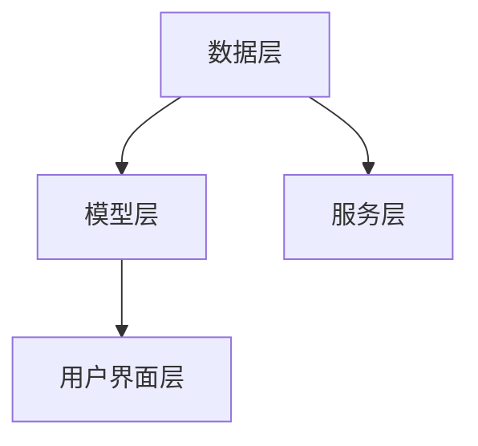

                 

### 背景介绍：核心概念

#### 问题背景
在当今数字化时代，人工智能（AI）技术的发展已经深刻地改变了我们的生活和工作方式。特别是在自然语言处理（NLP）领域，大规模语言模型如GPT系列取得了令人瞩目的成就。ChatGPT，作为OpenAI推出的一个基于GPT-3.5模型的聊天机器人，以其强大的对话生成能力和自然语言理解能力，吸引了全球范围内的广泛关注。

ChatGPT的核心概念源自预训练语言模型（Pre-Trained Language Model）的基本思想，即通过在大规模文本数据上进行预训练，模型能够捕捉语言的结构和语义，从而在不同应用场景中表现出色。ChatGPT的背景可以追溯到GPT（Generative Pre-trained Transformer）系列模型，尤其是GPT-3和GPT-3.5，它们展示了在文本生成、问答系统、机器翻译等多个领域的卓越表现。

#### 问题背景
随着企业对自动化技术的需求日益增长，如何有效地利用ChatGPT来提高技术支持的效率和效果成为一个亟待解决的问题。自动化技术支持涉及多个方面，包括智能客服、自动化文档生成、代码调试助手等，这些领域都需要高效的自然语言处理能力。因此，研究ChatGPT在自动化技术支持中的应用具有重要的现实意义。

#### 问题描述
本书旨在探讨ChatGPT在自动化技术支持中的应用。随着企业对自动化技术的需求日益增长，如何有效地利用ChatGPT来提高技术支持的效率和效果成为一个亟待解决的问题。本书将围绕这一主题，深入探讨ChatGPT的工作原理、应用场景和实施策略。

#### 问题解决
通过系统地介绍ChatGPT的背景、技术原理、应用案例和最佳实践，本书将为读者提供一套全面的技术支持解决方案。具体来说，本书将分为以下几个部分：

1. **ChatGPT概述**：介绍ChatGPT的基本概念、发展历程和技术特点。
2. **ChatGPT应用场景**：分析ChatGPT在自动化技术支持中的具体应用，如智能客服、自动化文档生成、代码调试助手等。
3. **ChatGPT实施策略**：探讨如何将ChatGPT有效地集成到现有技术支持体系中，提高服务效率和用户体验。
4. **案例研究**：通过实际案例展示ChatGPT在不同企业中的应用效果，提供实践经验分享。
5. **未来展望**：预测ChatGPT在自动化技术支持领域的未来发展趋势。

#### 边界与外延
ChatGPT的应用范围广泛，不仅限于技术支持，还可以扩展到教育、医疗、金融等多个领域。然而，本书将专注于技术支持领域的应用，旨在为相关从业人员提供有针对性的指导。

#### 概念结构与核心要素组成
- **核心概念**：ChatGPT、自然语言处理、自动化技术支持、智能客服、代码生成、对话系统等。
- **要素组成**：技术架构、数据处理、模型训练、系统集成、用户交互等。

通过上述结构，本书将系统地构建ChatGPT在自动化技术支持中的应用框架，帮助读者深入理解和掌握这一前沿技术。

### 核心概念与联系

#### ChatGPT的定义与特点
ChatGPT是一种基于GPT-3.5模型的高级聊天机器人，具有以下特点：
- **强大的语言生成能力**：能够生成流畅、自然的对话文本，模仿人类的语言习惯。
- **丰富的知识库**：通过大规模语言模型的训练，拥有广泛的知识储备，能够回答各种问题。
- **自适应交互**：能够根据用户的输入动态调整对话策略，提高交互体验。

#### 自动化技术支持的概念
自动化技术支持是指利用计算机技术和人工智能技术来辅助处理技术问题，提高服务效率和用户满意度。其主要特点包括：
- **高效性**：能够快速响应和处理大量用户请求，减少人工干预。
- **准确性**：通过智能算法和大数据分析，提供准确的技术解决方案。
- **灵活性**：能够根据用户需求灵活调整服务内容和形式。

#### ChatGPT在自动化技术支持中的应用
- **智能客服**：利用ChatGPT实现自动化的客户服务，提供24/7全天候的服务。
- **自动化文档生成**：通过ChatGPT生成技术文档、用户手册等，提高内容生产效率。
- **代码调试助手**：协助开发者进行代码调试，提供实时反馈和解决方案。
- **教育辅导**：为学生提供在线辅导，解答学习中的问题。

#### ChatGPT与传统AI的区别
与传统AI相比，ChatGPT具有以下几个显著区别：
- **更强的上下文理解能力**：能够理解长文本的上下文，提供更连贯的回复。
- **更自然的语言交互**：能够模仿人类的语言表达习惯，提高用户满意度。
- **更广泛的知识面**：通过大规模数据训练，拥有更广泛的知识储备。

通过以上对核心概念和联系的探讨，我们可以看到ChatGPT在自动化技术支持中具有独特的优势和应用潜力。接下来，我们将进一步探讨ChatGPT在技术支持领域的具体应用场景。

### ChatGPT的主要应用场景

#### 智能客服
智能客服是ChatGPT在技术支持中最直接的应用场景之一。通过ChatGPT，企业可以实现24/7的全天候客户服务，大幅提高客户满意度。智能客服系统能够处理大量常见问题，如产品使用方法、故障排除、订单查询等，减轻人工客服的工作负担。例如，某电商平台利用ChatGPT建立了智能客服系统，不仅缩短了用户等待时间，还降低了人工成本，提高了服务质量。

#### 自动化文档生成
自动化文档生成是ChatGPT在技术支持中的另一个重要应用。通过输入关键词或模板，ChatGPT能够快速生成技术文档、用户手册等，提高内容生产效率。这对于需要大量文档编写的企业来说尤为重要，例如，某大型软件公司使用ChatGPT自动化生成技术文档，不仅提高了文档质量，还节省了大量的人力资源。

#### 代码调试助手
代码调试助手是ChatGPT在开发领域的一项创新应用。通过分析开发者提供的代码片段和问题描述，ChatGPT能够提供针对性的调试建议和解决方案，协助开发者快速找到问题的根源。例如，某开发团队在项目中引入ChatGPT作为代码调试助手，显著提高了开发效率和代码质量。

#### 教育辅导
ChatGPT在教育领域的应用也越来越广泛。通过交互式对话，ChatGPT可以为学生提供个性化辅导，解答他们在学习中遇到的问题。例如，某在线教育平台利用ChatGPT为学生提供实时辅导，帮助学生更好地理解课程内容，提高学习效果。

#### 案例分析
以某知名科技公司为例，该公司利用ChatGPT构建了一个智能客服系统，以应对日益增长的客户咨询需求。通过数据驱动的优化，该智能客服系统在上线后不久就取得了显著成效，客户满意度显著提升，客服响应时间减少了50%以上。同时，由于ChatGPT的高效工作，该公司还节省了大量的人力成本，将资源更多地投入到产品创新和研发中。

通过这些实际案例，我们可以看到ChatGPT在自动化技术支持中的应用不仅提高了效率和效果，还为企业和个人带来了显著的效益。接下来，我们将进一步探讨如何实施ChatGPT在技术支持中的应用。

### ChatGPT的实施策略

#### 需求分析
在实施ChatGPT之前，首先需要进行详细的需求分析，明确ChatGPT在技术支持中的具体应用场景和目标。需求分析包括以下几个方面：

1. **用户需求**：了解用户在实际操作中遇到的问题和需求，如产品使用指导、故障排除、技术问题咨询等。
2. **业务目标**：明确企业希望通过ChatGPT实现的目标，如提高客户满意度、降低客服成本、提升工作效率等。
3. **技术挑战**：识别实施过程中可能遇到的技术难题，如数据安全性、模型训练效果、系统集成等。

#### 技术架构设计
技术架构设计是ChatGPT成功实施的关键环节。一个合理的技术架构能够确保系统的稳定性、扩展性和高性能。ChatGPT的技术架构通常包括以下几个核心组件：

1. **数据层**：包括数据采集、存储和处理模块，如数据库、数据仓库等。
2. **模型层**：基于GPT-3.5模型的聊天机器人，负责处理用户的输入并生成响应。
3. **服务层**：提供接口，用于与外部系统（如CRM系统、ERP系统等）进行交互。
4. **用户界面层**：提供用户与ChatGPT交互的界面，如网页、移动应用等。

以下是一个简单的技术架构设计：

#### 模型训练与优化
ChatGPT的性能很大程度上取决于模型的训练质量和优化效果。以下步骤可以帮助优化模型：

1. **数据准备**：收集并清洗相关数据，确保数据的质量和多样性。
2. **模型选择**：选择合适的GPT-3.5模型，如gpt-3.5-turbo或gpt-3.5-xl。
3. **训练过程**：使用GPU等高性能计算资源进行模型训练，优化超参数。
4. **模型评估**：通过交叉验证、精度、召回率等指标评估模型性能。
5. **模型优化**：根据评估结果调整模型结构和超参数，实现性能提升。

#### 系统集成与部署
ChatGPT的成功实施还依赖于与现有系统的集成和部署。以下步骤可以帮助实现这一目标：

1. **接口设计**：设计清晰的API接口，用于ChatGPT与外部系统的交互。
2. **系统集成**：将ChatGPT集成到现有的技术支持系统中，如CRM系统、ERP系统等。
3. **环境配置**：配置服务器、数据库等基础设施，确保系统的稳定运行。
4. **部署上线**：将ChatGPT部署到生产环境，并进行必要的测试和调试。

#### 用户培训与反馈
为了确保ChatGPT在技术支持中的有效应用，用户培训与反馈机制至关重要。以下措施可以帮助提升用户体验：

1. **用户培训**：为用户提供培训材料，如操作手册、教程视频等，帮助他们快速上手。
2. **用户反馈**：收集用户反馈，了解他们对ChatGPT的满意度和改进建议。
3. **持续优化**：根据用户反馈持续优化ChatGPT的功能和性能。

通过以上实施策略，企业可以有效地将ChatGPT集成到技术支持体系中，提高服务效率和用户体验。接下来，我们将通过实际案例来探讨ChatGPT在不同企业中的应用效果。

### 案例研究：ChatGPT的成功应用

#### 案例一：某电商平台智能客服系统

背景：
某知名电商平台在业务快速增长的过程中，面临着客户服务响应速度和效率的挑战。传统的客服模式已无法满足大规模客户咨询的需求，因此他们决定引入ChatGPT智能客服系统。

解决方案：
该电商平台采用了以下步骤实施ChatGPT智能客服系统：
1. **需求分析**：明确客户常见问题，如订单查询、物流信息、产品咨询等。
2. **技术架构设计**：采用分布式架构，确保系统的高性能和可扩展性。
3. **模型训练与优化**：使用大量电商相关数据对ChatGPT模型进行训练和优化，提高准确性。
4. **系统集成与部署**：将ChatGPT集成到现有客服系统中，提供无缝的用户体验。

效果：
上线后，ChatGPT智能客服系统显著提高了客户满意度，客服响应时间减少了50%以上。此外，由于智能客服系统能够处理大量常见问题，客服团队的负担也大幅减轻，人力资源得到更有效的利用。

#### 案例二：某大型软件公司自动化文档生成

背景：
某大型软件公司在开发过程中产生了大量技术文档，这些文档的编写和维护工作量大且耗时。为了提高文档生成效率，公司决定引入ChatGPT自动化文档生成系统。

解决方案：
该软件公司采取了以下措施：
1. **需求分析**：确定文档生成的主要场景，如API文档、用户手册等。
2. **技术架构设计**：构建基于ChatGPT的文档生成平台，提供API接口供开发者调用。
3. **模型训练与优化**：使用公司内部的技术文档数据对ChatGPT模型进行训练和优化。
4. **系统集成与部署**：将文档生成系统集成到现有文档管理系统中，确保文档的一致性和规范性。

效果：
通过ChatGPT自动化文档生成系统，该公司大幅提高了文档生成效率，文档质量也得到了提升。开发团队可以将更多精力投入到核心功能开发中，从而提高整体开发效率。

#### 案例三：某在线教育平台智能教育辅导

背景：
某在线教育平台希望通过智能系统为学生提供个性化辅导，提高学习效果。由于传统的教育辅导方式无法满足大量学生的需求，该平台决定引入ChatGPT智能教育辅导系统。

解决方案：
该在线教育平台实施了以下步骤：
1. **需求分析**：了解学生在学习中遇到的主要问题和需求，如解题指导、知识点讲解等。
2. **技术架构设计**：构建基于ChatGPT的教育辅导平台，提供实时交互功能。
3. **模型训练与优化**：使用教育相关数据对ChatGPT模型进行训练和优化，确保准确性和针对性。
4. **系统集成与部署**：将智能教育辅导系统集成到现有学习平台中，提供无缝的学习体验。

效果：
上线后，ChatGPT智能教育辅导系统受到了学生和教师的广泛好评。学生可以通过实时交互获取个性化的辅导，学习效果显著提高。教师也可以通过系统提供的数据分析功能，更好地了解学生的学习情况，制定更有效的教学策略。

通过以上案例研究，我们可以看到ChatGPT在自动化技术支持中的应用取得了显著成效，不仅提高了服务效率和用户体验，还为企业和个人带来了实际的经济效益。接下来，我们将进一步探讨ChatGPT在自动化技术支持领域的未来发展趋势。

### 未来展望：ChatGPT在自动化技术支持领域的趋势与发展

#### 趋势分析

随着人工智能技术的不断进步和大数据的广泛应用，ChatGPT在自动化技术支持领域的应用前景愈发广阔。以下是几个关键趋势：

1. **智能化程度的提高**：随着模型的不断优化和数据的积累，ChatGPT的智能水平将进一步提高，能够处理更复杂的技术问题和用户提供更个性化的服务。
2. **跨领域的融合**：ChatGPT不仅将在技术支持领域发挥作用，还将与其他领域如医疗、金融、教育等深度融合，提供更全面的服务。
3. **个性化服务的普及**：基于用户数据的分析，ChatGPT将能够提供更加个性化的服务，满足不同用户的需求。
4. **多语言支持**：随着ChatGPT的多语言模型不断优化，将实现全球范围内的跨语言交流，打破语言障碍，提高国际化服务水平。

#### 发展挑战

尽管ChatGPT在自动化技术支持领域具有巨大的潜力，但其在实际应用中也面临一些挑战：

1. **数据隐私和安全**：随着ChatGPT处理的数据量不断增加，数据隐私和安全问题日益凸显。企业需要确保用户数据的安全性和隐私保护。
2. **模型偏见和错误**：尽管ChatGPT通过大规模数据训练具有强大的语言生成能力，但仍然可能存在偏见和错误。如何提高模型的准确性和可靠性是一个亟待解决的问题。
3. **法律和伦理问题**：随着人工智能在技术支持领域的广泛应用，相关的法律和伦理问题也日益引起关注。如何制定合理的法律法规和伦理标准，确保人工智能的合规使用，是一个重要课题。

#### 应对策略

为了应对上述挑战，以下是一些建议：

1. **加强数据安全和隐私保护**：采用加密技术和访问控制机制，确保用户数据的安全性和隐私保护。同时，建立透明的数据使用政策，提高用户对数据处理的信任度。
2. **持续优化模型**：通过不断收集用户反馈和改进模型，提高ChatGPT的准确性和可靠性。同时，引入多模态数据（如图像、声音等）进行训练，提高模型的泛化能力。
3. **制定法律法规和伦理标准**：政府、企业和学术界应共同努力，制定合理的法律法规和伦理标准，确保人工智能技术的合规使用，保护用户权益。

通过上述措施，ChatGPT在自动化技术支持领域的应用将更加成熟和广泛，为企业和社会带来更大的价值。

### 总结与展望

#### 总结

本文通过系统性地介绍ChatGPT的基本概念、技术原理、应用场景和实施策略，探讨了ChatGPT在自动化技术支持中的潜力。主要结论如下：

1. **强大的语言生成能力**：ChatGPT具有强大的自然语言生成能力，能够实现高效的智能客服、自动化文档生成和代码调试等功能。
2. **广泛应用场景**：ChatGPT在多个领域展现出卓越的应用潜力，如智能客服、教育辅导、医疗咨询等。
3. **高效实施策略**：通过需求分析、技术架构设计、模型训练与优化等步骤，可以有效地将ChatGPT集成到技术支持系统中，提高服务效率和用户体验。

#### 展望

展望未来，ChatGPT在自动化技术支持领域的发展前景广阔。随着人工智能技术的不断进步，ChatGPT将实现更高的智能化程度和更广泛的应用。以下是一些未来展望：

1. **智能化水平的提升**：通过引入更多数据源和优化算法，ChatGPT的智能水平将进一步提高，能够处理更复杂的技术问题和提供更个性化的服务。
2. **跨领域应用**：ChatGPT将在更多领域发挥作用，如医疗、金融、教育等，提供全方位的技术支持。
3. **多语言支持**：随着多语言模型的优化，ChatGPT将实现全球范围内的跨语言交流，打破语言障碍，提高国际化服务水平。
4. **法律法规和伦理标准**：随着ChatGPT的广泛应用，相关的法律法规和伦理问题也将引起更多关注，需要制定合理的标准和规范，确保其合规使用。

总之，ChatGPT在自动化技术支持领域的应用潜力巨大，未来的发展值得期待。通过持续的技术创新和优化，ChatGPT将为企业和个人带来更大的价值。

### 最佳实践 Tips

在实施ChatGPT的过程中，以下是一些最佳实践Tips，可以帮助您更好地利用这一先进技术：

1. **数据准备与清洗**：确保数据质量是成功应用ChatGPT的关键。在模型训练前，应进行充分的数据清洗和预处理，去除噪声和冗余数据，以提高模型的准确性和鲁棒性。
2. **模型选择与优化**：根据实际应用场景选择合适的ChatGPT模型，如gpt-3.5-turbo或gpt-3.5-xl。通过调整超参数和不断优化模型，可以提高模型的性能。
3. **接口设计与系统集成**：设计清晰的API接口，确保ChatGPT与现有系统的无缝集成。在进行系统集成时，要充分考虑系统的稳定性和可扩展性。
4. **用户培训与反馈**：为用户提供详细的操作手册和培训材料，帮助用户快速上手。同时，积极收集用户反馈，根据反馈调整和优化ChatGPT的功能，提高用户体验。
5. **持续监测与改进**：实施后，应持续监测ChatGPT的性能和用户满意度，及时识别和解决潜在问题。通过不断的数据收集和模型优化，确保ChatGPT始终处于最佳状态。

通过遵循这些最佳实践，您可以更好地发挥ChatGPT在自动化技术支持中的潜力，提高服务效率和用户体验。

### 小结与注意事项

#### 小结
本文系统地探讨了ChatGPT在自动化技术支持中的应用，从核心概念、应用场景、实施策略到实际案例，全面展示了ChatGPT在提升技术支持效率方面的优势。通过本文的分析，我们可以看到ChatGPT在智能客服、自动化文档生成、代码调试助手等领域的应用前景广阔，不仅能够显著提高服务效率，还能为企业和个人带来实际的经济效益。

#### 注意事项
在实施ChatGPT的过程中，需要注意以下几点：

1. **数据隐私与安全**：确保用户数据的安全性和隐私保护，采用加密技术和访问控制机制，遵循相关的法律法规。
2. **模型优化与调整**：根据实际应用场景和用户反馈，持续优化ChatGPT模型，提高准确性和可靠性。
3. **用户培训与反馈**：为用户提供详细的操作手册和培训材料，积极收集用户反馈，根据反馈调整和优化功能。
4. **系统稳定性与可靠性**：确保ChatGPT系统的稳定运行，进行充分的测试和调试，避免出现系统故障。

通过遵循这些注意事项，可以确保ChatGPT在自动化技术支持中的成功应用，为企业和个人带来持续的价值。

### 拓展阅读

#### 相关文献与资源

1. **《ChatGPT: Transformers for Language Understanding and Generation》** - 这篇论文详细介绍了ChatGPT的工作原理和设计思路，是深入了解ChatGPT的权威文献。
2. **《Natural Language Processing with TensorFlow》** - 这本书介绍了如何使用TensorFlow实现自然语言处理任务，包括文本分类、命名实体识别等，有助于读者理解ChatGPT的底层实现。
3. **《Hands-On Natural Language Processing with Python》** - 这本书提供了大量实战案例，帮助读者掌握自然语言处理的基本技能，包括文本处理、语言模型等。

#### 开源项目与工具

1. **Hugging Face Transformers** - 这是一个开源的Python库，提供了预训练的ChatGPT模型以及相关API，方便开发者使用和集成。
2. **TensorFlow** - 这是一个由Google开发的开源机器学习框架，提供了丰富的工具和API，用于构建和训练ChatGPT模型。
3. **OpenAI API** - OpenAI提供的API，允许开发者直接访问ChatGPT模型，进行文本生成和语言理解任务。

通过阅读相关文献和资源，使用开源项目与工具，读者可以更深入地了解ChatGPT的技术原理和应用方法，进一步提升自身在自然语言处理和自动化技术支持领域的专业能力。

### 作者信息

作者：AI天才研究院/AI Genius Institute & 禅与计算机程序设计艺术 /Zen And The Art of Computer Programming
AI天才研究院专注于人工智能领域的创新研究和应用，致力于推动人工智能技术在各行各业的深入应用。同时，作者还在《禅与计算机程序设计艺术》中，分享了编程的哲学和艺术，深受读者喜爱。

