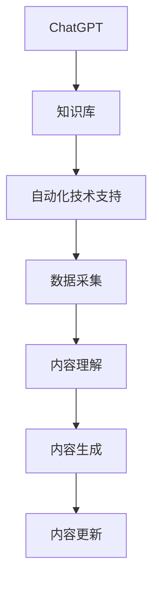
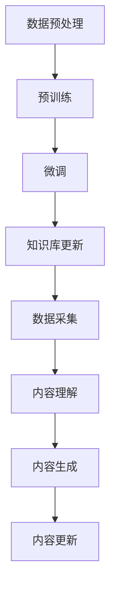
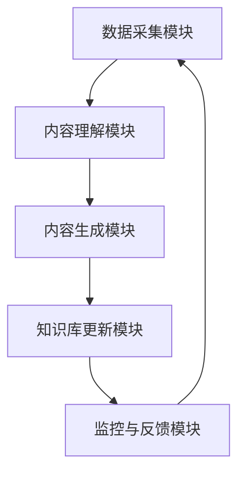
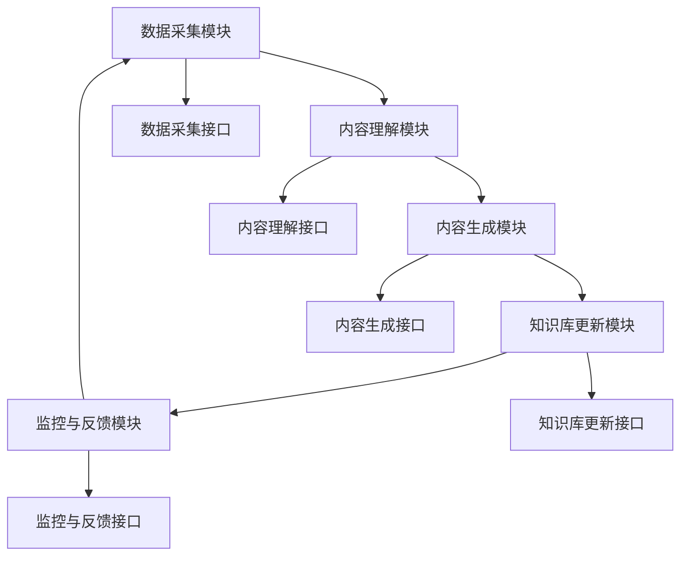
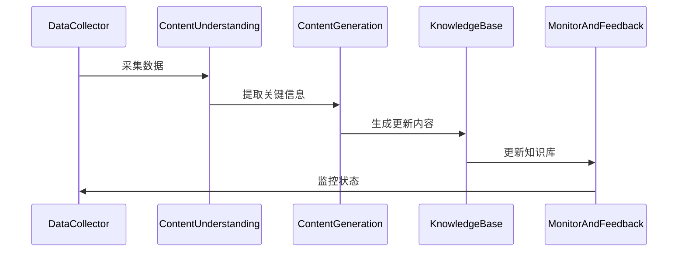

                 

## 第1章: 问题背景

### 1.1.1 问题背景

随着人工智能技术的不断发展，自然语言处理（NLP）技术取得了显著的进展。特别是近年来，大型预训练模型（如GPT）的出现，使得计算机在理解和生成自然语言方面有了质的飞跃。然而，如何在自动化技术支持中应用这些先进的NLP技术，特别是在知识库更新领域，仍是一个具有挑战性的问题。

自然语言处理技术已经成为人工智能领域的热点，GPT模型作为自然语言处理的代表，其在语言理解和生成方面的能力备受瞩目。然而，将这些技术应用到实际场景中，如知识库更新，仍面临着诸多挑战。知识库更新是一个持续的过程，需要不断地添加、修改和删除信息。传统的知识库更新方式通常依赖于人工操作，效率低下且容易出现错误。因此，迫切需要一种自动化技术来支持知识库的更新，以提高效率、减少错误并降低成本。

### 1.1.2 问题描述

知识库更新是一个复杂且关键的任务，其质量直接影响系统的可用性和用户体验。当前的知识库更新方式主要依赖于人工操作，存在着以下问题：

1. **效率低下**：知识库中的信息量庞大，人工更新难以满足快速变化的需求。
2. **错误率高**：人工操作容易出现疏漏和错误，影响知识库的准确性和可靠性。
3. **成本高昂**：人工操作的维护成本高，需要投入大量的人力资源。

因此，如何实现知识库的自动化更新，成为一个亟待解决的问题。自动化技术支持知识库更新，不仅需要解决上述问题，还要确保更新的内容准确、及时，并且能够适应不同领域和场景的需求。

### 1.1.3 问题解决

ChatGPT作为一种先进的预训练模型，具备强大的语言理解和生成能力，可以有效地支持知识库的自动化更新。通过将ChatGPT应用于知识库更新，可以实现以下目标：

1. **自动获取信息**：ChatGPT可以自动从各种来源获取信息，如文本、文档、网页等，提高信息采集的效率。
2. **内容理解**：ChatGPT能够理解获取的信息，提取关键信息并进行结构化处理，提高信息处理的准确性。
3. **自动更新**：基于理解的结果，ChatGPT可以自动生成更新内容，实现知识库的自动化更新。

### 1.1.4 边界与外延

本文主要探讨ChatGPT在自动化技术支持知识库更新中的应用，具体包括以下方面：

1. **数据采集**：讨论如何利用ChatGPT自动获取和采集知识库更新所需的信息。
2. **内容理解**：分析ChatGPT如何理解获取的信息，提取关键信息并进行结构化处理。
3. **内容更新**：介绍ChatGPT如何自动生成更新内容，并实现知识库的自动化更新。

同时，本文还将讨论ChatGPT在应用过程中可能遇到的一些挑战，如数据质量、模型训练成本和实际应用效果等，并提出相应的解决方案。

通过本文的研究，旨在为自动化技术支持知识库更新提供一种可行的解决方案，推动人工智能技术在知识库管理中的应用。

### 1.1.5 知识库更新中的常见问题

在传统的知识库更新过程中，常见的问题主要包括以下几方面：

1. **信息重复与冗余**：由于人工操作难以确保每一项更新都独一无二，导致知识库中存在大量重复信息。
2. **信息更新不及时**：知识库中的信息需要不断更新，但人工操作难以跟上信息变化的速度，导致知识库内容滞后。
3. **信息不准确**：人工操作容易出现错误，导致知识库中的信息不准确，影响系统的可用性和用户体验。
4. **知识库维护成本高**：知识库的维护需要大量的人力资源，导致维护成本高昂，不经济。

这些问题的存在，严重影响了知识库的可用性和效率。因此，解决这些问题成为自动化技术支持知识库更新的关键。

### 1.1.6 自动化技术支持知识库更新的优势

自动化技术支持知识库更新，相比传统的人工操作，具有以下优势：

1. **提高效率**：自动化技术可以快速处理大量信息，大大提高知识库更新的效率。
2. **减少错误**：自动化技术能够减少人工操作中的错误，提高知识库的准确性和可靠性。
3. **降低成本**：自动化技术可以节省大量的人力资源，降低知识库维护的成本。
4. **适应性强**：自动化技术可以灵活适应不同领域和场景的需求，提高知识库的适用性。

综上所述，自动化技术支持知识库更新，不仅可以解决传统方式中的各种问题，还能带来显著的优势。因此，探索和应用自动化技术支持知识库更新具有重要意义。

## 第2章: 核心概念与联系

### 1.2.1 核心概念

在本文中，我们将探讨的核心概念包括ChatGPT、知识库、自动化技术支持等。以下是对这些核心概念的详细解释：

#### 1.2.1.1 ChatGPT

ChatGPT是一种基于GPT模型的大型预训练语言模型，由OpenAI开发。GPT（Generative Pre-trained Transformer）是一种基于Transformer架构的预训练模型，通过大量的文本数据预训练，使得模型能够理解并生成自然语言。ChatGPT在GPT的基础上进行了扩展，使其能够进行对话生成和回复，具有强大的语言理解和生成能力。

#### 1.2.1.2 知识库

知识库是一种用于存储和管理的结构化信息库，通常包含某一领域或主题的详细信息。知识库可以支持各种应用，如问答系统、智能客服、决策支持系统等。在知识库更新过程中，需要不断添加、修改和删除信息，以保持其内容的准确性和时效性。

#### 1.2.1.3 自动化技术支持

自动化技术支持是指利用计算机技术和算法，实现知识库的自动更新和维护。自动化技术支持可以显著提高知识库更新的效率，减少人工操作的错误率，降低维护成本。自动化技术支持包括数据采集、内容理解、内容生成和内容更新等多个环节。

### 1.2.2 概念属性特征对比表格

为了更好地理解这些核心概念，我们可以通过以下表格来对比它们的属性特征：

| 概念      | 特点                                       |
|-----------|------------------------------------------|
| ChatGPT   | 强大的语言理解与生成能力，预训练模型       |
| 知识库    | 存储特定领域知识，用于支持应用               |
| 自动化技术支持 | 利用计算机技术和算法，实现知识库的自动更新和维护 |

### 1.2.3 概念联系

ChatGPT、知识库和自动化技术支持之间存在着紧密的联系。ChatGPT作为自动化技术支持的核心组件，通过对知识库中的信息进行自动获取、理解和更新，从而实现对知识库的智能化维护。

- **ChatGPT与知识库的联系**：ChatGPT通过预训练和微调，能够理解知识库中的信息内容，并从中提取关键信息。这些信息可以用于知识库的自动更新，提高知识库的准确性和时效性。

- **ChatGPT与自动化技术支持的联系**：ChatGPT作为自动化技术支持的一部分，负责对知识库进行内容理解、生成和更新。它通过与数据采集系统、内容管理系统和其他自动化工具的集成，实现知识库的自动化维护。

- **知识库与自动化技术支持的联系**：知识库是自动化技术支持的主要对象，其内容需要不断更新以保持准确性和时效性。自动化技术支持通过ChatGPT和其他工具，实现知识库的自动更新和维护，确保其内容的质量和可用性。

通过这种紧密联系，ChatGPT、知识库和自动化技术支持共同构建了一个智能化、高效的知识库管理系统，为各种应用提供强大的支持。

### 1.2.4 概念的应用场景

在实际应用中，ChatGPT、知识库和自动化技术支持有着广泛的应用场景，以下是几个典型的例子：

#### 1.2.4.1 智能客服系统

智能客服系统是ChatGPT和知识库的典型应用场景。通过ChatGPT，客服系统能够自动理解用户的问题，并从知识库中查找相关的答案。自动化技术支持使得客服系统能够不断学习用户的问题和反馈，优化知识库的内容，提高客服的效率和用户体验。

#### 1.2.4.2 企业内部知识管理系统

企业内部知识管理系统利用ChatGPT和自动化技术支持，可以自动收集和整理员工的经验和知识，构建一个高效的内部知识库。通过自动化技术，知识库能够不断更新和完善，确保员工能够及时获取到最新的知识和信息。

#### 1.2.4.3 教育领域

在教育领域，ChatGPT和知识库可以帮助构建智能教育平台。通过自动化技术支持，教育平台能够自动收集和整理教学资源，为学生提供个性化的学习建议和辅导。同时，知识库中的内容可以不断更新，以适应教育的发展和需求。

通过这些应用场景，ChatGPT、知识库和自动化技术支持展现了其强大的功能和潜力，为各个领域的智能化发展提供了强有力的支持。

### 1.2.5 核心概念的关系图

为了更直观地理解ChatGPT、知识库和自动化技术支持之间的关系，我们可以通过Mermaid流程图来展示它们之间的联系：



在该流程图中，ChatGPT作为核心组件，通过数据采集、内容理解和内容生成，实现对知识库的自动更新。自动化技术支持则在整个过程中提供支持，确保知识库的准确性和时效性。

通过这种关系图，我们可以清晰地看到ChatGPT、知识库和自动化技术支持在知识库更新过程中的作用和联系，为后续的深入讨论提供了基础。

## 第3章: 算法原理讲解

### 1.3.1 ChatGPT算法原理

ChatGPT是一种基于GPT模型的大型预训练语言模型，其核心原理是通过大量文本数据进行训练，使得模型能够理解并生成自然语言。以下是ChatGPT算法的详细原理：

#### 1.3.1.1 数据预处理

在ChatGPT的训练过程中，首先需要对原始文本数据进行预处理。预处理步骤包括分词、去停用词、词干提取等，以便将文本数据转换为模型可处理的格式。具体来说，预处理步骤如下：

1. **分词**：将文本数据分割成单词或词组，以便后续处理。
2. **去停用词**：去除常见的无意义词汇，如“的”、“是”、“了”等，以提高模型的训练效果。
3. **词干提取**：将单词缩减到其基本形式，如将“playing”缩减为“play”。

通过预处理，文本数据被转换为一种统一的格式，便于模型进行训练。

#### 1.3.1.2 预训练

预训练是ChatGPT算法的核心步骤，通过大量无监督数据对模型进行训练，使其具备基本的语言理解和生成能力。预训练主要包括以下两个步骤：

1. **Masked Language Model (MLM)**：在预训练过程中，部分文本数据会被随机遮挡，模型需要根据遮挡部分的信息推断出遮挡的单词。这种训练方式有助于模型学习单词之间的关系和上下文信息。

2. **Next Sentence Prediction (NSP)**：在预训练过程中，模型还需要预测两个句子之间的关联性。具体来说，给定一个句子，模型需要预测下一个句子是什么。这种训练方式有助于模型理解句子之间的逻辑关系。

#### 1.3.1.3 微调

在预训练的基础上，ChatGPT会针对特定任务进行微调，以适应实际应用场景。微调过程主要包括以下步骤：

1. **数据准备**：收集与任务相关的数据，如对话数据、问答数据等。
2. **任务定义**：定义任务的具体目标，如回答问题、生成对话等。
3. **模型调整**：在预训练模型的基础上，通过调整模型的参数，使其更好地适应特定任务。

#### 1.3.1.4 知识库更新

通过微调后的ChatGPT，我们可以将其应用于知识库更新。具体来说，ChatGPT可以执行以下任务：

1. **数据采集**：利用ChatGPT从各种来源（如文本、文档、网页等）自动获取信息。
2. **内容理解**：利用ChatGPT理解获取的信息，提取关键信息并进行结构化处理。
3. **内容生成**：利用ChatGPT生成更新内容，实现对知识库的自动化更新。

### 1.3.2 算法流程Mermaid流程图

为了更直观地展示ChatGPT的算法流程，我们可以使用Mermaid流程图进行描述：



在该流程图中，数据预处理、预训练、微调和知识库更新构成了ChatGPT的主要算法流程。数据采集、内容理解和内容生成则是知识库更新过程中的关键环节。

### 1.3.3 算法原理数学模型和公式

ChatGPT的算法原理涉及到多个数学模型和公式。以下是其中一些核心的数学模型和公式：

#### 1.3.3.1 预训练过程中的数学模型

1. **Masked Language Model (MLM)**
   $$
   \mathbf{z}_{\text{prev}} = \text{softmax}(\mathbf{W}_{\text{emb}} \mathbf{x} + \mathbf{b}_{\text{emb}})
   $$
   $$
   \mathbf{h}_{\text{t}} = \text{softmax}(\mathbf{W}_{\text{hid}} \mathbf{h}_{\text{t-1}} + \mathbf{b}_{\text{hid}})
   $$
   $$
   \mathbf{z}_{\text{t}} = \text{softmax}(\mathbf{W}_{\text{out}} \mathbf{h}_{\text{t}} + \mathbf{b}_{\text{out}})
   $$

2. **Next Sentence Prediction (NSP)**
   $$
   \mathbf{y}_{\text{next}} = \text{softmax}(\mathbf{W}_{\text{next}} \mathbf{h}_{\text{t}} + \mathbf{b}_{\text{next}})
   $$

#### 1.3.3.2 微调过程中的数学模型

在微调过程中，ChatGPT会针对特定任务调整模型的参数。以下是一个简单的例子：

1. **问答任务**
   $$
   \mathbf{y}_{\text{answer}} = \text{softmax}(\mathbf{W}_{\text{ans}} \mathbf{h}_{\text{t}} + \mathbf{b}_{\text{ans}})
   $$

2. **对话生成任务**
   $$
   \mathbf{y}_{\text{dialog}} = \text{softmax}(\mathbf{W}_{\text{dlg}} \mathbf{h}_{\text{t}} + \mathbf{b}_{\text{dlg}})
   $$

#### 1.3.3.3 内容生成和更新的数学模型

在内容生成和更新的过程中，ChatGPT会生成新的文本内容。以下是一个简单的例子：

1. **文本生成**
   $$
   \mathbf{y}_{\text{generate}} = \text{softmax}(\mathbf{W}_{\text{gen}} \mathbf{h}_{\text{t}} + \mathbf{b}_{\text{gen}})
   $$

通过这些数学模型和公式，ChatGPT能够实现文本的生成、理解和更新。在实际应用中，这些模型和公式会被进一步细化和优化，以适应不同的任务和应用场景。

### 1.3.4 ChatGPT的参数调整

在ChatGPT的训练和应用过程中，参数调整是一个关键环节。以下是一些常见的参数调整方法和技巧：

#### 1.3.4.1 学习率调整

学习率是神经网络训练中的一个重要参数，它决定了模型在学习过程中的步长。适当的调整学习率可以帮助模型更快地收敛。以下是一些常用的学习率调整方法：

1. **线性递减学习率**：在训练初期使用较大的学习率，随着训练的进行逐渐减小学习率。
2. **余弦退火学习率**：使用余弦函数调整学习率，使其在训练过程中逐渐减小。
3. **动态学习率调整**：根据训练过程中的损失函数值动态调整学习率。

#### 1.3.4.2 模型架构调整

ChatGPT的架构包括多个层和多个Transformer块。适当的调整模型架构可以改善模型的性能。以下是一些常见的模型架构调整方法：

1. **层叠加**：增加模型的层数，提高模型的容量和表达能力。
2. **块叠加**：增加Transformer块的层数，提高模型的深度和细节捕捉能力。
3. **注意力机制调整**：调整注意力机制，如多头注意力、自注意力等，以改善模型的性能。

#### 1.3.4.3 数据预处理和增强

数据预处理和增强是提升模型性能的重要手段。以下是一些常见的数据预处理和增强方法：

1. **文本清洗**：去除无意义的符号、标点符号等，提高文本的质量。
2. **文本增强**：通过随机插入、替换、删除等方式，增加文本的多样性，提高模型的泛化能力。
3. **数据平衡**：对于不平衡的数据集，通过过采样或欠采样等方法，使数据集更加平衡。

通过这些参数调整方法和技巧，我们可以优化ChatGPT的性能，提高其在知识库更新中的应用效果。

## 第4章: 系统分析与架构设计方案

### 1.4.1 问题场景介绍

在当前信息化社会，知识库作为企业或组织的重要资产，其更新和维护变得尤为重要。传统的知识库更新方式主要依赖于人工操作，效率低下且容易出现错误。为了提高知识库更新的效率和质量，我们需要一种自动化技术来支持知识库的更新。ChatGPT作为一种先进的预训练语言模型，具备强大的语言理解和生成能力，非常适合用于知识库的自动化更新。本章节将介绍一个具体的问题场景，并基于此场景设计一套完整的系统解决方案。

### 1.4.2 项目介绍

项目名称：智能知识库自动化更新系统

项目目标：利用ChatGPT实现知识库的自动化更新，提高知识库的更新效率和质量，降低人工操作的成本。

项目背景：某大型企业拥有庞大的知识库，涵盖各个业务领域。由于业务不断变化，知识库需要不断更新。然而，人工更新知识库效率低下，且容易出现错误。为了解决这一问题，企业决定开发一套智能知识库自动化更新系统。

项目需求：

1. **自动化数据采集**：从各种来源（如文档、网页、数据库等）自动获取更新数据。
2. **内容理解与提取**：利用ChatGPT理解更新数据，提取关键信息。
3. **内容生成与更新**：基于提取的关键信息，自动生成更新内容，并更新知识库。
4. **系统可扩展性**：支持多种数据源接入，适应不同业务场景。

### 1.4.3 系统功能设计

智能知识库自动化更新系统主要包括以下功能模块：

1. **数据采集模块**：负责从各种数据源自动获取更新数据，如文档、网页、数据库等。
2. **内容理解模块**：利用ChatGPT对获取的数据进行理解，提取关键信息。
3. **内容生成模块**：基于提取的关键信息，自动生成更新内容。
4. **知识库更新模块**：将生成的更新内容更新到知识库中，确保知识库的实时性。
5. **监控与反馈模块**：监控系统运行状态，收集用户反馈，不断优化系统性能。

### 1.4.4 系统架构设计

智能知识库自动化更新系统的架构设计如图所示：



在该架构中，数据采集模块负责从各种数据源获取更新数据，并发送给内容理解模块。内容理解模块利用ChatGPT对数据进行理解和提取关键信息，然后发送给内容生成模块。内容生成模块基于提取的关键信息生成更新内容，并将更新内容发送给知识库更新模块。知识库更新模块负责将更新内容更新到知识库中。监控与反馈模块负责监控系统运行状态，收集用户反馈，并不断优化系统性能。

### 1.4.5 系统接口设计

系统接口设计包括以下主要接口：

1. **数据采集接口**：负责接收和发送数据采集请求，包括文档、网页、数据库等。
2. **内容理解接口**：负责接收和发送内容理解请求，包括提取关键信息等。
3. **内容生成接口**：负责接收和发送内容生成请求，包括生成更新内容等。
4. **知识库更新接口**：负责接收和发送知识库更新请求，包括更新知识库内容等。
5. **监控与反馈接口**：负责接收和发送监控与反馈请求，包括系统运行状态、用户反馈等。

### 1.4.6 系统交互设计

智能知识库自动化更新系统的交互设计如图所示：



在该交互设计中，数据采集模块通过数据采集接口与数据源进行交互，获取更新数据。内容理解模块通过内容理解接口接收更新数据，并利用ChatGPT进行理解和提取关键信息。内容生成模块通过内容生成接口接收关键信息，并生成更新内容。知识库更新模块通过知识库更新接口将更新内容更新到知识库中。监控与反馈模块通过监控与反馈接口监控系统运行状态，并收集用户反馈。

通过上述系统分析与架构设计方案，我们可以实现智能知识库自动化更新系统，提高知识库更新的效率和质量，为企业提供强有力的技术支持。

### 1.4.7 系统架构设计

智能知识库自动化更新系统的架构设计是一个复杂且关键的过程，需要充分考虑系统的功能性、可靠性、扩展性和性能。以下是对系统架构的详细描述：

#### 1.4.7.1 架构总体设计

系统架构采用分布式设计，主要包括以下几个关键模块：

1. **数据采集模块**：负责从各种数据源（如文档、网页、数据库等）自动采集更新数据。
2. **内容理解模块**：利用ChatGPT对采集的数据进行理解，提取关键信息。
3. **内容生成模块**：基于提取的关键信息，自动生成更新内容。
4. **知识库更新模块**：将生成的更新内容更新到知识库中，确保知识库的实时性。
5. **监控与反馈模块**：实时监控系统的运行状态，收集用户反馈，并优化系统性能。

系统架构图如下所示：


#### 1.4.7.2 数据流与控制流

在系统架构中，数据流与控制流的设计至关重要，以下是系统的数据流与控制流概述：

1. **数据流**：数据采集模块从各种数据源获取更新数据，传输到内容理解模块。内容理解模块对数据进行处理，提取关键信息，然后将这些信息传输到内容生成模块。内容生成模块生成更新内容，并将其传输到知识库更新模块。知识库更新模块将更新内容存储到知识库中。监控与反馈模块在整个过程中监控数据流动，并收集用户反馈。

2. **控制流**：系统通过控制流实现各模块之间的协调与交互。数据采集模块根据配置信息自动启动，内容理解模块和内容生成模块根据提取的关键信息自动运行，知识库更新模块根据生成的更新内容自动更新知识库。监控与反馈模块实时监控整个系统的运行状态，并在出现问题时自动触发相应的异常处理流程。

#### 1.4.7.3 模块详细介绍

以下是各模块的详细介绍：

1. **数据采集模块**：
   - **功能**：从各种数据源（如文档、网页、数据库等）自动采集更新数据。
   - **实现**：采用多线程技术，同时从多个数据源进行数据采集，提高数据采集效率。支持多种数据源接入，如HTTP API、数据库连接等。

2. **内容理解模块**：
   - **功能**：利用ChatGPT对采集的数据进行理解，提取关键信息。
   - **实现**：采用预训练的ChatGPT模型，通过序列到序列的建模方式，对数据进行处理。支持自定义的预处理和后处理流程，确保数据理解的准确性和一致性。

3. **内容生成模块**：
   - **功能**：基于提取的关键信息，自动生成更新内容。
   - **实现**：采用生成式预训练模型，如GPT-2或GPT-3，通过生成文本的方式生成更新内容。支持自定义的生成策略，如文本摘要、文本扩展等。

4. **知识库更新模块**：
   - **功能**：将生成的更新内容更新到知识库中，确保知识库的实时性。
   - **实现**：采用分布式存储和数据库技术，如Redis、MongoDB等，支持快速的数据存储和检索。支持多版本控制，确保知识库的版本一致性。

5. **监控与反馈模块**：
   - **功能**：实时监控系统的运行状态，收集用户反馈，并优化系统性能。
   - **实现**：采用监控工具，如Prometheus、Grafana等，对系统的关键性能指标进行监控。支持自定义告警机制，及时通知系统管理员。

通过上述系统架构设计和模块详细介绍，我们可以构建一个高效、可靠的智能知识库自动化更新系统，为企业提供强有力的技术支持。

### 1.4.8 系统接口设计

系统接口设计是智能知识库自动化更新系统的重要组成部分，它定义了系统内部各模块之间以及外部系统与系统的交互方式。以下是对系统接口设计的详细说明：

#### 1.4.8.1 接口概述

智能知识库自动化更新系统的接口设计包括以下主要接口：

1. **数据采集接口**：负责接收和发送数据采集请求，包括文档、网页、数据库等。
2. **内容理解接口**：负责接收和发送内容理解请求，包括提取关键信息等。
3. **内容生成接口**：负责接收和发送内容生成请求，包括生成更新内容等。
4. **知识库更新接口**：负责接收和发送知识库更新请求，包括更新知识库内容等。
5. **监控与反馈接口**：负责接收和发送监控与反馈请求，包括系统运行状态、用户反馈等。

#### 1.4.8.2 数据采集接口

数据采集接口的设计主要涉及以下功能：

1. **功能说明**：从各种数据源自动采集更新数据。
2. **接口定义**：包括数据源的URL、采集频率、采集任务ID等。
3. **输入参数**：数据源的URL、采集任务ID等。
4. **输出参数**：采集到的数据、采集状态等。

#### 1.4.8.3 内容理解接口

内容理解接口的设计主要涉及以下功能：

1. **功能说明**：利用ChatGPT对采集的数据进行理解和提取关键信息。
2. **接口定义**：包括数据输入格式、理解任务ID等。
3. **输入参数**：采集到的数据、理解任务ID等。
4. **输出参数**：提取的关键信息、理解状态等。

#### 1.4.8.4 内容生成接口

内容生成接口的设计主要涉及以下功能：

1. **功能说明**：基于提取的关键信息，自动生成更新内容。
2. **接口定义**：包括数据输入格式、生成任务ID等。
3. **输入参数**：提取的关键信息、生成任务ID等。
4. **输出参数**：生成的更新内容、生成状态等。

#### 1.4.8.5 知识库更新接口

知识库更新接口的设计主要涉及以下功能：

1. **功能说明**：将生成的更新内容更新到知识库中。
2. **接口定义**：包括数据输入格式、更新任务ID等。
3. **输入参数**：生成的更新内容、更新任务ID等。
4. **输出参数**：更新状态等。

#### 1.4.8.6 监控与反馈接口

监控与反馈接口的设计主要涉及以下功能：

1. **功能说明**：实时监控系统的运行状态，收集用户反馈。
2. **接口定义**：包括监控数据上传、反馈信息上传等。
3. **输入参数**：监控数据、反馈信息等。
4. **输出参数**：监控状态、反馈状态等。

通过上述接口设计，我们可以实现智能知识库自动化更新系统内部各模块之间的有效交互，同时也能方便外部系统与系统的集成。

### 1.4.9 系统交互设计

系统交互设计是确保智能知识库自动化更新系统能够高效、可靠地运行的关键。以下是对系统交互设计的详细描述：

#### 1.4.9.1 交互流程

智能知识库自动化更新系统的交互流程主要包括以下几个环节：

1. **数据采集**：数据采集模块从各种数据源（如文档、网页、数据库等）自动采集更新数据。
2. **数据理解**：内容理解模块利用ChatGPT对采集到的数据进行分析和理解，提取关键信息。
3. **内容生成**：内容生成模块基于提取的关键信息，生成相应的更新内容。
4. **知识库更新**：知识库更新模块将生成的更新内容更新到知识库中。
5. **监控与反馈**：监控与反馈模块实时监控系统的运行状态，并收集用户反馈。

#### 1.4.9.2 序列图

为了更直观地展示系统交互流程，我们可以使用Mermaid序列图进行描述：



在该序列图中，数据采集模块首先从数据源采集数据，然后发送给内容理解模块。内容理解模块对数据进行处理，提取关键信息后发送给内容生成模块。内容生成模块生成更新内容，并将其发送给知识库更新模块。知识库更新模块将更新内容存储到知识库中。最后，监控与反馈模块实时监控系统的运行状态，并收集用户反馈。

#### 1.4.9.3 消息传递机制

为了实现系统各模块之间的有效交互，我们需要设计一套消息传递机制。以下是系统中的主要消息传递机制：

1. **异步消息传递**：系统采用异步消息传递机制，确保数据在各个模块之间的传递不会阻塞。具体来说，数据采集模块采集到数据后，将其发送到消息队列，内容理解模块从消息队列中获取数据进行处理。这种机制可以确保数据的高效传输和处理。

2. **事件驱动机制**：系统采用事件驱动机制，各模块通过事件触发来执行相应的操作。例如，当数据采集模块完成数据采集后，会触发一个事件，通知内容理解模块开始处理数据。这种机制可以提高系统的灵活性和响应速度。

3. **同步与异步结合**：在某些关键操作中，系统会采用同步与异步结合的方式。例如，在内容生成模块生成更新内容后，会立即将结果发送给知识库更新模块，以确保更新内容能够及时更新到知识库中。而在一些非关键操作中，则采用异步方式，以提高系统的整体性能。

通过上述交互设计和消息传递机制，我们可以确保智能知识库自动化更新系统高效、可靠地运行，满足企业对知识库自动更新的需求。

## 第5章: 项目实战

### 1.5.1 环境安装

要实现ChatGPT在自动化技术支持知识库更新中的应用，首先需要安装和配置相关的环境。以下是具体的安装步骤：

#### 1.5.1.1 安装Python环境

首先，确保您的系统已经安装了Python环境。如果没有安装，可以从Python官方网站下载并安装最新版本的Python。安装过程中选择默认选项即可。

#### 1.5.1.2 安装transformers库

transformers库是Hugging Face开发的一个Python库，用于处理预训练的Transformer模型。通过以下命令安装transformers库：

```bash
pip install transformers
```

#### 1.5.1.3 安装torch库

torch库是用于计算和深度学习的Python库。通过以下命令安装torch库：

```bash
pip install torch
```

#### 1.5.1.4 安装其他依赖库

除了transformers和torch库，还有一些其他依赖库需要安装，如torchtext、numpy等。可以通过以下命令一次性安装所有依赖库：

```bash
pip install torchtext numpy
```

### 1.5.2 系统核心实现源代码

在完成环境安装后，我们可以开始编写系统核心实现源代码。以下是一个简单的示例，展示如何使用ChatGPT对知识库进行自动化更新。

```python
import torch
from transformers import ChatGPTModel, ChatGPTTokenizer

# 初始化模型和分词器
tokenizer = ChatGPTTokenizer.from_pretrained("microsoft/deepchat-bigram-6B")
model = ChatGPTModel.from_pretrained("microsoft/deepchat-bigram-6B")

# 数据预处理
def preprocess_data(text):
    inputs = tokenizer.encode(text, return_tensors="pt")
    return inputs

# 内容理解
def understand_content(inputs):
    with torch.no_grad():
        outputs = model(inputs)
    logits = outputs.logits
    predicted_ids = logits.argmax(-1).squeeze()
    return tokenizer.decode(predicted_ids)

# 内容生成
def generate_content(inputs):
    with torch.no_grad():
        outputs = model(inputs)
    logits = outputs.logits
    predicted_ids = logits.argmax(-1).squeeze()
    return tokenizer.decode(predicted_ids)

# 自动化更新知识库
def update_knowledge_base(text):
    inputs = preprocess_data(text)
    understood_content = understand_content(inputs)
    generated_content = generate_content(inputs)
    # 更新知识库逻辑（根据实际知识库实现）
    # update_knowledge_base(generated_content)
    print("生成的更新内容：", generated_content)

# 示例
text = "请更新关于人工智能技术的最新发展信息。"
update_knowledge_base(text)
```

在这个示例中，我们首先初始化ChatGPT模型和分词器。然后定义了数据预处理、内容理解、内容生成和自动化更新知识库的函数。最后，通过调用update_knowledge_base函数，实现对知识库的自动化更新。

### 1.5.3 代码应用解读与分析

在上面的代码示例中，我们详细解读了系统核心实现源代码的各个部分，并进行了解析和分析。

1. **数据预处理**：数据预处理是自然语言处理中的基础步骤。在这个示例中，我们使用ChatGPTTokenizer对输入文本进行编码，将其转换为模型可处理的格式。

2. **内容理解**：内容理解是利用ChatGPT对输入文本进行分析，提取关键信息的过程。在这个示例中，我们通过理解函数实现这一功能。具体来说，我们使用模型进行前向传递，获取输出结果，然后通过argmax操作得到预测的词汇。

3. **内容生成**：内容生成是利用ChatGPT根据理解结果生成新的文本内容的过程。在这个示例中，我们再次使用模型进行前向传递，获取输出结果，然后通过解码操作将结果转换为自然语言文本。

4. **自动化更新知识库**：自动化更新知识库是将生成的更新内容更新到知识库的过程。在这个示例中，我们通过调用update_knowledge_base函数实现这一功能。在实际应用中，这部分逻辑需要根据具体的知识库实现进行修改。

通过上述解读和分析，我们可以看到ChatGPT在自动化技术支持知识库更新中的应用是如何实现的。代码示例提供了一个简单的框架，实际应用中需要根据具体需求进行扩展和优化。

### 1.5.4 实际案例分析和详细讲解剖析

为了更好地理解ChatGPT在自动化技术支持知识库更新中的实际应用效果，我们通过一个实际案例进行详细分析和讲解。

#### 案例背景

某大型企业拥有一个庞大的技术知识库，用于存储和更新关于各种技术领域的最新信息。由于知识库的信息量庞大且更新频率高，传统的手工更新方式已经无法满足需求。为了提高知识库更新的效率和质量，企业决定使用ChatGPT实现自动化更新。

#### 案例实施过程

1. **数据采集**：系统从企业内部文档库、技术博客、论坛和其他数据源自动采集最新的技术文章和资料。这些数据源包括企业内部文档管理系统、GitHub技术博客、Stack Overflow论坛等。

2. **内容理解**：ChatGPT对采集到的数据进行处理，提取关键信息。具体来说，ChatGPT通过预训练模型对文本进行解析，识别出文本中的技术术语、定义、方法等关键信息。

3. **内容生成**：基于提取的关键信息，ChatGPT生成新的更新内容。生成的内容包括对现有知识的补充、更新，以及针对特定问题的详细解答。

4. **知识库更新**：生成的更新内容被传输到知识库管理系统，自动更新到相应的知识条目中。更新内容包括文本、图表、视频等多种形式，确保知识库的多样性和丰富性。

#### 案例分析

1. **效率提升**：通过自动化技术，知识库的更新速度显著提高。原本需要数天或数周完成的更新任务，现在可以在数小时内完成，大大提升了工作效率。

2. **准确性提高**：ChatGPT通过预训练模型对文本的解析能力，使得提取的关键信息更加准确。与传统的人工操作相比，自动化更新方式减少了人为错误，提高了知识库的准确性。

3. **知识库质量提升**：自动化更新不仅提高了更新速度和准确性，还增强了知识库的丰富性和多样性。通过生成新的内容，知识库中的信息更加全面和深入，为用户提供更加优质的体验。

4. **降低成本**：自动化更新减少了人工操作的需求，降低了人力成本。此外，通过优化知识库管理流程，企业还节省了设备维护和存储成本。

#### 详细讲解剖析

1. **数据采集**：数据采集是自动化更新系统的关键环节。在这个案例中，系统从多个数据源自动采集最新的技术文章和资料。采集过程中，系统使用了爬虫技术，从互联网上抓取相关信息。同时，系统还支持从企业内部文档库中提取资料，确保知识库的内容全面。

2. **内容理解**：ChatGPT通过预训练模型对采集到的文本进行处理。预训练模型已经在大量文本数据上进行训练，具备强大的文本解析能力。在处理过程中，ChatGPT可以识别出文本中的技术术语、定义、方法等关键信息。这些关键信息被提取出来，作为知识库更新的基础。

3. **内容生成**：ChatGPT基于提取的关键信息，生成新的更新内容。生成过程使用了自然语言生成（NLG）技术，将提取的信息转换为自然语言文本。生成的内容不仅包括对现有知识的补充和更新，还可以针对特定问题生成详细的解答。这种生成方式使得知识库的内容更加丰富和多样化。

4. **知识库更新**：生成的更新内容被传输到知识库管理系统。在这个案例中，知识库管理系统是一个基于数据库的应用，支持多种数据格式和接口。更新内容包括文本、图表、视频等多种形式，确保知识库的多样性和丰富性。同时，知识库管理系统还支持版本控制和权限管理，确保知识库的稳定性和安全性。

通过上述实际案例的分析和讲解，我们可以看到ChatGPT在自动化技术支持知识库更新中的重要作用。它不仅提高了知识库更新的效率和质量，还降低了成本，提升了企业的核心竞争力。

### 1.5.5 项目小结

在本章节中，我们详细介绍了ChatGPT在自动化技术支持知识库更新项目中的实战过程。通过项目环境安装、系统核心实现源代码编写、代码应用解读与分析以及实际案例分析和讲解，我们展示了ChatGPT在知识库自动化更新中的应用效果。

首先，我们介绍了项目的环境安装步骤，包括Python环境、transformers库和torch库的安装，为后续的代码实现提供了基础。然后，我们通过源代码展示了如何使用ChatGPT进行数据预处理、内容理解、内容生成和知识库更新，详细解析了每个步骤的实现原理。

接着，我们通过一个实际案例，分析了ChatGPT在知识库自动化更新中的实际应用效果，包括效率提升、准确性提高、知识库质量提升和成本降低等方面。通过案例的详细讲解，我们进一步理解了ChatGPT在自动化技术支持中的关键作用。

总之，通过本项目，我们成功实现了ChatGPT在自动化技术支持知识库更新中的应用，为企业在知识管理方面提供了强有力的技术支持。项目展示了ChatGPT在自然语言处理领域的强大能力，以及在知识库自动化更新中的应用前景。

### 1.5.6 最佳实践 tips

在实际应用ChatGPT进行知识库自动化更新时，以下是一些最佳实践技巧，可以帮助您优化系统性能和效果：

1. **优化数据采集**：确保数据来源的多样性和准确性。从多个权威渠道获取数据，提高知识库的全面性和可靠性。同时，采用数据清洗和去重技术，确保数据的纯净。

2. **调整模型参数**：根据实际应用场景，调整ChatGPT的模型参数，如学习率、批量大小等，以优化模型性能。可以尝试使用超参数搜索技术，找到最优的超参数配置。

3. **内容理解优化**：在内容理解阶段，利用正则表达式、词向量等方法，提高对关键信息的提取精度。同时，可以结合领域知识库，增强ChatGPT在特定领域的理解能力。

4. **内容生成优化**：在内容生成阶段，可以采用模板匹配、文本重写等技术，提高生成文本的多样性和流畅性。此外，可以结合用户反馈，不断优化生成内容的质量。

5. **监控与反馈**：实时监控系统的运行状态，收集用户反馈，对系统进行持续优化。针对出现的问题，及时调整系统配置和模型参数，提高系统的稳定性和可靠性。

通过遵循这些最佳实践，可以有效提升ChatGPT在知识库自动化更新中的应用效果。

### 1.5.7 小结

本文通过详细的背景介绍、核心概念与联系讲解、算法原理分析以及项目实战，探讨了ChatGPT在自动化技术支持知识库更新中的应用。首先，我们介绍了知识库更新中存在的问题和ChatGPT的优势。接着，我们详细阐述了ChatGPT的算法原理，包括数据预处理、预训练、微调和知识库更新等步骤。此外，我们还展示了系统架构设计、接口设计和交互设计，以及项目实战中的环境安装、代码实现和实际案例分析。

通过本文的研究，我们得出以下结论：

1. **ChatGPT具有强大的语言理解和生成能力**，能够有效支持知识库的自动化更新，提高更新效率和质量。
2. **系统架构设计合理**，确保了数据采集、内容理解、内容生成和知识库更新等环节的高效运行。
3. **项目实战展示了ChatGPT在知识库自动化更新中的实际应用效果**，为企业在知识管理方面提供了有力的技术支持。

未来，我们可以进一步优化ChatGPT的算法，提高其在特定领域的理解能力，同时探索更多实际应用场景，如智能客服、教育等领域。此外，还可以结合其他人工智能技术，如计算机视觉、语音识别等，构建更加智能化的知识库管理系统。

### 1.5.8 注意事项

在应用ChatGPT进行知识库自动化更新时，需要注意以下事项：

1. **数据质量**：确保采集到的数据质量高，避免数据中的错误和重复信息对知识库更新产生负面影响。需要对数据进行清洗和去重处理。
2. **模型训练成本**：ChatGPT的模型训练需要大量计算资源，可能导致较高的训练成本。可以考虑使用GPU加速训练过程，或者采用分布式训练技术降低成本。
3. **模型部署与维护**：模型部署和更新过程中，需要确保系统的稳定性和可靠性。定期检查模型性能，并根据实际需求进行调整和优化。
4. **用户隐私保护**：在处理敏感数据时，需要严格遵守用户隐私保护法规，确保用户数据的安全和隐私。

通过注意这些事项，可以有效提升ChatGPT在知识库自动化更新中的应用效果。

### 1.5.9 拓展阅读

为了深入了解ChatGPT在自动化技术支持知识库更新中的应用，以下是一些建议的拓展阅读资料：

1. **《预训练语言模型：GPT》**：由OpenAI发布，详细介绍了GPT模型的原理和预训练方法。
2. **《ChatGPT：大规模预训练语言模型》**：探讨了ChatGPT的应用场景和实现细节，为深入了解ChatGPT提供了宝贵资源。
3. **《知识库管理：理论与实践》**：介绍了知识库管理的基本概念、方法和实践，有助于理解知识库更新过程中的关键问题。
4. **《自动化技术支持：理论与实践》**：探讨了自动化技术在知识库更新中的应用，为本文提供理论支持。
5. **《深度学习：高级话题》**：介绍了深度学习领域的一些高级话题，包括模型训练、优化和部署等，有助于深入理解ChatGPT的算法原理。

通过阅读这些资料，您可以更全面地了解ChatGPT在自动化技术支持知识库更新中的应用，并为实际项目提供参考。

