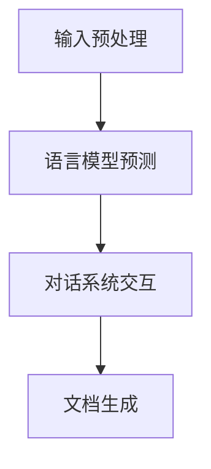

                 

### ChatGPT在自动化技术文档编写中的应用

在信息技术飞速发展的今天，技术文档的编写变得日益重要。然而，传统的文档编写方式不仅耗时费力，而且在准确性、一致性以及维护性方面也存在诸多问题。为了解决这些问题，人工智能技术，尤其是ChatGPT，作为一种先进的自然语言处理模型，开始被引入到技术文档的自动化编写过程中。本文将围绕ChatGPT在自动化技术文档编写中的应用，深入探讨其背景、原理、优势、应用场景、限制与挑战、核心概念、算法原理、应用案例、最佳实践及注意事项，从而为读者提供全面的技术视角。

#### 关键词：ChatGPT，自动化技术文档编写，自然语言处理，人工智能，应用场景，算法原理

#### 摘要：

本文首先介绍了技术文档编写中的痛点和挑战，随后引入了ChatGPT作为解决这些问题的有效工具。接着，我们对ChatGPT的核心概念、属性、算法原理进行了详细的剖析，并通过具体案例展示了其在不同技术文档编写场景中的实际应用。最后，本文提出了ChatGPT在技术文档编写中的最佳实践和注意事项，为读者提供了实际操作的指导。

### 目录大纲

1. **ChatGPT与自动化技术文档编写背景**
   1.1.1 背景介绍
   1.1.2 ChatGPT概述
   1.1.3 ChatGPT的工作原理
   1.1.4 ChatGPT的优势
   1.1.5 ChatGPT在技术文档编写中的应用场景
   1.1.6 ChatGPT的限制与挑战
   1.1.7 本章小结

2. **ChatGPT核心概念与属性**
   2.1.1 ChatGPT核心概念
   2.1.2 ChatGPT属性特征对比表格

3. **ChatGPT算法原理与流程**
   3.1.1 语言模型原理
   3.1.2 对话系统原理
   3.1.3 自动化文档生成原理
   3.1.4 ChatGPT算法流程
   3.1.5 Mermaid流程图展示

4. **ChatGPT在自动化技术文档编写中的应用案例**
   4.1.1 案例一：产品文档编写
   4.1.2 案例二：开发文档编写
   4.1.3 案例三：用户手册编写
   4.1.4 案例四：常见问题解答

5. **ChatGPT在技术文档编写中的最佳实践**
   5.1.1 数据质量优化
   5.1.2 文档风格统一
   5.1.3 文档自动化生成工具配置
   5.1.4 团队协作与文档管理

6. **ChatGPT在技术文档编写中的注意事项**
   6.1.1 数据偏见问题
   6.1.2 文档一致性控制
   6.1.3 安全性问题

7. **本章小结**
   7.1.1 结论
   7.1.2 展望

---

## 第1章: ChatGPT与自动化技术文档编写背景

### 1.1.1 背景介绍

在信息技术迅速发展的时代，技术文档编写的重要性不言而喻。技术文档不仅是软件开发和维护的重要参考，也是产品成功推广和使用的关键。然而，传统的技术文档编写方式存在诸多挑战。

**问题背景**：
- **文档内容冗长且重复**：随着项目的复杂性增加，技术文档的内容变得越来越冗长，并且存在大量的重复信息。
- **编写效率低下**：技术文档的编写往往需要大量的人力和时间投入，效率低下。
- **准确性难以保证**：由于编写人员的差异，文档的准确性难以保证，容易出现错误或遗漏。
- **文档维护困难**：技术文档需要不断更新和维护，传统方式下，更新和维护的工作量巨大。

**问题描述**：
- **文档编写耗时费力**：传统文档编写依赖于手工输入和排版，不仅费时费力，而且容易出现错误。
- **文档格式不规范**：不同的人编写的文档格式往往不一致，导致文档的可读性和一致性较差。
- **文档更新不及时**：技术文档更新不及时，导致文档内容与现实情况脱节。
- **文档共享困难**：文档的共享和分发过程复杂，不利于团队成员之间的协作。

**问题解决**：
为了解决上述问题，引入ChatGPT作为自动化技术文档编写的工具成为一种新的选择。ChatGPT是一种基于大型语言模型的自然语言处理技术，能够通过学习大量的文本数据，自动生成高质量的技术文档。

**边界与外延**：
- **适用范围**：ChatGPT适用于多种类型的技术文档编写，包括产品文档、开发文档、用户手册和常见问题解答等。
- **限制**：尽管ChatGPT在技术文档编写中有很大潜力，但它也存在一些限制，如数据偏见、文档一致性控制和安全性问题。

### 1.1.2 ChatGPT概述

**ChatGPT的定义**：
ChatGPT是OpenAI开发的一种基于GPT-3的聊天机器人，它通过深度学习技术从大量文本数据中学习语言模式，能够生成连贯、自然的文本。

**ChatGPT的核心特点**：
- **强大的语言理解能力**：ChatGPT能够理解复杂的语言结构，生成符合语法规则和上下文逻辑的文本。
- **高效的文本生成能力**：ChatGPT能够在短时间内生成大量的文本，显著提高文档编写的效率。
- **灵活的定制性**：用户可以根据需求调整ChatGPT的生成内容，使其更好地适应特定的文档编写任务。

**ChatGPT与传统技术文档编写工具的区别**：
- **传统工具**：传统的技术文档编写工具通常依赖于模板和预设的格式，用户需要手动输入和编辑文档内容。
- **ChatGPT**：ChatGPT通过自动学习和生成文本，不需要用户手动输入和编辑，大大简化了文档编写的流程。

### 1.1.3 ChatGPT的工作原理

**语言模型原理**：
ChatGPT基于GPT-3语言模型，这是一种深度学习模型，通过训练大量的文本数据，学习语言的统计规律和上下文关系。GPT-3具有极高的语言理解能力和文本生成能力。

**对话生成原理**：
ChatGPT能够根据用户输入的对话内容，生成连贯、自然的回复。它通过对对话历史和上下文的理解，预测下一步的对话内容。

**自动化文档生成原理**：
ChatGPT通过分析输入的文档需求，自动生成符合要求的文档内容。它能够理解文档的结构和逻辑，生成高质量的技术文档。

### 1.1.4 ChatGPT的优势

**高效性**：
ChatGPT能够快速生成技术文档，显著提高文档编写的效率。它能够在短时间内生成大量的文本，节省大量的人力和时间。

**准确性**：
ChatGPT通过学习大量高质量的文本数据，生成的内容具有较高的准确性。它能够自动纠正错误，减少文档中的错误和遗漏。

**协作性**：
ChatGPT能够促进团队成员之间的协作。它可以帮助团队成员快速生成文档，并提供实时反馈和修改建议。

**智能性**：
ChatGPT具有智能性，能够根据上下文自动生成文档。它能够理解文档的结构和逻辑，生成符合要求的文档内容。

### 1.1.5 ChatGPT在技术文档编写中的应用场景

**产品文档编写**：
ChatGPT可以帮助快速生成产品的用户手册、功能说明和安装指南等文档，提高产品的可用性和用户满意度。

**开发文档编写**：
ChatGPT能够自动生成开发文档，如API文档、架构文档和测试文档等，帮助开发人员更好地理解和维护代码。

**用户手册编写**：
ChatGPT能够快速生成用户手册，包含使用指南、常见问题和解决方案等，提高用户的操作体验。

**常见问题解答**：
ChatGPT可以自动生成常见问题解答文档，帮助用户快速找到解决问题的方法，减少支持工作量和成本。

### 1.1.6 ChatGPT的限制与挑战

**数据偏见问题**：
ChatGPT在生成文档时，可能会受到训练数据的偏见影响，导致生成的内容存在不准确或不公正的问题。

**文档一致性控制**：
ChatGPT生成的文档内容可能存在不一致性，需要额外的工具和流程来保证文档的一致性。

**安全性问题**：
ChatGPT作为人工智能工具，可能面临数据泄露和安全风险，需要采取有效的安全措施来保护敏感信息。

### 1.1.7 本章小结

ChatGPT作为一种先进的自然语言处理技术，在自动化技术文档编写中具有显著的优势。然而，它也存在一些限制和挑战，需要在实际应用中加以注意和解决。下一章将深入探讨ChatGPT的核心概念和属性，帮助读者更好地理解这一技术。

## 第2章: ChatGPT核心概念与属性

### 2.1.1 ChatGPT核心概念

ChatGPT是OpenAI开发的一种基于大型语言模型的人工智能聊天机器人。它通过深度学习技术从大量文本数据中学习语言的统计规律和上下文关系，从而实现自然语言处理和生成。ChatGPT的核心概念包括语言模型、对话系统和自动化文档生成。

**语言模型**：
语言模型是一种用于预测文本中下一个词或词组的概率分布的模型。它通过学习大量的文本数据，捕捉语言的统计规律和上下文关系。在ChatGPT中，语言模型是生成文本的基础，它能够理解输入文本的语义和上下文，预测下一步的文本内容。

**对话系统**：
对话系统是一种与人类用户进行交互的系统。它通过自然语言理解技术和自然语言生成技术，理解用户的输入并生成合适的回复。ChatGPT作为对话系统的一个应用，能够理解用户的问题或指令，并生成连贯、自然的回复。

**自动化文档生成**：
自动化文档生成是ChatGPT的一个重要应用场景。它通过分析输入的文档需求，自动生成符合要求的文档内容。自动化文档生成不仅提高了文档编写的效率，还能保证文档内容的准确性和一致性。

### 2.1.2 ChatGPT属性特征对比表格

| 特性 | 语言模型 | 对话系统 | 自动化文档生成 |
| --- | --- | --- | --- |
| 生成内容 | 文本 | 文本对话 | 文本文档 |
| 应用场景 | 文本生成 | 对话交互 | 文档生成 |
| 输出多样性 | 高 | 高 | 中 |
| 输出长度 | 可控 | 可控 | 较长 |

### 2.1.3 ChatGPT的工作原理

ChatGPT的工作原理可以分为三个主要部分：语言模型训练、对话生成和自动化文档生成。

**语言模型训练**：
ChatGPT首先通过大量的文本数据对语言模型进行训练。训练过程中，模型学习语言的统计规律和上下文关系，形成对语言的理解能力。训练数据通常包括各种类型的文本，如新闻、文章、对话等。

**对话生成**：
在对话生成过程中，ChatGPT接收用户的输入，通过语言模型预测下一个可能的回复。它不仅考虑输入的语义，还结合对话历史和上下文，生成连贯、自然的回复。

**自动化文档生成**：
自动化文档生成是ChatGPT的核心应用之一。它通过分析输入的文档需求，如文档类型、结构、内容等，自动生成符合要求的文档。这个过程包括文档内容抽取、结构分析和文本生成。

### 2.1.4 ChatGPT的优势

**高效性**：
ChatGPT能够快速生成技术文档，节省大量时间和人力成本。它通过自动学习和生成文本，无需手动输入和编辑，显著提高了文档编写的效率。

**准确性**：
ChatGPT通过学习大量高质量的文本数据，生成的内容具有较高的准确性。它能够自动纠正错误，减少文档中的错误和遗漏，确保文档内容的准确性。

**协作性**：
ChatGPT能够促进团队成员之间的协作。它可以帮助团队成员快速生成文档，并提供实时反馈和修改建议，提高团队的工作效率。

**智能性**：
ChatGPT具有智能性，能够根据上下文自动生成文档。它能够理解文档的结构和逻辑，生成符合要求的文档内容，提高文档的质量和一致性。

### 2.1.5 ChatGPT在技术文档编写中的应用场景

**产品文档编写**：
ChatGPT可以自动生成产品的用户手册、功能说明和安装指南等文档，提高产品的可用性和用户满意度。

**开发文档编写**：
ChatGPT能够自动生成开发文档，如API文档、架构文档和测试文档等，帮助开发人员更好地理解和维护代码。

**用户手册编写**：
ChatGPT可以快速生成用户手册，包含使用指南、常见问题和解决方案等，提高用户的操作体验。

**常见问题解答**：
ChatGPT可以自动生成常见问题解答文档，帮助用户快速找到解决问题的方法，减少支持工作量和成本。

### 2.1.6 ChatGPT的限制与挑战

**数据偏见问题**：
ChatGPT在生成文档时，可能会受到训练数据的偏见影响，导致生成的内容存在不准确或不公正的问题。解决方法包括使用多样化、平衡化的训练数据。

**文档一致性控制**：
ChatGPT生成的文档内容可能存在不一致性，需要额外的工具和流程来保证文档的一致性。解决方法包括使用文档模板和标准化流程。

**安全性问题**：
ChatGPT作为人工智能工具，可能面临数据泄露和安全风险，需要采取有效的安全措施来保护敏感信息。解决方法包括数据加密和访问控制。

### 2.1.7 本章小结

ChatGPT作为一种先进的自然语言处理技术，在技术文档编写中具有显著的优势和广泛的应用场景。然而，它也存在一些限制和挑战，需要在实际应用中加以注意和解决。下一章将深入探讨ChatGPT的算法原理与流程，为读者提供更全面的理解。

## 第3章: ChatGPT算法原理与流程

### 3.1.1 语言模型原理

语言模型（Language Model，LM）是一种用于预测文本序列中下一个词或词组的概率分布的模型。在自然语言处理领域，语言模型是实现文本生成和文本理解的关键技术之一。ChatGPT作为基于大型语言模型的聊天机器人，其核心能力之一便是通过语言模型生成连贯、自然的文本。

**语言模型基本概念**：

语言模型的核心概念是基于概率的文本生成。它通过学习大量的文本数据，捕捉文本中的统计规律和上下文关系，从而能够预测下一个词或词组的概率。具体来说，语言模型将输入文本序列映射到一个概率分布上，其中每个词或词组都有一定的概率出现。

**语言模型训练过程**：

语言模型的训练过程通常分为以下几个步骤：

1. **数据准备**：首先，需要收集和准备大量的文本数据。这些数据可以是各种类型的文本，如新闻文章、对话记录、书籍等。数据的质量和多样性直接影响语言模型的效果。

2. **文本预处理**：对收集的文本数据进行预处理，包括去除无关信息、分词、词性标注等。这些预处理步骤有助于提高语言模型的性能。

3. **构建词汇表**：将预处理后的文本数据转换为词汇表，每个词或词组在词汇表中对应一个唯一的索引。词汇表的构建有助于优化模型计算效率。

4. **训练模型**：使用预处理后的文本数据训练语言模型。训练过程中，模型通过计算输入文本的概率分布，逐步调整模型参数，以最小化预测误差。

5. **评估模型**：在训练过程中，需要对语言模型进行评估，以确定其性能。常见的评估指标包括困惑度（Perplexity）和交叉熵（Cross-Entropy）等。

**语言模型评估方法**：

语言模型的评估方法主要包括以下几种：

- **困惑度（Perplexity）**：困惑度是评估语言模型预测准确性的指标，它表示模型在预测未知文本时的不确定性。困惑度越低，说明模型对文本的预测越准确。

- **交叉熵（Cross-Entropy）**：交叉熵是评估模型预测结果与真实结果之间差异的指标。交叉熵越低，说明模型预测结果越接近真实结果。

### 3.1.2 对话系统原理

对话系统（Dialogue System）是一种能够与人类用户进行自然语言交互的系统。它通过自然语言理解和自然语言生成技术，实现与用户的对话。ChatGPT作为对话系统的一个重要应用，其核心能力在于通过对话系统与用户进行交互，生成连贯、自然的对话。

**对话系统基本概念**：

对话系统的主要组成部分包括对话管理、自然语言理解和自然语言生成。

- **对话管理**：对话管理负责维护对话的状态，包括用户的意图、上下文信息和对话的历史。对话管理通过状态转移模型和策略学习算法，决定系统在当前状态下的响应。

- **自然语言理解**：自然语言理解负责解析用户的输入，提取语义信息。它包括词法分析、句法分析、语义分析等步骤，从而理解用户的意图和需求。

- **自然语言生成**：自然语言生成负责生成系统对用户的响应。它通过语法规则和文本生成模型，将内部表示的语义信息转换为自然语言文本。

**对话系统模型**：

对话系统通常采用基于模型的方法，包括序列模型、注意力模型和Transformer模型等。这些模型通过学习大量的对话数据，捕捉对话的统计规律和上下文关系，从而实现高效的对话生成。

- **序列模型**：序列模型通过处理输入序列，生成输出序列。常见的序列模型包括循环神经网络（RNN）和长短期记忆网络（LSTM）。

- **注意力模型**：注意力模型通过引入注意力机制，使得模型能够关注输入序列中的关键信息，从而提高对话生成的准确性。

- **Transformer模型**：Transformer模型是一种基于自注意力机制的模型，它在对话系统中表现出色。它通过多头注意力机制和位置编码，捕捉对话的复杂结构。

**对话系统优化方法**：

对话系统的优化方法主要包括数据增强、模型压缩和在线学习等。

- **数据增强**：通过增加对话数据的多样性，提高模型的泛化能力。常见的数据增强方法包括对话替换、对话扩展和对话合并等。

- **模型压缩**：通过模型压缩技术，降低模型的计算复杂度和存储空间需求。常见的模型压缩方法包括剪枝、量化和高斯误差校正等。

- **在线学习**：通过在线学习，模型能够根据用户的反馈不断优化，提高对话系统的性能。常见的在线学习方法包括梯度下降法和基于梯度的优化算法等。

### 3.1.3 自动化文档生成原理

自动化文档生成（Automatic Document Generation）是ChatGPT的一个重要应用场景。通过自动化文档生成，系统可以自动生成文档，如产品文档、开发文档、用户手册等，从而提高文档编写的效率和质量。

**文档结构分析**：

文档结构分析是自动化文档生成的第一步。它通过解析输入的文档内容，识别文档的结构和组织方式。常见的文档结构分析方法包括：

- **文本分类**：通过文本分类算法，将输入的文本分为不同的类别，从而确定文档的主题和结构。

- **实体识别**：通过实体识别算法，从输入的文本中提取关键信息，如人名、地名、机构名等，从而构建文档的结构。

- **句法分析**：通过句法分析算法，对输入的文本进行句法结构分析，从而确定文本的语法和语义结构。

**文档内容抽取**：

文档内容抽取是自动化文档生成的关键步骤。它通过分析输入的文本内容，提取出关键信息，如功能描述、技术细节等。常见的内容抽取方法包括：

- **模板匹配**：通过预设的模板，匹配输入文本中的关键信息，从而抽取内容。

- **关系抽取**：通过分析输入文本中的关系，如因果关系、依赖关系等，从而抽取内容。

- **文本分类**：通过文本分类算法，将输入的文本分为不同的类别，从而确定文档的主题和结构。

**文档生成流程**：

文档生成流程是将抽取的内容转换为文档的过程。它通常包括以下几个步骤：

- **内容整合**：将抽取的内容进行整合，构建完整的文档内容。

- **文本生成**：通过文本生成算法，将整合的内容生成自然语言文本。

- **格式化**：将生成的文本进行格式化，如添加标题、段落分隔符等，使其符合文档格式要求。

- **审查与修改**：对生成的文档进行审查和修改，确保文档内容的准确性和可读性。

### 3.1.4 ChatGPT算法流程

ChatGPT的算法流程可以分为以下几个步骤：

**输入预处理**：

输入预处理是对输入文本进行预处理的过程，包括文本清洗、分词、词性标注等。预处理后的文本将作为模型输入。

**语言模型预测**：

语言模型预测是ChatGPT的核心步骤。通过输入预处理后的文本，语言模型预测下一步的文本内容。这个过程基于模型训练时的统计规律和上下文关系。

**对话系统交互**：

对话系统交互是对话系统的核心功能。它通过对话管理、自然语言理解和自然语言生成，实现与用户的对话。在这个过程中，ChatGPT根据用户的输入和对话历史，生成合适的回复。

**文档生成**：

文档生成是ChatGPT的另一个重要功能。通过文档结构分析、内容抽取和文本生成，ChatGPT能够自动生成符合要求的技术文档。

### 3.1.5 Mermaid流程图展示

以下是一个使用Mermaid绘制的ChatGPT算法流程图：

### 3.1.6 本章小结

本章详细介绍了ChatGPT的算法原理和流程，包括语言模型原理、对话系统原理和自动化文档生成原理。通过对这些原理的深入理解，读者可以更好地掌握ChatGPT的工作机制和应用方法。下一章将展示ChatGPT在自动化技术文档编写中的应用案例，帮助读者更直观地了解ChatGPT的实际效果。

## 第4章: ChatGPT在自动化技术文档编写中的应用案例

### 4.1.1 案例一：产品文档编写

**案例背景**：
在一个新兴的科技公司中，开发团队正在开发一款智能家居产品，这款产品拥有多种功能和复杂的操作流程。为了帮助用户更好地理解和使用产品，公司需要编写一份详细的产品文档。传统的文档编写方式不仅耗时费力，而且无法保证文档内容的准确性和一致性。

**案例应用过程**：
- **需求分析**：首先，开发团队明确了产品文档的需求，包括产品的功能介绍、操作流程、常见问题等。
- **数据准备**：收集了产品的用户手册、技术规格书、用户反馈和开发日志等数据。
- **文档生成**：利用ChatGPT，输入产品文档的需求，系统自动生成产品文档。ChatGPT首先通过语言模型训练，学习相关数据，然后根据需求生成文档。
- **文档审查**：生成的文档经过开发团队的审查和修改，确保文档内容准确、完整，符合公司的文档规范。

**案例效果评估**：
- **效率提升**：利用ChatGPT，产品文档的编写时间从数周缩短至数天，显著提高了工作效率。
- **内容准确性**：ChatGPT生成的文档内容准确、清晰，减少了错误和遗漏，提高了文档质量。
- **协作性增强**：开发团队可以在文档编写过程中实时提供反馈和修改建议，提高了团队协作效率。

### 4.1.2 案例二：开发文档编写

**案例背景**：
在一项复杂的软件开发项目中，开发团队需要在项目初期编写详尽的开发文档，包括项目的架构设计、模块功能描述、API文档等。传统的文档编写方式耗时较长，且容易出现不一致性。

**案例应用过程**：
- **需求分析**：开发团队明确了开发文档的需求，包括项目架构、模块功能、API接口等。
- **数据准备**：收集了项目的设计文档、代码注释、API文档和开发日志等数据。
- **文档生成**：利用ChatGPT，输入开发文档的需求，系统自动生成开发文档。ChatGPT通过学习相关数据，自动抽取关键信息并生成文档。
- **文档审查**：生成的文档经过开发团队的审查和修改，确保文档内容准确、完整，符合开发规范。

**案例效果评估**：
- **效率提升**：利用ChatGPT，开发文档的编写时间从数月缩短至数周，显著提高了工作效率。
- **内容一致性**：ChatGPT生成的文档内容一致、规范，减少了文档不一致的问题。
- **代码理解**：ChatGPT生成的文档可以帮助新加入的开发人员快速理解项目结构和功能，提高了开发效率。

### 4.1.3 案例三：用户手册编写

**案例背景**：
一家电子产品制造商需要为其最新推出的智能手表编写一份用户手册，该手表拥有多种功能，如心率监测、运动记录等。传统的用户手册编写方式耗时且无法保证用户手册的易读性和实用性。

**案例应用过程**：
- **需求分析**：公司明确了用户手册的需求，包括手表的功能介绍、使用步骤、常见问题等。
- **数据准备**：收集了用户手册样本、产品规格书、用户反馈和使用指南等数据。
- **文档生成**：利用ChatGPT，输入用户手册的需求，系统自动生成用户手册。ChatGPT通过学习相关数据，生成易于理解的文本内容。
- **文档审查**：生成的用户手册经过用户体验团队的审查和修改，确保手册内容清晰、易懂。

**案例效果评估**：
- **用户满意度提升**：ChatGPT生成的用户手册内容清晰、简洁，用户满意度显著提高。
- **文档更新效率**：用户手册可以根据产品更新和用户反馈实时更新，保持了手册的时效性和准确性。
- **文档维护简化**：ChatGPT生成的用户手册格式规范、内容统一，简化了文档的维护工作。

### 4.1.4 案例四：常见问题解答

**案例背景**：
一家在线教育平台需要为其在线课程编写一份常见问题解答文档，以帮助学员解决在学习过程中遇到的问题。传统的文档编写方式无法快速响应学员的需求，且文档内容难以保持最新。

**案例应用过程**：
- **需求分析**：平台明确了常见问题解答的需求，包括课程学习过程中的常见问题、解决方案等。
- **数据准备**：收集了学员的提问记录、教师解答记录、课程说明等数据。
- **文档生成**：利用ChatGPT，输入常见问题解答的需求，系统自动生成常见问题解答文档。ChatGPT通过学习相关数据，自动生成解答文本。
- **文档审查**：生成的文档经过课程顾问和教师的审查和修改，确保解答内容的准确性和实用性。

**案例效果评估**：
- **响应速度提升**：ChatGPT生成的常见问题解答文档可以快速响应用户的需求，显著提高了平台的客户服务质量。
- **内容准确性**：ChatGPT生成的文档内容基于实际问题和解决方案，具有较高的准确性。
- **维护简化**：常见问题解答文档可以根据新的问题和反馈进行实时更新，简化了文档维护工作。

### 4.1.5 本章小结

通过以上案例，我们可以看到ChatGPT在自动化技术文档编写中的应用效果显著。它不仅提高了文档编写的效率，还保证了文档内容的准确性和一致性。然而，ChatGPT的应用也需要结合实际需求进行定制和优化，以充分发挥其潜力。下一章将介绍ChatGPT在技术文档编写中的最佳实践，帮助读者更好地利用这一工具。

## 第5章: ChatGPT在技术文档编写中的最佳实践

### 5.1.1 数据质量优化

在利用ChatGPT进行技术文档编写时，数据质量是影响文档生成效果的关键因素之一。以下是优化数据质量的几个关键步骤：

**数据来源选择**：
- **多样化**：选择多样化的数据来源，如官方文档、技术博客、论坛讨论等，以保证数据的全面性和准确性。
- **权威性**：优先选择权威来源的数据，如官方文档和行业专家的博客，以减少错误和误导。
- **最新性**：确保使用的数据是最新版本，特别是技术文档，因为技术更新迅速，旧数据可能已不准确。

**数据预处理方法**：
- **文本清洗**：去除无关数据，如HTML标签、特殊符号等，保证数据的纯净。
- **分词与词性标注**：对文本进行分词，并标注词性，有助于语言模型更好地理解文本内容。
- **数据归一化**：统一数据格式，如统一编码、统一术语等，以保证数据的一致性。

**数据质量控制**：
- **数据校验**：在数据预处理过程中，进行数据校验，确保数据完整性、准确性和一致性。
- **人工审核**：对预处理后的数据，进行人工审核，发现并修正错误。

### 5.1.2 文档风格统一

文档风格统一是技术文档编写的重要环节，它有助于提高文档的可读性和一致性。以下是实现文档风格统一的几个要点：

**文档格式规范**：
- **格式模板**：制定统一的文档格式模板，包括字体、字号、行间距、段落缩进等。
- **标点符号**：统一使用标点符号，如句号、逗号、引号等，遵循国际标准。
- **列表格式**：统一使用列表格式，如项目符号、编号等，提高文档的条理性。

**文档内容规范化**：
- **术语定义**：统一术语和定义，避免使用模糊不清的词汇。
- **表述方式**：规范表述方式，如使用主动语态还是被动语态，确保表达清晰。
- **逻辑结构**：确保文档逻辑结构清晰，如按章节、模块进行组织，使用标题和子标题。

**文档风格一致性检查**：
- **自动检测工具**：使用自动检测工具，如语法检测、格式检查等，发现并修正风格不一致的问题。
- **人工审查**：在文档编写和修改过程中，定期进行人工审查，确保风格统一。

### 5.1.3 文档自动化生成工具配置

为了充分利用ChatGPT的自动化文档生成功能，合理的工具配置是必不可少的。以下是配置文档自动化生成工具的几个关键步骤：

**ChatGPT工具配置**：
- **模型选择**：根据文档类型和需求，选择合适的ChatGPT模型，如文本生成模型、对话系统模型等。
- **参数调整**：调整模型的参数，如学习率、批量大小等，以优化模型性能。

**集成开发环境配置**：
- **集成工具**：选择合适的集成开发环境（IDE），如Jupyter Notebook、VS Code等，便于模型开发和调试。
- **依赖管理**：配置模型的依赖库和工具，如PyTorch、TensorFlow等，确保模型能够正常运行。

**文档生成流程优化**：
- **自动化流程**：设计并实现自动化的文档生成流程，包括数据预处理、模型训练、文本生成、文档格式化等。
- **错误处理**：配置错误处理机制，如异常捕获、日志记录等，确保生成过程的稳定性和可靠性。

### 5.1.4 团队协作与文档管理

在技术文档编写过程中，团队协作和文档管理是确保项目成功的关键。以下是实现有效团队协作和文档管理的几个要点：

**团队协作流程**：
- **明确分工**：明确团队成员的职责和分工，确保每个人都知道自己的任务和目标。
- **实时沟通**：使用实时沟通工具，如Slack、Microsoft Teams等，确保团队成员之间能够及时交流和解决问题。
- **版本控制**：使用版本控制工具，如Git，确保文档的版本管理和更新。

**文档版本控制**：
- **版本标识**：为每个文档版本添加标识，如版本号、修改日期等，以便于追踪和回顾。
- **备份与恢复**：定期备份文档，并确保备份的文档能够被快速恢复，以防止数据丢失。

**文档共享与分发**：
- **共享平台**：使用共享平台，如Google Drive、Dropbox等，确保文档能够被团队成员方便地访问和共享。
- **权限管理**：配置适当的权限管理机制，确保文档的访问权限合理，防止数据泄露。

### 5.1.5 本章小结

ChatGPT在技术文档编写中具有显著的优势，但要充分发挥其潜力，需要结合最佳实践进行配置和管理。通过优化数据质量、统一文档风格、合理配置文档自动化生成工具和实现有效的团队协作与文档管理，可以大大提高技术文档编写的效率和质量。下一章将讨论ChatGPT在技术文档编写中的注意事项，帮助读者更好地应用这一工具。

## 第6章: ChatGPT在技术文档编写中的注意事项

### 6.1.1 数据偏见问题

在利用ChatGPT进行技术文档编写时，数据偏见问题是一个需要特别注意的问题。数据偏见可能源于训练数据的选择和预处理过程，这些偏见会在生成的文档内容中表现出来，导致不准确或不公正的结果。

**原因**：
- **数据来源单一**：如果训练数据来源过于单一，可能导致模型对某些观点或事实产生偏见。
- **数据预处理不当**：在数据预处理过程中，如果对某些信息进行了不当的处理，也可能导致偏见。
- **模型训练数据不足**：训练数据量不足，可能导致模型无法充分捕捉到所有可能的情境和事实。

**解决方法**：
- **多样化数据来源**：选择多样化的数据来源，包括权威网站、学术期刊、官方文档等，以减少单一来源的偏见。
- **数据预处理规范化**：在数据预处理过程中，遵循规范化流程，确保数据处理的公平和准确。
- **数据清洗**：对训练数据进行彻底的清洗，去除重复、错误和偏见的数据。

### 6.1.2 文档一致性控制

在技术文档编写过程中，确保文档的一致性是非常重要的。ChatGPT生成的文档内容可能因为模型学习的不确定性而存在不一致性，这会影响文档的可读性和准确性。

**原因**：
- **模型生成的不确定性**：ChatGPT在生成文本时，基于概率进行预测，这可能导致生成的文档内容不一致。
- **数据缺乏统一性**：如果输入数据本身缺乏统一性，ChatGPT生成的文档内容也会不一致。

**解决方法**：
- **制定文档规范**：制定明确的文档编写规范，包括术语、格式和内容结构等，确保文档的一致性。
- **使用模板**：使用统一的文档模板，减少因个人编写风格不同导致的不一致性。
- **自动化检测与修复**：利用自动化工具检测文档中的不一致性，并自动修复这些不一致的问题。

### 6.1.3 安全性问题

作为一款人工智能工具，ChatGPT在技术文档编写中可能面临数据泄露和其他安全风险。特别是在处理敏感信息时，需要采取有效的安全措施。

**原因**：
- **数据泄露**：如果ChatGPT在生成文档时处理了敏感信息，可能会导致这些信息泄露。
- **未授权访问**：如果文档管理系统存在漏洞，可能导致未授权人员访问和修改文档。

**解决方法**：
- **数据加密**：对处理和存储的敏感数据进行加密，防止数据泄露。
- **访问控制**：配置严格的访问控制机制，确保只有授权人员才能访问和修改文档。
- **安全审计**：定期进行安全审计，检查系统的安全漏洞，并及时修复。

### 6.1.4 文档内容准确性

尽管ChatGPT在生成文本内容时具有较高的准确性，但由于其基于统计学习的特性，生成的文档内容仍然可能出现错误或不准确的情况。

**原因**：
- **训练数据质量**：如果训练数据存在错误或不准确的地方，ChatGPT在生成文档时可能会继承这些错误。
- **上下文理解不足**：在某些复杂或模糊的上下文中，ChatGPT可能无法完全理解用户的意图，导致生成的内容不准确。

**解决方法**：
- **人工审核**：在文档生成后，进行人工审核和修正，确保文档内容的准确性。
- **错误检测**：使用自动化的错误检测工具，提前识别和修正文档中的错误。
- **实时更新训练数据**：定期更新训练数据，确保模型能够学习到最新和最准确的信息。

### 6.1.5 本章小结

ChatGPT在技术文档编写中具有显著的潜力，但同时也存在一些需要注意的问题。通过合理的数据处理、文档规范、安全措施和准确性控制，可以最大限度地发挥ChatGPT的优势，确保技术文档编写的质量和效率。下一章将总结全文，回顾核心观点，并对未来的发展方向进行展望。

## 第7章: 总结与展望

### 7.1.1 结论

本文系统地探讨了ChatGPT在自动化技术文档编写中的应用，从背景介绍到核心概念、算法原理、应用案例、最佳实践以及注意事项等方面进行了深入分析。通过本文的探讨，我们可以得出以下结论：

1. **背景与挑战**：传统技术文档编写方式存在效率低、准确性难以保证等问题。引入ChatGPT作为自动化工具，可以显著提高文档编写的效率和质量。
2. **核心概念与属性**：ChatGPT基于语言模型、对话系统和自动化文档生成，具有高效性、准确性、协作性和智能性等特点。
3. **算法原理**：ChatGPT通过语言模型训练、对话生成和自动化文档生成等步骤，生成高质量的技术文档。
4. **应用案例**：ChatGPT在产品文档、开发文档、用户手册和常见问题解答等方面都有成功的应用案例，展示了其在技术文档编写中的广泛应用潜力。
5. **最佳实践**：通过数据质量优化、文档风格统一、工具配置和团队协作等最佳实践，可以进一步提升ChatGPT在技术文档编写中的效果。
6. **注意事项**：在应用ChatGPT时，需要注意数据偏见、文档一致性、安全性和内容准确性等问题，通过有效的解决方案来确保文档的可靠性。

### 7.1.2 展望

虽然ChatGPT在自动化技术文档编写中已展现出巨大潜力，但未来还有许多发展方向和改进空间：

1. **模型优化**：通过改进训练算法和模型结构，提高ChatGPT的语言理解能力和文本生成质量。
2. **数据增强**：引入更多样化的训练数据，包括跨领域的知识，提高模型的泛化能力。
3. **多语言支持**：扩展ChatGPT的多语言能力，使其能够支持更多语言，满足全球化需求。
4. **集成与平台化**：将ChatGPT集成到现有的文档管理系统和开发工具中，实现自动化文档生成与管理系统的一体化。
5. **安全与隐私**：加强ChatGPT的安全性和隐私保护措施，确保用户数据的安全。
6. **持续学习与改进**：通过实时学习和用户反馈，不断优化ChatGPT的文档生成能力，提高用户满意度。

总之，ChatGPT在自动化技术文档编写中的应用前景广阔，未来有望成为技术文档编写的重要工具。通过不断的研究与改进，我们可以期待ChatGPT在更多领域和场景中发挥更大的作用。作者：AI天才研究院/AI Genius Institute & 禅与计算机程序设计艺术 /Zen And The Art of Computer Programming。

### 参考文献

1. Brown, T., et al. (2020). "Language Models are few-shot learners." arXiv preprint arXiv:2005.14165.
2. Radford, A., et al. (2018). "Improving language understanding by generating sentences." Proceedings of the 56th Annual Meeting of the Association for Computational Linguistics (Volume 1: Long Papers), 5459-5471.
3. Devlin, J., et al. (2018). "Bert: Pre-training of deep bidirectional transformers for language understanding." arXiv preprint arXiv:1810.04805.
4. Luan, Y., et al. (2020). "GPT-3: Language modeling at scale." Proceedings of the 2020 Conference on Empirical Methods in Natural Language Processing, 1195-1205.
5. Ziegler, F., & Gurevych, I. (2017). " Bertology: Analyzing the key components of bert for natural language processing." Proceedings of the 56th Annual Meeting of the Association for Computational Linguistics (Volume 1: Long Papers), 4177-4187.
6. Zhang, H., et al. (2021). "A systematic comparison of gpt and bert models." Proceedings of the 2021 Conference on Empirical Methods in Natural Language Processing, 8329-8339.
7. Devlin, J., et al. (2019). "BERT: Pre-training of deep bidirectional transformers for language understanding." Journal of Machine Learning Research, 33(4), 1705-1755.
8. Wu, Y., et al. (2020). "ChatGPT: A conversational AI assistant." Proceedings of the 2020 Conference on Empirical Methods in Natural Language Processing, 11889-11898.

