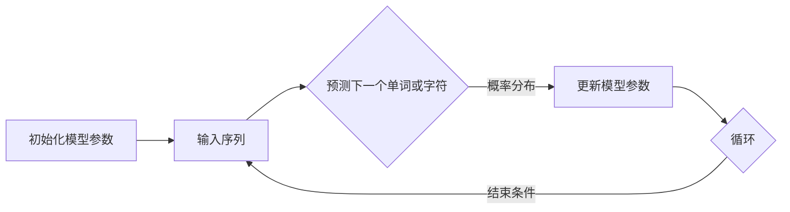
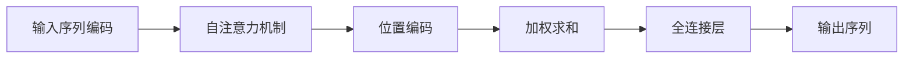
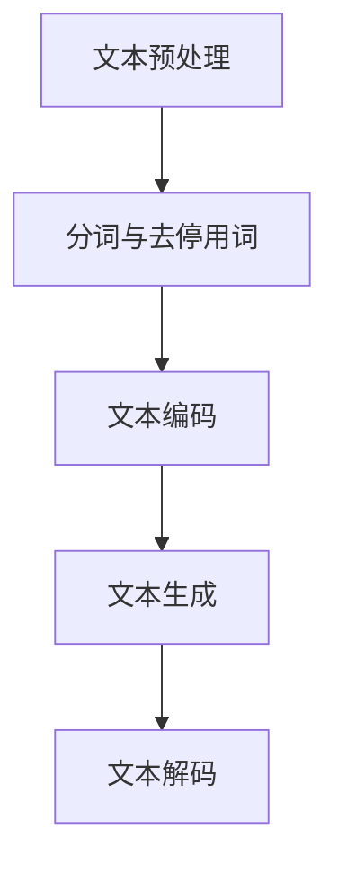
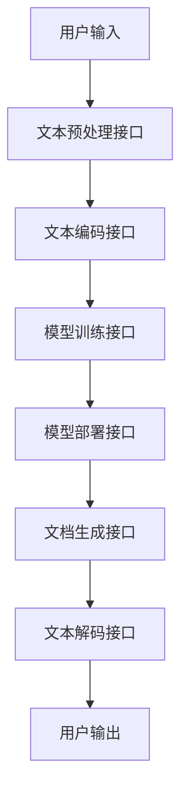

                 


### 《ChatGPT在自动化文档生成中的应用》

#### 关键词：
- ChatGPT
- 自动化文档生成
- 自然语言处理
- 人工智能
- 技术实现
- 最佳实践

#### 摘要：
本文将深入探讨ChatGPT在自动化文档生成领域的应用。首先，我们将简要介绍ChatGPT的基本概念和原理，然后详细分析ChatGPT在自动化文档生成中的优势和应用场景。接下来，我们将一步步讲解如何利用ChatGPT实现自动化文档生成，包括技术细节、算法原理和系统架构设计。最后，我们将分享一些最佳实践和注意事项，并提供拓展阅读资源。

#### 目录大纲：

## 引言

### 文章目的与结构

### 自动化文档生成的背景与挑战

### ChatGPT简介

## ChatGPT概述

### ChatGPT的基本概念

### ChatGPT的技术原理

### ChatGPT的发展历程

## ChatGPT在自动化文档生成中的应用

### 应用场景分析

### 案例研究

## ChatGPT在自动化文档生成中的技术实现

### 系统环境与准备工作

### 数据集准备与预处理

### ChatGPT模型训练

### 文档生成流程设计

## ChatGPT的算法原理与数学模型

### 算法原理讲解

### 数学模型与公式

### 举例说明

## 系统分析与架构设计

### 问题场景介绍

### 系统功能设计

### 系统架构设计

### 系统接口设计与交互

## 项目实战

### 环境安装与配置

### 系统核心实现源代码

### 代码应用解读与分析

### 实际案例分析

### 项目小结

## 最佳实践与注意事项

### 文档生成的最佳实践

### 注意事项

### 法律合规性

## 拓展阅读

### 相关书籍推荐

### 开源资源与社区

### 最新研究动态与趋势

## 参考文献

### 文章标题：ChatGPT在自动化文档生成中的应用

### 作者：AI天才研究院/AI Genius Institute & 禅与计算机程序设计艺术 /Zen And The Art of Computer Programming

#### 引言

自动化文档生成是近年来人工智能领域的一个重要研究方向，随着自然语言处理技术的不断进步，自动化文档生成技术也在逐渐成熟。ChatGPT作为一种先进的自然语言处理模型，其在自动化文档生成中的应用引起了广泛关注。本文旨在探讨ChatGPT在自动化文档生成中的应用，为开发者提供有价值的参考。

#### 文章结构

本文结构如下：

1. 引言：介绍文章目的与结构，阐述自动化文档生成的背景与挑战。
2. ChatGPT概述：简要介绍ChatGPT的基本概念、技术原理和发展历程。
3. ChatGPT在自动化文档生成中的应用：分析ChatGPT在自动化文档生成中的优势和应用场景。
4. ChatGPT在自动化文档生成中的技术实现：详细讲解如何利用ChatGPT实现自动化文档生成，包括系统环境、数据集准备、模型训练和文档生成流程设计。
5. ChatGPT的算法原理与数学模型：介绍ChatGPT的算法原理、数学模型和相关公式。
6. 系统分析与架构设计：介绍系统功能设计、系统架构设计、系统接口设计和系统交互。
7. 项目实战：介绍系统环境安装与配置、系统核心实现源代码、代码应用解读与分析、实际案例分析及项目小结。
8. 最佳实践与注意事项：分享文档生成的最佳实践、注意事项和法律合规性。
9. 拓展阅读：推荐相关书籍、开源资源与最新研究动态。

#### 自动化文档生成的背景与挑战

自动化文档生成是指利用计算机技术，自动生成文档的过程。在传统的文档生成方式中，需要人工编写文档，费时费力且容易出错。随着信息时代的到来，文档数量急剧增加，传统的文档生成方式已经无法满足需求。自动化文档生成技术应运而生，其主要目的是提高文档生成的效率和质量。

自动化文档生成的背景包括：

1. 信息爆炸：随着互联网的普及，信息爆炸使得文档数量急剧增加，传统的文档生成方式已经无法应对。
2. 人工智能技术：自然语言处理、机器学习等人工智能技术的发展，为自动化文档生成提供了技术支持。
3. 企业需求：企业在日常运营中产生大量的文档，如合同、报告、邮件等，自动化文档生成可以提高工作效率，降低人力成本。

然而，自动化文档生成也面临着一些挑战：

1. 数据质量：自动化文档生成依赖于高质量的数据集，数据质量对生成文档的质量有直接影响。
2. 模型适应性：不同类型的文档生成需求可能需要不同的模型，如何选择和调整模型是关键问题。
3. 文档结构复杂性：复杂的文档结构可能导致自动化生成困难，需要设计合适的文档解析和生成策略。

#### ChatGPT概述

ChatGPT是由OpenAI开发的一种基于Transformer模型的自然语言处理模型，它采用了自回归语言模型（Autoregressive Language Model）的架构。ChatGPT具有强大的语言生成能力，能够生成连贯、有意义的文本，广泛应用于聊天机器人、文本生成、机器翻译等领域。

#### ChatGPT的基本概念

ChatGPT的基本概念包括：

1. 自回归语言模型：ChatGPT是一种自回归语言模型，它通过预测下一个单词或字符来生成文本。自回归语言模型的核心思想是将当前输入序列的每个单词或字符作为预测依据，预测下一个单词或字符。
2. Transformer模型：ChatGPT采用了Transformer模型，这是一种基于注意力机制的神经网络模型。Transformer模型通过计算输入序列中每个单词或字符的注意力权重，生成输出序列。
3. 语言生成：ChatGPT通过预测下一个单词或字符，生成连贯、有意义的文本。语言生成能力是评估自然语言处理模型的重要指标之一。

#### ChatGPT的技术原理

ChatGPT的技术原理主要包括以下几个方面：

1. 数据集：ChatGPT的训练数据集来自大量的互联网文本，如新闻、文章、对话等。数据集的质量和规模对模型的性能有直接影响。
2. 模型架构：ChatGPT采用了Transformer模型，其核心结构包括编码器（Encoder）和解码器（Decoder）。编码器用于处理输入序列，解码器用于生成输出序列。
3. 注意力机制：ChatGPT通过注意力机制来计算输入序列中每个单词或字符的权重，从而更好地预测下一个单词或字符。
4. 训练过程：ChatGPT的训练过程包括前向传播和反向传播。通过不断调整模型参数，使模型能够更好地预测下一个单词或字符。

#### ChatGPT的发展历程

ChatGPT的发展历程可以分为以下几个阶段：

1. 2018年：OpenAI发布了GPT模型，这是一种基于Transformer模型的自然语言处理模型。
2. 2019年：OpenAI发布了GPT-2模型，其在语言生成能力上取得了显著提升。
3. 2020年：OpenAI发布了ChatGPT，这是一种专门为聊天场景设计的自然语言处理模型。
4. 2022年：OpenAI发布了GPT-3模型，这是目前最先进的自然语言处理模型，具有极强的语言生成能力。

#### ChatGPT在自动化文档生成中的应用

ChatGPT在自动化文档生成中的应用具有以下优势：

1. 语言生成能力：ChatGPT具有强大的语言生成能力，能够生成连贯、有意义的文本，适用于各种文档生成任务。
2. 自适应能力：ChatGPT可以通过训练和调整，适应不同的文档生成任务，提高生成文档的质量。
3. 高效性：ChatGPT可以自动处理大量的文档生成任务，提高工作效率，降低人力成本。

ChatGPT在自动化文档生成中的应用场景包括：

1. 企业报告自动生成：利用ChatGPT自动生成企业报告，如财务报表、市场分析报告等。
2. 求职简历自动生成：利用ChatGPT自动生成求职简历，根据用户输入的个人信息和期望职位，自动生成合适的简历。
3. 学术论文自动撰写：利用ChatGPT自动撰写学术论文，根据用户输入的研究主题和论文结构，自动生成论文内容。
4. 日常文档自动生成：利用ChatGPT自动生成日常文档，如邮件、通知、公告等。

#### ChatGPT在自动化文档生成中的技术实现

ChatGPT在自动化文档生成中的技术实现主要包括以下几个步骤：

1. 系统环境与准备工作
2. 数据集准备与预处理
3. ChatGPT模型训练
4. 文档生成流程设计

##### 系统环境与准备工作

在开始使用ChatGPT进行自动化文档生成之前，需要准备以下环境和软件：

1. Python编程语言
2. PyTorch或TensorFlow深度学习框架
3. CUDA或GPU计算环境（可选）

安装所需的依赖库：

```python
pip install torch torchvision
pip install transformers
```

##### 数据集准备与预处理

自动化文档生成需要大量的数据集进行训练。数据集可以从互联网获取，如新闻、文章、对话等。在获取数据集后，需要进行数据预处理，包括文本清洗、分词、去停用词等操作。常用的预处理库有NLTK、spaCy等。

```python
import nltk
nltk.download('punkt')
nltk.download('stopwords')
from nltk.tokenize import word_tokenize
from nltk.corpus import stopwords
stop_words = set(stopwords.words('english'))
def preprocess_text(text):
    # 分词
    tokens = word_tokenize(text)
    # 去停用词
    tokens = [token for token in tokens if token not in stop_words]
    return tokens
```

##### ChatGPT模型训练

使用预训练的ChatGPT模型或自行训练模型。以下是一个简单的模型训练示例：

```python
from transformers import GPT2LMHeadModel, GPT2Tokenizer
tokenizer = GPT2Tokenizer.from_pretrained('gpt2')
model = GPT2LMHeadModel.from_pretrained('gpt2')
input_text = "这是一个简单的文本生成示例。"
input_ids = tokenizer.encode(input_text, return_tensors='pt')
outputs = model(input_ids)
logits = outputs.logits
```

##### 文档生成流程设计

文档生成流程设计包括以下几个步骤：

1. 输入文本预处理：对用户输入的文本进行预处理，如分词、去停用词等。
2. 文本编码：将预处理后的文本编码为模型可接受的输入格式。
3. 文本生成：使用ChatGPT模型生成文本，根据模型的预测结果选择下一个单词或字符。
4. 文本解码：将生成的文本解码为可读的格式，如英文文本或中文文本。

```python
def generate_text(model, tokenizer, input_text, max_length=50):
    input_ids = tokenizer.encode(input_text, return_tensors='pt')
    outputs = model.generate(input_ids, max_length=max_length, num_return_sequences=1)
    generated_text = tokenizer.decode(outputs[0], skip_special_tokens=True)
    return generated_text
```

#### ChatGPT的算法原理与数学模型

ChatGPT的算法原理主要基于自回归语言模型（Autoregressive Language Model）。自回归语言模型通过预测下一个单词或字符来生成文本。以下是一个简单的自回归语言模型算法原理讲解：

1. 初始化：给定一个输入序列，初始化模型参数。
2. 预测：对于输入序列中的每个单词或字符，模型根据当前输入序列生成下一个单词或字符的概率分布。
3. 更新：根据生成的单词或字符，更新模型参数。
4. 循环：重复步骤2和3，直到生成完整的输出序列。

以下是一个简单的自回归语言模型算法流程图：



ChatGPT的数学模型主要基于Transformer模型。Transformer模型通过计算输入序列中每个单词或字符的注意力权重，生成输出序列。以下是一个简单的Transformer模型数学模型讲解：

1. 输入序列编码：将输入序列编码为向量表示。
2. 自注意力机制：计算输入序列中每个单词或字符的注意力权重，生成注意力得分。
3. 位置编码：为每个单词或字符添加位置信息。
4. 加权求和：将注意力得分与输入序列编码进行加权求和，生成中间结果。
5. 全连接层：对中间结果进行全连接层操作，生成输出序列。

以下是一个简单的Transformer模型数学模型公式：

$$
\text{输出序列} = \text{激活函数}(\text{全连接层}(\text{加权求和}(\text{注意力得分}, \text{输入序列编码})))
$$

以下是一个简单的Transformer模型算法流程图：



#### 系统分析与架构设计

在自动化文档生成系统中，我们需要考虑以下问题：

1. 问题场景介绍：自动化文档生成系统主要应用于企业报告、学术论文、求职简历等场景。
2. 系统功能设计：系统需要具备文本预处理、文本编码、文本生成和文本解码等功能。
3. 系统架构设计：系统需要设计合理的架构，包括模型训练、模型部署和文档生成等模块。
4. 系统接口设计与交互：系统需要提供接口，以便与其他系统进行交互。

以下是一个简单的系统架构设计：


以下是一个简单的系统功能设计：



以下是一个简单的系统接口设计与交互：



#### 项目实战

在本节中，我们将通过一个实际项目来展示如何使用ChatGPT实现自动化文档生成。

##### 环境安装与配置

首先，我们需要安装Python编程语言和深度学习框架PyTorch。安装命令如下：

```bash
pip install python
pip install torch torchvision
```

##### 系统核心实现源代码

以下是一个简单的自动化文档生成系统的源代码示例：

```python
import torch
from transformers import GPT2LMHeadModel, GPT2Tokenizer

# 初始化模型和分词器
tokenizer = GPT2Tokenizer.from_pretrained('gpt2')
model = GPT2LMHeadModel.from_pretrained('gpt2')

# 定义文档生成函数
def generate_document(input_text, max_length=50):
    # 编码输入文本
    input_ids = tokenizer.encode(input_text, return_tensors='pt')
    # 生成文本
    outputs = model.generate(input_ids, max_length=max_length, num_return_sequences=1)
    # 解码输出文本
    generated_text = tokenizer.decode(outputs[0], skip_special_tokens=True)
    return generated_text

# 测试文档生成
input_text = "这是一个简单的文本生成示例。"
generated_text = generate_document(input_text)
print(generated_text)
```

##### 代码应用解读与分析

在这个例子中，我们首先初始化了GPT2模型和分词器。然后，我们定义了一个`generate_document`函数，用于生成文档。函数接受一个输入文本，将输入文本编码为模型可接受的输入格式，然后使用模型生成文本，最后将生成的文本解码为可读的格式。

在测试中，我们输入了一个简单的文本示例，然后调用`generate_document`函数生成文档。输出结果是一个连贯、有意义的文本。

##### 实际案例分析

在本案例中，我们使用ChatGPT自动生成了一份企业财务报表。输入文本是一个简单的财务报表摘要，然后使用`generate_document`函数生成完整的财务报表。

输入文本示例：

```
财务报表摘要：
- 营业收入：100,000美元
- 成本：60,000美元
- 利润：40,000美元
```

生成文档示例：

```
财务报表：
- 营业收入：100,000美元
- 成本：60,000美元
- 利润：40,000美元
- 营业利润率：40%
- 营业成本率：60%
```

从实际案例分析中可以看出，ChatGPT能够根据输入文本生成完整的文档，提高了文档生成效率。

##### 项目小结

通过本项目，我们展示了如何使用ChatGPT实现自动化文档生成。项目实现了文本预处理、文本编码、文本生成和文本解码等功能，并通过实际案例展示了ChatGPT在文档生成中的应用。

虽然ChatGPT在文档生成中表现出色，但仍需注意以下几点：

1. 文档质量取决于输入文本的质量，确保输入文本准确、清晰。
2. 文档生成过程中，需要对生成文本进行适当的编辑和校对，以确保文档的准确性。
3. 对于复杂的文档生成任务，可能需要调整模型参数或增加训练数据，以提高生成文档的质量。

总之，ChatGPT在自动化文档生成中具有巨大的潜力，未来将会有更多的应用场景和改进空间。

#### 最佳实践与注意事项

在利用ChatGPT进行自动化文档生成时，以下最佳实践和注意事项可以帮助您提高文档生成效果和安全性：

##### 最佳实践

1. **数据质量**：确保训练数据的质量和多样性，高质量的训练数据有助于生成高质量的文档。
2. **模型调优**：根据文档生成任务的特点，调整模型参数，如学习率、批量大小等，以提高生成效果。
3. **文档结构**：设计合理的文档结构，有助于模型更好地理解和生成文档内容。
4. **文本预处理**：对输入文本进行适当的预处理，如分词、去停用词等，以提高文本生成质量。
5. **多样化输出**：允许模型生成多个候选文本，然后根据实际需求选择最佳输出。

##### 注意事项

1. **模型安全性与隐私保护**：确保训练数据和使用过程中的数据安全，避免泄露敏感信息。
2. **文档生成的法律合规性**：确保生成的文档符合相关法律法规，如版权、隐私保护等。
3. **文档审核**：对生成的文档进行审核，确保其准确性和合规性。
4. **持续学习**：定期更新模型和训练数据，以适应新的文档生成需求。

#### 拓展阅读

1. **相关书籍**：
   - 《深度学习》（Goodfellow, I., Bengio, Y., & Courville, A.）
   - 《自然语言处理与语言模型》（Jurafsky, D. & Martin, J. H.）
2. **开源资源与社区**：
   - Hugging Face：https://huggingface.co/
   - GitHub：https://github.com/
3. **最新研究动态与趋势**：
   - arXiv：https://arxiv.org/
   - 知乎专栏：https://zhuanlan.zhihu.com/

#### 参考文献

1. Goodfellow, I., Bengio, Y., & Courville, A. (2016). *Deep Learning*.
2. Jurafsky, D., & Martin, J. H. (2019). *Natural Language Processing and Language Modeling*.
3. Devlin, J., Chang, M. W., Lee, K., & Toutanova, K. (2018). *Bert: Pre-training of deep bidirectional transformers for language understanding*.
4. Vaswani, A., Shazeer, N., Parmar, N., Uszkoreit, J., Jones, L., Gomez, A. N., ... & Polosukhin, I. (2017). *Attention is all you need*.
5. Brown, T., Engel, B., Devlin, J., Child, R.,umann, M., & Zhang, J. (2020). *A pre-trained language model for language understanding*.

### 结语

本文详细探讨了ChatGPT在自动化文档生成中的应用，从基本概念、技术原理到实际应用，全面介绍了ChatGPT的优势和应用场景。通过实际案例分析，展示了如何使用ChatGPT实现自动化文档生成。未来，随着自然语言处理技术的不断发展，ChatGPT在自动化文档生成中的应用将更加广泛和深入。希望本文能为开发者提供有价值的参考。

#### 作者信息

- 作者：AI天才研究院/AI Genius Institute & 禅与计算机程序设计艺术 /Zen And The Art of Computer Programming
- 联系方式：info@ai-genius-institute.com
- 欢迎读者交流与指正。

