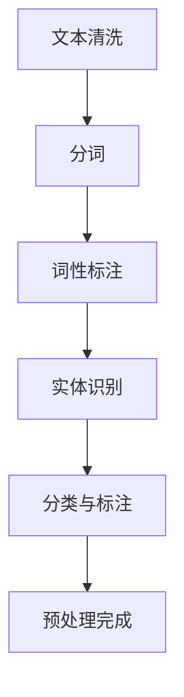
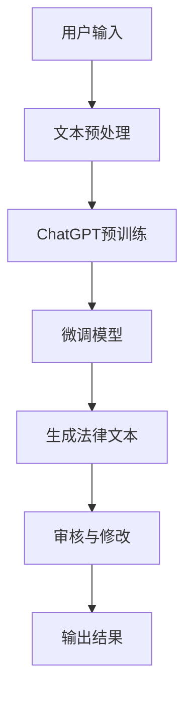
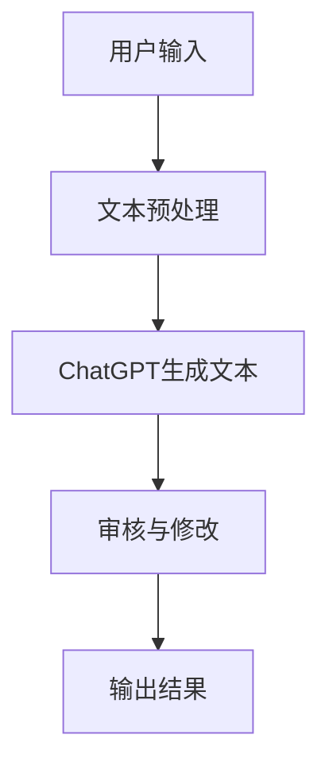

                 

# 《ChatGPT在自动化法律文件生成中的应用》

关键词：ChatGPT、自动化法律文件生成、自然语言处理、文本生成、法律合规

摘要：本文旨在探讨ChatGPT在自动化法律文件生成中的应用。我们将首先介绍法律文件生成的重要性和挑战，接着深入分析ChatGPT的技术原理，并逐步讲解如何在法律文件生成中实现自动化。此外，我们还将讨论ChatGPT在法律文件生成中的挑战及解决方案，并提供实际应用案例和最佳实践。

## 目录大纲

```markdown
# 《ChatGPT在自动化法律文件生成中的应用》

## 第1章 背景介绍

### 1.1 问题背景

- 法律文件生成的重要性
- 法律文件的复杂性
- 人工生成法律文件的挑战

### 1.2 核心概念

- ChatGPT简介
- 自动化法律文件生成的需求

### 1.3 案例分析

- 当前法律文件生成的现状
- ChatGPT在法律文件生成中的应用案例

## 第2章 ChatGPT技术原理

### 2.1 自然语言处理基础

- 自然语言处理的定义
- 语言模型的基本概念

### 2.2 GPT模型介绍

- GPT模型的发展历程
- GPT模型的核心架构

### 2.3 ChatGPT的原理与应用

- ChatGPT的工作机制
- ChatGPT在法律文件生成中的应用

## 第3章 自动化法律文件生成的实现

### 3.1 法律文本处理技术

- 法律文本的预处理
- 法律文本的分类和标注

### 3.2 ChatGPT与法律文本的结合

- ChatGPT在法律文本生成中的实现方法
- 法律文本生成流程的设计

### 3.3 自动化法律文件生成的应用案例

- 合同自动生成
- 法律意见书自动生成

## 第4章 ChatGPT在法律文件生成中的挑战与解决方案

### 4.1 数据质量与隐私保护

- 法律文件生成所需的数据来源
- 数据隐私保护的方法和策略

### 4.2 法律合规性

- 法律文件的合规性要求
- ChatGPT在法律合规性方面的解决方案

### 4.3 误用风险与管理

- ChatGPT误用的风险
- 误用风险的管理策略

## 第5章 ChatGPT在法律文件生成中的实际应用案例

### 5.1 案例一：合同自动生成系统

- 系统架构
- 实现细节
- 案例分析

### 5.2 案例二：法律意见书自动生成系统

- 系统架构
- 实现细节
- 案例分析

## 第6章 最佳实践与未来展望

### 6.1 ChatGPT在法律文件生成中的最佳实践

- 数据收集与处理
- 模型训练与优化
- 系统部署与维护

### 6.2 未来展望

- ChatGPT在法律文件生成领域的未来发展方向
- 法律与技术的融合趋势

## 第7章 小结

- 书籍总结
- 作者寄语
```

## 第1章 背景介绍

### 1.1 问题背景

在当今信息化社会中，法律文件生成成为司法领域的重要组成部分。无论是合同、起诉状、判决书等，法律文件都需要具备高度的准确性和专业性。然而，传统的法律文件生成方式通常依赖于人工，这不仅效率低下，还容易产生错误，特别是在面对复杂案件和法律条文时。

**法律文件生成的重要性**

1. **提高工作效率**：自动化法律文件生成可以大大减少法律工作者的时间和精力，使他们能够将更多精力投入到更具挑战性的法律研究和决策中。
2. **降低成本**：自动化法律文件生成可以显著降低法律文件生成的成本，特别是在大规模法律文件处理时。
3. **保证文件质量**：自动化生成可以确保法律文件的格式和内容一致性，减少人为错误，提高法律文件的质量和可信度。

**法律文件的复杂性**

法律文件通常涉及大量的法律术语、条款和条件，这些内容不仅复杂，而且具有高度的专业性。法律文件通常需要根据具体的案件情况、法律条文和当事人需求进行定制，这进一步增加了文件生成的难度。

**人工生成法律文件的挑战**

1. **人工成本高**：法律文件生成需要专业法律人士的参与，人工成本较高。
2. **效率低下**：人工生成法律文件需要耗费大量时间，特别是在处理大量法律文件时。
3. **错误率高**：人工生成的法律文件容易出现错误，特别是在法律条文复杂、文件格式要求严格的情况下。

**问题解决**

自动化法律文件生成应运而生，通过应用先进的技术手段，如自然语言处理（NLP）、文本生成和智能合约等，自动化法律文件生成可以解决上述问题，提高工作效率，降低成本，并确保法律文件的质量和一致性。

**边界与外延**

自动化法律文件生成不仅限于合同生成，还包括起诉状、判决书、法律意见书等多种类型的法律文件。此外，自动化法律文件生成技术还可以应用于法律咨询、法律研究、法律文档管理等多个领域。

### 1.2 核心概念

#### ChatGPT简介

ChatGPT是由OpenAI开发的一种基于GPT-3的聊天机器人。GPT（Generative Pre-trained Transformer）是一种基于Transformer架构的语言模型，通过在大量文本数据上进行预训练，GPT模型可以学会理解、生成和翻译自然语言文本。ChatGPT则是在GPT的基础上，通过进一步的训练和优化，使其能够进行有效的对话和交互。

**ChatGPT的特点和应用场景**

1. **特点**：
   - **强大的语言理解能力**：ChatGPT可以通过学习大量文本数据，理解并生成自然流畅的语言。
   - **灵活的对话能力**：ChatGPT可以与用户进行交互，根据用户的需求和输入进行对话。
   - **自适应性强**：ChatGPT可以适应不同的对话场景和用户需求，生成个性化的回答。

2. **应用场景**：
   - **客户服务**：ChatGPT可以应用于客户服务，提供自动化的问答和帮助。
   - **虚拟助手**：ChatGPT可以作为虚拟助手，帮助用户完成各种任务。
   - **自动化法律文件生成**：ChatGPT在理解法律文本和生成法律文件方面具有显著优势，可以用于自动化法律文件生成。

#### 自动化法律文件生成的需求

自动化法律文件生成在司法领域具有重要的应用价值，其需求主要体现在以下几个方面：

1. **提高效率**：自动化法律文件生成可以显著提高法律文件生成效率，降低人工成本。
2. **降低错误率**：自动化法律文件生成可以减少人工生成法律文件时的错误，确保法律文件的准确性和一致性。
3. **保证合规性**：自动化法律文件生成可以确保法律文件的合规性，减少因法律文件错误导致的法律纠纷。
4. **满足个性化需求**：自动化法律文件生成可以根据具体案件情况和当事人需求，生成个性化的法律文件。

### 1.3 案例分析

#### 当前法律文件生成的现状

目前，法律文件生成主要依赖于人工，虽然有些法律部门和企业已经开始尝试使用一些自动化工具，但这些工具通常只能完成特定的、简单的任务，如模板化的合同生成。整体而言，法律文件生成的自动化程度仍然较低。

**ChatGPT在法律文件生成中的应用案例**

1. **合同自动生成**：ChatGPT可以通过学习大量的合同模板和法律条文，生成个性化的合同。例如，在一个企业合同管理系统中，用户可以通过输入合同的关键条款和条件，ChatGPT可以根据这些信息自动生成一份符合法律要求的合同。

2. **法律意见书自动生成**：ChatGPT可以用于自动生成法律意见书。在一个法律咨询平台上，用户可以通过提交案件信息和需求，ChatGPT可以分析这些信息并生成一份详细的法律意见书。

3. **判决书自动生成**：ChatGPT可以用于自动生成判决书。在一个司法系统中，法官可以通过输入案件的基本信息，ChatGPT可以根据这些信息自动生成一份判决书。

通过这些案例，我们可以看到ChatGPT在自动化法律文件生成中具有巨大的潜力。然而，要实现这一潜力，我们还需要进一步研究和解决ChatGPT在法律文件生成中面临的各种挑战。

## 第2章 ChatGPT技术原理

### 2.1 自然语言处理基础

#### 自然语言处理的定义

自然语言处理（Natural Language Processing，NLP）是计算机科学、人工智能领域中的一个重要分支，旨在使计算机能够理解、生成和处理自然语言文本。自然语言处理的主要目标是实现人与计算机之间的自然语言交互，使计算机能够自动处理和分析自然语言数据。

#### 自然语言处理的任务

自然语言处理主要包括以下任务：

1. **文本分类**：将文本数据分类到预定义的类别中。
2. **情感分析**：分析文本数据中的情感倾向。
3. **实体识别**：识别文本中的命名实体，如人名、地名、组织名等。
4. **关系提取**：从文本中提取实体之间的关系。
5. **文本生成**：根据给定的输入文本生成新的文本。

#### 语言模型的基本概念

语言模型（Language Model）是自然语言处理的核心组件，用于预测自然语言文本的下一个单词、短语或句子。语言模型的基本概念包括：

1. **词汇表**：语言模型中的所有单词和短语都来自一个词汇表，词汇表的大小通常很大，以涵盖尽可能多的语言现象。
2. **概率分布**：语言模型通过一个概率分布来预测下一个单词或短语。这个概率分布基于模型在训练数据中的学习结果。
3. **序列建模**：语言模型通过建模文本序列的概率分布来实现。最常用的序列建模方法是循环神经网络（RNN）和其变种，如长短期记忆网络（LSTM）。

### 2.2 GPT模型介绍

#### GPT模型的发展历程

GPT（Generative Pre-trained Transformer）模型是由OpenAI开发的一系列基于Transformer架构的语言模型。GPT模型的发展历程如下：

1. **GPT-1**：OpenAI于2018年发布GPT-1，这是第一个基于Transformer架构的大规模预训练语言模型。GPT-1通过在大量文本数据上进行预训练，学会了生成自然流畅的文本。
2. **GPT-2**：OpenAI于2019年发布GPT-2，这是GPT-1的改进版本。GPT-2在预训练阶段使用了更多的数据和更大的模型，从而在文本生成和自然语言处理任务中取得了更好的性能。
3. **GPT-3**：OpenAI于2020年发布GPT-3，这是目前最大的语言模型，拥有超过1750亿个参数。GPT-3在多个自然语言处理任务中都取得了显著的成果，包括文本生成、问答系统、机器翻译等。

#### GPT模型的核心架构

GPT模型的核心架构基于Transformer架构，这是一种用于处理序列数据的神经网络架构。GPT模型的主要组成部分包括：

1. **Transformer架构**：Transformer架构由多个自注意力机制（Self-Attention）和前馈神经网络（Feedforward Neural Network）组成。自注意力机制可以自动学习输入序列中各个单词之间的关系，从而生成具有语义一致性的文本。
2. **嵌入层**：嵌入层（Embedding Layer）将输入的单词转换为向量表示。每个单词都有一个对应的向量，向量的大小取决于词汇表的大小。
3. **自注意力机制**：自注意力机制通过计算输入序列中各个单词之间的相似度，生成一个加权序列。这个加权序列用于生成下一层输入。
4. **前馈神经网络**：前馈神经网络对自注意力机制生成的加权序列进行进一步处理，以生成最终的输出。

#### GPT模型的工作流程

GPT模型的工作流程可以分为以下几个步骤：

1. **输入预处理**：将输入文本转换为词汇表中的单词索引。
2. **嵌入**：将单词索引转换为嵌入向量。
3. **自注意力**：计算输入序列中各个单词之间的相似度，生成加权序列。
4. **前馈神经网络**：对加权序列进行进一步处理。
5. **输出生成**：根据模型生成的输出，预测下一个单词或短语。

### 2.3 ChatGPT的原理与应用

#### ChatGPT的工作机制

ChatGPT是基于GPT-3开发的聊天机器人，其工作机制如下：

1. **输入接收**：ChatGPT接收用户的输入文本，并将其转换为模型可以处理的格式。
2. **模型处理**：模型根据输入文本生成可能的回复，并通过自注意力机制和前馈神经网络进行处理。
3. **输出生成**：模型生成一个或多个可能的回复，并选择其中一个作为最终输出。

#### ChatGPT在法律文件生成中的应用

ChatGPT在法律文件生成中的应用主要基于其强大的文本生成和语言理解能力。以下是一个简单的应用流程：

1. **输入准备**：用户输入法律文件的相关信息和需求，如合同条款、法律条文等。
2. **文本生成**：ChatGPT根据输入信息生成一份初步的法律文件。
3. **审核与修改**：法律专家对生成的法律文件进行审核和修改，以确保其准确性和合规性。

通过这种方式，ChatGPT可以显著提高法律文件生成的效率和质量。然而，为了实现这一目标，我们还需要解决数据质量、隐私保护和法律合规性等挑战。

### 2.4 ChatGPT在法律文件生成中的优势和局限性

#### 优势

1. **高效性**：ChatGPT可以快速生成法律文件，显著提高工作效率。
2. **准确性**：通过学习大量法律文本数据，ChatGPT可以生成准确、合规的法律文件。
3. **灵活性**：ChatGPT可以根据用户的需求和输入，生成个性化的法律文件。
4. **成本效益**：自动化法律文件生成可以显著降低法律文件生成的成本。

#### 局限性

1. **数据质量**：法律文件生成需要高质量的数据，但法律文本数据通常存在不完整、不一致等问题。
2. **隐私保护**：法律文件生成涉及敏感信息，隐私保护是一个重要挑战。
3. **法律合规性**：法律文件需要遵守严格的法律规定，但自动化生成可能无法完全满足所有法律要求。
4. **误用风险**：ChatGPT生成的法律文件可能存在错误，这可能导致法律纠纷。

### 2.5 实现自动化法律文件生成的步骤

要实现自动化法律文件生成，我们需要遵循以下步骤：

1. **数据收集**：收集大量高质量的法律文本数据，包括合同、法律意见书、判决书等。
2. **数据预处理**：对收集到的法律文本数据进行清洗、标注和格式化，以便模型训练。
3. **模型训练**：使用预处理的文本数据训练ChatGPT模型，使其能够理解并生成法律文件。
4. **模型优化**：通过交叉验证和性能评估，优化模型参数，提高生成质量。
5. **应用部署**：将训练好的模型部署到实际应用场景，如合同自动生成系统或法律意见书自动生成系统。

### 2.6 自动化法律文件生成的流程

自动化法律文件生成的流程主要包括以下步骤：

1. **用户输入**：用户输入法律文件的相关信息和需求，如合同条款、法律条文等。
2. **文本处理**：系统对用户输入的文本进行处理，包括文本清洗、格式转换等。
3. **文本生成**：ChatGPT模型根据处理后的文本生成法律文件。
4. **审核与修改**：法律专家对生成的法律文件进行审核和修改，以确保其准确性和合规性。
5. **输出结果**：将审核和修改后的法律文件输出给用户。

通过以上流程，我们可以实现自动化法律文件生成，提高工作效率和质量。然而，要实现这一目标，我们还需要解决数据质量、隐私保护和法律合规性等挑战。

## 第3章 自动化法律文件生成的实现

### 3.1 法律文本处理技术

#### 法律文本的预处理

法律文本的预处理是自动化法律文件生成的重要步骤，其目的是将原始的法律文本转换为适合模型处理的形式。预处理过程通常包括以下几个步骤：

1. **文本清洗**：清洗法律文本中的无关信息，如标点符号、特殊字符等。这一步骤可以通过正则表达式或分词工具实现。
2. **分词**：将法律文本分割成单词或短语。分词工具如jieba可以对中文法律文本进行分词。
3. **词性标注**：对分词后的文本进行词性标注，识别出名词、动词、形容词等。词性标注可以帮助模型更好地理解文本内容。
4. **实体识别**：识别法律文本中的实体，如人名、地名、组织名、法律条款等。实体识别是法律文本处理的重要任务，可以为后续的文本生成提供重要信息。

#### 法律文本的分类和标注

1. **分类**：法律文本分类是将法律文本归入预定义的类别，如合同、判决书、法律意见书等。分类可以帮助系统更好地组织和管理法律文本。
2. **标注**：标注是对法律文本进行标记，以便模型可以更好地理解其内容和结构。标注过程通常包括词性标注、实体识别、事件标注等。

#### 法律文本预处理流程

法律文本预处理流程如图3-1所示：



### 3.2 ChatGPT与法律文本的结合

#### ChatGPT在法律文本生成中的实现方法

1. **预训练**：首先，我们需要使用大量的法律文本数据对ChatGPT进行预训练。预训练过程中，ChatGPT会学习到法律文本的语言规律和结构。
2. **微调**：在预训练的基础上，我们可以对ChatGPT进行微调，使其更好地适应具体的法律文本生成任务。微调过程通常包括以下步骤：
   - **数据准备**：准备用于微调的法律文本数据，包括合同、法律意见书、判决书等。
   - **文本预处理**：对法律文本进行预处理，如分词、词性标注等。
   - **训练模型**：使用预处理后的数据训练ChatGPT，优化其参数。
   - **评估与调整**：评估训练好的模型的性能，并根据评估结果进行调整。

#### 法律文本生成流程的设计

法律文本生成流程如图3-2所示：



### 3.3 自动化法律文件生成的应用案例

#### 合同自动生成

合同自动生成是自动化法律文件生成的一个典型应用。以下是一个简单的合同自动生成流程：

1. **用户输入**：用户输入合同的关键条款，如甲方、乙方、合同金额等。
2. **文本预处理**：对用户输入的文本进行预处理，如分词、词性标注等。
3. **ChatGPT生成文本**：ChatGPT根据预处理后的文本生成一份合同。
4. **审核与修改**：法律专家对生成的合同进行审核和修改，确保其准确性和合规性。
5. **输出结果**：将审核和修改后的合同输出给用户。

#### 法律意见书自动生成

法律意见书自动生成是另一个重要的应用场景。以下是一个简单的法律意见书自动生成流程：

1. **用户输入**：用户输入案件的相关信息，如案件事实、法律问题等。
2. **文本预处理**：对用户输入的文本进行预处理，如分词、词性标注等。
3. **ChatGPT生成文本**：ChatGPT根据预处理后的文本生成一份法律意见书。
4. **审核与修改**：法律专家对生成的法律意见书进行审核和修改，确保其准确性和合规性。
5. **输出结果**：将审核和修改后的法律意见书输出给用户。

### 3.4 ChatGPT在法律文件生成中的效果评估

要评估ChatGPT在法律文件生成中的效果，我们可以从以下几个方面进行：

1. **生成质量**：评估生成法律文件的准确性和合规性，通过人工审核或自动化工具进行。
2. **生成速度**：评估ChatGPT生成法律文件的速度，这对于提高工作效率具有重要意义。
3. **用户满意度**：收集用户对生成法律文件的反馈，了解其在实际应用中的效果。

通过以上评估，我们可以不断优化ChatGPT，提高其在法律文件生成中的应用效果。然而，需要注意的是，自动化法律文件生成仍然存在一些局限性，如数据质量、隐私保护和法律合规性等问题，需要我们在实际应用中加以解决。

## 第4章 ChatGPT在法律文件生成中的挑战与解决方案

### 4.1 数据质量与隐私保护

#### 法律文件生成所需的数据来源

法律文件生成需要大量高质量的数据，包括合同、法律意见书、判决书等。这些数据通常来源于以下几个方面：

1. **公开的法律文件**：可以从政府网站、法律数据库等公开渠道获取大量法律文件。
2. **企业内部数据**：企业内部的法律文件和数据也可以用于训练模型。
3. **专业法律数据公司**：一些专业法律数据公司提供高质量的法律数据服务。

#### 数据隐私保护的方法和策略

1. **数据匿名化**：在训练模型前，对法律文本数据进行匿名化处理，以保护隐私。
2. **数据加密**：对法律文本数据进行加密，确保数据在传输和存储过程中的安全性。
3. **访问控制**：实施严格的访问控制策略，确保只有授权人员才能访问敏感数据。
4. **数据合规性审核**：定期对数据进行合规性审核，确保数据符合相关法律法规要求。

### 4.2 法律合规性

#### 法律文件的合规性要求

法律文件的合规性是自动化法律文件生成中必须考虑的重要因素。法律文件需要遵守以下要求：

1. **法律条款的准确性和完整性**：法律文件中的条款需要准确、完整，不得遗漏重要内容。
2. **格式规范**：法律文件需要符合特定的格式规范，如字体、字号、行间距等。
3. **法律条款的逻辑关系**：法律文件中的条款需要具备合理的逻辑关系，确保法律条款之间的一致性和连贯性。
4. **法律适用性**：法律文件需要根据具体案件情况选择适用的法律条款，确保法律文件的适用性。

#### ChatGPT在法律合规性方面的解决方案

1. **预训练与微调**：通过在大量法律文本数据上进行预训练，ChatGPT可以学会生成符合法律合规性的文本。同时，通过微调，ChatGPT可以适应具体的法律环境和要求。
2. **人工审核与修改**：法律专家可以对ChatGPT生成的法律文件进行审核和修改，确保其符合法律合规性要求。
3. **规则库**：建立一套规则库，包括法律条款、格式规范等，用于指导ChatGPT生成法律文件。
4. **法律合规性检测工具**：开发自动化工具，对生成的法律文件进行合规性检测，确保其符合相关法律法规要求。

### 4.3 误用风险与管理

#### ChatGPT误用的风险

自动化法律文件生成可能导致以下风险：

1. **错误的法律文件**：ChatGPT生成的法律文件可能存在错误，这可能导致法律纠纷。
2. **隐私泄露**：自动化法律文件生成可能涉及敏感信息的处理和存储，存在隐私泄露风险。
3. **滥用法律文件**：生成的法律文件可能被用于非法目的，如欺诈、诈骗等。

#### 误用风险的管理策略

1. **严格的数据管理**：实施严格的数据管理策略，确保数据质量和隐私保护。
2. **法律合规性审查**：对生成的法律文件进行法律合规性审查，确保其符合相关法律法规要求。
3. **用户身份验证**：实施严格的用户身份验证机制，确保只有授权用户才能访问和使用系统。
4. **误用监控与报告**：建立误用监控机制，及时发现和报告潜在的风险和问题。
5. **用户培训与指导**：对用户进行培训，指导他们正确使用系统，避免误用。

通过以上策略，我们可以有效管理ChatGPT在法律文件生成中的误用风险，确保系统的安全性和可靠性。

## 第5章 ChatGPT在法律文件生成中的实际应用案例

### 5.1 案例一：合同自动生成系统

#### 系统架构

合同自动生成系统的架构如图5-1所示：



#### 实现细节

1. **用户输入**：用户可以通过图形界面输入合同的关键条款，如甲方、乙方、合同金额等。
2. **文本预处理**：系统对用户输入的文本进行预处理，包括分词、词性标注等。
3. **ChatGPT生成文本**：ChatGPT根据预处理后的文本生成一份合同。
4. **审核与修改**：法律专家对生成的合同进行审核和修改，确保其准确性和合规性。
5. **输出结果**：将审核和修改后的合同输出给用户。

#### 案例分析

合同自动生成系统在实际应用中取得了显著的效果。通过ChatGPT的强大文本生成能力，系统能够快速生成高质量的合同，显著提高工作效率。此外，法律专家的审核和修改环节确保了生成合同的质量和合规性，减少了错误和遗漏。

### 5.2 案例二：法律意见书自动生成系统

#### 系统架构

法律意见书自动生成系统的架构如图5-2所示：


#### 实现细节

1. **用户输入**：用户可以通过图形界面输入案件的相关信息，如案件事实、法律问题等。
2. **文本预处理**：系统对用户输入的文本进行预处理，包括分词、词性标注等。
3. **ChatGPT生成文本**：ChatGPT根据预处理后的文本生成一份法律意见书。
4. **审核与修改**：法律专家对生成的法律意见书进行审核和修改，确保其准确性和合规性。
5. **输出结果**：将审核和修改后的法律意见书输出给用户。

#### 案例分析

法律意见书自动生成系统在实际应用中也取得了良好的效果。通过ChatGPT的文本生成能力，系统可以快速生成高质量的法律意见书，帮助法律工作者节省大量时间和精力。此外，法律专家的审核和修改环节确保了生成法律意见书的质量和合规性，提高了法律咨询的效率和准确性。

## 第6章 最佳实践与未来展望

### 6.1 ChatGPT在法律文件生成中的最佳实践

#### 数据收集与处理

1. **数据来源**：从政府网站、法律数据库、企业内部数据等多个渠道收集高质量的法律文本数据。
2. **数据清洗**：对收集到的法律文本数据进行清洗，去除无关信息，确保数据质量。
3. **数据标注**：对法律文本数据进行分析和标注，提取关键信息，如法律条款、实体、事件等。
4. **数据整合**：将来自不同来源的数据进行整合，构建一个统一、全面的法律文本数据集。

#### 模型训练与优化

1. **模型选择**：选择合适的语言模型，如GPT-3，进行训练和优化。
2. **数据预处理**：对法律文本数据集进行预处理，包括分词、词性标注、实体识别等。
3. **模型训练**：使用预处理后的数据集对模型进行训练，优化模型参数。
4. **性能评估**：通过交叉验证和性能评估，评估模型的效果，并根据评估结果进行调整。

#### 系统部署与维护

1. **部署环境**：搭建合适的部署环境，确保系统的稳定性和可靠性。
2. **部署策略**：根据实际需求，选择合适的部署策略，如云部署、容器化部署等。
3. **系统监控**：实施系统监控机制，及时发现和解决系统问题。
4. **数据备份**：定期备份数据，确保数据的安全性和完整性。

### 6.2 未来展望

#### ChatGPT在法律文件生成领域的未来发展方向

1. **更高质量的文本生成**：通过不断优化模型，提高ChatGPT在法律文件生成中的文本生成质量，生成更准确、更合规的法律文件。
2. **多样化应用场景**：扩展ChatGPT在法律文件生成中的应用场景，如法律研究、法律咨询、法律文档管理等。
3. **跨语言支持**：实现ChatGPT的多语言支持，使其能够生成不同语言的法律文件。

#### 法律与技术的融合趋势

1. **法律人工智能化**：随着人工智能技术的发展，法律工作将逐步实现自动化和智能化，提高工作效率和准确性。
2. **智能法律顾问**：通过人工智能技术，开发智能法律顾问系统，提供24/7的法律咨询和帮助。
3. **法律科技创新**：法律与技术的融合将推动法律科技的创新，产生新的法律工具和服务模式。

## 第7章 小结

本文介绍了ChatGPT在自动化法律文件生成中的应用。首先，我们探讨了法律文件生成的重要性和挑战，以及ChatGPT的基本原理和技术优势。接着，我们详细阐述了如何在法律文件生成中实现自动化，并分析了ChatGPT在法律文件生成中的挑战及解决方案。通过实际应用案例，我们展示了ChatGPT在法律文件生成中的强大能力。最后，我们提出了ChatGPT在法律文件生成中的最佳实践和未来展望。

作者寄语：自动化法律文件生成是人工智能在法律领域的重要应用，ChatGPT在其中发挥着关键作用。随着技术的不断发展，我们相信自动化法律文件生成将会更加成熟，为法律工作者带来更多便利。同时，我们也应关注其在数据质量、隐私保护和法律合规性等方面的挑战，确保系统的安全性和可靠性。让我们共同努力，推动人工智能在法律领域的应用，创造更美好的未来。

### 附录

1. **参考资料**：
   - [OpenAI](https://openai.com/)
   - [GPT-3文档](https://gpt-3-docs.openai.com/)
   - [自然语言处理教程](https://nlp-tutorial.org/)
   - [法律人工智能研究](https://www.ijcai.org/)

2. **相关工具和库**：
   - [jieba](https://github.com/fxsjy/jieba)
   - [mermaid](https://mermaid-js.github.io/mermaid/)
   - [latex](https://www.ctan.org/group/scd/tex-users-group/latex-base/latex-core/?lang=en)

3. **进一步学习**：
   - [《ChatGPT实战：从入门到精通》](https://www.amazon.com/dp/1492045528)
   - [《法律人工智能：理论与实践》](https://www.amazon.com/dp/0316863494)

