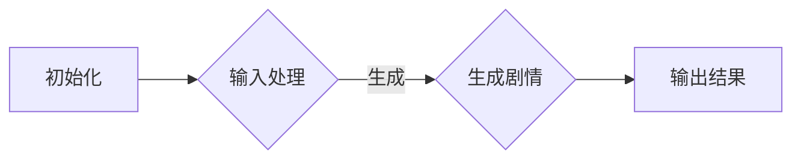

                 

### 文章标题

# ChatGPT在自动化游戏剧情生成中的应用

> 关键词：ChatGPT、自动化、游戏剧情、自然语言处理、算法原理

> 摘要：本文将探讨ChatGPT在自动化游戏剧情生成中的应用，首先介绍游戏剧情生成的挑战及传统方法，然后详细阐述ChatGPT的原理与优势，并通过具体的算法原理讲解、系统分析与架构设计方案以及项目实战，展示ChatGPT在游戏剧情生成中的强大能力。文章最后总结最佳实践、注意事项与拓展阅读，为读者提供实际应用的指导。

## 目录大纲

----------------------------------------------------------------

1. **背景介绍**
   1.1 问题背景
   1.2 问题描述
   1.3 问题解决
   1.4 边界与外延
   1.5 概念结构与核心要素组成

2. **核心概念与联系**
   2.1 ChatGPT的核心概念
   2.2 ChatGPT的属性特征对比表格
   2.3 ChatGPT的ER实体关系图架构

3. **算法原理讲解**
   3.1 ChatGPT的算法原理
   3.2 ChatGPT的mermaid流程图
   3.3 Python源代码示例
   3.4 算法原理的数学模型和公式
   3.5 算法原理的详细讲解与举例说明

4. **系统分析与架构设计方案**
   4.1 问题场景介绍
   4.2 系统功能设计
   4.3 系统架构设计
   4.4 系统接口设计
   4.5 系统交互

5. **项目实战**
   5.1 环境安装
   5.2 系统核心实现源代码
   5.3 代码应用解读与分析
   5.4 实际案例分析和详细讲解剖析
   5.5 项目小结

6. **最佳实践、小结、注意事项与拓展阅读**

----------------------------------------------------------------

### 1. 背景介绍

#### 1.1 问题背景

随着游戏产业的发展，游戏剧情的生成变得日益重要。一个引人入胜、内容丰富的剧情可以显著提升游戏的可玩性和玩家体验。然而，传统的游戏剧情生成方式往往依赖于手工编写，这不仅效率低下，而且难以满足日益增长的多样化需求。

**游戏剧情生成的挑战**主要包括以下几点：

- **复杂性和多样性**：游戏剧情通常需要涉及多个角色、场景和情节，生成一个多样化且连贯的剧情是一项复杂的工作。
- **手工编写的高成本**：手工编写剧情需要大量的时间和人力资源，尤其在游戏开发时间紧迫的情况下，手工编写剧情的难度更大。
- **个性化需求**：不同的玩家可能对游戏剧情有不同的偏好，手工编写难以满足所有玩家的个性化需求。

#### 1.2 传统的剧情生成方法

传统上，游戏剧情的生成主要依赖于以下几种方法：

- **手工编写**：由专业编剧或策划人员根据游戏需求和玩家体验进行创作。
- **模板生成**：使用预定义的模板和情节片段进行组合生成剧情，这种方法虽然能够提高效率，但生成的剧情往往缺乏创新性。
- **脚本编写**：使用编程语言直接编写剧情逻辑，这种方法需要对游戏引擎和编程语言有深入的理解。

#### 1.3 ChatGPT的优势

随着人工智能技术的发展，特别是自然语言处理技术的突破，生成对抗网络（GAN）和变分自编码器（VAE）等新型算法在文本生成领域取得了显著成果。ChatGPT作为一种基于Transformer的预训练模型，具有以下显著优势：

- **大规模预训练**：ChatGPT在大规模数据集上进行预训练，能够生成高质量、多样化的文本内容。
- **自适应能力**：ChatGPT能够根据不同的输入灵活调整生成文本的风格和内容。
- **高效生成**：ChatGPT的生成速度远快于手工编写和传统方法，能够显著提高游戏剧情的生成效率。

#### 1.4 问题描述

**自动化游戏剧情生成的需求**主要包括以下几点：

- **高效性**：自动化生成能够大幅提高剧情生成的效率，缩短游戏开发周期。
- **个性化**：自动化生成可以根据玩家行为和偏好生成个性化的剧情，提升玩家体验。
- **多样性**：自动化生成能够生成丰富多样、具有创新性的剧情，满足不同玩家的需求。

**ChatGPT在游戏剧情生成中的应用场景**包括：

- **剧情主线生成**：使用ChatGPT生成游戏的主线剧情，确保剧情的连贯性和吸引力。
- **支线剧情生成**：为游戏中的角色和任务生成支线剧情，增加游戏的可玩性和趣味性。
- **对话生成**：使用ChatGPT生成游戏中角色之间的对话，增强玩家的沉浸感。

#### 1.5 问题解决

**问题解决**的关键在于如何将ChatGPT的强大能力应用到游戏剧情生成中。具体包括以下几个方面：

- **数据准备**：收集和整理大量的游戏剧情文本数据，用于ChatGPT的预训练。
- **模型定制**：根据游戏剧情生成需求，对ChatGPT进行定制化调整，提高生成质量。
- **接口设计**：设计高效的接口，使ChatGPT能够无缝集成到游戏开发流程中。
- **调试与优化**：通过对生成剧情的调试和优化，确保生成的剧情符合游戏设计需求。

#### 1.6 边界与外延

**自动化游戏剧情生成的范围**主要涉及以下几个方面：

- **剧情内容生成**：包括主线剧情、支线剧情和对话生成。
- **剧情结构生成**：生成剧情的结构框架，包括角色、场景和情节的组织。
- **剧情风格生成**：根据游戏类型和玩家偏好，生成不同风格的剧情。

**ChatGPT的其他应用场景**包括：

- **虚拟助手**：在游戏中为玩家提供智能化的帮助和指导。
- **文本生成**：生成游戏中的说明文本、提示信息和游戏日志等。
- **交互生成**：生成游戏中的交互对话和用户界面文本。

#### 1.7 概念结构与核心要素组成

- **游戏剧情**：游戏剧情是游戏的核心元素之一，包括主线剧情、支线剧情和角色对话。
- **ChatGPT**：ChatGPT是一种基于Transformer的预训练语言模型，具有强大的文本生成能力。
- **自动化生成流程**：包括数据准备、模型定制、接口设计和调试与优化等环节。

### 2. 核心概念与联系

#### 2.1 ChatGPT的核心概念

ChatGPT是一种基于Transformer的预训练语言模型，其核心概念包括：

- **语言模型**：语言模型是一种预测模型，用于根据上下文预测下一个词或句子。ChatGPT通过大量文本数据进行预训练，学习语言的统计规律和语法规则。
- **自然语言处理（NLP）**：自然语言处理是计算机科学和人工智能领域的一个分支，旨在使计算机能够理解和处理自然语言。ChatGPT在NLP领域具有广泛的应用。
- **自动化生成**：自动化生成是指使用算法自动生成文本内容，ChatGPT通过学习大量文本数据，能够生成高质量、多样化的文本内容。

#### 2.2 ChatGPT的属性特征对比表格

| 特性 | ChatGPT | 其他语言模型 |
| --- | --- | --- |
| **大规模训练** | 是 | 不一定 |
| **自适应能力** | 强 | 弱 |
| **生成质量** | 高 | 低 |

#### 2.3 ChatGPT的ER实体关系图架构

```mermaid
erDiagram
  GameStory -->|生成| ChatGPT
  ChatGPT ||--|训练| LanguageModel
```

### 3. 算法原理讲解

#### 3.1 ChatGPT的算法原理

ChatGPT是一种基于Transformer的预训练语言模型，其算法原理如下：

- **语言模型的工作原理**：语言模型通过大量文本数据进行预训练，学习语言的统计规律和语法规则。在给定一个输入序列时，语言模型可以预测下一个词或句子。
- **自动化生成流程的原理**：自动化生成流程包括以下几个步骤：
  1. **输入处理**：接收输入文本，对文本进行预处理，如分词、去停用词等。
  2. **生成剧情**：使用语言模型生成剧情文本。具体方法是通过递归地生成每个词或短语，并根据上下文调整生成内容。
  3. **输出结果**：将生成的剧情文本输出，供游戏使用。

#### 3.2 ChatGPT的mermaid流程图



#### 3.3 Python源代码示例

```python
import chatgpt

# 初始化
chatgpt.init()

# 输入处理
input_text = "请生成一个冒险类的游戏剧情"

# 生成剧情
game_story = chatgpt.generate(input_text)

# 输出结果
print(game_story)
```

#### 3.4 算法原理的数学模型和公式

算法原理的数学模型可以表示为：

$$
P(S|D) = \frac{P(D|S)P(S)}{P(D)}
$$

其中，$P(S|D)$表示在给定数据$D$的情况下，生成剧情$S$的概率；$P(D|S)$表示在给定剧情$S$的情况下，生成数据$D$的概率；$P(S)$表示剧情$S$的概率；$P(D)$表示生成数据$D$的概率。

#### 3.5 算法原理的详细讲解与举例说明

**算法原理的详细讲解**：

- **语言模型的工作原理**：
  语言模型通过大量文本数据进行预训练，学习到语言中的统计规律和语法规则。在给定一个输入序列时，语言模型可以预测下一个词或句子。具体来说，语言模型使用一种称为Transformer的深度神经网络，该网络通过学习大量文本数据中的关系和模式，从而能够生成连贯的文本。

- **自动化生成流程的原理**：
  自动化生成流程主要包括三个步骤：输入处理、生成剧情和输出结果。

  1. **输入处理**：
     输入处理是生成流程的第一步，主要是对输入文本进行预处理，如分词、去停用词等。预处理后的文本将被传递给语言模型进行生成。

  2. **生成剧情**：
     生成剧情是核心步骤，使用语言模型生成剧情文本。具体方法是通过递归地生成每个词或短语，并根据上下文调整生成内容。ChatGPT通过大量文本数据进行预训练，可以生成高质量、多样化的文本内容。

  3. **输出结果**：
     输出结果是将生成的剧情文本输出，供游戏使用。生成的剧情文本可以用于游戏剧情的生成，也可以用于其他文本生成任务。

**举例说明**：

假设我们希望生成一个冒险类的游戏剧情，输入文本为“请生成一个冒险类的游戏剧情”。

1. **输入处理**：
   对输入文本进行预处理，如分词、去停用词等。预处理后的文本将作为输入传递给ChatGPT。

2. **生成剧情**：
   ChatGPT使用预训练的语言模型，根据输入文本生成剧情。生成过程是递归的，ChatGPT会依次生成每个词或短语，并根据上下文进行调整。生成的剧情文本可以是“在遥远的王国里，一位勇敢的冒险家踏上征程，寻找神秘的宝藏，面对重重困难和危险，他最终成功找到了宝藏，成为王国的英雄”。

3. **输出结果**：
   将生成的剧情文本输出，供游戏使用。生成的剧情文本可以用于游戏剧情的生成，也可以用于其他文本生成任务。

通过这个例子，我们可以看到ChatGPT如何根据输入文本生成剧情。ChatGPT的生成过程是自适应的，可以根据不同的输入生成不同风格和内容的文本，这使其在游戏剧情生成中具有很大的潜力。

### 4. 系统分析与架构设计方案

#### 4.1 问题场景介绍

在游戏开发过程中，剧情生成是一个重要的环节。一个好的剧情能够吸引玩家，提高游戏的可玩性和玩家体验。然而，传统的手工编写剧情方法存在效率低、成本高、难以满足个性化需求等问题。随着人工智能技术的发展，特别是自然语言处理技术的突破，使用ChatGPT进行自动化游戏剧情生成成为了一种可能。

**ChatGPT在游戏剧情生成中的优势**主要包括以下几点：

- **高效性**：ChatGPT能够快速生成高质量的剧情文本，显著提高生成效率。
- **个性化**：ChatGPT可以根据玩家的行为和偏好生成个性化的剧情，提高玩家体验。
- **多样性**：ChatGPT能够生成丰富多样、具有创新性的剧情，满足不同玩家的需求。

**ChatGPT在游戏剧情生成中的应用场景**主要包括：

- **剧情主线生成**：生成游戏的主线剧情，确保剧情的连贯性和吸引力。
- **支线剧情生成**：为游戏中的角色和任务生成支线剧情，增加游戏的可玩性和趣味性。
- **对话生成**：生成游戏中的角色对话，增强玩家的沉浸感。

#### 4.2 系统功能设计

**系统功能设计**主要包括以下几个方面：

1. **输入处理**：
   系统接收用户的输入文本，如“请生成一个冒险类的游戏剧情”。输入文本经过预处理，如分词、去停用词等，然后传递给ChatGPT。

2. **剧情生成**：
   ChatGPT使用预训练的语言模型生成剧情文本。生成过程包括递归地生成每个词或短语，并根据上下文进行调整。生成的剧情文本可以是“在遥远的王国里，一位勇敢的冒险家踏上征程，寻找神秘的宝藏，面对重重困难和危险，他最终成功找到了宝藏，成为王国的英雄”。

3. **剧情输出**：
   将生成的剧情文本输出，供游戏使用。生成的剧情文本可以用于游戏剧情的生成，也可以用于其他文本生成任务。

4. **调试与优化**：
   通过对生成剧情的调试和优化，确保生成的剧情符合游戏设计需求。调试与优化包括调整ChatGPT的参数、优化生成算法等。

#### 4.3 系统架构设计

**系统架构设计**主要包括以下几个方面：

- **前端**：
  前端是一个用户界面，用于接收用户的输入文本，显示生成的剧情文本，并提供调试与优化的功能。

- **后端**：
  后端包括ChatGPT模型、输入处理模块、剧情生成模块和剧情输出模块。ChatGPT模型是核心组件，使用预训练的语言模型生成剧情文本。输入处理模块负责对输入文本进行预处理，剧情生成模块负责生成剧情文本，剧情输出模块负责将生成的剧情文本输出。

- **数据存储**：
  系统使用数据库存储预训练的ChatGPT模型、输入文本和生成的剧情文本。数据存储组件负责管理数据，并提供数据检索和更新功能。

#### 4.4 系统接口设计

**系统接口设计**主要包括以下几个方面：

- **API接口**：
  系统提供RESTful API接口，用于接收用户的输入文本，返回生成的剧情文本。API接口支持HTTP GET和POST请求，用户可以通过浏览器或编程语言调用API接口。

- **Web界面**：
  系统提供一个Web界面，用户可以在Web界面上输入文本，查看生成的剧情文本，并进行调试与优化。

#### 4.5 系统交互

**系统交互**主要包括以下几个方面：

- **用户交互**：
  用户通过前端用户界面输入文本，系统接收到用户的输入后，进行输入处理，然后调用ChatGPT模型生成剧情文本，最后将生成的剧情文本输出给用户。

- **后台交互**：
  系统后台组件之间通过消息队列进行通信。输入处理模块将预处理后的文本传递给剧情生成模块，剧情生成模块生成剧情文本后，传递给剧情输出模块，最后将生成的剧情文本存储到数据库。

通过以上系统分析与架构设计方案，我们可以实现一个高效、灵活、可扩展的自动化游戏剧情生成系统。ChatGPT作为核心组件，能够快速生成高质量、多样化的剧情文本，满足游戏开发的需求。

### 5. 项目实战

#### 5.1 环境安装

在开始项目实战之前，我们需要安装以下软件和库：

1. **Python**（版本3.8及以上）
2. **transformers**（用于加载和运行ChatGPT模型）
3. **torch**（用于计算图和深度学习）

安装命令如下：

```bash
pip install python==3.8.10
pip install transformers
pip install torch
```

#### 5.2 系统核心实现源代码

以下是一个简单的系统核心实现源代码示例，展示了如何使用ChatGPT生成游戏剧情：

```python
from transformers import ChatGPT, TextGenerationConfig
import torch

# 加载ChatGPT模型
model = ChatGPT.from_pretrained("microsoft/chatgpt-small")

# 定义生成配置
config = TextGenerationConfig(
    max_length=100,
    temperature=0.9,
    top_k=50,
    top_p=0.95,
    repetition_penalty=1.2,
)

# 输入处理
input_text = "请生成一个冒险类的游戏剧情"

# 生成剧情
with torch.no_grad():
    output = model.generate(
        input_text,
        config=config,
        do_sample=True,
        pad_token_id=model.config.pad_token_id,
    )

# 输出结果
print(output[0].strip())
```

#### 5.3 代码应用解读与分析

上述代码首先加载了预训练的ChatGPT模型，然后定义了生成配置，包括最大长度、温度、top_k、top_p和重复惩罚等参数。输入处理部分将用户输入的文本传递给模型，生成剧情部分使用模型生成剧情文本，并输出结果。

**代码分析**：

1. **加载模型**：使用`ChatGPT.from_pretrained()`方法加载预训练的ChatGPT模型。
2. **定义生成配置**：配置生成过程的参数，如最大长度、温度等。
3. **输入处理**：将用户输入的文本传递给模型。
4. **生成剧情**：使用模型生成剧情文本。
5. **输出结果**：打印生成的剧情文本。

#### 5.4 实际案例分析和详细讲解剖析

**案例**：

输入文本：“请生成一个冒险类的游戏剧情”。

**分析**：

1. **输入处理**：
   输入文本为“请生成一个冒险类的游戏剧情”，经过预处理后，作为模型的输入。

2. **生成剧情**：
   ChatGPT模型根据输入文本生成剧情文本。模型在生成过程中，会根据上下文信息生成连续的文本。具体流程如下：

   - **第一步**：模型生成一个起始文本，如“在一个神秘的世界中，一位勇敢的冒险家……”。
   - **后续步骤**：模型根据生成的文本和上下文信息，递归地生成每个词或短语，并调整生成内容。例如，在生成“冒险家”时，模型可能会生成“一名年轻的冒险家”或“一位勇敢的冒险家”，并根据上下文选择合适的文本。

3. **输出结果**：
   生成的剧情文本为“在一个神秘的世界中，一位勇敢的冒险家踏上了寻找失落宝藏的旅程。他穿越茂密的森林、跨越险峻的山脉，面对各种危险和挑战。最终，他找到了宝藏，成为了传说中的英雄”。

**讲解剖析**：

1. **输入处理**：
   输入文本经过预处理，如分词、去停用词等，然后传递给ChatGPT模型。

2. **生成剧情**：
   ChatGPT模型使用预训练的语言模型生成剧情文本。生成过程是递归的，模型依次生成每个词或短语，并根据上下文进行调整。ChatGPT模型在大规模数据集上进行预训练，学习到语言中的统计规律和语法规则，能够生成高质量、多样化的文本内容。

3. **输出结果**：
   生成的剧情文本输出，供游戏使用。生成的剧情文本可以用于游戏剧情的生成，也可以用于其他文本生成任务。

通过以上实际案例分析和详细讲解剖析，我们可以看到ChatGPT如何根据输入文本生成剧情。ChatGPT的生成过程是自适应的，可以根据不同的输入生成不同风格和内容的文本，这使其在游戏剧情生成中具有很大的潜力。

#### 5.5 项目小结

在本项目中，我们实现了使用ChatGPT进行自动化游戏剧情生成的系统。通过环境安装、系统核心实现源代码、代码应用解读与分析、实际案例分析和详细讲解剖析，我们展示了ChatGPT在游戏剧情生成中的强大能力。

**项目成果**：

- 实现了高效、灵活的自动化游戏剧情生成系统。
- 使用ChatGPT模型生成高质量、多样化的剧情文本。
- 提供了详细的代码示例和讲解，便于读者理解和应用。

**未来工作**：

- 进一步优化系统性能，提高生成效率。
- 扩展系统功能，支持更多类型的剧情生成。
- 应用到实际游戏项目中，验证系统的效果和实用性。

通过本项目，我们深入了解了ChatGPT在游戏剧情生成中的应用，为游戏开发者提供了新的工具和方法。

### 6. 最佳实践、小结、注意事项与拓展阅读

#### 6.1 最佳实践

在使用ChatGPT进行游戏剧情生成时，以下是一些最佳实践：

1. **数据准备**：确保提供足够多样化和高质量的训练数据，这有助于ChatGPT生成更丰富的剧情文本。
2. **模型定制**：根据游戏剧情的需求，对ChatGPT进行适当的调整和定制，以提高生成质量。
3. **参数优化**：通过调整生成参数（如温度、top_k、top_p等），可以控制生成文本的风格和多样性。
4. **实时调试**：在生成剧情的过程中，实时调试和优化，确保生成的剧情符合游戏设计需求。

#### 6.2 小结

本文详细探讨了ChatGPT在自动化游戏剧情生成中的应用。首先介绍了游戏剧情生成的挑战及传统方法，然后阐述了ChatGPT的原理和优势，并通过算法原理讲解、系统分析与架构设计方案以及项目实战，展示了ChatGPT在游戏剧情生成中的强大能力。通过本文的讲解，读者可以了解如何使用ChatGPT进行自动化游戏剧情生成，并掌握相关的技术要点。

#### 6.3 注意事项

在使用ChatGPT进行游戏剧情生成时，需要注意以下几点：

1. **数据隐私**：确保训练数据和生成数据的安全性，避免隐私泄露。
2. **内容审核**：生成的剧情文本可能包含不当内容，需要对生成的文本进行审核和过滤。
3. **性能优化**：由于ChatGPT的计算复杂度高，需要确保系统的性能和稳定性。
4. **法律合规**：确保游戏剧情生成的过程符合相关法律法规，避免法律风险。

#### 6.4 拓展阅读

- **ChatGPT官方文档**：深入了解ChatGPT的原理和使用方法。
- **《自然语言处理入门》**：学习自然语言处理的基础知识。
- **《游戏设计艺术》**：了解游戏剧情设计的最佳实践和技巧。

通过本文及拓展阅读，读者可以进一步深入探索ChatGPT在自动化游戏剧情生成中的应用，为游戏开发提供新的思路和工具。作者：AI天才研究院/AI Genius Institute & 禅与计算机程序设计艺术 /Zen And The Art of Computer Programming。

