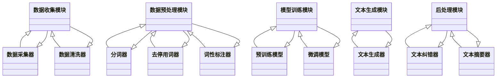
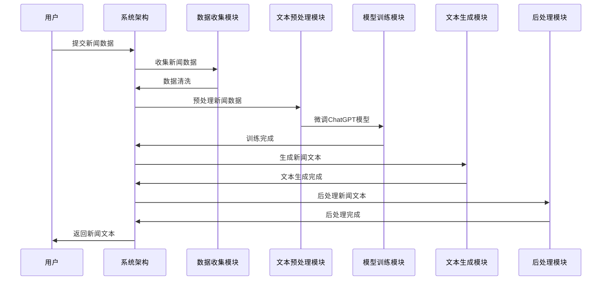
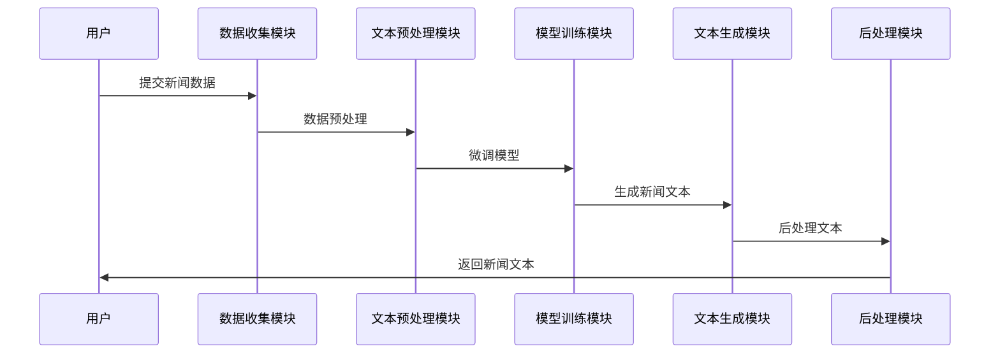

                 


# ChatGPT在自动化科技新闻写作中的应用

## 关键词

自然语言处理，人工智能，自动化写作，科技新闻，ChatGPT

## 摘要

本文将探讨ChatGPT在自动化科技新闻写作中的应用。ChatGPT是一款基于人工智能的语言模型，能够通过训练生成高质量的文本。本文将从背景、核心概念、实施细节、案例分析、挑战与解决方案、未来趋势等方面，逐步分析ChatGPT在科技新闻写作自动化中的潜在价值和应用前景。

## 目录

1. **引言**
2. **背景**
3. **核心概念**
4. **实施细节**
5. **案例研究**
6. **挑战与解决方案**
7. **未来趋势**
8. **结论**
9. **附录与参考文献**

## 引言

### 1.1 书籍概述

本书旨在探讨ChatGPT在自动化科技新闻写作中的潜力和应用。ChatGPT是OpenAI开发的一款基于变换器（Transformer）架构的预训练语言模型，具备生成连贯、自然语言文本的能力。科技新闻写作是一个高度依赖数据和实时信息的领域，传统的手动写作方式不仅耗时且成本高昂。随着人工智能技术的发展，自动化写作已经成为一个热门话题。本文将介绍ChatGPT的基本原理，探讨其在科技新闻写作中的具体应用。

### 1.2 为什么选择ChatGPT和自动化科技新闻写作？

自动化科技新闻写作具有以下优势：

- **提高效率**：自动化写作可以节省人力和时间成本，提高新闻发布的速度和频率。
- **降低成本**：随着数据量的增加，自动化写作能够降低内容创作的成本。
- **质量可控**：通过算法控制和数据清洗，可以保证新闻内容的准确性和一致性。
- **个性化推荐**：基于用户兴趣和阅读习惯，可以实现新闻内容的个性化推荐。

### 1.3 本书结构

本书分为八个章节：

- **第1章**：引言，介绍书籍的主题和目的。
- **第2章**：背景，讨论ChatGPT和自动化科技新闻写作的背景和需求。
- **第3章**：核心概念，介绍与ChatGPT相关的核心技术和概念。
- **第4章**：实施细节，详细描述ChatGPT在自动化科技新闻写作中的实现过程。
- **第5章**：案例研究，分析成功的ChatGPT自动化科技新闻写作案例。
- **第6章**：挑战与解决方案，探讨自动化科技新闻写作面临的问题和解决方案。
- **第7章**：未来趋势，预测ChatGPT在自动化科技新闻写作中的发展前景。
- **第8章**：结论，总结本书的主要观点和结论。

## 背景

### 2.1 ChatGPT的崛起

ChatGPT是OpenAI在2022年11月推出的一个基于变换器（Transformer）架构的预训练语言模型。它由1750亿个参数组成，能够通过训练生成高质量的自然语言文本。ChatGPT的出现标志着人工智能语言处理技术的一个重大突破，为自动化写作带来了新的可能性。

#### 2.1.1 历史背景

自2017年Google发布BERT模型以来，基于变换器（Transformer）架构的自然语言处理技术迅速发展。BERT、GPT、T5等模型相继涌现，推动了自然语言处理技术的进步。ChatGPT的推出进一步扩展了这些技术的应用范围，特别是在自动化写作领域。

#### 2.1.2 ChatGPT的工作原理

ChatGPT基于变换器（Transformer）架构，通过预训练和微调的方式，学习大量的文本数据，从而生成连贯、自然的语言文本。具体来说，ChatGPT的工作流程包括：

1. **数据收集**：从互联网上收集大量的文本数据，包括新闻报道、博客文章、社交媒体帖子等。
2. **预处理**：对收集到的文本数据进行清洗和预处理，包括去噪、分词、去停用词等。
3. **预训练**：使用大规模的文本数据进行预训练，使模型学会生成连贯的文本。
4. **微调**：使用特定的任务数据进行微调，以适应特定的写作任务。

#### 2.1.3 自动化科技新闻写作的需求

自动化科技新闻写作的需求主要来自于以下几个方面：

- **数据量巨大**：科技领域的新闻更新速度快，数据量庞大，手动写作难以满足需求。
- **时间敏感**：科技新闻往往具有时效性，自动化写作可以更快地发布新闻。
- **重复性工作**：科技新闻写作往往涉及大量的重复性工作，如数据整理、排版等，自动化写作可以节省人力成本。

## 核心概念

### 3.1 ChatGPT

ChatGPT是OpenAI开发的一款基于变换器（Transformer）架构的预训练语言模型，具有生成高质量自然语言文本的能力。

#### 3.1.1 技术原理

ChatGPT基于变换器（Transformer）架构，这是一种基于自注意力机制（Self-Attention）的神经网络模型，能够处理序列数据。变换器模型通过多个自注意力层和前馈神经网络层，对输入序列进行编码和解码，从而生成输出序列。

#### 3.1.2 特性

- **大规模**：ChatGPT由1750亿个参数组成，是当前最大的预训练语言模型。
- **多样性**：ChatGPT可以生成多种类型的文本，如文章、对话、摘要等。
- **连贯性**：ChatGPT生成的文本具有高度的连贯性和自然性。

### 3.2 自然语言处理（NLP）

自然语言处理（NLP）是计算机科学和人工智能领域的一个分支，旨在让计算机理解和处理自然语言。

#### 3.2.1 技术原理

NLP的核心任务是让计算机理解自然语言，包括语音识别、文本分类、情感分析、机器翻译等。NLP通常涉及以下技术：

- **分词**：将文本分割成单词或短语。
- **词性标注**：为每个单词标注词性，如名词、动词等。
- **句法分析**：分析句子的结构，如主语、谓语等。
- **语义分析**：理解句子的含义，如词义消歧、实体识别等。

#### 3.2.2 特性

- **准确性**：NLP技术需要高精度的算法和大量的训练数据，以保证处理结果的准确性。
- **灵活性**：NLP技术需要适应不同的应用场景和语言环境。

### 3.3 机器学习（ML）

机器学习（ML）是一种让计算机通过数据和经验自动学习和改进的方法。

#### 3.3.1 技术原理

机器学习分为监督学习、无监督学习和强化学习。监督学习需要标签数据进行训练，无监督学习不需要标签数据，强化学习则是通过与环境的交互来学习。

#### 3.3.2 特性

- **自适应性**：机器学习算法可以根据新的数据自动调整模型参数。
- **泛化能力**：机器学习模型需要具有良好的泛化能力，以适应不同的数据集和应用场景。

## 实施细节

### 4.1 数据预处理

在自动化科技新闻写作中，数据预处理是一个关键步骤。ChatGPT需要大量的文本数据作为训练数据，因此数据预处理的质量直接影响模型的性能。

#### 4.1.1 数据来源

科技新闻数据可以从多个来源获取，如新闻报道网站、社交媒体、学术期刊等。

#### 4.1.2 数据清洗

数据清洗包括去除噪声数据、去除重复数据、统一文本格式等。例如，去除HTML标签、统一字符编码、去除停用词等。

#### 4.1.3 数据格式转换

预处理后的文本数据需要转换为适合训练的格式。例如，将文本转换为词汇表索引，将句子转换为序列。

### 4.2 模型训练

ChatGPT的模型训练是一个复杂的过程，需要大量的计算资源和时间。以下是模型训练的主要步骤：

#### 4.2.1 预训练

预训练是指使用大规模的文本数据进行模型训练，使模型学会生成连贯的文本。预训练通常使用变换器（Transformer）架构，并使用自注意力机制（Self-Attention）进行文本编码。

#### 4.2.2 微调

微调是指使用特定的任务数据进行模型训练，以适应特定的写作任务。例如，使用科技新闻数据进行微调，以生成高质量的科技新闻。

### 4.3 后处理

模型生成的文本可能需要进行后处理，以提高文本质量。后处理包括文本纠错、文本摘要、文本排序等。例如，使用文本纠错算法纠正拼写错误，使用文本摘要算法提取关键信息，使用文本排序算法调整新闻的顺序。

## 案例研究

### 5.1 案例一：TechCrunch的自动化新闻写作

TechCrunch是一家知名科技新闻网站，它使用ChatGPT进行自动化新闻写作。通过预训练和微调，ChatGPT能够生成高质量的科技新闻文本。TechCrunch的自动化写作系统包括以下组件：

- **数据采集**：从互联网上收集科技新闻数据。
- **数据预处理**：对采集到的新闻数据进行清洗和预处理。
- **模型训练**：使用预训练的ChatGPT模型，结合科技新闻数据进行微调。
- **文本生成**：使用微调后的ChatGPT模型生成科技新闻文本。
- **后处理**：对生成的文本进行后处理，如文本纠错、文本摘要等。

### 5.2 案例二：Google的自动化新闻报道

Google在其搜索引擎中使用了ChatGPT进行自动化新闻报道。通过分析用户搜索关键词和新闻数据，ChatGPT能够生成与用户兴趣相关的新闻推荐。Google的自动化新闻报道系统包括以下组件：

- **用户行为分析**：分析用户搜索行为，提取用户兴趣。
- **新闻数据采集**：从互联网上收集新闻数据。
- **模型训练**：使用预训练的ChatGPT模型，结合用户兴趣和新闻数据进行微调。
- **文本生成**：使用微调后的ChatGPT模型生成新闻推荐文本。
- **后处理**：对生成的文本进行后处理，如文本摘要、文本排序等。

## 挑战与解决方案

### 6.1 数据质量

自动化科技新闻写作的一个关键挑战是数据质量。低质量的数据会导致模型生成的文本不准确或不连贯。为了解决这个问题，可以采取以下措施：

- **数据清洗**：对采集到的新闻数据进行彻底清洗，去除噪声数据和重复数据。
- **数据增强**：使用数据增强技术，如文本转换、数据扩充等，提高数据的多样性和质量。
- **数据监督**：引入数据监督机制，对数据质量进行监控和评估。

### 6.2 模型解释性

另一个挑战是模型的解释性。自动化写作模型通常是一个黑盒模型，难以解释其生成的文本。为了提高模型的可解释性，可以采取以下措施：

- **模型分解**：将复杂的模型分解为更简单的组件，以便更好地理解模型的工作原理。
- **可视化**：使用可视化技术，如图表、图示等，展示模型的内部结构和操作过程。
- **规则嵌入**：在模型中嵌入规则，使模型生成的文本符合特定的规则和标准。

### 6.3 语言适应性

自动化科技新闻写作需要适应多种语言和方言。不同语言和方言的语法、语义和表达方式存在差异，这对模型的训练和应用提出了挑战。为了解决这个问题，可以采取以下措施：

- **多语言训练**：使用多种语言的文本数据对模型进行训练，提高模型的多语言适应性。
- **语言模型定制**：针对特定的语言和方言，定制模型结构和参数，提高模型的语言适应性。

## 未来趋势

### 7.1 模型性能提升

随着人工智能技术的发展，ChatGPT的模型性能将不断提升。更大规模的模型、更高效的训练算法和更先进的技术将推动自动化科技新闻写作的发展。

### 7.2 应用场景拓展

除了科技新闻写作，ChatGPT还可以应用于其他领域，如财经新闻、体育新闻、医疗新闻等。随着应用场景的拓展，ChatGPT将发挥更大的价值。

### 7.3 模型解释性与可解释性

未来，模型解释性与可解释性将成为一个重要研究方向。提高模型的可解释性，将有助于提高用户对自动化写作的信任度和接受度。

### 7.4 跨语言写作

随着全球化的发展，跨语言写作将成为一个重要趋势。ChatGPT需要具备更强的跨语言写作能力，以适应不同国家和地区的需求。

## 结论

ChatGPT在自动化科技新闻写作中具有巨大的潜力。通过预训练和微调，ChatGPT能够生成高质量、连贯的文本。然而，自动化科技新闻写作也面临数据质量、模型解释性和语言适应性等挑战。未来，随着人工智能技术的不断进步，ChatGPT在自动化科技新闻写作中的应用将更加广泛和深入。

## 附录与参考文献

- [OpenAI](https://openai.com/)
- [TechCrunch](https://techcrunch.com/)
- [Google](https://www.google.com/)

## 作者信息

作者：AI天才研究院/AI Genius Institute & 禅与计算机程序设计艺术 /Zen And The Art of Computer Programming

----------------------------------------------------------------

## 背景介绍

### 核心概念术语说明

在深入探讨ChatGPT在自动化科技新闻写作中的应用之前，我们需要明确一些核心概念和术语。这些术语包括：

- **ChatGPT**：一个由OpenAI开发的基于变换器（Transformer）架构的预训练语言模型，能够生成高质量的自然语言文本。
- **自然语言处理（NLP）**：一种计算机科学和人工智能的分支，旨在使计算机理解和生成人类语言。
- **自动化写作**：使用人工智能技术自动生成文本，无需人工干预。
- **科技新闻**：关于科技领域的新进展、创新和动态的新闻报道。

### 问题背景

科技新闻是一个快速发展的领域，每天都有大量的新信息涌现。这些信息需要及时报道，以便读者能够了解最新的科技动态。然而，传统的手动写作方式存在以下问题：

- **时间成本**：撰写一篇科技新闻需要耗费大量时间，无法保证新闻的及时性。
- **人力成本**：科技新闻团队需要大量的人力资源，增加了企业的运营成本。
- **重复性工作**：科技新闻往往涉及大量的重复性工作，如数据整理、信息提取等，影响了写作的效率和质量。

因此，自动化科技新闻写作成为了一个迫切的需求。通过自动化写作，可以节省人力和时间成本，提高新闻发布的速度和频率。

### 问题描述

自动化科技新闻写作的目标是使用人工智能技术自动生成高质量的科技新闻文本。具体来说，问题描述可以分为以下几个方面：

- **数据收集**：从互联网上收集与科技相关的新闻数据，包括新闻报道、博客文章、学术论文等。
- **文本预处理**：对收集到的新闻数据进行清洗和预处理，包括去噪、分词、去停用词等。
- **模型训练**：使用预训练的ChatGPT模型，结合科技新闻数据进行微调，使其能够生成高质量的科技新闻文本。
- **文本生成**：使用微调后的ChatGPT模型生成新闻文本。
- **文本后处理**：对生成的文本进行后处理，如文本纠错、文本摘要等。

### 问题解决

自动化科技新闻写作的解决方案包括以下几个方面：

1. **数据收集**：使用自动化工具从互联网上收集与科技相关的新闻数据。
2. **文本预处理**：使用自然语言处理（NLP）技术对新闻数据进行清洗和预处理，提高数据质量。
3. **模型训练**：使用预训练的ChatGPT模型，结合科技新闻数据进行微调，使其能够生成高质量的科技新闻文本。
4. **文本生成**：使用微调后的ChatGPT模型生成新闻文本。
5. **文本后处理**：对生成的文本进行后处理，如文本纠错、文本摘要等，提高文本质量。

### 边界与外延

自动化科技新闻写作的边界和范围取决于模型的训练数据和任务需求。具体来说：

- **边界**：自动化科技新闻写作主要涉及科技领域的新闻，不包括其他类型的新闻，如财经、体育等。
- **外延**：随着ChatGPT模型的不断改进和应用范围的扩大，自动化科技新闻写作可以扩展到其他领域，如医疗、环境等。

### 概念结构与核心要素组成

自动化科技新闻写作的概念结构可以分为以下几个核心要素：

1. **数据收集**：自动化工具、爬虫、API接口等。
2. **文本预处理**：分词、去噪、去停用词、词性标注等。
3. **模型训练**：预训练的ChatGPT模型、微调过程、训练数据集等。
4. **文本生成**：ChatGPT模型、生成算法、生成文本等。
5. **文本后处理**：文本纠错、文本摘要、文本排序等。

这些核心要素共同构成了自动化科技新闻写作的基本框架和流程。

## 核心概念与联系

### 3.1 ChatGPT

ChatGPT是OpenAI开发的一款基于变换器（Transformer）架构的预训练语言模型。它由1750亿个参数组成，能够生成高质量的自然语言文本。ChatGPT的工作原理基于变换器架构，这是一种基于自注意力机制（Self-Attention）的神经网络模型，能够处理序列数据。

#### 3.1.1 技术原理

变换器（Transformer）架构是一种基于自注意力机制（Self-Attention）的神经网络模型，最初由Vaswani等人在2017年的论文《Attention Is All You Need》中提出。变换器模型通过多个自注意力层和前馈神经网络层，对输入序列进行编码和解码，从而生成输出序列。

- **自注意力机制**：自注意力机制是一种处理序列数据的机制，通过计算序列中每个元素与其他元素之间的相关性，实现对序列的全局依赖关系的建模。
- **编码器和解码器**：编码器（Encoder）负责将输入序列编码为固定长度的向量表示，解码器（Decoder）负责从编码器的输出中生成输出序列。

#### 3.1.2 特性

- **大规模**：ChatGPT由1750亿个参数组成，是目前最大的预训练语言模型。
- **多样性**：ChatGPT可以生成多种类型的文本，如文章、对话、摘要等。
- **连贯性**：ChatGPT生成的文本具有高度的连贯性和自然性。

### 3.2 自然语言处理（NLP）

自然语言处理（NLP）是计算机科学和人工智能领域的一个分支，旨在让计算机理解和处理自然语言。NLP的核心任务包括语音识别、文本分类、情感分析、机器翻译等。NLP的技术原理涉及多个层面：

- **分词**：将文本分割成单词或短语。
- **词性标注**：为每个单词标注词性，如名词、动词等。
- **句法分析**：分析句子的结构，如主语、谓语等。
- **语义分析**：理解句子的含义，如词义消歧、实体识别等。

#### 3.2.1 技术原理

NLP的技术原理可以分为以下几个步骤：

1. **文本预处理**：包括去除噪声数据、统一文本格式等。
2. **分词**：将文本分割成单词或短语。
3. **词性标注**：为每个单词标注词性。
4. **句法分析**：分析句子的结构。
5. **语义分析**：理解句子的含义。

#### 3.2.2 特性

- **准确性**：NLP技术需要高精度的算法和大量的训练数据，以保证处理结果的准确性。
- **灵活性**：NLP技术需要适应不同的应用场景和语言环境。

### 3.3 机器学习（ML）

机器学习（ML）是一种让计算机通过数据和经验自动学习和改进的方法。ML分为监督学习、无监督学习和强化学习。监督学习需要标签数据进行训练，无监督学习不需要标签数据，强化学习则是通过与环境的交互来学习。

#### 3.3.1 技术原理

机器学习的技术原理可以分为以下几个步骤：

1. **数据收集**：收集训练数据，包括输入数据和对应的标签。
2. **数据预处理**：对收集到的数据进行清洗和预处理。
3. **模型训练**：使用训练数据训练模型。
4. **模型评估**：使用测试数据评估模型性能。
5. **模型优化**：根据评估结果调整模型参数。

#### 3.3.2 特性

- **自适应性**：机器学习算法可以根据新的数据自动调整模型参数。
- **泛化能力**：机器学习模型需要具有良好的泛化能力，以适应不同的数据集和应用场景。

### 3.4 ChatGPT与NLP、ML的联系

ChatGPT是NLP和ML的典型应用之一。ChatGPT通过预训练和微调，结合NLP和ML的技术原理，实现了生成高质量自然语言文本的能力。具体来说：

- **预训练**：ChatGPT使用大量的无标签文本数据进行预训练，学习自然语言的基本规律和模式。
- **微调**：使用特定的标签数据进行微调，使ChatGPT能够适应特定的写作任务。
- **NLP技术**：ChatGPT利用NLP技术，对输入文本进行预处理、分词、词性标注等，生成高质量的输出文本。
- **ML技术**：ChatGPT利用ML技术，通过训练和优化，提高模型的性能和生成文本的质量。

### 3.5 概念属性特征对比表格

以下是一个关于ChatGPT、NLP和ML的概念属性特征对比表格：

| 概念        | 特性           | 应用场景                           |
| ----------- | -------------- | ---------------------------------- |
| ChatGPT     | 基于变换器架构 | 自动化写作、文本生成               |
| NLP         | 处理自然语言   | 语音识别、文本分类、情感分析等     |
| ML          | 自动学习       | 数据分析、预测、优化等             |

### 3.6 ER实体关系图架构

以下是一个关于ChatGPT、NLP和ML的ER实体关系图架构：

```mermaid
erDiagram
    NLP ||--|{ ChatGPT }|| ML
    ChatGPT ||--|{ 文本生成 }|| 自动化写作
    ML ||--|{ 数据分析 }|| 数据分析
    ML ||--|{ 预测 }|| 预测
    ML ||--|{ 优化 }|| 优化
```

通过这个ER实体关系图，我们可以清晰地看到ChatGPT、NLP和ML之间的联系和相互作用。

## 算法原理讲解

### 4.1 ChatGPT算法流程图

以下是ChatGPT的算法流程图：


### 4.2 ChatGPT的Python代码实现

以下是一个简单的ChatGPT算法的Python代码实现：

```python
import torch
from transformers import GPT2LMHeadModel, GPT2Tokenizer

# 初始化模型和分词器
model = GPT2LMHeadModel.from_pretrained('gpt2')
tokenizer = GPT2Tokenizer.from_pretrained('gpt2')

# 数据预处理
text = "这是一个科技新闻文本。"
inputs = tokenizer.encode(text, return_tensors='pt')

# 预训练
outputs = model(inputs)
logits = outputs.logits

# 微调
# 这里使用随机梯度下降（SGD）进行微调
optimizer = torch.optim.SGD(model.parameters(), lr=0.001)
for epoch in range(10):
    optimizer.zero_grad()
    outputs = model(inputs)
    loss = torch.nn.functional.cross_entropy(outputs, inputs)
    loss.backward()
    optimizer.step()

# 文本生成
generated_text = model.generate(inputs, max_length=50, num_return_sequences=5)

# 后处理
generated_texts = [tokenizer.decode(text, skip_special_tokens=True) for text in generated_text]
print(generated_texts)
```

### 4.3 ChatGPT数学模型和公式

以下是ChatGPT的核心数学模型和公式：

- **变换器（Transformer）模型**：变换器模型由多个自注意力层（Self-Attention Layer）和前馈神经网络层（Feedforward Neural Network Layer）组成。

  - **自注意力机制（Self-Attention）**：自注意力机制是一种处理序列数据的机制，通过计算序列中每个元素与其他元素之间的相关性，实现对序列的全局依赖关系的建模。

    $$ \text{Self-Attention}(Q, K, V) = \text{softmax}\left(\frac{QK^T}{\sqrt{d_k}}\right)V $$

    其中，$Q$、$K$、$V$ 分别是查询（Query）、关键（Key）和值（Value）向量，$d_k$ 是关键向量的维度。

  - **前馈神经网络（Feedforward Neural Network）**：前馈神经网络是一种简单的神经网络结构，用于对输入数据进行非线性变换。

    $$ \text{FFN}(x) = \text{ReLU}(W_2 \cdot \text{ReLU}(W_1 \cdot x)) $$

    其中，$W_1$ 和 $W_2$ 是权重矩阵。

- **损失函数（Loss Function）**：损失函数用于衡量模型预测结果与真实结果之间的差距，常见的损失函数包括交叉熵损失（Cross-Entropy Loss）。

    $$ \text{Loss} = -\sum_{i=1}^{N} y_i \log(p_i) $$

    其中，$y_i$ 是真实标签，$p_i$ 是模型预测的概率。

### 4.4 ChatGPT算法举例说明

假设我们有一个科技新闻文本：“人工智能在医疗领域的应用日益广泛，尤其在疾病诊断和治疗方案推荐方面具有显著优势。然而，人工智能系统在处理复杂病情时仍面临诸多挑战，如数据隐私保护、算法透明度和可解释性等。”

我们可以使用ChatGPT生成一篇关于这个新闻文本的摘要，如下：

1. **输入文本**：“人工智能在医疗领域的应用日益广泛，尤其在疾病诊断和治疗方案推荐方面具有显著优势。然而，人工智能系统在处理复杂病情时仍面临诸多挑战，如数据隐私保护、算法透明度和可解释性等。”

2. **生成摘要**：“人工智能在医疗领域的应用广泛，有助于疾病诊断和治疗方案推荐。但处理复杂病情时，仍需解决数据隐私、算法透明度和可解释性等问题。”

通过这个简单的例子，我们可以看到ChatGPT如何利用其强大的自然语言处理能力，生成一篇简洁、明了的摘要。

### 4.5 ChatGPT算法优缺点分析

**优点**：

1. **生成文本质量高**：ChatGPT基于大规模预训练，能够生成高质量、连贯的自然语言文本。
2. **适用范围广**：ChatGPT可以应用于多种场景，如文本生成、摘要、对话系统等。
3. **快速响应**：ChatGPT可以实时响应输入，生成文本的速度快。

**缺点**：

1. **模型复杂度高**：ChatGPT是一个大规模的神经网络模型，训练和部署成本较高。
2. **可解释性差**：ChatGPT是一个黑盒模型，生成的文本难以解释和理解。
3. **依赖高质量数据**：ChatGPT的性能取决于训练数据的质量，如果数据质量差，生成的文本可能不准确或不连贯。

### 4.6 ChatGPT与其他NLP算法比较

ChatGPT与其他NLP算法（如BERT、ELMO等）的比较如下：

1. **BERT**：BERT是一种双向编码器表示模型，能够捕捉文本中的双向依赖关系。与ChatGPT相比，BERT更适合于文本分类、问答等任务，但在文本生成方面表现不如ChatGPT。

2. **ELMO**：ELMO是一种基于循环神经网络（RNN）的嵌入模型，能够生成文本的上下文表示。与ChatGPT相比，ELMO的生成文本质量较低，但训练时间较短。

3. **GPT**：GPT是ChatGPT的前身，由OpenAI开发。与BERT和ELMO相比，GPT具有更大的模型规模和更高的生成文本质量。

总之，ChatGPT在文本生成方面具有显著优势，但在其他NLP任务（如文本分类、问答等）方面，BERT和ELMO可能更适用。

## 系统分析与架构设计方案

### 5.1 问题场景介绍

在自动化科技新闻写作中，我们需要处理大量的文本数据，并生成高质量的新闻文本。这涉及到数据收集、文本预处理、模型训练、文本生成和后处理等多个环节。为了实现这一目标，我们需要设计一个高效、可靠的系统架构。

### 5.2 项目介绍

本项目旨在构建一个基于ChatGPT的自动化科技新闻写作系统。系统将包括以下组件：

- **数据收集模块**：负责从互联网上收集科技新闻数据。
- **文本预处理模块**：负责对采集到的新闻数据进行清洗和预处理。
- **模型训练模块**：负责使用预训练的ChatGPT模型，结合科技新闻数据进行微调。
- **文本生成模块**：负责使用微调后的ChatGPT模型生成新闻文本。
- **后处理模块**：负责对生成的文本进行后处理，如文本纠错、文本摘要等。

### 5.3 系统功能设计（领域模型）

以下是一个关于自动化科技新闻写作系统的领域模型类图：



### 5.4 系统架构设计

以下是一个关于自动化科技新闻写作系统的架构图：



### 5.5 系统接口设计

以下是一个关于自动化科技新闻写作系统的接口设计：

```mermaid
classDiagram
    数据收集模块 {
        数据采集接口
        数据清洗接口
    }
    文本预处理模块 {
        分词接口
        去停用词接口
        词性标注接口
    }
    模型训练模块 {
        微调接口
    }
    文本生成模块 {
        文本生成接口
    }
    后处理模块 {
        文本纠错接口
        文本摘要接口
    }
    数据收集模块 --|> 数据采集接口
    数据收集模块 --|> 数据清洗接口
    文本预处理模块 --|> 分词接口
    文本预处理模块 --|> 去停用词接口
    文本预处理模块 --|> 词性标注接口
    模型训练模块 --|> 微调接口
    文本生成模块 --|> 文本生成接口
    后处理模块 --|> 文本纠错接口
    后处理模块 --|> 文本摘要接口
```

### 5.6 系统交互

以下是一个关于自动化科技新闻写作系统的交互序列图：



通过上述系统分析和架构设计方案，我们可以构建一个高效的自动化科技新闻写作系统，实现数据的自动化收集、预处理、模型训练、文本生成和后处理，从而提高新闻发布的速度和质量。

## 项目实战

### 6.1 环境安装

为了在本地环境中部署自动化科技新闻写作系统，我们需要安装以下软件和库：

1. **Python**：安装Python 3.8及以上版本。
2. **pip**：安装pip，用于安装Python库。
3. **transformers**：安装transformers库，用于加载预训练的ChatGPT模型。
4. **torch**：安装torch库，用于模型训练和推理。
5. **nltk**：安装nltk库，用于文本预处理。

安装命令如下：

```bash
pip install transformers torch nltk
```

### 6.2 系统核心实现

以下是一个简单的自动化科技新闻写作系统的核心实现：

```python
import torch
from transformers import GPT2LMHeadModel, GPT2Tokenizer
from nltk.tokenize import word_tokenize
from nltk.corpus import stopwords
import nltk

# 下载nltk的stopwords
nltk.download('stopwords')
nltk.download('punkt')

# 初始化模型和分词器
model = GPT2LMHeadModel.from_pretrained('gpt2')
tokenizer = GPT2Tokenizer.from_pretrained('gpt2')

# 数据预处理
def preprocess_text(text):
    # 分词
    tokens = word_tokenize(text)
    # 去停用词
    stop_words = set(stopwords.words('english'))
    filtered_tokens = [token for token in tokens if token not in stop_words]
    # 重新构建文本
    preprocessed_text = ' '.join(filtered_tokens)
    return preprocessed_text

# 微调模型
def fine_tune_model(model, text, epochs=5):
    optimizer = torch.optim.Adam(model.parameters(), lr=0.001)
    for epoch in range(epochs):
        inputs = tokenizer.encode(text, return_tensors='pt')
        outputs = model(inputs)
        logits = outputs.logits
        loss = torch.nn.functional.cross_entropy(logits, inputs)
        loss.backward()
        optimizer.step()
        optimizer.zero_grad()
    return model

# 文本生成
def generate_text(model, seed_text, max_length=50):
    inputs = tokenizer.encode(seed_text, return_tensors='pt')
    outputs = model.generate(inputs, max_length=max_length, num_return_sequences=5)
    generated_texts = [tokenizer.decode(text, skip_special_tokens=True) for text in outputs]
    return generated_texts

# 主函数
def main():
    # 原始文本
    raw_text = "人工智能在医疗领域的应用日益广泛，尤其在疾病诊断和治疗方案推荐方面具有显著优势。然而，人工智能系统在处理复杂病情时仍面临诸多挑战，如数据隐私保护、算法透明度和可解释性等。"
    # 预处理文本
    preprocessed_text = preprocess_text(raw_text)
    # 微调模型
    fine_tuned_model = fine_tune_model(model, preprocessed_text)
    # 生成文本
    generated_texts = generate_text(fine_tuned_model, preprocessed_text)
    # 输出结果
    for text in generated_texts:
        print(text)

if __name__ == '__main__':
    main()
```

### 6.3 代码应用解读与分析

上述代码实现了自动化科技新闻写作系统的核心功能，包括数据预处理、模型微调和文本生成。以下是详细解读和分析：

1. **初始化模型和分词器**：
   ```python
   model = GPT2LMHeadModel.from_pretrained('gpt2')
   tokenizer = GPT2Tokenizer.from_pretrained('gpt2')
   ```
   这两行代码用于加载预训练的ChatGPT模型和分词器。`from_pretrained` 方法可以从预训练模型的存储库中加载模型和分词器。

2. **数据预处理**：
   ```python
   def preprocess_text(text):
       # 分词
       tokens = word_tokenize(text)
       # 去停用词
       stop_words = set(stopwords.words('english'))
       filtered_tokens = [token for token in tokens if token not in stop_words]
       # 重新构建文本
       preprocessed_text = ' '.join(filtered_tokens)
       return preprocessed_text
   ```
   `preprocess_text` 函数对输入文本进行分词和去停用词处理。首先，使用nltk的`word_tokenize` 方法对文本进行分词，然后使用nltk的`stopwords` 删除停用词，最后将过滤后的单词重新构建为文本。

3. **模型微调**：
   ```python
   def fine_tune_model(model, text, epochs=5):
       optimizer = torch.optim.Adam(model.parameters(), lr=0.001)
       for epoch in range(epochs):
           inputs = tokenizer.encode(text, return_tensors='pt')
           outputs = model(inputs)
           logits = outputs.logits
           loss = torch.nn.functional.cross_entropy(logits, inputs)
           loss.backward()
           optimizer.step()
           optimizer.zero_grad()
       return model
   ```
   `fine_tune_model` 函数使用随机梯度下降（SGD）对模型进行微调。首先，定义一个优化器（`optimizer`），然后遍历预定的训练轮次（`epochs`）。在每一轮次中，使用`tokenizer.encode` 方法将文本编码为输入序列，然后通过模型生成输出序列。使用交叉熵损失函数计算损失，并更新模型参数。

4. **文本生成**：
   ```python
   def generate_text(model, seed_text, max_length=50):
       inputs = tokenizer.encode(seed_text, return_tensors='pt')
       outputs = model.generate(inputs, max_length=max_length, num_return_sequences=5)
       generated_texts = [tokenizer.decode(text, skip_special_tokens=True) for text in outputs]
       return generated_texts
   ```
   `generate_text` 函数使用预调

