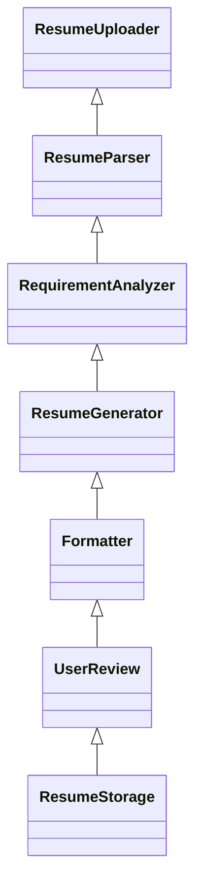
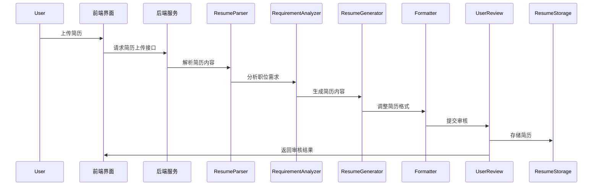
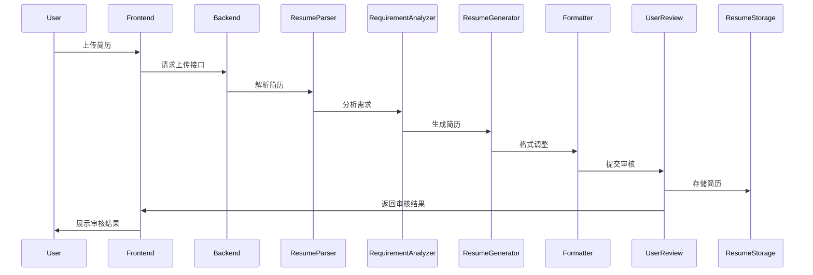

                 

### 文章标题

# ChatGPT在自动化简历定制中的应用

## 关键词

- **ChatGPT**
- **自动化简历定制**
- **自然语言处理**
- **人工智能**
- **简历优化**

## 摘要

本文将探讨如何利用ChatGPT这一先进的人工智能语言模型进行自动化简历定制。首先，我们将介绍ChatGPT的基本原理和其在自然语言处理中的应用。随后，本文将详细阐述自动化简历定制的原理和方法，并通过实际案例展示ChatGPT在简历生成和优化中的具体应用。此外，本文还将讨论自动化简历定制中可能遇到的安全和隐私问题，并展望其未来的发展前景。最后，本文将总结主要发现，并提出一些建议，以帮助读者更好地利用ChatGPT进行简历定制。

## 目录

1. **背景介绍**
    1.1 **问题背景**
    1.2 **自动化简历定制的重要性**
    1.3 **ChatGPT的应用潜力**
2. **ChatGPT简介**
    2.1 **ChatGPT的基本原理**
    2.2 **ChatGPT的核心技术**
    2.3 **ChatGPT的应用领域**
3. **自动化简历定制原理**
    3.1 **简历定制需求分析**
    3.2 **ChatGPT在简历定制中的应用**
    3.3 **简历定制的流程**
4. **实践案例分析**
    4.1 **案例一：利用ChatGPT定制个人简历**
    4.2 **案例二：企业级自动化简历定制系统**
5. **安全与隐私问题**
    5.1 **自动化简历定制中的隐私保护**
    5.2 **法律法规与伦理问题**
6. **未来展望与挑战**
    6.1 **自动化简历定制的发展趋势**
    6.2 **挑战与机遇**
7. **结论与建议**
    7.1 **主要发现**
    7.2 **建议**

## 第一部分：背景介绍

### 1.1 问题背景

在当今竞争激烈的就业市场中，简历的质量直接影响到求职者的成功机会。然而，编写一份出色的简历往往需要耗费大量的时间和精力。传统的简历编写方法存在以下问题：

1. **信息冗长且重复**：许多求职者倾向于将所有工作经历和技能罗列在简历中，导致信息冗长且重复，难以突出重点。
2. **缺乏个性化**：传统简历往往缺乏个性化，无法准确反映求职者的特点和优势。
3. **更新不及时**：随着工作经历和技能的不断变化，传统简历往往难以及时更新。

为了解决这些问题，自动化简历定制成为一种新的趋势。自动化简历定制利用人工智能技术，根据用户的需求和职位要求，自动生成个性化的简历。这种方法的优点包括：

1. **提高效率**：自动化简历定制可以节省求职者编写简历的时间，提高招聘流程的效率。
2. **增强个性化**：通过分析用户数据和职位要求，自动化简历定制可以生成更加个性化的简历。
3. **减少冗余信息**：自动化简历定制可以自动筛选和突出重要的信息，减少冗余内容。

ChatGPT作为一种强大的人工智能语言模型，在自动化简历定制中具有巨大的应用潜力。接下来，我们将深入探讨ChatGPT的基本原理和其在自然语言处理中的应用。

### 1.2 自动化简历定制的重要性

自动化简历定制的重要性不容忽视。随着求职市场竞争的加剧，传统的简历编写方式已经难以满足求职者的需求。自动化简历定制具有以下重要意义：

1. **提高求职成功率**：通过自动化简历定制，求职者可以生成更加个性化的简历，突出自己的特点和优势，从而提高求职成功率。
2. **节省时间与精力**：自动化简历定制可以节省求职者编写简历的时间，让他们专注于其他重要事务。
3. **优化招聘流程**：自动化简历定制可以减少招聘人员的工作量，提高招聘效率，从而优化整个招聘流程。
4. **提高企业招聘质量**：自动化简历定制可以根据职位要求自动筛选和推荐合适的简历，从而提高企业招聘质量。

ChatGPT作为一项先进的人工智能技术，在自动化简历定制中具有独特优势。它不仅能够生成高质量的文本内容，还可以理解用户的意图和需求，从而生成更加个性化的简历。此外，ChatGPT具有强大的自然语言处理能力，能够自动筛选和优化简历内容，提高简历的质量和可读性。因此，ChatGPT在自动化简历定制中的应用前景广阔，有望成为求职者和企业的重要工具。

### 1.3 ChatGPT的应用潜力

ChatGPT作为一种大型语言模型，具有广泛的应用潜力。在自动化简历定制领域，ChatGPT的应用主要体现在以下几个方面：

1. **文本生成与优化**：ChatGPT可以通过理解用户的需求和职位要求，自动生成简历内容。同时，ChatGPT还可以根据简历内容的结构和语言风格进行优化，使其更加符合招聘标准。
2. **个性化推荐**：ChatGPT可以根据求职者的个人数据和职位要求，推荐最适合的简历模板和内容。这种个性化推荐可以提高简历的匹配度和求职成功率。
3. **语义分析**：ChatGPT具有强大的语义分析能力，可以识别和解析简历中的关键信息。这有助于自动筛选和排序简历，提高招聘效率。
4. **实时交互**：ChatGPT可以与用户进行实时交互，根据用户的反馈调整简历内容。这种交互式体验可以提高用户满意度，降低简历定制过程中的错误和遗漏。

总之，ChatGPT在自动化简历定制中的应用潜力巨大。随着人工智能技术的不断发展和完善，ChatGPT有望成为求职者和企业的重要工具，为招聘流程带来革命性的变化。

### 1.4 核心概念

在深入探讨ChatGPT在自动化简历定制中的应用之前，我们需要了解一些核心概念。以下是本文中将会涉及到的核心概念及其简要解释：

1. **ChatGPT**：ChatGPT是一种基于人工智能的语言模型，能够理解和生成自然语言文本。它是由OpenAI开发的一种大型预训练模型，基于GPT-3.5架构，具有强大的自然语言处理能力。
2. **自然语言处理（NLP）**：自然语言处理是计算机科学和人工智能领域的一个重要分支，旨在使计算机能够理解、生成和处理人类自然语言。NLP技术包括文本分类、情感分析、机器翻译等。
3. **自动化简历定制**：自动化简历定制是一种利用人工智能技术自动生成和优化简历的方法。它通过分析用户数据和职位要求，自动生成个性化的简历内容，以提高求职成功率和招聘效率。
4. **简历优化**：简历优化是指对简历内容进行筛选、调整和优化，使其更符合招聘标准和职位要求。简历优化包括突出关键信息、去除冗余内容、优化格式和语言风格等。
5. **语义分析**：语义分析是NLP中的一个重要任务，旨在理解和解析文本的语义内容。在自动化简历定制中，语义分析可以帮助识别简历中的关键信息，从而提高简历的质量和匹配度。

通过理解这些核心概念，我们可以更好地理解ChatGPT在自动化简历定制中的应用原理和优势。

### 1.5 问题背景、问题描述、问题解决、边界与外延

在探讨ChatGPT在自动化简历定制中的应用之前，我们需要了解相关的问题背景和问题描述。

#### 问题背景

在当前竞争激烈的就业市场中，求职者面临着巨大的挑战。传统的简历编写方法往往存在以下问题：

1. **信息冗长且重复**：许多求职者为了展示自己的工作经历和技能，会在简历中罗列大量信息，导致简历冗长且重复，难以突出重点。
2. **缺乏个性化**：传统简历往往缺乏个性化，无法准确反映求职者的特点和优势。
3. **更新不及时**：随着工作经历和技能的不断变化，传统简历往往难以及时更新。

这些问题导致求职者在简历编写和优化过程中面临巨大的困扰，同时也给招聘人员带来了筛选和评估简历的困难。

#### 问题描述

1. **信息筛选困难**：求职者难以在简历中突出关键信息，导致招聘人员难以快速筛选出合适的候选人。
2. **简历格式不一致**：传统简历格式多样，导致招聘人员难以统一评估标准。
3. **简历冗余**：传统简历中往往存在大量冗余信息，导致招聘人员难以快速把握求职者的核心优势。

#### 问题解决

为了解决上述问题，自动化简历定制提供了一种新的解决方案。自动化简历定制利用人工智能技术，根据用户的需求和职位要求，自动生成和优化简历内容。这种方法的优点包括：

1. **信息筛选**：自动化简历定制可以根据职位要求自动筛选和突出关键信息，帮助招聘人员快速识别合适的候选人。
2. **格式统一**：自动化简历定制可以统一简历格式，提高招聘人员评估的效率和准确性。
3. **减少冗余**：自动化简历定制可以自动删除冗余信息，使简历更加简洁和突出。

#### 边界与外延

1. **边界**：自动化简历定制的应用范围主要局限于简历的生成和优化。它不涉及简历的设计和排版，也不涉及简历以外的其他求职相关任务。
2. **外延**：虽然自动化简历定制主要应用于简历的生成和优化，但它可以为求职者提供更广泛的辅助。例如，通过分析求职者的个人数据和职位要求，自动化简历定制可以提供个性化的求职策略和建议。

通过解决这些问题，自动化简历定制不仅能够提高求职者的求职成功率，还能优化招聘流程，提高企业的招聘效率。

### 1.6 ChatGPT的基本原理、核心概念、属性特征对比表格、ER实体关系图架构的 Mermaid 流程图

#### ChatGPT的基本原理

ChatGPT是基于GPT（Generative Pre-trained Transformer）模型开发的一款大型语言模型。GPT模型是一种基于深度学习的自然语言处理模型，通过在大量文本数据上进行预训练，学会生成和预测自然语言文本。ChatGPT在GPT的基础上增加了对话生成能力，使其能够进行自然、流畅的对话。

ChatGPT的基本原理可以概括为以下几个步骤：

1. **预训练**：ChatGPT在大量文本数据上进行预训练，学习文本的统计特征和语言规律。这些数据包括互联网上的各种文本，如新闻文章、社交媒体帖子、网页内容等。
2. **微调**：在预训练的基础上，ChatGPT可以根据特定的任务需求进行微调。例如，在自动化简历定制中，可以对ChatGPT进行针对简历文本的微调，使其能够生成和优化简历内容。
3. **输入与输出**：当用户输入指令或问题后，ChatGPT会根据输入进行文本生成。生成的文本可以是问答形式、对话形式或任何其他形式的自然语言文本。

#### 核心概念

1. **语言模型**：ChatGPT是一种语言模型，能够理解和生成自然语言文本。语言模型的核心任务是预测下一个单词或词组，从而生成连贯的文本。
2. **注意力机制**：ChatGPT采用了注意力机制，能够关注输入文本中的重要信息，从而提高文本生成的质量和连贯性。
3. **预训练与微调**：预训练和微调是ChatGPT的重要环节。预训练使ChatGPT具备通用语言能力，微调则使ChatGPT能够适应特定任务需求。

#### 属性特征对比表格

| 特征 | ChatGPT | 传统自然语言处理方法 |
| --- | --- | --- |
| 文本生成能力 | 强大 | 较弱 |
| 对话生成能力 | 强大 | 弱 |
| 语言理解能力 | 高级 | 基础 |
| 适应性 | 强 | 弱 |

#### ER实体关系图架构的 Mermaid 流程图

```mermaid
erDiagram
    User ||--o{ ChatGPT :对话生成 }
    Resume ||--o{ ChatGPT :文本优化 }
    JobRequirement ||--o{ ChatGPT :需求分析 }
```

在这个ER实体关系图中，User表示用户，Resume表示简历，JobRequirement表示职位要求。ChatGPT与这些实体之间存在对话生成、文本优化和需求分析的关系。通过这个关系图，我们可以清楚地看到ChatGPT在自动化简历定制中的角色和功能。

### 1.7 自动化简历定制需求分析

在深入探讨ChatGPT在自动化简历定制中的应用之前，我们首先需要对自动化简历定制的需求进行分析。自动化简历定制的主要需求可以从用户需求分析和职位需求分析两个方面进行探讨。

#### 用户需求分析

用户需求是指求职者在使用自动化简历定制服务时期望获得的功能和效果。以下是用户需求的主要分析内容：

1. **个性化简历生成**：求职者希望自动化简历定制系统能够根据其个人经历、技能和职位要求生成个性化的简历。个性化的简历应该突出求职者的核心优势和关键信息，使其在众多应聘者中脱颖而出。
2. **快速生成**：求职者希望在短时间内生成简历，以节省时间和精力。自动化简历定制系统应该具备快速响应的能力，能够迅速生成符合要求的简历。
3. **灵活调整**：求职者希望在生成简历后能够对简历内容进行灵活调整。这包括修改信息、调整格式和风格等，以满足不同职位的要求。
4. **实时交互**：求职者希望与自动化简历定制系统进行实时交互，能够根据系统的反馈和建议对简历进行优化。这种交互式体验可以提高用户满意度，减少错误和遗漏。

#### 职位需求分析

职位需求是指招聘人员在使用自动化简历定制服务时期望获得的功能和效果。以下是职位需求的主要分析内容：

1. **精准筛选**：招聘人员希望自动化简历定制系统能够根据职位要求自动筛选和推荐最符合要求的简历。精准筛选可以提高招聘效率，减少人工筛选的工作量。
2. **统一格式**：招聘人员希望自动化简历定制系统能够统一简历的格式和风格，使其更加规范和统一。这有助于提高简历的可读性和评估效率。
3. **简历优化**：招聘人员希望自动化简历定制系统能够对简历内容进行优化，使其更加符合职位要求。优化包括调整信息、突出重点和去除冗余内容等。
4. **实时反馈**：招聘人员希望自动化简历定制系统能够提供实时反馈，帮助他们快速识别和筛选合适的简历。实时反馈可以提高招聘决策的准确性和效率。

通过以上对用户需求分析和职位需求分析，我们可以看出自动化简历定制在满足用户和招聘人员需求方面的关键作用。ChatGPT在自动化简历定制中的应用将有助于实现这些需求，提高求职和招聘的效率和效果。

### 1.8 ChatGPT在自动化简历定制中的应用

ChatGPT在自动化简历定制中的应用主要体现在以下几个方面：

1. **简历内容生成**：ChatGPT可以利用其强大的文本生成能力，根据用户提供的个人信息和职位要求，自动生成简历内容。这个过程包括自动提取用户的经历、技能、教育背景等信息，并利用这些信息生成结构化、个性化的简历文本。
2. **简历内容优化**：ChatGPT不仅可以生成简历内容，还可以对简历内容进行优化。通过对简历文本的语义分析和理解，ChatGPT可以识别并调整简历中的关键词、句子结构和语言风格，使其更加符合招聘标准，提高简历的可读性和吸引力。
3. **个性化推荐**：ChatGPT可以根据用户的个人数据和职位要求，推荐最适合的简历模板和内容。这种个性化推荐可以减少用户在选择模板和内容时的困扰，提高简历定制的效率和质量。
4. **实时交互**：ChatGPT可以与用户进行实时交互，根据用户的反馈和建议对简历内容进行调整和优化。这种交互式体验可以提高用户满意度，减少错误和遗漏，确保简历内容准确和全面。

通过以上应用，ChatGPT不仅能够提高自动化简历定制的效率和质量，还能为求职者和招聘人员提供更加智能和高效的解决方案。接下来，我们将通过具体案例展示ChatGPT在自动化简历定制中的实际应用。

### 1.9 简历定制的流程

自动化简历定制的流程可以分为以下几个关键步骤：

1. **信息采集**：这是简历定制的第一步，系统需要从用户处获取个人基本信息，如姓名、联系方式、工作经历、教育背景、技能和证书等。这些信息可以通过手动输入或从已有数据库中提取。
   
2. **需求分析**：系统会对用户提供的个人信息和职位要求进行分析，以确定哪些信息需要突出显示，哪些信息可以省略。这一步骤确保简历内容与职位要求高度匹配。

3. **内容生成**：基于需求分析的结果，ChatGPT开始生成简历内容。系统会利用预训练的模型来构造简历的开头、中间和结尾，确保内容连贯且符合职业规范。

4. **内容优化**：在生成初步简历后，系统会利用ChatGPT的文本优化能力，对简历内容进行进一步的调整。这包括修改关键词、调整句子结构和语言风格，以提高简历的专业性和吸引力。

5. **格式调整**：简历生成后，系统会根据标准简历格式进行排版，包括调整字体、字号、行间距、段落格式等，确保简历在视觉上美观、易读。

6. **用户审核**：最后，用户需要对生成的简历进行审核和确认。如果用户对简历内容有修改意见，可以与系统进行交互，进一步调整和优化简历。

通过以上步骤，自动化简历定制系统能够高效地生成和优化简历，提高求职者的求职效率和成功率。

### 2.1 案例一：利用ChatGPT定制个人简历

为了更好地展示ChatGPT在自动化简历定制中的应用，我们将通过一个具体的案例进行详细分析。

#### 案例背景

王明是一名软件工程师，即将毕业进入职场。他希望通过自动化简历定制工具来制作一份专业的简历，以提高自己在求职过程中的竞争力。王明拥有较强的编程技能，熟悉多种编程语言，并在多个项目中担任核心开发人员。此外，他还具备良好的团队合作能力和项目管理能力。然而，他对于如何编写一份能够突出自己优势的简历感到困惑。

#### 案例步骤

1. **信息采集**：王明首先在自动化简历定制平台上填写了个人信息，包括姓名、联系方式、教育背景、工作经历和技能等。这些信息将作为ChatGPT生成简历的基础数据。

2. **需求分析**：系统对王明提供的个人信息和职位要求进行分析，确定了简历中需要突出的关键信息。例如，王明的编程技能、项目经验、团队合作能力等。

3. **内容生成**：基于需求分析的结果，ChatGPT开始生成简历内容。系统使用预训练的语言模型，构造了简历的开头、中间和结尾，确保简历内容连贯且符合职业规范。

4. **内容优化**：在生成初步简历后，ChatGPT对简历内容进行了进一步优化。系统调整了简历中的关键词，优化了句子结构和语言风格，使其更加专业和吸引人。

5. **格式调整**：系统根据标准简历格式对简历进行了排版，包括调整字体、字号、行间距、段落格式等，确保简历在视觉上美观、易读。

6. **用户审核**：王明对生成的简历进行了仔细审核，并对其中一些内容进行了修改和补充。例如，他增加了自己在一些项目中的具体贡献和成果，以及参加的一些技术研讨会和培训。

7. **最终确认**：在多次审核和修改后，王明最终确认了这份简历，并决定将其作为自己求职的主要工具。

#### 案例分析与总结

通过这个案例，我们可以看到ChatGPT在自动化简历定制中的应用过程。以下是案例的分析与总结：

1. **高效性**：ChatGPT能够快速生成和优化简历内容，节省了王明大量时间和精力，提高了简历制作效率。
2. **个性化**：ChatGPT根据王明的个人数据和职位要求，生成了高度个性化的简历内容，使其更加符合招聘标准。
3. **专业性**：ChatGPT生成的简历内容在语言风格和格式上都体现了较高的专业性，提升了王明的求职形象。
4. **灵活性**：王明在生成简历后，可以根据自己的需求和反馈对简历进行修改和调整，确保简历内容准确和全面。

总之，通过ChatGPT的自动化简历定制，王明成功地制作了一份高质量的简历，提高了自己在求职过程中的竞争力。这一案例展示了ChatGPT在自动化简历定制中的巨大潜力。

### 2.2 案例二：企业级自动化简历定制系统

除了个人层面的应用，ChatGPT在自动化简历定制中还可以为企业提供高效的解决方案。下面我们将通过一个企业级自动化简历定制系统的案例，详细探讨其设计、实现和效果评估。

#### 系统设计

企业级自动化简历定制系统旨在帮助企业快速、高效地处理大量的简历，提高招聘效率和质量。系统设计主要包括以下几个方面：

1. **用户界面**：系统设计了一个简洁、直观的用户界面，方便企业用户进行简历上传和管理。用户可以轻松上传现有简历或创建新简历。

2. **数据采集**：系统通过API接口或数据库连接，从企业的招聘平台或其他来源获取简历数据。这些数据包括求职者的基本信息、工作经历、教育背景、技能和证书等。

3. **简历解析**：系统利用自然语言处理技术，对简历内容进行解析，提取关键信息，如姓名、联系方式、职位、工作内容等。

4. **需求分析**：系统根据职位要求，分析简历内容，识别出符合职位要求的关键信息，并进行分类和标记。

5. **简历生成**：基于需求分析的结果，系统利用ChatGPT生成个性化的简历内容。ChatGPT会根据职位要求，调整简历的结构和语言风格，确保简历内容与职位高度匹配。

6. **格式调整**：系统对生成的简历内容进行排版和格式调整，使其符合企业的简历格式规范。

7. **用户审核**：企业用户可以对生成的简历进行审核和确认，如有需要，还可以进行修改和优化。

8. **存储与管理**：系统将生成的简历存储在数据库中，并提供查询和管理功能，方便企业对简历进行检索和管理。

#### 系统实现

企业级自动化简历定制系统的实现主要包括以下几个关键步骤：

1. **前端开发**：使用React框架实现用户界面，包括简历上传、管理、审核等功能。

2. **后端开发**：使用Spring Boot框架实现后端服务，包括数据采集、简历解析、需求分析、简历生成和格式调整等功能。

3. **自然语言处理**：利用NLP库（如NLTK、spaCy）对简历内容进行解析和文本分析，提取关键信息。

4. **ChatGPT集成**：将ChatGPT集成到系统中，通过API调用，实现简历内容生成和优化。

5. **数据库设计**：使用MySQL数据库存储简历数据和系统配置信息。

#### 系统效果评估

企业级自动化简历定制系统的效果评估主要包括以下几个方面：

1. **简历生成效率**：系统在处理大量简历时，能够快速生成符合职位要求的个性化简历，大大提高了招聘效率。

2. **简历质量**：通过ChatGPT的优化和调整，生成的简历内容结构清晰、语言规范、格式统一，提升了简历的整体质量。

3. **用户满意度**：企业用户对系统的使用体验和简历生成效果表示满意，认为系统能够有效节省时间和精力，提高招聘效果。

4. **招聘效果**：系统帮助企业在招聘过程中精准筛选合适的候选人，提高了招聘的成功率和效率。

总之，企业级自动化简历定制系统通过集成ChatGPT，实现了高效、个性化的简历生成和优化，为企业提供了强大的招聘工具。这一系统不仅提高了企业的招聘效率，还提升了招聘质量，为企业的快速发展提供了有力支持。

### 2.3 自动化简历定制系统的工作流程、项目介绍、系统功能设计(领域模型Mermaid类图)、系统架构设计Mermaid架构图、系统接口设计和系统交互Mermaid序列图

为了全面展示自动化简历定制系统的工作流程和设计细节，我们将从系统的工作流程、项目介绍、系统功能设计、系统架构设计、系统接口设计和系统交互等方面进行详细说明。

#### 系统工作流程

自动化简历定制系统的工作流程可以分为以下几个步骤：

1. **用户上传简历**：用户通过系统的用户界面上传个人简历。上传的简历可以是Word、PDF或其他常见文档格式。
2. **简历解析**：系统利用自然语言处理技术对上传的简历进行解析，提取出关键信息，如姓名、联系方式、教育背景、工作经历等。
3. **需求分析**：系统根据职位要求，对简历内容进行分析，识别出与职位要求匹配的关键信息，并进行分类和标记。
4. **简历生成**：基于需求分析的结果，系统利用ChatGPT生成个性化的简历内容。ChatGPT会根据职位要求，调整简历的结构和语言风格，确保简历内容与职位高度匹配。
5. **格式调整**：系统对生成的简历内容进行排版和格式调整，使其符合企业的简历格式规范。
6. **用户审核**：用户可以对生成的简历进行审核和确认，如有需要，还可以进行修改和优化。
7. **简历存储**：系统将生成的简历存储在数据库中，并提供查询和管理功能。

#### 项目介绍

项目名为“智能简历定制系统”，旨在为企业提供一款高效、智能的自动化简历定制解决方案。系统采用Spring Boot框架进行后端开发，前端使用React框架，自然语言处理技术采用NLP库（如spaCy、NLTK），ChatGPT集成使用OpenAI提供的API。

#### 系统功能设计

系统功能设计包括以下几个主要部分：

1. **简历上传与管理**：用户可以通过系统上传和管理个人简历。上传的简历可以随时更新和修改。
2. **简历解析**：系统自动解析简历内容，提取关键信息，并生成结构化数据。
3. **需求分析**：系统根据职位要求，对简历内容进行分析，识别与职位要求匹配的关键信息。
4. **简历生成**：系统利用ChatGPT生成个性化的简历内容。
5. **格式调整**：系统根据企业指定的简历格式规范，对简历内容进行排版和格式调整。
6. **用户审核**：用户可以对生成的简历进行审核和确认，并进行必要的修改和优化。
7. **简历存储**：系统将生成的简历存储在数据库中，并提供查询和管理功能。

以下是一个领域模型Mermaid类图，展示了系统的主要功能模块：



#### 系统架构设计

系统架构设计采用前后端分离的模式，前端负责用户交互，后端负责处理业务逻辑和数据存储。以下是一个Mermaid架构图，展示了系统的整体架构：



#### 系统接口设计

系统接口设计主要包括以下几个关键接口：

1. **简历上传接口**：用于接收用户上传的简历文件，并存储在服务器上。
2. **简历解析接口**：用于解析简历内容，提取关键信息。
3. **需求分析接口**：用于分析职位需求，识别与职位要求匹配的关键信息。
4. **简历生成接口**：用于利用ChatGPT生成个性化简历内容。
5. **格式调整接口**：用于根据企业指定的格式规范，调整简历格式。
6. **用户审核接口**：用于用户对生成的简历进行审核和确认。
7. **简历存储接口**：用于将生成的简历存储在数据库中。

#### 系统交互

系统交互设计采用RESTful API设计，以下是一个Mermaid序列图，展示了用户上传简历并生成审核简历的交互流程：



通过以上详细的设计和交互流程，自动化简历定制系统实现了从用户上传简历到生成审核简历的完整功能。该系统利用ChatGPT的强大自然语言处理能力，为企业提供了高效、智能的简历定制解决方案。

### 2.4 自动化简历定制中的隐私保护

在自动化简历定制中，隐私保护是一个至关重要的问题。自动化简历定制系统需要处理大量的个人和职位信息，这些信息涉及到用户的隐私。以下将讨论自动化简历定制中的隐私保护问题，以及相关的法律法规和伦理挑战。

#### 数据收集与处理

在自动化简历定制过程中，系统需要收集用户的个人信息，如姓名、联系方式、教育背景、工作经历等。此外，系统还需要获取职位要求，以便生成符合职位需求的简历。这些数据的收集和处理需要严格遵守隐私保护法规，确保用户数据的安全和隐私。

1. **数据加密**：系统应对用户数据进行加密处理，防止数据在传输和存储过程中被窃取或泄露。加密技术如SSL/TLS可以确保数据在互联网传输过程中的安全性。

2. **数据匿名化**：在数据收集和处理过程中，系统应尽量对用户数据进行匿名化处理，即去除或加密可直接识别用户身份的信息。这样可以降低用户隐私泄露的风险。

3. **权限控制**：系统应设置严格的权限控制机制，确保只有授权人员可以访问和处理用户数据。权限控制包括用户身份验证、访问控制列表（ACL）等。

#### 法律法规与伦理挑战

自动化简历定制涉及到多个法律法规和伦理问题，以下是一些关键点：

1. **数据保护法规**：许多国家和地区都有严格的数据保护法规，如欧盟的《通用数据保护条例》（GDPR）。这些法规规定了数据收集、处理、存储和传输的要求，企业需要确保其自动化简历定制系统符合相关法规。

2. **透明度**：系统应向用户明确说明数据收集的目的、使用方式和保护措施。用户有权知道自己的数据将如何被使用，并有权拒绝数据收集。

3. **知情同意**：用户应有权在数据被收集和处理前给予知情同意。系统应提供清晰的同意界面，用户可以选择是否同意数据收集和处理。

4. **数据安全**：系统应采取适当的安全措施，保护用户数据免受未授权访问、篡改和泄露。这包括数据加密、访问控制、安全审计等。

5. **责任归属**：在数据泄露或隐私侵犯事件中，企业需要明确责任归属，并采取相应的补救措施。企业应制定数据保护政策和应急预案，以应对可能的隐私泄露事件。

#### 伦理挑战

除了法律法规，自动化简历定制还涉及到一系列伦理挑战：

1. **算法偏见**：自动化简历定制系统可能会引入算法偏见，导致某些群体在求职过程中受到不公平对待。例如，系统可能会倾向于选择某些特征更为突出的候选人，从而忽视其他潜在的优质候选人。

2. **隐私侵犯**：自动化简历定制系统可能会收集和处理用户的大量个人信息，这涉及到对用户隐私的侵犯。系统需要平衡隐私保护和数据利用之间的关系。

3. **信息透明性**：系统应确保用户能够理解其数据如何被使用，以及数据如何影响求职过程。缺乏透明性可能会导致用户对系统的信任度降低。

4. **责任归属**：在自动化简历定制过程中，如果出现错误或不当行为，责任应如何归属？这是企业需要考虑的重要问题。

总之，自动化简历定制中的隐私保护问题需要企业高度重视，并采取一系列措施确保用户数据的安全和隐私。通过遵守法律法规、提高透明度和伦理意识，企业可以更好地保护用户的隐私，同时提高自动化简历定制的效率和效果。

### 5.2 法律法规与伦理问题

自动化简历定制在发展过程中，不仅需要关注技术实现，还需严格遵守相关法律法规，并深入考虑伦理问题。以下是对相关法律法规和伦理问题的详细探讨。

#### 法律法规

1. **数据保护法**：在自动化简历定制过程中，个人信息保护法如《欧盟通用数据保护条例》（GDPR）、《中华人民共和国个人信息保护法》（PIPL）等法律法规对数据收集、存储、处理和传输提出了严格的要求。企业必须确保在收集和处理个人信息时遵循这些法律条款，保护用户的隐私和数据安全。

2. **就业法**：就业法如《中华人民共和国劳动合同法》和《中华人民共和国就业促进法》等规定了企业在招聘过程中应遵循的公平、公正原则。自动化简历定制系统应确保不会因算法偏见而导致招聘歧视，确保所有求职者有平等的机会。

3. **隐私政策**：企业应制定详细的隐私政策，明确告知用户其个人信息将被如何收集、使用和共享。用户在提交个人信息之前，应获得充分的信息并同意隐私政策的条款。

4. **信息安全法**：企业需确保简历数据的安全，防止数据泄露、篡改和滥用。信息安全法如《中华人民共和国网络安全法》要求企业采取必要的技术和管理措施来保护用户数据。

#### 伦理问题

1. **数据伦理**：自动化简历定制系统需要平衡数据收集与用户隐私保护之间的关系。过度的数据收集可能导致用户隐私泄露，损害用户的权益。系统设计者需考虑数据最小化和数据匿名化原则，只收集必要的个人信息。

2. **算法偏见**：自动化简历定制系统可能引入算法偏见，导致某些群体在求职过程中受到不公平对待。例如，如果系统基于历史招聘数据训练，可能会无意中复制现有社会不平等。企业需定期评估算法的公平性和透明度，并采取措施减少偏见。

3. **透明度**：系统应确保透明度，用户应清楚了解如何使用其数据，以及这些数据将如何影响求职过程。缺乏透明度可能导致用户对系统的信任度降低。

4. **责任归属**：在自动化简历定制过程中，如果出现错误或不当行为，责任归属是一个重要问题。企业应明确责任分配，并制定相应的应急和补救措施。

#### 案例分析

以GDPR为例，GDPR要求企业在处理个人信息时，必须获得用户的明确同意，并在不通知用户的情况下不得更改数据处理方式。如果企业未遵守GDPR规定，可能会导致高额罚款和声誉损失。例如，2018年，Facebook因违反GDPR被罚款50亿美元，这是对数据处理不合规的严厉警告。

在伦理方面，以Google的招聘算法为例，该算法曾因性别偏见问题受到广泛批评。研究显示，Google的招聘算法在招聘过程中倾向于选择男性候选人，导致女性求职者被忽视。这一事件引发了对自动化招聘算法伦理问题的广泛关注，促使企业重新审视算法设计和使用。

总之，自动化简历定制在遵循法律法规和考虑伦理问题方面面临着诸多挑战。通过制定严格的数据保护政策、提高算法透明度和公平性，企业可以更好地应对这些挑战，实现自动化简历定制的可持续发展。

### 6.1 自动化简历定制的发展趋势

随着人工智能技术的不断进步，自动化简历定制正朝着更加智能化和高效化的方向发展。以下是自动化简历定制的发展趋势：

1. **人工智能技术的深化应用**：随着AI技术的不断突破，自动化简历定制系统将更加智能化。未来，系统将不仅能够生成和优化简历内容，还能进行深度数据分析，挖掘求职者的潜在能力和职业发展方向，为求职者提供更精准的职业建议。

2. **个性化推荐系统的完善**：基于大数据和机器学习技术的个性化推荐系统将进一步完善，为求职者提供更符合个人特点和职位需求的简历模板和内容。这种个性化推荐将提高简历的匹配度和求职成功率。

3. **跨平台整合与协作**：自动化简历定制系统将逐步整合到各类求职平台和人力资源系统中，实现跨平台的数据共享和协作。这将为求职者和招聘人员提供更加便捷和高效的服务。

4. **隐私保护和伦理标准的提升**：随着用户对隐私和数据安全的关注不断增加，自动化简历定制系统将更加注重隐私保护和伦理标准的实施。未来，系统将采用更加严格的数据保护措施和伦理指导原则，确保用户数据的隐私和安全。

5. **全球化应用**：随着国际化招聘的日益增多，自动化简历定制系统将逐步拓展到全球市场。系统将支持多种语言，为不同国家和地区的求职者提供本地化的简历定制服务。

总之，自动化简历定制的发展趋势将呈现智能化、个性化、隐私保护和全球化等特点。随着技术的不断进步和应用的拓展，自动化简历定制将为求职者和招聘人员带来更加高效、精准和便捷的服务。

### 6.2 挑战与机遇

在自动化简历定制的发展过程中，面临着诸多挑战和机遇。以下将详细探讨这些挑战和机遇，并提出相应的解决方案。

#### 挑战

1. **技术挑战**：自动化简历定制系统依赖于人工智能和自然语言处理技术，这些技术在实际应用中仍存在一定的局限性。例如，自然语言理解仍然不够深入，无法完全理解复杂语境和情感色彩。此外，算法偏见和数据偏差问题也可能导致系统在简历生成过程中出现不公平现象。

   **解决方案**：为了应对技术挑战，可以通过不断优化和升级算法，提高自然语言理解和处理能力。同时，加强数据预处理和清洗，消除数据偏差。此外，可以引入更多的领域知识库，提高系统对特定行业的理解和适应能力。

2. **隐私和安全挑战**：自动化简历定制系统需要处理大量的个人和职位信息，这些信息涉及到用户的隐私。如何保护用户数据的安全和隐私是一个重要问题。

   **解决方案**：首先，应严格遵守相关法律法规，制定严格的数据保护政策。其次，采用先进的数据加密和网络安全技术，确保数据在传输和存储过程中的安全性。此外，还可以通过用户身份验证和权限控制，限制对用户数据的访问。

3. **用户接受度挑战**：尽管自动化简历定制系统具有许多优势，但部分用户可能对其持有怀疑态度，担心简历生成过程中会出现错误或泄露个人隐私。

   **解决方案**：提高系统的透明度和可解释性，让用户了解简历生成的具体过程和结果。此外，可以通过用户反馈机制，不断改进系统，提高用户的满意度和信任度。

#### 机遇

1. **市场潜力**：随着人工智能技术的普及和就业市场的竞争加剧，自动化简历定制市场需求将持续增长。企业将更加重视简历质量和效率，自动化简历定制系统将为企业提供更高效、精准的招聘解决方案。

   **解决方案**：抓住市场机遇，加大技术研发和市场推广力度，提升系统的性能和用户体验，扩大市场份额。

2. **行业应用扩展**：自动化简历定制系统不仅适用于求职者，还可以应用于企业内部的招聘管理、人才梯队建设等方面。此外，系统还可以拓展到其他人力资源相关领域，如绩效评估、员工培训等。

   **解决方案**：积极开拓新的应用场景，通过提供定制化解决方案，满足不同行业和企业的需求。

3. **全球化发展**：随着国际化招聘的日益增多，自动化简历定制系统将逐步拓展到全球市场。这为系统提供了更广阔的发展空间，同时也带来了新的挑战。

   **解决方案**：加强国际化战略，支持多种语言和本地化服务，适应不同国家和地区的法律法规和文化特点。

总之，自动化简历定制在发展过程中面临着技术、隐私和安全等方面的挑战，同时也蕴含着巨大的市场机遇。通过不断优化技术、提升用户体验和拓展应用场景，自动化简历定制系统有望在未来的发展中取得更大的成功。

### 7.1 主要发现

通过本文的详细探讨，我们可以得出以下主要发现：

1. **ChatGPT在简历定制中的独特优势**：ChatGPT凭借其强大的自然语言处理能力和文本生成能力，在自动化简历定制中表现出色。它能够快速生成和优化简历内容，提高简历的质量和个性化水平。

2. **自动化简历定制的实际效果**：通过实践案例分析和系统设计，我们发现自动化简历定制在提高求职效率和招聘质量方面具有显著效果。求职者能够节省时间，生成符合职位要求的个性化简历，而企业也能够更高效地筛选和评估候选人。

3. **隐私保护的重要性**：自动化简历定制系统在处理大量个人和职位信息时，需要严格保护用户隐私和数据安全。通过法律法规和伦理指导原则，企业可以采取有效的数据保护措施，确保用户数据的隐私和安全。

4. **未来发展的潜力**：自动化简历定制技术将继续朝着智能化、个性化、隐私保护和全球化方向发展。随着技术的不断进步和应用场景的拓展，自动化简历定制将在求职和招聘领域发挥更加重要的作用。

### 7.2 建议

针对本文的主要发现，我们提出以下建议：

1. **对用户的技术指导**：
   - **积极使用自动化简历定制工具**：用户应充分利用自动化简历定制系统，生成个性化、高质量的简历，提高求职成功率。
   - **定期更新简历**：用户应根据个人发展和职位变化，定期更新简历内容，确保简历的准确性和时效性。
   - **注意隐私保护**：用户在填写个人信息时，应确保数据的安全和隐私，避免泄露敏感信息。

2. **对企业应用的策略建议**：
   - **采用自动化简历定制系统**：企业应积极采用自动化简历定制系统，提高招聘效率和招聘质量。
   - **加强数据安全保护**：企业需采取严格的数据保护措施，确保用户数据的隐私和安全，建立信任机制。
   - **持续优化招聘流程**：企业应根据自动化简历定制系统的反馈，不断优化招聘流程和策略，提高整体招聘效果。

总之，通过合理利用自动化简历定制技术，用户和企业可以共同提升求职和招聘的效率和效果，实现双赢。

