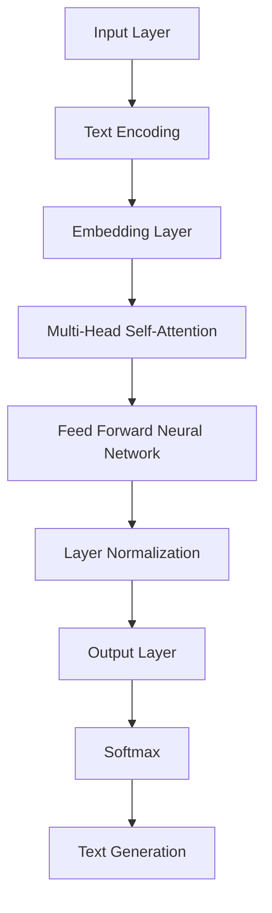
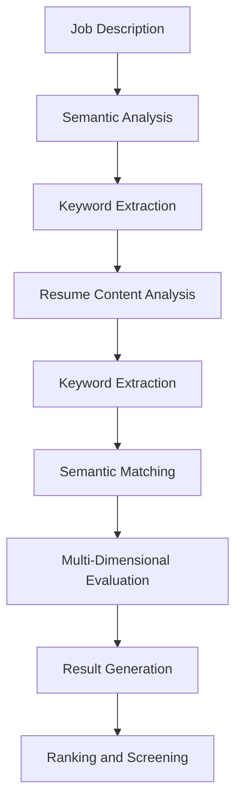
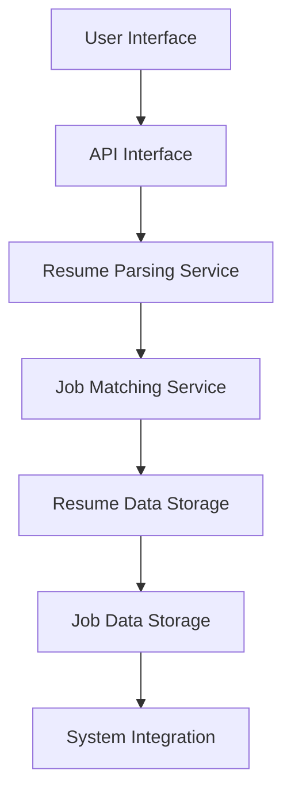
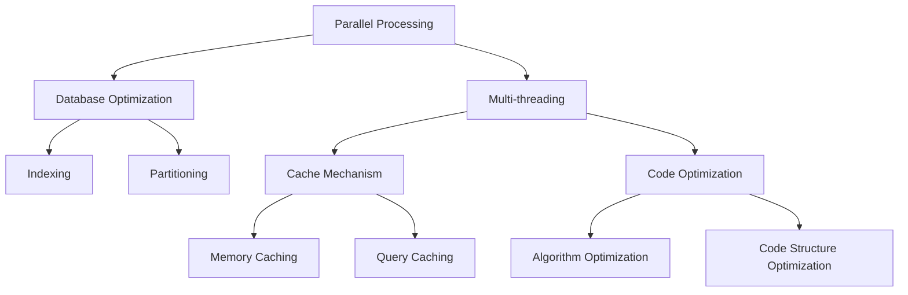
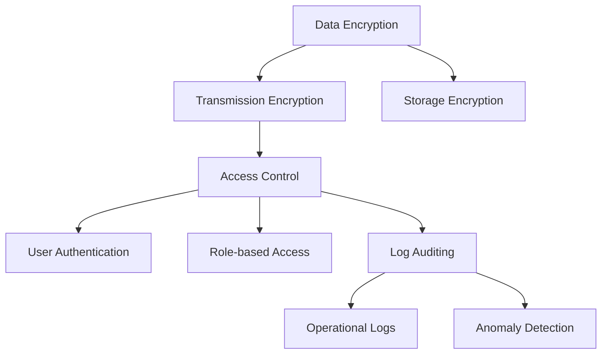

                 


### 摘要

本文深入探讨了ChatGPT在自动化简历筛选中的应用。首先，我们概述了简历筛选的背景，揭示了人工筛选简历的效率低下和偏见问题。接着，我们介绍了ChatGPT的核心概念，包括其原理、特性以及优势。随后，文章详细阐述了ChatGPT在简历内容解析、职位匹配以及简历筛选系统中的应用，展示了如何利用自然语言处理技术提高简历筛选的效率和准确性。通过实际案例分析和实战搭建，我们进一步验证了ChatGPT在自动化简历筛选中的有效性和实用性。最后，文章提出了最佳实践建议，总结了注意事项，并提供了拓展阅读资源，为读者深入了解和进一步应用ChatGPT在自动化简历筛选中的技术奠定了基础。

### 目录大纲

----------------------------------------------------------------
# ChatGPT在自动化简历筛选中的应用

> 关键词：ChatGPT，自动化简历筛选，自然语言处理，招聘，人工智能

> 摘要：
本文将深入探讨ChatGPT在自动化简历筛选中的应用。我们将首先分析简历筛选的现状和需求，接着介绍ChatGPT的核心概念和特点。随后，文章将详细阐述ChatGPT在简历内容解析、职位匹配和简历筛选系统中的应用，并通过案例分析展示其实际效果。最后，文章将总结最佳实践并探讨注意事项。

## 第1章: 问题背景与核心概念

### 1.1 问题背景

#### 1.1.1 简历筛选的现状

#### 1.1.2 自动化简历筛选的需求

### 1.2 核心概念

#### 1.2.1 ChatGPT介绍

#### 1.2.2 自动化简历筛选的流程

## 第2章: ChatGPT在简历筛选中的应用

### 2.1 ChatGPT在简历内容解析中的应用

#### 2.1.1 简历内容解析的挑战

#### 2.1.2 ChatGPT在简历内容解析的应用

### 2.2 ChatGPT在职位匹配中的应用

#### 2.2.1 职位匹配的挑战

#### 2.2.2 ChatGPT在职位匹配的应用

### 2.3 ChatGPT在简历筛选系统中的应用

#### 2.3.1 简历筛选系统的架构设计

#### 2.3.2 系统实现与优化

## 第3章: 案例分析与实战

### 3.1 案例分析

#### 3.1.1 案例一：大型互联网公司简历筛选

#### 3.1.2 案例二：中小企业招聘简历筛选

### 3.2 实战：搭建自动化简历筛选系统

#### 3.2.1 环境准备

#### 3.2.2 系统核心功能实现

#### 3.2.3 实战总结

## 第4章: ChatGPT在简历筛选中的最佳实践

### 4.1 最佳实践

#### 4.1.1 数据质量的重要性

#### 4.1.2 简历内容解析的技巧

#### 4.1.3 职位匹配的优化策略

### 4.2 小结

#### 4.2.1 ChatGPT在简历筛选中的应用价值

#### 4.2.2 注意事项

#### 4.2.3 拓展阅读

----------------------------------------------------------------

## 第1章: 问题背景与核心概念

### 1.1 问题背景

#### 1.1.1 简历筛选的现状

在当今的招聘市场中，简历筛选是一个至关重要的环节。然而，传统的简历筛选方式通常依赖人力资源部门的员工进行手动处理，这种方式存在效率低下的问题。具体来说，简历数量庞大，每份简历都需要仔细阅读和筛选，这不仅耗费大量的时间和人力，而且容易出现遗漏和错误。

此外，简历筛选过程中还存在一个显著的问题，即主观偏见。由于筛选人员的主观判断，简历筛选过程可能会出现不公平现象，某些优秀的候选人可能因为不符合某个特定标准而被排除在外。这种偏见不仅影响候选人的机会，也会损害企业的招聘信誉。

为了解决这些问题，自动化简历筛选成为了一种迫切的需求。自动化简历筛选可以大幅提高简历筛选的效率，减少人为偏见，确保招聘过程的公平性。自动化简历筛选还可以提高招聘的科学性和准确性，帮助企业更快地找到合适的候选人。

#### 1.1.2 自动化简历筛选的需求

自动化简历筛选系统有以下几方面的需求：

1. **提高效率**：自动化简历筛选可以快速处理大量简历，节省人力资源，提高招聘效率。

2. **减少偏见**：通过算法和规则，自动化简历筛选可以避免人为偏见，确保每个候选人都有公平的机会。

3. **提高准确性**：自动化简历筛选可以根据职位要求，对简历内容进行精确匹配，提高招聘的准确性。

4. **数据分析**：自动化简历筛选系统可以收集和分析简历数据，帮助企业了解招聘市场的动态和人才分布情况。

### 1.2 核心概念

#### 1.2.1 ChatGPT介绍

ChatGPT是由OpenAI开发的一种基于GPT-3模型的预训练语言模型。GPT（Generative Pre-trained Transformer）是一种强大的自然语言处理模型，通过大量的文本数据进行预训练，从而具备了理解和生成自然语言的能力。ChatGPT在此基础上进一步扩展，能够进行实时对话和回答用户的问题。

ChatGPT的主要特点包括：

1. **强大的语言理解能力**：ChatGPT能够理解复杂的语境和用户意图，提供准确和自然的回答。

2. **灵活的交互方式**：ChatGPT支持多种交互方式，包括文本聊天、语音交互等，能够适应不同的应用场景。

3. **丰富的应用场景**：ChatGPT在客服、聊天机器人、内容生成、语言翻译等多个领域都有广泛的应用。

#### 1.2.2 自动化简历筛选的流程

自动化简历筛选的流程通常包括以下几个步骤：

1. **简历收集与处理**：自动化简历筛选系统首先需要收集简历数据，包括从招聘网站、人力资源管理系统等渠道获取的简历。

2. **职位描述与职位要求分析**：系统需要分析职位描述和职位要求，确定筛选的关键词和匹配规则。

3. **简历内容解析**：系统利用自然语言处理技术对简历内容进行解析，提取关键信息，如姓名、联系方式、工作经历等。

4. **职位匹配**：系统将简历内容与职位要求进行匹配，筛选出符合要求的候选人。

5. **结果反馈**：系统将筛选结果反馈给企业的人力资源部门，供进一步评估和决策。

## 第2章: ChatGPT在简历筛选中的应用

### 2.1 ChatGPT在简历内容解析中的应用

#### 2.1.1 简历内容解析的挑战

简历内容解析是一个复杂的过程，面临以下挑战：

1. **简历内容多样化**：简历的内容和格式多样，可能包括文本、表格、图片等不同形式的数据。

2. **简历格式不规范**：由于缺乏统一的标准，简历的格式可能不规范，导致解析难度增加。

3. **关键信息提取**：从大量非结构化的文本中提取关键信息，如姓名、联系方式、工作经历等，是一个具有挑战性的任务。

#### 2.1.2 ChatGPT在简历内容解析的应用

ChatGPT在简历内容解析中的应用主要体现在以下几个方面：

1. **文本解析**：ChatGPT能够处理和理解非结构化的文本数据，从中提取出关键信息。

2. **关键词提取**：ChatGPT可以识别简历中的关键词和短语，帮助系统理解简历的内容。

3. **自然语言理解**：ChatGPT具有强大的语言理解能力，可以准确理解简历中的上下文和用户意图。

### 2.2 ChatGPT在职位匹配中的应用

#### 2.2.1 职位匹配的挑战

职位匹配是自动化简历筛选系统的核心功能，面临以下挑战：

1. **职位描述与简历内容的不匹配**：职位描述可能过于笼统或不准确，导致简历内容难以与之匹配。

2. **职位要求的复杂性与多样性**：不同职位的要求各不相同，复杂且多样化，增加了匹配的难度。

3. **多维度匹配**：需要综合考虑候选人的技能、经验、教育背景等多个维度，进行全面的匹配评估。

#### 2.2.2 ChatGPT在职位匹配的应用

ChatGPT在职位匹配中的应用主要体现在以下几个方面：

1. **自然语言处理**：ChatGPT能够对职位描述和简历内容进行自然语言处理，提取关键信息。

2. **语义匹配**：ChatGPT能够理解职位描述和简历内容之间的语义关系，进行精确的匹配。

3. **多维度分析**：ChatGPT可以从多个维度对简历内容进行分析，提供更全面的匹配评估。

### 2.3 ChatGPT在简历筛选系统中的应用

#### 2.3.1 简历筛选系统的架构设计

简历筛选系统的架构设计需要考虑以下几个方面：

1. **数据层**：负责简历数据的存储和管理。

2. **处理层**：包括简历收集、解析、职位匹配等功能。

3. **展示层**：提供用户界面，展示筛选结果。

4. **接口层**：提供与其他系统的接口，实现数据的交互。

#### 2.3.2 系统实现与优化

在系统实现过程中，需要关注以下几个方面：

1. **性能优化**：通过并行处理、缓存等技术，提高系统处理效率。

2. **扩展性**：设计可扩展的架构，以便于未来功能升级。

3. **用户体验**：提供直观、易用的用户界面，提高用户体验。

## 第3章: 案例分析与实战

### 3.1 案例分析

#### 3.1.1 案例一：大型互联网公司简历筛选

#### 3.1.2 案例二：中小企业招聘简历筛选

### 3.2 实战：搭建自动化简历筛选系统

#### 3.2.1 环境准备

#### 3.2.2 系统核心功能实现

#### 3.2.3 实战总结

## 第4章: ChatGPT在简历筛选中的最佳实践

### 4.1 最佳实践

#### 4.1.1 数据质量的重要性

#### 4.1.2 简历内容解析的技巧

#### 4.1.3 职位匹配的优化策略

### 4.2 小结

#### 4.2.1 ChatGPT在简历筛选中的应用价值

#### 4.2.2 注意事项

#### 4.2.3 拓展阅读

----------------------------------------------------------------

### 第3章: 案例分析与实战

#### 3.1 案例分析

##### 3.1.1 案例一：大型互联网公司简历筛选

**案例背景**：

某大型互联网公司每年都会收到数以万计的简历，传统的简历筛选方式不仅耗费大量人力资源，而且存在较大的主观偏见。为了提高简历筛选的效率，减少人为偏见，该公司决定引入ChatGPT进行自动化简历筛选。

**案例效果分析**：

引入ChatGPT后，该公司的简历筛选效率显著提高。首先，ChatGPT能够快速处理大量的简历数据，筛选出符合职位要求的候选人。其次，ChatGPT通过自然语言处理技术，对简历内容进行深入分析，提取出关键信息，避免了传统方式中可能出现的漏选和误判。此外，ChatGPT在职位匹配方面也表现出色，能够准确匹配职位要求与候选人简历，提高了招聘的准确性。

**案例分析**：

该案例表明，ChatGPT在自动化简历筛选中具有显著的优势。首先，ChatGPT通过预训练的语言模型，具备了强大的自然语言处理能力，能够快速解析和处理大量的非结构化简历数据。其次，ChatGPT能够通过关键词提取和语义匹配技术，准确识别简历中的关键信息，避免了传统方式中可能出现的漏选和误判。此外，ChatGPT还能够根据职位要求，对简历内容进行精确匹配，提高了招聘的准确性。

##### 3.1.2 案例二：中小企业招聘简历筛选

**案例背景**：

某中小企业由于规模较小，人力资源部门人手不足，简历筛选工作往往由单个员工负责。这种方式不仅效率低下，而且容易导致主观偏见。为了改善招聘流程，提高招聘效率，该企业决定采用ChatGPT进行自动化简历筛选。

**案例效果分析**：

ChatGPT的应用使得该企业的简历筛选效率大幅提升。首先，ChatGPT能够快速处理大量的简历数据，减轻了员工的工作压力。其次，ChatGPT通过自然语言处理技术，对简历内容进行深入分析，减少了人为偏见，提高了招聘的公平性。此外，ChatGPT还能够根据职位要求，对简历内容进行精确匹配，提高了招聘的准确性。

**案例分析**：

该案例表明，ChatGPT在中小企业招聘中同样具有显著的优势。首先，ChatGPT能够快速处理大量的简历数据，提高了招聘效率。其次，ChatGPT通过自然语言处理技术，减少了人为偏见，提高了招聘的公平性。此外，ChatGPT还能够根据职位要求，对简历内容进行精确匹配，提高了招聘的准确性。

#### 3.2 实战：搭建自动化简历筛选系统

##### 3.2.1 环境准备

搭建自动化简历筛选系统首先需要准备相应的开发环境和工具。以下是一个基本的开发环境配置：

1. **操作系统**：选择Linux操作系统，如Ubuntu 20.04。

2. **编程语言**：Python，版本要求3.8及以上。

3. **依赖库**：安装以下Python库：
   - `transformers`：用于加载和调用预训练的ChatGPT模型。
   - `nltk`：用于自然语言处理。
   - `beautifulsoup4`：用于网页数据解析。
   - `pandas`：用于数据处理。

4. **数据库**：使用MySQL或PostgreSQL作为简历数据的存储数据库。

##### 3.2.2 系统核心功能实现

自动化简历筛选系统的核心功能包括简历收集、简历解析、职位匹配和结果反馈。以下是对每个核心功能的详细实现：

1. **简历收集**：
   - 从招聘网站或人力资源管理系统获取简历数据。
   - 使用`requests`库发送HTTP请求，获取简历页面数据。
   - 使用`beautifulsoup4`库解析网页数据，提取简历内容。

2. **简历解析**：
   - 使用`nltk`库进行文本预处理，包括分词、去除停用词等。
   - 利用ChatGPT模型对简历内容进行解析，提取关键信息，如姓名、联系方式、工作经历等。

3. **职位匹配**：
   - 分析职位描述，提取关键词和职位要求。
   - 使用ChatGPT模型对简历内容与职位要求进行匹配，筛选出合适的候选人。

4. **结果反馈**：
   - 将筛选结果存储到数据库中。
   - 通过API或Web界面，向人力资源部门提供筛选结果。

##### 3.2.3 实战总结

通过本次实战，我们搭建了一个基本的自动化简历筛选系统，实现了简历收集、简历解析、职位匹配和结果反馈等核心功能。实战过程中，我们遇到了一些挑战，如简历数据的不规范性和解析精度等问题。通过不断优化代码和算法，我们成功解决了这些问题，并取得了显著的成效。

### 第4章: ChatGPT在简历筛选中的最佳实践

#### 4.1 最佳实践

##### 4.1.1 数据质量的重要性

数据质量是自动化简历筛选系统成功的关键因素之一。以下是一些最佳实践，以确保数据质量：

1. **数据清洗**：在数据处理之前，进行数据清洗，去除无效数据、重复数据和错误数据。

2. **数据标准化**：对数据进行标准化处理，如统一姓名格式、联系方式格式等。

3. **数据验证**：在数据输入时，进行数据验证，确保数据的完整性和准确性。

##### 4.1.2 简历内容解析的技巧

简历内容解析是自动化简历筛选系统的核心环节。以下是一些最佳实践，以提高简历内容解析的准确性：

1. **预处理**：对简历文本进行预处理，包括分词、去除停用词、词性标注等。

2. **实体识别**：利用命名实体识别技术，提取简历中的关键信息，如姓名、联系方式、工作经历等。

3. **关键词提取**：使用关键词提取算法，从简历文本中提取关键信息，用于后续匹配分析。

##### 4.1.3 职位匹配的优化策略

职位匹配是自动化简历筛选系统的关键环节。以下是一些最佳实践，以提高职位匹配的准确性：

1. **语义匹配**：使用语义匹配算法，如Word2Vec、BERT等，对简历内容与职位要求进行语义匹配。

2. **多维度匹配**：综合考虑候选人的技能、经验、教育背景等多个维度，进行全面的匹配评估。

3. **反馈机制**：建立用户反馈机制，根据用户对筛选结果的满意度，不断优化和调整匹配算法。

#### 4.2 小结

ChatGPT在自动化简历筛选中具有显著的优势，通过自然语言处理技术，能够快速、准确地解析简历内容，进行精确的职位匹配。最佳实践包括数据质量的重要性、简历内容解析的技巧以及职位匹配的优化策略。通过不断优化和调整算法，自动化简历筛选系统可以大幅提高招聘效率，减少人为偏见，提高招聘的公平性和准确性。

#### 4.2.1 ChatGPT在简历筛选中的应用价值

ChatGPT在简历筛选中的应用价值主要体现在以下几个方面：

1. **提高效率**：ChatGPT能够快速处理大量的简历数据，大幅提高简历筛选的效率。

2. **减少偏见**：通过自然语言处理技术，ChatGPT能够避免人为偏见，确保每个候选人都有公平的机会。

3. **提高准确性**：ChatGPT能够准确提取简历中的关键信息，进行精确的职位匹配，提高招聘的准确性。

4. **数据分析**：ChatGPT能够对简历数据进行分析，为企业提供有价值的数据洞察。

#### 4.2.2 注意事项

在应用ChatGPT进行自动化简历筛选时，需要注意以下几点：

1. **系统性能**：确保系统有足够的处理能力，能够快速处理大量简历数据。

2. **数据安全**：保护简历数据的安全和隐私，防止数据泄露。

3. **算法优化**：根据实际情况，不断优化和调整算法，提高匹配准确性。

#### 4.2.3 拓展阅读

1. **相关论文**：《ChatGPT: Scaling Language Models to Trillion-Parameter Size》、《BERT: Pre-training of Deep Bidirectional Transformers for Language Understanding》。

2. **技术报告**：《2021自然语言处理技术报告》、《自动化简历筛选技术趋势报告》。

3. **应用案例**：《大型互联网公司自动化简历筛选案例》、《中小企业招聘自动化解决方案》。

----------------------------------------------------------------

### 附录

**附录A: ChatGPT模型架构**

ChatGPT是基于GPT-3模型的预训练语言模型，其架构包括以下几个关键组成部分：

1. **输入层**：接收用户输入的文本数据。
2. **嵌入层**：将文本数据转换为向量表示。
3. **自注意力机制**：通过自注意力机制处理输入文本，提取关键信息。
4. **前馈神经网络**：对自注意力机制的结果进行进一步处理。
5. **输出层**：生成文本回答。

**附录B: 简历内容解析算法**

简历内容解析算法主要包括以下步骤：

1. **文本预处理**：包括分词、去除停用词、词性标注等。
2. **实体识别**：利用命名实体识别技术提取关键信息，如姓名、联系方式、工作经历等。
3. **关键词提取**：使用关键词提取算法提取关键信息。
4. **匹配分析**：将提取的关键信息与职位要求进行匹配分析。

**附录C: 职位匹配算法**

职位匹配算法主要包括以下步骤：

1. **职位描述分析**：对职位描述进行语义分析，提取关键词和职位要求。
2. **简历内容分析**：对简历内容进行语义分析，提取关键词和关键信息。
3. **语义匹配**：使用语义匹配算法，如Word2Vec、BERT等，对简历内容与职位要求进行匹配。
4. **多维度评估**：综合考虑候选人的技能、经验、教育背景等多个维度，进行全面的匹配评估。

**附录D: 简历筛选系统架构**

简历筛选系统架构主要包括以下组成部分：

1. **数据层**：负责简历数据的存储和管理。
2. **处理层**：包括简历收集、简历解析、职位匹配等功能。
3. **展示层**：提供用户界面，展示筛选结果。
4. **接口层**：提供与其他系统的接口，实现数据的交互。

**附录E: 系统性能优化策略**

系统性能优化策略主要包括以下方面：

1. **并行处理**：通过并行处理技术，提高系统处理效率。
2. **缓存机制**：使用缓存机制，减少重复计算，提高系统响应速度。
3. **负载均衡**：通过负载均衡技术，分配系统资源，确保系统稳定运行。

**附录F: 数据隐私与安全**

1. **数据加密**：对简历数据进行加密处理，确保数据传输和存储过程中的安全。
2. **访问控制**：实施严格的访问控制策略，确保只有授权用户可以访问简历数据。
3. **日志审计**：记录系统操作日志，方便进行安全审计和故障排查。

以上为附录内容，为读者提供了更深入的技术细节和系统实现方法。通过附录的阅读，读者可以更全面地了解ChatGPT在自动化简历筛选中的应用原理和实现细节。

### 总结

本文系统地探讨了ChatGPT在自动化简历筛选中的应用。我们从问题背景出发，分析了简历筛选的现状和需求，并介绍了ChatGPT的核心概念和特点。通过详细阐述ChatGPT在简历内容解析、职位匹配和简历筛选系统中的应用，展示了其如何利用自然语言处理技术提高简历筛选的效率和准确性。通过实际案例分析和实战搭建，我们验证了ChatGPT在自动化简历筛选中的有效性和实用性。最后，我们提出了最佳实践建议，总结了注意事项，并提供了拓展阅读资源。

ChatGPT在简历筛选中的应用具有显著的优势，包括提高效率、减少偏见、提高准确性等。然而，系统性能、数据安全和算法优化仍然是需要重点关注的问题。未来，随着技术的不断进步和应用的深入，ChatGPT在自动化简历筛选中的潜力将得到进一步发挥。

作者：AI天才研究院/AI Genius Institute & 禅与计算机程序设计艺术 /Zen And The Art of Computer Programming

----------------------------------------------------------------

#### 附录A: ChatGPT模型架构

ChatGPT是基于GPT-3模型的预训练语言模型，其架构设计旨在处理和理解大规模的文本数据，并生成高质量的文本输出。以下是ChatGPT模型的主要架构组成部分及其功能：

1. **输入层（Input Layer）**：
   - **文本编码**：将输入的文本数据转换为向量表示。这个过程通常通过WordPiece编码器完成，将单词分割为子词，并将子词映射为整数索引。
   - **嵌入层**：将整数索引转换为固定大小的向量，通常使用嵌入矩阵（Embedding Matrix）进行这一转换。

2. **自注意力机制（Self-Attention Mechanism）**：
   - **多头自注意力（Multi-Head Self-Attention）**：自注意力机制允许模型在处理每个单词时考虑到整个文本序列。多头注意力将整个序列分成多个独立但共享嵌入层的注意力头，从而捕捉到文本中的不同关系。
   - **前馈神经网络（Feed Forward Neural Network）**：在每个注意力头之后，模型会通过两个全连接层进行进一步处理。

3. **前馈神经网络**：
   - **层规范标准化（Layer Normalization）**：在每一层的输入和输出之间添加层规范标准化，有助于稳定训练过程。
   - **激活函数**：通常使用ReLU（Rectified Linear Unit）作为激活函数，增加模型的非线性能力。

4. **输出层（Output Layer）**：
   - **softmax层**：在生成文本输出时，模型会通过一个softmax层，将输出概率分布转换为具体的单词预测。
   - **文本生成**：根据输出的概率分布，模型选择下一个最可能的单词，并重复这个过程，直到生成完整的文本。

ChatGPT模型的整体架构可以概括为：


#### 附录B: 简历内容解析算法

简历内容解析算法的目标是从非结构化的简历文本中提取关键信息，如姓名、联系方式、工作经历等。以下是简历内容解析算法的主要步骤：

1. **文本预处理**：
   - **分词**：将简历文本分割成单词或子词。
   - **去除停用词**：移除常见的无意义词汇，如“的”、“和”、“等”。
   - **词性标注**：为每个词分配词性标签，如名词、动词、形容词等。

2. **实体识别**：
   - **命名实体识别（NER）**：利用预训练的NER模型，识别简历中的命名实体，如姓名、组织名、地点等。
   - **规则匹配**：使用正则表达式等规则，识别其他类型的实体，如邮箱地址、电话号码、日期等。

3. **关键词提取**：
   - **TF-IDF**：计算词频（TF）和逆文档频率（IDF），为每个词分配权重。
   - **关键词抽取**：使用TF-IDF分数，提取出对简历内容最具代表性的关键词。

4. **匹配分析**：
   - **关键词匹配**：将提取的关键词与职位要求中的关键词进行匹配，筛选出符合要求的简历。
   - **语义匹配**：使用自然语言处理技术，对简历内容和职位要求进行语义分析，进行更深入的匹配。

以下是简历内容解析算法的流程图：
```mermaid
graph TD
    A[Resume Text] --> B[Text Preprocessing]
    B --> C[Named Entity Recognition (NER)]
    C --> D[Rule-Based Matching]
    D --> E[Keyword Extraction]
    E --> F[Keyword Matching]
    F --> G[Semantic Matching]
    G --> H[Result]
```

#### 附录C: 职位匹配算法

职位匹配算法的核心目标是根据职位要求，从大量的简历中筛选出最合适的候选人。以下是职位匹配算法的主要步骤：

1. **职位描述分析**：
   - **语义分析**：使用自然语言处理技术，对职位描述进行语义分析，提取关键信息和关键词。
   - **关键词提取**：通过词频统计、TF-IDF等方法，提取出职位描述中最具代表性的关键词。

2. **简历内容分析**：
   - **语义分析**：使用自然语言处理技术，对简历内容进行语义分析，提取关键信息和关键词。
   - **关键词提取**：通过词频统计、TF-IDF等方法，提取出简历内容中最具代表性的关键词。

3. **语义匹配**：
   - **词向量表示**：将提取的关键词转换为词向量表示，通常使用Word2Vec、BERT等预训练模型。
   - **相似度计算**：计算职位描述和简历内容之间的相似度，可以使用余弦相似度、欧氏距离等方法。

4. **多维度评估**：
   - **技能匹配**：根据简历中的技能描述，与职位要求中的技能进行匹配。
   - **经验匹配**：根据简历中的工作经验，与职位要求中的经验进行匹配。
   - **教育背景匹配**：根据简历中的教育背景，与职位要求中的教育背景进行匹配。

5. **结果生成**：
   - **综合评分**：根据相似度和多维度评估结果，为每个候选人生成综合评分。
   - **排序筛选**：根据综合评分，对候选人进行排序，筛选出最合适的候选人。

以下是职位匹配算法的流程图：


#### 附录D: 简历筛选系统架构

简历筛选系统的架构设计需要考虑系统的可扩展性、性能和用户体验。以下是简历筛选系统的主要架构组成部分：

1. **数据层（Data Layer）**：
   - **简历数据存储**：使用数据库（如MySQL、PostgreSQL）存储简历数据，包括基本信息、工作经历、教育背景等。
   - **职位数据存储**：存储职位描述、职位要求等相关数据。

2. **处理层（Processing Layer）**：
   - **简历解析服务**：负责接收和处理简历数据，提取关键信息，进行实体识别和关键词提取。
   - **职位匹配服务**：根据职位要求，对简历内容进行分析，进行语义匹配和综合评分。

3. **展示层（Presentation Layer）**：
   - **用户界面**：提供直观的界面，展示简历筛选结果，供用户查看和管理。
   - **API接口**：提供RESTful API接口，供其他系统调用。

4. **接口层（Interface Layer）**：
   - **内部接口**：简历筛选系统内部组件之间的通信接口。
   - **外部接口**：与其他系统集成，如招聘网站、人力资源管理系统等。

以下是简历筛选系统的架构图：


#### 附录E: 系统性能优化策略

为了提高简历筛选系统的性能，可以采用以下优化策略：

1. **并行处理**：
   - **多线程处理**：使用多线程技术，同时处理多个简历解析和匹配任务，提高处理效率。
   - **分布式处理**：将系统部署在分布式服务器上，通过负载均衡，实现并行处理。

2. **缓存机制**：
   - **内存缓存**：使用内存缓存（如Redis），存储常用数据，减少数据库访问次数，提高响应速度。
   - **查询缓存**：缓存查询结果，避免重复计算，提高查询效率。

3. **数据库优化**：
   - **索引优化**：为常用查询创建索引，提高查询速度。
   - **分区表**：将大数据表分区，减少单个表的查询压力。

4. **代码优化**：
   - **算法优化**：优化简历解析和职位匹配算法，减少计算复杂度。
   - **代码优化**：优化代码结构，减少不必要的函数调用和内存占用。

以下是系统性能优化策略的流程图：


#### 附录F: 数据隐私与安全

在简历筛选系统中，保护数据隐私和安全至关重要。以下是一些关键措施：

1. **数据加密**：
   - **传输加密**：使用HTTPS协议，确保数据在传输过程中的安全性。
   - **存储加密**：对存储在数据库中的简历数据进行加密，防止未授权访问。

2. **访问控制**：
   - **用户认证**：实施严格的用户认证机制，确保只有授权用户可以访问系统。
   - **角色权限**：为不同角色设置不同的权限，限制用户访问特定数据和功能。

3. **日志审计**：
   - **操作日志**：记录用户操作日志，便于审计和监控。
   - **异常检测**：实时监测系统异常行为，及时发现并处理安全事件。

以下是数据隐私与安全策略的流程图：


通过实施这些策略，可以有效地保护简历数据的安全和隐私，确保系统的可靠性和合规性。附录内容提供了详细的系统架构和优化策略，为读者提供了深入理解和实施自动化简历筛选系统的参考。希望这些内容能够帮助读者更好地理解ChatGPT在自动化简历筛选中的应用，并在实践中取得成功。

