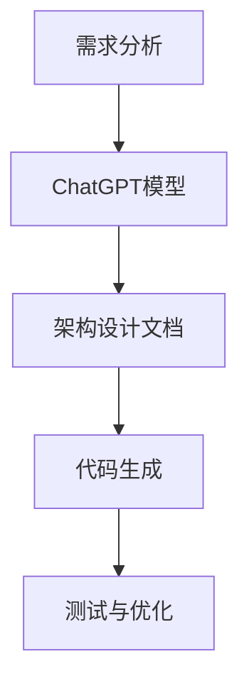
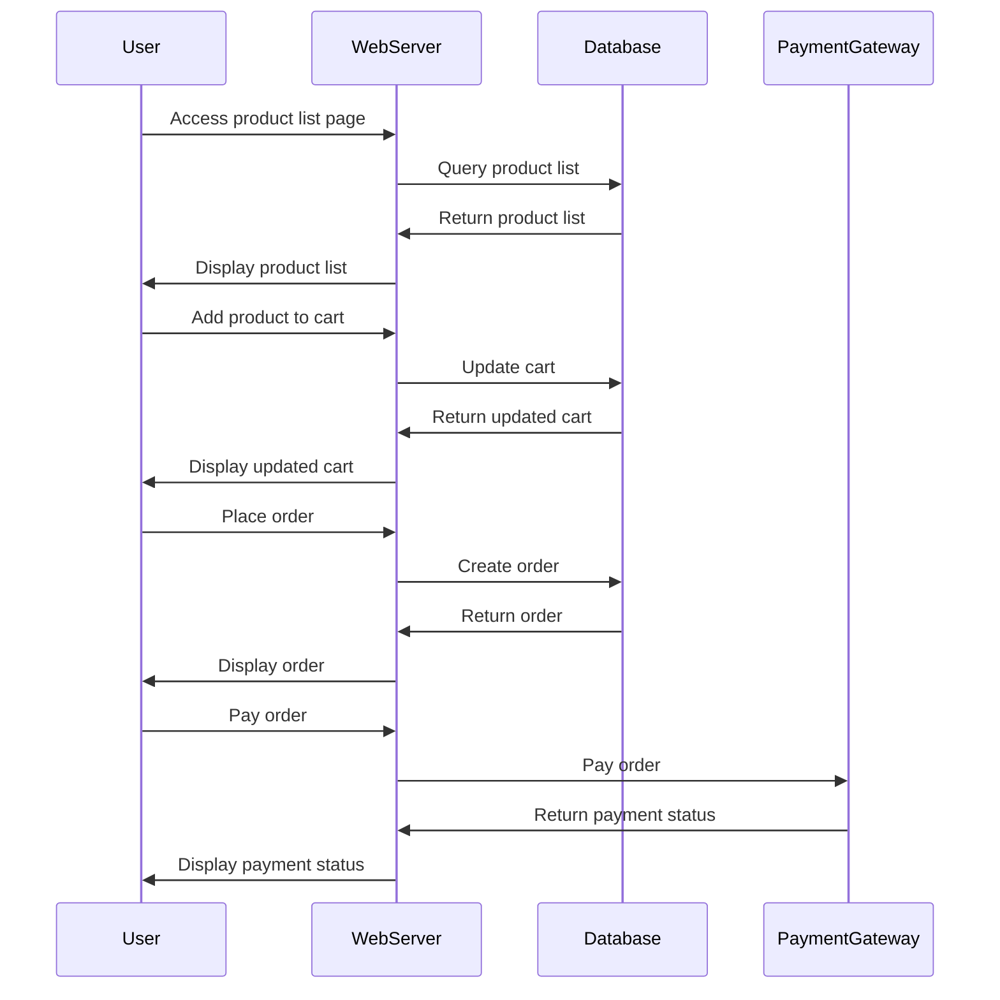

                 


# ChatGPT在自动化软件架构设计中的应用

关键词：ChatGPT，自动化软件架构，设计原理，算法，系统实现

摘要：本文将探讨ChatGPT在自动化软件架构设计中的应用，从背景介绍、核心概念、算法原理讲解、系统分析与架构设计方案、项目实战和最佳实践等方面进行详细阐述，旨在帮助读者了解和掌握ChatGPT在自动化软件架构设计中的强大功能和应用场景。

## 1. 背景介绍

### 1.1 核心概念术语说明

- **ChatGPT**：一种基于生成预训练转换器（GPT）的强大语言模型，能够生成自然语言文本，并在多种应用场景中展现出惊人的性能。
- **自动化软件架构设计**：一种通过自动化工具和算法来设计和构建软件系统的过程，旨在提高开发效率和系统质量。

### 1.2 问题背景

随着软件系统的日益复杂，传统的手动软件架构设计方法已经无法满足快速开发的需求。因此，寻找一种高效的自动化软件架构设计方法成为了当前研究的热点。

### 1.3 问题描述

自动化软件架构设计的关键挑战在于如何利用现有资源（如代码库、文档、开发者经验等）自动生成高质量的软件架构。

### 1.4 问题解决

ChatGPT的出现为自动化软件架构设计带来了新的希望。通过学习大量的软件架构相关文档和代码，ChatGPT可以自动生成软件架构设计文档，帮助开发者快速构建高质量的系统。

### 1.5 边界与外延

- **边界**：本文主要探讨ChatGPT在自动化软件架构设计中的应用，不涉及其他领域的自动化设计。
- **外延**：自动化软件架构设计可以应用于各种类型的软件系统，包括企业应用、移动应用、Web应用等。

### 1.6 概念结构与核心要素组成

- **概念结构**：ChatGPT + 软件架构设计算法 + 软件开发环境
- **核心要素组成**：算法模型、训练数据、开发工具、测试与优化流程

## 2. 核心概念与联系

### 2.1 ChatGPT基础原理

ChatGPT是一种基于生成预训练转换器（GPT）的语言模型，其核心原理是通过对大量文本数据进行预训练，使其掌握自然语言的生成和推理能力。

### 2.2 自动化软件架构设计要素

自动化软件架构设计主要包括以下几个方面：

- **需求分析**：根据用户需求自动生成软件架构设计文档。
- **代码生成**：根据架构设计文档自动生成代码。
- **测试与优化**：对生成的代码进行自动化测试和优化，确保系统质量和性能。

### 2.3 概念属性特征对比表格

| 特征           | ChatGPT                         | 自动化软件架构设计                         |
|--------------|--------------------------------|-----------------------------------------|
| 数据来源       | 大量自然语言文本数据                 | 代码库、文档、开发者经验等                 |
| 技术原理       | 生成预训练转换器（GPT）                 | 软件工程、自动化工具和算法                   |
| 应用场景       | 自然语言生成、推理和对话系统                 | 软件架构设计、代码生成、测试与优化               |
| 性能评估指标     | 语言生成质量、推理能力、模型效率                 | 架构设计质量、代码质量、系统性能               |

### 2.4 ER实体关系图架构

```mermaid
erDiagram
    Entity1 ||--|{ Entity2 : "has a" }
    Entity2 ||--|{ Entity3 : "is part of" }
```

## 3. 算法原理讲解

### 3.1 ChatGPT算法原理

ChatGPT的算法原理主要基于生成预训练转换器（GPT）模型。GPT模型通过对大量文本数据进行预训练，使其掌握自然语言的生成和推理能力。

### 3.2 自动化软件架构设计算法

自动化软件架构设计算法主要包括以下几个步骤：

1. 需求分析：通过ChatGPT模型自动生成软件架构设计文档。
2. 代码生成：根据架构设计文档，利用自动化工具生成代码。
3. 测试与优化：对生成的代码进行自动化测试和优化，确保系统质量和性能。

### 3.3 算法原理流程图



### 3.4 Python源代码

```python
# ChatGPT模型预训练代码
import transformers

model = transformers.AutoModelForCausalLM.from_pretrained('gpt2')

# 架构设计文档生成代码
def generate_architecture_document(需求):
    inputs = tokenizer.encode(需求, return_tensors='pt')
    outputs = model(inputs)
    architecture_document = tokenizer.decode(outputs[:, inputs.shape[-1]-1:].squeeze(), skip_special_tokens=True)
    return architecture_document

# 代码生成代码
def generate_code(architecture_document):
    # 根据架构设计文档生成代码的具体实现
    pass

# 测试与优化代码
def test_and_optimize(code):
    # 对生成的代码进行自动化测试和优化
    pass
```

### 3.5 数学模型与公式

在自动化软件架构设计中，常用的数学模型和公式包括：

- **线性回归**：用于预测系统性能和成本。
- **贝叶斯网络**：用于推理系统组件之间的关系。

$$
y = \beta_0 + \beta_1 \cdot x
$$

### 3.6 详细讲解与举例说明

#### 3.6.1 ChatGPT模型预训练

ChatGPT模型预训练的主要目的是使其掌握自然语言的生成和推理能力。具体步骤如下：

1. 准备大量自然语言文本数据，如文档、代码、对话等。
2. 使用预训练算法（如GPT）对模型进行训练，使其能够生成高质量的文本。
3. 对模型进行评估和优化，提高其性能。

#### 3.6.2 架构设计文档生成

架构设计文档生成过程主要基于ChatGPT模型。具体步骤如下：

1. 收集用户需求，如功能需求、性能需求等。
2. 将需求输入到ChatGPT模型中，生成架构设计文档。
3. 对生成的文档进行审核和优化，确保其符合用户需求。

#### 3.6.3 代码生成

代码生成过程主要基于架构设计文档和自动化工具。具体步骤如下：

1. 将架构设计文档转换为代码模板。
2. 使用自动化工具（如模板引擎、代码生成器等）生成代码。
3. 对生成的代码进行格式化、优化和测试。

#### 3.6.4 测试与优化

测试与优化过程主要针对生成的代码。具体步骤如下：

1. 对代码进行功能测试，确保其符合架构设计文档。
2. 对代码进行性能测试，评估其运行效率和资源消耗。
3. 对代码进行优化，提高其质量和性能。

## 4. 系统分析与架构设计方案

### 4.1 问题场景介绍

假设我们需要设计一个在线购物系统，该系统需要支持商品浏览、购物车管理、订单生成和支付等功能。

### 4.2 项目介绍

该项目旨在利用ChatGPT模型和自动化工具，自动生成在线购物系统的软件架构设计文档、代码和测试脚本。

### 4.3 系统功能设计

系统功能设计主要包括以下模块：

- **商品模块**：提供商品浏览、搜索和详情页面。
- **购物车模块**：实现购物车管理功能。
- **订单模块**：实现订单生成和支付功能。
- **用户模块**：实现用户注册、登录和资料管理功能。

### 4.4 系统架构设计

系统架构设计采用分层架构，包括以下层次：

- **表示层**：负责用户界面的展示和交互。
- **业务逻辑层**：实现系统核心功能。
- **数据访问层**：负责与数据库的交互。

### 4.5 系统接口设计

系统接口设计主要包括以下接口：

- **商品接口**：提供商品查询、添加和删除等功能。
- **购物车接口**：提供购物车查询、添加和删除等功能。
- **订单接口**：提供订单生成和支付等功能。

### 4.6 系统交互

系统交互采用序列图表示，包括以下交互过程：

1. 用户访问商品列表页面，选择商品添加到购物车。
2. 用户提交订单，进入支付页面。
3. 用户完成支付，订单生成。



## 5. 项目实战

### 5.1 环境安装

在开始项目实战之前，我们需要安装以下环境和工具：

- **Python环境**：安装Python 3.8及以上版本。
- **ChatGPT模型**：从[transformers](https://github.com/huggingface/transformers)库中下载ChatGPT模型。
- **自动化工具**：安装代码生成器和测试框架（如Jenkins、Selenium等）。

### 5.2 系统核心实现源代码

系统核心实现源代码主要包括以下部分：

- **ChatGPT模型训练**：使用预训练算法对ChatGPT模型进行训练。
- **架构设计文档生成**：根据用户需求，利用ChatGPT模型生成架构设计文档。
- **代码生成**：根据架构设计文档，利用代码生成器生成系统代码。
- **测试与优化**：对生成的代码进行自动化测试和优化。

### 5.3 代码应用解读与分析

代码应用解读与分析主要包括以下方面：

- **架构设计文档**：分析架构设计文档的结构和内容，确保其符合用户需求。
- **系统代码**：分析系统代码的编写规范和性能，优化代码质量。
- **测试脚本**：分析测试脚本的执行过程和结果，确保系统功能正确。

### 5.4 实际案例分析与详细讲解剖析

实际案例分析与详细讲解剖析主要包括以下方面：

- **商品模块**：分析商品模块的架构设计和功能实现，确保其能够满足用户需求。
- **购物车模块**：分析购物车模块的架构设计和功能实现，确保其能够支持购物车管理功能。
- **订单模块**：分析订单模块的架构设计和功能实现，确保其能够支持订单生成和支付功能。
- **用户模块**：分析用户模块的架构设计和功能实现，确保其能够支持用户注册、登录和资料管理功能。

### 5.5 项目小结

项目小结主要包括以下内容：

- **项目成果**：总结项目的主要成果和收获。
- **改进方向**：分析项目存在的不足和改进方向。
- **经验分享**：分享项目过程中的经验和教训。

## 6. 最佳实践与拓展

### 6.1 最佳实践Tips

- **需求分析**：确保用户需求明确、具体和可度量。
- **架构设计**：遵循分层架构原则，确保系统模块化和可维护性。
- **代码生成**：根据架构设计文档生成代码，确保代码质量和一致性。
- **测试与优化**：对生成的代码进行全面的测试和优化，确保系统性能和稳定性。

### 6.2 注意事项

- **数据安全和隐私保护**：确保项目过程中涉及的数据安全和隐私保护。
- **自动化工具选择**：根据项目需求选择合适的自动化工具。
- **持续集成与持续部署**：实施持续集成和持续部署，提高项目开发效率。

### 6.3 拓展阅读

- **ChatGPT相关论文**：了解ChatGPT模型的最新研究进展。
- **自动化软件架构设计方法**：学习不同的自动化软件架构设计方法。
- **相关书籍**：推荐一些关于ChatGPT和自动化软件架构设计的专业书籍。

## 7. 结语

本文通过对ChatGPT在自动化软件架构设计中的应用进行详细分析和探讨，展示了ChatGPT在提高软件架构设计效率和质量方面的巨大潜力。相信随着技术的不断进步，ChatGPT将在更多的领域发挥重要作用，为软件开发带来更多创新和突破。

作者：AI天才研究院/AI Genius Institute & 禅与计算机程序设计艺术 /Zen And The Art of Computer Programming

