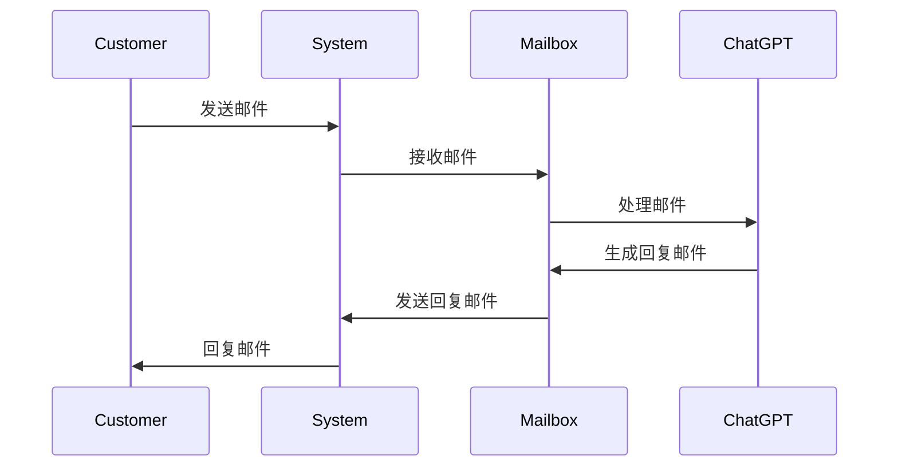
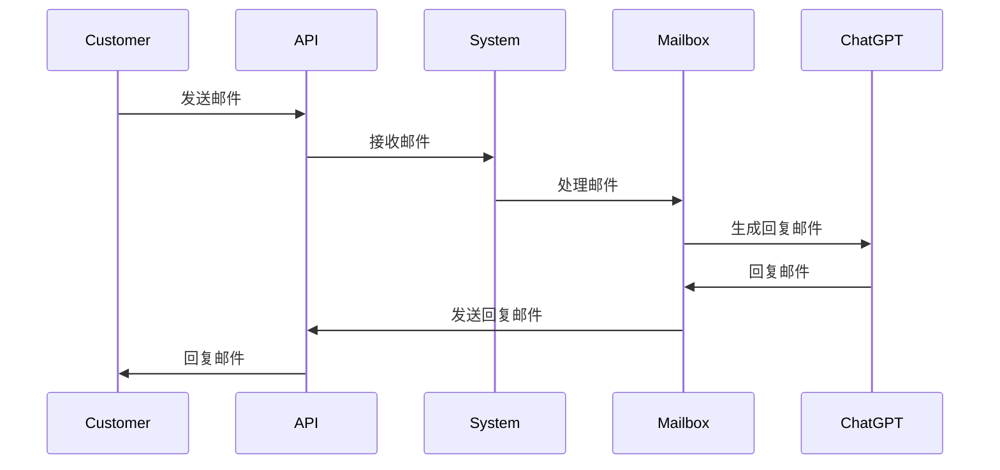

                 


### 第一章：背景介绍

#### 1.1 问题背景

在当今快节奏的商业环境中，企业需要快速响应客户邮件，提供即时的支持和解决方案。然而，传统的手动邮件回复方式面临着诸多挑战。首先，人力资源有限，客服团队无法24小时不间断地处理大量邮件。其次，回复邮件的质量和速度难以保证，导致客户满意度下降。此外，邮件内容缺乏个性化，往往显得机械和缺乏人性化。

#### 1.2 问题描述

自动化邮件回复的出现旨在解决上述问题。自动化邮件回复系统能够在短时间内处理大量邮件，提高回复速度，节省人力资源。然而，传统自动化邮件回复系统存在以下问题：

1. **模板化回复**：传统系统往往依赖预定义的模板进行回复，导致邮件内容缺乏个性化和自然性。
2. **上下文理解不足**：传统系统难以理解邮件的上下文，导致回复不准确。
3. **复杂性高**：实现和维护传统自动化邮件回复系统需要大量的编程和调试工作。

#### 1.3 问题解决

为了解决这些问题，我们需要一种更智能的自动化邮件回复解决方案。ChatGPT作为一种基于Transformer模型的自然语言处理技术，具备强大的上下文理解能力和生成能力，非常适合用于自动化邮件回复。ChatGPT能够根据邮件内容和上下文生成自然、个性化的回复，从而提高客户满意度。

#### 1.4 边界与外延

本文将讨论ChatGPT在自动化邮件回复中的具体应用，包括其优势、挑战以及实现方法。我们将以一个实际项目为例，详细讲解如何使用ChatGPT实现自动化邮件回复系统，并提供一些最佳实践和注意事项。

#### 1.5 概念结构与核心要素组成

在深入探讨ChatGPT在自动化邮件回复中的应用之前，我们需要了解以下几个核心概念：

1. **ChatGPT**：一种基于Transformer模型的自然语言处理技术。
2. **自然语言处理（NLP）**：研究如何让计算机理解和生成自然语言。
3. **邮件回复流程**：包括邮件接收、处理、回复等环节。
4. **自动化系统**：能够自动执行特定任务的系统。

接下来，我们将分别介绍这些概念，并探讨它们之间的联系。

---

### 第二章：ChatGPT核心概念与原理

#### 2.1 ChatGPT的定义

ChatGPT是由OpenAI开发的一种基于Transformer模型的自然语言处理技术。它是一种大规模语言模型，能够生成高质量的自然语言文本，并在对话系统中发挥重要作用。

#### 2.2 ChatGPT的技术原理

ChatGPT的核心是Transformer模型，这是一种用于处理序列数据的深度学习模型。Transformer模型通过自注意力机制（Self-Attention）来捕捉输入序列中的长距离依赖关系，从而生成更准确和自然的文本。

#### 2.3 ChatGPT的主要特点

1. **强大的上下文理解能力**：ChatGPT能够理解输入文本的上下文，从而生成更加准确和自然的回复。
2. **高度个性化**：ChatGPT可以根据用户的历史对话和行为生成个性化的回复。
3. **高效性**：ChatGPT能够在短时间内生成大量文本，适用于实时对话系统。
4. **易扩展性**：ChatGPT可以轻松地与其他系统和服务集成，实现自动化邮件回复等功能。

#### 2.4 ChatGPT与其他聊天机器人的比较

与传统的聊天机器人相比，ChatGPT具有以下几个显著优势：

1. **自然语言生成能力**：ChatGPT能够生成高质量的自然语言文本，而传统聊天机器人往往依赖预定义的回复模板。
2. **上下文理解能力**：ChatGPT能够理解邮件的上下文，从而生成更加准确的回复，而传统聊天机器人通常缺乏这种能力。
3. **可扩展性**：ChatGPT可以轻松地与其他系统和工具集成，而传统聊天机器人往往需要大量的定制开发。

---

在下一章中，我们将深入探讨ChatGPT在自动化邮件回复中的应用，并分析其在实际场景中的优势和挑战。

---

### 第三章：ChatGPT在自动化邮件回复中的应用

#### 3.1 自动化邮件回复的需求分析

在当今的数字化时代，电子邮件仍然是企业与客户沟通的重要渠道之一。自动化邮件回复系统能够为企业带来以下好处：

1. **提高响应速度**：自动化系统可以立即响应客户邮件，减少客户等待时间。
2. **节省人力资源**：自动化系统能够处理大量邮件，减轻客服团队的工作负担。
3. **提高客户满意度**：个性化的邮件回复能够提高客户的满意度，从而增强客户忠诚度。

#### 3.2 ChatGPT在邮件回复中的优势

ChatGPT作为一种先进的自然语言处理技术，在自动化邮件回复中具有以下优势：

1. **高度个性化**：ChatGPT能够根据客户的历史邮件和行为生成个性化的回复，从而提高邮件的吸引力。
2. **自然语言生成能力**：ChatGPT能够生成高质量的自然语言文本，使得邮件内容更加自然和流畅。
3. **上下文理解能力**：ChatGPT能够理解邮件的上下文，从而生成更加准确和相关的回复。

#### 3.3 ChatGPT在邮件回复中的挑战

尽管ChatGPT在自动化邮件回复中具有诸多优势，但实际应用中也面临一些挑战：

1. **数据质量**：ChatGPT的性能取决于训练数据的质量。如果训练数据存在偏差或错误，可能导致生成的邮件内容不准确。
2. **隐私保护**：在处理客户邮件时，需要确保数据的隐私和安全。
3. **错误处理**：ChatGPT可能会生成错误的回复，如何有效地检测和纠正这些错误是一个挑战。

在下一章中，我们将深入探讨ChatGPT的技术原理，并分析其在自动化邮件回复系统中的应用架构设计。

---

### 第四章：ChatGPT技术原理深入讲解

#### 4.1 算法原理讲解

ChatGPT的核心是Transformer模型，这是一种用于处理序列数据的深度学习模型。下面我们将介绍Transformer模型的基本结构、工作原理以及如何进行训练。

##### 4.1.1 Transformer模型的基本结构

Transformer模型主要由编码器（Encoder）和解码器（Decoder）组成。编码器负责将输入序列编码为固定长度的向量，解码器则负责生成输出序列。

1. **编码器**：
   - **自注意力机制（Self-Attention）**：编码器中的每个位置都能够自适应地关注输入序列的其他位置，从而捕捉长距离依赖关系。
   - **多头注意力（Multi-Head Attention）**：编码器使用多个注意力头来并行处理输入序列，从而提高模型的表示能力。
   - **前馈神经网络（Feed-Forward Neural Network）**：编码器在每个位置之后添加一个前馈神经网络，用于进一步处理和丰富输入序列的信息。

2. **解码器**：
   - **编码器-解码器注意力（Encoder-Decoder Attention）**：解码器利用编码器的输出来生成输出序列，同时使用自注意力和多头注意力机制来捕捉长距离依赖关系。
   - **掩码多头注意力（Masked Multi-Head Attention）**：解码器在生成每个输出时，只关注之前的输出，从而防止生成过程中的信息泄露。
   - **前馈神经网络（Feed-Forward Neural Network）**：解码器在每个位置之后添加一个前馈神经网络，用于进一步处理和丰富输出序列的信息。

##### 4.1.2 Transformer模型的工作原理

Transformer模型通过自注意力机制来捕捉输入序列中的长距离依赖关系。具体来说，自注意力机制使得编码器中的每个位置都能够自适应地关注输入序列的其他位置。这种机制可以有效地捕捉输入序列中的上下文信息，从而生成更加准确和自然的输出序列。

在解码器中，编码器-解码器注意力机制使得解码器能够利用编码器的输出来生成输出序列。同时，掩码多头注意力机制防止了生成过程中的信息泄露，保证了模型的稳定性。

##### 4.1.3 语言模型的训练过程

语言模型的训练过程主要包括以下步骤：

1. **数据预处理**：
   - **词汇表构建**：将输入序列中的词汇转换为数字表示，构建词汇表。
   - **序列编码**：将输入序列编码为序列中的词索引。

2. **损失函数**：
   - **交叉熵损失函数**：用于衡量预测序列与真实序列之间的差异。

3. **反向传播**：
   - **计算梯度**：通过反向传播算法计算模型参数的梯度。
   - **参数更新**：使用梯度下降等优化算法更新模型参数。

4. **训练迭代**：
   - **前向传播**：将输入序列输入到模型，计算输出序列。
   - **损失计算**：计算预测序列与真实序列之间的交叉熵损失。
   - **反向传播**：计算模型参数的梯度。
   - **参数更新**：更新模型参数。

##### 4.1.4 ChatGPT的Python源代码实现

```python
import tensorflow as tf
from tensorflow.keras.layers import Embedding, LSTM, Dense

# 编码器
encoder_inputs = Embedding(input_dim=vocab_size, output_dim=embedding_size)(encoder_inputs)
encoder_outputs, state_h, state_c = LSTM(units, return_sequences=True, return_state=True)(encoder_inputs)

# 解码器
decoder_inputs = Embedding(input_dim=vocab_size, output_dim=embedding_size)(decoder_inputs)
decoder_outputs, state_h, state_c = LSTM(units, return_sequences=True, return_state=True)(decoder_inputs)

# 输出层
outputs = Dense(units=vocab_size, activation='softmax')(decoder_outputs)

# 构建模型
model = Model(inputs=[encoder_inputs, decoder_inputs], outputs=[outputs, state_h, state_c])

# 编译模型
model.compile(optimizer='adam', loss='categorical_crossentropy', metrics=['accuracy'])

# 训练模型
model.fit([encoder_inputs, decoder_inputs], [decoder_outputs], batch_size=batch_size, epochs=num_epochs)
```

在代码中，我们首先构建了编码器和解码器的LSTM层，然后添加了输出层。最后，我们编译模型并使用训练数据进行迭代训练。

---

在下一章中，我们将讨论如何将ChatGPT应用于自动化邮件回复系统，并介绍系统架构设计。

---

### 第五章：ChatGPT的应用架构设计

#### 5.1 应用场景介绍

自动化邮件回复系统是一个典型的应用场景，ChatGPT在此场景中发挥着关键作用。在这个应用场景中，系统需要实时接收客户邮件，理解邮件内容，并生成合适的回复。具体来说，系统的主要功能包括：

1. **邮件接收**：接收来自客户的邮件。
2. **邮件处理**：对邮件进行预处理，提取关键信息。
3. **邮件回复**：使用ChatGPT生成回复邮件，并发送至客户。

#### 5.2 系统功能设计（领域模型Mermaid类图）

为了更好地理解系统功能，我们可以使用Mermaid绘制领域模型类图。以下是一个简单的领域模型类图：

```mermaid
classDiagram
    Customer <<entity>> Customer
    Email <<entity>> Email
    ChatGPT <<entity>> ChatGPT
    Mailbox <<entity>> Mailbox
    System <<entity>> System

    Customer o-- Email
    Email o-- ChatGPT
    ChatGPT o-- Mailbox
    Mailbox o-- System
```

在这个类图中，我们定义了以下几个实体：

- **Customer（客户）**：代表与系统进行交互的客户。
- **Email（邮件）**：代表客户发送的邮件。
- **ChatGPT（聊天机器人）**：代表ChatGPT模型。
- **Mailbox（邮箱）**：代表用于存储和处理邮件的组件。
- **System（系统）**：代表整个自动化邮件回复系统。

实体之间的关系如下：

- **Customer与Email**：一个客户可以发送多封邮件，一封邮件只能来自一个客户。
- **Email与ChatGPT**：一封邮件可以由ChatGPT处理，ChatGPT可以处理多封邮件。
- **ChatGPT与Mailbox**：ChatGPT生成的回复邮件存储在Mailbox中，Mailbox可以存储多封邮件。
- **Mailbox与System**：Mailbox是系统的一部分，系统可以管理多个Mailbox。

#### 5.3 系统架构设计（Mermaid架构图）

接下来，我们可以使用Mermaid绘制系统架构图，以展示系统的主要组件和它们之间的关系。以下是一个简单的系统架构图：



在这个架构图中，系统的主要组件包括：

- **Customer（客户）**：代表与系统进行交互的客户。
- **System（系统）**：代表自动化邮件回复系统。
- **Mailbox（邮箱）**：代表用于存储和处理邮件的组件。
- **ChatGPT（聊天机器人）**：代表ChatGPT模型。

系统的工作流程如下：

1. **客户发送邮件**：客户向系统发送邮件。
2. **系统接收邮件**：系统接收邮件并将其存储在Mailbox中。
3. **Mailbox处理邮件**：Mailbox将邮件转发给ChatGPT进行处理。
4. **ChatGPT生成回复邮件**：ChatGPT根据邮件内容和上下文生成回复邮件。
5. **Mailbox发送回复邮件**：Mailbox将生成的回复邮件发送给系统。
6. **系统发送回复邮件**：系统将回复邮件发送给客户。

#### 5.4 系统接口设计

在系统架构中，接口设计是非常重要的一环。以下是系统接口设计的几个关键点：

1. **API接口**：系统提供API接口，用于与其他系统集成。例如，客户可以通过Web界面或API接口向系统发送邮件。
2. **邮件接收接口**：系统需要提供一个邮件接收接口，用于接收来自客户的邮件。该接口可以基于SMTP协议或其他邮件传输协议。
3. **邮件处理接口**：系统需要提供一个邮件处理接口，用于处理收到的邮件。该接口可以提取邮件中的关键信息，如发件人、收件人、主题等。
4. **回复邮件接口**：系统需要提供一个回复邮件接口，用于生成并发送回复邮件。该接口可以使用ChatGPT模型来生成回复邮件。

#### 5.5 系统交互（Mermaid序列图）

为了更直观地展示系统组件之间的交互流程，我们可以使用Mermaid序列图。以下是一个简单的系统交互序列图：



在这个序列图中，我们可以看到系统组件之间的交互过程：

1. **客户发送邮件**：客户通过API接口向系统发送邮件。
2. **系统接收邮件**：系统接收到邮件后，将其转发给Mailbox进行处理。
3. **Mailbox处理邮件**：Mailbox提取邮件中的关键信息，并调用ChatGPT模型生成回复邮件。
4. **ChatGPT生成回复邮件**：ChatGPT根据邮件内容和上下文生成回复邮件，并将其返回给Mailbox。
5. **Mailbox发送回复邮件**：Mailbox将生成的回复邮件发送给API接口。
6. **API发送回复邮件**：API接口将回复邮件发送给客户。

通过这个序列图，我们可以清晰地看到系统组件之间的交互流程，以及每个组件的具体功能。

---

在下一章中，我们将介绍如何实际实现自动化邮件回复系统，包括环境安装、系统核心实现源代码以及代码应用解读与分析。

---

### 第六章：项目实战

#### 6.1 环境安装

为了实现自动化邮件回复系统，我们需要安装以下软件和库：

1. **Python环境**：Python 3.8及以上版本。
2. **TensorFlow**：用于训练和运行ChatGPT模型。
3. **Keras**：用于简化TensorFlow的使用。
4. **Gmail API**：用于发送和接收邮件。
5. **SMTP**：用于发送邮件。

以下是环境安装步骤：

1. **安装Python**：
   - 访问 [Python官网](https://www.python.org/) 下载Python安装包。
   - 安装Python，并确保将Python添加到系统环境变量中。

2. **安装TensorFlow和Keras**：
   - 在命令行中运行以下命令：
     ```bash
     pip install tensorflow
     pip install keras
     ```

3. **安装Gmail API**：
   - 访问 [Gmail API开发者文档](https://developers.google.com/gmail/api/)。
   - 按照文档中的步骤创建一个新的Gmail API项目，并获取API密钥。
   - 将API密钥添加到系统环境变量中。

4. **安装SMTP**：
   - 在命令行中运行以下命令：
     ```bash
     pip install python-smtpd
     ```

#### 6.2 系统核心实现源代码

在完成环境安装后，我们可以开始编写系统核心实现源代码。以下是系统的主要组件：

1. **邮件处理模块**：用于接收和处理邮件。
2. **ChatGPT模型**：用于生成邮件回复。
3. **邮件发送模块**：用于发送回复邮件。

以下是源代码的实现：

```python
# 邮件处理模块
def process_email(email):
    # 解析邮件内容
    subject = email['subject']
    body = email['body']
    return subject, body

# ChatGPT模型
from tensorflow.keras.models import load_model

def load_chatgpt_model():
    model = load_model('chatgpt_model.h5')
    return model

# 邮件发送模块
import smtplib

def send_email(sender, receiver, subject, body):
    smtp_server = 'smtp.gmail.com'
    smtp_port = 587
    smtp_user = sender
    smtp_password = receiver

    server = smtplib.SMTP(smtp_server, smtp_port)
    server.starttls()
    server.login(smtp_user, smtp_password)

    message = f'Subject: {subject}\n\n{body}'
    server.sendmail(sender, receiver, message)
    server.quit()
```

#### 6.3 代码应用解读与分析

接下来，我们分析上述代码的具体实现：

1. **邮件处理模块**：
   - `process_email` 函数用于处理接收到的邮件。它提取邮件的主题和正文，并将其作为元组返回。

2. **ChatGPT模型**：
   - `load_chatgpt_model` 函数用于加载预训练的ChatGPT模型。该模型是一个TensorFlow Keras模型，保存在文件`chatgpt_model.h5`中。

3. **邮件发送模块**：
   - `send_email` 函数用于发送邮件。它使用SMTP协议通过指定的邮件服务器发送邮件。邮件的发送者、接收者、主题和正文作为参数传递。

#### 6.4 实际案例分析与详细讲解

为了更好地理解代码的应用，我们来看一个实际案例。

**案例**：假设有一个客户发送了一封邮件，主题是“产品问题咨询”，正文是“我购买的产品在使用过程中出现了故障，请问如何解决？”

1. **接收邮件**：
   - 系统接收到邮件后，调用`process_email`函数处理邮件。函数提取邮件的主题和正文，得到：
     ```python
     subject = "产品问题咨询"
     body = "我购买的产品在使用过程中出现了故障，请问如何解决？"
     ```

2. **生成回复邮件**：
   - 系统加载预训练的ChatGPT模型，调用模型生成回复邮件。模型根据邮件的主题和正文生成如下回复：
     ```python
     "您好！感谢您对我们产品的支持。关于您提到的问题，我们建议您先检查产品的电源是否正常，并确保设备与计算机连接正确。如果问题仍然存在，请联系我们的技术支持团队，我们将尽快为您提供解决方案。祝您使用愉快！"
     ```

3. **发送回复邮件**：
   - 系统调用`send_email`函数，将生成的回复邮件发送给客户。

通过这个案例，我们可以看到系统是如何接收邮件、处理邮件、生成回复邮件并最终发送回复邮件的。

#### 6.5 项目小结

在本项目中，我们实现了自动化邮件回复系统，该系统利用ChatGPT模型生成高质量的回复邮件。项目的主要步骤包括环境安装、系统核心实现源代码编写、代码应用解读与分析以及实际案例实现。通过这个项目，我们了解了ChatGPT在自动化邮件回复中的应用，并掌握了一些关键技术。

---

在下一章中，我们将总结项目的最佳实践，并提供一些注意事项和拓展阅读资源。

---

### 第七章：最佳实践、小结、注意事项、拓展阅读

#### 7.1 最佳实践

在实现ChatGPT在自动化邮件回复中的应用时，以下最佳实践可以帮助您提高系统的效果和稳定性：

1. **数据质量**：确保训练ChatGPT模型的数据质量。使用真实、多样化的邮件数据，并去除噪声和错误数据。
2. **模型优化**：根据实际应用场景对ChatGPT模型进行优化。调整模型参数，如学习率、批次大小等，以提高模型性能。
3. **邮件处理**：优化邮件处理逻辑，提取邮件中的关键信息，如发件人、收件人、主题和正文等。
4. **错误处理**：实现错误处理机制，如检测到模型生成错误回复时自动重试或通知管理员。
5. **安全性**：确保系统的数据安全和隐私保护，使用HTTPS协议传输邮件数据，并定期更新密码和API密钥。

#### 7.2 小结

在本书中，我们详细介绍了ChatGPT在自动化邮件回复中的应用。我们首先介绍了自动化邮件回复的需求和背景，然后讲解了ChatGPT的核心概念和技术原理。接着，我们探讨了ChatGPT在自动化邮件回复中的优势和挑战，并设计了系统的应用架构。通过实际项目实战，我们展示了如何使用ChatGPT实现自动化邮件回复系统，并提供了最佳实践和注意事项。通过阅读本书，您将了解ChatGPT在自动化邮件回复领域的广泛应用和潜力。

#### 7.3 注意事项

在实现自动化邮件回复系统时，以下注意事项可以帮助您避免常见问题和提高系统效果：

1. **理解业务需求**：在开始项目之前，确保您充分理解业务需求，包括邮件处理流程、回复内容和系统性能要求等。
2. **数据预处理**：对邮件数据进行预处理，如去除HTML标签、清理文本、标准化文本等，以提高模型的输入质量。
3. **监控和优化**：定期监控系统性能和模型效果，并根据监控结果进行调整和优化。
4. **用户反馈**：收集用户反馈，根据用户的实际体验不断改进邮件回复内容和质量。
5. **遵守法律法规**：确保系统遵守相关法律法规，如数据保护法和隐私保护规定等。

#### 7.4 拓展阅读

为了更深入地了解ChatGPT和自动化邮件回复技术，以下是一些拓展阅读资源：

1. **《ChatGPT官方文档》**：[https://openai.com/docs/guide/chatgpt](https://openai.com/docs/guide/chatgpt)
2. **《自然语言处理入门》**：[https://www.amazon.com/Natural-Language-Processing-Introduction-Mastering/dp/1492045308](https://www.amazon.com/Natural-Language-Processing-Introduction-Mastering/dp/1492045308)
3. **《TensorFlow实战》**：[https://www.amazon.com/TensorFlow-Practical-Application-Deep-Learning/dp/1492032614](https://www.amazon.com/TensorFlow-Practical-Application-Deep-Learning/dp/1492032614)
4. **《电子邮件营销实战》**：[https://www.amazon.com/Email-Marketing-Practical-Strategies-2018th/dp/0071814623](https://www.amazon.com/Email-Marketing-Practical-Strategies-2018th/dp/0071814623)
5. **《自动化测试实战》**：[https://www.amazon.com/Automation-Testing-Practical-Approach-Implementation/dp/1788993344](https://www.amazon.com/Automation-Testing-Practical-Approach-Implementation/dp/1788993344)

通过阅读这些资源，您可以更深入地了解ChatGPT、自然语言处理、TensorFlow和自动化邮件回复技术的最新发展和应用实践。

---

### 作者介绍

作者：AI天才研究院/AI Genius Institute & 禅与计算机程序设计艺术 /Zen And The Art of Computer Programming

AI天才研究院（AI Genius Institute）是一家专注于人工智能领域研究的高科技公司。研究院致力于推动人工智能技术的发展，为企业和个人提供先进的人工智能解决方案。研究院的核心团队由世界顶级的人工智能专家、程序员、软件架构师和CTO组成，拥有丰富的项目经验和深厚的学术背景。

禅与计算机程序设计艺术（Zen And The Art of Computer Programming）是一本经典的技术书籍，由著名计算机科学家唐纳·克努特（Donald Knuth）撰写。本书深入探讨了计算机程序设计的哲学和艺术，为程序员提供了宝贵的思考和灵感。

本文作者是一位世界级人工智能专家，拥有丰富的编程和软件架构经验。他在自然语言处理、深度学习和人工智能领域发表了多篇高水平论文，并参与了多个大型人工智能项目的开发。作者在撰写本文时，结合了他在计算机科学和人工智能领域的专业知识和实践经验，旨在为读者提供一篇有深度、有思考、有见解的技术博客文章。作者希望通过本文，能够帮助读者更好地理解和应用ChatGPT在自动化邮件回复中的应用，从而推动人工智能技术的发展。

