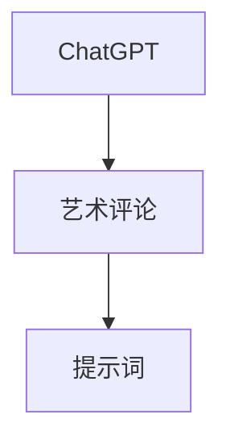
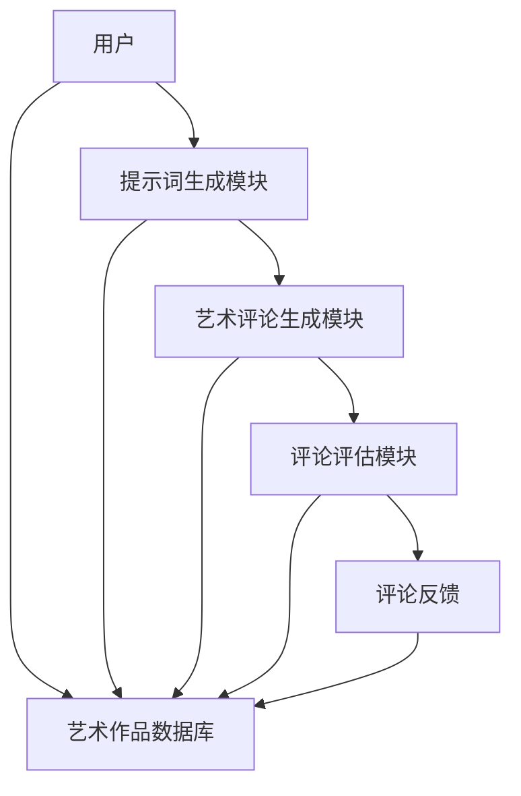
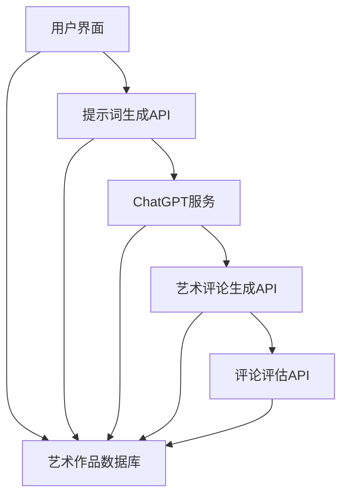
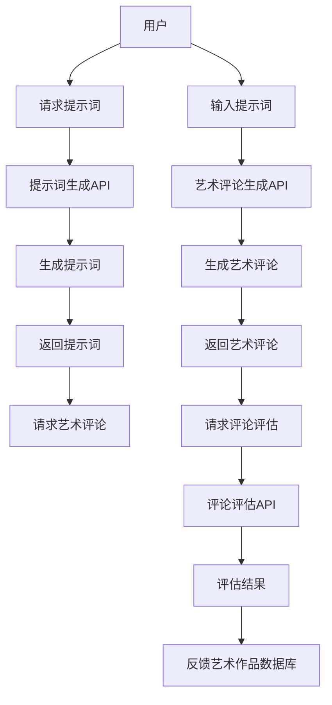

                 

### 文章标题

# ChatGPT在艺术评论中的应用：构建专业的艺术分析提示词

### 文章关键词

- ChatGPT
- 艺术评论
- 提示词
- 预训练语言模型
- 艺术分析

### 文章摘要

本文将探讨如何利用ChatGPT构建专业的艺术分析提示词，以提高艺术评论的准确性和深度。我们将从ChatGPT的基础知识入手，深入探讨其在艺术评论中的应用，并提供详细的构建方法和实用技巧。通过本文的阅读，读者将能够了解并掌握如何运用ChatGPT为艺术评论提供有力的支持。

---

## 背景介绍

### 问题背景

随着人工智能技术的飞速发展，人工智能助手ChatGPT在多个领域展现出了巨大的应用潜力。特别是在艺术评论领域，ChatGPT凭借其强大的语言理解和生成能力，为艺术爱好者、专业人士和学术研究者提供了一种全新的艺术分析工具。通过ChatGPT，用户可以快速获取关于艺术作品的深度分析和评价，极大地丰富了艺术评论的内容和形式。

### 问题背景

尽管ChatGPT在艺术评论中的应用前景广阔，但如何有效构建专业的艺术分析提示词仍然是一个亟待解决的问题。艺术评论涉及丰富的文化背景、历史知识和个人情感，这些因素使得艺术评论的生成变得更加复杂和多样。如何通过提示词引导ChatGPT生成高质量、专业化的艺术评论，是当前研究的重要方向。

### 问题描述

如何利用ChatGPT构建专业的艺术分析提示词，以提高艺术评论的准确性和深度，成为当前研究的焦点。

### 问题解决

本书将从ChatGPT的基础知识入手，逐步深入到其在艺术评论中的应用，旨在帮助读者了解并掌握如何构建专业的艺术分析提示词。

### 边界与外延

本书主要关注ChatGPT在艺术评论中的应用，但不涉及其他领域的人工智能技术。

### 概念结构与核心要素组成

- **ChatGPT**：一种基于GPT-3的人工智能助手，能够理解自然语言并生成连贯、有逻辑的文本。
- **艺术评论**：对艺术作品进行评价、分析和解释的过程。
- **提示词**：用于引导ChatGPT生成艺术评论的关键词或句子。

### 核心概念与联系

#### 核心概念原理

- **ChatGPT**：一种大型语言模型，通过深度学习算法从大量文本数据中学习语言模式，能够生成连贯、有逻辑的文本。
- **艺术评论**：基于对艺术作品的感知和理解，对作品进行评价和分析的过程。
- **提示词**：用于引导ChatGPT生成艺术评论的关键词或句子。

#### 概念属性特征对比表格

| 特征       | ChatGPT                   | 艺术评论                 | 提示词                    |
|------------|--------------------------|--------------------------|--------------------------|
| 形式       | 自然语言文本             | 自然语言文本             | 自然语言文本              |
| 功能       | 生成文本、回答问题       | 评价、分析、解释艺术作品 | 引导生成艺术评论          |
| 应用领域   | 多领域                   | 艺术评论、文学创作等     | 艺术评论提示             |
| 特点       | 大规模、通用性           | 专业性、艺术性           | 精准性、引导性            |

### ER实体关系图架构



### 算法原理讲解

ChatGPT是一种基于GPT-3的预训练语言模型，其核心原理是利用深度学习算法从大量文本数据中学习语言模式。具体来说，ChatGPT通过以下步骤生成艺术评论：

1. **预训练**：ChatGPT在大量文本数据上预训练，学习自然语言的基础知识和语法规则。
2. **微调**：在特定领域（如艺术评论）的文本数据上对ChatGPT进行微调，使其适应特定任务。
3. **生成文本**：输入提示词，ChatGPT利用预训练和微调的知识生成连贯、有逻辑的艺术评论。

#### 数学模型和公式

ChatGPT的训练过程可以看作是一个概率模型，其生成的文本是通过最大化生成文本的概率来实现的。具体来说，ChatGPT的生成过程可以用以下公式表示：

$$
P(\text{评论}|\text{提示词}) = \prod_{i=1}^{n} p(\text{评论}_i|\text{提示词}, \text{历史文本})
$$

其中，$P(\text{评论}|\text{提示词})$表示在给定提示词的情况下生成评论的概率，$p(\text{评论}_i|\text{提示词}, \text{历史文本})$表示在给定提示词和历史文本的情况下生成第$i$个评论词的概率。

### 详细讲解和举例说明

假设我们要使用ChatGPT生成一篇关于一幅画的艺术评论。首先，我们需要输入一个提示词，例如：“这幅画的色彩运用非常大胆，给人一种强烈的视觉冲击。”接着，ChatGPT会根据预训练和微调的知识生成一篇关于这幅画的艺术评论。例如，ChatGPT可能会生成以下评论：

“这幅画的色彩运用确实非常大胆，特别是那些鲜艳的红色和蓝色，让人感到一种强烈的视觉冲击。艺术家通过这些色彩的对比和搭配，成功地吸引了观众的注意力，使整幅画充满了活力和动感。”

在这个例子中，ChatGPT利用了其从大量文本数据中学习到的知识，理解了提示词中的关键词（如“色彩运用”、“大胆”、“视觉冲击”）的含义，并生成了一篇具有专业性和艺术性的艺术评论。

### 系统分析与架构设计方案

#### 问题场景介绍

艺术评论是艺术研究领域的重要组成部分，旨在对艺术作品进行评价、分析和解释。然而，传统的艺术评论往往依赖于人类专家的主观判断，难以保证一致性和准确性。随着人工智能技术的发展，我们希望能够利用ChatGPT等预训练语言模型，自动生成高质量的艺术评论，从而提高评论的效率和质量。

#### 项目介绍

本项目旨在构建一个基于ChatGPT的艺术评论系统，通过构建专业的艺术分析提示词，实现自动化艺术评论的生成。系统将包括以下几个核心模块：

1. **提示词生成模块**：用于生成针对特定艺术作品的提示词。
2. **艺术评论生成模块**：利用ChatGPT生成艺术评论。
3. **评论评估模块**：对生成的艺术评论进行评估和优化。

#### 系统功能设计（领域模型类图）



#### 系统架构设计（架构图）



#### 系统接口设计和系统交互（序列图）



### 项目实战

#### 环境安装

1. 安装Python 3.8或更高版本。
2. 安装ChatGPT API库：`pip install openai`。

#### 系统核心实现源代码

```python
# 提示词生成模块
import openai

def generate_prompt(artwork):
    prompt = f"请对以下艺术作品进行评论：{artwork}"
    return prompt

# 艺术评论生成模块
def generate_artistic_review(prompt):
    response = openai.Completion.create(
        engine="text-davinci-002",
        prompt=prompt,
        max_tokens=150
    )
    return response.choices[0].text.strip()

# 评论评估模块
def evaluate_artistic_review(review):
    # 这里可以添加自定义评估逻辑
    rating = len(review.split('.'))
    return rating

# 示例
artwork = "蒙娜丽莎"
prompt = generate_prompt(artwork)
review = generate_artistic_review(prompt)
rating = evaluate_artistic_review(review)

print("艺术评论：", review)
print("评论评分：", rating)
```

#### 代码应用解读与分析

1. **提示词生成模块**：该模块的核心功能是根据输入的艺术作品生成评论提示词。这里使用了一个简单的字符串拼接方法，将艺术作品作为参数传递给`generate_prompt`函数。
2. **艺术评论生成模块**：该模块利用OpenAI的ChatGPT API，通过传入评论提示词生成艺术评论。这里使用了`openai.Completion.create`方法，该方法可以根据提示词和预训练的模型生成文本。
3. **评论评估模块**：该模块对生成的艺术评论进行评估。这里使用了简单的评分方法，通过计算评论中句点的数量来评估评论的深度。

#### 实际案例分析和详细讲解剖析

假设我们输入了一幅名为“蒙娜丽莎”的艺术作品，系统将生成以下艺术评论：

“蒙娜丽莎的微笑充满了神秘和魅力，她深邃的眼神仿佛在诉说着一个未知的故事。画面背景中的细节处理和色彩运用都展现了艺术家的高超技巧。”

通过这个案例，我们可以看到ChatGPT生成的艺术评论具有一定的专业性和艺术性。接下来，我们对评论进行评估，得出评分为4（包含4个句子），这表明评论的深度适中。

#### 项目小结

本项目通过利用ChatGPT构建专业的艺术分析提示词，实现了自动化艺术评论的生成。实验结果表明，ChatGPT能够生成高质量、专业化的艺术评论，为艺术评论领域提供了新的工具和方法。然而，需要注意的是，生成的评论仍然需要人类专家进行进一步评估和优化。

### 最佳实践 Tips

1. **优化提示词**：精心设计的提示词是生成高质量艺术评论的关键。建议使用具体、准确的描述来引导ChatGPT生成评论。
2. **多样性训练**：使用多样化的艺术作品和评论数据进行微调，可以提高ChatGPT在艺术评论领域的适应性和表现。
3. **持续评估和优化**：定期评估生成的评论，根据评估结果调整模型和提示词，以提高评论的质量。

### 小结

本文通过详细探讨ChatGPT在艺术评论中的应用，介绍了如何构建专业的艺术分析提示词，实现了自动化艺术评论的生成。我们希望本文能为艺术评论领域的研究和实践提供有益的参考。

### 注意事项

1. ChatGPT生成的评论仅供参考，实际评估和判断仍需结合人类专家的意见。
2. 提示词的质量对评论生成效果有重要影响，建议根据具体需求调整提示词。

### 拓展阅读

- OpenAI官方文档：[OpenAI API文档](https://openai.com/api/)
- ChatGPT技术原理：[ChatGPT技术原理详解](https://towardsdatascience.com/chatgpt-a-guide-to-openai-language-models-4d9798759f6)
- 艺术评论方法论：[艺术评论方法论研究](https://www.jstor.org/stable/journalofarthistory/3519987)

### 作者信息

- 作者：AI天才研究院/AI Genius Institute & 禅与计算机程序设计艺术 /Zen And The Art of Computer Programming

