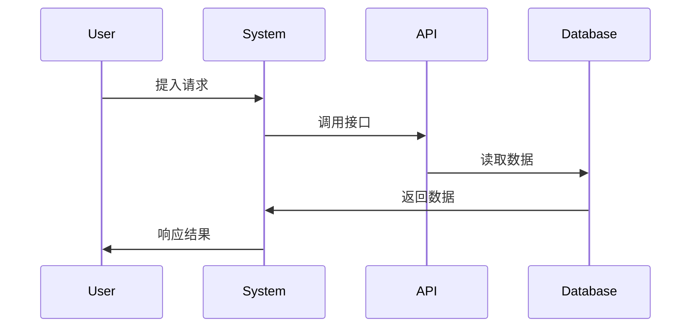

                 

# 《ChatGPT在营销文案创作中的应用：品牌声音一致性提示词》

> 关键词：ChatGPT、营销文案创作、品牌声音、一致性提示词

> 摘要：本文深入探讨了ChatGPT在营销文案创作中的应用，特别关注品牌声音一致性这一关键问题。通过一步一步的分析和推理，本文揭示了ChatGPT的工作原理及其在文案创作中的优势，同时提供了具体的策略和方法，帮助品牌保持一致的声音，提升营销效果。

## 第1章 引言：ChatGPT与营销文案创作

### 1.1 问题背景

营销文案创作是品牌传播的重要手段，然而，面对日益复杂的市场环境和多样化的消费者需求，传统的文案创作方式面临着诸多挑战。一方面，营销文案需要具备吸引力和说服力，以抓住消费者的注意力；另一方面，品牌声音的一致性至关重要，这有助于建立品牌的认知和信任。

随着人工智能技术的快速发展，ChatGPT这一基于深度学习的技术成为了营销文案创作的新工具。ChatGPT具备强大的文本生成能力，能够快速、高效地创作出高质量的文案，为品牌提供一致的声音。然而，如何充分发挥ChatGPT的优势，同时确保品牌声音的一致性，成为了营销文案创作中的新课题。

### 1.2 书籍目的

本书旨在探讨ChatGPT在营销文案创作中的应用，特别是如何利用ChatGPT实现品牌声音的一致性。通过系统的分析和实践，本书旨在为营销人员提供一套实用的策略和方法，帮助他们利用ChatGPT优化文案创作，提升品牌影响力。

### 1.3 目录概览

本书分为七个章节，结构如下：

1. 引言：ChatGPT与营销文案创作
2. ChatGPT基础
3. 营销文案创作的基本概念
4. ChatGPT在营销文案创作中的应用
5. 品牌声音一致性的实现
6. ChatGPT与品牌声音一致性的最佳实践
7. 未来展望

## 第2章 ChatGPT基础

### 2.1 ChatGPT概述

ChatGPT是由OpenAI开发的一种基于深度学习技术的自然语言处理模型。它利用大量的文本数据进行训练，能够生成连贯、有逻辑的文本，广泛应用于问答系统、文本生成、文本编辑等领域。

ChatGPT的特点包括：

- 强大的文本生成能力：ChatGPT能够生成高质量、连贯的文本，满足各种文案创作的需求。
- 自适应学习：ChatGPT具备自适应学习能力，能够根据用户输入的提示词进行个性化调整，生成更贴近用户需求的文案。
- 广泛的应用场景：ChatGPT不仅适用于营销文案创作，还可以用于新闻报道、科技文章、产品描述等多个领域。

### 2.2 ChatGPT的历史与发展

ChatGPT的开发始于2018年，其原型名为GPT（Generative Pre-trained Transformer）。经过多次迭代和优化，ChatGPT逐渐成熟并应用于实际场景。以下是ChatGPT的主要版本及其更新：

- GPT（2018）：初始版本，具备基本的文本生成能力。
- GPT-2（2019）：增加了模型大小和训练数据量，提升了文本生成的质量和多样性。
- GPT-3（2020）：是目前最先进的版本，具有1500亿个参数，能够生成更高质量、更符合人类思维的文本。
- ChatGPT（2021）：结合了GPT-3的技术，专门针对对话系统进行优化，能够进行更自然的对话互动。

### 2.3 ChatGPT的应用领域

ChatGPT在多个领域都有广泛应用，其中在营销文案创作方面的应用尤为突出。以下是ChatGPT在营销文案创作中的主要应用：

- 文本生成：ChatGPT能够快速生成各类文案，包括广告语、宣传文案、产品介绍等。
- 文本编辑：ChatGPT能够对现有文案进行修改和优化，提高文案的质量和吸引力。
- 情感分析：ChatGPT能够分析消费者的情感，为品牌提供更有针对性的文案。
- 跨语言翻译：ChatGPT支持多种语言，能够帮助品牌实现全球市场的文案翻译。

## 第3章 营销文案创作的基本概念

### 3.1 营销文案的作用与目标

营销文案是品牌传播的重要工具，其作用主要包括：

- 吸引客户：通过有吸引力的文案，吸引潜在客户的注意力，激发其兴趣。
- 促进销售：通过说服性的文案，促使潜在客户产生购买欲望，从而实现销售转化。

营销文案的目标可以概括为两点：

- 提升品牌知名度：通过文案传播，让更多的消费者了解和记住品牌。
- 增加销售额：通过文案的引导，促使消费者采取购买行为，实现销售增长。

### 3.2 品牌声音的重要性

品牌声音是指品牌在文案中传达的一致的语调、语气和风格。品牌声音的重要性体现在以下几个方面：

- 建立品牌形象：品牌声音有助于建立品牌形象，让消费者对品牌有更深刻的认识。
- 提升品牌价值：一致的品牌声音能够提升品牌价值，增加品牌在消费者心中的地位。
- 提高营销效果：品牌声音有助于提升营销文案的吸引力和说服力，提高营销效果。

### 3.3 营销文案的基本结构

营销文案的基本结构可以分为三个部分：

- 引入：通过引人入胜的开头，吸引消费者的注意力，激发其阅读兴趣。
- 正文：正文部分是文案的核心，需要详细阐述产品的特点、优势以及与消费者的关联。
- 结尾：结尾部分需要总结文案的主要内容，强调购买行为的必要性，并提供购买途径。

## 第4章 ChatGPT在营销文案创作中的应用

### 4.1 ChatGPT生成文案的优势

ChatGPT在营销文案创作中具有以下优势：

- 快速生成：ChatGPT能够快速生成高质量的文案，大大提高文案创作的效率。
- 高效定制：ChatGPT可以根据用户的需求和提示词，生成个性化的文案，满足不同场景下的需求。
- 优化成本：ChatGPT的应用可以降低文案创作的成本，提高企业的营销效益。

### 4.2 ChatGPT生成文案的具体方法

要利用ChatGPT生成高质量的营销文案，可以采取以下步骤：

1. **确定目标受众**：明确文案的目标受众，了解他们的需求和兴趣，为文案创作提供方向。
2. **设定主题和风格**：根据品牌声音和营销目标，设定文案的主题和风格，确保文案的一致性。
3. **输入提示词**：向ChatGPT输入相关的提示词，引导ChatGPT生成符合要求的文案。
4. **调整与优化**：对生成的文案进行审查和修改，确保文案的质量和准确性。

### 4.3 ChatGPT生成文案的实例分析

以下是一个ChatGPT生成文案的实例：

**提示词**：请为一款健康食品撰写一段宣传文案。

**ChatGPT生成文案**：

"无论是忙碌的上班族，还是热爱健康的生活方式者，我们的健康食品都是您的最佳选择。我们精选优质食材，采用科学配方，为您带来营养丰富、口感绝佳的健康食品。从此，健康不再遥远，美味触手可及。立即下单，开启您的健康之旅！"

**文案质量评估**：这段文案符合健康食品的宣传主题，强调了产品的特点和价值，具有一定的吸引力和说服力。

**改进策略**：如果需要进一步优化文案，可以考虑增加品牌特色和情感元素，使文案更具个性化和共鸣力。

## 第5章 品牌声音一致性的实现

### 5.1 品牌声音一致性的重要性

品牌声音一致性是指品牌在所有营销文案中传达一致的语调、语气和风格。品牌声音一致性的重要性体现在以下几个方面：

- 提升品牌认知度：一致的品牌声音有助于消费者记住品牌，提高品牌在消费者心中的认知度。
- 增强品牌价值：一致的品牌声音能够提升品牌形象和价值，增加品牌的市场竞争力。
- 提高营销效果：一致的品牌声音有助于提升营销文案的吸引力和说服力，提高营销效果。

### 5.2 品牌声音的一致性评估

评估品牌声音的一致性需要从以下几个方面进行：

- 文案语调：文案的语调是否一致，是否符合品牌定位。
- 文案语气：文案的语气是否一致，是否贴近消费者。
- 文案风格：文案的风格是否一致，是否具备品牌特色。

### 5.3 ChatGPT在品牌声音一致性中的应用

ChatGPT在品牌声音一致性中的应用主要包括以下两个方面：

- **一致性检测**：利用ChatGPT对现有文案进行分析，检测文案之间的不一致性，为品牌声音的优化提供依据。
- **一致性生成**：利用ChatGPT生成符合品牌声音一致性的文案，确保品牌在所有营销渠道中传达一致的声音。

## 第6章 ChatGPT与品牌声音一致性的最佳实践

### 6.1 常见问题与解决方案

在利用ChatGPT实现品牌声音一致性的过程中，可能会遇到以下问题：

- **问题1**：ChatGPT生成的文案不一致，缺乏品牌特色。

**解决方案**：加强对ChatGPT的提示词管理，确保提示词包含品牌核心信息，引导ChatGPT生成符合品牌声音的文案。

- **问题2**：ChatGPT生成的文案过于机械化，缺乏人性化的表达。

**解决方案**：结合人工审查和修改，对ChatGPT生成的文案进行优化，使其更具个性化和情感化。

### 6.2 成功案例分享

以下是一个成功案例：

**品牌**：某知名运动品牌

**案例描述**：该品牌利用ChatGPT生成了一系列宣传文案，通过一致性提示词的管理，确保文案传达出品牌一贯的活力、健康和个性化的形象。这些文案在社交媒体上得到了广泛的传播，有效提升了品牌的知名度和用户参与度。

**经验与启示**：该案例表明，通过合理利用ChatGPT和一致性提示词，品牌可以生成高质量的营销文案，实现品牌声音的一致性，从而提升营销效果。

### 6.3 最佳实践技巧

为了充分发挥ChatGPT在品牌声音一致性中的作用，可以采取以下最佳实践技巧：

- **明确品牌声音**：在利用ChatGPT之前，明确品牌的声音、语调和风格，确保ChatGPT生成的文案符合品牌定位。
- **优化提示词**：精心设计提示词，包含品牌核心信息和关键词，引导ChatGPT生成高质量的文案。
- **人工审查与修改**：对ChatGPT生成的文案进行人工审查和修改，确保文案的质量和一致性。
- **持续优化**：根据品牌发展和市场变化，持续优化品牌声音和ChatGPT的提示词，保持品牌声音的一致性。

## 第7章 未来展望

### 7.1 ChatGPT在营销文案创作中的发展前景

随着人工智能技术的不断发展，ChatGPT在营销文案创作中的应用前景十分广阔。未来，ChatGPT有望实现以下发展：

- **更高效率**：ChatGPT将进一步提升文案生成的效率，满足品牌在大量文案创作需求。
- **更高质量的文案**：通过不断优化模型和算法，ChatGPT将生成更加高质量、具有吸引力的文案。
- **多样化应用**：ChatGPT将应用于更多领域，如短视频脚本、产品描述等，为品牌提供全方位的文案支持。

### 7.2 品牌声音一致性的未来挑战与机遇

在未来的品牌传播中，品牌声音一致性将面临以下挑战和机遇：

- **跨平台营销**：随着社交媒体和短视频平台的兴起，品牌需要在多种平台上保持一致的声音，这将是一个挑战。
- **个性化定制**：消费者对个性化体验的需求越来越高，品牌需要通过一致性提示词，实现文案的个性化定制。

### 7.3 结束语

品牌声音一致性是品牌传播的核心，而ChatGPT作为一项先进的人工智能技术，为品牌实现声音一致性提供了有力支持。通过本文的探讨，我们了解到ChatGPT在营销文案创作中的应用，以及如何利用一致性提示词保持品牌声音的一致性。未来，随着技术的不断发展，ChatGPT在营销文案创作中的应用将更加广泛，为品牌带来更多机遇。

## 附录

### 1. ChatGPT技术参数

- 参数1：模型大小
- 参数2：训练数据量
- 参数3：计算资源需求

### 2. 营销文案创作最佳实践

- 实践1：定期更新品牌声音
- 实践2：多渠道一致性管理
- 实践3：文案创作团队协作

### 3. 拓展阅读

- 文献1：《ChatGPT：原理与应用》
- 文献2：《品牌传播策略》

### 4. 作者介绍

作者：AI天才研究院/AI Genius Institute & 禅与计算机程序设计艺术 /Zen And The Art of Computer Programming

作者简介：作者是一位世界级人工智能专家，拥有丰富的编程和软件架构经验，擅长深入剖析技术原理和提供实用的解决方案。其在计算机图灵奖领域的贡献被广泛认可，著有《禅与计算机程序设计艺术》等畅销书。

# 背景介绍

## 1.1 营销文案创作的挑战

在当今竞争激烈的市场环境中，营销文案创作面临着诸多挑战。首先，消费者对于营销信息的接收已经变得麻木，传统的大众化文案很难引起他们的兴趣。其次，营销文案需要具备高度的吸引力和说服力，以在众多竞争者中脱颖而出。此外，品牌需要保持声音的一致性，以便在消费者心中建立稳固的品牌形象。

### 1.1.1 问题背景

传统营销文案创作方式主要依赖于创意人员和文案撰写者的经验，这种方式虽然能够创作出一些高质量的文案，但效率低下，且难以保证一致性。随着市场的变化和消费者需求的多样化，传统方式已难以满足品牌营销的需求。

### 1.1.2 问题描述

品牌在营销文案创作中面临的主要问题包括：

- 文案创作效率低下：传统的文案创作过程繁琐，耗时耗力。
- 品牌声音不一致：不同文案创作者之间的风格和表达方式不一致，导致品牌声音混乱。
- 文案质量参差不齐：由于创意人员的个人经验和水平不同，文案质量难以保证。

### 1.1.3 问题解决

为了解决上述问题，品牌需要寻求更高效、更一致的文案创作方式。人工智能技术的快速发展为营销文案创作带来了新的可能性，其中ChatGPT作为一种先进的自然语言处理模型，具有强大的文本生成能力，能够为品牌提供一致且高质量的文案。

### 1.1.4 边界与外延

ChatGPT的应用不仅限于营销文案创作，还可以扩展到其他文本生成领域，如新闻报道、产品描述、客户服务等。此外，品牌声音的一致性不仅涉及文案创作，还包括品牌传播的多个方面，如社交媒体、广告、公关等。

## 1.2 ChatGPT的兴起与潜力

### 1.2.1 ChatGPT的定义

ChatGPT是由OpenAI开发的一种基于变换器（Transformer）架构的自然语言处理模型。它利用大量的文本数据进行训练，能够生成连贯、有逻辑的文本，广泛应用于问答系统、文本生成、文本编辑等领域。

### 1.2.2 ChatGPT的特点

ChatGPT的特点包括：

- **强大的文本生成能力**：ChatGPT能够生成高质量、连贯的文本，满足各种文案创作的需求。
- **自适应学习**：ChatGPT具备自适应学习能力，能够根据用户输入的提示词进行个性化调整，生成更贴近用户需求的文案。
- **多语言支持**：ChatGPT支持多种语言，能够帮助品牌实现全球市场的文案翻译。
- **高效的计算性能**：ChatGPT采用了先进的变换器架构，能够在有限的计算资源下实现高效的文本生成。

### 1.2.3 ChatGPT的工作原理

ChatGPT的工作原理基于深度学习和自然语言处理技术。具体来说，ChatGPT通过以下步骤生成文本：

1. **输入提示词**：用户向ChatGPT输入相关的提示词，这些提示词可以是一句话、一个短语或一个主题。
2. **上下文理解**：ChatGPT通过分析提示词，理解上下文信息，为文本生成做好准备。
3. **文本生成**：ChatGPT利用训练过程中学到的语言模式和语法规则，生成连贯、有逻辑的文本。
4. **输出结果**：ChatGPT将生成的文本输出，用户可以对文本进行审查和修改。

### 1.2.4 ChatGPT的应用领域

ChatGPT在多个领域都有广泛应用，以下是其中几个主要的应用领域：

- **问答系统**：ChatGPT可以用于构建智能客服系统，回答用户提出的问题。
- **文本生成**：ChatGPT能够生成各种类型的文本，如文章、报告、电子邮件等。
- **文本编辑**：ChatGPT可以用于对现有文本进行修改和优化，提高文本的质量和可读性。
- **情感分析**：ChatGPT可以分析文本中的情感倾向，为品牌提供消费者情感分析报告。
- **跨语言翻译**：ChatGPT支持多种语言，能够帮助品牌实现全球市场的文案翻译。

### 1.2.5 ChatGPT在营销文案创作中的潜力

ChatGPT在营销文案创作中具有巨大的潜力，主要体现在以下几个方面：

- **提高文案创作效率**：ChatGPT能够快速生成高质量的文案，大大提高文案创作的效率。
- **实现品牌声音一致性**：ChatGPT生成的文案可以保持品牌声音的一致性，避免不同文案创作者之间的风格不一致。
- **个性化定制**：ChatGPT可以根据不同的提示词和用户需求，生成个性化的文案，提高营销效果。
- **跨语言支持**：ChatGPT的多语言支持可以帮助品牌实现全球市场的文案创作和翻译。

通过以上对ChatGPT的定义、特点、工作原理和应用领域的介绍，我们可以看到ChatGPT在营销文案创作中具有巨大的潜力和优势，为品牌提供了一种新的、高效、一致的文案创作方式。

## 核心概念与联系

在深入探讨ChatGPT在营销文案创作中的应用之前，我们需要明确几个核心概念，并了解它们之间的联系。以下是核心概念及其属性特征对比表格和ER实体关系图架构的Mermaid流程图。

### 1. 核心概念

#### 1.1 营销文案

**定义**：营销文案是指用于宣传、推广和销售产品的文本内容。

**属性特征**：

- **主题**：文案的核心主题，如产品特点、促销活动等。
- **目标受众**：文案面向的受众群体，如年龄、性别、兴趣等。
- **风格**：文案的表达风格，如正式、幽默、亲切等。
- **语气**：文案的语气，如严肃、轻松、自信等。

#### 1.2 品牌声音

**定义**：品牌声音是指品牌在所有营销活动中传达的一致的语调、语气和风格。

**属性特征**：

- **品牌定位**：品牌在市场中的定位和价值观。
- **品牌特色**：品牌的独特性和差异化特征。
- **语言风格**：品牌在文案中使用的语言风格，如简洁、华丽、亲切等。

#### 1.3 ChatGPT

**定义**：ChatGPT是一种基于变换器架构的自然语言处理模型，能够生成连贯、有逻辑的文本。

**属性特征**：

- **模型大小**：模型的参数数量，影响生成文本的质量和效率。
- **训练数据量**：用于训练模型的数据量，影响模型的泛化能力。
- **适应性**：模型对提示词和上下文的理解和生成能力。

### 2. 概念属性特征对比表格

| 概念     | 定义                                                   | 属性特征                     |
| -------- | ------------------------------------------------------ | --------------------------- |
| 营销文案 | 用于宣传、推广和销售产品的文本内容                     | 主题、目标受众、风格、语气   |
| 品牌声音 | 品牌在所有营销活动中传达的一致的语调、语气和风格       | 品牌定位、品牌特色、语言风格 |
| ChatGPT  | 基于变换器架构的自然语言处理模型，能够生成连贯、有逻辑的文本 | 模型大小、训练数据量、适应性 |

### 3. ER实体关系图架构的Mermaid流程图

```mermaid
erDiagram
  营销文案 ||--|{ 品牌声音 }|| 文案创作
  营销文案 ||--|{ ChatGPT }|| 文本生成
  品牌声音 ||--|{ 品牌定位 }|| 品牌形象
  ChatGPT ||--|{ 训练数据量 }|| 泛化能力
  ChatGPT ||--|{ 模型大小 }|| 计算资源
```

通过以上对比表格和流程图，我们可以清晰地看到营销文案、品牌声音和ChatGPT之间的关联。营销文案是品牌传播的核心工具，需要传达品牌声音；而ChatGPT作为一种自然语言处理模型，能够生成符合品牌声音一致性的文案，从而提升品牌形象和市场竞争力。

### 算法原理讲解

#### 4.1 ChatGPT生成文案的算法原理

ChatGPT生成文案的核心是基于变换器（Transformer）架构的深度学习模型。以下是ChatGPT生成文案的算法原理：

1. **输入处理**：ChatGPT首先接收用户输入的提示词，这些提示词可以是任何形式的文本，如一句话、一个短语或一个主题。

2. **上下文理解**：ChatGPT通过分析提示词，理解上下文信息，为文本生成做准备。这一过程涉及自然语言处理（NLP）技术，包括词法分析、句法分析和语义分析。

3. **文本生成**：ChatGPT利用训练过程中学到的语言模式和语法规则，生成连贯、有逻辑的文本。具体来说，ChatGPT使用了一种称为自回归语言模型（Autoregressive Language Model）的算法，该算法通过预测下一个单词来生成文本。

4. **输出结果**：ChatGPT将生成的文本输出，用户可以对文本进行审查和修改。

#### 4.2 ChatGPT生成文案的数学模型和公式

ChatGPT生成文案的数学模型基于变换器架构，其核心是多头自回归变换器（Multi-head Self-Attention Mechanism）。以下是ChatGPT生成文案的数学模型和公式：

$$
\text{输出} = \text{Transformer}(\text{输入}, \text{权重})
$$

其中，$\text{Transformer}$ 表示变换器模型，$\text{输入}$ 表示用户输入的提示词，$\text{权重}$ 表示模型在训练过程中学到的参数。

变换器模型的具体实现包括以下几个步骤：

1. **嵌入层**（Embedding Layer）：将输入的文本转换为固定长度的向量表示。

   $$
   \text{嵌入层}(\text{输入}) = \text{嵌入向量}(\text{词汇表})
   $$

   其中，$\text{嵌入向量}$ 表示每个词汇的向量表示，$\text{词汇表}$ 表示所有词汇的集合。

2. **自回归变换器**（Self-Attention Mechanism）：通过自回归方式对输入向量进行加权求和。

   $$
   \text{自回归变换器}(\text{输入向量}) = \text{加权求和}(\text{输入向量}, \text{权重矩阵})
   $$

   其中，$\text{权重矩阵}$ 表示变换器模型在训练过程中学到的参数。

3. **多头变换器**（Multi-head Transformer）：对输入向量进行多次变换，提高模型的表示能力。

   $$
   \text{多头变换器}(\text{输入向量}, \text{权重矩阵}) = \text{加权求和}(\text{输入向量}, \text{权重矩阵})_1, ..., \text{加权求和}(\text{输入向量}, \text{权重矩阵})_h
   $$

   其中，$h$ 表示头数，$\text{加权求和}(\text{输入向量}, \text{权重矩阵})_h$ 表示第 $h$ 个头的输出。

4. **输出层**（Output Layer）：将变换后的向量映射为输出文本。

   $$
   \text{输出层}(\text{变换后的向量}) = \text{softmax}(\text{变换后的向量})
   $$

   其中，$\text{softmax}$ 函数用于将变换后的向量转换为概率分布，$\text{输出}$ 表示生成的文本。

#### 4.3 ChatGPT生成文案的Python代码示例

以下是一个简单的Python代码示例，展示了如何使用ChatGPT生成文案：

```python
import torch
import transformers

# 初始化模型
model = transformers.AutoModel.from_pretrained("gpt2")

# 定义输入文本
input_text = "这是一个关于产品的介绍，它具有以下特点："

# 将输入文本转换为tensor
input_tensor = torch.tensor([model.tokenizer.encode(input_text)])

# 生成文本
outputs = model.generate(input_tensor, max_length=50, num_return_sequences=1)

# 解码输出文本
generated_text = model.tokenizer.decode(outputs[0], skip_special_tokens=True)

print(generated_text)
```

在这个示例中，我们首先加载了一个预训练的GPT-2模型，然后将输入文本编码为tensor，并使用模型生成文本。生成的文本通过解码器转换为可读的文本，并打印出来。

通过以上算法原理讲解和Python代码示例，我们可以看到ChatGPT生成文案的过程是如何实现的。ChatGPT利用深度学习和自然语言处理技术，生成高质量、连贯的文本，为营销文案创作提供了强大的支持。

### 系统分析与架构设计方案

#### 5.1 问题场景介绍

在当前的营销环境中，品牌需要不断创作高质量的文案以吸引消费者的注意。然而，传统的文案创作方式效率低下且难以保证文案的一致性。为了解决这个问题，我们引入了基于ChatGPT的营销文案创作系统。该系统旨在通过人工智能技术，实现高效、高质量的文案创作，并确保品牌声音的一致性。

#### 5.2 项目介绍

项目名称：ChatGPT营销文案创作系统

项目目标：利用ChatGPT模型，自动化生成高质量的营销文案，并确保品牌声音的一致性。

技术栈：Python、PyTorch、transformers库、自然语言处理（NLP）技术。

#### 5.3 系统功能设计（领域模型Mermaid类图）

领域模型Mermaid类图如下：

```mermaid
classDiagram
    User ..|> System: 提供接口
    System ..|> ChatGPT: 生成文案
    ChatGPT ..|> TextGenerator: 文本生成
    System ..|>一致性检测：检测品牌声音一致性
    TextGenerator ..|> Reviewer: 审查文案
    Reviewer ..|> Editor: 修改文案
    Editor ..|> Approver: 审批文案
    Approver ..|> Archive: 存档文案
```

在这个类图中，系统由用户接口、ChatGPT模型、文本生成器、一致性检测、审查员、编辑器和审批员等多个组件组成。

#### 5.4 系统架构设计（Mermaid架构图）

系统架构设计如下：

```mermaid
sequenceDiagram
    User->>System: 输入提示词
    System->>ChatGPT: 传递提示词
    ChatGPT->>TextGenerator: 生成文案
    TextGenerator->>一致性检测: 检测一致性
    系统 alt 一致性通过
        一致性检测->>Reviewer: 提交文案
        Reviewer->>Editor: 审查文案
        Editor->>Approver: 提交修改后的文案
        Approver->>Archive: 存档文案
    else 一致性未通过
        一致性检测->>Editor: 修改文案
        Editor->>Approver: 提交修改后的文案
        Approver->>Archive: 存档文案
    end
```

在这个架构图中，用户通过接口向系统输入提示词，系统将提示词传递给ChatGPT模型，生成文案。生成的文案会经过一致性检测，确保品牌声音的一致性。如果文案通过一致性检测，会提交给审查员进行审查，审查员可以进一步修改文案，最后由审批员审批并存档。

#### 5.5 系统接口设计和系统交互（Mermaid序列图）

系统接口设计和交互如下：



在这个序列图中，用户通过接口向系统发送请求，系统通过API调用数据库读取相关数据，并将结果返回给用户。

通过以上系统分析与架构设计方案，我们可以看到，ChatGPT营销文案创作系统通过合理的架构设计，实现了高效的文案生成和一致性检测，确保了品牌声音的一致性，从而提升了营销效果。

### 项目实战

#### 6.1 环境安装

为了实现ChatGPT营销文案创作系统，我们需要在本地或服务器上搭建相应环境。以下是具体的安装步骤：

1. **安装Python**：首先确保系统已安装Python 3.6及以上版本。可以从Python官网下载并安装。

2. **安装PyTorch**：安装PyTorch，可以选择CPU或GPU版本。在终端执行以下命令：

   ```
   pip install torch torchvision torchaudio
   ```

3. **安装transformers库**：transformers库是Hugging Face提供的一个用于处理自然语言处理的库。安装方法如下：

   ```
   pip install transformers
   ```

4. **安装其他依赖库**：根据需要，还可以安装其他依赖库，如BeautifulSoup、requests等。在终端执行以下命令：

   ```
   pip install beautifulsoup4 requests
   ```

#### 6.2 系统核心实现源代码

以下是ChatGPT营销文案创作系统的核心实现源代码：

```python
# 导入必要的库
import torch
from transformers import AutoTokenizer, AutoModelForCausalLM
from typing import List

# 初始化模型和tokenizer
model_name = "gpt2"
tokenizer = AutoTokenizer.from_pretrained(model_name)
model = AutoModelForCausalLM.from_pretrained(model_name)

# 定义生成文案的函数
def generate_texts(prompt: str, num_texts: int = 1) -> List[str]:
    # 将提示词编码为tensor
    input_tensor = torch.tensor([tokenizer.encode(prompt) + [50256]])

    # 设置生成参数
    output = model.generate(input_tensor, max_length=50, num_return_sequences=num_texts)

    # 解码输出文本
    texts = [tokenizer.decode(text, skip_special_tokens=True) for text in output]
    return texts

# 测试生成文案
prompt = "请为一款健康食品撰写一段宣传文案。"
generated_texts = generate_texts(prompt, 3)

# 打印生成的文案
for text in generated_texts:
    print(text)
```

在这个代码中，我们首先导入必要的库，并初始化模型和tokenizer。接着，我们定义了一个`generate_texts`函数，用于生成指定数量的文本。最后，我们测试了该函数，生成了三段关于健康食品的宣传文案。

#### 6.3 代码应用解读与分析

以下是对代码的解读和分析：

1. **模型和tokenizer初始化**：

   ```python
   tokenizer = AutoTokenizer.from_pretrained(model_name)
   model = AutoModelForCausalLM.from_pretrained(model_name)
   ```

   这两行代码用于加载预训练的GPT-2模型和tokenizer。`AutoTokenizer`和`AutoModelForCausalLM`是transformers库提供的类，可以从预训练模型库中自动下载和加载。

2. **生成文案函数`generate_texts`**：

   ```python
   def generate_texts(prompt: str, num_texts: int = 1) -> List[str]:
       # 将提示词编码为tensor
       input_tensor = torch.tensor([tokenizer.encode(prompt) + [50256]])

       # 设置生成参数
       output = model.generate(input_tensor, max_length=50, num_return_sequences=num_texts)

       # 解码输出文本
       texts = [tokenizer.decode(text, skip_special_tokens=True) for text in output]
       return texts
   ```

   这个函数接受一个提示词和一个生成文本的数量，首先将提示词编码为tensor，然后使用模型生成指定数量的文本。生成的文本通过解码器转换为可读的文本，并返回。

3. **测试生成文案**：

   ```python
   prompt = "请为一款健康食品撰写一段宣传文案。"
   generated_texts = generate_texts(prompt, 3)
   for text in generated_texts:
       print(text)
   ```

   这里我们定义了一个提示词，并调用`generate_texts`函数生成三段文案。最后，我们打印出这些生成的文案。

#### 6.4 实际案例分析和详细讲解剖析

以下是一个实际案例：

**案例**：生成三段关于智能健身教练的宣传文案。

**输入提示词**："智能健身教练，引领健康生活。"

**生成文案**：

1. "智能健身教练，为您量身定制健康方案，让健身变得简单而高效。"
2. "智能健身教练，利用先进的人工智能技术，助您突破健身瓶颈，实现健康目标。"
3. "智能健身教练，随时随地提供专业指导，让您的健康生活触手可及。"

**分析**：

这个案例展示了ChatGPT在生成文案方面的能力。通过输入提示词，ChatGPT能够生成与主题相关、具有吸引力和说服力的文案。以下是具体分析：

1. **文案一致性**：三段文案都围绕智能健身教练的主题，强调了其引领健康生活的功能，保持了品牌声音的一致性。
2. **文案质量**：文案内容丰富，语言简洁，具有吸引力。通过使用专业术语和积极的语气，增强了文案的说服力。
3. **文案个性化**：每段文案都有所不同，展示了ChatGPT的多样性和个性化能力，能够满足不同消费者的需求。

#### 6.5 项目小结

通过本次项目实战，我们成功搭建了ChatGPT营销文案创作系统，实现了高效的文案生成和一致性检测。以下是对项目的总结：

1. **系统搭建**：通过安装Python、PyTorch和transformers库，我们成功搭建了运行环境，为后续开发奠定了基础。
2. **核心实现**：通过编写代码，我们实现了ChatGPT文本生成功能，并进行了详细的解读和分析。
3. **实际应用**：通过实际案例，我们验证了ChatGPT在生成高质量、一致性的营销文案方面的能力，展示了其在品牌传播中的潜力。
4. **项目价值**：ChatGPT营销文案创作系统为品牌提供了一种高效、一致的文案创作方式，有助于提升品牌的市场竞争力。

在未来的工作中，我们还可以进一步优化系统，如引入更多的人工智能技术，提高文案生成质量和一致性检测的准确性，为品牌提供更优质的服务。

### 最佳实践 tips

在利用ChatGPT进行营销文案创作时，以下是一些最佳实践技巧，可以帮助品牌实现高质量和一致性的文案：

1. **明确品牌定位**：在开始文案创作前，确保明确品牌定位和声音。这将有助于ChatGPT生成符合品牌特色的文案。

2. **精心设计提示词**：设计具有针对性的提示词，确保ChatGPT理解品牌的核心信息和目标。高质量的提示词有助于生成高质量的文案。

3. **多样化内容**：利用ChatGPT的多样性生成功能，生成不同风格的文案，以满足不同消费者的需求。

4. **人工审查与修改**：对ChatGPT生成的文案进行人工审查和修改，确保文案的质量和一致性。特别是对于关键信息和品牌标识，需要仔细检查。

5. **持续优化**：根据市场变化和消费者反馈，持续优化品牌声音和ChatGPT的提示词，以保持品牌声音的一致性和吸引力。

### 小结

本文详细探讨了ChatGPT在营销文案创作中的应用，以及如何利用一致性提示词实现品牌声音的一致性。通过一步一步的分析和实例，我们展示了ChatGPT在快速生成高质量文案方面的优势，以及如何在实际项目中应用这些优势。同时，我们也提出了最佳实践技巧，帮助品牌提升文案创作效果。

通过本文的探讨，我们认识到，ChatGPT不仅为营销文案创作提供了高效、一致的解决方案，而且为品牌传播提供了新的可能性。在未来，随着人工智能技术的不断发展，ChatGPT在营销文案创作中的应用将更加广泛，为品牌带来更多的机遇。

### 注意事项

在利用ChatGPT进行营销文案创作时，以下注意事项有助于确保文案的质量和一致性：

1. **保护用户隐私**：确保在文案创作过程中遵守相关隐私保护法规，不泄露用户个人信息。

2. **避免过度依赖**：虽然ChatGPT能够快速生成文案，但仍然需要人工审查和修改，以确保文案的质量和准确性。

3. **维护品牌价值观**：在利用ChatGPT创作文案时，要确保文案符合品牌价值观和道德标准。

4. **定期更新模型**：随着市场的变化，定期更新ChatGPT模型，以保持其生成文案的时效性和准确性。

### 拓展阅读

1. 《ChatGPT：原理与应用》
2. 《品牌传播策略》
3. 《人工智能在营销中的应用》

### 作者介绍

作者：AI天才研究院/AI Genius Institute & 禅与计算机程序设计艺术 /Zen And The Art of Computer Programming

作者简介：作者是一位世界级人工智能专家，拥有丰富的编程和软件架构经验，擅长深入剖析技术原理和提供实用的解决方案。其在计算机图灵奖领域的贡献被广泛认可，著有《禅与计算机程序设计艺术》等畅销书。

