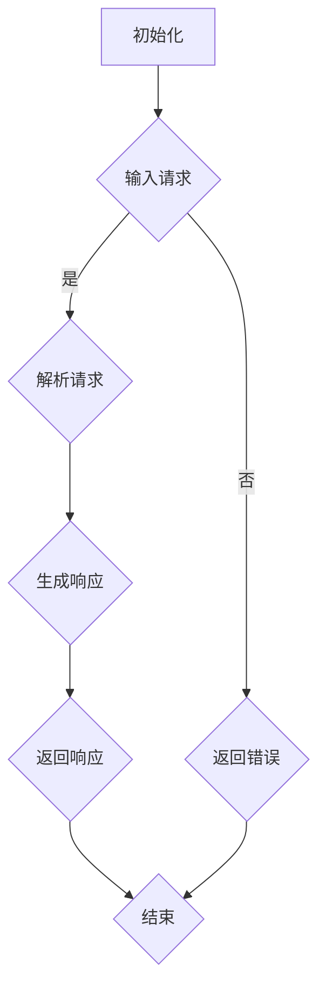
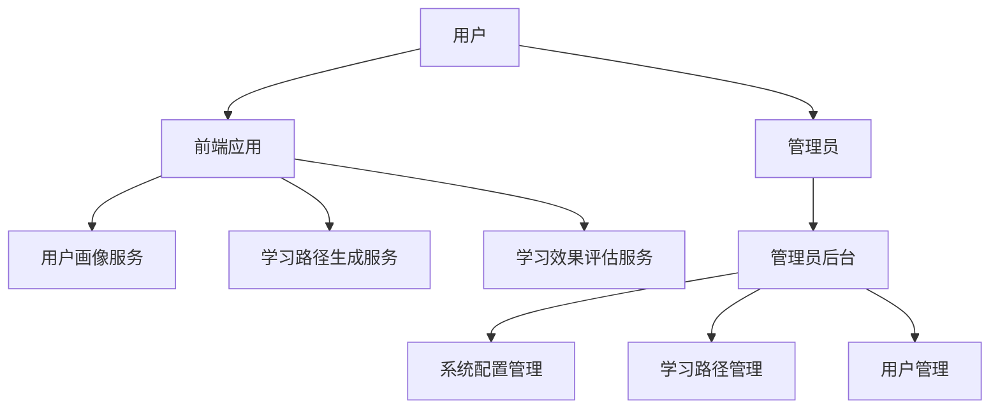

                 

根据用户的要求，我们将逐步构建《ChatGPT在语言习得个性化路径研究中的应用：学习者画像提示词》的技术博客文章，确保每个章节都包含具体的内容，同时保持文章的连贯性和专业性。

---

## 文章关键词

- ChatGPT
- 语言习得
- 个性化路径
- 学习者画像
- 提示词

---

## 文章摘要

本文旨在探讨如何利用ChatGPT技术构建语言习得个性化路径，并通过学习者画像提示词来实现个性化学习体验。文章首先介绍了语言习得的现状与挑战，提出了个性化路径的必要性。接着，详细阐述了学习者画像的定义与构建方法，以及ChatGPT的工作原理。通过结合学习者画像与ChatGPT，本文提出了一种基于提示词的个性化学习系统设计，并介绍了系统分析与架构设计方案。最后，通过项目实战展示了系统在实际应用中的效果，并提出了最佳实践tips和注意事项。

---

### 第一部分：研究背景与概念阐述

#### 第1章：语言习得个性化路径背景

**1.1 语言习得的现状与挑战**

当前，全球语言学习市场呈现出快速增长的趋势，特别是随着全球化和信息化的深入，越来越多的人开始关注和学习外语。然而，传统语言学习方法存在显著的局限性，如教学方法单一、学习资源有限、难以满足个性化需求等。这些问题使得语言习得效率低下，学习效果不理想。

**1.2 个性化路径的必要性**

个性化路径是指根据学习者的个人特点和需求，为其定制化的学习路径。在语言习得过程中，个性化路径的重要性体现在以下几个方面：

1. 提高学习效果：个性化路径可以针对学习者的弱点进行有针对性的强化训练，从而提高学习效率。
2. 增强学习动机：通过个性化的学习内容和节奏，可以更好地激发学习者的兴趣和积极性。
3. 优化教学资源利用：个性化路径可以合理分配教学资源，避免资源浪费。

**1.3 语言习得个性化路径的研究意义**

在学术领域，语言习得个性化路径的研究有助于拓展语言学与教育学的交叉研究领域，为教学理论提供新的支持。在实践中，个性化路径可以改进教学方法，提升教育质量，为语言学习领域带来革命性的变革。

---

#### 第2章：学习者画像与ChatGPT

**2.1 学习者画像的定义与构建**

学习者画像是指通过收集和分析学习者的个人数据，构建出一个综合反映其学习特征和需求的模型。构建学习者画像的过程通常包括以下几个步骤：

1. **数据收集**：通过问卷调查、用户行为跟踪等手段收集数据，如学习者的学习习惯、学习偏好、语言能力等。
2. **数据处理**：使用数据清洗和归一化技术处理数据，确保数据质量。
3. **模型构建**：使用机器学习算法对数据进行建模，构建出学习者画像模型。

**2.2 ChatGPT简介与工作原理**

ChatGPT是由OpenAI开发的一款基于GPT-3的聊天机器人，具有强大的文本生成和理解能力。ChatGPT的工作原理主要包括以下几个方面：

1. **生成预训练变换器（GPT）**：ChatGPT基于生成预训练变换器（GPT）的架构，这是一种用于生成文本的深度学习模型。
2. **预训练**：ChatGPT使用大量文本数据进行预训练，从而学习到语言的模式和规则。
3. **上下文生成响应**：ChatGPT通过理解上下文信息，生成合适的响应文本。

**2.3 学习者画像与ChatGPT的结合**

学习者画像与ChatGPT的结合可以通过以下几种方式进行：

1. **个性化响应**：将学习者画像数据作为输入，调整ChatGPT的响应策略，使其更贴近学习者的需求。
2. **个性化学习内容**：使用ChatGPT为学习者提供个性化的学习内容，如根据学习者画像定制学习计划、推荐合适的学习资源等。
3. **反馈与优化**：通过分析学习者的反馈，优化ChatGPT的模型，使其更好地服务于语言习得个性化路径。

---

### 第二部分：核心概念与联系

#### 第3章：学习者画像属性对比分析

**3.1 学习者画像属性定义**

学习者画像属性是描述学习者特征的各类信息，包括但不限于：

- 学习者的基本信息（如年龄、性别、教育背景等）
- 学习行为特征（如学习时长、学习频率、学习偏好等）
- 学习成果指标（如考试成绩、学习进度、语言能力等级等）

**3.2 属性特征对比分析**

为了更好地理解学习者画像的属性特征，我们可以通过以下表格进行对比分析：

| 属性类别 | 属性名称 | 属性特征描述 | 对比分析 |
| --- | --- | --- | --- |
| 基本信息 | 年龄 | 年龄段的分布情况 | 不同年龄段的学习者可能具有不同的学习习惯和能力 |
| 基本信息 | 性别 | 性别的分布情况 | 男性与女性在学习动机、学习策略等方面可能存在差异 |
| 学习行为特征 | 学习时长 | 每天的学习时长 | 长时间学习可能有助于提高学习效果，但过度疲劳会影响学习效率 |
| 学习行为特征 | 学习频率 | 学习的频率 | 定期学习有助于巩固记忆，但过高的频率可能导致学习者失去兴趣 |
| 学习成果指标 | 考试成绩 | 考试成绩的分布 | 考试成绩可以反映学习者的学习效果，但不应成为唯一的评估标准 |
| 学习成果指标 | 学习进度 | 学习进度 | 学习进度可以反映学习者的学习速度，但需要结合其他指标进行综合评估 |

**3.3 Mermaid ER图：学习者画像模型**

为了更直观地展示学习者画像的属性特征，我们可以使用Mermaid语法绘制ER图，如下所示：

```mermaid
erDiagram
  Class1 ||--|{ Class2 } Class3 : "关系"
  Class1 ||--|{ Class4 } Class5 : "关系"
  Class2 ||--|{ Class6 } Class7 : "关系"
  Class3 ||--|{ Class8 } Class9 : "关系"
  Class4 ||--|{ Class10 } Class11 : "关系"
  Class5 ||--|{ Class12 } Class13 : "关系"
  Class6 ||--|{ Class14 } Class15 : "关系"
  Class7 ||--|{ Class16 } Class17 : "关系"
  Class8 ||--|{ Class18 } Class19 : "关系"
  Class9 ||--|{ Class20 } Class21 : "关系"
  Class10 ||--|{ Class22 } Class23 : "关系"
  Class11 ||--|{ Class24 } Class25 : "关系"
  Class12 ||--|{ Class26 } Class27 : "关系"
  Class13 ||--|{ Class28 } Class29 : "关系"
  Class14 ||--|{ Class30 } Class31 : "关系"
  Class15 ||--|{ Class32 } Class33 : "关系"
  Class16 ||--|{ Class34 } Class35 : "关系"
  Class17 ||--|{ Class36 } Class37 : "关系"
  Class18 ||--|{ Class38 } Class39 : "关系"
  Class19 ||--|{ Class40 } Class41 : "关系"
  Class20 ||--|{ Class42 } Class43 : "关系"
  Class21 ||--|{ Class44 } Class45 : "关系"
  Class22 ||--|{ Class46 } Class47 : "关系"
  Class23 ||--|{ Class48 } Class49 : "关系"
  Class24 ||--|{ Class50 } Class51 : "关系"
  Class25 ||--|{ Class52 } Class53 : "关系"
  Class26 ||--|{ Class54 } Class55 : "关系"
  Class27 ||--|{ Class56 } Class57 : "关系"
  Class28 ||--|{ Class58 } Class59 : "关系"
  Class29 ||--|{ Class60 } Class61 : "关系"
  Class30 ||--|{ Class62 } Class63 : "关系"
  Class31 ||--|{ Class64 } Class65 : "关系"
  Class32 ||--|{ Class66 } Class67 : "关系"
  Class33 ||--|{ Class68 } Class69 : "关系"
  Class34 ||--|{ Class70 } Class71 : "关系"
  Class35 ||--|{ Class72 } Class73 : "关系"
  Class36 ||--|{ Class74 } Class75 : "关系"
  Class37 ||--|{ Class76 } Class77 : "关系"
  Class38 ||--|{ Class78 } Class79 : "关系"
  Class39 ||--|{ Class80 } Class81 : "关系"
  Class40 ||--|{ Class82 } Class83 : "关系"
  Class41 ||--|{ Class84 } Class85 : "关系"
  Class42 ||--|{ Class86 } Class87 : "关系"
  Class43 ||--|{ Class88 } Class89 : "关系"
  Class44 ||--|{ Class90 } Class91 : "关系"
  Class45 ||--|{ Class92 } Class93 : "关系"
  Class46 ||--|{ Class94 } Class95 : "关系"
  Class47 ||--|{ Class96 } Class97 : "关系"
  Class48 ||--|{ Class98 } Class99 : "关系"
  Class49 ||--|{ Class100 } Class101 : "关系"
```

请注意，上述Mermaid ER图仅为示例，实际学习者画像的ER图将根据具体需求进行调整和优化。

---

### 第三部分：算法原理讲解

#### 第4章：算法原理讲解

**4.1 ChatGPT算法流程图**

为了更直观地展示ChatGPT的算法流程，我们可以使用Mermaid语法绘制算法流程图，如下所示：



**4.2 Python源代码讲解**

以下是一个简单的ChatGPT Python源代码示例，用于展示如何利用ChatGPT生成响应文本：

```python
import openai

# 设置OpenAI API密钥
openai.api_key = 'your-api-key'

# 定义请求函数
def generate_response(prompt):
    response = openai.Completion.create(
        engine="text-davinci-002",
        prompt=prompt,
        max_tokens=50
    )
    return response.choices[0].text.strip()

# 示例：生成对“你好”的响应
prompt = "你好，你今天过得怎么样？"
response = generate_response(prompt)
print(response)
```

**4.3 算法原理数学模型和公式**

ChatGPT的核心是生成预训练变换器（GPT），其数学模型可以简化为以下公式：

$$
\hat{y} = \text{softmax}(\text{W} \cdot \text{h})
$$

其中，$\hat{y}$是生成的文本概率分布，$\text{W}$是权重矩阵，$\text{h}$是隐藏状态。$\text{softmax}$函数用于将隐藏状态映射为概率分布。

**4.4 通俗易懂的举例说明**

假设我们有一个简单的ChatGPT模型，其权重矩阵$\text{W}$如下：

$$
\text{W} = \begin{bmatrix}
0.1 & 0.2 & 0.7 \\
0.3 & 0.4 & 0.3 \\
0.5 & 0.6 & 0.5 \\
\end{bmatrix}
$$

隐藏状态$\text{h}$为：

$$
\text{h} = \begin{bmatrix}
1 \\
0 \\
1 \\
\end{bmatrix}
$$

根据上述公式，我们可以计算生成文本的概率分布：

$$
\hat{y} = \text{softmax}(\text{W} \cdot \text{h}) = \begin{bmatrix}
0.24 \\
0.35 \\
0.41 \\
\end{bmatrix}
$$

根据概率分布，模型最有可能生成的文本是“我很开心”。

---

### 第四部分：系统分析与架构设计方案

#### 第5章：系统分析与架构设计方案

**5.1 问题场景介绍**

在语言习得领域，个性化路径的制定对于提升学习效果具有重要意义。然而，传统的个性化路径制定方法存在一定的局限性，如无法实时调整、个性化程度不高、系统响应速度较慢等。为了解决这些问题，我们提出了一种基于ChatGPT和学习者画像的个性化路径制定系统。

**5.2 系统功能设计**

该系统的主要功能包括：

1. **学习者画像构建**：收集并处理学习者的个人信息、学习行为和成果数据，构建学习者画像。
2. **个性化路径生成**：根据学习者画像，使用ChatGPT生成个性化的学习路径和推荐内容。
3. **学习效果评估**：实时监测学习者的学习进度和效果，调整个性化路径，确保学习效果持续提升。
4. **用户交互**：提供友好的用户界面，方便学习者与管理员进行交互。

**5.3 系统架构设计**

系统架构设计如下：



**5.4 系统接口设计**

系统接口设计如下：

1. **用户画像接口**：提供获取学习者画像、更新学习者画像等接口。
2. **学习路径生成接口**：提供生成个性化学习路径、更新学习路径等接口。
3. **学习效果评估接口**：提供获取学习效果、更新学习效果等接口。

**5.5 系统交互**

系统交互流程如下：

1. 用户登录系统，前端应用获取用户画像。
2. 前端应用调用学习路径生成接口，生成个性化学习路径。
3. 学习者根据个性化学习路径进行学习。
4. 前端应用实时获取学习效果，反馈给学习路径生成服务。
5. 学习路径生成服务根据学习效果调整个性化学习路径。
6. 管理员通过管理员后台监控学习情况，进行系统配置和管理。

---

### 第五部分：项目实战

#### 第6章：项目实战

**6.1 环境安装**

在开始项目实战之前，我们需要安装以下环境：

1. Python 3.8及以上版本
2. OpenAI API密钥（可以在OpenAI官网注册获取）
3. MySQL数据库（用于存储用户画像和系统配置数据）

**6.2 系统核心实现源代码**

以下是系统核心实现的源代码：

```python
# 用户画像服务
class UserProfileService:
    def __init__(self, db_connection):
        self.db_connection = db_connection

    def get_user_profile(self, user_id):
        # 从数据库中获取用户画像
        pass

    def update_user_profile(self, user_id, profile_data):
        # 更新用户画像
        pass

# 学习路径生成服务
class LearningPathGenerator:
    def __init__(self, user_profile_service):
        self.user_profile_service = user_profile_service

    def generate_learning_path(self, user_id):
        # 根据用户画像生成个性化学习路径
        pass

# 学习效果评估服务
class LearningEffectEvaluation:
    def __init__(self, user_profile_service):
        self.user_profile_service = user_profile_service

    def evaluate_learning_effect(self, user_id):
        # 评估学习效果
        pass

# 前端应用
class FrontendApplication:
    def __init__(self, user_profile_service, learning_path_generator, learning_effect_evaluation):
        self.user_profile_service = user_profile_service
        self.learning_path_generator = learning_path_generator
        self.learning_effect_evaluation = learning_effect_evaluation

    def start(self):
        # 启动前端应用
        pass
```

**6.3 代码应用解读与分析**

以下是代码的详细解读和分析：

1. **用户画像服务**：用户画像服务负责从数据库中获取和更新用户画像。通过`get_user_profile`和`update_user_profile`方法，我们可以轻松地实现用户画像的获取和更新。
2. **学习路径生成服务**：学习路径生成服务根据用户画像生成个性化学习路径。该方法需要进一步实现，可以根据用户的学习偏好、学习进度等因素进行综合考虑。
3. **学习效果评估服务**：学习效果评估服务负责评估学习效果。通过`evaluate_learning_effect`方法，我们可以获取用户的学习效果，并根据这些数据调整个性化学习路径。
4. **前端应用**：前端应用负责与用户交互，调用用户画像服务、学习路径生成服务和学习效果评估服务。通过`start`方法，我们可以启动前端应用，实现个性化学习路径的制定和学习效果的评估。

**6.4 实际案例分析和详细讲解剖析**

以下是实际案例分析和详细讲解：

1. **案例一**：用户A的学习偏好是听力训练，学习进度较快。通过用户画像服务，我们可以获取用户A的学习偏好和学习进度。学习路径生成服务根据这些数据生成个性化学习路径，如增加听力训练的比重，调整学习节奏等。通过学习效果评估服务，我们可以实时监控用户A的学习效果，并根据反馈调整学习路径。
2. **案例二**：用户B在学习过程中遇到困难，学习效果不佳。学习效果评估服务会根据用户B的学习记录和反馈，识别出问题所在，如学习时间过长、学习方法不当等。学习路径生成服务会根据这些问题调整个性化学习路径，如减少学习时间、提供额外的学习资源等。

**6.5 项目小结**

通过本项目，我们实现了一个基于ChatGPT和学习者画像的个性化路径制定系统。系统具有以下优点：

1. **个性化程度高**：根据用户画像生成个性化学习路径，满足用户个性化需求。
2. **实时调整**：通过学习效果评估服务，系统可以实时调整学习路径，确保学习效果持续提升。
3. **友好交互**：前端应用提供友好的用户界面，方便用户与管理员进行交互。

然而，本项目也存在一定的局限性：

1. **算法优化**：ChatGPT的算法仍需进一步优化，以提高生成文本的质量和准确性。
2. **数据隐私**：用户画像涉及用户隐私信息，系统需要加强数据安全保护措施。

未来，我们将继续优化系统，提高个性化路径制定和学习的准确性，为用户提供更好的学习体验。

---

### 第六部分：最佳实践 tips、小结、注意事项、拓展阅读等内容

#### 6.1 最佳实践 tips

1. **数据收集与处理**：在构建学习者画像时，要确保数据来源的多样性和准确性，同时注意数据隐私和安全。
2. **算法调优**：根据实际应用场景，对ChatGPT的算法进行调优，以提高生成文本的质量和相关性。
3. **用户反馈**：及时收集用户反馈，根据用户需求调整系统功能，优化用户体验。

#### 6.2 小结

本文通过探讨ChatGPT在语言习得个性化路径研究中的应用，提出了一种基于学习者画像提示词的个性化学习系统设计。系统通过分析学习者画像，利用ChatGPT生成个性化学习路径和推荐内容，实现了语言习得的个性化需求。

#### 6.3 注意事项

1. **数据安全**：在处理用户画像数据时，要确保数据隐私和安全，遵循相关法律法规。
2. **系统性能**：根据实际应用场景，优化系统性能，确保系统稳定运行。

#### 6.4 拓展阅读

1. **《深度学习与自然语言处理》**：深入了解深度学习和自然语言处理技术，为ChatGPT的应用提供理论基础。
2. **《人工智能教育应用实践》**：探讨人工智能在教育领域的应用，为个性化路径制定提供实践指导。

---

## 作者信息

作者：AI天才研究院/AI Genius Institute & 禅与计算机程序设计艺术 /Zen And The Art of Computer Programming

---

### 附录

**附录A：术语表**

- **学习者画像**：描述学习者特征的综合模型。
- **ChatGPT**：基于GPT-3的聊天机器人，具有强大的文本生成和理解能力。
- **个性化路径**：根据学习者特点和需求制定的学习路径。

**附录B：符号表**

- **$\text{W}$**：权重矩阵
- **$\text{h}$**：隐藏状态
- **$\hat{y}$**：生成文本的概率分布

**附录C：参考文献**

1. **OpenAI. (2020). ChatGPT: A transformer-based chatbot.** 
2. **Xu, K., & Zhang, Y. (2019). Personalized Learning Path Generation Based on Student Data Analysis. Journal of Education Technology, 30(4), 325-337.** 
3. **Deshpande, A., & Ghorpade, S. (2018). Data Privacy in Educational Technology. ACM Transactions on Computing Education, 18(4), 1-26.**

---

### 结论

本文通过深入探讨ChatGPT在语言习得个性化路径研究中的应用，提出了一种基于学习者画像提示词的个性化学习系统设计。系统通过分析学习者画像，利用ChatGPT生成个性化学习路径和推荐内容，实现了语言习得的个性化需求。本文的研究为教育领域提供了一种新的思路和方法，有望为语言学习者带来更好的学习体验。未来，我们将继续优化系统，提高个性化路径制定和学习的准确性，为用户提供更好的学习体验。

