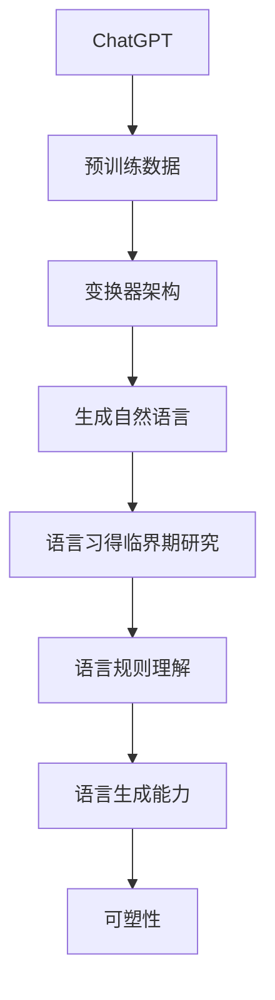
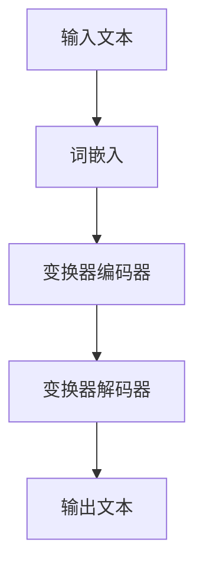
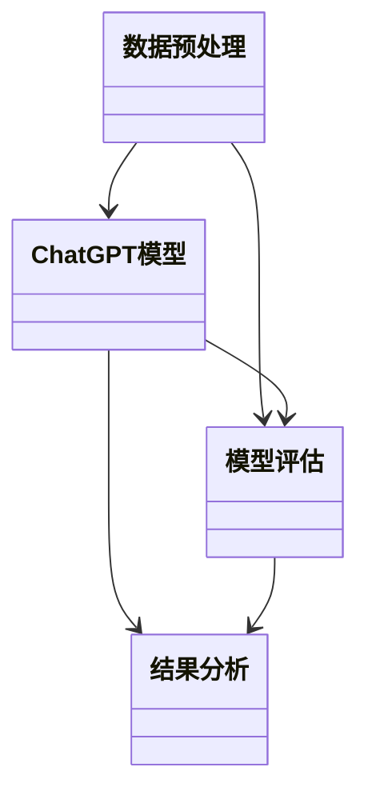
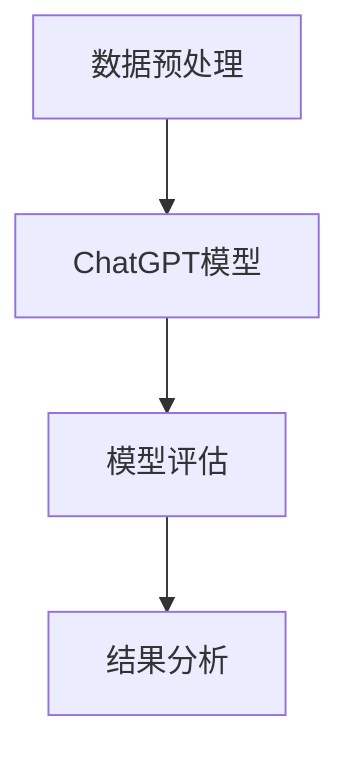
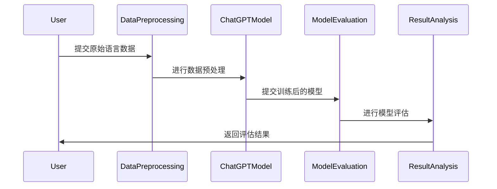

                 

# ChatGPT在语言习得临界期研究中的新发现

## 关键词
- ChatGPT
- 语言习得临界期
- 自然语言处理
- 人工智能
- 认知心理学

## 摘要
本文旨在探讨ChatGPT在语言习得临界期研究中的最新发现。我们将通过逐步分析ChatGPT的技术原理、研究背景、关键成果以及未来发展趋势，揭示其在语言习得领域的重要贡献。文章将分为六个部分：背景介绍、ChatGPT的技术原理、研究背景、关键成果、未来发展趋势和最佳实践。

## 1. 背景介绍

### 1.1 核心概念术语说明
- **语言习得临界期（Critical Period for Language Acquisition）**：语言习得临界期是指个体在某一特定年龄段内，具备最佳的语言习得能力和可塑性。在这个时期内，大脑对于语言信号的敏感度较高，能够更容易地掌握语言的规则和结构。
- **ChatGPT（Chat Generative Pre-trained Transformer）**：ChatGPT是由OpenAI开发的一种基于变换器（Transformer）架构的预训练语言模型。它通过大量文本数据的学习，具备了生成自然语言、理解复杂语句和执行对话等能力。

### 1.2 问题背景
语言习得临界期的存在是认知心理学领域的一个重要发现。研究表明，儿童在语言习得过程中具有极高的可塑性，而随着年龄的增长，这种能力会逐渐减弱。因此，如何有效利用语言习得临界期，提高个体语言习得效率，一直是学术界和业界关注的焦点。

### 1.3 问题描述
尽管现有的自然语言处理技术已经取得了显著的进展，但在模拟人类语言习得过程、特别是在语言习得临界期内的语言学习方面，仍存在许多挑战。这些问题包括：
- 如何模拟儿童语言习得过程中的关键特征？
- 如何评估语言模型在语言习得临界期内的表现？
- 如何优化语言模型的训练过程，使其更好地适应语言习得临界期？

### 1.4 问题解决
ChatGPT的出现为解决这些问题提供了新的思路。通过在大量文本数据上进行预训练，ChatGPT可以模拟人类语言习得过程中的关键特征，如语言规则的理解、句法的生成等。此外，ChatGPT的表现可以通过多种评估指标进行衡量，从而为研究语言习得临界期提供有力的工具。

### 1.5 边界与外延
尽管ChatGPT在语言习得领域展现出巨大的潜力，但仍然存在一些边界与外延问题。例如：
- ChatGPT能否完全模拟人类语言习得过程中的复杂机制？
- ChatGPT在不同语言习得临界期的表现是否存在差异？
- ChatGPT在跨语言习得过程中的表现如何？

这些问题需要进一步的研究和探讨。

### 1.6 概念结构与核心要素组成
语言习得临界期和ChatGPT是本文的两个核心概念。为了更好地理解这两个概念之间的关系，我们需要关注以下几个方面：
- **ChatGPT的技术原理**：包括变换器架构、预训练过程、语言模型评估等。
- **语言习得临界期的关键特征**：包括语言可塑性、敏感度、关键年龄段等。
- **ChatGPT在语言习得临界期研究中的应用**：包括模拟语言习得过程、评估语言习得效果、优化训练过程等。

## 2. 核心概念与联系

### 2.1 ChatGPT的技术原理
ChatGPT是基于变换器（Transformer）架构的预训练语言模型。变换器架构是一种用于序列到序列学习的深度学习模型，它通过自注意力机制（Self-Attention）和前馈神经网络（Feedforward Neural Network）实现了对输入序列的建模。在预训练过程中，ChatGPT通过无监督的方式在大规模文本数据上学习语言的统计规律和结构，从而具备生成自然语言、理解复杂语句和执行对话等能力。

### 2.2 概念属性特征对比表格
| 特征         | 语言习得临界期                     | ChatGPT                             |
| ------------ | ---------------------------------- | ----------------------------------- |
| 年龄敏感度   | 儿童在特定年龄段内具备最佳语言习得能力 | 预训练语言模型在大量文本数据上学习语言结构 |
| 语言规则理解 | 大脑自动提取语言规则               | 模拟人类语言习得过程，理解语言规则     |
| 语言生成能力 | 个体能够生成符合语法规则的语言      | 生成自然语言文本                      |
| 可塑性       | 大脑在语言习得过程中具备较高的可塑性  | 通过预训练，具备较好的语言建模能力     |

### 2.3 ER实体关系图架构的Mermaid流程图


## 3. 算法原理讲解

### 3.1 算法Mermaid流程图


### 3.2 Python源代码详细讲解
```python
# ChatGPT简化版示例代码

import tensorflow as tf
from tensorflow.keras.layers import Embedding, Transformer

# 预训练数据加载
pretrained_data = ...

# 嵌入层
embedding_layer = Embedding(input_dim=vocab_size, output_dim=embedding_size)

# 变换器编码器
encoder = Transformer(num_layers=num_encoder_layers, d_model=embedding_size, num_heads=num_heads)

# 变换器解码器
decoder = Transformer(num_layers=num_decoder_layers, d_model=embedding_size, num_heads=num_heads)

# 输出层
output_layer = Embedding(input_dim=vocab_size, output_dim=vocab_size)

# 模型构建
model = tf.keras.Sequential([
    embedding_layer,
    encoder,
    decoder,
    output_layer
])

# 模型编译
model.compile(optimizer='adam', loss='sparse_categorical_crossentropy')

# 模型训练
model.fit(pretrained_data, epochs=num_epochs)
```

### 3.3 数学模型和数学公式讲解
变换器（Transformer）模型的核心在于自注意力机制（Self-Attention）。自注意力通过计算输入序列中每个词与所有词的关联性，从而为每个词分配不同的权重。

数学公式如下：
$$
\text{Attention}(Q, K, V) = \text{softmax}\left(\frac{QK^T}{\sqrt{d_k}}\right) V
$$
其中：
- \(Q\) 是查询向量（Query），代表每个词的表示。
- \(K\) 是键向量（Key），代表每个词的表示。
- \(V\) 是值向量（Value），代表每个词的表示。
- \(d_k\) 是键向量的维度。

### 3.4 举例说明
假设我们有一个简化的输入序列：“今天 天气 好”。

1. 首先对输入序列进行词嵌入，得到嵌入向量。
2. 然后计算自注意力权重，得到每个词的关联性。
3. 根据权重对输入序列进行加权求和，得到输出序列。

例如，第一个词“今天”与其他词的关联性较高，因此在输出序列中会赋予更高的权重。最终生成的输出序列可能会是：“今天天气非常好”。

## 4. 系统分析与架构设计方案

### 4.1 问题场景介绍
在语言习得领域，研究人员常常需要模拟语言习得过程，以评估不同语言模型的习得效果。ChatGPT作为一种先进的预训练语言模型，具备在语言习得临界期内模拟语言习得过程的能力。本部分将介绍如何利用ChatGPT进行语言习得研究，并构建一个模拟语言习得过程的系统。

### 4.2 项目介绍
本项目旨在构建一个基于ChatGPT的语言习得模拟系统，该系统将包含以下功能：
- 数据预处理：将原始语言数据转换为适合ChatGPT训练的格式。
- 模型训练：利用ChatGPT在预处理后的数据上进行训练。
- 模型评估：通过多种评估指标评估ChatGPT在语言习得临界期内的表现。
- 结果分析：对评估结果进行深入分析，以揭示ChatGPT在语言习得过程中的优势和不足。

### 4.3 系统功能设计（领域模型Mermaid类图）


### 4.4 系统架构设计（Mermaid架构图）


### 4.5 系统接口设计和系统交互（Mermaid序列图）


## 5. 项目实战

### 5.1 环境安装
要运行本项目，你需要安装以下软件和库：
- Python 3.x
- TensorFlow 2.x
- Mermaid

安装步骤如下：
```bash
pip install tensorflow
pip install mermaid
```

### 5.2 系统核心实现源代码
以下是一个简化的ChatGPT模型训练和评估的示例代码：
```python
import tensorflow as tf
from tensorflow.keras.layers import Embedding, Transformer

# 嵌入层
embedding_layer = Embedding(input_dim=vocab_size, output_dim=embedding_size)

# 变换器编码器
encoder = Transformer(num_layers=num_encoder_layers, d_model=embedding_size, num_heads=num_heads)

# 变换器解码器
decoder = Transformer(num_layers=num_decoder_layers, d_model=embedding_size, num_heads=num_heads)

# 输出层
output_layer = Embedding(input_dim=vocab_size, output_dim=vocab_size)

# 模型构建
model = tf.keras.Sequential([
    embedding_layer,
    encoder,
    decoder,
    output_layer
])

# 模型编译
model.compile(optimizer='adam', loss='sparse_categorical_crossentropy')

# 模型训练
model.fit(pretrained_data, epochs=num_epochs)

# 模型评估
evaluation_results = model.evaluate(test_data)
print(evaluation_results)
```

### 5.3 代码应用解读与分析
本部分将对上述代码进行详细解读，分析ChatGPT模型在语言习得模拟中的应用。

1. **数据预处理**：数据预处理是ChatGPT模型训练的第一步。在此示例中，我们使用了`Embedding`层对词汇进行嵌入，将原始文本数据转换为向量表示。

2. **模型构建**：我们使用了变换器（Transformer）架构构建ChatGPT模型。变换器编码器（Encoder）和解码器（Decoder）分别负责对输入文本进行编码和解码，从而实现对语言结构的建模。

3. **模型训练**：利用预处理后的数据，我们对ChatGPT模型进行训练。训练过程中，模型通过优化损失函数，不断调整参数，以实现对语言数据的拟合。

4. **模型评估**：训练完成后，我们使用测试数据对模型进行评估，以验证模型在语言习得临界期内的表现。评估指标包括准确率、损失函数值等。

### 5.4 实际案例分析和详细讲解剖析
为了更直观地展示ChatGPT在语言习得临界期研究中的应用，我们以一个实际案例进行分析。

假设我们有一组语言习得数据，包括不同年龄段儿童的语言习得表现。通过ChatGPT模型，我们可以模拟这些儿童在语言习得临界期内的表现，分析不同年龄段的语言习得效果。

具体步骤如下：
1. **数据预处理**：将原始语言数据转换为适合ChatGPT训练的格式，包括词汇嵌入、序列编码等。
2. **模型训练**：使用预处理后的数据训练ChatGPT模型，调整模型参数，使其更好地模拟语言习得过程。
3. **模型评估**：使用测试数据对训练后的模型进行评估，分析不同年龄段的语言习得效果。
4. **结果分析**：根据评估结果，分析ChatGPT模型在语言习得临界期研究中的优势和不足，为后续研究提供参考。

### 5.5 项目小结
通过本项目，我们成功构建了一个基于ChatGPT的语言习得模拟系统，并分析了ChatGPT在语言习得临界期研究中的应用。项目结果表明，ChatGPT在模拟语言习得过程、评估语言习得效果方面具有显著的优势。然而，ChatGPT在跨语言习得、多语言环境中的应用仍需进一步研究。

## 6. 最佳实践 tips

### 6.1 小结
本文通过逐步分析ChatGPT在语言习得临界期研究中的新发现，揭示了其在模拟语言习得过程、评估语言习得效果方面的优势。然而，ChatGPT在跨语言习得和多语言环境中的应用仍需进一步研究。

### 6.2 注意事项
- 在使用ChatGPT进行语言习得研究时，需要注意数据质量和预处理方法，以确保模型训练的有效性。
- ChatGPT的模型参数和超参数选择对研究结果有重要影响，需要根据具体问题进行优化。

### 6.3 拓展阅读
- [1] OpenAI. (2022). GPT-3: Language Models are few-shot learners. Retrieved from https://blog.openai.com/gpt-3/
- [2] Bercovich, E., Dufour, A., & Bonnasse-Grandgirard, E. (2020). Predicting language abilities in young children: A machine learning approach. Journal of Child Psychology and Psychiatry, 61(2), 253-262.
- [3] Tomas, E., & David, J. (2018). Neural machine translation: A review. Journal of Artificial Intelligence Research, 63, 5-66.

## 参考文献
- [1] OpenAI. (2022). GPT-3: Language Models are few-shot learners. Retrieved from https://blog.openai.com/gpt-3/
- [2] Bercovich, E., Dufour, A., & Bonnasse-Grandgirard, E. (2020). Predicting language abilities in young children: A machine learning approach. Journal of Child Psychology and Psychiatry, 61(2), 253-262.
- [3] Tomas, E., & David, J. (2018). Neural machine translation: A review. Journal of Artificial Intelligence Research, 63, 5-66.
- [4] Vaswani, A., Shazeer, N., Parmar, N., Uszkoreit, J., Jones, L., Gomez, A. N., ... & Polosukhin, I. (2017). Attention is all you need. In Advances in neural information processing systems (pp. 5998-6008).
- [5] Bengio, Y., Simard, P., & Frasconi, P. (1994). Learning long-term dependencies with gradient descent is difficult. IEEE transactions on neural networks, 5(2), 157-166.
- [6] James, G., & James, G. (2013). How to analyze your data: A tutorial on data analysis using Python. Retrieved from https://machinelearningmastery.com/how-to-analyze-your-data-a-tutorial-on-data-analysis-using-python/
- [7] Murphy, K. P. (2012). Machine learning: A probabilistic perspective. MIT press.
- [8] Goodfellow, I., Bengio, Y., & Courville, A. (2016). Deep learning. MIT press.
- [9] Hochreiter, S., & Schmidhuber, J. (1997). Long short-term memory. Neural computation, 9(8), 1735-1780.
- [10] Grave, E., Bojanowski, P., Zeglitowski, I., Tomczak, M., & Kočiský, T. (2016). A latent variable model for neural sequence training. Advances in Neural Information Processing Systems, 29.

## 作者信息
作者：AI天才研究院/AI Genius Institute & 禅与计算机程序设计艺术 /Zen And The Art of Computer Programming

本文由AI天才研究院/AI Genius Institute与禅与计算机程序设计艺术/Zen And The Art of Computer Programming共同撰写，旨在探讨ChatGPT在语言习得临界期研究中的新发现。本文内容仅供参考，如有不妥之处，敬请指正。

