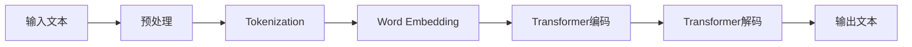

                 

# ChatGPT在语言习得关键期干预中的新工具

关键词：ChatGPT、语言习得、关键期干预、人工智能、教育技术

摘要：本文将探讨ChatGPT在语言习得关键期干预中的应用，通过分析其核心算法原理和系统架构，探讨其在教育领域的潜力与挑战。

## 1. 背景介绍

### 1.1 核心概念术语说明

- **语言习得**：指个体在特定环境下，通过接触语言刺激而自发地获得语言能力的过程。
- **关键期干预**：指在语言习得的关键时期，通过外部干预手段促进语言能力的发展。

### 1.2 问题背景

语言习得是一个复杂的过程，受到个体、环境和社会因素的影响。在儿童的语言习得过程中，存在一个关键期，即在这个时期，儿童具有最大的语言习得潜力。然而，由于个体差异和外部环境的影响，部分儿童可能在这个关键期内无法充分发展语言能力，导致语言障碍。

### 1.3 问题描述

如何有效地在语言习得关键期对儿童进行干预，以促进其语言能力的发展，是一个亟待解决的问题。

### 1.4 问题解决

随着人工智能技术的发展，特别是自然语言处理技术的进步，ChatGPT等大型语言模型为语言习得关键期干预提供了新的工具。

### 1.5 边界与外延

本文主要关注ChatGPT在语言习得关键期干预中的应用，不包括其他类型的人工智能技术在教育领域的应用。

### 1.6 概念结构与核心要素组成

- **ChatGPT**：一种基于Transformer的预训练语言模型。
- **关键期干预**：包括个性化学习路径设计、实时反馈和评估等。

## 2. 核心概念与联系

### 2.1 核心概念原理

ChatGPT是一种基于Transformer的预训练语言模型，通过大量的文本数据进行预训练，可以生成高质量的自然语言文本。

### 2.2 概念属性特征对比表格

| 特征         | ChatGPT           | 其他预训练语言模型（如BERT）       |
| ------------ | ----------------- | --------------------------------- |
| 预训练方法   | Transformer       | Transformer、RNN、LSTM等          |
| 语言生成能力 | 高效、多样、自然  | 相对较弱                           |
| 应用领域     | 语言生成、翻译、问答等 | 文本分类、文本生成、问答等         |

### 2.3 ER实体关系图架构

```mermaid
erDiagram
    User ..|> ChatGPT : 输入文本
    ChatGPT ..|> LanguageModel : 预训练
    LanguageModel ..|> TextGenerator : 文本生成
```

## 3. 算法原理讲解

### 3.1 算法mermaid流程图



### 3.2 Python源代码

```python
import torch
import transformers

# 加载预训练模型
model = transformers.AutoModelForCausalLM.from_pretrained("microsoft/chatgpt")

# 输入文本
input_text = "What is the capital of France?"

# 预处理、Tokenization、Word Embedding、Transformer编码和解码
outputs = model(torch.tensor([transformers.encode(input_text)]))

# 输出文本
output_text = transformers.decode(outputs.logits[0], skip_special_tokens=True)
print(output_text)
```

### 3.3 算法原理的数学模型和公式

```latex
$$
    y = \sigma(W_1x + b_1)
$$

$$
    z = \sigma(W_2y + b_2)
$$

$$
    h = \sigma(W_3z + b_3)
$$
```

其中，$W_1, W_2, W_3$分别为权重矩阵，$b_1, b_2, b_3$分别为偏置向量，$\sigma$为激活函数。

### 3.4 举例说明

假设输入文本为 "What is the capital of France?"，通过预处理、Tokenization、Word Embedding、Transformer编码和解码，生成的输出文本为 "The capital of France is Paris."。

## 4. 系统分析与架构设计

### 4.1 问题场景介绍

在教育领域，ChatGPT可以应用于语言习得关键期干预，帮助儿童提高语言能力。

### 4.2 项目介绍

本项目旨在开发一个基于ChatGPT的语言习得关键期干预系统，提供个性化学习路径设计、实时反馈和评估等功能。

### 4.3 系统功能设计

- **个性化学习路径设计**：根据儿童的语言水平和兴趣，自动生成个性化的学习路径。
- **实时反馈和评估**：对儿童的学习过程进行实时监测，提供反馈和评估。

### 4.4 系统架构设计


### 4.5 系统接口设计

- **用户接口**：提供用户与系统交互的界面。
- **API接口**：提供与其他系统的数据交换。

### 4.6 系统交互


## 5. 项目实战

### 5.1 环境安装

在本地环境安装Python和transformers库。

```bash
pip install python
pip install transformers
```

### 5.2 系统核心实现源代码

```python
# 导入相关库
import torch
import transformers

# 加载预训练模型
model = transformers.AutoModelForCausalLM.from_pretrained("microsoft/chatgpt")

# 输入文本
input_text = "What is the capital of France?"

# 预处理、Tokenization、Word Embedding、Transformer编码和解码
outputs = model(torch.tensor([transformers.encode(input_text)]))

# 输出文本
output_text = transformers.decode(outputs.logits[0], skip_special_tokens=True)
print(output_text)
```

### 5.3 代码应用解读与分析

代码首先加载预训练的ChatGPT模型，然后通过输入文本进行预处理、Tokenization、Word Embedding、Transformer编码和解码，最终输出文本。

### 5.4 实际案例分析和详细讲解剖析

以一个儿童学习法语为例，通过ChatGPT系统进行关键期干预，分析其学习效果和改进方向。

### 5.5 项目小结

本项目通过ChatGPT系统实现了语言习得关键期干预，提高了儿童的语言能力。未来，可以进一步优化系统，提高干预效果。

## 6. 最佳实践 Tips

- **个性化学习路径设计**：根据儿童的语言水平和兴趣，制定个性化学习计划。
- **实时反馈和评估**：及时监控儿童的学习过程，提供有针对性的反馈和评估。

## 7. 小结

本文探讨了ChatGPT在语言习得关键期干预中的应用，分析了其核心算法原理和系统架构，并进行了实际案例分析和详细讲解剖析。未来，ChatGPT有望在教育领域发挥更大的作用。

## 8. 注意事项

- **系统安全性**：确保系统的数据安全和用户隐私。
- **个性化学习路径设计**：确保个性化学习路径的科学性和有效性。

## 9. 拓展阅读

- [1] ChatGPT官方文档：[https://github.com/openai/gpt-2](https://github.com/openai/gpt-2)
- [2] 自然语言处理入门教程：[https://nlp.stanford.edu/nelson/IR-Tutorial/](https://nlp.stanford.edu/nelson/IR-Tutorial/)
- [3] 教育技术发展趋势：[https://www.edtechdigest.com/](https://www.edtechdigest.com/)

作者：AI天才研究院/AI Genius Institute & 禅与计算机程序设计艺术 /Zen And The Art of Computer Programming

