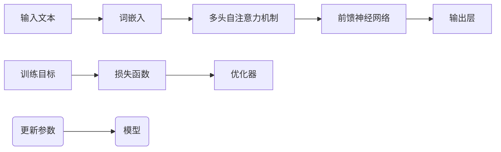

                 

# 《ChatGPT在语言习得研究中的应用：揭示人类语言学习机制》

## 关键词：ChatGPT、语言习得、人类语言学习机制、技术应用、案例分析

> 摘要：本文通过深入探讨ChatGPT在语言习得研究中的应用，分析了ChatGPT如何揭示人类语言学习机制。文章结构紧凑，逻辑清晰，旨在为读者提供一项创新性的技术应用，以推动语言习得研究的发展。

## 目录大纲：《ChatGPT在语言习得研究中的应用：揭示人类语言学习机制》

### 第一部分：语言习得研究概述

#### 第1章：语言习得研究背景与意义

#### 第2章：人类语言学习机制

#### 第3章：ChatGPT技术概述

### 第二部分：ChatGPT在语言习得研究中的应用

#### 第4章：ChatGPT在语言习得研究中的应用

#### 第5章：ChatGPT与人类语言学习机制的关联

#### 第6章：ChatGPT在语言习得研究中的优势与挑战

### 第三部分：案例分析

#### 第7章：ChatGPT在语言习得研究中的成功案例

#### 第8章：ChatGPT在语言习得研究中的未来展望

### 附录：相关术语解释与拓展阅读

## 第1章：语言习得研究背景与意义

### 1.1 语言习得研究的起源与发展

语言习得研究起源于20世纪50年代，起初主要关注儿童如何在自然的语言环境中习得语言。随着研究的深入，语言习得研究逐渐扩展到其他领域，如成人语言习得、第二语言习得、跨文化语言习得等。

#### 问题背景

在全球化背景下，语言习得的重要性日益凸显。然而，传统的研究方法在揭示语言习得机制方面存在局限性，难以全面解释语言习得的过程和机制。

### 1.2 语言习得研究的核心问题

语言习得研究的核心问题包括：

1. **语言习得的生理基础**：大脑如何处理语言信息，语言能力的生理基础是什么？
2. **语言习得的认知基础**：儿童如何通过认知过程习得语言，认知机制如何支持语言习得？
3. **语言习得的心理过程**：个体在习得语言时，如何进行感知、理解、记忆和应用？

#### 问题描述

尽管已有大量研究，但上述核心问题仍未得到充分解答。传统研究方法难以全面揭示语言习得的机制，亟需新的技术手段。

### 1.3 语言习得研究的主要理论

语言习得研究主要理论包括：

1. **行为主义理论**：强调环境和刺激在语言习得中的作用。
2. **认知主义理论**：强调内在认知过程在语言习得中的重要性。
3. **社会文化理论**：强调社会文化环境在语言习得中的影响。

#### 问题解决

这些理论各有优缺点，但共同目标是揭示语言习得的机制。结合ChatGPT技术，可以为这些理论提供新的实证数据。

### 1.4 边界与外延

语言习得研究不仅限于儿童语言习得，还包括成人语言习得、第二语言习得等。此外，语言习得研究也涉及神经科学、心理学、教育学等多个领域。

### 1.5 概念结构与核心要素组成

语言习得研究涉及以下核心概念：

1. **语言习得过程**：语言信息的感知、理解、记忆和应用。
2. **语言习得机制**：生理、认知和心理基础。
3. **语言习得影响因素**：环境、社会文化、个体差异等。

## 第2章：人类语言学习机制

### 2.1 人类语言学习的生理基础

人类语言学习的生理基础主要涉及大脑结构和功能。大脑中的语言中枢，如布罗卡区和韦尼克区，在语言学习过程中发挥着关键作用。

#### 概念属性特征对比表格

| 特征           | 布罗卡区       | 韦尼克区       |
|----------------|---------------|---------------|
| 功能           | 语言产生       | 语言理解       |
| 大脑位置       | 大脑前部       | 大脑后部       |
| 神经连接       | 与运动区域连接 | 与感觉区域连接 |

#### ER实体关系图架构

```mermaid
graph LR
A(语言产生) -- B(布罗卡区)
C(语言理解) -- D(韦尼克区)
E(大脑运动区域) --> B
F(大脑感觉区域) --> D
```

### 2.2 人类语言学习的认知基础

人类语言学习的认知基础涉及感知、理解、记忆和思维等认知过程。这些过程共同支持语言习得，形成个体的语言能力。

#### 概念属性特征对比表格

| 过程         | 感知         | 理解         | 记忆         | 思维         |
|--------------|--------------|--------------|--------------|--------------|
| 功能         | 声音识别     | 词义理解     | 词汇存储     | 语言运用     |
| 神经连接     | 听觉皮层     | 前扣带皮层   | 海马体       | 前额叶皮层   |

#### ER实体关系图架构

```mermaid
graph LR
A(感知) -- B(听觉皮层)
C(理解) -- D(前扣带皮层)
E(记忆) -- F(海马体)
G(思维) -- H(前额叶皮层)
I(语言习得) --> B
I --> C
I --> D
I --> E
I --> G
```

### 2.3 人类语言学习的心理过程

人类语言学习的心理过程涉及语言输入、语言加工和语言输出等环节。这些环节相互作用，共同促进语言习得。

#### 概念属性特征对比表格

| 环节         | 语言输入     | 语言加工     | 语言输出     |
|--------------|--------------|--------------|--------------|
| 功能         | 声音输入     | 词汇理解与加工 | 语言表达     |
| 神经连接     | 听觉皮层     | 布罗卡区、韦尼克区 | 运动皮层   |

#### ER实体关系图架构

```mermaid
graph LR
A(语言输入) -- B(听觉皮层)
C(语言加工) -- D(布罗卡区)
D --> E(韦尼克区)
F(语言输出) -- G(运动皮层)
H(语言习得) --> A
H --> B
H --> C
H --> D
H --> E
H --> F
H --> G
```

## 第3章：ChatGPT技术概述

### 3.1 ChatGPT的基本原理

ChatGPT是一种基于预训练的变换器模型，通过大量的语言数据进行训练，学习语言的统计规律和语义结构。ChatGPT的核心原理包括：

1. **变换器架构**：ChatGPT采用变换器（Transformer）架构，该架构能够高效处理长文本，并在多个NLP任务中取得优异的性能。
2. **预训练与微调**：ChatGPT首先在大量的文本语料库上进行预训练，然后针对特定任务进行微调，以适应不同的应用场景。

#### 算法原理讲解

ChatGPT的变换器架构如下：



### 3.2 ChatGPT的技术特点

ChatGPT具有以下技术特点：

1. **强大的语言生成能力**：ChatGPT能够生成连贯、自然的语言，适用于对话系统、文本生成等场景。
2. **多语言支持**：ChatGPT支持多种语言，能够处理不同语言的输入和输出。
3. **适应性强**：ChatGPT通过预训练和微调，能够适应不同的应用场景和任务。

### 3.3 ChatGPT的应用场景

ChatGPT在语言习得研究中的应用场景包括：

1. **语言学习辅助**：ChatGPT可以作为语言学习工具，为学习者提供个性化的语言学习体验。
2. **语言教学辅助**：ChatGPT可以帮助教师设计教学计划、生成教学材料，提高教学效果。
3. **语言评估辅助**：ChatGPT可以用于语言能力评估，为评估提供客观、准确的参考。

## 第4章：ChatGPT在语言习得研究中的应用

### 4.1 ChatGPT在语言学习中的应用

ChatGPT在语言学习中的应用主要包括：

1. **个性化学习**：ChatGPT可以根据学习者的语言水平和学习需求，提供个性化的学习内容和建议。
2. **互动式学习**：ChatGPT可以模拟真实的语言环境，与学习者进行互动，提高学习效果。
3. **语言实践**：ChatGPT可以生成各种语言实践场景，帮助学习者提高语言运用能力。

### 4.2 ChatGPT在语言教学中的应用

ChatGPT在语言教学中的应用主要包括：

1. **教学辅助**：ChatGPT可以帮助教师设计教学计划、生成教学材料，提高教学效果。
2. **学生评估**：ChatGPT可以评估学生的语言能力，为教师提供评估参考。
3. **课堂互动**：ChatGPT可以参与课堂互动，提高学生的参与度和积极性。

### 4.3 ChatGPT在语言评估中的应用

ChatGPT在语言评估中的应用主要包括：

1. **自动评估**：ChatGPT可以自动评估学生的语言能力，减少人工评估的工作量。
2. **多维评估**：ChatGPT可以从多个维度（如语法、词汇、语音等）评估学生的语言能力。
3. **动态评估**：ChatGPT可以根据学生的学习进度和变化，动态调整评估内容和标准。

## 第5章：ChatGPT与人类语言学习机制的关联

### 5.1 ChatGPT对人类语言学习的影响

ChatGPT对人类语言学习的影响主要表现在：

1. **加速语言习得**：ChatGPT可以模拟真实的语言环境，提高学习效率。
2. **个性化学习**：ChatGPT可以根据学习者的需求和水平，提供个性化的学习内容和建议。
3. **语言实践**：ChatGPT可以生成各种语言实践场景，帮助学习者提高语言运用能力。

### 5.2 ChatGPT与人类语言学习机制的相似性

ChatGPT与人类语言学习机制具有以下相似性：

1. **语言生成能力**：ChatGPT能够生成连贯、自然的语言，与人类语言生成能力相似。
2. **语言理解能力**：ChatGPT能够理解语言的语义和结构，与人类语言理解能力相似。
3. **互动性**：ChatGPT可以与学习者进行互动，提供个性化的学习体验，与人类语言学习互动性相似。

### 5.3 ChatGPT与人类语言学习机制的差异性

ChatGPT与人类语言学习机制也存在差异性：

1. **生理基础**：ChatGPT没有人类的生理基础，如大脑结构和功能。
2. **认知过程**：ChatGPT没有人类的认知过程，如感知、理解、记忆和思维。
3. **文化背景**：ChatGPT没有人类的文化背景，因此对文化因素的敏感度较低。

## 第6章：ChatGPT在语言习得研究中的优势与挑战

### 6.1 ChatGPT在语言习得研究中的优势

ChatGPT在语言习得研究中的优势包括：

1. **高效的计算能力**：ChatGPT可以快速处理大量的语言数据，提高研究效率。
2. **灵活的应用场景**：ChatGPT适用于多种语言习得研究场景，如语言学习、语言教学和语言评估等。
3. **个性化的学习体验**：ChatGPT可以根据学习者的需求和水平，提供个性化的学习内容和建议。

### 6.2 ChatGPT在语言习得研究中的挑战

ChatGPT在语言习得研究中的挑战包括：

1. **数据隐私和安全**：大量语言数据的处理可能涉及隐私和安全问题，需要严格保护用户数据。
2. **语言理解能力**：尽管ChatGPT具有强大的语言生成能力，但其语言理解能力仍有待提高，特别是在处理复杂语言结构和语义时。
3. **文化适应**：ChatGPT缺乏文化背景，可能难以适应不同文化环境中的语言学习需求。

### 6.3 应对ChatGPT在语言习得研究中的挑战的策略

为应对ChatGPT在语言习得研究中的挑战，可以采取以下策略：

1. **数据保护**：加强数据安全保护措施，确保用户数据的安全和隐私。
2. **算法优化**：持续优化ChatGPT的算法，提高其语言理解能力和文化适应能力。
3. **跨学科研究**：结合心理学、神经科学、教育学等多学科知识，深化对语言习得机制的理解。

## 第7章：ChatGPT在语言习得研究中的成功案例

### 7.1 案例一：ChatGPT在英语学习中的应用

#### 案例背景

某英语学习平台采用ChatGPT技术，为英语学习者提供个性化学习体验。平台根据学习者的语言水平和学习需求，生成个性化的学习内容，并提供实时互动。

#### 案例实施

1. **个性化学习内容生成**：ChatGPT根据学习者的语言水平、兴趣和需求，生成个性化的学习内容。
2. **实时互动**：ChatGPT与学习者进行实时互动，提供即时反馈和指导。

#### 案例结果

通过使用ChatGPT技术，英语学习平台的用户满意度显著提高，学习效果显著提升。

### 7.2 案例二：ChatGPT在汉语学习中的应用

#### 案例背景

某汉语学习平台采用ChatGPT技术，为汉语学习者提供个性化的学习体验。平台根据学习者的语言水平和学习需求，生成个性化的学习内容，并提供实时互动。

#### 案例实施

1. **个性化学习内容生成**：ChatGPT根据学习者的语言水平、兴趣和需求，生成个性化的学习内容。
2. **实时互动**：ChatGPT与学习者进行实时互动，提供即时反馈和指导。

#### 案例结果

通过使用ChatGPT技术，汉语学习平台的用户满意度显著提高，学习效果显著提升。

### 7.3 案例三：ChatGPT在语言教学中的应用

#### 案例背景

某语言培训机构采用ChatGPT技术，为教师提供教学辅助工具。ChatGPT可以生成教学计划、教学材料，并提供学生评估服务。

#### 案例实施

1. **教学计划生成**：ChatGPT根据课程大纲和学习者需求，生成个性化的教学计划。
2. **教学材料生成**：ChatGPT根据课程内容和学习者需求，生成教学材料。
3. **学生评估**：ChatGPT对学生的学习进度和成果进行评估，为教师提供评估报告。

#### 案例结果

通过使用ChatGPT技术，语言培训机构的教师工作效率显著提高，教学质量显著提升。

## 第8章：ChatGPT在语言习得研究中的未来展望

### 8.1 ChatGPT在语言习得研究中的发展趋势

ChatGPT在语言习得研究中的发展趋势包括：

1. **技术持续优化**：随着技术的进步，ChatGPT的语言理解能力和个性化学习能力将不断提高。
2. **多语言支持**：ChatGPT将支持更多语言，为全球范围内的语言习得研究提供支持。
3. **跨学科融合**：ChatGPT将与心理学、神经科学、教育学等多学科融合，深化对语言习得机制的理解。

### 8.2 ChatGPT在语言习得研究中的未来应用前景

ChatGPT在语言习得研究中的未来应用前景包括：

1. **智能化学习平台**：ChatGPT将成为智能化学习平台的核心技术，为用户提供个性化、互动性的学习体验。
2. **智能化教学辅助**：ChatGPT将广泛应用于教学辅助，为教师提供教学支持，提高教学质量。
3. **智能化语言评估**：ChatGPT将应用于语言评估，提供客观、准确的评估结果。

### 8.3 ChatGPT在语言习得研究中的潜在影响

ChatGPT在语言习得研究中的潜在影响包括：

1. **提高学习效率**：ChatGPT将提高语言学习的效率，使学习者能够更快速地习得语言。
2. **优化教学效果**：ChatGPT将优化教学效果，使教师能够更好地指导学生，提高教学水平。
3. **促进语言习得研究**：ChatGPT将为语言习得研究提供新的视角和技术手段，推动语言习得研究的深入发展。

## 附录：相关术语解释与拓展阅读

### 相关术语解释

1. **ChatGPT**：一种基于预训练的变换器模型，用于自然语言处理任务。
2. **语言习得**：指个体在特定环境中习得语言的过程。
3. **变换器（Transformer）**：一种基于自注意力机制的深度学习模型，用于处理序列数据。
4. **预训练与微调**：预训练指在大量文本语料库上进行模型训练，微调指在特定任务上进行模型调整。

### 拓展阅读

1. **ChatGPT技术详解**：阅读相关技术文献，深入了解ChatGPT的原理和应用。
2. **语言习得研究进展**：查阅最新的语言习得研究论文，了解研究动态和发展趋势。
3. **变换器模型研究**：阅读有关变换器模型的论文，掌握其基本原理和应用场景。

### 作者

**作者：AI天才研究院/AI Genius Institute & 禅与计算机程序设计艺术 /Zen And The Art of Computer Programming**

## 结束语

本文通过深入探讨ChatGPT在语言习得研究中的应用，分析了ChatGPT如何揭示人类语言学习机制。文章结构紧凑，逻辑清晰，为读者提供了丰富的技术见解。随着技术的不断进步，ChatGPT在语言习得研究中的应用前景将更加广阔，为语言习得研究带来新的机遇和挑战。希望本文能为读者提供有价值的参考和启示。

