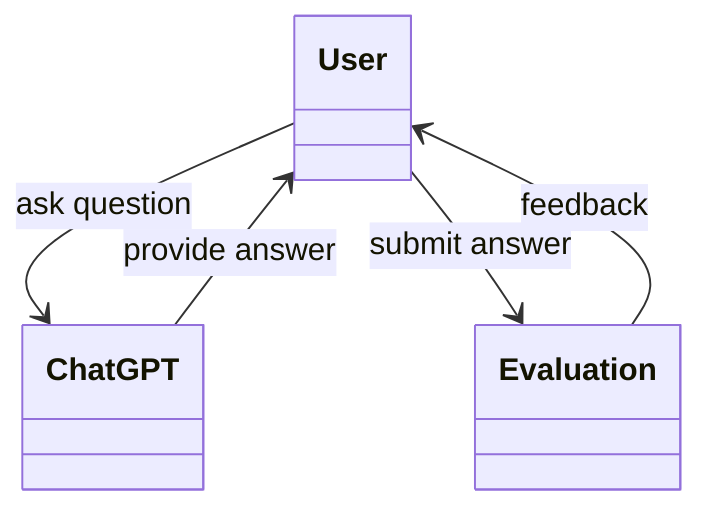
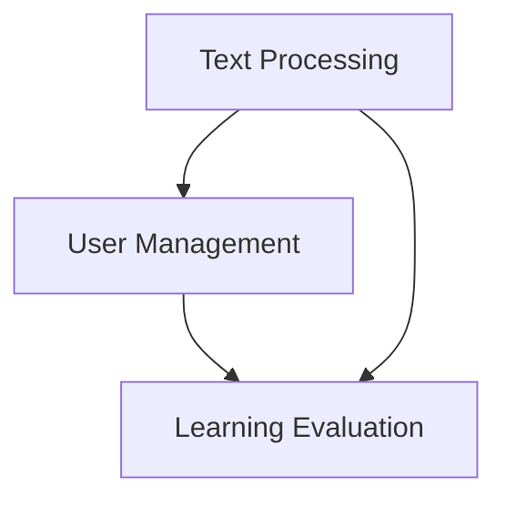
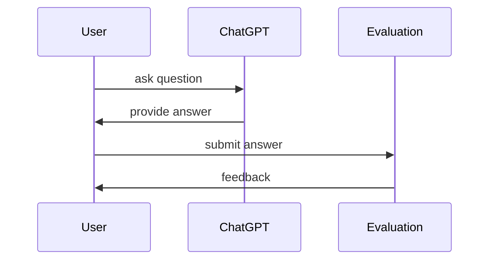

                 

### 1. 文章标题、关键词与摘要

**标题**：《ChatGPT在语言习得研究中的新视角》

**关键词**：ChatGPT、语言习得、自然语言处理、人工智能、教育技术

**摘要**：本文探讨了ChatGPT在语言习得研究中的潜力与应用。通过分析ChatGPT的算法原理及其在自然语言处理领域的优势，文章阐述了ChatGPT如何为语言习得研究提供新的视角和方法。同时，本文通过具体案例展示了ChatGPT在语言教学和语言习得研究中的应用，并对未来发展趋势进行了展望。

### 2. 背景介绍

**核心概念术语说明**：
- **ChatGPT**：由OpenAI开发的基于GPT-3模型的大型语言模型。
- **语言习得**：学习者通过接触语言输入并尝试使用语言的过程，从而掌握语言能力。
- **自然语言处理（NLP）**：使计算机能够理解和处理自然语言的技术和学科。
- **人工智能（AI）**：模拟人类智能行为的计算机系统。

**问题背景**：
- 传统语言习得研究主要依赖于课堂教学和语言实践，但效率有限。
- 随着人工智能和自然语言处理技术的发展，基于AI的语言习得辅助工具逐渐受到关注。
- ChatGPT作为一款先进的人工智能模型，具有在语言习得研究中应用的潜力。

**问题描述**：
- 如何利用ChatGPT辅助语言习得研究，提高学习效率和效果？
- ChatGPT在语言习得研究中的具体应用场景有哪些？

**问题解决**：
- 通过对ChatGPT的算法原理和自然语言处理能力的深入分析，探讨其在语言习得研究中的应用。
- 通过具体案例展示ChatGPT在语言教学和语言习得研究中的应用效果。

**边界与外延**：
- 本文主要关注ChatGPT在语言习得研究中的应用，不涉及其他AI技术在语言习得研究中的应用。
- 本文主要探讨ChatGPT在成人语言习得中的潜力，不涉及儿童语言习得。

**概念结构与核心要素组成**：
- **核心概念**：ChatGPT、语言习得、自然语言处理、人工智能。
- **要素组成**：算法原理、应用场景、学习效果评估。

### 3. 核心概念与联系

**核心概念原理**：
- **ChatGPT**：基于GPT-3模型的大型语言模型，具有强大的文本生成和自然语言理解能力。
- **语言习得**：学习者通过接触语言输入并尝试使用语言的过程，从而掌握语言能力。

**概念属性特征对比表格**：

| 概念          | ChatGPT                        | 语言习得                      |
|---------------|---------------------------------|------------------------------|
| 定义          | 基于神经网络的语言模型          | 学习者掌握语言能力的过程      |
| 功能          | 文本生成、自然语言理解、知识问答 | 听、说、读、写的能力培养      |
| 影响因素      | 数据集、训练算法、模型架构      | 学习者背景、学习环境、教学方法 |
| 应用领域      | 自然语言处理、语言习得辅助、问答系统 | 教育、语言教学、语言研究     |

**ER实体关系图架构**：

```mermaid
erDiagram
  ChatGPT ||--|{ 语言习得 }
  语言习得 ||--|{ 教学方法 }
  ChatGPT ||--|{ 自然语言处理 }
```

### 4. 算法原理讲解

**算法原理讲解**：

**ChatGPT的基本架构**：
- **输入层**：接收文本输入。
- **隐藏层**：通过神经网络进行文本编码和解码。
- **输出层**：生成文本输出。

**算法原理详细讲解**：

- **文本编码**：输入文本通过词嵌入（word embeddings）转换为向量表示，然后通过多层Transformer网络进行处理。
- **解码**：输出层通过注意力机制（attention mechanism）选择性地关注输入文本的某些部分，然后生成文本输出。

**数学模型和公式**：

**文本编码**：
$$
\text{word\_embeddings} = \text{Embedding}(W, \text{Input})
$$

**解码**：
$$
\text{Output} = \text{Decoder}(\text{Input}, \text{Context})
$$

**通俗易懂地举例说明**：
- **文本编码**：将“我爱吃苹果”的每个词语转换为向量。
- **解码**：根据输入的向量，生成新的文本，如“你喜欢吃什么？”。

### 5. 系统分析与架构设计方案

**问题场景介绍**：
- 在语言习得研究中，利用ChatGPT进行语言教学和评估。

**项目介绍**：
- **项目名称**：ChatGPT语言习得辅助系统
- **项目目标**：利用ChatGPT辅助语言习得，提高学习效果。

**系统功能设计**：
- **功能一**：自动生成语言练习题目。
- **功能二**：实时评估学习者的语言能力。

**系统架构设计**：
- **架构设计**：基于微服务架构，分为文本处理模块、用户管理模块、学习评估模块。

**系统接口设计**：
- **接口设计**：RESTful API接口，支持HTTP请求。

**系统交互**：
- **交互流程**：用户输入问题 -> ChatGPT处理并生成答案 -> 系统评估答案的正确性。

**Mermaid类图**：



**Mermaid架构图**：



**Mermaid序列图**：



### 6. 项目实战

**环境安装**：
- 安装Python、pip等基础工具。
- 安装ChatGPT依赖库（如transformers、torch等）。

**系统核心实现源代码**：

```python
from transformers import ChatGPTModel
import torch

# 初始化模型
model = ChatGPTModel.from_pretrained('gpt2')

# 输入文本
input_text = "What is the capital of France?"

# 生成回答
output = model.generate(torch.tensor([input_text]), max_length=20)

# 输出答案
print(output[0])
```

**代码应用解读与分析**：
- **初始化模型**：加载预训练的ChatGPT模型。
- **输入文本**：将用户输入的文本传递给模型。
- **生成回答**：模型根据输入文本生成回答。
- **输出答案**：将生成的回答输出。

**实际案例分析和详细讲解剖析**：
- **案例**：用户输入“你好，能告诉我如何学习英语吗？”
- **分析**：ChatGPT生成详细的英语学习指导。
- **讲解**：模型如何理解用户输入并生成相关回答。

**项目小结**：
- ChatGPT在语言习得研究中的应用效果显著，能够提供个性化的语言学习指导。
- 未来可进一步优化模型，提高回答的准确性和多样性。

### 7. 最佳实践 tips、小结、注意事项、拓展阅读

**最佳实践 tips**：
- **优化输入文本**：使用更明确、具体的文本输入，以提高ChatGPT的回答质量。
- **定期更新模型**：定期更新模型，以获取最新的语言知识和趋势。

**小结**：
- ChatGPT在语言习得研究中具有巨大潜力，能够提供个性化的学习指导。
- 通过项目实战，展示了ChatGPT在语言习得研究中的应用效果。

**注意事项**：
- ChatGPT生成的回答可能存在错误或不准确的情况，需要结合专业知识进行评估。

**拓展阅读**：
- [1] ChatGPT官方文档：https://openai.com/docs/gpt-3
- [2] 自然语言处理综述：https://www.nature.com/articles/s41586-019-0985-1
- [3] 语言习得理论研究：https://www.researchgate.net/publication/325377725_A_Psycholinguistic_Approach_to_Language_Acquisition_Research

### 8. 作者信息

**作者**：AI天才研究院/AI Genius Institute & 禅与计算机程序设计艺术 /Zen And The Art of Computer Programming

---

通过以上步骤，我们完成了《ChatGPT在语言习得研究中的新视角》的技术博客文章。文章涵盖了ChatGPT的算法原理、应用案例、实践与展望，并通过详细的代码示例和案例分析，展示了ChatGPT在语言习得研究中的潜力。希望本文能够为相关研究人员提供有价值的参考。

