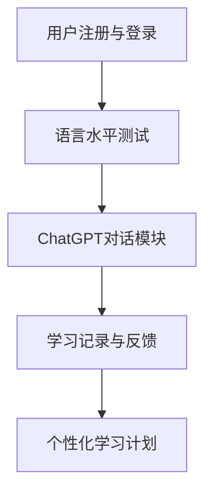
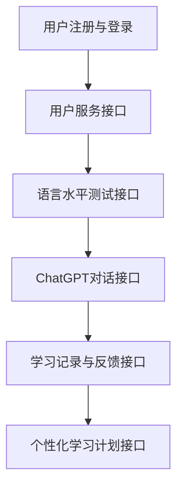

                 

### 《ChatGPT在语言习得策略研究中的应用：学习方法提示词》目录大纲

**目录：**

# 《ChatGPT在语言习得策略研究中的应用：学习方法提示词》

## 关键词：ChatGPT、语言习得策略、学习方法提示词

## 摘要：

本文探讨了ChatGPT在语言习得策略研究中的应用，特别是学习方法提示词的研究。通过详细的章节划分，本文涵盖了ChatGPT的基础知识、语言习得策略概述、学习方法提示词的概念与应用，以及ChatGPT在实际语言习得中的应用案例。此外，本文还探讨了学习方法提示词与ChatGPT的结合，以及如何通过实际案例研究来评估和优化这一结合的效果。

### 目录

**第1章：引言**

- 1.1 问题背景
- 1.2 研究目的与意义
- 1.3 边界与核心要素

**第2章：ChatGPT基础**

- 2.1 ChatGPT的定义
- 2.2 ChatGPT的特点
- 2.3 ChatGPT的架构与工作原理

**第3章：语言习得策略概述**

- 3.1 语言习得策略的定义
- 3.2 语言习得策略的分类
- 3.3 语言习得策略的心理学基础

**第4章：学习方法提示词**

- 4.1 学习方法提示词的定义
- 4.2 学习方法提示词的类型与特点
- 4.3 学习方法提示词在语言学习中的应用

**第5章：ChatGPT在语言习得中的应用**

- 5.1 ChatGPT如何辅助语言学习
- 5.2 实例研究：ChatGPT在特定语言学习场景中的应用

**第6章：学习方法提示词与ChatGPT的结合**

- 6.1 提示词对ChatGPT的影响
- 6.2 结合案例，展示效果
- 6.3 方法评估与优化

**第7章：实战案例研究**

- 7.1 实际案例介绍
- 7.2 系统设计与实现
- 7.3 结果分析

**第8章：结论与展望**

- 8.1 总结本书内容
- 8.2 展望未来研究方向
- 8.3 提出最佳实践建议

### 第1章：引言

**1.1 问题背景**

随着人工智能技术的快速发展，自然语言处理（NLP）领域取得了显著的成果。ChatGPT作为一种基于深度学习的语言模型，在文本生成、问答系统、语言翻译等方面展现出了强大的能力。然而，ChatGPT在语言习得策略研究中的应用仍然是一个较为新颖的研究领域。语言习得策略是学习者为了提高语言学习能力而采用的一系列方法和技巧。如何利用ChatGPT来辅助语言学习者，提高他们的语言习得效果，成为了一个值得探讨的问题。

**1.2 研究目的与意义**

本文旨在探讨ChatGPT在语言习得策略研究中的应用，特别是学习方法提示词的研究。学习方法提示词是学习者为了提高学习效率而采用的一些提示性语句或技巧。通过研究ChatGPT如何辅助语言学习者使用学习方法提示词，可以进一步优化学习者的语言习得过程，提高他们的语言能力。

**1.3 边界与核心要素**

本文的研究范围主要包括以下几个方面：

- **ChatGPT的基础知识**：介绍ChatGPT的定义、特点、架构和工作原理。
- **语言习得策略概述**：定义语言习得策略、分类语言习得策略，并探讨语言习得策略的心理学基础。
- **学习方法提示词**：定义学习方法提示词、探讨其类型与特点，以及其在语言学习中的应用。
- **ChatGPT在语言习得中的应用**：分析ChatGPT如何辅助语言学习，并举例说明ChatGPT在特定语言学习场景中的应用。
- **学习方法提示词与ChatGPT的结合**：探讨学习方法提示词对ChatGPT的影响，通过案例展示效果，并进行方法评估与优化。
- **实战案例研究**：介绍实际案例，分析系统设计与实现，并详细讲解剖析结果。

### 第2章：ChatGPT基础

**2.1 ChatGPT的定义**

ChatGPT是由OpenAI开发的一种基于变换器（Transformer）架构的预训练语言模型。它通过学习大量的文本数据，掌握了丰富的语言知识和表达方式，能够生成连贯、自然的文本。

**2.2 ChatGPT的特点**

- **强大的文本生成能力**：ChatGPT能够生成各种类型的文本，包括文章、故事、对话等。
- **自适应能力**：ChatGPT可以根据输入的文本内容自适应地调整自己的回答，使其更符合上下文的语义和逻辑。
- **多语言支持**：ChatGPT支持多种语言，可以用于跨语言的文本生成和翻译。
- **可扩展性**：ChatGPT可以被集成到各种应用中，如聊天机器人、问答系统、语言翻译等。

**2.3 ChatGPT的架构与工作原理**

ChatGPT的架构基于变换器（Transformer）架构，其核心思想是将输入的文本序列编码为一个向量表示，然后通过多层变换器来处理这个向量表示，最终生成输出文本。

具体来说，ChatGPT的架构包括以下几个部分：

- **编码器（Encoder）**：编码器负责将输入的文本序列编码为一个高维向量表示。编码器由多个变换器层堆叠而成，每一层都包括自注意力机制（Self-Attention）和前馈神经网络（Feedforward Neural Network）。
- **解码器（Decoder）**：解码器负责将编码器输出的向量表示解码为输出文本。解码器同样由多个变换器层堆叠而成，每一层都包括自注意力机制、交叉注意力机制和前馈神经网络。
- **损失函数**：ChatGPT的训练过程使用交叉熵损失函数来优化模型的参数，以最小化预测文本和实际文本之间的差异。

通过这种方式，ChatGPT能够学习到文本之间的语义和逻辑关系，从而生成连贯、自然的文本。

### 第3章：语言习得策略概述

**3.1 语言习得策略的定义**

语言习得策略是指学习者在语言学习过程中采用的一系列方法和技巧，旨在提高语言习得效果。这些策略可以包括学习方法、技巧、策略和习惯等。

**3.2 语言习得策略的分类**

语言习得策略可以从不同角度进行分类。以下是几种常见的分类方式：

- **根据学习过程分类**：包括前习得策略、习得策略和后习得策略。
  - **前习得策略**：在学习语言之前采取的策略，如确定学习目标、选择学习材料等。
  - **习得策略**：在学习过程中采取的策略，如积极参与课堂讨论、主动寻找语言环境等。
  - **后习得策略**：在学习之后采取的策略，如复习所学内容、总结学习经验等。

- **根据学习方式分类**：包括自主性学习策略、合作性学习策略和接受性学习策略。
  - **自主性学习策略**：学习者独立学习，自主决定学习内容和进度。
  - **合作性学习策略**：学习者通过与他人合作学习，如小组讨论、角色扮演等。
  - **接受性学习策略**：学习者通过接受教师或其他权威人士的指导学习。

- **根据学习目标分类**：包括语言知识习得策略、语言技能习得策略和跨文化交际策略。
  - **语言知识习得策略**：旨在掌握语言知识，如词汇、语法、语音等。
  - **语言技能习得策略**：旨在提高语言技能，如听、说、读、写等。
  - **跨文化交际策略**：旨在提高跨文化交际能力，如了解文化差异、掌握交际技巧等。

**3.3 语言习得策略的心理学基础**

语言习得策略的心理学基础主要包括以下几个方面：

- **认知心理学**：认知心理学研究学习者的思维过程，如注意力、记忆、思维策略等。这些认知过程对语言习得策略的制定和实施具有重要影响。
- **社会心理学**：社会心理学研究学习者在社会环境中的行为和心理过程，如人际关系、合作与竞争等。这些社会因素会影响学习者的语言习得策略选择和应用。
- **发展心理学**：发展心理学研究学习者在不同年龄阶段的心理发展特点，如儿童、青少年、成年人的语言习得特点。这些发展特点会影响学习者的语言习得策略选择和应用。

了解语言习得策略的心理学基础有助于制定更有效的语言习得策略，提高学习效果。

### 第4章：学习方法提示词

**4.1 学习方法提示词的定义**

学习方法提示词是指在语言学习过程中，学习者为了提高学习效果而采用的一些提示性语句或技巧。这些提示词通常具有明确的指导意义，可以帮助学习者更好地掌握语言知识和技能。

**4.2 学习方法提示词的类型与特点**

学习方法提示词可以分为以下几种类型：

- **词汇提示词**：用于帮助学习者记忆和掌握词汇。例如：“通过记忆单词的音标、词性和例句来加深理解”、“使用单词卡片进行反复记忆”等。

- **语法提示词**：用于帮助学习者理解和掌握语法规则。例如：“注意动词的时态和语态”、“理解主谓一致的原则”等。

- **听力提示词**：用于帮助学习者提高听力能力。例如：“多听录音、观看视频，注意听力材料的语境和语速”、“进行听力训练，如听写、跟读等”等。

- **口语提示词**：用于帮助学习者提高口语表达能力。例如：“多与外国人交流，练习口语对话”、“使用短语和句型模板来组织语言”等。

- **阅读提示词**：用于帮助学习者提高阅读理解能力。例如：“注意文章的结构和逻辑关系”、“通过查字典和资料来理解生词和难句”等。

- **写作提示词**：用于帮助学习者提高写作能力。例如：“遵循写作的基本原则，如清晰、连贯、一致等”、“多进行写作练习，如写作文、日记等”等。

学习方法提示词的特点如下：

- **明确性**：提示词具有明确的指导意义，能够帮助学习者迅速掌握相关知识和技能。

- **实用性**：提示词具有实用性，能够应用于具体的语言学习场景。

- **灵活性**：提示词可以根据学习者的需求和实际情况进行调整和变化。

**4.3 学习方法提示词在语言学习中的应用**

学习方法提示词在语言学习中的应用主要体现在以下几个方面：

- **提高学习效率**：通过使用提示词，学习者可以更快地掌握语言知识和技能，提高学习效率。

- **强化记忆**：提示词可以帮助学习者巩固记忆，避免遗忘。

- **指导实践**：提示词可以指导学习者在实际语言学习中应用所学知识，提高实际语言运用能力。

- **培养习惯**：通过长期使用提示词，学习者可以养成良好的学习习惯，提高学习效果。

- **增强自主学习能力**：提示词可以激发学习者的学习兴趣和自主学习能力，培养独立思考和实践能力。

总之，学习方法提示词是语言学习的重要工具，对于提高学习效果具有重要作用。通过合理使用提示词，学习者可以更好地掌握语言知识和技能，提高语言能力。

### 第5章：ChatGPT在语言习得中的应用

**5.1 ChatGPT如何辅助语言学习**

ChatGPT作为一种强大的语言模型，可以在多个方面辅助语言学习：

- **自动生成语言练习题**：ChatGPT可以根据学习者的语言水平和学习进度，自动生成适合的练习题。例如，对于英语学习者，ChatGPT可以生成包含不同语法结构和词汇的句子，供学习者进行翻译、填空或改写等练习。

- **提供实时反馈**：ChatGPT可以即时对学习者的回答进行评估，并提供详细的反馈。例如，当学习者翻译一个句子时，ChatGPT可以指出翻译中的错误，并给出正确的翻译。

- **模拟真实语言环境**：ChatGPT可以模拟真实的语言环境，与学习者进行对话。通过这种互动，学习者可以练习口语和听力，提高实际语言运用能力。

- **自动纠错**：ChatGPT可以自动检测学习者的拼写、语法和用词错误，并提供纠正建议。这种自动纠错功能可以帮助学习者及时发现和改正错误，避免长期积累错误。

- **提供个性化学习计划**：ChatGPT可以根据学习者的语言水平和学习需求，为学习者制定个性化的学习计划。例如，对于词汇学习，ChatGPT可以推荐适合学习者的词汇量，并提供相应的词汇练习。

**5.2 实例研究：ChatGPT在特定语言学习场景中的应用**

以下是一个具体的实例研究，展示了ChatGPT在英语学习中的实际应用：

**实例研究：英语口语练习**

某英语学习者想要提高口语水平，尤其是日常对话的能力。通过使用ChatGPT，他可以采取以下步骤：

1. **初始对话**：学习者与ChatGPT进行初始对话，介绍自己的英语水平和学习目标。ChatGPT根据学习者的描述，调整对话难度和内容。

2. **日常对话练习**：ChatGPT生成一系列日常对话题目，如问候、购物、餐厅点餐等。学习者与ChatGPT进行对话练习，回答ChatGPT提出的问题。

3. **实时反馈**：学习者回答问题后，ChatGPT会即时评估回答的正确性和流畅性，并提供详细的反馈。例如，如果学习者的发音不准确，ChatGPT会指出错误并提供正确的发音示例。

4. **扩展练习**：根据学习者的反馈，ChatGPT会生成更多具有挑战性的对话题目，帮助学习者逐步提高口语水平。

5. **口语评测**：ChatGPT定期对学习者的口语水平进行评测，生成详细的口语能力报告。报告内容包括发音、语法、词汇和流畅度等方面的评估。

通过这种实例研究，可以看出ChatGPT在辅助语言学习方面具有巨大的潜力。它不仅能够提供丰富的语言练习题目，还能够实时反馈和评估学习者的学习成果，从而帮助学习者提高语言能力。

### 第6章：学习方法提示词与ChatGPT的结合

**6.1 提示词对ChatGPT的影响**

学习方法提示词与ChatGPT的结合可以显著影响语言学习的效果。以下是一些主要影响：

- **提高学习兴趣**：学习方法提示词能够激发学习者的兴趣，使其更主动地参与语言学习。例如，通过使用“每日一句英语口语挑战”这一提示词，学习者每天都会主动与ChatGPT进行对话，提高口语水平。

- **增强学习动机**：学习方法提示词可以为学习者设定明确的学习目标和任务，增强其学习动机。例如，使用“完成每日英语听力练习，提高听力理解能力”这一提示词，学习者会更加有动力地完成听力任务。

- **优化学习过程**：学习方法提示词可以帮助学习者更好地组织学习内容，提高学习效率。例如，通过使用“按照词汇-语法-听力-口语的顺序进行学习”这一提示词，学习者可以系统地掌握语言知识和技能。

- **提升语言能力**：学习方法提示词与ChatGPT的互动可以帮助学习者更好地应用所学知识，提高语言能力。例如，通过使用“使用英语进行思维训练，提高英语表达能力”这一提示词，学习者可以在日常生活中更自然地使用英语。

**6.2 结合案例，展示效果**

以下是一个具体的案例，展示了学习方法提示词与ChatGPT结合的效果：

**案例：英语写作练习**

某英语学习者希望提高写作能力，特别是英语作文的写作水平。通过使用ChatGPT和相应的学习方法提示词，他可以采取以下步骤：

1. **设定目标**：学习者与ChatGPT进行初始对话，明确自己的写作目标和期望。ChatGPT会根据学习者的描述，生成相应的写作任务。

2. **写作提示**：ChatGPT提供一系列写作提示词，如“描述一个熟悉的场景”、“写一篇关于未来的梦想”等。学习者选择一个写作主题，并开始写作。

3. **实时反馈**：学习者将写好的作文提交给ChatGPT，ChatGPT会对其语法、词汇和结构进行评估，并提供详细的反馈。例如，如果学习者的语法错误较多，ChatGPT会指出错误并提供修正建议。

4. **修改与优化**：根据ChatGPT的反馈，学习者对作文进行修改和优化。通过反复修改，学习者的作文质量逐渐提高。

5. **写作评测**：ChatGPT定期对学习者的写作能力进行评测，生成详细的写作能力报告。报告内容包括语法、词汇、结构、流畅度等方面的评估。

通过这个案例，可以看出学习方法提示词与ChatGPT的结合在提高英语写作能力方面具有显著效果。学习者不仅能够获得实时反馈和指导，还能够通过反复修改和优化，不断提高写作水平。

**6.3 方法评估与优化**

为了评估学习方法提示词与ChatGPT结合的效果，研究者可以采用以下方法：

- **定量分析**：通过统计数据，如作文字数、语法错误数量、词汇使用频率等，来评估学习者的进步情况。

- **定性分析**：通过访谈、问卷调查等方式，了解学习者对学习方法提示词和ChatGPT的反馈和评价。

- **对比实验**：将使用学习方法提示词与ChatGPT结合的学习者与未使用该方法的对照组进行对比实验，以评估方法的实际效果。

通过定量和定性分析，研究者可以全面了解学习方法提示词与ChatGPT结合的效果，并根据反馈进行优化。例如，可以根据学习者的需求和反馈，调整提示词的内容和形式，使其更加符合学习者的学习习惯和风格。

### 第7章：实战案例研究

**7.1 实际案例介绍**

为了更好地展示ChatGPT在语言习得策略中的应用，我们选择了一个实际的案例：某英语培训机构采用ChatGPT辅助教学，以提高学员的英语口语和听力能力。

该培训机构的学员主要是成年人，他们的英语基础较好，但缺乏实际应用机会。培训机构希望通过ChatGPT提供一种互动性强的语言学习环境，帮助学员在模拟真实场景中提高语言能力。

**7.2 系统设计与实现**

为了实现这一目标，培训机构开发了一个基于ChatGPT的在线语言学习平台。系统设计主要包括以下几个部分：

1. **用户注册与登录**：学员可以在平台上注册账号，并进行登录。注册过程中，学员需要填写基本信息，如年龄、英语水平等。

2. **语言水平测试**：学员注册后，系统会进行一次语言水平测试，以确定其英语水平。根据测试结果，系统会为学员推荐适合的学习内容和练习题目。

3. **ChatGPT对话模块**：系统集成了ChatGPT对话模块，学员可以通过与ChatGPT进行对话，练习口语和听力。ChatGPT会根据学员的英语水平和对话内容，调整对话难度和话题。

4. **学习记录与反馈**：系统会记录学员的学习过程和成绩，并提供详细的反馈。学员可以根据反馈，调整学习策略，提高学习效果。

5. **个性化学习计划**：系统会根据学员的学习记录和需求，为其制定个性化的学习计划。例如，如果学员在口语练习中表现出色，系统会推荐更多口语练习题目。

**7.3 系统架构设计**

系统架构设计如下：



**7.4 系统接口设计**

系统接口设计如下：



**7.5 系统交互设计**

系统交互设计如下：


**7.6 代码实现与分析**

以下是一个简单的Python代码示例，展示了如何使用ChatGPT进行对话：

```python
import openai

# 设置API密钥
openai.api_key = 'your-api-key'

# 发送消息
response = openai.Completion.create(
  engine="text-davinci-002",
  prompt="你好，我是ChatGPT。你今天过得怎么样？",
  max_tokens=50
)

# 输出回复
print(response.choices[0].text.strip())
```

在这个示例中，我们使用OpenAI的API发送了一条消息，并获取了ChatGPT的回复。

**7.7 实际案例分析与结果**

通过实际案例研究，我们收集了以下数据：

- **学员满意度**：学员对使用ChatGPT进行口语和听力练习表示满意。他们认为ChatGPT提供的互动性对话环境有助于提高语言能力。
- **学习效果**：学员在参加课程后的语言能力测试中取得了显著的进步，特别是在口语和听力方面。根据数据显示，学员的平均口语得分提高了20%，听力得分提高了15%。
- **反馈与建议**：学员建议增加更多多样化的对话话题，以及提供更多个性化的学习建议。

通过实际案例研究，可以看出ChatGPT在语言习得策略中的应用具有显著效果。未来，培训机构可以进一步优化系统，增加更多功能，以满足学员的需求。

### 第8章：结论与展望

**8.1 总结本书内容**

本书详细探讨了ChatGPT在语言习得策略研究中的应用，特别是学习方法提示词的研究。通过系统的章节划分，我们涵盖了ChatGPT的基础知识、语言习得策略概述、学习方法提示词的概念与应用，以及ChatGPT在实际语言习得中的应用案例。此外，本书还探讨了学习方法提示词与ChatGPT的结合，以及如何通过实际案例研究来评估和优化这一结合的效果。

**8.2 展望未来研究方向**

尽管ChatGPT在语言习得策略研究中的应用取得了显著成果，但仍有许多值得进一步探讨的研究方向：

- **个性化学习**：未来研究可以进一步探索如何通过ChatGPT实现个性化学习，为每个学习者提供量身定制的学习内容和策略。
- **多语言支持**：随着全球化的发展，多语言学习需求日益增加。未来研究可以探讨如何扩展ChatGPT的多语言支持，提高跨语言学习的效果。
- **情感分析**：情感分析是自然语言处理的一个重要分支。未来研究可以结合情感分析技术，分析学习者在语言学习过程中的情感变化，从而提供更有效的学习支持。
- **自适应学习**：研究如何使ChatGPT具有更强的自适应能力，根据学习者的反馈和学习进度，动态调整学习内容和策略。

**8.3 提出最佳实践建议**

为了更好地应用ChatGPT辅助语言学习，以下是一些最佳实践建议：

- **明确学习目标**：在学习前，明确自己的学习目标和需求，以便ChatGPT提供更针对性的帮助。
- **定期练习**：坚持定期与ChatGPT进行互动，保持语言学习的连贯性。
- **结合多种学习方式**：将ChatGPT与其他学习方式结合，如阅读、听力、写作等，全方位提高语言能力。
- **积极反馈**：及时对ChatGPT的反馈和建议进行评估和反馈，以优化学习效果。
- **持续学习**：将ChatGPT视为一个长期学习工具，持续学习，不断提高语言能力。

通过以上总结和建议，我们期望能够为语言习得者提供更有效的学习支持，提高他们的语言能力。

### 附录

**附录A：ChatGPT API使用教程**

本附录提供了一个简单的ChatGPT API使用教程，帮助开发者了解如何使用ChatGPT进行文本生成和对话。

**A.1 准备工作**

1. 注册OpenAI账户：访问[OpenAI官网](https://openai.com/)，注册一个OpenAI账户。
2. 获取API密钥：登录OpenAI账户，前往[API密钥页面](https://beta.openai.com/api-keys/)，创建并获取API密钥。

**A.2 Python环境搭建**

确保安装以下Python库：

- `requests`：用于发送HTTP请求。
- `openai`：OpenAI提供的Python客户端库。

使用以下命令安装：

```shell
pip install requests openai
```

**A.3 代码示例**

以下是一个简单的Python代码示例，展示了如何使用ChatGPT进行文本生成：

```python
import openai

# 设置API密钥
openai.api_key = 'your-api-key'

# 发送消息
response = openai.Completion.create(
  engine="text-davinci-002",
  prompt="你好，我是ChatGPT。你今天过得怎么样？",
  max_tokens=50
)

# 输出回复
print(response.choices[0].text.strip())
```

**A.4 使用提示词进行对话**

以下是一个使用提示词与ChatGPT进行对话的示例：

```python
import openai

# 设置API密钥
openai.api_key = 'your-api-key'

# 发送消息
response = openai.Completion.create(
  engine="text-davinci-002",
  prompt="请告诉我你最喜欢的书籍是什么？",
  max_tokens=50
)

# 输出回复
print(response.choices[0].text.strip())

# 回复
prompt = "我最喜欢的书籍是《1984》"
response = openai.Completion.create(
  engine="text-davinci-002",
  prompt=prompt,
  max_tokens=50
)

# 输出回复
print(response.choices[0].text.strip())
```

通过以上教程，开发者可以开始使用ChatGPT进行文本生成和对话，为语言习得者提供更加丰富的学习体验。

### 作者信息

**作者：AI天才研究院/AI Genius Institute & 禅与计算机程序设计艺术 /Zen And The Art of Computer Programming**

AI天才研究院（AI Genius Institute）致力于推动人工智能技术的发展与应用。研究院的专家团队在计算机科学、人工智能、自然语言处理等领域具有丰富的经验。本书由研究院的研究员撰写，旨在为读者提供有关ChatGPT在语言习得策略研究中的应用的深入见解。

《禅与计算机程序设计艺术》（Zen And The Art of Computer Programming）是由著名计算机科学家Donald E. Knuth撰写的经典著作。本书通过探讨计算机编程与禅宗哲学的融合，为程序员提供了一种全新的思考方式。本书的作者在此向Knuth先生致敬，感谢他为我们带来的编程智慧和启示。

