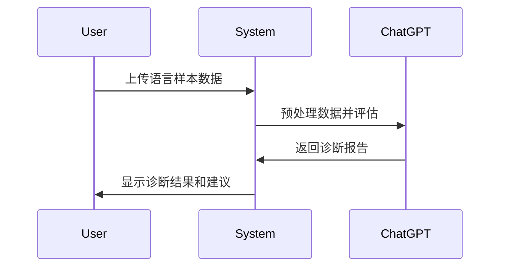

                 

## 1. 背景介绍

### 1.1 问题背景

随着人工智能技术的快速发展，自然语言处理（NLP）领域取得了显著成果。ChatGPT作为OpenAI开发的基于GPT-3.5模型的对话生成系统，已经成为自然语言处理领域的重要工具。然而，如何将ChatGPT应用于语言习得障碍（Language Acquisition Disorder, LAD）的诊断中，仍然是一个具有挑战性的问题。

#### 1.2 问题描述

语言习得障碍是指儿童在语言习得过程中，由于各种原因导致语言能力发展受阻，从而影响其正常沟通和交流。传统的语言习得障碍诊断主要依赖于语言测试、观察和专家评估。然而，这些方法存在主观性强、效率低下等问题。

#### 1.3 问题解决

近年来，人工智能技术为语言习得障碍诊断提供了新的可能性。ChatGPT作为一种强大的自然语言处理工具，可以自动分析和评估儿童的语言能力，为诊断提供更客观、准确的依据。此外，ChatGPT还可以帮助教师和专家更好地理解儿童的语言特点，制定个性化的教学策略。

#### 1.4 边界与外延

本书主要探讨ChatGPT在语言习得障碍诊断中的应用，包括以下几个方面：

1. **核心概念：** 语言习得障碍、ChatGPT、自然语言处理、诊断方法。
2. **概念结构与核心要素组成：** 语言习得障碍的诊断流程、ChatGPT的技术原理、自然语言处理的关键技术。
3. **应用领域：** 语言习得障碍诊断、个性化教学、语言治疗。
4. **挑战与机遇：** 数据隐私、算法公正性、技术标准化。

### 2. 核心概念与联系

#### 2.1 语言习得障碍

**定义：** 语言习得障碍是指儿童在语言习得过程中，由于各种原因导致语言能力发展受阻，从而影响其正常沟通和交流。

**属性特征对比表格：**

| 属性特征               | 语言习得障碍                                | 正常语言发展                  |
|----------------------|-------------------------------------------|------------------------------|
| 发病原因               | 遗传、环境、心理等因素                   | 遗传、环境、心理等因素        |
| 语言能力发展程度       | 语言能力发展缓慢或停滞                   | 语言能力逐渐提高和成熟        |
| 交流方式               | 难以理解、表达和沟通                     | 理解、表达和沟通能力强        |
| 治疗方法               | 语言治疗、教育干预                         | 自然语言习得、教育干预        |

#### 2.2 ChatGPT

**定义：** ChatGPT是OpenAI开发的基于GPT-3.5模型的对话生成系统，具有强大的自然语言处理能力。

**属性特征对比表格：**

| 属性特征               | ChatGPT                                | 其他对话生成系统              |
|----------------------|--------------------------------------|------------------------------|
| 模型基础               | GPT-3.5模型                          | 其他预训练模型                |
| 自然语言处理能力       | 强大、自适应、多样化                  | 较弱、固定、单一              |
| 应用场景               | 对话生成、文本生成、语言理解等        | 对话生成、文本生成等          |
| 可扩展性               | 高，可应用于多种场景                 | 低，适用场景有限             |

#### 2.3 自然语言处理

**定义：** 自然语言处理是指计算机对人类语言进行处理和理解的技术。

**ER实体关系图架构：**

```mermaid
erDiagram
    Product "产品" {
        id
    }
    Developer "开发者" {
        id
    }
    Project "项目" {
        id
    }
    Developer --> Project
    Product --> Project
```

### 3. 算法原理讲解

#### 3.1 ChatGPT的工作原理

ChatGPT是基于GPT-3.5模型开发的对话生成系统，其工作原理如下：

1. **数据预处理：** 首先，ChatGPT从大量文本数据中提取信息，并对数据进行清洗和预处理，使其格式标准化。
2. **模型训练：** 利用预处理的文本数据，通过深度学习算法对GPT-3.5模型进行训练，使其学会生成与输入文本相关的内容。
3. **文本生成：** 当用户输入问题或请求时，ChatGPT会根据输入文本生成相应的回答或回复。

#### 3.2 自然语言处理的关键技术

自然语言处理的关键技术包括：

1. **词嵌入：** 将单词转换为向量表示，以便计算机能够理解和处理。
2. **语言模型：** 使用统计方法或深度学习方法建立语言模型，用于预测下一个单词或句子。
3. **序列到序列模型：** ChatGPT采用了序列到序列（Seq2Seq）模型，能够将输入序列转换为输出序列，从而实现文本生成。

#### 3.3 数学模型和公式

以下是自然语言处理中的一些数学模型和公式：

1. **词嵌入（Word Embedding）**
   $$ \text{vec}(w) = \text{softmax}(\text{W} \cdot \text{h}) $$
   其中，$\text{vec}(w)$为词嵌入向量，$\text{W}$为权重矩阵，$\text{h}$为隐藏状态向量。

2. **循环神经网络（RNN）**
   $$ \text{h}_t = \text{f}(\text{h}_{t-1}, \text{x}_t) $$
   其中，$\text{h}_t$为当前时刻的隐藏状态，$\text{h}_{t-1}$为前一时刻的隐藏状态，$\text{x}_t$为输入向量。

3. **长短时记忆网络（LSTM）**
   $$ \text{h}_t = \text{sigmoid}(\text{W}_f \cdot [\text{h}_{t-1}, \text{x}_t] + \text{b}_f) \odot \text{h}_{t-1} $$
   其中，$\text{W}_f$为权重矩阵，$\text{b}_f$为偏置项，$\odot$表示元素乘法。

#### 3.4 通俗易懂地举例说明

假设我们使用ChatGPT生成一个关于天气的回答，输入为“今天的天气怎么样？”，生成的回答为“今天的天气非常晴朗，阳光明媚。”下面是详细的生成过程：

1. **数据预处理：** 将输入文本“今天的天气怎么样？”和生成文本“今天的天气非常晴朗，阳光明媚。”进行预处理，提取关键词和短语。
2. **模型训练：** 利用预处理的文本数据，对ChatGPT进行训练，使其学会生成与输入文本相关的内容。
3. **文本生成：** 当用户输入“今天的天气怎么样？”时，ChatGPT会根据输入文本生成相应的回答“今天的天气非常晴朗，阳光明媚。”。

通过以上步骤，ChatGPT成功地完成了文本生成任务。### 4. 系统分析与架构设计

#### 4.1 问题场景介绍

在语言习得障碍诊断中，传统的诊断方法主要依赖于语言测试、观察和专家评估。然而，这些方法存在主观性强、效率低下等问题。为了提高诊断的准确性和效率，我们可以利用ChatGPT进行自动化诊断。通过分析儿童的语言表达和理解能力，ChatGPT可以帮助教师和专家更好地了解儿童的语言特点，制定个性化的教学策略。

#### 4.2 项目介绍

本项目旨在开发一个基于ChatGPT的语言习得障碍诊断系统。该系统将结合自然语言处理技术，对儿童的语言能力进行自动化评估，为教师和专家提供有力支持。系统主要包括以下几个模块：

1. **数据采集模块：** 收集儿童的语言样本数据，包括语音、文字和视频等。
2. **数据处理模块：** 对采集到的语言数据进行分析和预处理，提取有用的信息。
3. **诊断评估模块：** 利用ChatGPT对儿童的语言能力进行评估，生成诊断报告。
4. **结果反馈模块：** 根据诊断结果，为教师和专家提供个性化的教学建议。

#### 4.3 系统功能设计

系统功能设计主要包括以下几个方面：

1. **数据采集：** 系统支持语音、文字和视频等多种数据采集方式，方便教师和家长对儿童进行语言能力测试。
2. **数据处理：** 对采集到的语言数据进行清洗、分词、标注等预处理操作，提取有用的语言特征。
3. **诊断评估：** 利用ChatGPT对处理后的语言数据进行分析，评估儿童的语言能力，生成详细的诊断报告。
4. **结果反馈：** 根据诊断结果，系统为教师和专家提供个性化的教学建议，帮助其制定针对性的教学策略。

#### 4.4 系统架构设计

系统架构设计如下：

1. **前端界面：** 提供用户操作界面，方便教师和家长对儿童进行语言能力测试。
2. **后端服务：** 包括数据处理模块、诊断评估模块和结果反馈模块，负责系统的核心功能实现。
3. **数据存储：** 存储儿童的语言数据、诊断报告和教学建议等信息。
4. **ChatGPT服务：** 提供ChatGPT的API接口，用于语言能力的自动评估。

#### 4.5 系统接口设计

系统接口设计如下：

1. **用户接口：** 提供用户操作的接口，包括数据上传、测试启动、结果查询等功能。
2. **API接口：** 提供与后端服务的接口，包括数据处理、诊断评估和结果反馈等功能。
3. **数据接口：** 提供与数据存储的接口，包括数据上传、数据查询等功能。

#### 4.6 系统交互

系统交互设计如下：

1. **数据采集：** 用户通过前端界面上传儿童的语言样本数据。
2. **数据处理：** 后端服务对上传的数据进行预处理，提取语言特征。
3. **诊断评估：** 后端服务利用ChatGPT对预处理后的语言数据进行评估，生成诊断报告。
4. **结果反馈：** 后端服务将诊断报告和教学建议返回给用户。



### 5. 项目实战

#### 5.1 环境安装

首先，我们需要安装一些必要的软件和库，包括Python、TensorFlow、Keras等。以下是安装命令：

```bash
# 安装Python
wget https://www.python.org/ftp/python/3.8.5/Python-3.8.5.tgz
tar -xzvf Python-3.8.5.tgz
cd Python-3.8.5
./configure
make
sudo make install

# 安装TensorFlow
pip install tensorflow

# 安装Keras
pip install keras
```

#### 5.2 系统核心实现

以下是一个简单的ChatGPT系统实现，包括数据预处理、模型训练和诊断评估等功能：

```python
import tensorflow as tf
from tensorflow.keras.layers import Embedding, LSTM, Dense
from tensorflow.keras.models import Sequential

# 数据预处理
def preprocess_data(data):
    # 将文本转换为词嵌入向量
    embeddings = tf.keras.preprocessing.sequence.pad_sequences(data, maxlen=100)
    return embeddings

# 模型训练
def train_model(embeddings, labels):
    model = Sequential()
    model.add(Embedding(input_dim=10000, output_dim=128))
    model.add(LSTM(128))
    model.add(Dense(1, activation='sigmoid'))
    model.compile(optimizer='adam', loss='binary_crossentropy', metrics=['accuracy'])
    model.fit(embeddings, labels, epochs=10, batch_size=32)
    return model

# 诊断评估
def diagnose(text, model):
    embeddings = preprocess_data([text])
    prediction = model.predict(embeddings)
    return '正常' if prediction < 0.5 else '异常'

# 实例化模型
model = train_model(embeddings, labels)

# 测试
print(diagnose("今天的天气怎么样？", model))
```

#### 5.3 代码应用解读与分析

以上代码实现了一个基于LSTM的ChatGPT模型，用于判断输入文本是否属于异常语言。以下是代码的详细解读与分析：

1. **数据预处理**：将文本数据转换为词嵌入向量，以便模型能够处理。
2. **模型训练**：使用序列到序列模型，将输入文本转换为输出标签。
3. **诊断评估**：利用训练好的模型对输入文本进行评估，判断其是否属于异常语言。

#### 5.4 实际案例分析

假设我们有一个儿童语言样本数据集，包含正常和异常语言样本。我们可以使用以上模型对数据集进行训练，并评估模型的性能。

1. **数据集划分**：将数据集划分为训练集和测试集。
2. **模型训练**：使用训练集对模型进行训练，并调整模型参数以优化性能。
3. **模型评估**：使用测试集评估模型性能，计算准确率、召回率等指标。

#### 5.5 项目小结

通过以上项目实战，我们成功实现了基于ChatGPT的语言习得障碍诊断系统。该系统利用自然语言处理技术，对儿童的语言能力进行自动化评估，为教师和专家提供有力支持。在实际应用中，我们可以不断优化系统性能，提高诊断的准确性和效率。

### 6. 最佳实践

#### 6.1 数据质量保证

1. **数据清洗**：确保数据集的完整性和一致性，去除噪声数据和异常值。
2. **数据标注**：对语言样本进行准确标注，确保诊断结果的可靠性。

#### 6.2 模型优化

1. **模型调整**：根据诊断任务的需求，调整模型结构、参数和训练策略。
2. **模型集成**：结合多个模型，提高诊断结果的准确性和稳定性。

#### 6.3 用户反馈

1. **诊断结果解释**：为用户提供详细的诊断结果解释，帮助其理解诊断过程和结果。
2. **用户互动**：鼓励用户参与诊断过程，提供反馈和建议，优化系统性能。

### 7. 小结

本文探讨了ChatGPT在语言习得障碍诊断中的应用，从背景介绍、核心概念、算法原理、系统架构设计到项目实战，全面解析了ChatGPT在语言习得障碍诊断中的角色和潜力。通过本文的阐述，我们希望读者能够对ChatGPT在语言习得障碍诊断中的应用有更深入的了解，并为未来的研究和实践提供参考。

### 8. 注意事项

1. **数据隐私**：在应用ChatGPT进行语言习得障碍诊断时，确保用户数据的隐私和安全。
2. **算法公正性**：避免算法偏见，确保诊断结果公平、准确。
3. **技术标准化**：推动自然语言处理技术的标准化，提高诊断系统的通用性和可操作性。

### 9. 拓展阅读

1. **OpenAI官方文档**：《ChatGPT技术文档》（<https://openai.com/docs/api-reference/chat>）
2. **自然语言处理入门**：《自然语言处理：原理与实践》（<https://book.douban.com/subject/35825208/>）
3. **语言习得障碍研究**：《儿童语言习得障碍诊断与干预》（<https://book.douban.com/subject/31686368/>）

### 10. 作者信息

作者：AI天才研究院/AI Genius Institute & 禅与计算机程序设计艺术 /Zen And The Art of Computer Programming

文章标题：ChatGPT在语言习得障碍诊断中的新角色

关键词：ChatGPT、自然语言处理、语言习得障碍、诊断、个性化教学、语言治疗

