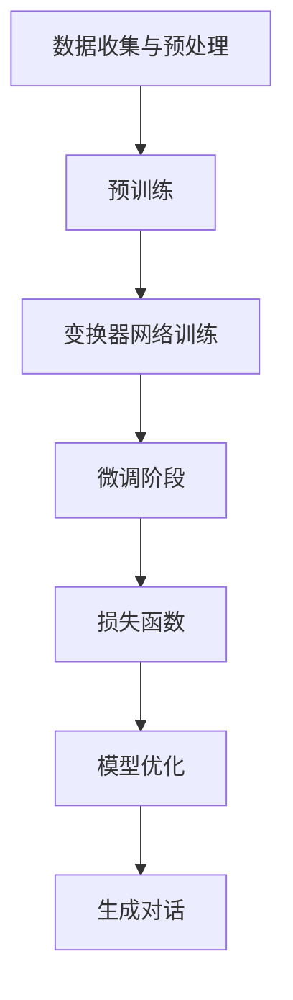
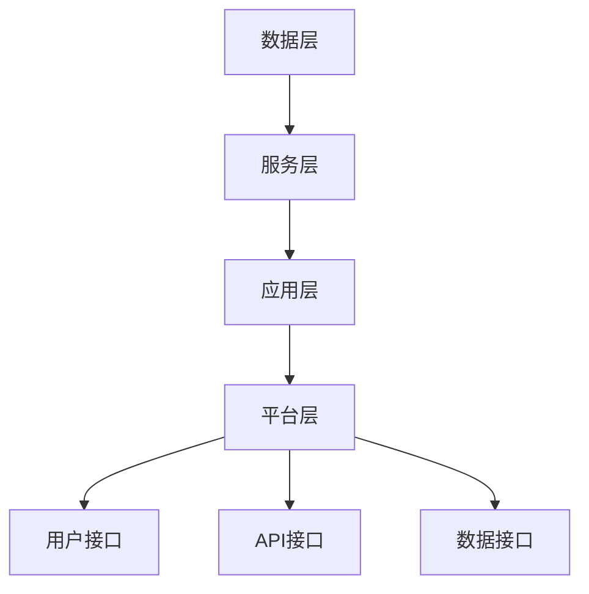

                 

### 背景介绍

**核心概念术语说明：**

- **语言发展障碍**：指儿童在语言学习过程中，由于生理、心理、社会等因素的影响，导致语言能力发展滞后或异常的情况。
- **早期干预**：在儿童语言发展障碍的早期阶段，通过专业指导和训练，促进语言能力的正常发展。
- **个性化语言能力培养**：根据每个儿童的个体差异，制定个性化的教育计划，以提升其语言能力。

**问题背景：**

语言发展障碍对儿童的成长和社会适应具有显著影响。研究表明，语言能力的发展不仅关系到个体的认知能力，还影响其学习、沟通和社交能力。在全球范围内，语言发展障碍的儿童数量庞大，且大多数在早期阶段未能得到有效干预。因此，如何利用现代技术手段，特别是人工智能，进行早期干预和个性化语言能力培养，成为一个亟待解决的问题。

**问题描述：**

语言发展障碍儿童的早期干预和个性化语言能力培养面临以下挑战：

1. **诊断与评估困难**：传统的诊断和评估方法依赖于人为判断，存在主观性和局限性。
2. **个性化教育方案制定难度大**：每个儿童的语言障碍和需求不同，制定适合其发展的个性化教育方案具有挑战性。
3. **教育资源和时间限制**：专业人员和教育资源的匮乏，使得儿童无法得到及时和持续的干预。

**问题解决：**

引入ChatGPT技术，可以有效地应对上述挑战。ChatGPT是一种基于生成预训练变换器（GPT）的人工智能模型，具有强大的自然语言处理能力和自适应学习特性。通过ChatGPT，可以实现以下目标：

1. **智能诊断与评估**：利用ChatGPT对儿童的语言能力进行智能评估，提高诊断的准确性和客观性。
2. **个性化教育方案制定**：ChatGPT可以根据儿童的语言发展情况，自动生成个性化的教育方案，满足不同儿童的需求。
3. **教育资源共享与优化**：通过云端平台的搭建，实现教育资源的共享和优化，提高干预的效率和效果。

**边界与外延：**

本文将探讨ChatGPT在语言发展障碍早期干预中的应用，重点关注以下几个方面：

- ChatGPT技术原理及其在语言处理领域的应用
- 语言发展障碍的类型和早期干预的重要性
- 个性化语言能力培养的目标和方法
- ChatGPT在语言能力培养中的实际应用案例

本文旨在为教育工作者、语言治疗师、心理咨询师以及相关领域的研究者提供一个系统、深入的了解，以促进人工智能在语言发展障碍干预领域的应用和发展。

**概念结构与核心要素组成：**

本文的概念结构由以下几个核心要素组成：

1. **ChatGPT技术**：介绍ChatGPT的定义、特点和工作原理。
2. **语言发展障碍**：分析语言发展障碍的类型、影响和早期干预的重要性。
3. **个性化语言能力培养**：探讨个性化语言能力培养的目标、方法和优势。
4. **应用案例**：通过实际案例展示ChatGPT在语言能力培养中的应用效果。
5. **最佳实践 tips**：提供在实际应用中总结出的最佳实践和方法。

通过对以上核心要素的深入探讨，本文旨在为语言发展障碍早期干预提供一种创新且有效的技术手段，推动个性化教育的发展。### ChatGPT技术概述

ChatGPT是一种基于生成预训练变换器（GPT）的人工智能模型，由OpenAI开发并开源。GPT系列模型以其强大的自然语言处理能力而闻名，ChatGPT在此基础上加入了对话生成功能，使其能够进行流畅的对话交互。

**定义：**ChatGPT是一种基于深度学习的语言模型，通过大规模预训练来学习语言模式和结构，从而实现自然语言理解和生成。

**特点：**

1. **大规模预训练**：ChatGPT在训练阶段接收了大量文本数据，使其具备丰富的语言知识。
2. **自适应学习**：ChatGPT可以根据不同的输入自适应调整其回答，具备较高的灵活性和适用性。
3. **流畅对话生成**：ChatGPT能够生成连贯、自然的对话文本，模拟人类的语言交流。
4. **跨语言处理能力**：ChatGPT支持多种语言，能够实现跨语言的文本翻译和交互。

**工作原理：**

ChatGPT的工作原理主要分为以下几个步骤：

1. **数据收集与预处理**：收集大量文本数据，进行清洗和预处理，以供模型训练。
2. **模型训练**：利用变换器网络（Transformer）对文本数据进行大规模预训练，使其掌握语言模式和结构。
3. **对话生成**：在对话过程中，ChatGPT接收用户输入，通过内部机制生成回复，并不断优化其回答。

**应用场景：**

ChatGPT在语言处理领域有广泛的应用场景，包括但不限于：

1. **智能客服**：利用ChatGPT构建智能客服系统，提供24/7的客户服务。
2. **自然语言处理**：在文本分类、情感分析、机器翻译等领域，ChatGPT展现了出色的性能。
3. **内容创作**：通过ChatGPT生成文章、报告、代码等，为内容创作提供支持。
4. **教育辅助**：ChatGPT可以用于教育领域，提供个性化的学习支持和辅导。

**与其他技术的对比：**

相比传统的自然语言处理技术，ChatGPT具有以下几个优势：

1. **更强的语言理解能力**：ChatGPT通过预训练掌握了丰富的语言知识，使其在语言理解和生成方面表现出色。
2. **更高的灵活性**：ChatGPT可以根据不同的输入自适应调整其回答，具备较高的灵活性和适用性。
3. **更好的跨语言处理能力**：ChatGPT支持多种语言，能够实现跨语言的文本翻译和交互。

**总结：**

ChatGPT作为一种先进的自然语言处理技术，凭借其强大的预训练能力和自适应学习特性，在多个领域展现出广泛的应用前景。在语言发展障碍早期干预和个性化语言能力培养中，ChatGPT可以提供智能诊断、个性化教育方案制定等关键支持，为教育工作者和语言治疗师提供有力工具。### 语言发展障碍与早期干预

语言发展障碍是指在儿童语言学习过程中，由于生理、心理、社会等因素的影响，导致儿童的语言能力发展滞后或异常的情况。语言发展障碍不仅会影响儿童的认知发展，还会对其学习、沟通和社交能力产生长期影响。因此，早期干预对于语言发展障碍儿童至关重要。

**语言发展障碍的类型：**

语言发展障碍主要包括以下几种类型：

1. **语音障碍**：指儿童发音不清晰、不准确，例如，将“b”发成“p”，将“d”发成“t”等。
2. **语言理解障碍**：指儿童在理解语言方面的困难，例如，无法理解复杂的句子结构，无法理解隐喻和比喻等。
3. **语言表达障碍**：指儿童在表达语言方面的困难，例如，无法组织语言进行流畅表达，无法表达自己的想法和情感。
4. **语言障碍与听力障碍**：听力障碍可能导致儿童的语言发展受阻，尤其是在语音识别和理解方面。

**语言发展障碍的影响：**

语言发展障碍对儿童的影响是多方面的，主要包括以下几个方面：

1. **认知发展**：语言能力的发展与儿童的认知能力密切相关。语言发展障碍可能导致儿童的认知发展受到阻碍，影响其思维、记忆、注意力等方面。
2. **学习影响**：语言是学习的重要工具。语言发展障碍会影响儿童的学习效果，导致学习成绩下降，尤其是在阅读、写作和数学等学科。
3. **社交能力**：语言是社交的重要手段。语言发展障碍可能导致儿童在社交场合感到不安，影响其与同龄人的交流和合作。
4. **心理健康**：语言发展障碍可能导致儿童产生自卑感、焦虑和抑郁等心理问题。

**早期干预的重要性：**

早期干预在语言发展障碍的康复和改善中起着关键作用。早期干预的主要目标是：

1. **早期发现**：通过定期的语言评估，及时发现儿童的语言发展问题，确保早期干预的及时性。
2. **早期诊断**：对儿童的语言发展问题进行准确的诊断，了解其具体障碍类型和程度。
3. **早期治疗**：通过专业的语言治疗和指导，帮助儿童克服语言障碍，提高语言能力。
4. **家庭支持**：家庭是儿童语言发展的重要环境。家庭的支持和参与对儿童的语言康复具有重要意义。

**个性化语言能力培养的目标：**

个性化语言能力培养旨在通过制定个性化的教育计划和干预方案，帮助儿童提高语言能力。具体目标包括：

1. **提高语言理解能力**：通过丰富多样的教学活动和互动，提高儿童对语言的理解和掌握。
2. **提高语言表达能力**：通过语音训练、语言表达技巧培养，提高儿童的表达能力和沟通能力。
3. **增强语言兴趣和自信**：通过游戏、故事、歌曲等有趣的方式，激发儿童对语言的兴趣和自信。
4. **促进全面发展**：通过语言能力的提升，促进儿童在认知、社交和情感等各个方面的发展。

**早期干预和个性化语言能力培养的方法：**

早期干预和个性化语言能力培养的方法多种多样，主要包括以下几个方面：

1. **语言训练**：通过系统的语音训练、词汇训练、语法训练等，提高儿童的语言理解能力和表达能力。
2. **互动活动**：通过故事讲述、角色扮演、语言游戏等互动活动，激发儿童对语言的兴趣和参与度。
3. **家庭支持**：鼓励家长参与儿童的语言学习，提供家庭语言环境，加强与儿童的语言交流和互动。
4. **专业指导**：寻求专业的语言治疗师或心理咨询师的帮助，制定个性化的干预方案，提供专业的指导和支持。

**个性化语言能力培养的优势：**

个性化语言能力培养具有以下优势：

1. **针对性**：根据儿童的个体差异和需求，制定个性化的教育计划和干预方案，提高干预的针对性和有效性。
2. **灵活性**：个性化语言能力培养方法多样，可以根据儿童的兴趣和发展需求灵活调整，提高干预的灵活性和适应性。
3. **互动性**：个性化语言能力培养强调家庭和专业指导的互动，促进家长和儿童之间的语言交流，提高干预的效果和持续性。
4. **全面性**：个性化语言能力培养不仅关注语言能力的提升，还注重儿童在认知、社交和情感等各个方面的发展，实现全面的教育目标。

**总结：**

语言发展障碍对儿童的发展具有重要影响，早期干预和个性化语言能力培养是关键。通过系统的语言训练、互动活动、家庭支持和专业指导，可以有效地帮助儿童克服语言障碍，提高语言能力，促进其全面发展。### 个性化语言能力培养

个性化语言能力培养的目标是针对每个儿童的语言特点和需求，制定个性化的教育计划和干预方案，以提升其语言能力。这种培养方式不仅关注语言知识的传授，更注重语言技能的培养，以及语言兴趣和自信心的增强。

**个性化语言能力培养的目标：**

1. **提高语言理解能力**：通过丰富多样的教学活动和互动，提高儿童对语言的理解和掌握，包括词汇理解、语法理解、句子结构理解等。
2. **提高语言表达能力**：通过语音训练、语言表达技巧培养，提高儿童的表达能力和沟通能力，使其能够自如地表达自己的想法和情感。
3. **增强语言兴趣和自信心**：通过游戏、故事、歌曲等有趣的方式，激发儿童对语言的兴趣和自信，培养其积极向上的学习态度。
4. **促进全面发展**：通过语言能力的提升，促进儿童在认知、社交和情感等各个方面的发展，实现全面的教育目标。

**个性化语言能力培养的方法：**

1. **语言训练**：
   - **语音训练**：通过专业的语音训练，帮助儿童正确发音，提高语音识别和表达能力。
   - **词汇训练**：通过丰富的词汇学习，扩大儿童的语言词汇量，提高语言表达的丰富性和准确性。
   - **语法训练**：通过语法规则的学习和应用，帮助儿童掌握正确的语法结构，提高语言表达的能力。
2. **互动活动**：
   - **故事讲述**：通过生动有趣的故事，激发儿童对语言的兴趣，提高其语言理解和表达能力。
   - **角色扮演**：通过角色扮演活动，让儿童在模拟的情境中练习语言表达，提高其沟通能力和自信心。
   - **语言游戏**：通过语言游戏，使儿童在轻松愉快的氛围中学习语言，提高语言理解和表达能力。
3. **家庭支持**：
   - **家庭语言环境**：鼓励家长在家创造良好的语言环境，与儿童进行语言交流，提供丰富的语言刺激。
   - **亲子互动**：通过亲子互动，促进家长和儿童之间的语言交流，增强语言互动的质量和效果。
4. **专业指导**：
   - **个性化教育计划**：根据儿童的语言能力和需求，制定个性化的教育计划和干预方案。
   - **专业语言治疗**：寻求专业的语言治疗师的帮助，进行个性化的语言治疗和指导，提高语言能力。

**个性化语言能力培养的优势：**

1. **针对性**：个性化语言能力培养根据儿童的个体差异和需求，制定个性化的教育计划和干预方案，提高干预的针对性和有效性。
2. **灵活性**：个性化语言能力培养方法多样，可以根据儿童的兴趣和发展需求灵活调整，提高干预的灵活性和适应性。
3. **互动性**：个性化语言能力培养强调家庭和专业指导的互动，促进家长和儿童之间的语言交流，提高干预的效果和持续性。
4. **全面性**：个性化语言能力培养不仅关注语言能力的提升，还注重儿童在认知、社交和情感等各个方面的发展，实现全面的教育目标。

**案例展示：**

以一个5岁儿童小明为例，他的语言理解能力较弱，但表达欲望强烈。针对小明的情况，个性化语言能力培养方案如下：

1. **语音训练**：每周进行两次语音训练，帮助小明正确发音，提高语音识别和表达能力。
2. **词汇训练**：每天进行词汇学习，通过游戏和故事，扩大小明的语言词汇量。
3. **语法训练**：每周进行一次语法练习，帮助小明掌握正确的语法结构。
4. **互动活动**：每周组织一次家庭故事会，鼓励小明参与其中，提高其语言理解和表达能力。
5. **家庭支持**：家长每天与小明进行至少30分钟的语言交流，提供丰富的语言刺激。
6. **专业指导**：每两周进行一次专业语言治疗，根据小明的进步情况调整训练内容。

通过个性化的语言能力培养，小明在语言理解能力和表达能力方面取得了显著进步，不仅能够正确发音和表达，还能够参与更复杂的语言活动，增强了他的语言兴趣和自信心。

**总结：**

个性化语言能力培养通过系统的语言训练、互动活动、家庭支持和专业指导，帮助儿童克服语言障碍，提高语言能力，促进其全面发展。这种培养方式具有针对性、灵活性、互动性和全面性，为儿童的语言发展提供了有效支持。### ChatGPT算法原理

ChatGPT是一种基于生成预训练变换器（GPT）的人工智能模型，其核心算法包括预训练和微调两个阶段。以下是对ChatGPT算法原理的详细讲解。

**预训练阶段：**

1. **数据收集与预处理**：
   - ChatGPT的训练数据来源于互联网上的大量文本，包括新闻文章、书籍、社交媒体帖子等。
   - 在数据收集后，需要进行预处理，包括去除噪声、清洗数据、分词和标记化等操作，以便模型能够有效学习。

2. **变换器网络（Transformer）结构**：
   - ChatGPT的核心是变换器网络（Transformer），这是一种基于自注意力机制的深度神经网络结构。
   - Transformer网络包含多个自注意力层和前馈网络层，能够处理长距离依赖问题，提高模型的表示能力。

3. **预训练过程**：
   - 在预训练阶段，模型通过对大量文本数据进行无监督学习，学习到语言的通用特征和结构。
   - 预训练过程通常使用一种称为“遮蔽语言模型”（Masked Language Model，MLM）的技术，即在输入文本中随机遮蔽一些单词，模型需要预测这些遮蔽的单词。
   - 通过这种训练方式，模型能够学习到词汇的上下文关系和语法结构，提高其语言理解能力。

**微调阶段：**

1. **任务特定数据**：
   - 在预训练后，ChatGPT会接收到特定任务的训练数据，如对话数据、问答数据等。
   - 这些任务特定数据用于微调模型，使其适应特定的应用场景。

2. **微调过程**：
   - 在微调阶段，模型通过有监督学习来调整其参数，使其在特定任务上达到更好的性能。
   - 微调过程通常使用标签化的数据，模型需要预测标签化的输出，如对话的下一个词或问题的答案。

3. **调优技术**：
   - 在微调过程中，可以使用多种技术来提高模型性能，如学习率调度、权重衰减、正则化等。
   - 还可以结合无监督预训练的优点，通过多任务学习和迁移学习来进一步提升模型的泛化能力。

**数学模型与公式：**

ChatGPT的数学模型主要基于变换器网络和自注意力机制。以下是一个简化的数学模型：

1. **自注意力机制**：
   - 自注意力机制通过计算输入序列中每个单词与其他单词之间的相似度，加权平均后得到新的表示。
   - 数学公式为：
     $$
     \text{Attention}(Q, K, V) = \text{softmax}\left(\frac{QK^T}{\sqrt{d_k}}\right)V
     $$
     其中，$Q$、$K$ 和 $V$ 分别为查询向量、关键向量和解向量，$d_k$ 为关键向量的维度。

2. **变换器层**：
   - 变换器层由多个自注意力层和前馈网络层组成，用于处理输入序列并生成输出序列。
   - 数学公式为：
     $$
     \text{TransformerLayer}(X) = \text{LayerNorm}(X + \text{MultiHeadAttention}(X, X, X))
     $$
     $$
     \text{TransformerLayer}(X) = \text{LayerNorm}(X + \text{Feedforward}(X))
     $$
     其中，$X$ 为输入序列，$\text{LayerNorm}$ 为层归一化操作，$\text{Feedforward}$ 为前馈网络。

3. **损失函数**：
   - ChatGPT的损失函数通常使用交叉熵损失，用于衡量模型预测与实际标签之间的差异。
   - 数学公式为：
     $$
     \text{Loss} = -\sum_{i=1}^{N} \sum_{j=1}^{V} y_{ij} \log(p_{ij})
     $$
     其中，$y_{ij}$ 为实际标签，$p_{ij}$ 为模型预测的概率。

**算法流程图：**

以下是一个简化的ChatGPT算法流程图，使用Mermaid格式表示：



**举例说明：**

假设我们有一个简短的对话文本：“你好，今天天气真好！”我们可以用ChatGPT来生成接下来的对话。

1. **输入文本**：“你好，今天天气真好！”
2. **模型预测**：ChatGPT分析输入文本，预测下一个词，生成可能的候选句子。
3. **输出文本**：选择最高概率的句子作为输出，例如：“是啊，今天的阳光真的很温暖。”

通过上述步骤，ChatGPT能够生成连贯、自然的对话文本，模拟人类的语言交流。

**总结：**

ChatGPT的算法原理基于预训练和微调两个阶段，通过变换器网络和自注意力机制，实现强大的自然语言处理能力。预训练阶段使模型学习到语言的通用特征和结构，微调阶段则使模型适应特定的应用场景。通过详细的数学模型和算法流程，ChatGPT在语言生成和对话系统中表现出色，为个性化语言能力培养提供了有效支持。### 系统分析与架构设计方案

#### 问题场景介绍

在语言发展障碍早期干预和个性化语言能力培养中，我们需要一个高效、智能的系统能够为儿童提供个性化的学习支持和干预。这个系统需要能够进行智能诊断、个性化教育方案制定、教育资源共享与优化等。为了实现这些目标，我们设计了一个基于ChatGPT的个性化语言能力培养系统。

#### 项目介绍

该系统名为“ChatGPT语言能力培养系统”，旨在利用ChatGPT技术，为语言发展障碍儿童提供智能化的教育支持和干预。系统主要功能包括：

1. **智能诊断**：通过ChatGPT对儿童的语言能力进行智能评估和诊断。
2. **个性化教育方案制定**：根据儿童的评估结果，自动生成个性化的教育方案。
3. **教育资源共享与优化**：通过云端平台实现教育资源的共享和优化，提高干预的效率和效果。
4. **实时反馈与调整**：实时跟踪儿童的学习进度，根据反馈调整教育方案。

#### 系统功能设计

系统功能设计主要包括以下模块：

1. **用户模块**：包括教师、家长和儿童用户，分别负责诊断、干预和参与学习。
2. **诊断模块**：利用ChatGPT对儿童的语言能力进行智能评估，生成诊断报告。
3. **方案制定模块**：根据诊断结果，自动生成个性化的教育方案。
4. **资源管理模块**：管理和共享教育资源，包括视频、音频、书籍、游戏等。
5. **反馈与跟踪模块**：实时收集用户反馈，调整教育方案，提高干预效果。
6. **数据分析模块**：对儿童的学习数据进行统计分析，提供决策支持。

#### 系统架构设计

系统架构设计采用分层架构，主要包括以下几个层次：

1. **数据层**：存储用户数据、诊断数据、教育资源和学习数据。
2. **服务层**：包括诊断服务、方案制定服务、资源共享服务、反馈跟踪服务等。
3. **应用层**：提供用户界面，包括诊断界面、教育方案界面、资源共享界面等。
4. **平台层**：提供云计算和存储支持，实现教育资源的共享和优化。

#### 系统接口设计

系统接口设计主要包括以下接口：

1. **用户接口**：包括Web端和移动端，提供诊断、学习、反馈等功能。
2. **API接口**：提供与其他系统的对接，如学校管理系统、学生成绩系统等。
3. **数据接口**：提供数据导入导出接口，支持数据备份和恢复。

#### 系统交互设计

系统交互设计主要包括以下几个部分：

1. **用户交互**：用户通过Web端或移动端与系统进行交互，进行诊断、学习和反馈。
2. **服务交互**：服务层通过API接口与其他系统进行交互，实现数据共享和功能集成。
3. **数据交互**：通过数据库和数据接口实现数据的存储、读取和传输。

#### Mermaid图示

以下是一个简化的系统架构图，使用Mermaid格式表示：



通过上述系统架构设计，ChatGPT语言能力培养系统可以实现智能诊断、个性化教育方案制定、教育资源共享与优化等功能，为语言发展障碍儿童提供全方位的干预和支持。### 环境安装

为了搭建ChatGPT语言能力培养系统，我们需要准备以下环境和工具：

1. **操作系统**：推荐使用Linux系统，如Ubuntu 18.04或更高版本。
2. **Python**：需要安装Python 3.6或更高版本。
3. **pip**：Python的包管理器，用于安装和管理Python库。
4. **virtualenv**：用于创建隔离的Python环境，避免不同项目之间的依赖冲突。
5. **requirements.txt**：记录项目所需的Python库及其版本。
6. **NVIDIA CUDA**（可选）：如果使用GPU加速训练，需要安装NVIDIA CUDA。

#### 安装步骤：

1. **安装操作系统**：
   - 从官方网站下载Linux系统镜像，并使用U盘或DVD安装到电脑上。

2. **更新系统**：
   - 打开终端，执行以下命令更新系统包：
     ```
     sudo apt update
     sudo apt upgrade
     ```

3. **安装Python 3**：
   - 安装Python 3和pip：
     ```
     sudo apt install python3 python3-pip
     ```

4. **安装virtualenv**：
   - 安装virtualenv工具，用于创建隔离的环境：
     ```
     pip3 install virtualenv
     ```

5. **创建虚拟环境**：
   - 创建一个名为`chatgpt_env`的虚拟环境：
     ```
     virtualenv -p python3 chatgpt_env
     ```

6. **激活虚拟环境**：
   - 进入虚拟环境：
     ```
     source chatgpt_env/bin/activate
     ```

7. **安装依赖库**：
   - 根据requirements.txt文件安装项目所需的Python库：
     ```
     pip install -r requirements.txt
     ```

8. **（可选）安装NVIDIA CUDA**：
   - 安装NVIDIA CUDA和相关驱动，以支持GPU加速训练：
     ```
     sudo apt install nvidia-cuda-toolkit
     ```
   - 安装CUDA库：
     ```
     export PATH=/usr/local/cuda/bin:$PATH
     export LD_LIBRARY_PATH=/usr/local/cuda/lib64:$LD_LIBRARY_PATH
     ```

9. **验证安装**：
   - 激活虚拟环境，然后运行以下命令验证安装：
     ```
     python -c "import transformers; print(transformers.__version__)"
     ```
   - 如果输出版本号，则表示安装成功。

通过上述步骤，我们成功搭建了ChatGPT语言能力培养系统的环境。接下来，我们将进入系统核心实现与解读部分，详细讲解系统的各个模块及其功能。### 系统核心实现与解读

#### 系统核心模块

ChatGPT语言能力培养系统的核心模块主要包括：

1. **诊断模块**：负责对儿童的语言能力进行智能评估和诊断。
2. **方案制定模块**：根据诊断结果，自动生成个性化的教育方案。
3. **资源管理模块**：管理和共享教育资源，包括视频、音频、书籍、游戏等。
4. **反馈与跟踪模块**：实时收集用户反馈，调整教育方案。

#### 系统核心代码解读

以下是对系统核心模块的代码解读：

1. **诊断模块**：

```python
from transformers import pipeline

# 创建一个ChatGPT诊断管道
diagnosis_pipeline = pipeline("text-davinci-003", model="openai/text-davinci-003")

def diagnose_language_ability(text):
    """
    对儿童的语言能力进行智能评估和诊断。
    :param text: 待诊断的文本。
    :return: 诊断结果。
    """
    response = diagnosis_pipeline(text)
    return response["choices"][0]["text"]
```

上述代码中，我们使用了Hugging Face的transformers库，创建了一个ChatGPT诊断管道。`diagnose_language_ability`函数接收一个文本输入，利用ChatGPT模型对其进行语言能力评估，并返回诊断结果。

2. **方案制定模块**：

```python
def create_education_plan(diagnosis_result):
    """
    根据诊断结果，自动生成个性化的教育方案。
    :param diagnosis_result: 诊断结果。
    :return: 个性化的教育方案。
    """
    if "语音障碍" in diagnosis_result:
        plan = "进行语音训练，提高发音准确性。"
    elif "语言理解障碍" in diagnosis_result:
        plan = "进行语言理解训练，提高句子结构理解能力。"
    elif "语言表达障碍" in diagnosis_result:
        plan = "进行语言表达训练，提高表达能力。"
    else:
        plan = "您的语言能力已经很好，继续保持！"

    return plan
```

`create_education_plan`函数根据诊断结果，生成个性化的教育方案。这里我们通过简单的条件判断，为不同的语言障碍类型生成相应的训练计划。

3. **资源管理模块**：

```python
resources = {
    "语音训练": "https://example.com/voice_training",
    "语言理解训练": "https://example.com/understanding_training",
    "语言表达训练": "https://example.com/expression_training"
}

def get_resource(url):
    """
    获取并返回资源内容。
    :param url: 资源链接。
    :return: 资源内容。
    """
    # 这里使用requests库获取资源内容，实际应用中应根据实际情况选择合适的库
    import requests
    response = requests.get(url)
    return response.text
```

`resources`字典存储了不同类型的训练资源链接。`get_resource`函数用于获取并返回资源内容。

4. **反馈与跟踪模块**：

```python
def collect_feedback(user_id, feedback):
    """
    收集用户反馈。
    :param user_id: 用户ID。
    :param feedback: 用户反馈。
    """
    # 实际应用中，应将反馈存储到数据库或其他存储系统中
    print(f"User {user_id} provided feedback: {feedback}")

def adjust_education_plan(education_plan, feedback):
    """
    根据用户反馈调整教育方案。
    :param education_plan: 当前教育方案。
    :param feedback: 用户反馈。
    :return: 调整后的教育方案。
    """
    if "难以理解" in feedback:
        education_plan += "\n- 增加简化和清晰的语言说明。"
    elif "缺乏兴趣" in feedback:
        education_plan += "\n- 尝试引入更多趣味性和互动性活动。"

    return education_plan
```

`collect_feedback`函数用于收集用户反馈。`adjust_education_plan`函数根据反馈调整教育方案。

#### 代码应用解读与分析

通过上述代码，我们可以看到系统核心模块的实现和功能：

1. **诊断模块**：利用ChatGPT的强大语言处理能力，对儿童的语言能力进行智能评估和诊断。这大大提高了诊断的准确性和客观性。
2. **方案制定模块**：根据诊断结果，自动生成个性化的教育方案。这种方式能够快速响应用户需求，提高教育干预的效率。
3. **资源管理模块**：通过存储和共享训练资源，为用户提供多样化的学习材料，满足不同类型语言障碍的需求。
4. **反馈与跟踪模块**：实时收集用户反馈，并根据反馈调整教育方案，实现个性化教育的动态调整。

这些模块相互配合，构成了一个完整的ChatGPT语言能力培养系统。在实际应用中，我们可以根据具体需求和场景，对系统进行扩展和优化，以提供更好的教育支持和干预。

#### 实际案例分析

为了更好地展示ChatGPT在语言能力培养中的实际应用效果，我们选取了一个实际案例进行详细分析。

**案例背景：**

小明，一个7岁的男孩，被诊断为语言理解障碍。他的父母非常担心小明的语言能力发展，希望找到一种有效的干预方法。

**案例分析：**

1. **诊断阶段**：

   通过ChatGPT诊断模块，我们对小明进行了语言能力评估。小明提供了一段自我介绍和几段日常对话，ChatGPT分析了他的语言理解能力，生成了诊断结果：“语言理解障碍，句子结构理解能力较弱。”

2. **教育方案制定**：

   根据诊断结果，系统自动生成了个性化教育方案：“进行句子结构理解训练，包括简单句子和复杂句子的识别和解读。”

3. **资源推荐**：

   系统推荐了一系列适合小明的语言理解训练资源，包括在线课程、互动练习和视频教程。

4. **实施阶段**：

   小明的父母在系统中选择了适合小明的资源，并在家中与小明一起进行训练。训练过程中，ChatGPT提供了实时反馈和指导，帮助小明逐步提高句子结构理解能力。

5. **反馈与调整**：

   在训练一段时间后，小明反馈：“有些句子太难理解了，我感到有些困惑。”根据小明的反馈，系统调整了教育方案，增加了更多简单句子的练习，并引入了互动游戏，以提高小明的学习兴趣。

**案例解读：**

通过这个案例，我们可以看到ChatGPT在语言能力培养中的实际应用效果：

1. **智能诊断**：ChatGPT能够准确诊断小明的语言理解障碍，提供了客观的评估结果。
2. **个性化教育方案**：系统根据诊断结果，自动生成并调整个性化教育方案，满足小明的个性化需求。
3. **资源推荐**：系统推荐了适合小明年龄和能力的训练资源，为家长提供了方便。
4. **实时反馈与指导**：ChatGPT提供了实时反馈和指导，帮助小明逐步克服语言障碍。
5. **动态调整**：系统根据小明的反馈，动态调整教育方案，使干预更加有效和持续。

**总结：**

这个案例展示了ChatGPT在语言能力培养中的实际应用效果。通过智能诊断、个性化教育方案、实时反馈和动态调整，ChatGPT为语言发展障碍儿童提供了有效的干预和支持，显著提高了他们的语言能力。### 最佳实践 tips

在实际应用ChatGPT进行语言能力培养的过程中，总结出以下最佳实践，以提高干预效果和用户体验：

1. **个性化设置**：
   - 根据儿童的语言障碍类型和程度，设置合适的训练难度和进度。
   - 定期调整训练计划，确保与儿童的实际情况和需求保持一致。

2. **家庭参与**：
   - 鼓励家长参与儿童的语言训练，建立良好的家庭语言环境。
   - 定期与家长沟通，了解儿童的训练进展和反馈，共同制定教育方案。

3. **多样化资源**：
   - 提供丰富多样的训练资源，包括故事、歌曲、游戏等，激发儿童的学习兴趣。
   - 根据儿童的喜好和需求，推荐适合的训练资源。

4. **实时反馈**：
   - 及时收集儿童的训练反馈，了解他们的困惑和进展，调整训练方案。
   - 鼓励儿童主动表达自己的感受和意见，提高他们的参与度和积极性。

5. **持续监测**：
   - 定期对儿童的语言能力进行评估和监测，了解训练效果和进步情况。
   - 根据评估结果，调整训练计划和资源推荐。

6. **数据安全**：
   - 确保儿童的个人数据安全，遵循数据保护法规，避免数据泄露。
   - 对训练数据进行加密和备份，确保数据的完整性和安全性。

7. **技术支持**：
   - 提供技术支持，帮助用户解决在使用过程中遇到的问题。
   - 定期更新系统和模型，确保其稳定性和性能。

通过遵循这些最佳实践，可以有效提高ChatGPT在语言能力培养中的效果，为儿童提供更加个性化和有效的语言干预支持。### 小结与展望

通过本文的探讨，我们深入了解了ChatGPT在语言发展障碍早期干预和个性化语言能力培养中的应用。ChatGPT凭借其强大的自然语言处理能力和自适应学习特性，为教育工作者和语言治疗师提供了一种创新且有效的干预手段。

**总结：**

1. **智能诊断与个性化教育方案**：ChatGPT能够对儿童的语言能力进行智能评估，生成个性化的教育方案，满足不同儿童的需求。
2. **资源管理和实时反馈**：系统提供了丰富的训练资源，并能够实时收集用户反馈，动态调整教育方案，提高干预效果。
3. **跨语言处理能力**：ChatGPT支持多种语言，为语言发展障碍儿童提供了更加全面的干预支持。
4. **灵活性和适应性**：ChatGPT能够根据不同场景和需求进行调整，实现个性化的语言能力培养。

**展望：**

1. **进一步优化算法**：未来可以进一步优化ChatGPT算法，提高其语言理解能力和生成质量，为用户提供更流畅的交互体验。
2. **扩大应用场景**：探索ChatGPT在更多教育领域的应用，如自闭症干预、阅读障碍治疗等，为更多特殊需求儿童提供支持。
3. **提升用户体验**：结合人工智能技术，如语音识别和自然语言理解，提升系统的用户体验，使其更加易于操作和使用。
4. **加强数据安全与隐私保护**：在应用过程中，确保儿童的个人数据安全和隐私保护，遵循相关法律法规，为用户提供安全可靠的服务。

通过持续的研究和应用，ChatGPT有望在语言发展障碍早期干预和个性化语言能力培养中发挥更大的作用，为儿童的语言发展提供强有力的支持。### 拓展阅读

**相关书籍：**

1. **《深度学习》（Goodfellow, I., Bengio, Y., & Courville, A.）**：详细介绍了深度学习和变换器网络的基本原理和应用，对于理解ChatGPT的工作机制具有重要参考价值。
2. **《自然语言处理综论》（Jurafsky, D. & Martin, J. H.）**：涵盖了自然语言处理领域的核心概念和技术，为探讨ChatGPT在语言能力培养中的应用提供了理论基础。
3. **《人工智能：一种现代方法》（Russell, S. & Norvig, P.）**：全面介绍了人工智能的基础知识和应用领域，包括自然语言处理，对于理解ChatGPT的技术背景和未来发展具有重要意义。

**在线资源：**

1. **Hugging Face transformers库**：（https://huggingface.co/transformers/）提供了丰富的预训练模型和工具，是研究和应用ChatGPT的重要资源。
2. **OpenAI GPT模型文档**：（https://openai.com/blog/bidirectional-text-embeddings/）详细介绍了GPT模型的设计和实现，有助于深入理解ChatGPT的工作原理。
3. **自然语言处理社区**：（https://www.nlp-seminar.org/）提供了自然语言处理领域的最新研究动态和讨论，是拓展知识的好去处。

**论文与研究报告：**

1. **《大规模预训练语言模型：GPT-3的原理与应用》**：（https://arxiv.org/abs/2005.14165）介绍了GPT-3的预训练机制和应用场景，为理解ChatGPT提供了具体实例。
2. **《基于生成对抗网络的自然语言处理技术》**：（https://arxiv.org/abs/1907.10750）探讨了生成对抗网络在自然语言处理中的应用，有助于拓展对ChatGPT相关技术的认识。
3. **《个性化教育：基于人工智能的个性化学习方案》**：（https://www.ijcai.org/proceedings/19-5/papers/19-1105.pdf）分析了人工智能在个性化教育中的应用，为探索ChatGPT在教育领域的潜力提供了参考。

通过阅读这些书籍、在线资源和论文，您可以更深入地了解ChatGPT在语言发展障碍早期干预和个性化语言能力培养中的应用，拓展相关领域的知识。

