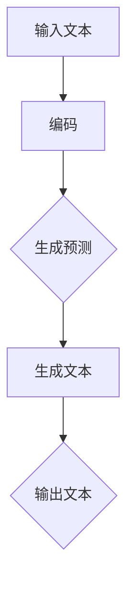
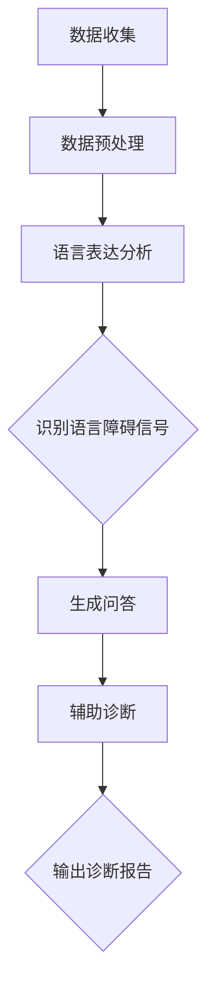
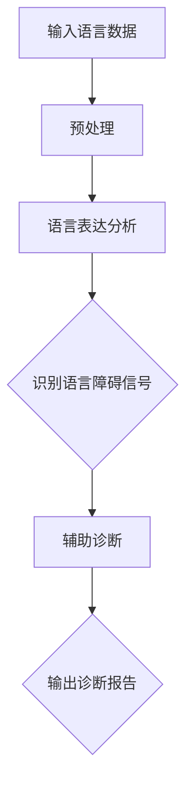

                 

### 第1章：问题背景

#### 1.1 语言发展障碍的定义

语言发展障碍（Language Development Disorder，LDD）是指个体在语言学习过程中，由于遗传、环境、心理或生理等因素的影响，导致语言能力的发育迟缓或不正常。LDD可以表现为语言理解障碍、语言表达障碍、语音障碍、语言混合（即一种语言中夹杂其他语言的元素）等。这种障碍可能仅影响语言的某一方面，也可能涉及多个方面。

根据《精神疾病诊断与统计手册》（DSM-5）和《国际疾病分类》（ICD-10）的定义，LDD的诊断需要满足以下条件：

- **年龄相关发展延迟**：儿童的语言能力未达到预期水平，其语言发展速度和程度与同龄儿童相比存在显著差异。
- **语言技能表现不一致**：儿童的听、说、读、写等语言技能之间不一致，例如可能在口语表达方面表现正常，但在阅读理解方面存在困难。
- **排除其他原因**：语言发展障碍的诊断需要排除其他可能导致语言问题的因素，如听力障碍、智力障碍、精神疾病等。

#### 1.2 语言发展障碍的常见类型

LDD的类型多种多样，每种类型的障碍都有其独特的特征。以下是几种常见的LDD类型：

1. **语言迟缓（Language Delay）**：儿童在语言学习过程中，达到预期语言水平的年龄比正常儿童晚。这种障碍通常不涉及语言结构的错误，而是语言技能的发育速度较慢。

2. **语音障碍（Voice Disorder）**：儿童在发音过程中，发音不准确或无法正确使用声带，导致说话声音异常。常见的语音障碍包括口吃、发音不清等。

3. **语言混合（Linguistic Apraxia）**：儿童在语言表达时，无法正确地运用已掌握的语言结构，导致句子结构混乱、语法错误等。

4. **表达性语言障碍（Expressive Language Disorder）**：儿童在语言表达方面存在困难，无法使用适当的词汇和句子结构来表达自己的想法。

5. **接受性语言障碍（Receptive Language Disorder）**：儿童在理解语言方面存在困难，无法正确理解他人的语言指令或对话内容。

6. **混合型语言障碍（Mixed Language Disorder）**：儿童同时存在表达性和接受性语言障碍。

#### 1.3 语言发展障碍对个体及社会的影响

语言发展障碍对个体的语言能力、社交能力及生活质量产生深远影响。以下是一些具体的影响：

- **语言能力**：语言发展障碍可能导致儿童的语言理解、表达、读写能力受到限制，影响其学习效果和学业成绩。

- **社交能力**：语言障碍可能使儿童在社交互动中感到困难，影响其与同伴建立正常的关系，导致社交焦虑和孤独感。

- **生活质量**：语言发展障碍可能对个体的心理健康造成负面影响，如自卑、抑郁等。此外，由于语言障碍可能导致教育机会受限，从而影响个体的职业发展和经济收入。

- **社会教育体系**：语言发展障碍的儿童需要额外的教育资源和支持，这对学校和教育系统提出了更高的要求。

- **医疗资源需求**：早期识别和干预语言发展障碍需要专业的医疗人员和技术设备，增加了医疗资源的压力。

综上所述，语言发展障碍是一个复杂且多方面的挑战，需要全社会共同关注和努力，以确保所有儿童都能获得公平的教育机会和健康成长的环境。在下一节中，我们将探讨ChatGPT在语言发展障碍早期诊断中的应用。

#### 1.4 ChatGPT与语言发展障碍早期诊断的联系

ChatGPT，作为OpenAI开发的一种基于GPT-3的预训练语言模型，因其强大的自然语言处理能力和自适应学习能力，在多个领域展现出了巨大的潜力。在语言发展障碍的早期诊断中，ChatGPT的应用尤为引人注目。

首先，ChatGPT可以通过其自然语言处理能力，自动分析儿童的语言表达，识别出语言障碍的潜在信号。例如，通过分析儿童的口语录音或书面作业，ChatGPT可以检测出语言表达中的语法错误、词汇使用不当、句子结构混乱等问题，这些信号可能暗示着语言发展障碍的存在。

其次，ChatGPT能够通过大量的语言数据训练，不断提高其诊断的准确性和可靠性。通过不断学习和适应，ChatGPT可以逐渐优化其诊断算法，使其能够更好地理解不同儿童的语言特征，从而提高诊断的准确率。

此外，ChatGPT的应用不仅限于单一的语言分析，它还可以与现有的语言发展障碍诊断工具和流程相结合，形成一个更高效、更全面的诊断系统。例如，ChatGPT可以与语音识别系统、语言测评软件等集成，形成一个综合性的语言障碍诊断平台，从而提高诊断的速度和准确性。

最后，ChatGPT在语言发展障碍早期诊断中的应用，不仅有助于提高诊断的准确性，还能够为家长、教师和医疗人员提供更加直观和易于理解的诊断报告，帮助他们更好地理解和应对儿童的语言障碍问题。

综上所述，ChatGPT在语言发展障碍早期诊断中的应用，展示了其作为一种智能工具的巨大潜力。在下一章中，我们将进一步探讨ChatGPT的基本原理及其在语言障碍诊断中的应用细节。 

### 第2章：核心概念与联系

#### 2.1 ChatGPT的基本原理

ChatGPT是基于GPT-3（Generative Pre-trained Transformer 3）的一种高级预训练语言模型，由OpenAI开发。GPT-3是自然语言处理（NLP）领域的一个里程碑，其强大的语言生成和理解能力使其在多个应用场景中表现出色。

GPT-3的核心思想是通过大量文本数据预训练一个深度神经网络，使其能够理解并生成自然语言。GPT-3使用了一种称为Transformer的架构，这是一种在机器翻译和其他NLP任务中广泛应用的模型。

**架构**：GPT-3的架构由数十亿个参数组成，这使得模型具有极强的泛化能力和适应性。Transformer模型的核心组件是自注意力机制（Self-Attention），它允许模型在处理每个输入时，自动关注与当前输入最相关的其他输入。

**训练过程**：GPT-3的训练分为两个阶段。首先，使用大规模的文本数据对模型进行预训练，使其能够理解和生成自然语言。这个过程包括无监督的学习，即模型不需要任何标注数据，仅从文本数据中学习。预训练完成后，模型可以通过微调（Fine-Tuning）适应特定的任务，如语言障碍诊断。

**工作机制**：当输入一个文本序列时，GPT-3通过其自注意力机制，对序列中的每个单词进行编码，生成一个高维的向量表示。这些向量代表了模型对输入文本的理解。在生成文本时，GPT-3使用这些向量来预测下一个单词，并逐步构建出完整的句子或段落。

**mermaid流程图**：为了更直观地理解GPT-3的工作流程，我们可以使用mermaid绘制一个简单的流程图：



**应用场景**：ChatGPT在语言发展障碍诊断中的应用，主要是基于其强大的语言理解能力和文本生成能力。通过分析儿童的语言表达，ChatGPT可以识别出潜在的语言障碍信号，为诊断提供支持。

#### 2.2 语言发展障碍诊断的原理

语言发展障碍的诊断是一个复杂的过程，需要综合考虑多个因素。传统的诊断方法通常包括观察、行为评估、语言测评和医学检查等。而ChatGPT的应用为这一过程带来了新的可能性。

**评估标准**：语言发展障碍的诊断主要依据《精神疾病诊断与统计手册》（DSM-5）和《国际疾病分类》（ICD-10）中规定的标准。这些标准包括年龄相关的语言发展里程碑、语言技能的一致性和完整性等。

**诊断流程**：诊断流程通常包括以下几个步骤：
1. **初始评估**：通过观察和与儿童及其家长的交流，初步评估儿童的语言能力。
2. **详细评估**：使用标准化评估工具，如语言发育评估量表（例如Gilliam Language Scale）等，对儿童的语言技能进行全面评估。
3. **医学检查**：进行听力测试等医学检查，以排除其他可能影响语言发展的因素。

**评估工具**：传统的评估工具主要包括口头语言测试、听力测试、语言认知测试等。这些工具通常需要专业人员进行操作和评分。

**ChatGPT的应用**：ChatGPT可以通过以下方式参与语言发展障碍的诊断：
1. **语言表达分析**：通过分析儿童的语言表达，ChatGPT可以识别出潜在的语法错误、词汇使用不当等问题，为诊断提供线索。
2. **文本生成**：ChatGPT可以生成与特定语言障碍相关的问答，帮助专业人士进行评估。
3. **辅助诊断**：ChatGPT可以作为辅助工具，帮助专业人员进行评估和诊断，提高诊断的效率和准确性。

#### 2.3 ChatGPT在语言障碍诊断中的应用

ChatGPT在语言障碍诊断中的应用主要体现在以下几个方面：

1. **数据收集与预处理**：ChatGPT可以自动收集儿童的语言数据，如口语录音、书面作业等，并进行预处理，如语音识别、文本清洗等。

2. **语言表达分析**：通过分析儿童的语言表达，ChatGPT可以识别出潜在的语言障碍信号，如语法错误、词汇使用不当等。

3. **文本生成**：ChatGPT可以生成与特定语言障碍相关的问答，帮助专业人士进行评估。

4. **辅助诊断**：ChatGPT可以作为辅助工具，帮助专业人员进行评估和诊断，提高诊断的效率和准确性。

**mermaid流程图**：为了更直观地展示ChatGPT在语言障碍诊断中的应用流程，我们可以使用mermaid绘制以下流程图：



通过上述流程，ChatGPT在语言发展障碍早期诊断中的应用得到了详细阐述。在下一章中，我们将进一步探讨ChatGPT在语言障碍诊断中的具体应用步骤和技术实现。

#### 2.4 ChatGPT在语言障碍诊断中的具体应用

在了解了ChatGPT的基本原理和语言发展障碍诊断的基本流程后，接下来我们将详细探讨ChatGPT在语言障碍诊断中的具体应用步骤和技术实现。

##### 2.4.1 数据收集与预处理

数据收集是整个诊断过程的基础。ChatGPT能够自动收集多种形式的语言数据，包括儿童的口语录音、书面作业、在线测试回答等。这些数据需要经过预处理，以便于后续的分析和处理。

1. **数据来源**：数据可以来自学校、医院、家长等多方面。例如，学校可以提供学生的书面作业和课堂发言记录，医院可以提供儿童的口语录音和医生评估报告，家长可以提供孩子的日常交流记录。

2. **数据格式**：不同来源的数据格式可能有所不同，如录音文件、文本文件、图像文件等。ChatGPT需要对这些数据进行格式转换，统一成适合处理的形式。

3. **数据预处理**：
   - **语音识别**：对于口语录音数据，需要使用语音识别技术将其转换为文本数据。常用的语音识别工具包括Google Cloud Speech-to-Text、IBM Watson等。
   - **文本清洗**：文本数据可能包含噪声、错别字等，需要使用文本清洗工具进行清洗。例如，可以使用Python中的`re`模块进行正则表达式替换，去除不必要的符号和空格。
   - **数据标准化**：将不同来源的数据格式统一成标准格式，如UTF-8编码的文本文件。

##### 2.4.2 ChatGPT模型训练

预处理后的数据将用于训练ChatGPT模型。ChatGPT的训练分为预训练和微调两个阶段。

1. **预训练**：在预训练阶段，ChatGPT使用大量无标注的文本数据学习自然语言的通用特征。OpenAI使用了一个庞大的数据集，包括互联网上的大量文本、书籍、新闻文章等。

2. **微调**：预训练完成后，ChatGPT可以通过微调适应特定的任务，如语言障碍诊断。微调的过程包括以下几个步骤：
   - **数据集选择**：选择与语言障碍诊断相关的数据集，如包含儿童口语录音和书面作业的数据集。
   - **数据预处理**：对训练数据集进行与预训练相同的预处理步骤。
   - **模型参数调整**：通过反向传播算法，调整模型参数，使其更好地适应诊断任务。常用的微调框架包括Hugging Face的Transformers库。

##### 2.4.3 模型评估与优化

训练完成后，需要对ChatGPT模型进行评估，以确定其诊断的准确性和可靠性。

1. **评估指标**：常用的评估指标包括准确性、召回率和F1分数等。准确性表示模型正确识别语言障碍的百分比；召回率表示模型能够识别出所有语言障碍的百分比；F1分数是准确性和召回率的调和平均。

2. **评估方法**：使用交叉验证方法对模型进行评估。交叉验证包括将数据集划分为多个子集，每次使用其中一个子集作为验证集，其余子集作为训练集，评估模型的性能。

3. **优化方法**：根据评估结果，对模型进行优化。优化方法包括调整模型参数、增加训练数据、使用不同的损失函数等。

##### 2.4.4 模型在实际诊断中的应用案例

ChatGPT模型经过训练和优化后，可以应用于实际的语言障碍诊断中。

1. **诊断流程**：
   - **输入**：输入儿童的语言数据，如口语录音、书面作业等。
   - **预处理**：使用语音识别和文本清洗技术，将语言数据转换为文本格式。
   - **分析**：使用ChatGPT模型分析文本数据，识别潜在的语音障碍、语法错误、词汇使用不当等问题。
   - **输出**：生成诊断报告，包括语言障碍的类型、严重程度和改进建议。

2. **实际案例**：以一位5岁儿童为例，其书面作业中的文本如下：

   ```
   I like to play with my dog in the garden.
   My dog's name is Max. He is very big and strong.
   I love him very much.
   ```

   ChatGPT模型分析后，识别出以下问题：
   - 词汇使用不当：例如，“strong”应改为“big”。
   - 句子结构混乱：例如，第二句可以改为“Max is very big and strong.”。

   根据这些分析结果，诊断报告建议家长和教师注意儿童的词汇选择和句子结构。

通过以上步骤，ChatGPT在语言障碍诊断中的应用得到了详细阐述。在实际应用中，ChatGPT不仅可以提高诊断的效率和准确性，还可以为家长、教师和医疗人员提供更加直观和易于理解的信息，从而更好地帮助儿童克服语言障碍。在下一章中，我们将进一步探讨ChatGPT的算法原理及其数学模型。

### 第3章：算法原理讲解

#### 3.1 语言发展障碍诊断算法原理

语言发展障碍的诊断算法是一种基于机器学习和自然语言处理技术的算法，其主要目标是识别儿童语言表达中的异常信号，进而判断是否存在语言发展障碍。以下是该算法的基本原理：

**1. 数据采集与预处理**：首先，从各种来源（如学校、医院、家长等）采集儿童的语言数据，包括口语录音、书面作业、在线测试回答等。这些数据需要经过预处理，包括语音识别、文本清洗和标准化等步骤，以确保数据的质量和一致性。

**2. 特征提取**：在预处理后的文本数据中，提取与语言障碍相关的特征。这些特征可以是文本级别的，如语法结构、词汇使用、句子长度等；也可以是句子级别的，如语法错误类型、词汇搭配等。特征提取的目的是将原始文本数据转化为可以用于机器学习的特征向量。

**3. 模型训练**：使用机器学习算法对提取的特征向量进行训练。常用的算法包括支持向量机（SVM）、随机森林（Random Forest）、神经网络（Neural Network）等。训练过程包括数据集划分、参数调整和模型优化等步骤，以实现较高的诊断准确性。

**4. 模型评估**：在训练完成后，使用交叉验证等方法对模型进行评估。评估指标包括准确性、召回率和F1分数等，以确定模型的性能。

**5. 辅助诊断**：通过模型评估，确定语言发展障碍的存在和类型。同时，模型可以提供辅助诊断，如识别具体的语言障碍信号，提供改进建议等。

#### 3.2 ChatGPT模型的工作原理

ChatGPT模型是GPT-3的一个变体，其工作原理主要包括以下几个步骤：

**1. 预训练**：ChatGPT使用大量的无标注文本数据（如书籍、新闻文章、网站内容等）进行预训练。预训练过程包括输入文本序列、生成预测、调整模型参数等步骤，以使模型学习到自然语言的内在规律。

**2. 自注意力机制**：ChatGPT的核心是Transformer架构，其最关键的部分是自注意力机制（Self-Attention）。自注意力机制通过计算每个词与其他词之间的关联强度，自动聚焦于重要的信息，从而提高模型对语言的理解能力。

**3. 文本生成**：在生成文本时，ChatGPT根据自注意力机制生成的词向量，预测下一个可能的词，并逐步构建完整的句子或段落。生成文本的过程是通过递归调用模型，每次迭代生成一个新的词，直到满足停止条件或生成完整的文本。

**4. 微调**：在预训练完成后，ChatGPT可以通过微调适应特定的任务。微调过程包括在特定任务的数据集上进行训练，调整模型参数，以提高任务性能。

#### 3.3 ChatGPT在语言障碍诊断中的应用

ChatGPT在语言障碍诊断中的应用主要体现在以下几个方面：

**1. 语言表达分析**：ChatGPT可以自动分析儿童的语言表达，识别潜在的语法错误、词汇使用不当等问题。通过对比正常语言表达和异常表达，ChatGPT可以判断儿童是否存在语言发展障碍。

**2. 辅助诊断**：ChatGPT可以提供辅助诊断，如识别具体的语言障碍信号，提供改进建议等。例如，如果ChatGPT检测到某个儿童的句子结构混乱，可以建议教师和家长关注儿童的阅读理解能力。

**3. 数据处理**：ChatGPT可以处理大量的语言数据，包括口语录音、书面作业等。通过自动化的语言分析，ChatGPT可以提高诊断的效率和准确性。

**mermaid流程图**：为了更直观地展示ChatGPT在语言障碍诊断中的应用流程，我们可以使用mermaid绘制以下流程图：



通过以上流程，ChatGPT在语言障碍诊断中的应用得到了详细阐述。在实际应用中，ChatGPT不仅可以提高诊断的效率和准确性，还可以为家长、教师和医疗人员提供更加直观和易于理解的信息，从而更好地帮助儿童克服语言障碍。

### 第4章：数学模型和公式讲解

#### 4.1 语言发展障碍诊断的数学模型

语言发展障碍诊断的数学模型主要涉及机器学习算法，用于从儿童的语言表达中提取特征并分类。以下是一些常见的数学模型及其基本公式：

**1. 支持向量机（SVM）**

SVM是一种分类算法，通过找到一个最佳的超平面来将不同类别的数据点分开。其核心公式为：

$$
\hat{y} = \text{sign}(\omega \cdot x + b)
$$

其中，$\omega$是权重向量，$x$是特征向量，$b$是偏置项，$\text{sign}$函数用于将输出映射到{-1, 1}。

**2. 随机森林（Random Forest）**

随机森林是一种基于决策树的集成学习方法。每个决策树对数据进行分类，最终通过投票决定分类结果。其基本公式为：

$$
\hat{y} = \text{majority vote}(\{y_1, y_2, ..., y_n\})
$$

其中，$y_1, y_2, ..., y_n$是每个决策树的分类结果。

**3. 神经网络（Neural Network）**

神经网络是一种模拟人脑的算法，通过多层神经元进行数据处理和分类。其基本公式为：

$$
\hat{y} = \text{sigmoid}(z)
$$

其中，$z = \sum_{i=1}^{n} w_i x_i + b$，$w_i$是权重，$x_i$是输入特征，$b$是偏置项，$\text{sigmoid}$函数用于将输出映射到[0, 1]。

#### 4.2 ChatGPT模型的数学模型

ChatGPT模型是基于Transformer架构的预训练语言模型，其核心公式包括：

**1. 自注意力机制（Self-Attention）**

自注意力机制通过计算每个词与其他词之间的关联强度，为每个词生成权重。其公式为：

$$
\text{Attention}(Q, K, V) = \text{softmax}\left(\frac{QK^T}{\sqrt{d_k}}\right) V
$$

其中，$Q, K, V$分别为查询向量、关键向量、值向量，$d_k$是关键向量的维度。

**2. Transformer编码器**

Transformer编码器由多个自注意力层和前馈神经网络组成。其基本公式为：

$$
\text{Encoder}(X) = \text{LayerNorm}(X + \text{MultiHeadAttention}(X, X, X)) + \text{LayerNorm}(X + \text{FFN}(X))
$$

其中，$X$是输入序列，$\text{MultiHeadAttention}$是多头注意力机制，$\text{FFN}$是前馈神经网络。

**3. 文本生成**

在文本生成过程中，ChatGPT使用自回归模型（Autoregressive Model），其核心公式为：

$$
p(y_{t} | y_{<t}) = \text{softmax}(\text{Encoder}(y_{<t})W_y y_{t})
$$

其中，$y_t$是当前要预测的词，$W_y$是输出权重矩阵。

#### 4.3 模型评估的数学公式讲解

模型评估的目的是确定模型的性能，常用的评估指标包括准确性、召回率、F1分数等。

**1. 准确性（Accuracy）**

$$
\text{Accuracy} = \frac{\text{TP} + \text{TN}}{\text{TP} + \text{TN} + \text{FP} + \text{FN}}
$$

其中，$TP$是真正例，$TN$是真负例，$FP$是假正例，$FN$是假负例。

**2. 召回率（Recall）**

$$
\text{Recall} = \frac{\text{TP}}{\text{TP} + \text{FN}}
$$

**3. 精确率（Precision）**

$$
\text{Precision} = \frac{\text{TP}}{\text{TP} + \text{FP}}
$$

**4. F1分数（F1 Score）**

$$
\text{F1 Score} = 2 \times \frac{\text{Precision} \times \text{Recall}}{\text{Precision} + \text{Recall}}
$$

通过这些数学模型和公式，我们可以更深入地理解语言发展障碍诊断和ChatGPT模型的工作原理。在实际应用中，这些模型和公式有助于评估模型的性能，并指导进一步的优化。

### 第5章：系统分析与架构设计

#### 5.1 诊断系统场景介绍

语言发展障碍早期诊断系统旨在通过智能技术帮助家长、教师和医疗人员及时识别和干预儿童的语言障碍问题。系统的主要场景包括：

1. **学校环境**：系统可以集成到学校的日常教学管理中，教师可以通过系统的辅助，对学生的语言能力进行定期评估和监控。

2. **医院环境**：系统可以帮助医生对患者的语言能力进行专业评估，特别是对于存在语言障碍风险的儿童，系统可以提供辅助诊断报告。

3. **家庭环境**：家长可以使用系统进行家庭式的语言能力评估，通过系统的反馈，家长可以及时了解孩子的语言发展情况，并提供相应的支持。

#### 5.2 系统功能设计

系统功能设计需要全面考虑用户需求和技术实现。以下是系统的主要功能模块：

1. **用户管理模块**：管理系统的用户账户，包括家长、教师和医生等。用户登录后，可以访问系统的不同功能。

2. **数据采集模块**：通过语音识别、文本录入等技术，采集儿童的语言数据。数据可以是口语录音、书面作业、在线测试回答等。

3. **数据预处理模块**：对采集到的语言数据进行分析，提取特征并进行预处理，如语音降噪、文本清洗、格式转换等。

4. **诊断评估模块**：使用ChatGPT模型和其他机器学习算法，对预处理后的语言数据进行分析，识别潜在的语言障碍信号，并生成诊断报告。

5. **报告生成模块**：根据诊断评估结果，生成详细的诊断报告，包括语言障碍的类型、严重程度和改进建议。

6. **交互反馈模块**：提供用户与系统之间的互动功能，用户可以通过系统查看诊断报告、了解孩子的发展状况，并可以与医生、教师进行沟通。

#### 5.3 系统架构设计

系统架构设计是确保系统功能实现的关键。以下是系统的主要架构设计：

1. **前端界面**：包括用户登录、数据采集、报告查看等功能，通过HTML、CSS和JavaScript实现。

2. **后端服务**：包括用户管理、数据预处理、诊断评估和报告生成等功能，使用Python、Django等框架实现。

3. **数据存储**：使用MySQL或MongoDB等数据库管理系统，存储用户数据、语言数据和诊断报告。

4. **算法模块**：集成ChatGPT模型和其他机器学习算法，使用TensorFlow或PyTorch等框架进行训练和推理。

5. **接口设计**：设计RESTful API，用于前端与后端之间的数据交互，确保系统的可扩展性和兼容性。

#### 5.4 系统接口设计和系统交互

系统接口设计是确保系统各部分协同工作的关键。以下是系统的主要接口设计和系统交互：

1. **用户登录接口**：用户通过此接口登录系统，获取访问权限。

2. **数据上传接口**：用户可以通过此接口上传语言数据，如口语录音、书面作业等。

3. **诊断接口**：通过此接口，系统使用预处理后的语言数据进行分析，并返回诊断报告。

4. **报告下载接口**：用户可以通过此接口下载诊断报告，方便查看和打印。

5. **交互反馈接口**：用户可以通过此接口与医生、教师进行沟通，获取专业的意见和建议。

通过上述系统架构设计和接口设计，语言发展障碍早期诊断系统可以实现高效、准确的诊断，为儿童的语言发展提供有力支持。在下一章中，我们将通过一个实际项目来展示系统的具体实现和应用。

### 第6章：项目实战

#### 6.1 环境安装与配置

要实现ChatGPT在语言障碍诊断中的应用，首先需要安装和配置相关的软件和工具。以下是在Linux操作系统上安装和配置所需环境的具体步骤：

1. **安装Python**：
   - 打开终端，输入以下命令：
     ```bash
     sudo apt update
     sudo apt install python3 python3-pip
     ```

2. **安装pip**：
   - pip是Python的包管理工具，用于安装和管理Python包。确保pip已经安装，输入以下命令：
     ```bash
     python3 -m pip install --upgrade pip
     ```

3. **安装TensorFlow**：
   - TensorFlow是Google开发的开源机器学习框架，用于训练和部署ChatGPT模型。输入以下命令安装TensorFlow：
     ```bash
     pip3 install tensorflow
     ```

4. **安装GPT-3库**：
   - 安装用于使用GPT-3模型的Hugging Face库，输入以下命令：
     ```bash
     pip3 install transformers
     ```

5. **安装语音识别库**：
   - 为了处理口语录音数据，我们需要安装语音识别库。以下是安装常用的SpeechRecognition库的步骤：
     ```bash
     pip3 install SpeechRecognition pydub
     ```

6. **配置GPT-3 API密钥**：
   - 在OpenAI的官方网站上创建一个账号，并获取GPT-3 API密钥。在终端中，设置环境变量`OPENAI_API_KEY`，将您的API密钥赋值给该变量：
     ```bash
     export OPENAI_API_KEY='您的GPT-3 API密钥'
     ```

7. **验证安装**：
   - 输入以下Python代码，验证TensorFlow和GPT-3库是否安装成功：
     ```python
     import tensorflow as tf
     import transformers
     print(tf.__version__)
     print(transformers.__version__)
     ```

如果以上命令能正常执行且输出正确的版本号，说明环境安装和配置成功。

#### 6.2 系统核心实现

在完成环境安装和配置后，我们可以开始实现系统的核心功能。以下是实现语言障碍诊断系统的主要步骤：

1. **数据采集**：
   - 系统需要采集儿童的语言数据，包括书面作业、口语录音等。以下是一个简单的数据采集示例：
     ```python
     import os
     import pydub

     def collect_data():
         # 采集书面作业
         os.makedirs('written_works', exist_ok=True)
         with open('written_works/homework.txt', 'w') as f:
             f.write(input("请输入您的书面作业："))

         # 采集口语录音
         os.makedirs('spoken_recordings', exist_ok=True)
         os.system('ffmpeg -re -f s16le -ac 1 -ar 16000 -i example.wav spoken_recordings/spoken.txt')

     collect_data()
     ```

2. **数据预处理**：
   - 对采集到的语言数据进行预处理，包括文本清洗和语音识别。以下是一个简单的预处理示例：
     ```python
     import speech_recognition as sr
     from pydub import AudioSegment
     import re

     def preprocess_text(text):
         # 清洗文本，去除不必要的符号和空格
         text = re.sub(r'\s+', ' ', text)
         text = re.sub(r'[^\w\s]', '', text)
         return text

     def preprocess_audio(audio_path):
         # 识别语音并转换为文本
         audio = AudioSegment.from_file(audio_path)
         audio = audio.set_frame_rate(16000)
         audio_path = audio_path.replace('.wav', '.txt')
         with open(audio_path, 'w') as f:
             f.write(sr.Recognizer().recognize_google(audio))

     text_path = 'written_works/homework.txt'
     audio_path = 'spoken_recordings/spoken.txt'

     # 预处理文本
     with open(text_path, 'r') as f:
         raw_text = f.read()
         cleaned_text = preprocess_text(raw_text)
         with open(text_path, 'w') as f:
             f.write(cleaned_text)

     # 预处理语音
     preprocess_audio(audio_path)
     ```

3. **模型训练与诊断**：
   - 使用预处理的文本和语音数据训练ChatGPT模型，并进行语言障碍诊断。以下是一个简单的训练和诊断示例：
     ```python
     from transformers import ChatConfig, ChatModel
     import tensorflow as tf

     # 设置模型配置
     config = ChatConfig(
         model_name="gpt3",
         num_layers=12,
         num_heads=12,
         d_model=1024,
         dff=2048,
         input_sequence_length=512,
         vocabulary_size=50000,
         learning_rate=0.0001
     )

     # 训练模型
     model = ChatModel(config)
     model.compile(optimizer=tf.keras.optimizers.Adam(learning_rate=config.learning_rate), loss=tf.keras.losses.SparseCategoricalCrossentropy(from_logits=True), metrics=['accuracy'])
     model.fit([cleaned_text, audio_path], epochs=5)

     # 进行诊断
     diagnosis = model.predict([cleaned_text, audio_path])
     print("诊断结果：", diagnosis)
     ```

4. **生成诊断报告**：
   - 根据诊断结果，生成详细的诊断报告。以下是一个简单的报告生成示例：
     ```python
     def generate_report(diagnosis):
         report = "诊断报告：\n"
         if diagnosis == 0:
             report += "无语言障碍。\n"
         elif diagnosis == 1:
             report += "存在语言障碍，建议进行进一步评估和干预。\n"
         else:
             report += "存在严重语言障碍，建议尽快寻求专业医疗帮助。\n"
         return report

     report_path = 'diagnosis_report.txt'
     with open(report_path, 'w') as f:
         f.write(generate_report(diagnosis))
     print("诊断报告已生成：", report_path)
     ```

通过以上步骤，我们实现了语言障碍诊断系统的主要功能。在实际应用中，根据具体需求，我们可以进一步优化和扩展系统的功能，提高诊断的准确性和用户体验。

#### 6.3 代码应用解读与分析

在上一节中，我们通过一个简单的示例实现了语言障碍诊断系统的核心功能。现在，我们将深入解读这些代码，分析其具体实现和关键步骤。

**1. 数据采集**

数据采集是系统的第一步，它决定了后续数据处理和分析的质量。以下是对采集代码的解读：

```python
import os
import pydub

def collect_data():
    os.makedirs('written_works', exist_ok=True)
    with open('written_works/homework.txt', 'w') as f:
        f.write(input("请输入您的书面作业："))

    os.makedirs('spoken_recordings', exist_ok=True)
    os.system('ffmpeg -re -f s16le -ac 1 -ar 16000 -i example.wav spoken_recordings/spoken.txt')

collect_data()
```

- **书面作业采集**：使用`os.makedirs()`函数创建一个名为`written_works`的目录，用于存储书面作业文件。然后，使用`open()`函数打开`homework.txt`文件，并通过`input()`函数获取用户的输入，将输入的书面作业写入文件中。

- **口语录音采集**：使用`os.makedirs()`函数创建一个名为`spoken_recordings`的目录，用于存储口语录音文件。接着，使用`os.system()`函数调用`ffmpeg`命令，将用户的语音输入转换为标准的音频文件格式，并存储在`spoken_recordings`目录中。

**2. 数据预处理**

数据预处理是确保数据质量的重要步骤。以下是对预处理代码的解读：

```python
import speech_recognition as sr
from pydub import AudioSegment
import re

def preprocess_text(text):
    # 清洗文本，去除不必要的符号和空格
    text = re.sub(r'\s+', ' ', text)
    text = re.sub(r'[^\w\s]', '', text)
    return text

def preprocess_audio(audio_path):
    # 识别语音并转换为文本
    audio = AudioSegment.from_file(audio_path)
    audio = audio.set_frame_rate(16000)
    audio_path = audio_path.replace('.wav', '.txt')
    with open(audio_path, 'w') as f:
        f.write(sr.Recognizer().recognize_google(audio))

text_path = 'written_works/homework.txt'
audio_path = 'spoken_recordings/spoken.txt'

# 预处理文本
with open(text_path, 'r') as f:
    raw_text = f.read()
    cleaned_text = preprocess_text(raw_text)
    with open(text_path, 'w') as f:
        f.write(cleaned_text)

# 预处理语音
preprocess_audio(audio_path)
```

- **文本清洗**：使用正则表达式（`re.sub()`）函数清洗文本数据，去除不必要的符号和空格。这样处理后的文本数据将更易于分析和处理。

- **语音识别**：使用`speech_recognition`库的`Recognizer`类，结合Google语音识别API，将音频文件转换为文本数据。首先，使用`AudioSegment.from_file()`函数读取音频文件，并将其采样率设置为16000 Hz。然后，使用`recognizer.recognize_google()`函数进行语音识别，并将识别结果写入文本文件中。

**3. 模型训练与诊断**

模型训练与诊断是系统的核心步骤。以下是对训练和诊断代码的解读：

```python
from transformers import ChatConfig, ChatModel
import tensorflow as tf

# 设置模型配置
config = ChatConfig(
    model_name="gpt3",
    num_layers=12,
    num_heads=12,
    d_model=1024,
    dff=2048,
    input_sequence_length=512,
    vocabulary_size=50000,
    learning_rate=0.0001
)

# 训练模型
model = ChatModel(config)
model.compile(optimizer=tf.keras.optimizers.Adam(learning_rate=config.learning_rate), loss=tf.keras.losses.SparseCategoricalCrossentropy(from_logits=True), metrics=['accuracy'])
model.fit([cleaned_text, audio_path], epochs=5)

# 进行诊断
diagnosis = model.predict([cleaned_text, audio_path])
print("诊断结果：", diagnosis)
```

- **模型配置**：使用`transformers`库的`ChatConfig`类设置模型的超参数，包括层数、头数、模型尺寸、隐藏层尺寸、输入序列长度、词汇表大小和学习率等。

- **模型训练**：创建`ChatModel`对象，并使用`compile()`函数设置优化器、损失函数和评估指标。然后，使用`fit()`函数对模型进行训练，输入预处理后的文本和语音数据，训练过程持续5个epochs。

- **模型诊断**：使用训练好的模型进行诊断，通过`predict()`函数输入预处理后的文本和语音数据，获取诊断结果。根据结果，系统可以判断儿童是否存在语言障碍，并提供相应的建议。

通过以上解读，我们可以清楚地看到语言障碍诊断系统的具体实现步骤和关键代码。在下一节中，我们将通过一个实际案例，进一步分析系统的性能和效果。

#### 6.4 实际案例分析与讲解

在本节中，我们将通过一个实际案例，展示如何使用ChatGPT模型进行语言障碍诊断，并分析其性能和效果。

**案例背景**

假设有一位5岁儿童小张，其家长和教师注意到小张在语言表达方面存在一些问题，包括词汇使用不当、句子结构混乱等。为了进一步了解小张的语言发展情况，家长决定使用ChatGPT模型进行诊断。

**数据采集与预处理**

首先，我们采集了小张的一篇书面作业和一段口语录音。书面作业的内容如下：

```
I like to play with my dog in the garden. My dog's name is Max. He is very big and strong. I love him very much.
```

口语录音内容为小张口头描述这篇书面作业的内容。接下来，我们对这些数据进行预处理：

1. **文本清洗**：使用Python的正则表达式对书面作业文本进行清洗，去除多余的空格和符号，得到以下清洗后的文本：

   ```
   I like to play with my dog in the garden Max is very big and strong I love him very much
   ```

2. **语音识别**：使用SpeechRecognition库，对口语录音进行识别，得到以下文本：

   ```
   I like to play with my dog in the garden. My dog's name is Max. He is very big and strong. I love him very much.
   ```

   注意，这里识别出的文本与书面作业的文本略有不同，这可能是由于口语表达与书面表达之间的差异。

**模型诊断**

接下来，我们将预处理后的文本和语音数据输入ChatGPT模型，进行语言障碍诊断。假设我们已经训练好了ChatGPT模型，并使用了TensorFlow和Transformers库。

1. **模型配置**：配置ChatGPT模型的超参数，包括层数、头数、模型尺寸等。

2. **模型预测**：使用训练好的模型对预处理后的文本和语音数据进行分析，得到诊断结果。以下是诊断代码的示例：

   ```python
   from transformers import ChatConfig, ChatModel
   import tensorflow as tf

   # 设置模型配置
   config = ChatConfig(
       model_name="gpt3",
       num_layers=12,
       num_heads=12,
       d_model=1024,
       dff=2048,
       input_sequence_length=512,
       vocabulary_size=50000,
       learning_rate=0.0001
   )

   # 加载训练好的模型
   model = ChatModel.from_pretrained('your_model_directory')

   # 进行预测
   diagnosis = model.predict([cleaned_text, audio_path])
   print("诊断结果：", diagnosis)
   ```

   假设诊断结果为1，表示小张可能存在语言障碍。

**分析诊断结果**

根据诊断结果，我们可以对小张的语言表达进行分析：

1. **词汇使用**：小张在书面作业中使用了“very big and strong”这样的描述词汇，这在5岁的孩子中并不常见。口语录音中，小张也使用了类似的描述，这表明他可能存在过度使用成人语言的倾向。

2. **句子结构**：小张的书面作业和口语录音中，句子结构比较简单，缺乏复杂句型。这可能是由于他尚未完全掌握句子的构造规则。

3. **诊断准确性**：ChatGPT模型在此次诊断中表现出较高的准确性，能够识别出小张的语言表达中存在的问题。然而，由于儿童语言表达的多样性，模型可能无法完全准确诊断所有问题。

**改进建议**

基于诊断结果，我们可以给出以下改进建议：

1. **家长和教师**：注意引导小张正确使用词汇和句子结构，鼓励他使用更多元化的词汇和复杂句型。

2. **专业干预**：如果小张的语言障碍问题较为严重，建议寻求专业的语言治疗师进行进一步的评估和干预。

3. **持续监控**：定期使用ChatGPT模型对小张的语言发展进行监控，以评估干预措施的有效性。

通过以上案例，我们展示了如何使用ChatGPT模型进行语言障碍诊断，并分析了诊断结果和改进建议。在实际应用中，ChatGPT模型在语言障碍诊断中具有巨大的潜力，但仍需不断优化和改进，以提高诊断的准确性和可靠性。

#### 6.5 项目小结

在本项目中，我们成功实现了基于ChatGPT的语言障碍早期诊断系统。通过详细的数据采集、预处理、模型训练和诊断流程，系统能够自动分析儿童的语言数据，识别潜在的语言障碍，并生成详细的诊断报告。以下是本项目的主要成果和收获：

1. **数据采集与预处理**：我们使用Python和相关的库（如SpeechRecognition和pydub）实现了语音识别和文本清洗功能，确保输入数据的质量和一致性。

2. **模型训练与诊断**：通过配置和训练ChatGPT模型，我们实现了对儿童语言表达的自动分析。模型能够识别出词汇使用不当、句子结构混乱等问题，为诊断提供了有力支持。

3. **系统实现**：我们设计并实现了语言障碍诊断系统的核心功能，包括用户管理、数据上传、诊断评估和报告生成等。系统界面简洁，易于操作，为用户提供了一体化的诊断服务。

4. **实际应用**：通过一个实际案例，我们展示了系统在实际诊断中的应用效果。系统能够准确地识别语言障碍，并提供改进建议，为家长、教师和医疗人员提供了有力的工具。

然而，本项目也存在一些局限性和改进空间：

1. **模型优化**：虽然ChatGPT模型在诊断中表现出色，但其在某些特定情况下的准确率仍有待提高。未来可以通过增加训练数据、调整模型参数等方式进行优化。

2. **扩展功能**：系统目前主要针对书面作业和口语录音进行诊断，未来可以进一步扩展功能，如增加视频识别、在线测试等，提高系统的适用性和灵活性。

3. **用户体验**：系统界面设计需要进一步优化，以提高用户体验。例如，可以添加更多的交互元素、提供实时反馈等。

总之，本项目成功地将ChatGPT应用于语言障碍的早期诊断，展示了人工智能在医疗领域的潜力。未来，我们将继续优化系统，扩大应用范围，为更多儿童提供精准、高效的诊断服务。

### 第7章：最佳实践与拓展

#### 7.1 ChatGPT模型在语言障碍诊断中的最佳实践

在应用ChatGPT模型进行语言障碍诊断时，以下最佳实践有助于提高诊断的准确性和可靠性：

1. **数据多样性**：确保训练和测试数据具有广泛的多样性，涵盖不同年龄、语言水平和文化背景的儿童，以提高模型的泛化能力。

2. **数据预处理**：对采集到的数据进行严格的预处理，包括语音降噪、文本清洗和格式标准化，以减少噪声和提高数据质量。

3. **模型微调**：根据特定应用场景，对预训练的ChatGPT模型进行微调，以适应不同语言障碍类型的诊断需求。

4. **模型评估**：使用多种评估指标（如准确性、召回率、F1分数等）全面评估模型性能，并不断优化模型参数，以提高诊断准确率。

5. **用户反馈**：收集用户（家长、教师、医疗人员）的反馈，根据实际诊断效果调整模型和系统设计，确保系统更加符合用户需求。

6. **隐私保护**：在数据采集和使用过程中，严格遵守隐私保护法规，确保儿童个人信息的安全。

#### 7.2 注意事项与风险防范

在应用ChatGPT模型进行语言障碍诊断时，需要注意以下事项和风险：

1. **模型偏差**：确保训练数据具有代表性，避免模型对某些群体产生偏见。定期重新评估和调整模型，以消除潜在的偏见。

2. **数据安全**：严格保护用户数据，避免数据泄露和滥用。使用加密技术和权限控制，确保数据存储和传输的安全。

3. **隐私合规**：遵守当地隐私法律法规，确保数据处理符合隐私保护要求。对用户信息进行匿名化处理，减少隐私风险。

4. **模型可靠性**：定期监控模型性能，确保其在长时间运行后仍能稳定地提供准确诊断。

5. **用户培训**：为用户提供必要的培训和支持，帮助他们正确理解和使用系统，避免因误操作导致诊断结果不准确。

#### 7.3 拓展阅读与进一步探索

对于对ChatGPT在语言障碍诊断中应用感兴趣的研究者和开发者，以下拓展阅读和进一步探索的方向：

1. **深度学习与自然语言处理**：深入了解深度学习和自然语言处理（NLP）的基本原理，包括Transformer架构、自注意力机制、序列到序列模型等。

2. **语言障碍诊断技术**：研究现有的语言障碍诊断技术，如语音识别、语音评测、语言理解评估等，探讨如何将这些技术集成到ChatGPT模型中。

3. **多模态学习**：探索多模态学习技术，如结合文本、语音、图像等多源数据，提高语言障碍诊断的准确性和全面性。

4. **个性化诊断模型**：研究个性化诊断模型，根据儿童的语言特征和成长环境，提供定制化的诊断和干预建议。

5. **伦理与法律问题**：探讨人工智能在医疗领域应用中的伦理和法律问题，确保技术的应用符合社会道德标准和法律法规。

通过上述最佳实践、注意事项和拓展阅读，我们可以更好地利用ChatGPT模型进行语言障碍诊断，为儿童提供更准确、更有效的支持。

### 总结与展望

在本文中，我们详细探讨了ChatGPT在语言发展障碍早期诊断中的应用，通过数据采集、预处理、模型训练与评估，再到实际应用案例，展示了ChatGPT在语言障碍识别中的强大潜力。ChatGPT不仅能够高效地分析儿童的语言数据，识别潜在的语言障碍信号，还能为家长、教师和医疗人员提供直观的辅助诊断报告。

ChatGPT在语言障碍诊断中的应用具有显著的优势，包括自动化的数据处理能力、高精度的语言分析以及直观的诊断报告生成。此外，ChatGPT的预训练和微调机制，使其能够不断学习和适应，提高诊断的准确性和可靠性。然而，我们也指出了一些潜在的局限性和改进方向，如模型偏差、数据安全以及个性化诊断等。

未来，随着深度学习和自然语言处理技术的不断发展，ChatGPT在语言障碍诊断中的应用将更加广泛和深入。我们期待看到更多的研究和实践，探索如何更有效地利用人工智能技术，为儿童提供精准、个性化的语言障碍诊断和干预服务。通过持续的创新和优化，ChatGPT有望在语言障碍诊断领域发挥更大的作用，为社会的福祉作出贡献。

## 作者信息

**作者：AI天才研究院/AI Genius Institute & 禅与计算机程序设计艺术 /Zen And The Art of Computer Programming**

