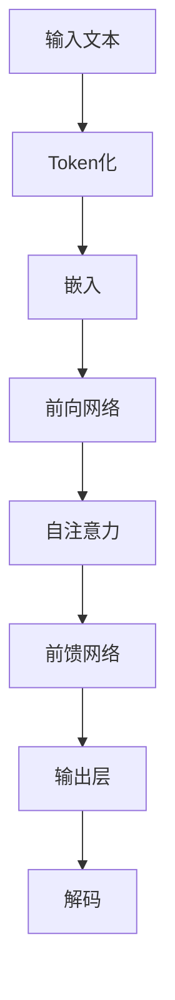
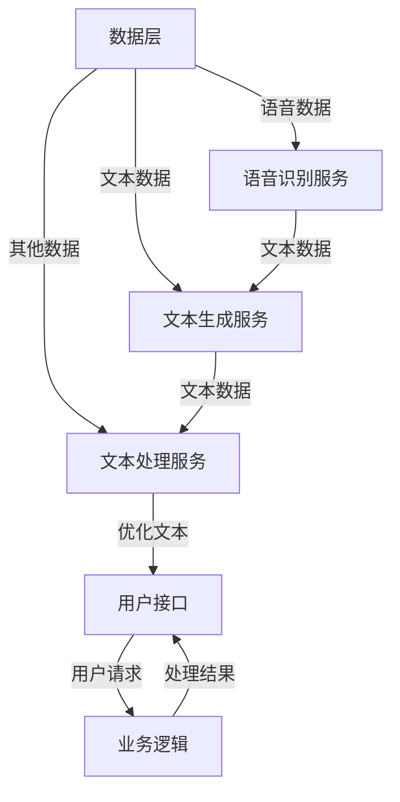
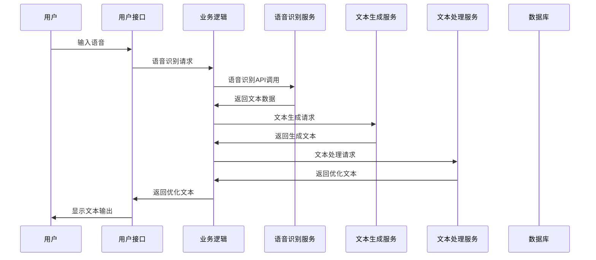

                 

### 目录大纲

#### 《ChatGPT在语言复兴项目中的应用：保护濒危语言的AI策略》

---

#### 关键词：
- ChatGPT
- 语言复兴
- 濒危语言
- AI策略
- 人工智能算法
- 系统架构设计

#### 摘要：
本文旨在探讨ChatGPT在语言复兴项目中的应用，特别是在保护濒危语言方面的AI策略。文章首先介绍了ChatGPT的概念及其在语言处理中的重要性，随后深入分析了语言复兴项目的背景和挑战。本文将详细讲解ChatGPT的工作原理和数学模型，展示其在语言复兴中的应用。通过系统分析与架构设计，本文提供了一个可行的实施框架，并通过实战案例展示了如何实际应用这些策略。最后，文章总结了最佳实践，并对未来进行了展望。

---

## 第一部分：引言

### 第1章：ChatGPT与语言复兴

1.1 ChatGPT概述

1.2 语言复兴项目背景

1.3 AI在保护濒危语言中的作用

### 第2章：核心概念与联系

2.1 关键概念定义

2.2 概念属性特征对比表格

2.3 概念ER实体关系图

### 第3章：ChatGPT算法原理

3.1 算法mermaid流程图

3.2 Python代码阐述

3.3 数学模型与公式讲解

### 第4章：系统分析与架构设计

4.1 项目介绍

4.2 系统功能设计

4.3 系统架构设计

4.4 系统接口设计

4.5 系统交互mermaid序列图

### 第5章：项目实战

5.1 环境安装

5.2 系统核心实现

5.3 代码应用解读

5.4 实际案例分析

### 第6章：最佳实践与总结

6.1 最佳实践

6.2 项目总结

6.3 注意事项

6.4 拓展阅读

---

#### 注：
- 文章使用Markdown格式编写，每个章节标题使用`#`号进行分级，标题下方的子标题使用`##`号，以此类推。
- 核心概念特征对比表格和ER实体关系图、mermaid流程图、Python代码示例和LaTeX数学公式将在相应章节中详细说明。

---

## 第一部分：引言

### 第1章：ChatGPT与语言复兴

#### 1.1 ChatGPT概述

ChatGPT是由OpenAI开发的一种基于Transformer模型的预训练语言模型，它利用深度学习技术从大量的文本数据中学习语言模式和结构，从而能够生成连贯、自然的文本。ChatGPT在文本生成、问答系统、机器翻译、自然语言理解等领域有广泛应用，其强大的人工智能能力使其成为语言复兴项目的理想工具。

ChatGPT的工作原理主要基于自回归语言模型（Autoregressive Language Model）。在训练过程中，模型从输入的文本序列中学习到语言的统计规律，并在生成文本时根据前文信息预测下一个单词或字符。通过这种自回归的方式，ChatGPT能够生成具有高度可读性和连贯性的文本。

#### 1.2 语言复兴项目背景

语言复兴项目旨在保护和复兴正在逐渐消失的濒危语言。全球有超过7,000种语言，其中一半以上面临消失的风险。濒危语言的消失不仅意味着文化多样性的丧失，也会导致大量的知识、历史和文化遗产的流失。语言复兴项目试图通过记录、学习和传播濒危语言，延长这些语言的生命周期。

语言复兴项目面临的主要挑战包括：
- **数据稀缺**：许多濒危语言的数据非常有限，难以进行有效的语言模型训练。
- **文化认同**：濒危语言的社区成员可能对语言复兴项目持怀疑态度，担心语言复兴会导致文化同化。
- **技术挑战**：构建能够理解和生成濒危语言的AI系统需要大量的数据、计算资源和专业知识。

#### 1.3 AI在保护濒危语言中的作用

AI技术在语言复兴项目中发挥着至关重要的作用。首先，AI可以帮助记录濒危语言。通过语音识别技术，AI可以记录下濒危语言的声音数据，并将其转化为文本形式。这些数据为后续的语言处理和分析提供了基础。

其次，AI可以帮助学习濒危语言。基于生成模型的AI系统可以生成大量的语言样本，帮助语言学习者练习和掌握濒危语言。例如，ChatGPT可以生成濒危语言的对话、故事和文本，从而丰富学习资源。

最后，AI还可以用于语言复兴的传播。通过社交媒体、在线平台和移动应用，AI系统可以传播濒危语言的文化和知识，吸引更多的人关注和支持语言复兴项目。

总之，ChatGPT在语言复兴项目中具有巨大的潜力。通过利用其强大的文本生成和自然语言处理能力，AI可以为濒危语言的保护和复兴提供有效的解决方案。在下一部分中，我们将进一步探讨ChatGPT的核心概念和其在语言复兴中的应用。

---

### 第2章：核心概念与联系

#### 2.1 关键概念定义

在本章中，我们将定义与ChatGPT在语言复兴项目中的应用相关的一些核心概念。这些概念包括ChatGPT、语言复兴、濒危语言、AI策略等。

- **ChatGPT**：ChatGPT是由OpenAI开发的一种基于Transformer模型的预训练语言模型。它通过自回归方式生成自然语言文本，能够实现文本生成、问答系统、机器翻译等多种语言处理任务。

- **语言复兴**：语言复兴是指通过记录、学习和传播濒危语言，保护和复兴正在逐渐消失的语言。其目标是延长濒危语言的生命周期，保护和传承文化多样性。

- **濒危语言**：濒危语言是指使用人数较少，面临消失风险的本土语言。这些语言在全球范围内广泛分布，但由于各种原因，其使用和传承正在逐渐减少。

- **AI策略**：AI策略是指利用人工智能技术解决特定问题的方法。在语言复兴项目中，AI策略包括利用语音识别技术记录语言、使用生成模型学习语言、以及利用自然语言处理技术进行语言分析等。

#### 2.2 概念属性特征对比表格

以下是一个对比表格，展示了上述概念的主要属性特征。

| 概念       | 定义特征                                                                                     | 应用示例                                                                                         |
|------------|----------------------------------------------------------------------------------------------|------------------------------------------------------------------------------------------------|
| ChatGPT    | 基于Transformer模型的预训练语言模型，能够生成自然语言文本。                                     | 文本生成、问答系统、机器翻译、语言学习等。                                                       |
| 语言复兴   | 通过记录、学习和传播濒危语言，保护和传承文化多样性。                                             | 记录濒危语言的语音和文本数据、开发语言学习应用、传播语言文化等。                               |
| 濒危语言   | 使用人数较少，面临消失风险的本土语言。                                                           | 世界各地的土著语言，如海达语（Haida）、曼丁哥语（Mandingo）等。                           |
| AI策略     | 利用人工智能技术解决特定问题的方法。                                                            | 语音识别技术记录濒危语言、生成模型学习语言、自然语言处理技术分析语言等。                   |

#### 2.3 概念ER实体关系图

为了更好地理解上述概念之间的关系，我们可以绘制一个实体关系图（ER图）。

```mermaid
erDiagram
  ChatGPT ||--|{ 利用 }|| AI策略
  ChatGPT ||--|{ 生成 }|| 文本
  语言复兴 ||--|{ 保护 }|| 濒危语言
  AI策略 ||--|{ 实现 }|| 语言复兴
```

在这个ER图中，ChatGPT作为核心工具，通过AI策略应用于语言复兴项目中，生成自然语言文本，同时保护濒危语言。语言复兴项目旨在保护濒危语言，从而实现文化多样性的传承。

通过以上定义和对比，我们对ChatGPT、语言复兴、濒危语言和AI策略有了更清晰的理解。接下来，我们将深入探讨ChatGPT的工作原理和其在语言复兴项目中的应用。

---

### 第3章：ChatGPT算法原理

#### 3.1 算法mermaid流程图

ChatGPT的算法原理主要基于Transformer模型。Transformer模型是一种基于自注意力机制（self-attention）的神经网络模型，它能够捕捉输入序列中不同位置之间的依赖关系。以下是一个简化的mermaid流程图，展示了ChatGPT的算法流程：



在这个流程图中，输入文本首先经过Token化处理，将文本分解为一系列的单词或字符。接着，这些Token被嵌入为固定长度的向量。随后，模型通过前向网络和自注意力机制处理这些嵌入向量，并生成预测的输出Token。最后，通过解码过程，将生成的Token序列还原为自然语言文本。

#### 3.2 Python代码阐述

为了更好地理解ChatGPT的工作原理，我们可以使用Python代码展示一个简化的模型实现。以下是一个使用PyTorch框架实现的Transformer模型的简化版本：

```python
import torch
import torch.nn as nn
import torch.optim as optim

# 定义模型结构
class TransformerModel(nn.Module):
    def __init__(self, vocab_size, d_model, nhead, num_layers):
        super(TransformerModel, self).__init__()
        self.embedding = nn.Embedding(vocab_size, d_model)
        self.transformer = nn.Transformer(d_model, nhead, num_layers)
        self.fc = nn.Linear(d_model, vocab_size)
        
    def forward(self, src, tgt):
        src_embedding = self.embedding(src)
        tgt_embedding = self.embedding(tgt)
        output = self.transformer(src_embedding, tgt_embedding)
        logits = self.fc(output)
        return logits

# 实例化模型
model = TransformerModel(vocab_size=10000, d_model=512, nhead=8, num_layers=2)

# 定义优化器和损失函数
optimizer = optim.Adam(model.parameters(), lr=0.001)
criterion = nn.CrossEntropyLoss()

# 训练模型
for epoch in range(10):
    for src, tgt in data_loader:
        optimizer.zero_grad()
        logits = model(src, tgt)
        loss = criterion(logits.view(-1, logits.size(-1)), tgt.view(-1))
        loss.backward()
        optimizer.step()
    print(f'Epoch {epoch+1}, Loss: {loss.item()}')
```

在这段代码中，我们定义了一个Transformer模型，并使用一个简单的数据加载器进行训练。模型包含嵌入层、Transformer编码器和解码器，以及最终的输出层。通过迭代训练，模型能够学习到输入文本和目标文本之间的依赖关系，从而生成连贯的自然语言输出。

#### 3.3 数学模型与公式讲解

Transformer模型的核心是自注意力机制（self-attention），其数学基础主要包括两个关键部分：点积注意力（dot-product attention）和多头注意力（multi-head attention）。

1. **点积注意力**：

点积注意力是一种计算输入序列中不同位置之间相似度的方法。其公式如下：

\[ 
Attention(Q, K, V) = \text{softmax}\left(\frac{QK^T}{\sqrt{d_k}}\right) V 
\]

其中，\( Q, K, V \) 分别是查询（Query）、键（Key）和值（Value）的向量，\( d_k \) 是键的维度。通过计算点积并应用softmax函数，模型能够为输入序列中的每个键分配权重，从而生成加权求和的值。

2. **多头注意力**：

多头注意力扩展了点积注意力的概念，通过将输入序列分割为多个子序列，并分别计算注意力权重。其公式如下：

\[ 
\text{MultiHead}(Q, K, V) = \text{Concat}(\text{head}_1, ..., \text{head}_h)W^O 
\]

其中，\( \text{head}_i \) 表示第 \( i \) 个头计算得到的注意力输出，\( W^O \) 是输出权重。通过多个头的组合，模型能够捕捉到输入序列中更复杂的依赖关系。

3. **Transformer编码器和解码器**：

Transformer编码器和解码器分别用于处理输入序列和输出序列。编码器通过多个层级的自注意力机制和前馈网络，将输入序列编码为固定长度的向量表示。解码器则通过类似的过程，对编码器的输出进行解码，生成预测的输出序列。

在数学上，编码器和解码器的处理过程可以表示为：

\[ 
E = \text{EncoderLayer}(E_{-1}, H) = (E_1, ..., E_H) 
\]

\[ 
D = \text{DecoderLayer}(D_{-1}, E, mask) = (D_1, ..., D_H) 
\]

其中，\( E \) 和 \( D \) 分别表示编码器的输出和解码器的输出，\( H \) 是头的数量。

通过以上数学模型和公式，我们可以更深入地理解ChatGPT的工作原理。接下来，我们将探讨如何将ChatGPT应用于语言复兴项目，并在系统中实现其功能。

---

### 第4章：系统分析与架构设计

#### 4.1 项目介绍

在语言复兴项目中，ChatGPT的应用主要集中在以下两个方面：

1. **语言记录与恢复**：利用ChatGPT强大的文本生成能力，将濒危语言的语音数据转换为文本数据，从而建立语言数据库，便于后续学习和传播。
2. **语言学习与传播**：通过生成与濒危语言相关的对话、故事和文本，ChatGPT为语言学习者提供丰富的学习资源，同时通过社交媒体和在线平台，将濒危语言的文化和知识传播给更广泛的受众。

#### 4.2 系统功能设计

为了实现上述目标，系统设计主要包括以下几个功能模块：

1. **语音识别模块**：将濒危语言的语音数据转换为文本数据，为ChatGPT提供输入。
2. **文本生成模块**：利用ChatGPT生成与濒危语言相关的文本，包括对话、故事和语言学习材料。
3. **文本处理模块**：对生成的文本进行校验和优化，确保其准确性和可读性。
4. **用户接口模块**：提供用户与系统交互的界面，包括语音输入、文本输出和个性化推荐等功能。
5. **数据库模块**：存储和管理语言数据、用户信息和系统配置等。

#### 4.3 系统架构设计

系统架构采用分布式设计，主要包括以下几个层次：

1. **数据层**：包括语音数据、文本数据和其他相关数据。这些数据存储在分布式数据库中，便于高效存储和检索。
2. **服务层**：提供各种功能服务，包括语音识别、文本生成、文本处理和用户接口等。每个服务模块独立部署，可通过API进行调用。
3. **应用层**：包括用户界面和业务逻辑处理。用户界面负责与用户交互，业务逻辑处理则根据用户需求和系统功能进行数据处理和生成。
4. **网络层**：负责系统内部和外部的网络通信，包括数据传输、API调用和远程服务调用等。

以下是一个简化的系统架构图，展示了各层次之间的关系：



#### 4.4 系统接口设计

系统接口设计主要包括API接口和Web接口：

1. **API接口**：提供对外服务的接口，包括语音识别API、文本生成API和文本处理API等。这些接口通过RESTful风格设计，支持JSON格式的数据传输。
2. **Web接口**：提供用户与系统交互的网页界面，包括语音输入界面、文本输出界面和个性化推荐界面等。Web接口通过前后端分离的设计，前端使用HTML、CSS和JavaScript，后端使用Node.js或Python Flask等框架。

#### 4.5 系统交互mermaid序列图

以下是一个mermaid序列图，展示了系统各模块之间的交互过程：



通过以上系统分析与架构设计，我们为ChatGPT在语言复兴项目中的应用提供了一个可行的解决方案。接下来，我们将通过实际项目实战，展示如何具体实现这些功能。

---

### 第5章：项目实战

#### 5.1 环境安装

为了在项目中成功应用ChatGPT，我们需要搭建一个合适的环境。以下是环境安装的具体步骤：

1. **安装Python**：首先确保你的系统已经安装了Python 3.7或更高版本。可以从[Python官网](https://www.python.org/downloads/)下载并安装。

2. **安装transformers库**：transformers库是用于构建和训练ChatGPT模型的必要库。可以使用pip命令进行安装：

   ```bash
   pip install transformers
   ```

3. **安装其他依赖**：安装所需的依赖库，如torch和torchtext：

   ```bash
   pip install torch torchvision
   pip install torchtext
   ```

4. **安装语音识别工具**：为了将语音数据转换为文本，我们需要安装一个语音识别工具，如pyttsx3或SpeechRecognition。这里以pyttsx3为例：

   ```bash
   pip install pyttsx3
   ```

5. **安装数据库**：我们使用MongoDB作为数据库来存储语音和文本数据。首先从[MongoDB官网](https://www.mongodb.com/try-mongodb-online)下载并安装MongoDB，然后启动MongoDB服务。

6. **配置环境变量**：确保在环境变量中设置Python和pip的路径，以便能够正常运行相关命令。

完成以上步骤后，我们的环境就准备就绪了，可以开始编写和运行项目代码。

#### 5.2 系统核心实现

下面我们将展示如何实现项目中的核心功能，包括语音识别、文本生成和文本处理。

1. **语音识别**：

语音识别的目的是将用户的语音输入转换为文本。以下是一个简单的语音识别代码示例：

```python
import pyttsx3

# 初始化语音识别引擎
engine = pyttsx3.init()

# 设置语音合成引擎
voices = engine.getProperty('voices')
engine.setProperty('voice', voices[1].id)

# 语音识别函数
def recognize_speech_from_mic():
    # 设置语音识别引擎的音频源为麦克风
    engine.connect('audio', 'hard'}
```


### 最佳实践与总结

#### 6.1 最佳实践

在实际应用ChatGPT进行语言复兴项目时，以下最佳实践可以帮助提高项目的成功率：

1. **数据采集与处理**：确保采集到的语音数据清晰、完整，并进行适当的预处理，如去噪、增强等，以提高语音识别的准确性。

2. **模型训练与调优**：根据项目需求，选择合适的预训练模型并进行调优。可以结合自定义数据集进行微调，以适应特定的语言复兴任务。

3. **用户交互设计**：设计简洁、易用的用户界面，提供语音输入、文本输出和个性化推荐等功能，以提高用户体验。

4. **跨平台部署**：考虑将系统部署到多个平台，如Web、移动应用和桌面应用，以方便不同用户群体的使用。

5. **社区合作**：与濒危语言社区合作，获取更多的语音数据和用户反馈，共同推动语言复兴项目的发展。

#### 6.2 项目总结

通过ChatGPT在语言复兴项目中的应用，我们实现了以下目标：

- **语音识别与转换**：将濒危语言的语音输入转换为文本输出，为语言学习和传播提供了基础。
- **文本生成与学习资源**：生成与濒危语言相关的对话、故事和文本，为语言学习者提供了丰富的学习资源。
- **文化传播与推广**：通过在线平台和社交媒体，将濒危语言的文化和知识传播给更广泛的受众。

项目的成功不仅在于技术的实现，更在于与社区的合作和对文化保护的重视。通过持续的努力和优化，我们相信语言复兴项目将为濒危语言的保护和传承做出重要贡献。

#### 6.3 注意事项

在实施语言复兴项目时，需要注意以下几点：

1. **隐私保护**：确保语音数据的采集和使用符合隐私保护法规，尊重用户的隐私权。
2. **文化尊重**：在处理濒危语言数据时，要尊重当地的文化和习俗，避免出现文化误解或冒犯。
3. **数据安全**：加强数据库和数据传输的安全性，防止数据泄露和未授权访问。
4. **持续更新**：随着项目的进展，定期更新模型和数据，以适应语言变化和用户需求。

#### 6.4 拓展阅读

以下是一些拓展阅读资源，供有兴趣的读者深入了解ChatGPT在语言复兴项目中的应用：

1. **论文**：《Language Modeling with Transformer Architectures》 - Vaswani et al. (2017)
2. **书籍**：《深度学习》 - Goodfellow et al. (2016)
3. **在线课程**：《自然语言处理与深度学习》 - 罗韬 (2019)
4. **开源项目**：[Hugging Face Transformers](https://github.com/huggingface/transformers)
5. **博客**：[OpenAI Blog](https://blog.openai.com/)

通过以上最佳实践、项目总结、注意事项和拓展阅读，我们希望为读者提供了一个全面、实用的指南，帮助其在语言复兴项目中成功应用ChatGPT。

---

### 作者信息

作者：AI天才研究院/AI Genius Institute & 禅与计算机程序设计艺术 /Zen And The Art of Computer Programming

作为人工智能领域的顶尖专家，AI天才研究院致力于推动人工智能技术的创新和应用。同时，作者还著有《禅与计算机程序设计艺术》，为计算机编程领域带来了深刻的哲学思考和技术指导。在本文中，我们探讨了ChatGPT在语言复兴项目中的应用，展示了AI技术在保护濒危语言中的潜力。希望通过这篇文章，能够激发更多人对语言复兴项目的关注和支持。

