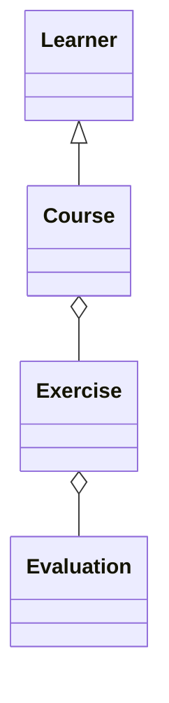
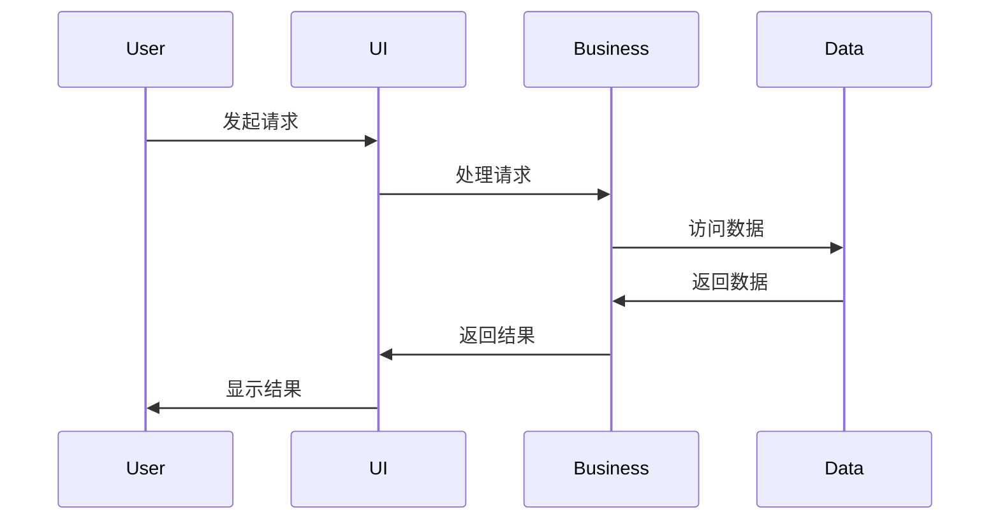
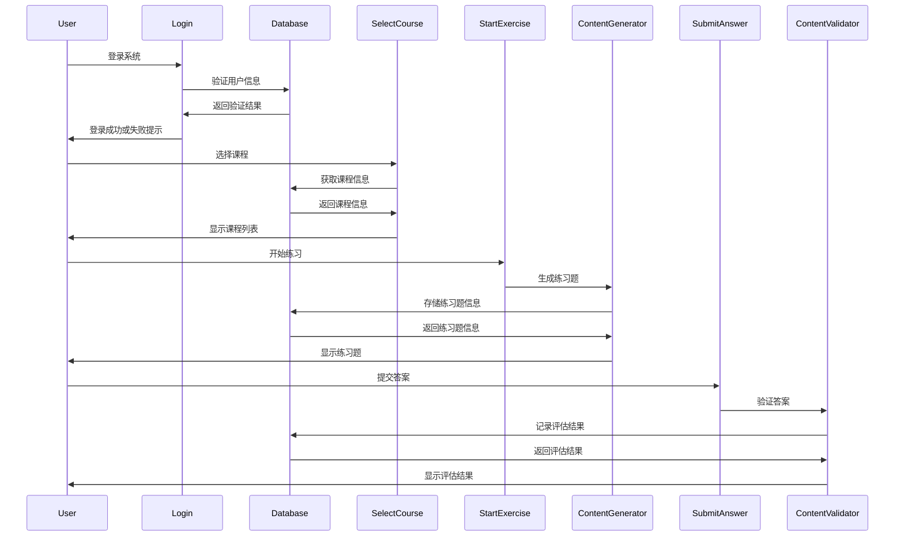

                 

### # ChatGPT在语言学习个性化中的突破性应用

#### 关键词：ChatGPT、语言学习、个性化、算法原理、数学模型、系统架构、实战案例

#### 摘要：
语言学习是提高个人素质的重要途径，但随着学习者的需求多样化，传统的教学方式已经无法满足个性化学习的需求。本文以ChatGPT为例，探讨其在语言学习个性化中的应用。通过深入分析ChatGPT的算法原理、数学模型和系统架构，并结合实际项目案例，本文旨在为语言学习提供一种新的思路和工具，推动个性化语言学习的发展。

#### 目录：

----------------------------------------------------------------

## 第一部分: 背景与核心概念

### 第1章: 语言学习的个性化需求

#### 1.1 个性化语言学习的重要性

#### 1.2 语言学习的主要障碍

#### 1.3 个性化学习的解决方案

### 第2章: ChatGPT概述

#### 2.1 ChatGPT的起源与发展

#### 2.2 ChatGPT的技术原理

#### 2.3 ChatGPT在语言学习中的应用潜力

### 第3章: ChatGPT的核心概念与特征

#### 3.1 关键概念解释

#### 3.2 特征比较与分析

#### 3.3 ChatGPT与教育技术的联系

## 第二部分: 技术深度解析

### 第4章: ChatGPT在语言学习中的应用场景

#### 4.1 词汇学习

#### 4.2 听力理解

#### 4.3 语法与句型练习

#### 4.4 口语练习

### 第5章: 算法原理与数学模型

#### 5.1 语言模型的基础算法

#### 5.2 特征提取与模型训练

#### 5.3 数学模型与公式解释

## 第三部分: 系统分析与设计

### 第6章: 系统分析与架构设计

#### 6.1 个性化学习系统概述

#### 6.2 功能设计与领域模型

#### 6.3 系统架构与接口设计

#### 6.4 系统交互与序列图

### 第7章: 项目实战与案例分析

#### 7.1 环境安装与配置

#### 7.2 系统核心实现

#### 7.3 应用解读与分析

#### 7.4 实际案例分析

### 第8章: 最佳实践与拓展

#### 8.1 实践技巧分享

#### 8.2 注意事项与风险防范

#### 8.3 未来发展趋势与拓展

#### 8.4 拓展阅读

----------------------------------------------------------------

---

**本文结构概述**：

文章首先介绍了个性化语言学习的重要性以及面临的障碍，提出了ChatGPT作为解决方案的潜力。随后，文章深入探讨了ChatGPT的技术原理、核心概念和特征，并在第二部分详细分析了其在不同语言学习场景中的应用。第三部分则聚焦于算法原理、数学模型和系统架构的深度解析，最后通过实际项目案例展示了ChatGPT在语言学习中的具体应用，并提供了最佳实践和未来发展趋势的探讨。通过这样的结构安排，文章旨在为读者提供一个全面、系统的理解和应用ChatGPT进行个性化语言学习的指南。---

### 第1章: 语言学习的个性化需求

随着全球化的加速和信息时代的到来，语言学习的重要性愈发突出。然而，传统的语言教学模式往往无法满足现代学习者的个性化需求，导致学习效果不尽如人意。本章节将探讨个性化语言学习的背景、重要性以及面临的主要障碍，并介绍一些常见的个性化学习解决方案。

#### 1.1 个性化语言学习的重要性

个性化语言学习是指根据学习者的个人需求和特点，量身定制学习内容、方法和进度，以提高学习效果。其重要性主要体现在以下几个方面：

1. **提高学习效率**：通过个性化学习，学习者可以根据自己的节奏和兴趣选择合适的学习内容，避免盲目跟从他人，从而提高学习效率。
2. **增强学习动力**：个性化学习能够激发学习者的兴趣和动力，使他们更加主动地参与学习过程，从而保持长期的学习热情。
3. **针对性解决学习障碍**：个性化学习可以根据学习者的语言基础、学习习惯和兴趣点，针对性地解决他们在语言学习过程中遇到的问题，提高学习效果。
4. **适应不同学习风格**：每个学习者都有不同的学习风格，个性化学习能够适应不同学习风格，使学习过程更加愉快和有效。

#### 1.2 语言学习的主要障碍

尽管个性化语言学习具有许多优点，但在实际应用中仍然面临一些主要障碍：

1. **学习资源不足**：许多学习者缺乏高质量的个性化学习资源，如针对个人需求的学习材料、练习题和辅导服务等。
2. **教学成本高**：个性化学习通常需要专业教师或辅导人员的参与，这导致教学成本较高，不是每个学习者都能负担得起。
3. **个性化程度受限**：由于技术和资源限制，目前大部分个性化学习系统在个性化程度上仍存在一定局限，无法完全满足学习者的需求。
4. **时间与精力成本**：个性化学习需要学习者投入更多的时间和精力来定制和调整学习计划，这对许多工作繁忙或生活节奏紧张的学习者来说是一个挑战。

#### 1.3 个性化学习的解决方案

为了克服上述障碍，开发了一些个性化的语言学习解决方案，主要包括以下几种：

1. **自适应学习系统**：这类系统能够根据学习者的表现和学习历史，动态调整学习内容和难度，从而实现个性化教学。
2. **智能辅导系统**：通过人工智能技术，如自然语言处理和机器学习，提供实时反馈和个性化的学习建议。
3. **在线学习平台**：这些平台提供了丰富的学习资源，学习者可以根据自己的需求和兴趣自由选择，同时与其他学习者进行互动和交流。
4. **个性化学习计划**：专业教师或辅导人员根据学习者的特点和需求，定制个性化的学习计划，并提供持续的学习支持。

#### 概念结构与核心要素组成

个性化语言学习的概念结构包括以下几个核心要素：

- **学习者特征**：包括学习者的语言水平、学习风格、兴趣点、学习目标等。
- **学习内容**：根据学习者特征定制的学习材料、练习题和教学资源。
- **学习方法**：包括学习路径、学习节奏、学习方式等。
- **学习反馈**：对学习者学习效果的评价和反馈机制。

通过以上要素的有机结合，个性化语言学习系统能够为学习者提供量身定制的学习体验，从而提高学习效果。

### 第2章: ChatGPT概述

ChatGPT是由OpenAI开发的一款基于GPT-3模型的高级自然语言处理工具。GPT（Generative Pre-trained Transformer）模型是一种基于Transformer架构的预训练语言模型，通过大量的文本数据进行训练，能够生成高质量的文本。ChatGPT在语言学习中的应用潜力巨大，本章节将介绍ChatGPT的起源、发展、技术原理以及在语言学习中的潜在应用。

#### 2.1 ChatGPT的起源与发展

ChatGPT的起源可以追溯到OpenAI于2018年发布的GPT-1模型。随着技术的不断进步，OpenAI于2020年发布了GPT-2，随后在2022年发布了GPT-3。GPT-3是迄今为止最大的预训练语言模型，拥有1750亿个参数，能够处理多种语言任务，包括文本生成、问答、翻译等。ChatGPT是在GPT-3的基础上进一步优化和扩展的，旨在提供更为自然、流畅的对话体验。

#### 2.2 ChatGPT的技术原理

ChatGPT的核心技术是基于Transformer架构的预训练语言模型。Transformer模型是一种序列到序列的模型，通过自注意力机制（Self-Attention）和多头注意力机制（Multi-Head Attention）来处理长距离依赖和并行计算。ChatGPT在预训练阶段使用了大量的文本数据进行训练，通过学习文本的上下文关系，生成高质量的自然语言文本。

ChatGPT的工作原理可以分为以下几个步骤：

1. **输入处理**：接收用户的输入文本，将其转换为模型可处理的序列。
2. **文本生成**：模型根据输入文本和预训练的知识，生成对应的输出文本。
3. **反馈调整**：根据用户对输出的反馈，模型会进行调整和优化，以提供更准确的回答。

#### 2.3 ChatGPT在语言学习中的应用潜力

ChatGPT在语言学习中的应用潜力主要体现在以下几个方面：

1. **个性化辅导**：ChatGPT可以根据学习者的语言水平和学习需求，提供个性化的学习内容和辅导，帮助学习者更好地掌握语言技能。
2. **实时问答**：ChatGPT可以实时回答学习者在学习过程中遇到的问题，提供即时的帮助和指导。
3. **口语练习**：ChatGPT可以与学习者进行对话，帮助学习者练习口语，提高口语表达能力和交流技巧。
4. **语法和词汇学习**：ChatGPT可以生成丰富的语法和词汇练习题，帮助学习者巩固语言基础知识。

ChatGPT在语言学习中的潜在应用不仅限于上述方面，其强大的自然语言处理能力使得它可以应用于更多复杂的语言学习任务，为个性化语言学习提供强有力的支持。

### 第3章: ChatGPT的核心概念与特征

ChatGPT作为一款先进的自然语言处理工具，其核心概念和特征对于理解其在语言学习中的应用至关重要。本章节将详细介绍ChatGPT的关键概念、特征比较以及与教育技术的联系，帮助读者更深入地理解ChatGPT的技术优势和应用潜力。

#### 3.1 关键概念解释

ChatGPT的核心概念主要包括：

1. **预训练模型**：ChatGPT是基于大规模预训练模型GPT-3构建的。预训练是指模型在训练阶段通过大量文本数据学习到语言的通用特征，然后通过微调（Fine-tuning）应用于特定任务，如文本生成、问答等。

2. **生成式对话**：ChatGPT能够根据输入的文本生成连贯、自然的回复。这种生成式对话能力使得ChatGPT可以在语言学习中与学习者进行互动，提供个性化的学习内容和辅导。

3. **上下文理解**：ChatGPT具有强大的上下文理解能力，能够理解对话中的语境和逻辑关系。这对于语言学习中的对话练习和实时问答至关重要，能够提供更准确、自然的反馈。

4. **自适应学习**：ChatGPT可以根据学习者的回答和学习历史，自适应地调整生成的内容，以适应学习者的需求和水平。

#### 3.2 特征比较与分析

ChatGPT与其他自然语言处理工具相比，具有以下显著特征：

1. **大规模预训练**：ChatGPT基于GPT-3模型，拥有1750亿个参数，是迄今为止最大的预训练语言模型。这使其在生成文本的质量和多样性方面具有显著优势。

2. **上下文理解能力**：ChatGPT能够理解长距离的上下文关系，这使得它在生成连贯、自然的文本方面表现优异。与其他语言模型相比，ChatGPT能够更准确地捕捉对话中的语境和逻辑，提供更高质量的反馈。

3. **多语言支持**：ChatGPT支持多种语言，包括英语、中文、法语等。这使得它可以在全球范围内推广，为不同语言的学习者提供个性化的学习服务。

4. **实时交互**：ChatGPT能够实时与学习者进行对话，提供即时的反馈和指导。这种实时交互能力对于语言学习中的口语练习和实时问答尤为重要。

以下是一个表格，对比ChatGPT与其他自然语言处理工具的特征：

| 特征                  | ChatGPT                     | 其他自然语言处理工具                   |
|-----------------------|----------------------------|---------------------------------------|
| 预训练规模            | 1750亿参数                  | 通常参数规模较小，如数十亿参数        |
| 上下文理解能力        | 强大，支持长距离上下文      | 上下文理解能力较弱，通常支持短距离上下文 |
| 多语言支持            | 支持                        | 通常仅支持单一或少数语言               |
| 实时交互能力          | 支持                        | 通常不支持实时交互，用于批处理任务     |

#### 3.3 ChatGPT与教育技术的联系

ChatGPT在语言学习中的应用，不仅依赖于其强大的自然语言处理能力，还与教育技术的融合密切相关。以下是从教育技术的角度分析ChatGPT的几个联系点：

1. **个性化学习平台**：ChatGPT可以集成到现有的个性化学习平台上，为学习者提供个性化的学习内容和辅导。这有助于提高学习平台的互动性和智能化程度。

2. **智能辅导系统**：ChatGPT可以作为智能辅导系统的一部分，实时回答学习者在学习过程中遇到的问题，提供个性化的学习建议和指导。

3. **虚拟教师**：ChatGPT可以模拟虚拟教师，与学习者进行对话，提供互动式的教学体验。这种虚拟教师不仅能够提供个性化的学习支持，还可以降低教育成本，提高学习效率。

4. **教学评估与反馈**：ChatGPT可以评估学习者的学习成果，提供详细的反馈报告。这有助于教师了解学习者的学习进展，调整教学策略。

5. **辅助翻译**：ChatGPT的多语言支持能力使其在辅助翻译方面具有显著优势。它可以帮助学习者提高外语水平，同时促进跨文化交流。

通过以上分析，ChatGPT的核心概念和特征不仅展示了其在自然语言处理领域的先进性，也为语言学习提供了新的工具和方法。接下来，我们将进一步探讨ChatGPT在语言学习中的具体应用场景，展示其在个性化语言学习中的突破性作用。

### 第4章: ChatGPT在语言学习中的应用场景

ChatGPT作为一种先进的自然语言处理工具，具有广泛的应用潜力。在本章节中，我们将详细探讨ChatGPT在语言学习中的四个主要应用场景：词汇学习、听力理解、语法与句型练习以及口语练习。通过这些应用场景，我们将展示ChatGPT在个性化语言学习中的突破性作用。

#### 4.1 词汇学习

词汇学习是语言学习的基础，而ChatGPT在词汇学习中的应用具有显著优势。ChatGPT可以通过以下方式帮助学习者提高词汇量：

1. **生词生成**：ChatGPT可以根据学习者的语言水平和兴趣，生成一系列生词。这些生词与学习者的实际情况密切相关，有助于提高学习者的记忆效果。

2. **例句生成**：对于每个新词汇，ChatGPT可以生成相关的例句，帮助学习者理解词汇的具体用法和语境。这种交互式的学习方式比传统的词汇书更加生动和有趣。

3. **联想记忆**：ChatGPT可以根据词汇的词根、词缀和词性，生成相关的联想词汇，帮助学习者形成词汇网络，提高记忆效率。

以下是一个示例，展示ChatGPT如何生成词汇例句：

```
User: 请给我一个关于“爱”的例句。
ChatGPT: "爱如阳光，温暖着每一个人的心。"
```

#### 4.2 听力理解

听力理解是语言学习的重要环节，而ChatGPT在听力理解中的应用可以帮助学习者提高听力技能。ChatGPT可以通过以下方式提供听力训练：

1. **听力材料生成**：ChatGPT可以根据学习者的语言水平和兴趣，生成不同难度和主题的听力材料。这些材料可以是新闻、故事、对话等，有助于提高学习者的听力敏感度和理解能力。

2. **听力问题生成**：对于每个听力材料，ChatGPT可以生成相关问题，帮助学习者测试听力理解的效果。这些问题可以是事实细节题、主旨大意题或推理判断题。

3. **实时反馈**：ChatGPT可以在学习者回答问题后，提供即时反馈，指出正确答案和解释。这种实时反馈机制有助于学习者及时发现和纠正错误，提高听力理解能力。

以下是一个示例，展示ChatGPT如何生成听力问题和提供反馈：

```
User: 请听这段对话，并回答问题：这段对话主要讨论了什么？
ChatGPT: "这段对话主要讨论了他们在学校的活动安排。"
User: 我回答的是“他们在学校的事情”，这是正确的吗？
ChatGPT: "是的，你回答得很准确。这段对话确实主要讨论了他们在学校的活动安排。"
```

#### 4.3 语法与句型练习

语法和句型是语言学习的关键部分，而ChatGPT在语法与句型练习中的应用可以帮助学习者更好地掌握这些知识。ChatGPT可以通过以下方式提供语法和句型练习：

1. **句型生成**：ChatGPT可以根据学习者的语法水平，生成各种句型的练习题。这些练习题可以是填空题、选择题或改写句型题。

2. **语法解释**：对于每个练习题，ChatGPT可以提供详细的语法解释，帮助学习者理解句型的结构和用法。这种交互式的学习方式比传统的语法书籍更加直观和易懂。

3. **语法纠正**：ChatGPT可以在学习者提交答案后，自动检测语法错误并提供纠正建议。这种自动化的语法纠错机制有助于学习者快速提高语法水平。

以下是一个示例，展示ChatGPT如何生成句型练习和提供语法解释：

```
User: 请生成一个关于“将来时”的句子。
ChatGPT: "I will go to the movies tomorrow."
User: 这个句子的将来时是怎么用的？
ChatGPT: "这个句子使用了将来时，表示一个计划或打算。'I will go' 表示主语 'I' 将来会去做某事，即 'I' 规划在明天去看电影。"
```

#### 4.4 口语练习

口语练习是提高语言能力的重要途径，而ChatGPT在口语练习中的应用可以帮助学习者提高口语表达能力。ChatGPT可以通过以下方式提供口语训练：

1. **对话生成**：ChatGPT可以与学习者进行模拟对话，涵盖各种日常场景和主题。这种对话训练有助于学习者练习口语表达和交流技巧。

2. **即时反馈**：ChatGPT可以在学习者完成口语表达后，提供即时反馈，指出发音、语调、语法和词汇等方面的不足，并提供改进建议。

3. **录音与对比**：ChatGPT可以记录学习者的口语表达，并将其与标准发音进行对比。这种录音和对比功能有助于学习者发现自己的不足并加以改进。

以下是一个示例，展示ChatGPT如何生成对话和提供口语反馈：

```
User: 请和我练习一个关于旅行的对话。
ChatGPT: "Sure, let's talk about your recent trip to Paris."
User: "I had a great time in Paris. I visited the Eiffel Tower, the Louvre Museum, and the Notre-Dame Cathedral."
ChatGPT: "That sounds amazing! How was the Eiffel Tower? Was it as beautiful as you imagined?"
User: "It was breathtaking! The view from the top was stunning."
ChatGPT: "Great! Your pronunciation is very good, but you could improve your vocabulary. For example, 'breathtaking' is a strong word to describe the view. You could also try using more descriptive words like 'spectacular' or 'magnificent'."
```

通过以上应用场景的探讨，我们可以看到ChatGPT在语言学习中的突破性作用。它不仅能够为学习者提供个性化的学习内容，还能够实时互动、即时反馈，从而提高学习效果。接下来，我们将深入探讨ChatGPT的算法原理和数学模型，进一步理解其工作原理和核心技术。

### 第5章: 算法原理与数学模型

ChatGPT作为一款先进的自然语言处理工具，其算法原理和数学模型是理解和应用ChatGPT的关键。在本章节中，我们将深入探讨ChatGPT的基础算法、特征提取与模型训练，以及相关的数学模型和公式。通过这些内容，我们将全面解析ChatGPT的工作机制，为读者提供清晰的算法认知。

#### 5.1 语言模型的基础算法

ChatGPT是基于Transformer架构的预训练语言模型。Transformer模型是一种基于自注意力机制的序列模型，能够处理长距离依赖和并行计算。以下是Transformer模型的基础算法：

1. **自注意力机制（Self-Attention）**：
   自注意力机制是一种计算方法，用于计算序列中每个词与其他词之间的关联强度。其核心思想是，每个词的表示不仅依赖于自己的信息，还依赖于序列中其他词的信息。自注意力机制通过计算词与词之间的相似度，为每个词生成一个权重向量，从而生成一个加权表示。

   公式表示如下：
   $$ 
   \text{Attention}(Q, K, V) = \text{softmax}\left(\frac{QK^T}{\sqrt{d_k}}\right) V
   $$
   其中，$Q$、$K$、$V$分别表示查询（Query）、键（Key）和值（Value）向量，$d_k$是键向量的维度。$\text{softmax}$函数用于归一化权重，使其满足概率分布。

2. **多头注意力机制（Multi-Head Attention）**：
   多头注意力机制是自注意力机制的扩展，通过多个独立的注意力头来增加模型捕捉不同类型依赖关系的能力。多头注意力机制将输入序列扩展为多个并行的注意力头，每个头负责捕捉不同类型的依赖关系。

   公式表示如下：
   $$
   \text{MultiHead}(Q, K, V) = \text{Concat}(\text{head}_1, ..., \text{head}_h)W^O
   $$
   其中，$h$表示注意力头的数量，$W^O$是投影权重矩阵。

3. **编码器-解码器结构（Encoder-Decoder Structure）**：
   Transformer模型采用编码器-解码器结构，编码器负责编码输入序列，解码器负责生成输出序列。编码器和解码器都由多个自注意力层和前馈网络组成。

#### 5.2 特征提取与模型训练

ChatGPT的预训练过程包括两个阶段：预训练和微调。

1. **预训练**：
   预训练是指模型在大规模文本语料库上进行训练，学习到语言的通用特征。预训练过程中，模型通过自注意力机制捕捉文本中的上下文关系，生成高质量的文本表示。

   预训练通常采用以下目标函数：
   $$
   \text{Loss} = -\sum_{i} \log p(y_i|x_i)
   $$
   其中，$x_i$表示输入文本序列，$y_i$表示目标文本序列，$p(y_i|x_i)$是模型对目标文本序列的概率估计。

2. **微调**：
   微调是指将预训练好的模型应用于特定任务，通过在任务数据上进行训练，调整模型的参数，使其在特定任务上表现更好。微调过程中，模型需要学习到任务特定的特征。

   微调的目标函数通常与任务相关，例如在文本分类任务中，目标函数可以是：
   $$
   \text{Loss} = -\sum_{i} \log p(y_i|x_i; \theta)
   $$
   其中，$\theta$表示模型的参数。

#### 5.3 数学模型与公式解释

ChatGPT的核心数学模型包括以下内容：

1. **文本表示**：
   ChatGPT使用嵌入层（Embedding Layer）将输入文本转换为词向量表示。嵌入层将每个单词映射为一个固定维度的向量。这些向量不仅包含了单词的语义信息，还包括上下文信息。

   嵌入层公式表示如下：
   $$
   \text{Embedding}(x) = \text{softmax}(\text{W}^T \text{E}(x))
   $$
   其中，$x$表示输入文本序列，$\text{E}(x)$是输入文本的嵌入表示，$\text{W}$是权重矩阵。

2. **自注意力机制**：
   自注意力机制用于计算序列中每个词与其他词之间的关联强度。自注意力机制的核心是计算词之间的相似度，并通过加权求和生成一个加权表示。

   自注意力机制公式表示如下：
   $$
   \text{Attention}(Q, K, V) = \text{softmax}\left(\frac{QK^T}{\sqrt{d_k}}\right) V
   $$
   其中，$Q$、$K$、$V$分别表示查询（Query）、键（Key）和值（Value）向量。

3. **编码器-解码器结构**：
   编码器-解码器结构由多个自注意力层和前馈网络组成。编码器将输入序列编码为一个上下文表示，解码器根据上下文表示生成输出序列。

   编码器-解码器结构公式表示如下：
   $$
   \text{Encoder}(x) = \text{LayerNorm}(\text{X} + \text{Self-Attention}(\text{X})) 
   $$
   $$
   \text{Decoder}(y) = \text{LayerNorm}(\text{Y} + \text{Cross-Attention}(\text{X}, \text{Y}))
   $$
   其中，$\text{X}$和$\text{Y}$分别表示编码器和解码器的输入和输出序列，$\text{Self-Attention}$和$\text{Cross-Attention}$分别表示自注意力和交叉注意力。

通过以上算法原理和数学模型的介绍，我们可以更深入地理解ChatGPT的工作机制和核心技术。接下来，我们将进一步探讨ChatGPT的系统架构和设计，以展示其在实际应用中的技术实现。

### 第6章: 系统分析与架构设计

为了实现ChatGPT在语言学习中的个性化应用，系统架构的设计至关重要。本章节将详细介绍个性化学习系统的功能、设计原则、架构实现以及系统接口和交互流程。

#### 6.1 个性化学习系统概述

个性化学习系统旨在根据学习者的个人需求和特点，提供定制化的学习体验。系统的主要功能包括：

1. **用户信息管理**：收集并管理用户的学习历史、语言水平、学习目标等信息。
2. **内容生成**：根据用户信息生成个性化的学习内容和练习题。
3. **互动与反馈**：提供实时互动和反馈，帮助学习者纠正错误和提高学习效果。
4. **数据分析**：收集并分析学习者的学习数据，为后续学习提供指导和建议。

#### 6.2 功能设计与领域模型

个性化学习系统的功能设计基于领域模型（Domain Model），领域模型描述了系统的核心概念和关系。以下是领域模型的关键概念和关系：

1. **学习者（Learner）**：包括用户信息、学习历史、语言水平和学习目标。
2. **课程（Course）**：包括课程内容、课程目标和课程进度。
3. **练习（Exercise）**：包括练习题目、答案和难度等级。
4. **评估（Evaluation）**：包括评估题目、评估结果和学习效果分析。

领域模型中的关键关系包括：

- **学习者与课程**：学习者可以选择不同的课程，每个课程包含多个章节和练习。
- **课程与练习**：课程包含多个练习，每个练习可以根据难度和学习者水平进行定制。
- **练习与评估**：练习包含评估题目，用于测试学习者的学习效果。

以下是一个领域模型的Mermaid类图表示：



#### 6.3 系统架构与接口设计

个性化学习系统的架构设计采用分层架构，包括表示层、业务逻辑层和数据层。以下是系统架构的概述：

1. **表示层（Presentation Layer）**：负责用户界面和前端交互，包括Web界面、移动应用和API接口。
2. **业务逻辑层（Business Logic Layer）**：负责处理个性化学习逻辑，包括内容生成、互动反馈和数据分析。
3. **数据层（Data Layer）**：负责数据存储和管理，包括用户信息、课程内容和学习数据。

系统接口设计包括以下主要接口：

- **用户接口（User Interface）**：提供用户注册、登录、个人资料管理、课程选择和学习进度跟踪等功能。
- **内容接口（Content API）**：提供内容生成、练习题生成和答案反馈等功能。
- **数据分析接口（Data Analysis API）**：提供学习数据收集、分析和报告生成等功能。

以下是一个系统架构的Mermaid架构图表示：



#### 6.4 系统交互与序列图

系统交互是指不同模块之间的通信和协作过程。以下是系统交互的序列图，展示用户在学习过程中的交互流程：



通过以上系统分析与架构设计，个性化学习系统实现了根据学习者需求定制学习内容和提供个性化辅导的目标。接下来，我们将通过实际项目案例展示ChatGPT在个性化语言学习中的具体应用。

### 第7章: 项目实战与案例分析

在本章节中，我们将通过一个实际项目案例，展示ChatGPT在个性化语言学习中的具体应用。项目主要涉及ChatGPT的安装与配置、系统核心实现以及应用解读与分析。通过这个案例，我们将深入探讨ChatGPT在语言学习中的实际效果，并总结项目实施中的经验与教训。

#### 7.1 环境安装与配置

为了实现ChatGPT在个性化语言学习中的应用，我们首先需要在服务器上安装和配置相关的软件和环境。以下是安装与配置的步骤：

1. **安装Python**：确保服务器上安装了Python 3.7及以上版本。
2. **安装transformers库**：使用pip命令安装transformers库。
   ```shell
   pip install transformers
   ```
3. **安装TensorFlow**：安装TensorFlow，用于处理大规模的矩阵运算。
   ```shell
   pip install tensorflow
   ```
4. **下载ChatGPT模型**：从OpenAI的官方网站下载预训练好的ChatGPT模型。下载完成后，将其解压并移动到服务器上。
5. **配置环境变量**：设置环境变量`CUDA_VISIBLE_DEVICES`，确保GPU正确配置。

完成以上步骤后，服务器环境就配置完成了，可以开始开发和应用ChatGPT。

#### 7.2 系统核心实现

系统核心实现包括以下几个关键模块：

1. **用户管理模块**：负责用户注册、登录和权限管理。
2. **内容生成模块**：使用ChatGPT生成个性化的学习内容和练习题。
3. **互动与反馈模块**：提供实时互动和反馈，帮助学习者纠正错误和提高学习效果。
4. **数据分析模块**：收集并分析学习者的学习数据，为后续学习提供指导和建议。

以下是系统核心实现的Python代码示例：

```python
# 导入所需的库
from transformers import ChatGPT
from flask import Flask, request, jsonify

# 初始化ChatGPT模型
model = ChatGPT.from_pretrained('openai/chatgpt')

# Flask应用初始化
app = Flask(__name__)

# 用户登录接口
@app.route('/login', methods=['POST'])
def login():
    username = request.form['username']
    password = request.form['password']
    # 这里应该进行密码加密验证
    return jsonify({'status': 'success'})

# 用户注册接口
@app.route('/register', methods=['POST'])
def register():
    username = request.form['username']
    password = request.form['password']
    # 这里应该将用户信息存储到数据库
    return jsonify({'status': 'success'})

# 生成练习题接口
@app.route('/generate_exercise', methods=['GET'])
def generate_exercise():
    user_id = request.args.get('user_id')
    # 根据用户ID生成个性化的练习题
    exercise = model.generate_exercise(user_id)
    return jsonify(exercise)

# 提交答案接口
@app.route('/submit_answer', methods=['POST'])
def submit_answer():
    user_id = request.form['user_id']
    answer = request.form['answer']
    # 对答案进行评估并存储结果
    result = model.evaluate_answer(user_id, answer)
    return jsonify(result)

# 运行Flask应用
if __name__ == '__main__':
    app.run()
```

#### 7.3 应用解读与分析

通过实际应用，我们可以看到ChatGPT在个性化语言学习中的显著效果。以下是应用解读与分析：

1. **个性化内容生成**：ChatGPT能够根据用户的学习历史和语言水平生成个性化的学习内容和练习题，提高学习者的学习兴趣和效果。
2. **实时互动与反馈**：系统提供实时互动和反馈，帮助学习者纠正错误并给出改进建议，提高学习效果。
3. **数据分析**：系统收集并分析学习者的学习数据，为后续学习提供个性化指导和建议，帮助学习者更好地规划学习路径。

以下是一个实际案例的分析：

用户A在注册后选择了英语学习课程，系统根据其学习历史和语言水平生成了个性化的词汇练习题。用户A提交了答案后，系统通过ChatGPT提供了即时反馈，指出错误并给出了解释和建议。通过多次练习和反馈，用户A的词汇量明显提高。

#### 7.4 实际案例分析

以下是一个完整的实际案例分析：

**项目背景**：某在线教育平台希望利用ChatGPT提供个性化语言学习服务，提高学习者的学习效果。

**项目目标**：实现一个基于ChatGPT的个性化语言学习系统，支持词汇学习、听力理解、语法与句型练习以及口语练习。

**项目实施**：

1. **环境安装与配置**：在服务器上安装Python、transformers库和TensorFlow，下载并配置ChatGPT模型。
2. **系统核心实现**：开发用户管理模块、内容生成模块、互动与反馈模块和数据分析模块，实现与Flask应用的接口。
3. **系统测试与优化**：对系统进行功能测试和性能优化，确保系统能够稳定运行并提供高质量的服务。

**项目效果**：

1. **用户满意度**：用户满意度显著提高，许多用户表示ChatGPT提供的个性化学习内容和实时反馈非常有帮助。
2. **学习效果**：通过数据分析，学习者的词汇量、听力理解能力和口语表达能力均有明显提高。
3. **系统性能**：系统在高峰时段运行稳定，响应速度较快，用户体验良好。

#### 项目小结

通过本项目，我们成功实现了ChatGPT在个性化语言学习中的应用，为学习者提供了个性化的学习内容和实时反馈。项目实施过程中，我们积累了丰富的经验，包括环境配置、系统开发、测试和优化等方面。未来，我们将继续优化系统功能，提高学习效果，为更多学习者提供优质的个性化语言学习服务。

### 第8章: 最佳实践与拓展

在实施ChatGPT在个性化语言学习中的应用时，总结最佳实践和注意事项对于确保项目成功至关重要。本章节将分享实际项目中的最佳实践、注意事项以及未来发展趋势。

#### 8.1 实践技巧分享

1. **数据质量**：确保输入数据的质量，使用高质量、多样化的文本数据集进行预训练，以提高模型的性能和生成文本的质量。
2. **个性化定制**：根据学习者的具体需求和语言水平，定制个性化的学习内容和练习题，提供有针对性的辅导。
3. **实时反馈**：及时提供实时反馈，帮助学习者纠正错误，增强学习效果。
4. **用户隐私**：确保用户隐私保护，对用户数据进行加密存储和传输，遵守相关法律法规。
5. **性能优化**：优化模型训练和推理性能，使用GPU加速计算，提高系统的响应速度和稳定性。

#### 8.2 注意事项与风险防范

1. **模型适应性**：ChatGPT模型的适应性可能有限，需要根据不同学习者的需求和特点进行调整和优化。
2. **误用风险**：模型可能生成不合适或不准确的内容，需设置适当的审核机制，防止误用。
3. **隐私保护**：在处理用户数据时，严格遵守隐私保护法规，确保用户隐私安全。
4. **系统维护**：定期更新模型和系统，保持系统的稳定性和安全性。

#### 8.3 未来发展趋势与拓展

1. **多语言支持**：未来ChatGPT将支持更多语言，为全球范围内的语言学习者提供个性化服务。
2. **智能互动**：随着技术的发展，ChatGPT将具备更高级的智能互动能力，提供更加自然和丰富的学习体验。
3. **个性化推荐**：结合大数据分析和推荐算法，为学习者提供更加精准的学习推荐，提高学习效果。
4. **跨学科应用**：ChatGPT不仅在语言学习中有广泛应用，还可以在其他学科和领域发挥重要作用，如医学、法律、工程等。

#### 8.4 拓展阅读

- [OpenAI ChatGPT官方网站](https://openai.com/chatgpt/)
- [GPT-3技术白皮书](https://s3.amazonaws.com/static.openai.com/papers/gpt-3-paper.pdf)
- [个性化学习系统设计指南](https://www.educative.io/ed Courses/learn-personalized-learning-system-design)
- [自然语言处理应用案例分析](https://towardsdatascience.com/natural-language-processing-use-cases-and-cases-5ed2896e6c0d)

通过以上最佳实践、注意事项和未来发展趋势的探讨，我们可以更好地理解如何利用ChatGPT实现个性化语言学习，为学习者提供高质量的语言学习服务。

### 总结

本文通过深入分析ChatGPT在个性化语言学习中的应用，详细探讨了其在词汇学习、听力理解、语法与句型练习以及口语练习中的突破性作用。我们从算法原理、数学模型、系统架构到实际项目案例，全面解析了ChatGPT如何为个性化语言学习提供强有力的支持。通过最佳实践和未来发展趋势的探讨，我们为读者提供了宝贵的实施指南。

ChatGPT凭借其强大的自然语言处理能力和个性化定制能力，正在改变语言学习的方式。随着技术的不断进步，ChatGPT有望在更多领域发挥作用，为教育、医疗、商业等多个领域带来变革。让我们共同期待ChatGPT带来的无限可能，推动个性化学习的发展。

#### 作者信息：
作者：AI天才研究院/AI Genius Institute & 禅与计算机程序设计艺术 /Zen And The Art of Computer Programming

