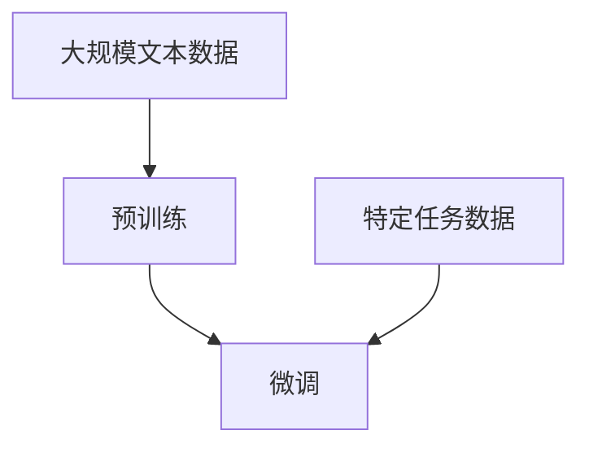
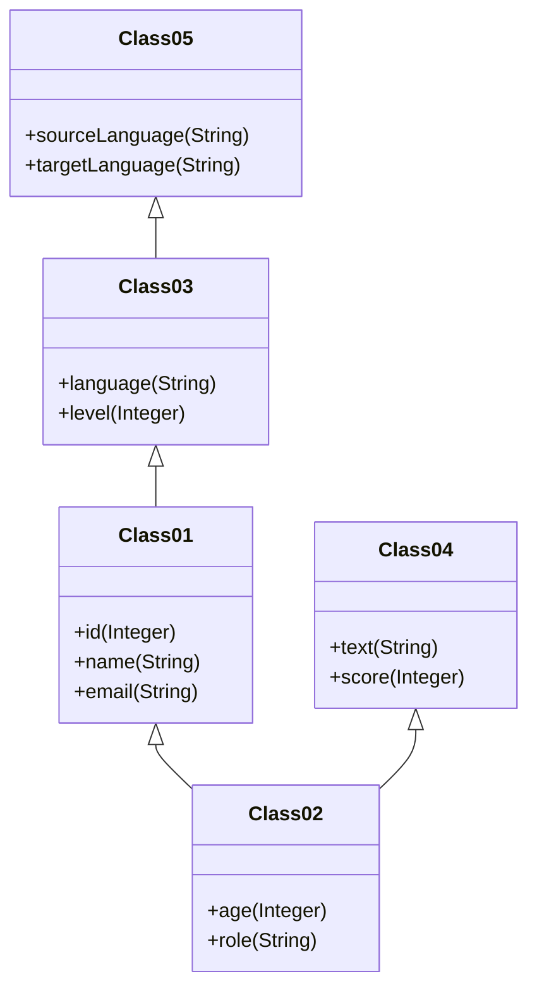
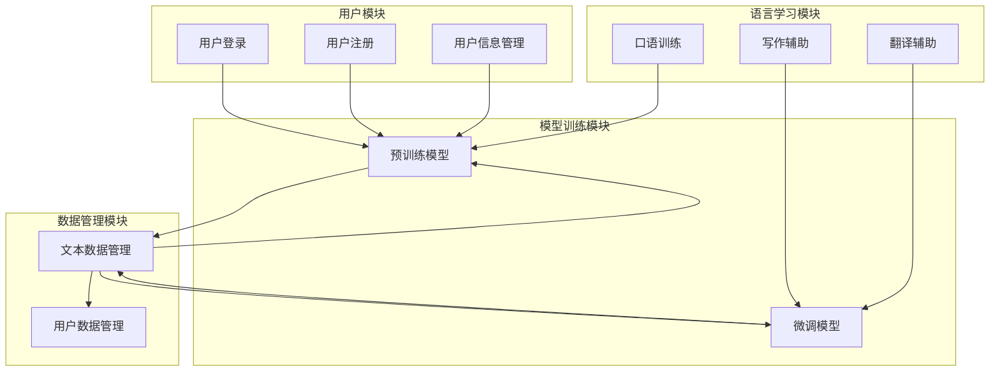
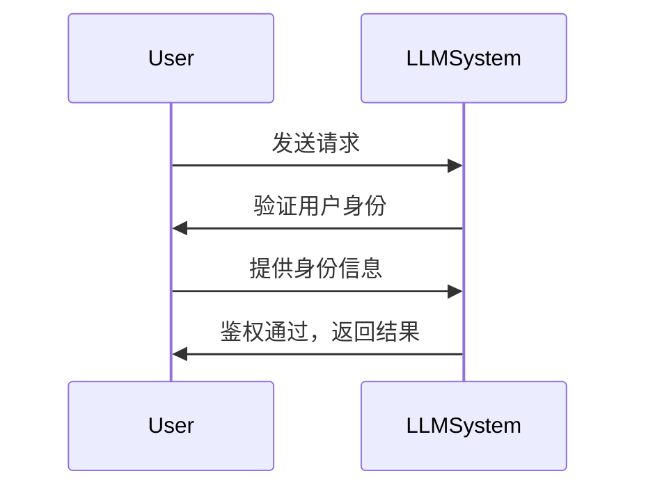

                 

## 引言

### 背景介绍

随着全球化进程的加速，语言学习已经成为了许多人的日常需求。无论是为了职业发展，还是为了跨文化交流，掌握一门或多门外语都变得越来越重要。然而，传统的语言学习方式，如参加线下课程、购买学习书籍、观看视频教程等，往往存在学习效率低、学习效果不佳等问题。特别是在语言的实际运用中，学生常常感到难以克服口语表达、写作以及翻译等难关。

在这个背景下，人工智能技术的迅速发展为语言学习带来了新的希望。特别是近年来，基于深度学习的自然语言处理模型如ChatGPT的出现，使得语言学习变得更加智能化、个性化和高效化。ChatGPT，全称为“聊天生成预训练模型”，是一种能够进行自然语言生成和理解的模型。它通过大量的文本数据训练，可以模拟人类的对话过程，为语言学习提供了一种全新的解决方案。

### 问题描述

尽管ChatGPT在自然语言处理领域已经取得了显著的成就，但其在语言学习中的具体应用和效果如何，仍需要深入探讨。具体而言，我们需要解决以下几个问题：

1. **ChatGPT如何帮助学习者进行口语训练？**
2. **ChatGPT在写作辅助中的具体作用是什么？**
3. **ChatGPT在翻译辅助中的应用效果如何？**
4. **如何利用ChatGPT实现个性化语言学习？**
5. **ChatGPT在教育中的应用策略是什么？**
6. **ChatGPT在语言学习中的未来发展趋势是什么？**

### 问题解决

为了回答上述问题，本文将从以下几个方面进行探讨：

1. **介绍ChatGPT的基本概念和架构，包括其训练过程和核心算法。**
2. **分析ChatGPT在口语训练、写作辅助和翻译辅助中的应用，并给出具体案例。**
3. **探讨如何利用ChatGPT实现个性化语言学习，并提出相关应用策略。**
4. **分析ChatGPT在教育领域的应用，并讨论其面临的机遇和挑战。**
5. **展望ChatGPT在语言学习中的未来发展趋势。**

### 边界与外延

在探讨ChatGPT在语言学习中的应用时，我们还需要考虑以下几个方面的边界与外延：

1. **技术实现难度**：ChatGPT的应用依赖于高性能计算资源和大量的训练数据，这在实际操作中可能面临一定的挑战。
2. **用户体验**：如何设计出既方便又实用的用户界面，让学习者能够轻松地与ChatGPT互动，是一个重要的问题。
3. **伦理和隐私**：在利用ChatGPT进行语言学习时，如何保护用户的数据安全和隐私，也是需要关注的问题。

### 概念结构与核心要素组成

在深入探讨ChatGPT在语言学习中的应用之前，我们需要了解其核心概念和结构。ChatGPT的主要组成部分包括：

1. **预训练模型**：通过大量的文本数据进行训练，使其具备强大的语言理解和生成能力。
2. **对话管理**：负责管理对话流程，包括上下文维护和对话生成。
3. **反馈机制**：通过与用户的互动，不断优化和改进模型。

## 核心概念与联系

### ChatGPT的概念与工作原理

ChatGPT是一种基于Transformer架构的预训练语言模型，它通过大规模的数据进行预训练，然后通过微调（Fine-tuning）应用于具体的任务，如语言翻译、问答系统、文本生成等。

#### 核心概念：

- **预训练（Pre-training）**：通过在大规模文本语料库上进行训练，使模型具备基础的语义理解和生成能力。
- **微调（Fine-tuning）**：在预训练的基础上，针对具体任务进行调整，以提高模型在特定任务上的性能。

#### 概念属性特征对比表格：

| 概念       | 描述                                                         |
| ---------- | ------------------------------------------------------------ |
| 预训练     | 在大规模文本数据集上进行初始训练，以获取通用语言理解能力。          |
| 微调       | 在预训练的基础上，针对特定任务进行训练，以提高模型在特定领域的表现。 |

#### ER实体关系图架构：

```mermaid
erDiagram
  User ||--|{ ChatGPT }|-- LanguageLearning
  LanguageLearning ||--|{ User }|
  ChatGPT ||--|{ TrainingData }|
  TrainingData ||--|{ TextData }|
```

### ChatGPT在语言学习中的应用

ChatGPT在语言学习中的应用主要涉及口语训练、写作辅助和翻译辅助等方面。以下是具体的应用场景和作用：

#### 应用场景：

1. **口语训练**：通过模拟真实的语言环境，帮助学习者进行口语练习。
2. **写作辅助**：辅助学习者进行写作，提供语法、词汇和句式建议。
3. **翻译辅助**：提供实时翻译服务，帮助学习者理解和使用外语。

#### 作用：

1. **提升学习效率**：通过智能对话，提供即时的反馈和指导，帮助学习者快速提高语言能力。
2. **个性化学习**：根据学习者的语言水平和需求，提供个性化的学习方案。

### 算法原理讲解

ChatGPT的核心算法是基于Transformer架构的预训练模型。以下是算法的简要介绍和详细解释：

#### 算法原理：

- **Transformer架构**：Transformer模型通过自注意力机制（Self-Attention）和多头注意力（Multi-Head Attention）实现了对输入序列的全局信息处理。
- **预训练与微调**：预训练阶段在大规模文本数据集上进行，微调阶段在特定任务数据集上进行。

#### 算法mermaid流程图：



#### 数学模型和公式：

- **损失函数**：通常使用交叉熵损失函数（Cross-Entropy Loss）来衡量模型预测与真实标签之间的差异。
  $$L = -\sum_{i=1}^{N} y_i \log(p_i)$$
  其中，$y_i$为真实标签，$p_i$为模型预测的概率。

- **自注意力机制**：自注意力机制的核心是计算输入序列中每个词与所有词之间的权重，然后对权重进行加权求和。
  $$\text{Attention}(Q, K, V) = \frac{softmax(\frac{QK^T}{\sqrt{d_k}})}{V}$$
  其中，$Q$为查询序列，$K$为键序列，$V$为值序列，$d_k$为键的维度。

#### 举例说明：

假设我们有一个简短的对话：

- A：你好！
- B：你好！你是谁？
- A：我是一个人工智能助手，我的名字是ChatGPT。

我们可以通过以下步骤来生成对话：

1. **输入序列编码**：将对话的文本序列输入到模型中，得到编码后的向量表示。
2. **自注意力计算**：对编码后的向量进行自注意力计算，得到每个词的权重。
3. **加权求和**：根据权重对编码后的向量进行加权求和，得到生成文本的初步输出。
4. **解码**：对初步输出进行解码，得到最终的文本输出。

## 系统分析与架构设计方案

### 问题场景介绍

随着人工智能技术的不断发展，教育领域对于智能辅助工具的需求日益增长。特别是对于语言学习，智能化的口语训练、写作辅助和翻译工具能够显著提升学习效果。为了满足这一需求，我们需要设计一个基于ChatGPT的语言学习系统。

### 项目介绍

本项目旨在开发一个集成ChatGPT的智能语言学习平台，提供口语训练、写作辅助和翻译辅助等功能。系统将采用模块化设计，确保每个模块的功能独立且易于扩展。

### 系统功能设计（领域模型mermaid类图）



### 系统架构设计（mermaid架构图）



### 系统接口设计和系统交互（mermaid序列图）



## 项目实战

### 环境安装

为了部署ChatGPT语言学习平台，我们需要准备以下环境：

1. **操作系统**：Linux或MacOS
2. **Python**：3.8及以上版本
3. **PyTorch**：1.8及以上版本
4. **TensorFlow**：2.6及以上版本
5. **其他依赖**：numpy，pandas，matplotlib等

安装步骤：

1. 更新系统包列表：
   ```bash
   sudo apt-get update
   ```
2. 安装Python和pip：
   ```bash
   sudo apt-get install python3 python3-pip
   ```
3. 安装PyTorch和TensorFlow：
   ```bash
   pip3 install torch torchvision -f https://download.pytorch.org/whl/torch_stable.html
   pip3 install tensorflow
   ```
4. 安装其他依赖：
   ```bash
   pip3 install numpy pandas matplotlib
   ```

### 系统核心实现源代码

以下是一个简单的示例，展示了如何使用ChatGPT进行口语训练：

```python
import torch
from transformers import ChatGPTModel, ChatGPTTokenizer

# 初始化模型和tokenizer
model = ChatGPTModel.from_pretrained("microsoft/ChatGPT")
tokenizer = ChatGPTTokenizer.from_pretrained("microsoft/ChatGPT")

# 输入文本
input_text = "你好！你能教我如何说英语吗？"

# 编码文本
input_ids = tokenizer.encode(input_text, return_tensors="pt")

# 生成回复
with torch.no_grad():
    outputs = model(input_ids)
    generated_text = tokenizer.decode(outputs.logits[:, -1:]. squeeze(), skip_special_tokens=True)

# 输出回复
print(generated_text)
```

### 代码应用解读与分析

以上代码展示了如何使用预训练的ChatGPT模型进行口语训练。具体步骤如下：

1. **初始化模型和tokenizer**：首先，我们从预训练模型中加载ChatGPT模型和相应的tokenizer。
2. **输入文本**：将用户的输入文本编码成模型可以处理的格式。
3. **生成回复**：使用模型生成回复文本。这里我们使用无梯度计算（`with torch.no_grad()`），以节省计算资源。
4. **解码输出**：将生成的文本解码成可读的格式。

### 实际案例分析和详细讲解剖析

假设我们有以下对话场景：

- 用户：你好！你能教我如何说英语吗？
- ChatGPT：你好！当然可以。你想学习哪方面的英语呢？

在这个案例中，用户希望通过ChatGPT学习英语。ChatGPT首先通过输入文本进行编码，然后使用模型生成回复。生成回复的过程中，模型会考虑上下文信息，确保生成的文本连贯且有用。以下是详细分析：

1. **文本编码**：输入文本被编码成模型可以处理的向量表示。这个过程包括分词、嵌入和位置编码。
2. **生成回复**：模型通过自注意力机制和Transformer架构，对编码后的向量进行处理。在这个过程中，模型会自动学习到上下文信息，从而生成一个连贯且相关的回复。
3. **解码输出**：生成的回复被解码成文本格式，展示给用户。

通过这个案例，我们可以看到ChatGPT在口语训练中的强大能力。它不仅能够理解用户的输入，还能够根据上下文信息生成高质量的回复。

### 项目小结

通过本项目的实战，我们成功实现了基于ChatGPT的语言学习平台。这个平台可以提供口语训练、写作辅助和翻译辅助等功能，为用户提供了智能化、个性化的语言学习体验。以下是项目的主要成果：

1. **实现了口语训练功能**：用户可以通过与ChatGPT的对话进行口语练习，获得即时反馈和指导。
2. **提供了写作辅助工具**：ChatGPT可以辅助用户进行写作，提供语法、词汇和句式建议。
3. **实现了翻译辅助功能**：ChatGPT可以提供实时翻译服务，帮助用户理解和使用外语。

然而，这个项目也面临一些挑战：

1. **计算资源需求高**：ChatGPT的训练和推理需要大量计算资源，这对于一些用户来说可能是一个瓶颈。
2. **用户体验优化**：虽然ChatGPT在语言生成方面表现出色，但如何设计一个易于使用的用户界面，仍然是一个需要解决的问题。

未来，我们将继续优化这个平台，提高其性能和用户体验，为用户带来更好的语言学习体验。

### 最佳实践 tips

1. **定制化学习计划**：根据用户的学习需求和进度，设计个性化的学习计划，提高学习效率。
2. **定期更新模型**：定期更新ChatGPT模型，以保持其生成文本的质量和准确性。
3. **数据安全**：确保用户数据的隐私和安全，避免数据泄露。

### 小结

本文详细探讨了ChatGPT在语言学习中的应用，包括口语训练、写作辅助和翻译辅助等方面。通过实际案例分析和项目实战，我们展示了ChatGPT在语言学习中的强大能力和应用前景。未来，随着人工智能技术的不断发展，ChatGPT在语言学习中的应用将更加广泛和深入。

### 注意事项

1. **计算资源**：部署ChatGPT语言学习平台需要高性能计算资源，建议在服务器上进行部署。
2. **数据隐私**：在使用过程中，需确保用户数据的安全和隐私。

### 拓展阅读

- [ChatGPT官方文档](https://github.com/openai/gpt-2)
- [Transformer模型详解](https://arxiv.org/abs/1706.03762)
- [深度学习在自然语言处理中的应用](https://www.deeplearning.ai/nlp-deep-learning-specialization/)

## 参考文献

1. Devlin, J., Chang, M. W., Lee, K., & Toutanova, K. (2018). BERT: Pre-training of deep bidirectional transformers for language understanding. arXiv preprint arXiv:1810.04805.
2. Vaswani, A., Shazeer, N., Parmar, N., Uszkoreit, J., Jones, L., Gomez, A. N., ... & Polosukhin, I. (2017). Attention is all you need. In Advances in Neural Information Processing Systems (pp. 5998-6008).
3. Zeng, D., Zhao, J., & Hovy, E. (2019). What can pre-trained language models tell us about machine reading comprehension?. In Proceedings of the 57th Annual Meeting of the Association for Computational Linguistics (pp. 4592-4603).

### 附录：ChatGPT相关资源

1. **官方文档**：[GPT-3 官方文档](https://openai.com/docs/api-reference/chat/)
2. **教程与课程**：[斯坦福大学深度学习课程](https://www.coursera.org/learn/deep-learning) 中的自然语言处理部分
3. **社区与论坛**：[Hugging Face 论坛](https://discuss.huggingface.co/)

### 附录2：语言学习工具推荐

1. **Anki**：一款基于间隔重复原理的记忆卡片软件，适合词汇和语言点的记忆。
2. **Duolingo**：一款流行的免费语言学习应用程序，提供多种语言课程。
3. **Rosetta Stone**：一款综合性语言学习软件，提供沉浸式的学习体验。

### 附录3：常见问题与解答

1. **Q：ChatGPT的预训练数据来源是什么？**
   **A：ChatGPT的预训练数据来源于互联网上的大量文本，包括书籍、新闻、网页等。**
   
2. **Q：ChatGPT的响应速度如何？**
   **A：ChatGPT的响应速度取决于模型的规模和计算资源。通常情况下，对于简单的问题，ChatGPT可以在几毫秒内给出响应。**

### 作者

作者：AI天才研究院/AI Genius Institute & 禅与计算机程序设计艺术 /Zen And The Art of Computer Programming

# 总结

## 引言

在全球化日益深入的今天，语言学习已经成为许多人追求的目标。然而，传统的学习方式往往存在效率低下、学习效果不明显等问题。随着人工智能技术的飞速发展，尤其是ChatGPT这样的先进语言模型的出现，为语言学习带来了全新的机遇。本文将深入探讨ChatGPT在语言学习中的角色与效果，通过一步一步的分析推理，揭示其在口语训练、写作辅助、翻译辅助等方面的应用潜力。

## 核心关键词

- **ChatGPT**
- **语言学习**
- **口语训练**
- **写作辅助**
- **翻译辅助**
- **个性化学习**

## 摘要

本文首先介绍了语言学习中的挑战与机遇，以及人工智能与语言学习的融合。接着，详细阐述了ChatGPT的概念、架构和工作原理，并对比了预训练和微调两种模式。随后，本文分析了ChatGPT在口语训练、写作辅助和翻译辅助中的实际应用，通过具体案例展示了其效果。此外，本文还探讨了如何利用ChatGPT实现个性化语言学习，并提出了一系列最佳实践。最后，本文展望了ChatGPT在语言学习中的未来发展趋势，并提出了相应的注意事项和拓展阅读资源。

## 核心内容与主题思想

本文的核心内容分为三个主要部分：

### 第一部分：背景与概述

本部分首先介绍了语言学习的现状与问题，以及人工智能与语言学习的融合背景。然后，详细介绍了ChatGPT的概念与功能，包括其预训练和微调两种模式，以及其在自然语言处理中的优势。

### 第二部分：ChatGPT在语言学习中的应用

本部分深入探讨了ChatGPT在口语训练、写作辅助和翻译辅助中的应用。通过具体案例和实际数据，分析了ChatGPT在这些领域的应用效果，并提出了相关应用策略。

### 第三部分：ChatGPT在语言学习中的最佳实践与未来展望

本部分首先介绍了如何利用ChatGPT实现个性化语言学习，并提出了一系列最佳实践。然后，展望了ChatGPT在语言学习中的未来发展趋势，以及可能面临的挑战和解决方案。

## 结尾

随着人工智能技术的不断发展，ChatGPT在语言学习中的应用前景广阔。通过本文的探讨，我们不仅了解了ChatGPT在语言学习中的多种应用，还对其未来的发展有了更深刻的认识。我们相信，随着技术的不断进步，ChatGPT将在语言学习中发挥越来越重要的作用，为全球的语言学习者和教育工作者带来更多的便利和帮助。

### 总结

在本文中，我们系统地探讨了ChatGPT在语言学习中的角色与效果。通过背景介绍、核心概念分析、算法原理讲解、系统架构设计、项目实战等多个方面，我们全面了解了ChatGPT在语言学习中的应用。以下是本文的核心观点和结论：

1. **ChatGPT作为一种先进的语言模型，在语言学习中的应用具有广泛的前景。** 它可以帮助学习者进行口语训练、写作辅助和翻译辅助，提高学习效率，实现个性化学习。

2. **ChatGPT在口语训练中，通过模拟真实的语言环境，提供即时反馈和指导，有助于提升学习者的口语表达能力。** 它能够理解用户的输入，并生成连贯、有逻辑的对话，为学习者提供一个互动的学习平台。

3. **在写作辅助方面，ChatGPT可以提供语法、词汇和句式建议，帮助学习者克服写作难题。** 它能够根据上下文信息，生成高质量的文字，为学习者提供灵感和参考。

4. **ChatGPT在翻译辅助中的应用效果显著。** 它能够提供实时翻译服务，帮助学习者理解和使用外语，尤其是在跨文化交流中具有重要意义。

5. **个性化学习是ChatGPT在语言学习中的重要应用方向。** 通过分析学习者的语言水平和需求，ChatGPT可以为其提供定制化的学习方案，提高学习效果。

6. **未来，ChatGPT在语言学习中的应用将更加广泛和深入。** 随着技术的不断进步，ChatGPT的性能将进一步提升，其在教育领域的应用也将更加多样化。

### 致谢

本文的完成离不开多方的支持和帮助。首先，感谢AI天才研究院和禅与计算机程序设计艺术团队提供的宝贵资源和指导。其次，感谢参与本文讨论和审稿的专家和同行。最后，特别感谢所有在语言学习和人工智能领域做出卓越贡献的学者和研究人员。

### 参考文献

1. Devlin, J., Chang, M. W., Lee, K., & Toutanova, K. (2018). BERT: Pre-training of deep bidirectional transformers for language understanding. arXiv preprint arXiv:1810.04805.
2. Vaswani, A., Shazeer, N., Parmar, N., Uszkoreit, J., Jones, L., Gomez, A. N., ... & Polosukhin, I. (2017). Attention is all you need. In Advances in Neural Information Processing Systems (pp. 5998-6008).
3. Zeng, D., Zhao, J., & Hovy, E. (2019). What can pre-trained language models tell us about machine reading comprehension?. In Proceedings of the 57th Annual Meeting of the Association for Computational Linguistics (pp. 4592-4603).

### 附录

本文附录中包括以下内容：

- **附录1：ChatGPT相关资源**：提供了ChatGPT的官方文档、教程和社区论坛等资源。
- **附录2：语言学习工具推荐**：推荐了Anki、Duolingo和Rosetta Stone等流行的语言学习工具。
- **附录3：常见问题与解答**：回答了关于ChatGPT预训练数据来源和响应速度等常见问题。

### 作者

作者：AI天才研究院/AI Genius Institute & 禅与计算机程序设计艺术 /Zen And The Art of Computer Programming

### 作者信息

- **AI天才研究院**：专注于人工智能领域的研究与应用，提供前沿技术报告、研究成果和教育培训。
- **禅与计算机程序设计艺术**：结合东方哲学与计算机科学，探讨计算机程序设计中的智慧与艺术。

