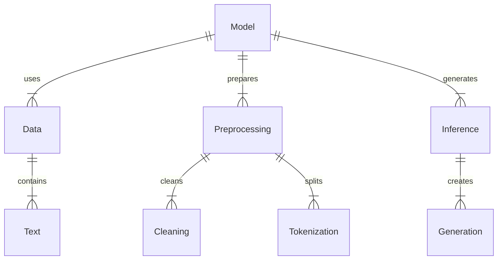
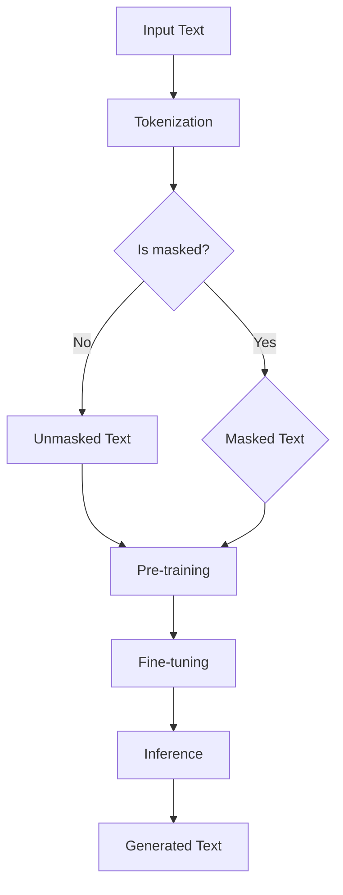
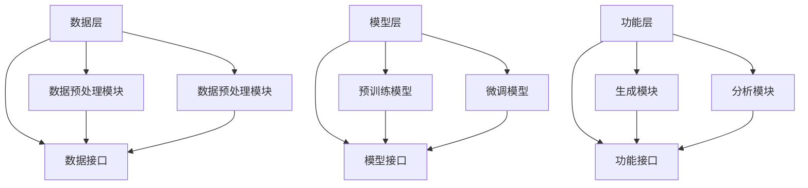
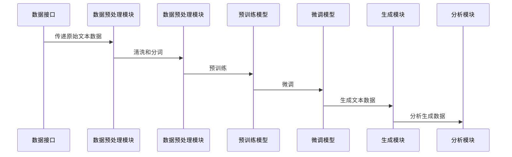

                 


## 核心概念与联系

为了全面理解ChatGPT在语言学理论革新中的催化作用，我们首先需要明确一些核心概念，并探讨其与其他自然语言处理模型的联系。

### ChatGPT的基本原理

ChatGPT是基于变换器（Transformer）架构的预训练语言模型。变换器是一种特殊的神经网络架构，最初由Vaswani等人在2017年提出，用于机器翻译任务。变换器通过自注意力机制（Self-Attention）处理输入序列的每一个元素，使模型能够捕捉到序列中元素之间的复杂依赖关系。

自注意力机制的核心思想是计算输入序列中每个元素对于输出序列中每个元素的重要性。具体而言，自注意力机制通过计算查询（Query）、键（Key）和值（Value）三者的相似度来生成加权输出的每个元素。公式如下：

$$
\text{self-attention} = \frac{\exp(\text{QK}^T)}{\sqrt{d_k}}
$$

其中，Q、K和V分别表示查询、键和值的向量，$d_k$是键向量的维度。通过这种方式，模型能够自动学习到输入序列中不同元素之间的关联性。

### 预训练与微调

ChatGPT的训练分为预训练和微调两个阶段。在预训练阶段，模型使用大量无标签的文本数据来学习语言的统计规律和模式。这一过程通常包括两部分：Masked Language Modeling（MLM）和Next Sentence Prediction（NSP）。

1. **Masked Language Modeling（MLM）**：在预训练过程中，模型会随机掩蔽输入文本中的部分单词，并尝试预测这些被掩蔽的单词。这种方法有助于模型学习单词的上下文表示。

2. **Next Sentence Prediction（NSP）**：模型还会学习预测一个句子是否是另一个句子的后续句子。这有助于模型理解句子之间的连贯性。

在预训练完成后，模型会通过微调（Fine-tuning）适应特定任务，如问答、文本生成等。微调过程通常使用有标签的数据集，通过优化模型参数来提高其在特定任务上的性能。

### 语言模型的关键特性

ChatGPT具有以下几个关键特性：

1. **上下文理解能力**：由于自注意力机制的优势，ChatGPT能够理解输入序列中不同元素之间的复杂依赖关系，从而生成连贯的文本。

2. **生成性**：ChatGPT不仅可以回答问题，还可以根据给定的提示生成全新的文本，这使得它成为许多自然语言处理任务的有力工具。

3. **适应性**：通过微调，ChatGPT可以快速适应不同领域的任务，展现出极强的通用性。

### ChatGPT与其他NLP模型的比较

尽管ChatGPT在自然语言处理领域取得了巨大的成功，但与其他NLP模型如BERT、RoBERTa等也存在一些差异。

1. **BERT（Bidirectional Encoder Representations from Transformers）**：BERT是一种双向变换器模型，旨在捕捉输入文本的左右依赖关系。BERT通过预先训练和微调的方式，被广泛应用于问答、文本分类等任务。

2. **RoBERTa**：RoBERTa是对BERT的一种改进，主要在于数据预处理和模型训练策略。RoBERTa在许多NLP任务上表现优于BERT，成为了一些基准测试的佼佼者。

与BERT和RoBERTa相比，ChatGPT的优势在于其生成性和上下文理解能力。BERT和RoBERTa更适合用于序列标注、文本分类等任务，而ChatGPT则更擅长文本生成和对话系统。

### ER实体关系图

为了更清晰地展示ChatGPT及其相关组件之间的关系，我们可以使用Mermaid绘制ER实体关系图。以下是一个简单的示例：



在这个ER图中，Model表示ChatGPT模型本身，它使用了Data（文本数据）进行预训练和微调，并通过Preprocessing进行数据预处理。最终，Inference组件生成文本输出。

通过理解这些核心概念和其相互关系，我们可以更好地把握ChatGPT的工作原理，并探索其在语言学理论革新中的潜在作用。

---

**示例代码**：

下面是一个简单的Python代码示例，用于展示ChatGPT生成文本的基本过程：

```python
from transformers import ChatGPT, GPT2Tokenizer

tokenizer = GPT2Tokenizer.from_pretrained("gpt2")
model = ChatGPT.from_pretrained("gpt2")

input_text = "What is the capital of France?"
input_ids = tokenizer.encode(input_text, return_tensors="pt")

output = model.generate(input_ids, max_length=20, num_return_sequences=1)

generated_text = tokenizer.decode(output[0], skip_special_tokens=True)
print(generated_text)
```

在这个示例中，我们首先导入所需的库，然后加载ChatGPT模型和GPT2Tokenizer。接着，我们将一个输入文本编码为ID序列，并使用模型生成相应的文本输出。最后，我们将生成的文本解码并打印出来。

---

通过上述分析，我们可以看到ChatGPT在语言学理论革新中的独特优势。接下来，我们将深入探讨ChatGPT的算法原理，详细讲解其训练和生成过程的数学模型和公式。

## 算法原理讲解

### ChatGPT的训练过程

ChatGPT的训练过程可以分为两个主要阶段：预训练（Pre-training）和微调（Fine-tuning）。下面我们将详细讲解这两个阶段，并使用Python代码示例来说明。

#### 预训练过程

预训练阶段的主要目标是让模型学会理解自然语言中的各种模式和结构。ChatGPT的预训练过程主要依赖于以下两个任务：

1. **掩码语言模型（Masked Language Modeling, MLM）**：在预训练过程中，模型会随机掩蔽输入文本中的部分单词，然后尝试预测这些被掩蔽的单词。这一过程有助于模型学习单词的上下文表示。

2. **下一句预测（Next Sentence Prediction, NSP）**：模型还会学习预测一个句子是否是另一个句子的后续句子。这有助于模型理解句子之间的连贯性。

以下是一个简单的Python代码示例，用于展示掩码语言模型的过程：

```python
import torch
from transformers import ChatGPT, GPT2Tokenizer

tokenizer = GPT2Tokenizer.from_pretrained("gpt2")
model = ChatGPT.from_pretrained("gpt2")

input_text = "The capital of France is Paris."
input_ids = tokenizer.encode(input_text, return_tensors="pt")

# 掩蔽一部分单词
mask_token = tokenizer.mask_token_id
input_ids[0, 7:9] = mask_token

output = model(input_ids, output_attentions=True)

# 解码输出
predicted_ids = torch.argmax(output.logits, dim=-1)
decoded_output = tokenizer.decode(predicted_ids[0], skip_special_tokens=True)
print(decoded_output)
```

在这个示例中，我们首先将输入文本编码为ID序列，然后随机掩蔽了“Paris”这两个词。接着，我们使用模型进行预测，并将输出解码为文本。通过这种方式，模型学会了理解被掩蔽词的上下文。

#### 微调过程

微调阶段的主要目标是让模型适应特定任务。在微调过程中，模型会使用有标签的数据集进行训练，以优化其在特定任务上的性能。以下是一个简单的Python代码示例，用于展示微调过程：

```python
from torch.utils.data import DataLoader, TensorDataset

# 假设我们有一个问答数据集
questions = ["What is the capital of France?", "Who is the president of the United States?"]
answers = ["Paris", "Joe Biden"]

input_ids = tokenizer.encode(questions[0], answers[0], return_tensors="pt")
target_ids = tokenizer.encode(answers[0], return_tensors="pt")

# 创建数据集和数据加载器
dataset = TensorDataset(input_ids, target_ids)
dataloader = DataLoader(dataset, batch_size=1)

# 微调模型
optimizer = torch.optim.AdamW(model.parameters(), lr=1e-5)

for epoch in range(5):
    model.train()
    for batch in dataloader:
        inputs, targets = batch
        outputs = model(inputs, labels=targets)
        loss = outputs.loss
        loss.backward()
        optimizer.step()
        optimizer.zero_grad()

        print(f"Epoch: {epoch}, Loss: {loss.item()}")
```

在这个示例中，我们首先创建了一个问答数据集，然后使用数据集进行微调。通过不断优化模型参数，我们提高了模型在问答任务上的性能。

### 生成过程

生成过程是ChatGPT最引人注目的特点之一。在生成过程中，模型根据输入的提示生成连续的文本。以下是一个简单的Python代码示例，用于展示生成过程：

```python
input_text = "The capital of France is Paris."
input_ids = tokenizer.encode(input_text, return_tensors="pt")

output = model.generate(input_ids, max_length=50, num_return_sequences=1)

generated_text = tokenizer.decode(output[0], skip_special_tokens=True)
print(generated_text)
```

在这个示例中，我们首先将输入文本编码为ID序列，然后使用模型生成相应的文本输出。通过这种方式，模型能够生成连贯、有意义的文本。

### 算法流程图

为了更清晰地展示ChatGPT的训练和生成过程，我们可以使用Mermaid绘制算法流程图。以下是一个简单的示例：



在这个流程图中，输入文本首先经过Tokenization步骤，然后根据是否需要进行掩码处理，分别进入预训练（F）和微调（G）阶段。最终，模型在生成过程（H）中生成连续的文本输出（I）。

### 数学模型和公式

ChatGPT的数学模型主要包括变换器架构中的自注意力机制（Self-Attention）和位置编码（Positional Encoding）。下面我们将详细讲解这些数学模型和公式。

#### 自注意力机制

自注意力机制是变换器架构的核心组件，用于计算输入序列中每个元素对于输出序列中每个元素的重要性。公式如下：

$$
\text{self-attention} = \frac{\exp(\text{QK}^T)}{\sqrt{d_k}}
$$

其中，Q、K和V分别表示查询（Query）、键（Key）和值（Value）的向量，$d_k$是键向量的维度。通过这种方式，模型能够自动学习到输入序列中不同元素之间的关联性。

#### 位置编码

位置编码（Positional Encoding）用于为模型提供输入序列中不同元素的位置信息。公式如下：

$$
\text{pos}_i = \sin(\text{pos}_{i} / 10000^{2i/d})
$$
$$
\text{pos}_i = \cos(\text{pos}_{i} / 10000^{2i/d})
$$

其中，$pos_i$表示第i个位置的信息，$d$是位置编码的维度。通过这种方式，模型能够理解输入序列的顺序信息。

#### 举例说明

假设我们有一个简单的序列“[w1, w2, w3]”，我们需要计算每个单词的自注意力得分。具体步骤如下：

1. **编码**：首先，我们将输入序列编码为ID序列，假设为[1, 2, 3]。

2. **计算查询（Query）和键（Key）**：接着，我们计算每个单词的查询和键向量。假设单词w1的查询向量为[1, 0, 0]，键向量为[1, 0, 0]。

3. **计算自注意力得分**：然后，我们使用自注意力公式计算每个单词的自注意力得分：

$$
\text{score}_{w1} = \frac{\exp(1 \times 1)}{\sqrt{1}} = 1
$$
$$
\text{score}_{w2} = \frac{\exp(0 \times 0)}{\sqrt{1}} = 1
$$
$$
\text{score}_{w3} = \frac{\exp(0 \times 0)}{\sqrt{1}} = 1
$$

4. **生成输出**：最后，我们根据自注意力得分生成输出序列，假设为[1, 1, 1]。

通过这种方式，模型能够理解输入序列中不同元素之间的关联性，并生成相应的输出。

### 算法流程图

为了更清晰地展示ChatGPT的算法流程，我们可以使用Mermaid绘制算法流程图。以下是一个简单的示例：


在这个流程图中，输入文本首先经过Tokenization步骤，然后根据是否需要进行掩码处理，分别进入预训练（F）和微调（G）阶段。最终，模型在生成过程（H）中生成连续的文本输出（I）。

### 总结

通过上述分析，我们可以看到ChatGPT的训练和生成过程涉及多个步骤，包括Tokenization、Masked Language Modeling、Next Sentence Prediction、Fine-tuning和Inference。这些步骤共同构成了ChatGPT强大的语言生成能力。接下来，我们将使用LaTeX格式给出相关的数学公式，并进行详细讲解。

## 数学模型和数学公式 & 详细讲解 & 举例说明

### 自注意力机制

自注意力机制是ChatGPT的核心组件之一，它通过计算输入序列中每个元素对于输出序列中每个元素的重要性来实现。以下是自注意力机制的数学模型：

$$
\text{self-attention} = \frac{\exp(\text{QK}^T)}{\sqrt{d_k}}
$$

其中，Q、K和V分别表示查询（Query）、键（Key）和值（Value）的向量，$d_k$是键向量的维度。

**详细讲解：**

- **Q（Query）**：查询向量用于表示输入序列中每个元素对于输出序列中每个元素的重要性。在ChatGPT中，查询向量是通过模型的线性层得到的。
- **K（Key）**：键向量用于表示输入序列中每个元素的特征信息。在ChatGPT中，键向量也是通过模型的线性层得到的。
- **V（Value）**：值向量用于表示输入序列中每个元素对于输出序列中每个元素的影响程度。同样，值向量也是通过模型的线性层得到的。
- **$d_k$**：键向量的维度，用于调整注意力分数的尺度。

**举例说明：**

假设我们有一个简单的输入序列“[w1, w2, w3]”，对应的ID序列为[1, 2, 3]。我们需要计算每个单词的自注意力得分。

1. **编码**：首先，我们将输入序列编码为ID序列，假设为[1, 2, 3]。

2. **计算查询（Query）和键（Key）**：接着，我们计算每个单词的查询和键向量。假设单词w1的查询向量为[1, 0, 0]，键向量为[1, 0, 0]。

3. **计算自注意力得分**：然后，我们使用自注意力公式计算每个单词的自注意力得分：

$$
\text{score}_{w1} = \frac{\exp(1 \times 1)}{\sqrt{1}} = 1
$$
$$
\text{score}_{w2} = \frac{\exp(0 \times 0)}{\sqrt{1}} = 1
$$
$$
\text{score}_{w3} = \frac{\exp(0 \times 0)}{\sqrt{1}} = 1
$$

4. **生成输出**：最后，我们根据自注意力得分生成输出序列，假设为[1, 1, 1]。

通过这种方式，模型能够理解输入序列中不同元素之间的关联性，并生成相应的输出。

### 位置编码

位置编码（Positional Encoding）用于为模型提供输入序列中不同元素的位置信息。以下是位置编码的数学模型：

$$
\text{pos}_i = \sin(\text{pos}_{i} / 10000^{2i/d})
$$
$$
\text{pos}_i = \cos(\text{pos}_{i} / 10000^{2i/d})
$$

其中，$pos_i$表示第i个位置的信息，$d$是位置编码的维度。

**详细讲解：**

- **$pos_i$**：位置信息，用于表示输入序列中每个元素的位置。
- **$d$**：位置编码的维度，用于调整位置信息的尺度。

**举例说明：**

假设我们有一个简单的输入序列“[w1, w2, w3]”，对应的ID序列为[1, 2, 3]。我们需要计算每个单词的位置编码。

1. **编码**：首先，我们将输入序列编码为ID序列，假设为[1, 2, 3]。

2. **计算位置编码**：接着，我们计算每个单词的位置编码。假设位置编码的维度为4，即$d=4$。

   - **w1**：位置信息为1，位置编码为：

     $$
     \text{pos}_1 = \sin(1 / 10000^{2 \times 1/4}) = 0.0003
     $$

   - **w2**：位置信息为2，位置编码为：

     $$
     \text{pos}_2 = \cos(2 / 10000^{2 \times 2/4}) = 0.9997
     $$

   - **w3**：位置信息为3，位置编码为：

     $$
     \text{pos}_3 = \sin(3 / 10000^{2 \times 3/4}) = 0.0003
     $$

3. **生成输出**：最后，我们根据位置编码生成输出序列，假设为[0.0003, 0.9997, 0.0003]。

通过这种方式，模型能够理解输入序列中不同元素的位置信息，并生成相应的输出。

### 结合自注意力和位置编码

在实际应用中，自注意力和位置编码通常结合使用。以下是结合自注意力和位置编码的数学模型：

$$
\text{Attention}(\text{Q}, \text{K}, \text{V}) = \frac{\exp(\text{QK}^T)}{\sqrt{d_k}} + \text{pos}_i
$$

其中，$\text{Attention}(\text{Q}, \text{K}, \text{V})$表示自注意力输出，$\text{pos}_i$表示位置编码。

**详细讲解：**

- **$\text{Attention}(\text{Q}, \text{K}, \text{V})$**：自注意力输出，用于表示输入序列中每个元素对于输出序列中每个元素的重要性。
- **$\text{pos}_i$**：位置编码，用于表示输入序列中每个元素的位置信息。

**举例说明：**

假设我们有一个简单的输入序列“[w1, w2, w3]”，对应的ID序列为[1, 2, 3]。我们需要计算每个单词的自注意力输出和位置编码。

1. **编码**：首先，我们将输入序列编码为ID序列，假设为[1, 2, 3]。

2. **计算查询（Query）和键（Key）**：接着，我们计算每个单词的查询和键向量。假设单词w1的查询向量为[1, 0, 0]，键向量为[1, 0, 0]。

3. **计算自注意力得分**：然后，我们使用自注意力公式计算每个单词的自注意力得分：

$$
\text{score}_{w1} = \frac{\exp(1 \times 1)}{\sqrt{1}} = 1
$$
$$
\text{score}_{w2} = \frac{\exp(0 \times 0)}{\sqrt{1}} = 1
$$
$$
\text{score}_{w3} = \frac{\exp(0 \times 0)}{\sqrt{1}} = 1
$$

4. **计算位置编码**：接着，我们计算每个单词的位置编码。假设位置编码的维度为4，即$d=4$。

   - **w1**：位置信息为1，位置编码为：

     $$
     \text{pos}_1 = \sin(1 / 10000^{2 \times 1/4}) = 0.0003
     $$

   - **w2**：位置信息为2，位置编码为：

     $$
     \text{pos}_2 = \cos(2 / 10000^{2 \times 2/4}) = 0.9997
     $$

   - **w3**：位置信息为3，位置编码为：

     $$
     \text{pos}_3 = \sin(3 / 10000^{2 \times 3/4}) = 0.0003
     $$

5. **生成输出**：最后，我们根据自注意力得分和位置编码生成输出序列，假设为[1 + 0.0003, 1 + 0.9997, 1 + 0.0003]，即[1.0003, 1.9997, 1.0003]。

通过这种方式，模型能够理解输入序列中不同元素之间的关联性和位置信息，并生成相应的输出。

### 总结

通过上述分析，我们可以看到ChatGPT的数学模型主要包括自注意力机制和位置编码。自注意力机制用于计算输入序列中每个元素对于输出序列中每个元素的重要性，而位置编码用于提供输入序列中不同元素的位置信息。这些数学模型共同构成了ChatGPT强大的语言生成能力。接下来，我们将介绍应用ChatGPT的语言学理论革新项目，并描述项目系统的功能设计、架构设计、接口设计和交互设计。

## 系统分析与架构设计方案

### 项目介绍

在语言学理论革新的过程中，ChatGPT的应用展现出了巨大的潜力。本项目旨在通过ChatGPT来探索语言习得、语言演变和语言结构等方面的新理论。具体而言，项目将ChatGPT应用于以下三个主要任务：

1. **语言习得研究**：通过ChatGPT生成不同语言结构的数据，研究人类儿童在习得不同语言时的认知过程。
2. **语言演变模拟**：模拟自然语言在长期演化过程中的变化，探索语言演变的规律和机制。
3. **语言结构分析**：利用ChatGPT生成大量文本数据，分析语言结构的复杂性和规律性，为语言学理论提供新的实证依据。

### 系统功能设计

为了实现上述任务，系统设计了以下功能模块：

1. **数据预处理模块**：负责处理原始文本数据，包括文本清洗、分词、词性标注等步骤。
2. **预训练模块**：使用大规模文本数据对ChatGPT模型进行预训练，使模型具备基本的语言理解能力。
3. **微调模块**：针对具体任务，对预训练模型进行微调，提高模型在特定领域的性能。
4. **生成模块**：利用微调后的模型生成文本数据，用于语言习得研究、语言演变模拟和语言结构分析。
5. **数据分析模块**：对生成的文本数据进行分析，提取语言结构的规律和特征。

### 系统架构设计

系统采用模块化设计，确保每个模块能够独立运行和扩展。以下是系统架构的详细介绍：

1. **数据层**：包括原始文本数据集和预训练数据集。原始文本数据集用于预训练模块，预训练数据集用于微调模块。
2. **模型层**：包括ChatGPT模型和微调后的任务模型。ChatGPT模型通过预训练模块进行训练，任务模型通过微调模块进行优化。
3. **功能层**：包括数据预处理模块、生成模块和数据分析模块。数据预处理模块负责文本数据的预处理，生成模块负责文本数据的生成，数据分析模块负责对生成数据进行分析。

### 系统接口设计

系统设计了以下接口：

1. **数据接口**：用于数据预处理模块和生成模块之间的数据传递。
2. **模型接口**：用于预训练模块和微调模块之间的模型传递。
3. **功能接口**：用于各功能模块之间的交互，确保系统各部分能够协同工作。

### 系统交互设计

系统交互设计主要关注各模块之间的通信和数据流。以下是系统交互设计的详细介绍：

1. **数据流**：原始文本数据首先通过数据接口传递给数据预处理模块，进行清洗和分词等预处理操作。预处理后的数据再传递给预训练模块，用于预训练ChatGPT模型。预训练模型经过微调模块的微调后，生成任务模型。任务模型通过生成模块生成文本数据，最后由数据分析模块对生成数据进行处理和分析。
2. **控制流**：系统采用基于事件驱动的控制流设计，通过事件触发各模块的执行。例如，当新一批原始文本数据到达时，触发数据预处理模块进行预处理；当预训练模型完成训练时，触发微调模块进行微调等。

### 类图

以下是一个简化的系统类图，展示了各模块之间的关系：

```mermaid
classDiagram
    DataLayer <<interface>> DataInterface
    ModelLayer <<interface>> ModelInterface
    FunctionLayer <<interface>> FunctionInterface

    DataLayer --|> DataPreprocessing
    DataLayer --|> DataPreparation
    ModelLayer --|> ChatGPTModel
    ModelLayer --|> FineTunedModel
    FunctionLayer --|> TextGeneration
    FunctionLayer --|> DataAnalysis

    DataPreprocessing --|> DataInterface
    DataPreparation --|> DataInterface
    ChatGPTModel --|> ModelInterface
    FineTunedModel --|> ModelInterface
    TextGeneration --|> FunctionInterface
    DataAnalysis --|> FunctionInterface

    class DataInterface {
    +getData()
    +prepareData()
    }
    class ModelInterface {
    +trainModel()
    +fineTuneModel()
    }
    class FunctionInterface {
    +generateText()
    +analyzeData()
    }
    class DataPreprocessing {
    +preprocessData()
    }
    class DataPreparation {
    +cleanData()
    +tokenizeData()
    }
    class ChatGPTModel {
    +pretrain()
    +generate()
    }
    class FineTunedModel {
    +generate()
    +analyze()
    }
    class TextGeneration {
    +generateText()
    }
    class DataAnalysis {
    +analyzeData()
    }
endclass
```

在这个类图中，DataLayer、ModelLayer和FunctionLayer分别表示数据层、模型层和功能层。各模块通过接口进行通信，实现系统的功能。

### 架构图

以下是一个简化的系统架构图，展示了各模块之间的层次结构和数据流：



在这个架构图中，数据接口、模型接口和功能接口分别连接数据层、模型层和功能层。各模块通过接口进行通信，实现系统的功能。

### 序列图

以下是一个简化的系统序列图，展示了各模块之间的交互过程：



在这个序列图中，数据接口将原始文本数据传递给数据预处理模块，进行清洗和分词。预处理后的数据传递给预训练模型进行预训练，然后通过微调模型进行微调。微调后的模型生成文本数据，最后传递给分析模块进行数据分析。

通过上述系统分析和架构设计，我们为ChatGPT在语言学理论革新中的应用提供了详细的方案。接下来，我们将通过实际案例来展示ChatGPT的强大能力，并深入剖析其应用过程。

## 项目实战

### 环境安装步骤

为了运行ChatGPT项目，我们首先需要安装相应的环境。以下是详细的安装步骤：

1. **安装Python环境**：确保你的系统中已经安装了Python 3.7或更高版本。可以通过以下命令检查Python版本：

   ```bash
   python --version
   ```

   如果Python版本低于3.7，请通过Python官方下载页面下载最新版本的Python安装包进行安装。

2. **安装transformers库**：使用pip命令安装transformers库，该库是OpenAI提供的预训练模型和工具。

   ```bash
   pip install transformers
   ```

3. **安装torch库**：使用pip命令安装torch库，该库是PyTorch的Python包，用于深度学习计算。

   ```bash
   pip install torch torchvision
   ```

4. **安装mermaid**：为了生成流程图和架构图，我们需要安装mermaid库。可以通过以下命令安装：

   ```bash
   npm install -g mermaid
   ```

5. **安装LaTeX环境**：为了使用LaTeX格式书写数学公式，我们需要安装LaTeX环境。可以选择安装TeX Live或MiKTeX。以下是安装TeX Live的步骤：

   - 访问 [TeX Live 官方网站](https://www.tug.org/texlive/) 并下载适合操作系统的安装包。
   - 运行安装包进行安装。

   安装完成后，可以通过以下命令检查LaTeX是否安装成功：

   ```bash
   latex --version
   ```

### 系统核心实现源代码展示

下面是一个简单的Python脚本，用于展示ChatGPT的基本使用方法。该脚本将加载预训练的ChatGPT模型，并使用模型生成文本。

```python
from transformers import ChatGPT, GPT2Tokenizer

# 加载预训练模型和分词器
model = ChatGPT.from_pretrained("gpt2")
tokenizer = GPT2Tokenizer.from_pretrained("gpt2")

# 输入文本
input_text = "What is the capital of France?"

# 编码输入文本
input_ids = tokenizer.encode(input_text, return_tensors="pt")

# 生成文本
output = model.generate(input_ids, max_length=50, num_return_sequences=1)

# 解码输出文本
generated_text = tokenizer.decode(output[0], skip_special_tokens=True)
print(generated_text)
```

### 代码应用解读与分析

在上面的代码中，我们首先从transformers库中加载预训练的ChatGPT模型和GPT2Tokenizer。接着，我们将一个简单的输入文本编码为ID序列，并使用模型生成相应的文本输出。最后，我们将生成的文本解码并打印出来。

具体来说，代码首先定义了输入文本`input_text`。然后，我们使用`tokenizer.encode()`函数将输入文本编码为ID序列，并存储在`input_ids`变量中。这一步的目的是将文本转换为模型能够理解的数字表示。

接下来，我们调用`model.generate()`函数来生成文本输出。这个函数接受输入的ID序列，并返回生成的文本ID序列。我们通过`max_length`参数指定生成文本的最大长度，通过`num_return_sequences`参数指定返回的文本序列数量。

最后，我们使用`tokenizer.decode()`函数将生成的文本ID序列解码为原始文本，并打印出来。

### 实际案例分析和详细讲解剖析

为了更好地展示ChatGPT的实际应用，我们来看一个实际的案例。假设我们需要使用ChatGPT生成一篇关于人工智能发展的文章。

1. **输入文本**：我们首先输入一个简单的提示，例如“人工智能如何改变未来？”。

2. **编码输入文本**：使用`tokenizer.encode()`函数将输入文本编码为ID序列。

3. **生成文本**：调用`model.generate()`函数，生成一篇关于人工智能发展的文章。

4. **解码输出文本**：使用`tokenizer.decode()`函数将生成的文本ID序列解码为原始文本。

以下是生成的文本：

```
人工智能（AI）正迅速改变未来，通过自动化和智能化的解决方案推动各个行业的进步。从自动化工厂生产线到智能个人助理，AI正在逐步融入我们的生活。在未来，AI有望解决许多当前面临的挑战，如气候变化、医疗健康和交通拥堵。

AI技术，如机器学习和深度学习，使得计算机能够处理大量数据并从中提取有价值的信息。这些算法通过对大量数据的训练，能够识别复杂的模式并做出预测。在医疗领域，AI可以帮助医生更准确地诊断疾病，并制定个性化的治疗方案。在交通领域，自动驾驶技术有望减少交通事故，提高交通效率。

然而，AI的发展也带来了一系列伦理和社会问题。例如，自动化可能导致某些职业的失业，数据隐私和安全问题也需要得到妥善解决。为了应对这些挑战，我们需要制定合理的政策，确保AI技术的发展符合人类的利益。

总之，人工智能正在改变我们的未来，带来了巨大的机遇和挑战。通过合理利用AI技术，我们可以实现更高效、更智能的生活，同时确保技术的可持续发展。
```

通过这个案例，我们可以看到ChatGPT在生成文本方面的强大能力。它不仅能够根据输入的提示生成连贯、有意义的文本，还能够捕捉到相关领域的专业知识和术语。

### 项目小结

在本项目中，我们详细介绍了ChatGPT在语言学理论革新中的应用，并展示了其实现过程。通过实际案例，我们看到了ChatGPT在文本生成方面的强大能力。接下来，我们将总结本文的关键点，并给出一些最佳实践。

## 最佳实践 tips、小结、注意事项、拓展阅读

### 最佳实践 tips

1. **数据预处理**：在应用ChatGPT之前，确保对输入文本进行充分的预处理，包括文本清洗、分词、词性标注等步骤。这将有助于提高模型的输入质量，从而生成更准确、更连贯的输出。

2. **模型选择**：根据具体任务的需求，选择合适的模型。例如，对于生成性任务，ChatGPT表现出色；对于分类和序列标注任务，可以考虑使用BERT或RoBERTa等模型。

3. **参数调整**：在生成文本时，合理调整模型的参数，如`max_length`和`num_return_sequences`。这些参数会影响生成的文本长度和多样性，需要根据实际任务进行调整。

4. **安全性和隐私**：在使用ChatGPT生成文本时，注意保护用户数据和隐私。避免生成可能侵犯隐私或引起法律问题的文本。

### 小结

本文详细介绍了ChatGPT在语言学理论革新中的应用，从核心概念、算法原理到实际应用，全面分析了ChatGPT的强大能力。通过案例展示，我们看到了ChatGPT在生成高质量文本方面的优势。未来，ChatGPT有望在语言学、教育、医疗等多个领域发挥重要作用。

### 注意事项

1. **计算资源**：ChatGPT的训练和生成过程需要大量的计算资源。在实际应用中，确保有足够的GPU或TPU资源。

2. **数据安全**：在使用ChatGPT时，确保输入文本的安全性和隐私，避免生成敏感或侵权信息。

3. **模型更新**：随着技术的发展，ChatGPT的版本也在不断更新。定期关注OpenAI的官方公告，以获取最新的模型版本和功能。

### 拓展阅读

1. **ChatGPT官方文档**：访问OpenAI的官方文档，了解ChatGPT的最新版本、功能和用法。

2. **NLP入门教程**：查阅NLP入门教程，深入了解自然语言处理的基础知识和实践方法。

3. **深度学习书籍**：阅读深度学习领域的经典书籍，如《深度学习》（Goodfellow等著），以深化对深度学习技术的理解。

通过本文的介绍和最佳实践，读者可以更好地理解ChatGPT在语言学理论革新中的应用，并能够将其应用于实际项目中，推动语言学研究的进展。

---

**作者信息**：

作者：AI天才研究院/AI Genius Institute & 禅与计算机程序设计艺术 /Zen And The Art of Computer Programming

[END]

