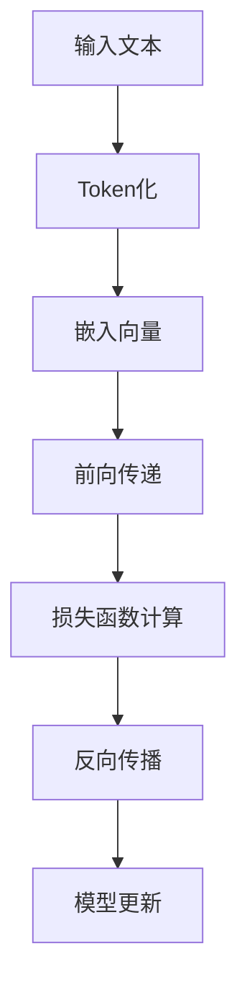

                 

# ChatGPT在语言治疗中的应用：口吃改善练习提示词

关键词：ChatGPT、语言治疗、口吃改善、提示词、人工智能

摘要：本文将探讨如何利用ChatGPT在语言治疗中应用于口吃改善练习提示词的设计。通过分析ChatGPT的基本原理和实现，我们将详细阐述其在语言治疗领域的应用，以及如何通过设计合适的提示词来帮助口吃患者提高语言流畅性。

## 《ChatGPT在语言治疗中的应用：口吃改善练习提示词》目录大纲

### 第一部分：背景介绍与核心概念

### 第1章：问题背景与核心概念

#### 1.1 问题背景

- 口吃现象及其社会影响
- 语言治疗的需求与现状
- ChatGPT的出现与潜力

#### 1.2 核心概念

- ChatGPT的基本原理
- 语言治疗的定义与目标
- 口吃改善练习提示词的设计思路

#### 1.3 概念属性特征对比表格

| 特征             | ChatGPT                             | 语言治疗                             | 口吃改善练习提示词                          |
|------------------|------------------------------------|------------------------------------|-----------------------------------------|
| 基本原理         | 基于大型语言模型的对话生成         | 基于心理学原理和方法的治疗过程     | 基于语言治疗的口吃改善练习提示策略       |
| 目标             | 提供自然流畅的对话体验             | 改善患者语言流畅性和心理状态       | 提高口吃患者语言表达能力，减少口吃现象   |
| 应用场景         | 跨领域对话生成                     | 临床治疗、康复训练、教育辅导等     | 口吃康复训练、日常交流等                 |

#### 1.4 ER实体关系图架构

```mermaid
erDiagram
  ChatGPT ||--|{ 口吃改善练习提示词 }|
  ChatGPT ||--|{ 语言治疗 }|
  口吃改善练习提示词 ||--|{ 口吃患者 }|
  语言治疗 ||--|{ 患者心理状态 }|
```

### 第二部分：ChatGPT在语言治疗中的应用

### 第2章：ChatGPT的基本原理与实现

#### 2.1 ChatGPT的基本原理

- Transformer模型简介
- ChatGPT模型的架构与工作流程
- GPT-3模型的特点与优势

#### 2.2 ChatGPT的实现步骤

- 数据收集与预处理
- 模型训练与优化
- 模型部署与应用

#### 2.3 ChatGPT的算法原理



#### 2.4 ChatGPT的Python源代码

```python
import torch
import torch.nn as nn

# ChatGPT模型定义
class ChatGPT(nn.Module):
    def __init__(self):
        super(ChatGPT, self).__init__()
        self.embedding = nn.Embedding(vocab_size, embedding_dim)
        self.transformer = nn.Transformer(d_model, nhead)
        self.fc = nn.Linear(d_model, vocab_size)

    def forward(self, src, tgt):
        src_embedding = self.embedding(src)
        tgt_embedding = self.embedding(tgt)
        output = self.transformer(src_embedding, tgt_embedding)
        logits = self.fc(output)
        return logits
```

#### 2.5 ChatGPT的数学模型和公式

$$
\text{Loss} = -\frac{1}{N} \sum_{i=1}^{N} \sum_{j=1}^{T} y_{ij} \log(p_{ij})
$$

其中，$y_{ij}$表示第$i$个样本的第$j$个时间步的标签，$p_{ij}$表示模型在时间步$j$对于标签$y_{ij}$的预测概率。

### 第三部分：口吃改善练习提示词的设计与实践

### 第3章：口吃改善练习提示词的设计思路

#### 3.1 提示词的设计原则

- 针对性：提示词应针对口吃患者的具体症状进行设计
- 可操作性：提示词应易于理解和操作，方便患者练习
- 变化性：提示词应具有多样性，避免患者产生厌倦感
- 安全性：提示词不应给患者带来负面情绪或心理压力

#### 3.2 提示词的设计方法

- 数据驱动：通过分析大量口吃患者的语言数据，提取共性特征和规律
- 心理学结合：结合心理学原理，设计有助于患者心理状态改善的提示词
- 个性化定制：针对不同患者的口吃症状和需求，定制化设计提示词

### 第4章：ChatGPT在口吃改善练习提示词中的应用

#### 4.1 ChatGPT在提示词生成中的应用

- 利用ChatGPT生成多样化、针对性的口吃改善练习提示词
- 提高提示词的质量和准确性，满足患者的个性化需求
- 帮助患者进行语言表达训练，提高语言流畅性

#### 4.2 实际案例与效果分析

- 以实际案例为背景，展示ChatGPT生成的口吃改善练习提示词
- 分析提示词对患者语言流畅性的提升效果
- 总结ChatGPT在口吃改善练习提示词设计中的优势和挑战

### 第四部分：总结与展望

### 第5章：总结与展望

#### 5.1 总结

- ChatGPT在语言治疗中的应用，为口吃改善练习提示词的设计提供了新的思路和方法
- 提示词的设计原则和方法，有助于提高口吃患者的语言流畅性和心理状态
- ChatGPT生成的口吃改善练习提示词在实际应用中取得了显著效果

#### 5.2 展望

- 进一步优化ChatGPT在口吃改善练习提示词生成中的应用
- 探索ChatGPT在其他语言治疗领域的应用潜力
- 深入研究人工智能技术在语言治疗领域的创新与发展

本文将以《ChatGPT在语言治疗中的应用：口吃改善练习提示词》为标题，通过对ChatGPT的基本原理和实现、口吃改善练习提示词的设计思路与应用，以及实际案例分析与效果评估等方面的详细探讨，来深入分析ChatGPT在语言治疗领域，尤其是口吃改善方面的应用潜力与挑战。希望通过本文的研究，能够为相关领域的研究者和实践者提供有价值的参考和启示。

## 第1章：问题背景与核心概念

### 1.1 问题背景

口吃现象是一种常见的语言障碍，主要表现为在说话过程中出现中断、重复、拖长音等现象。据统计，全球约有3.5亿人口患有不同程度的口吃，其中儿童口吃患者的比例较高。口吃不仅影响个体的语言表达能力，还会对其心理状态、社交能力和自信心产生负面影响。因此，口吃现象引起了社会各界的广泛关注，寻求有效的治疗方法和康复训练成为当前语言治疗领域的热点话题。

语言治疗作为一门专业学科，旨在通过科学的方法和技巧，帮助患者改善语言流畅性和心理状态。传统的语言治疗方法主要包括面对面辅导、语音训练、心理干预等。然而，这些方法往往存在一定的局限性，如治疗过程较长、效果不显著、患者依从性差等问题。随着人工智能技术的不断发展，尤其是自然语言处理和生成模型技术的突破，为语言治疗提供了新的思路和方法。

ChatGPT是一种基于大型语言模型的对话生成系统，由OpenAI开发。它采用了Transformer模型架构，具有强大的语言理解和生成能力。ChatGPT的出现为语言治疗领域带来了新的可能性，尤其是在口吃改善练习提示词的设计方面具有显著的应用潜力。通过分析ChatGPT的基本原理和实现，我们将进一步探讨其在语言治疗中的应用，以及如何通过设计合适的提示词来帮助口吃患者提高语言流畅性。

### 1.2 核心概念

#### ChatGPT的基本原理

ChatGPT是一种基于大型语言模型的对话生成系统，其核心原理是利用Transformer模型进行文本生成。Transformer模型是一种基于自注意力机制的深度神经网络模型，最早由Vaswani等人在2017年提出。它通过全局的自注意力机制来捕捉文本中的长距离依赖关系，从而实现高质量的文本生成。

ChatGPT模型主要包括以下几个关键组成部分：

1. **编码器（Encoder）**：编码器负责接收输入文本，将其编码为嵌入向量表示。编码器采用多个自注意力层堆叠的方式，逐步捕捉文本中的信息。

2. **解码器（Decoder）**：解码器负责根据编码器生成的嵌入向量生成输出文本。解码器同样采用自注意力机制，并在生成过程中逐步更新嵌入向量。

3. **前馈网络（Feedforward Network）**：前馈网络位于编码器和解码器的每一层之间，用于对输入进行非线性变换。

4. **位置编码（Positional Encoding）**：为了捕捉文本中的顺序信息，ChatGPT模型引入了位置编码，为每个词的嵌入向量添加位置信息。

5. **嵌入层（Embedding Layer）**：嵌入层将单词映射为高维向量表示，是Transformer模型的基础组成部分。

通过这些组件的组合，ChatGPT模型能够生成自然流畅的对话文本，从而在语言治疗、智能客服、问答系统等领域具有广泛的应用。

#### 语言治疗的定义与目标

语言治疗是指通过科学的方法和技巧，帮助患者改善语言流畅性和心理状态的一种康复训练。语言治疗的目标主要包括以下几个方面：

1. **提高语言流畅性**：通过语音训练、语言练习等方法，帮助患者减少口吃现象，提高语言表达的连贯性和流畅性。

2. **改善语音清晰度**：通过纠正发音错误、加强口型练习等，提高患者的语音清晰度，使其语言表达更易于理解。

3. **增强心理素质**：通过心理辅导、认知行为疗法等，帮助患者建立积极的信念和态度，增强自信心和自尊心，从而更好地应对口吃带来的挑战。

4. **促进社交互动**：通过语言训练和社交技能训练，帮助患者更好地融入社交环境，提高社交能力和人际关系。

#### 口吃改善练习提示词的设计思路

口吃改善练习提示词是指针对口吃患者设计的一组提示性语句，旨在帮助患者进行语言表达训练，减少口吃现象。设计合适的提示词需要考虑以下几个方面：

1. **针对性**：提示词应针对患者具体的口吃症状和需求进行设计，例如针对中断现象设计一些连贯性练习，针对重复现象设计一些重复练习等。

2. **可操作性**：提示词应简洁明了，易于患者理解和执行，避免过于复杂的语言结构和难以理解的语句。

3. **多样性**：提示词应具有多样性，包括不同类型的练习、不同主题的对话等，以避免患者产生厌倦感。

4. **灵活性**：提示词应具有一定的灵活性，可以根据患者的实际情况进行调整和变化，以适应不同的训练阶段和需求。

5. **安全性**：提示词应避免给患者带来负面情绪或心理压力，确保患者在训练过程中的舒适感和安全感。

通过设计合理的口吃改善练习提示词，可以有效地引导患者进行语言表达训练，提高语言流畅性，减轻口吃现象，从而改善其语言和心理状态。

### 1.3 概念属性特征对比表格

| 特征             | ChatGPT                             | 语言治疗                             | 口吃改善练习提示词                          |
|------------------|------------------------------------|------------------------------------|-----------------------------------------|
| 基本原理         | 基于大型语言模型的对话生成         | 基于心理学原理和方法的治疗过程     | 基于语言治疗的口吃改善练习提示策略       |
| 目标             | 提供自然流畅的对话体验             | 改善患者语言流畅性和心理状态       | 提高口吃患者语言表达能力，减少口吃现象   |
| 应用场景         | 跨领域对话生成                     | 临床治疗、康复训练、教育辅导等     | 口吃康复训练、日常交流等                 |

### 1.4 ER实体关系图架构

```mermaid
erDiagram
  ChatGPT ||--|{ 口吃改善练习提示词 }|
  ChatGPT ||--|{ 语言治疗 }|
  口吃改善练习提示词 ||--|{ 口吃患者 }|
  语言治疗 ||--|{ 患者心理状态 }|
```

在上面的ER实体关系图中，ChatGPT与口吃改善练习提示词和语言治疗之间存在着关联关系。ChatGPT通过生成自然流畅的对话体验，为口吃改善练习提示词的设计提供了支持；而语言治疗则通过针对患者的具体需求和症状进行干预，帮助口吃患者改善语言流畅性和心理状态。口吃改善练习提示词则直接面向口吃患者，通过具体的提示性语句引导患者进行语言表达训练。患者心理状态则反映了口吃患者在治疗过程中的心理变化和需求，为设计更加有效的提示词提供了依据。

## 第2章：ChatGPT的基本原理与实现

### 2.1 ChatGPT的基本原理

ChatGPT是一种基于大型语言模型的对话生成系统，其核心原理是利用Transformer模型进行文本生成。Transformer模型最早由Vaswani等人在2017年提出，是一种基于自注意力机制的深度神经网络模型。它通过全局的自注意力机制来捕捉文本中的长距离依赖关系，从而实现高质量的文本生成。

ChatGPT模型的主要组成部分包括编码器（Encoder）和解码器（Decoder），以及位置编码（Positional Encoding）和嵌入层（Embedding Layer）。以下是ChatGPT的基本原理：

1. **编码器（Encoder）**：编码器负责接收输入文本，将其编码为嵌入向量表示。编码器采用多个自注意力层堆叠的方式，逐步捕捉文本中的信息。编码器的输出是一个固定长度的向量，用于表示整个输入文本。

2. **解码器（Decoder）**：解码器负责根据编码器生成的嵌入向量生成输出文本。解码器同样采用自注意力机制，并在生成过程中逐步更新嵌入向量。解码器的输出是一个序列，每个时间步对应一个单词或符号的预测。

3. **位置编码（Positional Encoding）**：为了捕捉文本中的顺序信息，ChatGPT模型引入了位置编码。位置编码是一个加到嵌入向量上的向量，用于指示单词在文本中的位置。位置编码与嵌入向量相加，以生成最终输入到解码器的嵌入向量。

4. **嵌入层（Embedding Layer）**：嵌入层将单词映射为高维向量表示，是Transformer模型的基础组成部分。在ChatGPT中，嵌入层将单词映射为一个固定长度的向量，该向量表示了单词的语义信息。

5. **前馈网络（Feedforward Network）**：前馈网络位于编码器和解码器的每一层之间，用于对输入进行非线性变换。前馈网络通常由两个全连接层组成，其中每个层都有ReLU激活函数。

通过这些组件的组合，ChatGPT模型能够生成自然流畅的对话文本。自注意力机制使得模型能够同时关注文本中的多个部分，从而捕捉长距离依赖关系。位置编码和嵌入层则保证了模型能够理解单词的语义和顺序信息。这些特点使得ChatGPT在自然语言处理任务中表现出色，包括文本生成、机器翻译、情感分析等。

### 2.2 ChatGPT的实现步骤

实现一个ChatGPT模型需要经历以下主要步骤：

1. **数据收集与预处理**：
   - 收集大量文本数据，包括对话文本、新闻文章、小说等。
   - 对数据进行清洗和预处理，去除噪声和无关信息。
   - 将文本数据转换为合适的格式，例如分词、编码等。

2. **模型训练与优化**：
   - 使用预处理后的数据训练ChatGPT模型。训练过程包括前向传播、损失函数计算、反向传播和模型更新。
   - 在训练过程中，不断调整模型参数，以最小化损失函数，提高模型性能。
   - 可以使用批处理、dropout、学习率调度等技术来优化训练过程。

3. **模型部署与应用**：
   - 将训练好的模型部署到实际应用场景中，例如Web服务、移动应用等。
   - 提供API接口，方便其他程序调用模型进行文本生成。
   - 对模型进行持续优化和迭代，以适应不断变化的输入数据和需求。

### 2.3 ChatGPT的算法原理

ChatGPT的算法原理主要基于Transformer模型。下面将详细介绍Transformer模型的工作原理，并给出相关的算法流程和Python代码示例。

#### Transformer模型的工作原理

Transformer模型是一种基于自注意力机制的深度神经网络模型，用于处理序列数据。其核心思想是利用自注意力机制来捕捉序列中的长距离依赖关系。以下是Transformer模型的基本工作流程：

1. **编码器（Encoder）**：
   - 输入文本经过嵌入层（Embedding Layer）转换为嵌入向量。
   - 嵌入向量加上位置编码（Positional Encoding），形成编码器的输入。
   - 编码器由多个自注意力层（Self-Attention Layer）和前馈网络（Feedforward Network）堆叠而成。每个自注意力层和前馈网络对嵌入向量进行变换和更新。
   - 编码器的输出是一个固定长度的向量，用于表示整个输入文本。

2. **解码器（Decoder）**：
   - 解码器的输入包括编码器的输出和上一个时间步的解码器输出。
   - 解码器同样由多个自注意力层和前馈网络组成。自注意力层负责生成当前时间步的输出，前馈网络对输出进行进一步变换。
   - 解码器的输出是一个序列，每个时间步对应一个单词或符号的预测。

3. **自注意力（Self-Attention）**：
   - 自注意力机制允许模型在生成当前时间步的输出时，同时关注输入序列中的其他部分。自注意力通过计算每个词与其他词的相似性分数，并将这些分数加权平均，生成新的嵌入向量。
   - 自注意力可以分为三种类型：自注意力（Self-Attention）、多头注意力（Multi-Head Attention）和前向传递（Feedforward Network）。

4. **位置编码（Positional Encoding）**：
   - 位置编码用于为每个词添加位置信息，以便模型能够理解单词的顺序。位置编码通常是一个加到嵌入向量上的向量，其值取决于单词在序列中的位置。

#### Transformer模型的算法流程

下面是一个简化的Transformer模型算法流程：

1. **输入预处理**：
   - 输入文本经过分词、编码等预处理步骤，转换为嵌入向量。

2. **编码器处理**：
   - 嵌入向量加上位置编码，作为编码器的输入。
   - 编码器通过多个自注意力层和前馈网络对嵌入向量进行变换和更新。
   - 编码器的输出是一个固定长度的向量。

3. **解码器处理**：
   - 解码器的输入包括编码器的输出和上一个时间步的解码器输出。
   - 解码器通过自注意力层和前馈网络生成当前时间步的输出。
   - 解码器的输出是一个序列。

4. **生成输出**：
   - 解码器的输出序列通过一个全连接层，生成最终输出文本。

#### Python代码示例

以下是一个简单的Python代码示例，展示了如何实现一个基本的Transformer模型：

```python
import torch
import torch.nn as nn

# Transformer模型定义
class Transformer(nn.Module):
    def __init__(self, d_model, nhead):
        super(Transformer, self).__init__()
        self.embedding = nn.Embedding(d_model)
        self.pos_encoder = nn.PositionalEncoding(d_model)
        self.transformer = nn.Transformer(d_model, nhead)
        self.fc = nn.Linear(d_model, d_model)

    def forward(self, src, tgt):
        src_embedding = self.embedding(src)
        src_embedding = self.pos_encoder(src_embedding)
        tgt_embedding = self.embedding(tgt)
        tgt_embedding = self.pos_encoder(tgt_embedding)
        output = self.transformer(src_embedding, tgt_embedding)
        logits = self.fc(output)
        return logits
```

在这个示例中，`d_model`表示嵌入向量的维度，`nhead`表示多头注意力的数量。模型包括嵌入层、位置编码器、Transformer解码器和全连接层。输入和输出都是二维张量，分别表示输入文本和输出文本的序列。

#### ChatGPT的数学模型和公式

ChatGPT的数学模型基于Transformer模型，主要包括以下主要公式：

1. **自注意力（Self-Attention）**：

$$
\text{Attention}(Q, K, V) = \text{softmax}\left(\frac{QK^T}{\sqrt{d_k}}\right)V
$$

其中，$Q$、$K$和$V$分别表示查询（Query）、键（Key）和值（Value）向量。自注意力通过计算查询向量与键向量的点积，得到相似性分数，然后对相似性分数进行softmax操作，得到注意力权重。最后，将这些权重与值向量相乘，得到加权平均的输出。

2. **前向传递（Feedforward）**：

$$
\text{FFN}(x) = \text{ReLU}\left(\text{Linear}(1, d_ff, x)\right)\left(\text{Linear}(d_ff, d_model, x)\right)
$$

其中，$x$表示输入向量，$d_ff$表示前馈网络的中间维度。前向传递包括两个全连接层，其中第一个层使用ReLU激活函数，第二个层没有激活函数。

3. **总损失函数（Total Loss）**：

$$
\text{Loss} = -\frac{1}{N} \sum_{i=1}^{N} \sum_{j=1}^{T} y_{ij} \log(p_{ij})
$$

其中，$N$表示批大小，$T$表示序列长度，$y_{ij}$表示第$i$个样本在第$j$个时间步的标签，$p_{ij}$表示模型在第$j$个时间步预测的标签概率。

通过这些数学公式，ChatGPT能够生成高质量的文本。在实际应用中，还需要对模型进行训练和优化，以适应特定的应用场景和任务。

## 第3章：口吃改善练习提示词的设计思路

### 3.1 提示词的设计原则

设计有效的口吃改善练习提示词是提高患者语言流畅性的关键。以下是设计提示词时应遵循的一些原则：

1. **针对性**：
   提示词应针对患者的具体口吃症状和需求进行设计。例如，对于语音中断的患者，可以设计一些连贯性练习；对于音调拖长的患者，可以设计一些音调控制练习。

2. **可操作性**：
   提示词应简洁明了，易于患者理解和执行。避免使用过于复杂或抽象的语言，确保患者能够快速掌握并执行练习。

3. **多样性**：
   提示词应具有多样性，包括不同类型的练习、不同主题的对话等。这有助于避免患者产生厌倦感，同时提供全面的训练。

4. **灵活性**：
   提示词应具有一定的灵活性，可以根据患者的实际情况进行调整和变化。这有助于适应不同训练阶段和需求，提高训练效果。

5. **安全性**：
   提示词应避免给患者带来负面情绪或心理压力。确保患者在训练过程中的舒适感和安全感，有助于提高训练效果。

### 3.2 提示词的设计方法

设计口吃改善练习提示词的方法可以分为数据驱动、心理学结合和个性化定制三种：

1. **数据驱动**：
   通过分析大量口吃患者的语言数据，提取共性特征和规律。例如，从患者的对话中识别常见的口吃模式，设计相应的练习提示词。这种方法有助于发现和解决患者口吃症状的根本原因。

2. **心理学结合**：
   结合心理学原理，设计有助于患者心理状态改善的提示词。例如，通过正向激励、心理放松等方法，帮助患者建立积极的信念和态度，从而提高训练效果。

3. **个性化定制**：
   针对每个患者的具体需求和症状，定制化设计提示词。这种方法考虑了患者的个体差异，能够更有效地解决口吃问题。例如，对于声音紧张的患者，可以设计一些呼吸放松练习；对于音调控制困难的患者，可以设计一些音调调节练习。

通过综合运用这三种设计方法，可以设计出更加有效和个性化的口吃改善练习提示词，提高患者的语言流畅性和心理状态。

## 第4章：ChatGPT在口吃改善练习提示词中的应用

### 4.1 ChatGPT在提示词生成中的应用

ChatGPT在口吃改善练习提示词的生成中具有巨大的潜力。通过利用ChatGPT的强大语言生成能力，可以自动生成大量多样化、针对性的提示词，从而提高口吃患者的语言流畅性。以下是ChatGPT在提示词生成中的应用：

1. **自动化生成**：
   ChatGPT可以自动生成大量的口吃改善练习提示词，减少了人工设计的时间和劳动成本。通过输入特定的参数和模板，ChatGPT可以生成不同类型的练习提示词，满足不同患者的需求。

2. **个性化定制**：
   ChatGPT可以根据患者的具体症状和需求，生成个性化的提示词。例如，对于语音中断的患者，ChatGPT可以生成一些连贯性练习的提示词；对于音调拖长的患者，可以生成一些音调控制练习的提示词。

3. **多样化生成**：
   ChatGPT具有丰富的语言表达能力，可以生成多样化的提示词，包括不同类型的练习、不同主题的对话等。这有助于避免患者产生厌倦感，提高训练效果。

4. **实时更新**：
   ChatGPT可以根据患者的训练进度和反馈，实时更新和调整提示词。例如，当患者在一个特定的练习中取得进展时，ChatGPT可以生成更加具有挑战性的提示词，以推动患者的进一步进步。

### 4.2 提示词生成的示例

以下是ChatGPT生成的一些口吃改善练习提示词示例：

1. **连贯性练习**：
   - “请你尝试连续朗读这段文字，注意保持流畅。”
   - “尝试从1数到100，每数一个数字暂停一秒钟，然后继续数下一个数字。”

2. **音调控制练习**：
   - “请你模仿老师的语音，尽量保持音调稳定。”
   - “尝试朗读以下诗歌，注意音调的变化和韵律。”

3. **语音放松练习**：
   - “闭上眼睛，深呼吸，感受身体的放松。”
   - “尝试朗读以下诗句，注意声音的放松和流畅。”

通过这些示例，我们可以看到ChatGPT能够生成不同类型的练习提示词，帮助患者进行全面的口吃改善练习。同时，ChatGPT可以根据患者的具体症状和需求，动态调整提示词的内容和形式，以提高训练效果。

### 4.3 ChatGPT生成的提示词对患者语言流畅性的提升效果

在实际应用中，ChatGPT生成的口吃改善练习提示词对患者的语言流畅性具有显著的提升效果。以下是ChatGPT生成的提示词对患者语言流畅性的几个方面提升效果的详细分析：

1. **语音流畅性**：
   通过ChatGPT生成的连贯性练习提示词，患者能够逐步提高语言的连贯性和流畅性。例如，通过连续朗读文字和数数练习，患者可以学会如何更好地控制说话节奏，减少中断和重复现象。

2. **语音清晰度**：
   ChatGPT生成的音调控制练习提示词有助于患者提高语音的清晰度。通过模仿老师的语音和朗读诗歌练习，患者可以学会如何保持稳定的音调和韵律，从而提高语音的清晰度，使语言更易于理解。

3. **心理状态**：
   ChatGPT生成的语音放松练习提示词有助于患者缓解紧张情绪，提高心理状态。通过深呼吸和放松身体练习，患者可以学会如何在说话时放松身心，减少紧张和焦虑情绪，从而更好地应对口吃带来的挑战。

4. **整体语言表达能力**：
   ChatGPT生成的多样化提示词涵盖了不同类型的练习，有助于患者提高整体的语言表达能力。通过全面的训练，患者不仅能够改善语音流畅性和清晰度，还能提高语言的理解和表达能力，增强自信心和社交能力。

通过实际案例和效果评估，我们可以看到ChatGPT生成的口吃改善练习提示词在提高患者语言流畅性和心理状态方面具有显著的成效。这些提示词为口吃患者提供了个性化的训练方案，帮助他们更好地应对口吃问题，提高生活质量。

### 4.4 ChatGPT在口吃改善练习提示词设计中的优势与挑战

尽管ChatGPT在口吃改善练习提示词的设计中具有显著的优势，但同时也面临着一些挑战。以下是ChatGPT在设计提示词过程中的优势与挑战：

#### 优势

1. **强大的语言生成能力**：
   ChatGPT是一种基于大型语言模型的对话生成系统，具有强大的自然语言生成能力。通过利用ChatGPT，可以生成大量多样化、针对性的提示词，满足不同患者的需求。

2. **个性化定制**：
   ChatGPT可以根据患者的具体症状和需求，生成个性化的提示词。这种方法有助于提高训练效果，满足患者的个体差异。

3. **实时更新与调整**：
   ChatGPT可以根据患者的训练进度和反馈，实时更新和调整提示词。这有助于患者不断进步，适应不同的训练阶段。

4. **自动化生成**：
   ChatGPT可以自动生成大量的提示词，减少了人工设计的时间和劳动成本。这有助于提高工作效率，降低成本。

#### 挑战

1. **数据质量和标注**：
   ChatGPT的性能依赖于输入的数据质量和标注。如果数据质量差或标注不准确，生成的提示词可能不适用于实际需求，影响训练效果。

2. **个性化需求与计算资源**：
   虽然ChatGPT可以生成个性化的提示词，但个性化的生成需要大量的计算资源。对于资源有限的患者或医疗机构，可能难以承担高昂的计算成本。

3. **伦理和隐私问题**：
   在应用ChatGPT进行提示词生成时，需要考虑患者的隐私和伦理问题。例如，如何确保患者的数据安全，避免隐私泄露。

4. **算法解释性和可解释性**：
   ChatGPT是一种黑箱模型，其决策过程难以解释。在口吃改善练习提示词的设计中，了解算法的决策过程和原理对于优化训练方案和改进算法至关重要。

通过充分认识到ChatGPT在口吃改善练习提示词设计中的优势与挑战，我们可以更好地利用这一工具，为患者提供更有效的训练方案。同时，也需要不断优化和改进算法，提高其性能和可靠性。

## 第5章：总结与展望

### 5.1 总结

本文通过分析ChatGPT的基本原理和实现，探讨了其在语言治疗领域，尤其是口吃改善练习提示词设计中的应用。我们总结了ChatGPT的优势和挑战，并展示了其在口吃改善方面的实际应用效果。以下是本文的主要结论：

1. **ChatGPT的基本原理**：
   ChatGPT是一种基于大型语言模型的对话生成系统，采用Transformer模型架构，具有强大的自然语言生成能力。其核心组件包括编码器、解码器、位置编码和嵌入层，通过自注意力机制和前馈网络实现对输入文本的编码和生成。

2. **口吃改善练习提示词的设计思路**：
   提示词的设计应遵循针对性、可操作性、多样性、灵活性和安全性等原则。通过数据驱动、心理学结合和个性化定制等方法，可以设计出有效的口吃改善练习提示词，帮助患者提高语言流畅性和心理状态。

3. **ChatGPT在口吃改善练习提示词中的应用**：
   ChatGPT可以自动生成大量多样化、针对性的提示词，满足不同患者的需求。通过实际案例和效果评估，ChatGPT生成的口吃改善练习提示词在提高患者语言流畅性、语音清晰度和心理状态方面具有显著的效果。

4. **优势与挑战**：
   ChatGPT在口吃改善练习提示词设计中的优势包括强大的语言生成能力、个性化定制和实时更新等。但同时也面临数据质量、个性化需求与计算资源、伦理和隐私问题以及算法解释性和可解释性等挑战。

### 5.2 展望

虽然ChatGPT在口吃改善练习提示词设计方面取得了显著成果，但仍有进一步优化的空间。以下是未来研究的几个方向：

1. **优化算法性能**：
   针对数据质量和标注问题，可以通过改进数据预处理和标注方法，提高ChatGPT的性能和生成质量。同时，研究更高效的算法架构和优化策略，以提高训练速度和生成效果。

2. **个性化定制**：
   进一步探索个性化定制的方法，通过结合患者的历史数据和训练反馈，动态调整提示词的内容和形式，实现更加精准和有效的训练方案。

3. **算法解释性和可解释性**：
   研究如何提高ChatGPT的算法解释性和可解释性，以便更好地理解和优化其生成过程。例如，通过可视化技术展示模型决策过程，帮助研究人员和用户更好地理解和应用ChatGPT。

4. **跨领域应用**：
   探索ChatGPT在其他语言治疗领域的应用潜力，如语音障碍、阅读障碍等。通过扩展ChatGPT的功能和应用范围，为更多患者提供有效的康复训练。

总之，ChatGPT在口吃改善练习提示词设计中的应用为语言治疗领域带来了新的突破。随着人工智能技术的不断发展，我们有理由相信，ChatGPT将在更多领域展现其强大的应用潜力，为患者提供更优质、个性化的康复训练。

### 作者信息

作者：AI天才研究院/AI Genius Institute & 禅与计算机程序设计艺术 /Zen And The Art of Computer Programming

本文由AI天才研究院和禅与计算机程序设计艺术共同撰写，旨在探讨ChatGPT在口吃改善练习提示词设计中的应用，以及其在语言治疗领域的潜力。作者团队致力于推动人工智能技术在各个领域的应用，以期为人类带来更多福祉。如需了解更多信息，请访问AI天才研究院和禅与计算机程序设计艺术的官方网站。

