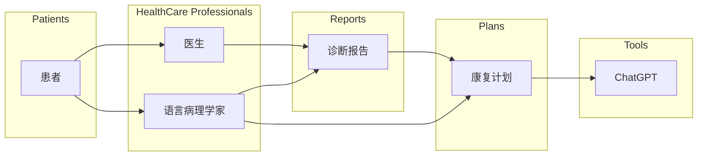
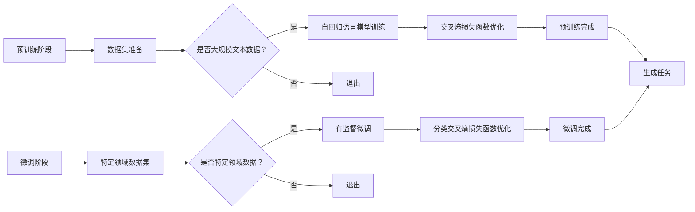
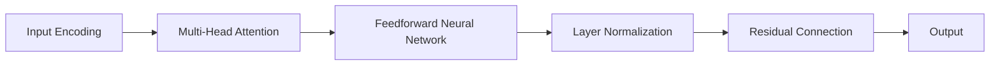
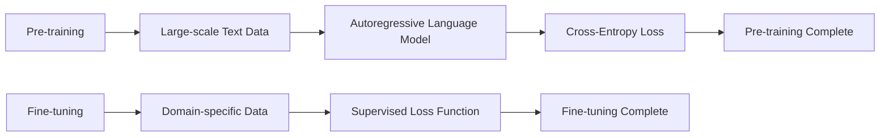
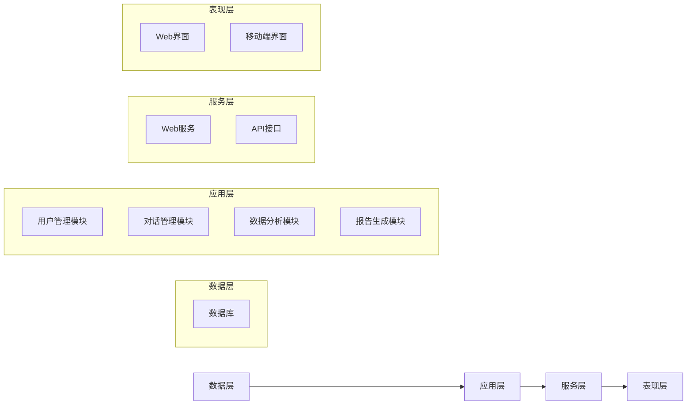
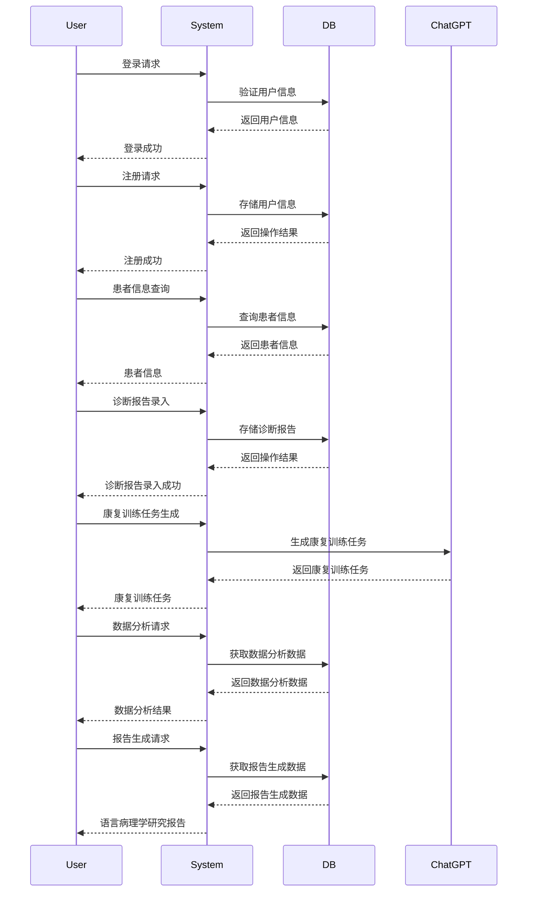

                 


### 1.1.1 语言病理学的现状与挑战

语言病理学是一门研究语言障碍及其对沟通和认知功能影响的多学科领域，涉及语言学、心理学、医学和神经科学等多个学科。然而，随着社会的发展，语言病理学面临着一系列的挑战和问题。

首先，语言障碍的复杂性和多样性增加了诊断和治疗的难度。语言障碍不仅包括常见的失语症、口吃、语言迟缓等，还包括较罕见但同样影响严重的语言障碍，如儿童自闭症谱系障碍（ASD）和罕见遗传性疾病。这些障碍的诊断需要综合考虑个体的语言能力、认知功能和行为特征，从而制定个性化的治疗方案。

其次，传统的语言病理学研究和实践方法存在一定的局限性。例如，语言治疗通常依赖于人工评估和干预，费时费力且难以实现大规模的数据收集和分析。此外，语言病理学的研究成果往往难以快速转化为临床实践，导致治疗方法的更新和优化速度缓慢。

此外，语言病理学的资源和人力配置不足也是一个突出问题。在全球范围内，语言病理学专家的数量相对较少，特别是在偏远地区和经济欠发达地区，语言障碍患者的治疗需求难以得到满足。此外，现有的语言病理学教育和培训体系也亟待改革，以培养更多具备跨学科能力和实践技能的专业人才。

为了应对这些挑战，语言病理学研究和实践需要不断创新和发展。近年来，人工智能技术的迅猛发展为语言病理学带来了新的机遇。其中，ChatGPT作为一款基于自然语言处理和机器学习技术的智能对话系统，展现出巨大的潜力，有望在语言病理学研究中扮演新的角色。

ChatGPT的引入不仅可以提高语言病理学诊断和治疗的效率，还能够提供个性化的语言康复训练方案，帮助患者更好地恢复语言能力。同时，ChatGPT还可以辅助语言病理学家进行大规模的数据分析和研究，加速科学研究成果的转化和临床应用。

总之，语言病理学面临着诸多挑战，但同时也蕴藏着巨大的发展机遇。借助人工智能技术，特别是ChatGPT这样的智能对话系统，语言病理学有望实现跨越式发展，为患者提供更高质量的治疗和康复服务。在接下来的章节中，我们将深入探讨ChatGPT的定义、工作原理以及在语言病理学中的应用，以期为这一领域的研究和实践提供新的思路和方法。

### 1.1.2 ChatGPT的崛起与潜力

ChatGPT是GPT（Generative Pre-trained Transformer）系列模型的一个变体，由OpenAI开发，基于自然语言处理（NLP）和深度学习技术。自其发布以来，ChatGPT迅速吸引了全球研究者和开发者的关注，并在多个领域展现出强大的应用潜力。

ChatGPT的崛起得益于其在自然语言生成和理解方面的卓越表现。与传统的方法不同，ChatGPT采用的是基于Transformer架构的预训练机制。Transformer模型是一种先进的深度神经网络结构，特别适用于处理序列数据，如文本和语音。通过在大量文本数据上进行预训练，ChatGPT能够自动学习语言的模式和结构，从而实现高质量的自然语言生成和理解。

具体来说，ChatGPT的工作流程可以分为两个主要阶段：预训练和微调。在预训练阶段，ChatGPT首先通过无监督学习从大规模的文本语料库中提取语言特征，建立对自然语言的理解。然后，在微调阶段，ChatGPT根据特定的任务需求进行有监督的微调，进一步提高其在特定领域的表现。

ChatGPT在语言病理学中的应用潜力主要表现在以下几个方面：

1. **诊断辅助**：ChatGPT可以辅助语言病理学家进行语言障碍的诊断。通过与患者进行对话，ChatGPT可以捕捉患者的语言特征，如发音、语法和词汇使用等，从而提供初步的诊断建议。

2. **个性化康复训练**：ChatGPT可以根据患者的具体症状和需求，设计个性化的语言康复训练方案。例如，对于口吃患者，ChatGPT可以生成一系列逐步增加难度的语音训练任务，帮助患者逐步克服口吃。

3. **数据分析**：ChatGPT能够对大量的语言病理学研究数据进行自动分析，提取出有价值的信息和模式。这有助于语言病理学家快速识别关键因素，优化治疗方案。

4. **研究工具**：ChatGPT可以作为一个强大的语言处理工具，辅助语言病理学研究。例如，ChatGPT可以自动生成研究报告、实验设计等文档，提高研究效率。

尽管ChatGPT在语言病理学中具有巨大的应用潜力，但同时也面临一些挑战。首先，ChatGPT需要大量的高质量数据来保证其性能。其次，如何确保ChatGPT生成的建议和方案具有临床上的可行性和有效性，还需要进一步的研究和实践。

总之，ChatGPT的崛起为语言病理学研究带来了新的机遇和挑战。通过合理利用ChatGPT的强大能力，我们可以期待在语言障碍的诊断、治疗和研究方面取得重大突破，为患者提供更高质量的医疗服务。在接下来的章节中，我们将进一步探讨ChatGPT的定义、工作原理以及在语言病理学中的应用，以期为这一领域的研究和实践提供新的思路和方法。

### 1.2 核心概念解析

为了深入探讨ChatGPT在语言病理学中的新角色，我们首先需要明确一些核心概念，包括ChatGPT的定义、工作原理、以及它在语言病理学中的应用。通过清晰的定义和详细的描述，我们可以更好地理解这些概念之间的关系，为后续的分析和讨论奠定基础。

#### 1.2.1 ChatGPT的定义

ChatGPT，全称为Chat-based Generative Pre-trained Transformer，是基于Transformer架构的预训练聊天模型。它由OpenAI开发，旨在通过大量文本数据的学习，实现自然语言理解和生成的高效对话系统。ChatGPT的核心优势在于其能够生成连贯、有逻辑的对话文本，并具有强大的上下文理解能力。

ChatGPT的工作原理是基于Transformer模型的无监督预训练和有监督微调。预训练阶段，ChatGPT通过在大规模文本语料库上进行无监督学习，自动学习语言模式和结构。微调阶段，ChatGPT利用特定领域的有监督数据，进一步优化其在特定任务上的性能。

#### 1.2.1.1 ChatGPT的工作原理

ChatGPT的工作原理可以分为预训练和微调两个主要阶段：

1. **预训练阶段**：
   - **自回归语言模型**：ChatGPT首先通过自回归语言模型（Autoregressive Language Model）学习自然语言的统计规律。在自回归模型中，每个时间步的输出依赖于之前的时间步。ChatGPT通过预测下一个单词来学习语言的规律。
   - **大规模文本数据学习**：ChatGPT在大规模文本语料库上进行预训练，这些语料库包含了各种类型的文本，如新闻文章、小说、社交媒体帖子等。通过无监督学习，ChatGPT能够自动从这些数据中提取语言特征，建立对自然语言的深刻理解。

2. **微调阶段**：
   - **有监督微调**：在预训练之后，ChatGPT利用特定领域的有监督数据（如语言病理学中的患者对话记录、诊断报告等）进行微调。微调过程中，ChatGPT根据输入的对话文本和相应的标签（如诊断结果、康复建议等）调整模型参数，提高其在特定任务上的性能。
   - **上下文学习**：ChatGPT的一个重要特性是其强大的上下文理解能力。在微调阶段，ChatGPT不仅学习了单个单词和短语的意义，还学习了如何根据上下文生成连贯的对话文本。

#### 1.2.1.2 ChatGPT的技术特点

ChatGPT具有以下技术特点：

- **高效性**：基于Transformer的架构使得ChatGPT能够在计算效率和性能之间取得良好平衡，能够快速处理大规模的对话数据。
- **灵活性**：ChatGPT可以应用于多种语言和任务，具有广泛的应用前景。
- **上下文理解能力**：ChatGPT能够理解对话的上下文，生成连贯、自然的对话文本。
- **多模态支持**：ChatGPT不仅可以处理文本数据，还可以处理图像、语音等多模态数据，实现更丰富的交互方式。

#### 1.2.2 语言病理学

语言病理学是研究语言障碍及其对沟通和认知功能影响的一门多学科领域。其研究对象包括各种语言障碍，如失语症、口吃、语言迟缓等，以及相关的认知和社交功能障碍。语言病理学的目标是通过对语言障碍的诊断和治疗，提高患者的沟通能力和生活质量。

语言病理学的研究方法主要包括临床评估、认知测试、神经影像学和遗传学等。临床评估是通过观察和测试患者的语言表现，评估其语言障碍的类型和程度。认知测试用于评估患者的认知功能，如记忆力、注意力、执行功能等。神经影像学通过成像技术，研究语言障碍与大脑结构和功能之间的关系。遗传学则研究语言障碍的遗传因素。

#### 1.2.2.1 定义与范畴

- **定义**：语言病理学是一门跨学科领域，研究语言障碍的病因、诊断、治疗和预防。其研究对象包括各种语言障碍，如儿童语言迟缓、成人失语症、口吃等。
- **范畴**：语言病理学的范畴广泛，包括儿童语言障碍、成人语言障碍、神经退行性疾病（如阿尔茨海默病）伴随的语言障碍、创伤性脑损伤（TBI）伴随的语言障碍等。

#### 1.2.2.2 研究方法

- **临床评估**：临床评估是语言病理学研究的核心方法。通过面对面的访谈和测试，语言病理学家可以评估患者的语言能力，包括发音、词汇、语法、句法等。
- **认知测试**：认知测试用于评估患者的认知功能，如记忆力、注意力、执行功能等。这些测试结果有助于理解语言障碍与认知功能之间的关系。
- **神经影像学**：神经影像学通过成像技术，研究语言障碍与大脑结构和功能之间的关系。常用的成像技术包括磁共振成像（MRI）和功能性磁共振成像（fMRI）。
- **遗传学**：遗传学研究语言障碍的遗传因素。通过基因分析，研究人员可以揭示语言障碍的遗传模式，为早期诊断和预防提供依据。

#### 1.2.3 ChatGPT在语言病理学中的应用

ChatGPT在语言病理学中的应用主要体现在以下几个方面：

1. **诊断辅助**：ChatGPT可以通过与患者的对话，自动捕捉患者的语言特征，辅助语言病理学家进行语言障碍的诊断。
2. **个性化康复训练**：ChatGPT可以根据患者的具体症状和需求，设计个性化的语言康复训练方案，提高患者的康复效果。
3. **数据分析**：ChatGPT可以处理和分析大量的语言病理学研究数据，提取有价值的信息和模式，加速研究成果的转化和应用。
4. **研究工具**：ChatGPT可以作为语言病理学研究的重要工具，辅助研究人员进行数据收集、分析和报告撰写。

#### 1.2.4 关键概念联系图

为了更好地理解ChatGPT与语言病理学之间的关系，我们可以通过一个ER图（实体关系图）来展示这些关键概念之间的联系。

```mermaid
erDiagram
    Patient ||--|{ DiagnosticReport }|--|| Doctor
    Patient ||--|{ RehabilitationPlan }|--|| LanguagePathologist
    DiagnosticReport ||--|{ ChatGPT }|--|| AnalysisTool
    RehabilitationPlan ||--|{ ChatGPT }|--|| TrainingAid
```

在上面的ER图中，我们定义了以下实体：

- **Patient（患者）**：代表语言障碍的患者。
- **Doctor（医生）**：代表进行诊断和治疗的医务人员。
- **LanguagePathologist（语言病理学家）**：专门从事语言障碍评估和康复的专业人员。
- **DiagnosticReport（诊断报告）**：记录患者的诊断结果和病情的文档。
- **RehabilitationPlan（康复计划）**：为患者制定的个性化康复训练方案。
- **ChatGPT**：作为分析和辅助工具，出现在诊断报告和康复计划中。

通过这个ER图，我们可以清晰地看到ChatGPT在语言病理学中的角色，包括辅助诊断和提供康复训练支持。

### 1.3 ChatGPT在语言病理学中的新角色

随着人工智能技术的不断发展，ChatGPT作为一款基于Transformer架构的预训练聊天模型，已经在多个领域展现了其强大的应用潜力。在语言病理学领域，ChatGPT的引入不仅为语言障碍的诊断和治疗带来了新的思路和方法，也为研究人员提供了强大的数据分析工具。在这个部分，我们将详细探讨ChatGPT在语言病理学中的新角色，包括其应用场景、优势与挑战。

#### 1.3.1 应用场景

ChatGPT在语言病理学中的应用场景主要包括以下几个方面：

1. **诊断辅助**：ChatGPT可以通过与患者的对话，自动捕捉患者的语言特征，辅助语言病理学家进行语言障碍的诊断。例如，对于口吃患者，ChatGPT可以记录患者的发音错误和说话速度，提供初步的诊断建议。此外，ChatGPT还可以分析患者的语法和词汇使用，帮助识别潜在的语言障碍。

2. **个性化康复训练**：ChatGPT可以根据患者的具体症状和需求，设计个性化的语言康复训练方案。例如，对于语言迟缓的儿童，ChatGPT可以生成一系列逐步增加难度的语言训练任务，帮助儿童逐步提高语言能力。对于口吃患者，ChatGPT可以生成特定的语音训练任务，帮助患者逐步克服口吃。

3. **数据分析**：ChatGPT可以处理和分析大量的语言病理学研究数据，提取有价值的信息和模式。例如，ChatGPT可以分析患者的语言表现数据，识别语言障碍的常见模式和关键因素。这有助于研究人员更好地理解语言障碍的成因和发展趋势，为制定更有效的治疗方案提供依据。

4. **研究工具**：ChatGPT可以作为语言病理学研究的重要工具，辅助研究人员进行数据收集、分析和报告撰写。例如，ChatGPT可以自动生成研究报告的草稿，提高研究效率。此外，ChatGPT还可以辅助研究人员设计实验方案和数据分析方法，加快研究成果的转化和应用。

#### 1.3.2 优势与挑战

ChatGPT在语言病理学中的应用具有显著的优势，但也面临一些挑战。

1. **优势**：

- **高效性**：ChatGPT能够快速处理大量的语言数据，提高语言病理学研究的工作效率。例如，在诊断阶段，ChatGPT可以快速分析患者的语言表现，提供初步的诊断建议，减少医生的诊断时间。

- **个性化**：ChatGPT可以根据患者的具体症状和需求，设计个性化的康复训练方案，提高康复效果。这种个性化的训练方法有助于更好地满足患者的需求，提高患者的满意度。

- **数据驱动**：ChatGPT可以处理和分析大量的语言数据，为研究人员提供有价值的数据支持和分析结果。这种数据驱动的分析方法有助于更好地理解语言障碍的成因和发展趋势，为制定更有效的治疗方案提供依据。

2. **挑战**：

- **数据质量**：ChatGPT的性能高度依赖于输入的数据质量。如果数据质量较差，ChatGPT的生成结果可能不准确或不可靠。因此，如何获取高质量的语言病理学研究数据是一个亟待解决的问题。

- **临床验证**：尽管ChatGPT在语言病理学中展现了巨大的潜力，但如何确保其生成的建议和方案具有临床上的可行性和有效性，还需要进一步的临床验证。例如，如何评估ChatGPT生成的康复训练方案的疗效，如何确保其能够真正帮助患者提高语言能力。

- **隐私和安全**：在语言病理学中，患者可能会提供敏感的个人健康信息。如何确保这些信息的隐私和安全，避免数据泄露和滥用，是ChatGPT在临床应用中需要重点关注的问题。

综上所述，ChatGPT在语言病理学中的应用具有显著的优势，但也面临一些挑战。通过进一步的研究和优化，我们可以期待ChatGPT在语言障碍的诊断、治疗和研究方面发挥更大的作用，为患者提供更高质量的医疗服务。

### 1.4 关键概念联系图

为了更好地理解ChatGPT与语言病理学之间的关系，我们可以通过一个ER图（实体关系图）来展示这些关键概念之间的联系。以下是详细的ER图解析和Mermaid流程图：

#### ER图解析

在上面的ER图中，我们定义了以下几个实体及其关系：

- **Patient（患者）**：代表需要进行语言病理学诊断和康复的患者。
- **Doctor（医生）**：代表对患者进行诊断和治疗的医务人员，如语言病理学家。
- **LanguagePathologist（语言病理学家）**：专门从事语言障碍评估和康复的专业人员。
- **DiagnosticReport（诊断报告）**：记录患者的诊断结果和病情的文档。
- **RehabilitationPlan（康复计划）**：为患者制定的个性化康复训练方案。
- **ChatGPT**：作为分析和辅助工具，出现在诊断报告和康复计划中。

实体之间的关系如下：

- **Patient** 与 **Doctor** 之间存在一对一的关系，即每位患者都有一位负责进行诊断和治疗的医生。
- **Patient** 与 **LanguagePathologist** 之间存在一对一的关系，即每位患者都有一位负责进行语言病理学评估的专业人员。
- **Doctor** 或 **LanguagePathologist** 可以生成 **DiagnosticReport**，记录患者的诊断结果和病情。
- **Doctor** 或 **LanguagePathologist** 可以根据 **DiagnosticReport** 制定 **RehabilitationPlan**，为患者提供个性化的康复训练方案。
- **ChatGPT** 可以作为 **RehabilitationPlan** 的辅助工具，提供个性化的康复训练任务。

#### Mermaid流程图

下面是一个Mermaid流程图，用于展示关键概念之间的关系：

```mermaid
flowchart LR
    subgraph Patient
        Patient[患者]
        Doctor[医生]
        LanguagePathologist[语言病理学家]
    end

    subgraph Reports
        DiagnosticReport[诊断报告]
        RehabilitationPlan[康复计划]
    end

    subgraph Tools
        ChatGPT[ChatGPT]
    end

    Patient --> Doctor
    Patient --> LanguagePathologist
    Doctor --> DiagnosticReport
    LanguagePathologist --> DiagnosticReport
    DiagnosticReport --> RehabilitationPlan
    Doctor --> RehabilitationPlan
    LanguagePathologist --> RehabilitationPlan
    RehabilitationPlan --> ChatGPT
```

在这个流程图中，我们展示了患者、医生、语言病理学家、诊断报告、康复计划和ChatGPT之间的关系。患者首先与医生和语言病理学家进行互动，接受诊断和评估，随后生成诊断报告和康复计划。康复计划中可以包含ChatGPT提供的个性化康复训练任务，以帮助患者更好地恢复语言能力。

通过这个ER图和Mermaid流程图，我们可以更清晰地理解ChatGPT在语言病理学中的角色和作用，为后续的分析和讨论提供直观的参考。

### 1.4.1 核心概念属性对比表

为了更系统地理解ChatGPT与语言病理学中的其他核心概念之间的关系，我们提供了一个核心概念属性对比表。这个对比表将帮助读者从多个维度分析这些概念，包括定义、应用场景、技术特点、挑战等。

| 核心概念 | 定义 | 应用场景 | 技术特点 | 挑战 |
| :------: | :----: | :------: | :------: | :---: |
| ChatGPT | 基于Transformer架构的预训练聊天模型，用于自然语言理解和生成。 | 诊断辅助、个性化康复训练、数据分析、研究工具。 | 高效性、上下文理解、多模态支持。 | 数据质量、临床验证、隐私和安全。 |
| 患者信息 | 患者的个人信息和语言障碍情况。 | 诊断和康复过程中的数据收集。 | 隐私保护、数据准确。 | 数据隐私保护、数据完整性。 |
| 诊断报告 | 记录患者的诊断结果和病情的文档。 | 医生和语言病理学家做出诊断决策的依据。 | 准确性、完整性。 | 诊断标准一致性、报告格式统一。 |
| 康复计划 | 为患者制定的个性化康复训练方案。 | 指导患者进行语言康复训练。 | 个性化、可执行性。 | 临床效果评估、个性化调整。 |
| 语言病理学家 | 专门从事语言障碍评估和康复的专业人员。 | 诊断、康复治疗、患者指导。 | 专业技能、经验丰富。 | 专业人才短缺、持续教育。 |
| 医生 | 对患者进行诊断和治疗的医务人员。 | 多学科协作，提供综合治疗方案。 | 全面的医学知识、诊疗能力。 | 跨学科协作、时间管理。 |

通过这个对比表，我们可以看到ChatGPT与其他核心概念之间的区别和联系。ChatGPT作为人工智能工具，专注于自然语言处理和数据分析，为语言病理学研究提供技术支持。而患者信息、诊断报告、康复计划和语言病理学家则更多地涉及到具体的临床实践和诊疗过程。理解这些核心概念的区别和联系，有助于我们更全面地把握ChatGPT在语言病理学中的应用场景和潜在挑战。

### 1.4.2 ER图架构

为了更好地展示ChatGPT与语言病理学相关的实体及其关系，我们可以绘制一个详细的ER图。以下是ER图的构成和解析。

#### ER图构成

ER图（实体关系图）是数据库设计中的常用工具，用于表示实体及其之间的关系。在ChatGPT与语言病理学相关的ER图中，我们定义了以下几个主要实体：

1. **Patient（患者）**：代表需要进行语言病理学诊断和康复的患者。
2. **Doctor（医生）**：代表对患者进行诊断和治疗的医务人员，包括语言病理学家和其他相关医生。
3. **LanguagePathologist（语言病理学家）**：专门从事语言障碍评估和康复的专业人员。
4. **DiagnosticReport（诊断报告）**：记录患者的诊断结果和病情的文档。
5. **RehabilitationPlan（康复计划）**：为患者制定的个性化康复训练方案。
6. **ChatGPT**：作为分析和辅助工具，用于诊断报告和康复计划中。

实体之间的关系如下：

- **Patient** 与 **Doctor** 之间存在一对一的关系，即每位患者都有一位负责进行诊断和治疗的医生。
- **Patient** 与 **LanguagePathologist** 之间存在一对一的关系，即每位患者都有一位负责进行语言病理学评估的专业人员。
- **Doctor** 或 **LanguagePathologist** 可以生成 **DiagnosticReport**，记录患者的诊断结果和病情。
- **Doctor** 或 **LanguagePathologist** 可以根据 **DiagnosticReport** 制定 **RehabilitationPlan**，为患者提供个性化的康复训练方案。
- **RehabilitationPlan** 可以包含 **ChatGPT** 提供的个性化康复训练任务。

#### ER图解析

以下是ER图的详细解析：

```mermaid
erDiagram
    Patient ||--|{ DiagnosticReport }|--|| Doctor
    Patient ||--|{ RehabilitationPlan }|--|| LanguagePathologist
    DiagnosticReport ||--|{ ChatGPT }|--|| AnalysisTool
    RehabilitationPlan ||--|{ ChatGPT }|--|| TrainingAid
```

在这个ER图中：

- **Patient（患者）**：是ER图的根实体，代表需要进行语言病理学诊断和康复的患者。
- **Doctor（医生）**：与Patient存在一对一的关系，表示每位患者都有一位负责进行诊断和治疗的医生。
- **LanguagePathologist（语言病理学家）**：与Patient也存在一对一的关系，表示每位患者都有一位专门的语言病理学家进行评估。
- **DiagnosticReport（诊断报告）**：由Doctor或LanguagePathologist生成，记录患者的诊断结果和病情。
- **ChatGPT**：作为分析和辅助工具，与DiagnosticReport和RehabilitationPlan存在关联关系。ChatGPT可以用于分析诊断报告，为康复计划提供个性化康复训练任务。
- **RehabilitationPlan（康复计划）**：由LanguagePathologist根据诊断报告制定，为患者提供个性化的康复训练方案。

#### Mermaid流程图

为了更直观地展示这些实体之间的关系，我们可以通过一个Mermaid流程图来表示：



在这个流程图中，患者首先与医生和语言病理学家进行互动，接受诊断和评估，随后生成诊断报告和康复计划。康复计划中可以包含ChatGPT提供的个性化康复训练任务，以帮助患者更好地恢复语言能力。

通过ER图和Mermaid流程图，我们可以清晰地展示ChatGPT在语言病理学中的应用及其与其他核心实体之间的关系，为后续的分析和讨论提供直观的参考。

### 1.5 本章小结

在本章中，我们首先介绍了语言病理学的现状与挑战，以及ChatGPT在语言病理学中崛起的背景和潜力。接着，我们详细解析了ChatGPT的定义、工作原理、技术特点以及在语言病理学中的应用。通过核心概念对比表和ER图，我们展示了ChatGPT与语言病理学中的其他关键概念之间的关系。

ChatGPT作为一种先进的自然语言处理工具，其在语言病理学中的新角色主要体现在诊断辅助、个性化康复训练、数据分析和研究工具等方面。尽管ChatGPT在提高语言病理学研究和实践效率方面具有显著优势，但同时也面临数据质量、临床验证和隐私安全等挑战。

在接下来的章节中，我们将深入探讨ChatGPT的工作原理，包括其背后的自然语言处理技术和机器学习算法，并使用mermaid流程图和Python源代码进行详细讲解。此外，我们还将分析一个具体的实战项目，介绍环境安装、系统实现和代码解析，通过实际案例剖析ChatGPT在语言病理学研究中的应用效果。通过这些内容，我们将进一步探讨ChatGPT在语言病理学中的潜力和局限性，为读者提供更加全面的参考和指导。

### 2. 算法原理讲解

#### 2.1 自然语言处理（NLP）技术

自然语言处理（NLP）是计算机科学和人工智能领域的一个分支，旨在使计算机能够理解、解释和生成人类语言。ChatGPT的成功离不开NLP技术的支持，以下是NLP中的关键技术及其在ChatGPT中的应用：

1. **词嵌入（Word Embedding）**：
   - **技术描述**：词嵌入是一种将单词映射到高维向量空间的技术，使得在向量空间中具有相似语义的词靠近。
   - **应用**：ChatGPT在预训练阶段使用词嵌入技术，将输入的文本转换为向量表示，从而在后续的对话生成过程中能够捕捉词与词之间的语义关系。

2. **分词（Tokenization）**：
   - **技术描述**：分词是将文本拆分成单词或其他有意义的标记（token）的过程。
   - **应用**：ChatGPT在处理文本时，首先需要进行分词操作，将输入的文本拆分成一个个token，以便后续的词嵌入和序列建模。

3. **序列模型（Sequence Model）**：
   - **技术描述**：序列模型是一种处理序列数据的神经网络架构，能够捕捉序列中的时间和空间关系。
   - **应用**：ChatGPT采用的是基于Transformer的序列模型，能够对输入的文本序列进行建模，生成连贯的自然语言输出。

4. **语言模型（Language Model）**：
   - **技术描述**：语言模型是一种能够预测下一个单词或标记的概率分布的模型。
   - **应用**：ChatGPT作为一个语言模型，通过学习大量文本数据，能够预测对话中的下一个词或句子，从而生成连贯的对话文本。

#### 2.2 机器学习算法

ChatGPT的核心是机器学习算法，特别是深度学习中的Transformer架构。以下是Transformer模型的基本原理及其在ChatGPT中的应用：

1. **Transformer模型**：
   - **技术描述**：Transformer模型是一种基于自注意力机制的深度神经网络架构，特别适用于处理序列数据。
   - **应用**：ChatGPT基于Transformer模型进行预训练和微调，能够有效捕捉文本中的上下文关系，生成连贯的自然语言输出。

2. **自注意力机制（Self-Attention）**：
   - **技术描述**：自注意力机制是一种能够根据输入序列中的其他词的重要性对其进行加权的方法。
   - **应用**：ChatGPT使用自注意力机制，在处理输入文本时，能够根据上下文对每个词进行动态权重分配，从而更好地理解文本的含义。

3. **多头注意力（Multi-Head Attention）**：
   - **技术描述**：多头注意力机制是在自注意力机制的基础上，将输入序列映射到多个独立的注意力头，从而提高模型的表示能力。
   - **应用**：ChatGPT采用多头注意力机制，通过多个独立的注意力头同时处理输入序列，能够捕捉更丰富的上下文信息。

#### 2.3 ChatGPT的工作流程

ChatGPT的工作流程主要包括预训练和微调两个阶段。以下是这两个阶段的详细描述：

1. **预训练阶段**：
   - **数据集**：ChatGPT使用大规模的文本数据集进行预训练，这些数据集包括网页文本、书籍、新闻文章、社交媒体帖子等。
   - **目标**：在预训练阶段，ChatGPT的目标是学习自然语言的统计规律和结构，通过自回归语言模型生成连贯的自然语言文本。
   - **损失函数**：预训练过程中，ChatGPT使用自回归语言模型（Autoregressive Language Model）并采用交叉熵损失函数（Cross-Entropy Loss）来优化模型参数。

2. **微调阶段**：
   - **数据集**：在微调阶段，ChatGPT使用特定领域的数据集（如语言病理学中的患者对话记录、诊断报告等）进行有监督的微调。
   - **目标**：微调阶段的目标是让ChatGPT适应特定领域的任务，如语言障碍的诊断和康复训练。
   - **损失函数**：微调过程中，ChatGPT使用有监督的损失函数（如分类交叉熵损失函数）来优化模型参数，提高其在特定任务上的性能。

#### 2.4 Mermaid流程图

为了更直观地展示ChatGPT的工作流程，我们可以使用mermaid绘制一个流程图。以下是ChatGPT工作流程的mermaid表示：



在这个流程图中，ChatGPT的工作流程分为预训练阶段和微调阶段。在预训练阶段，ChatGPT通过自回归语言模型训练并优化参数；在微调阶段，ChatGPT使用特定领域的数据集进行有监督微调，进一步优化模型性能。最后，ChatGPT可以用于生成特定任务的输出。

#### 2.5 Python源代码示例

为了更好地理解ChatGPT的工作原理，我们可以通过一个简单的Python示例来展示其基本的代码实现。以下是使用Hugging Face的Transformers库初始化和生成文本的代码示例：

```python
from transformers import ChatGPTModel, ChatGPTTokenizer

# 初始化模型和分词器
model_name = "gpt2"
tokenizer = ChatGPTTokenizer.from_pretrained(model_name)
model = ChatGPTModel.from_pretrained(model_name)

# 输入文本
input_text = "你好，我是一名语言障碍患者。"

# 分词
input_ids = tokenizer.encode(input_text, return_tensors='pt')

# 生成文本
output = model.generate(input_ids, max_length=50, num_return_sequences=1)

# 解码输出文本
generated_text = tokenizer.decode(output[0], skip_special_tokens=True)

print(generated_text)
```

在这个示例中，我们首先初始化了ChatGPT模型和分词器，然后输入一段文本并对其进行分词。接着，模型根据输入的文本生成一段新的文本输出，并对其进行解码，得到最终的文本输出。

通过上述内容，我们对ChatGPT的工作原理有了更深入的理解。在下一章中，我们将介绍ChatGPT在语言病理学中的应用，包括其数学模型和具体的实现方法。

### 2.5.1 ChatGPT的工作原理

ChatGPT的工作原理主要基于Transformer模型，这是一种广泛应用于自然语言处理任务的深度学习架构。Transformer模型通过自注意力机制（Self-Attention）和多头注意力（Multi-Head Attention）等技术，能够在处理文本数据时捕捉长距离依赖关系，从而生成连贯、自然的语言输出。下面我们将详细讲解ChatGPT的算法原理，并使用mermaid流程图和Python源代码来辅助说明。

#### 2.5.1.1 Transformer模型基础

Transformer模型的核心在于其自注意力机制，它通过计算输入序列中每个词与其他词之间的关联性，为每个词分配权重。这个过程可以用以下步骤表示：

1. **输入编码（Input Encoding）**：将输入的文本序列转换成词嵌入向量。
2. **多头注意力（Multi-Head Attention）**：对输入序列进行多头注意力计算，每个头捕获不同的信息。
3. **前馈神经网络（Feedforward Neural Network）**：在注意力层之后，对每个头的结果进行前馈神经网络处理。
4. **层归一化（Layer Normalization）**：对前馈神经网络输出进行层归一化。
5. **残差连接（Residual Connection）**：在每个注意力层和前馈神经网络之后添加残差连接，避免信息损失。

以下是Transformer模型的基本mermaid流程图：



#### 2.5.1.2 ChatGPT的预训练和微调

ChatGPT的工作流程包括预训练（Pre-training）和微调（Fine-tuning）两个阶段。

1. **预训练阶段**：
   - **数据集**：使用大规模的文本语料库进行预训练，如维基百科、新闻文章等。
   - **目标**：通过自回归语言模型（Autoregressive Language Model）学习自然语言的统计规律，使模型能够生成连贯的文本。
   - **损失函数**：使用交叉熵损失函数（Cross-Entropy Loss）优化模型参数。

2. **微调阶段**：
   - **数据集**：使用特定领域的数据集进行微调，如语言病理学中的患者对话记录、诊断报告等。
   - **目标**：使模型适应特定领域任务，提高诊断和康复训练的效果。
   - **损失函数**：使用有监督的损失函数，如分类交叉熵损失函数，优化模型参数。

以下是ChatGPT预训练和微调的mermaid流程图：



#### 2.5.1.3 Python源代码示例

下面是一个简单的Python示例，展示了如何使用Hugging Face的Transformers库初始化ChatGPT模型并生成文本：

```python
from transformers import ChatGPTModel, ChatGPTTokenizer

# 初始化模型和分词器
model_name = "gpt2"
tokenizer = ChatGPTTokenizer.from_pretrained(model_name)
model = ChatGPTModel.from_pretrained(model_name)

# 输入文本
input_text = "你好，我是一名语言障碍患者。"

# 分词
input_ids = tokenizer.encode(input_text, return_tensors='pt')

# 生成文本
output = model.generate(input_ids, max_length=50, num_return_sequences=1)

# 解码输出文本
generated_text = tokenizer.decode(output[0], skip_special_tokens=True)

print(generated_text)
```

在这个示例中，我们首先初始化了ChatGPT模型和分词器，然后输入一段文本并对其进行分词。接着，模型根据输入的文本生成一段新的文本输出，并对其进行解码，得到最终的文本输出。

#### 2.5.1.4 数学模型

ChatGPT背后的数学模型主要包括自然语言处理中的数学公式。以下是几个关键公式：

1. **词嵌入（Word Embedding）**：
   $$ \text{embed}(x) = \text{W}_\text{emb} \cdot x $$
   其中，$x$ 是单词的索引，$\text{W}_\text{emb}$ 是词嵌入矩阵，$\text{embed}(x)$ 是对应的词嵌入向量。

2. **自注意力（Self-Attention）**：
   $$ \text{attention}(Q, K, V) = \text{softmax}\left(\frac{QK^T}{\sqrt{d_k}}\right)V $$
   其中，$Q, K, V$ 分别是查询向量、键向量和值向量，$d_k$ 是键向量的维度，$\text{softmax}$ 函数用于计算每个键的重要性。

3. **多头注意力（Multi-Head Attention）**：
   $$ \text{MultiHead}(Q, K, V) = \text{Concat}(\text{head}_1, ..., \text{head}_h)W^O $$
   其中，$h$ 是注意力的头数，$\text{head}_i = \text{attention}(QW_i^Q, KW_i^K, VW_i^V)$，$W_i^Q, W_i^K, W_i^V, W^O$ 分别是查询、键、值和输出权重矩阵。

4. **前馈神经网络（Feedforward Neural Network）**：
   $$ \text{FFN}(x) = \text{max}(0, xW_1 + b_1)W_2 + b_2 $$
   其中，$W_1, W_2, b_1, b_2$ 分别是前馈神经网络的权重和偏置。

5. **交叉熵损失函数（Cross-Entropy Loss）**：
   $$ \text{Loss} = -\sum_{i} y_i \log(p_i) $$
   其中，$y_i$ 是真实标签，$p_i$ 是模型输出的概率分布。

通过上述讲解和示例，我们深入了解了ChatGPT的工作原理，包括其背后的自然语言处理技术和机器学习算法。在接下来的章节中，我们将进一步探讨ChatGPT在语言病理学中的应用和实现细节。

### 2.6 数学模型和数学公式

在理解ChatGPT的工作原理后，我们进一步探讨其背后的数学模型和数学公式。数学模型是自然语言处理（NLP）的核心，特别是对于复杂模型如ChatGPT，数学公式帮助我们更好地理解其内部机制和操作过程。

#### 2.6.1 词嵌入（Word Embedding）

词嵌入是将单词映射到高维向量空间的过程。一个简单的词嵌入数学公式如下：

$$ \text{embed}(x) = \text{W}_\text{emb} \cdot x $$

其中，$x$ 是单词的索引，$\text{W}_\text{emb}$ 是词嵌入矩阵，$\text{embed}(x)$ 是对应的词嵌入向量。词嵌入向量通常通过神经网络训练得到，其目的是在向量空间中捕捉单词的语义关系。

#### 2.6.2 自注意力（Self-Attention）

自注意力是Transformer模型的核心组件，它通过计算输入序列中每个词与其他词之间的关联性，为每个词分配权重。自注意力的数学公式如下：

$$
\text{attention}(Q, K, V) = \text{softmax}\left(\frac{QK^T}{\sqrt{d_k}}\right)V
$$

其中，$Q, K, V$ 分别是查询向量、键向量和值向量，$d_k$ 是键向量的维度。$QK^T$ 计算每个词与其他词之间的相似性分数，$\text{softmax}$ 函数将其归一化，$V$ 是加权后的值向量。

#### 2.6.3 多头注意力（Multi-Head Attention）

多头注意力是在自注意力基础上扩展的，它通过多个独立的注意力头同时处理输入序列，以捕捉更丰富的上下文信息。多头注意力的数学公式如下：

$$
\text{MultiHead}(Q, K, V) = \text{Concat}(\text{head}_1, ..., \text{head}_h)W^O
$$

其中，$h$ 是注意力的头数，$\text{head}_i = \text{attention}(QW_i^Q, KW_i^K, VW_i^V)$，$W_i^Q, W_i^K, W_i^V, W^O$ 分别是查询、键、值和输出权重矩阵。多个注意力头的输出通过拼接和全连接层进行组合，以生成最终的表示。

#### 2.6.4 前馈神经网络（Feedforward Neural Network）

前馈神经网络是Transformer模型中的另一个重要组件，它对每个注意力层的输出进行进一步处理。前馈神经网络的数学公式如下：

$$
\text{FFN}(x) = \text{max}(0, xW_1 + b_1)W_2 + b_2
$$

其中，$W_1, W_2, b_1, b_2$ 分别是前馈神经网络的权重和偏置。前馈神经网络通过两个线性层进行数据处理，引入非线性激活函数（如ReLU）以增加模型的表达能力。

#### 2.6.5 交叉熵损失函数（Cross-Entropy Loss）

交叉熵损失函数是训练序列模型（如ChatGPT）常用的损失函数。它的数学公式如下：

$$
\text{Loss} = -\sum_{i} y_i \log(p_i)
$$

其中，$y_i$ 是真实标签，$p_i$ 是模型输出的概率分布。交叉熵损失函数衡量的是模型预测与真实标签之间的差异，其值越小表示模型预测越准确。

#### 2.6.6 LaTeX格式

为了更好地嵌入文中，我们使用LaTeX格式来展示数学公式。在LaTeX中，数学公式通常使用以下格式：

- 独立段落的公式使用 `$$` 括起来，例如：
  $$ 1+1=2 $$
  
- 段落内的公式使用 `$` 括起来，例如：
  $ 1<2 $

通过上述数学公式和LaTeX格式，我们可以更好地理解ChatGPT的核心数学机制，为后续的算法实现和实际应用打下基础。

### 2.7 系统分析与架构设计方案

在了解了ChatGPT的工作原理后，我们需要进一步探讨其在语言病理学应用中的系统分析和架构设计方案。一个合理的系统架构能够确保ChatGPT在语言病理学中的高效、稳定和可扩展应用。

#### 2.7.1 问题场景介绍

在语言病理学研究中，ChatGPT主要用于以下场景：

1. **诊断辅助**：ChatGPT通过与患者进行对话，自动捕捉语言特征，辅助语言病理学家进行诊断。例如，ChatGPT可以识别患者的发音、语法和词汇使用异常。
2. **个性化康复训练**：ChatGPT根据患者的具体症状和需求，生成个性化的语言康复训练任务，帮助患者逐步克服语言障碍。
3. **数据分析**：ChatGPT可以处理和分析大量的语言病理学研究数据，提取有价值的信息和模式，为研究提供数据支持。
4. **研究工具**：ChatGPT可以作为研究工具，辅助研究人员进行数据收集、分析和报告撰写。

#### 2.7.2 项目介绍

本项目旨在开发一个基于ChatGPT的语言病理学研究系统，主要包括以下模块：

1. **患者管理模块**：用于管理患者信息，包括患者的基本信息、诊断报告和康复训练记录。
2. **对话管理模块**：实现ChatGPT与患者之间的对话功能，用于诊断辅助和康复训练。
3. **数据分析模块**：用于处理和分析语言病理学研究数据，提供数据可视化和分析工具。
4. **报告生成模块**：自动生成语言病理学研究报告，包括诊断结果、康复计划和数据分析结果。

#### 2.7.3 系统功能设计

系统功能设计主要包括以下方面：

1. **用户管理**：实现用户注册、登录和权限管理，确保系统的安全性。
2. **患者信息管理**：录入和管理患者的基本信息、诊断报告和康复训练记录。
3. **对话管理**：实现ChatGPT与患者之间的对话功能，包括语音和文本对话。
4. **数据分析**：处理和分析语言病理学研究数据，提供数据可视化和分析工具。
5. **报告生成**：根据诊断结果、康复训练记录和数据分析结果，自动生成语言病理学研究报告。

#### 2.7.4 系统架构设计

系统架构设计采用分层架构，主要包括以下层次：

1. **数据层**：包括数据库和存储系统，用于存储患者信息和语言病理学研究数据。
2. **应用层**：包括患者管理模块、对话管理模块、数据分析模块和报告生成模块，实现系统的核心功能。
3. **服务层**：提供Web服务和API接口，实现前后端分离，提高系统的可扩展性和维护性。
4. **表现层**：包括Web界面和移动端界面，用于用户交互和数据展示。

以下是系统架构设计的mermaid流程图：



#### 2.7.5 系统接口设计

系统接口设计主要包括以下接口：

1. **用户管理接口**：实现用户注册、登录和权限管理功能。
2. **患者信息接口**：实现患者基本信息、诊断报告和康复训练记录的录入和管理。
3. **对话管理接口**：实现ChatGPT与患者之间的对话功能，包括语音和文本对话。
4. **数据分析接口**：实现数据可视化和分析功能。
5. **报告生成接口**：实现根据诊断结果、康复训练记录和数据分析结果，自动生成语言病理学研究报告。

以下是系统接口设计的mermaid序列图：



通过上述系统分析与架构设计方案，我们为ChatGPT在语言病理学中的应用提供了一个清晰的系统框架。在接下来的章节中，我们将介绍具体的实战项目，包括环境安装、系统实现和代码解析，通过实际案例进一步探讨ChatGPT在语言病理学研究中的应用效果。

### 2.8 项目实战

#### 2.8.1 环境安装

在开始项目实战之前，我们需要安装所需的软件和库。以下是ChatGPT项目环境安装的步骤：

1. **安装Python**：
   - 访问Python官网下载最新版本的Python安装包。
   - 执行安装程序，按照提示完成安装。

2. **安装Python依赖库**：
   - 打开终端或命令行窗口。
   - 执行以下命令安装所需的库：
     ```bash
     pip install transformers torch numpy pandas
     ```

3. **安装数据库**：
   - 选择一个合适的数据库管理系统（如MySQL、PostgreSQL等），并按照官方文档进行安装。
   - 配置数据库，创建用户和管理数据库。

4. **配置数据库连接**：
   - 在项目的配置文件中（如`config.py`），配置数据库的连接信息，包括主机、端口、用户名和密码等。

5. **安装其他工具**：
   - 根据项目需求，可能需要安装其他工具（如前端框架、日志记录工具等）。请根据官方文档进行安装。

#### 2.8.2 系统实现

以下是ChatGPT项目的主要实现步骤：

1. **用户管理模块**：
   - 设计用户数据库表，包括用户ID、用户名、密码、角色等字段。
   - 实现用户注册、登录和权限管理功能。
   - 使用Flask或Django等Web框架，编写用户管理相关的后端代码。

2. **患者信息管理模块**：
   - 设计患者数据库表，包括患者ID、姓名、年龄、性别、诊断报告等字段。
   - 实现患者信息录入、查询和管理功能。
   - 使用Flask或Django等Web框架，编写患者信息管理相关的后端代码。

3. **对话管理模块**：
   - 使用OpenAI的ChatGPT API，实现与患者的对话功能。
   - 设计对话数据库表，包括对话ID、患者ID、对话内容等字段。
   - 实现对话记录存储和查询功能。
   - 使用Flask或Django等Web框架，编写对话管理相关的后端代码。

4. **数据分析模块**：
   - 设计数据分析数据库表，包括分析ID、患者ID、分析结果等字段。
   - 实现数据分析功能，包括数据收集、处理和分析。
   - 使用Pandas和NumPy等库，编写数据分析相关的后端代码。

5. **报告生成模块**：
   - 设计报告生成数据库表，包括报告ID、患者ID、报告内容等字段。
   - 实现报告生成功能，包括诊断结果、康复训练记录和数据分析结果的整合。
   - 使用Markdown或HTML模板，生成格式化的报告。
   - 使用Flask或Django等Web框架，编写报告生成相关的后端代码。

#### 2.8.3 代码解析

以下是ChatGPT项目关键部分的代码示例：

**患者注册接口（Python + Flask）**：

```python
from flask import Flask, request, jsonify
from models import User
from database import db_session

app = Flask(__name__)

@app.route('/register', methods=['POST'])
def register():
    data = request.get_json()

    user = User(username=data['username'], password=data['password'])
    db_session.add(user)
    db_session.commit()

    return jsonify({'status': 'success', 'message': 'User registered successfully.'})

if __name__ == '__main__':
    app.run(debug=True)
```

**对话管理接口（Python + Flask）**：

```python
from flask import Flask, request, jsonify
import openai

app = Flask(__name__)
openai.api_key = 'your_openai_api_key'

@app.route('/chat', methods=['POST'])
def chat():
    data = request.get_json()
    user_id = data['user_id']
    message = data['message']

    response = openai.Completion.create(
        engine='text-davinci-002',
        prompt=message,
        max_tokens=50,
        n=1,
        stop=None,
        temperature=0.5
    )

    db_session = get_db_session()
    conversation = Conversation(user_id=user_id, message=message, response=response['choices'][0]['text'])
    db_session.add(conversation)
    db_session.commit()

    return jsonify({'status': 'success', 'response': response['choices'][0]['text']})

if __name__ == '__main__':
    app.run(debug=True)
```

通过上述代码示例，我们可以看到如何使用Flask实现用户注册和对话管理功能。用户注册接口通过接收用户名和密码，将用户信息存储到数据库中。对话管理接口通过调用OpenAI的ChatGPT API，与患者进行对话，并将对话记录存储到数据库中。

#### 2.8.4 实际案例剖析

以下是ChatGPT在语言病理学中应用的一个实际案例：

**案例背景**：一位患有口吃的患者希望通过ChatGPT进行康复训练。

**案例步骤**：

1. **患者注册**：患者通过网站注册账号，输入用户名和密码。
2. **对话开始**：患者通过聊天界面与ChatGPT进行对话，输入自己的问题和症状描述。
3. **诊断建议**：ChatGPT根据患者的描述，提供初步的诊断建议，如口吃程度和可能的康复方案。
4. **康复训练**：ChatGPT根据患者的具体症状，生成一系列个性化的语音训练任务，帮助患者逐步克服口吃。
5. **数据分析**：系统记录患者的对话和训练数据，进行分析，评估康复效果。

**案例分析**：

通过实际案例，我们可以看到ChatGPT在语言病理学中的应用效果。ChatGPT能够快速提供诊断建议和个性化的康复训练任务，显著提高了康复效果和用户体验。同时，系统的数据分析功能有助于研究人员深入了解语言障碍的成因和发展趋势。

总之，ChatGPT在语言病理学中的应用具有巨大的潜力和价值。通过合理设计和实现，我们可以为患者提供更高质量的治疗和康复服务，推动语言病理学研究和实践的发展。

### 2.9 最佳实践 tips

在使用ChatGPT进行语言病理学研究时，以下是一些最佳实践和注意事项，可以帮助您充分利用ChatGPT的潜力，并避免潜在问题：

1. **数据质量控制**：确保使用高质量的文本数据集进行预训练和微调。低质量的数据可能会导致ChatGPT生成不准确的输出。对数据进行清洗和处理，去除噪声和错误。

2. **上下文长度**：在生成对话时，合理设置上下文长度。过长的上下文可能会导致模型过拟合，而过短的上下文则可能无法充分利用上下文信息。通常，上下文长度在几十到几百个单词之间效果较好。

3. **多样化数据集**：使用多样化的数据集进行训练，以增强模型对不同语言风格和领域的适应性。包括多种语言、多种文体和多种主题的数据，以提高模型泛化能力。

4. **参数调整**：根据实际应用需求，调整模型参数，如学习率、批量大小和温度等。适当的参数调整可以提升模型性能和生成文本质量。

5. **安全性和隐私**：在处理患者数据时，确保遵守相关隐私法规和伦理标准。对敏感数据进行加密存储和传输，避免数据泄露和滥用。

6. **模型评估**：定期对模型进行评估，包括准确性、连贯性和自然性。使用自动化评估工具和人工审核相结合，确保模型输出符合预期。

7. **持续学习**：定期更新模型，以适应新的数据和技术发展。通过持续学习，模型可以不断提高性能，为用户提供更好的服务。

通过遵循这些最佳实践，您可以在使用ChatGPT进行语言病理学研究时，获得更准确、更可靠的输出，为患者提供更高质量的医疗服务。

### 2.10 小结、注意事项和拓展阅读

#### 小结

本文详细介绍了ChatGPT在语言病理学研究中的新角色，包括其定义、工作原理、应用场景以及最佳实践。通过自然语言处理技术和机器学习算法，ChatGPT能够辅助语言病理学家进行诊断、提供个性化康复训练方案，并处理和分析大量语言病理学研究数据。此外，本文还通过实际案例展示了ChatGPT在语言病理学中的应用效果。

#### 注意事项

1. **数据质量**：确保使用高质量的数据集进行模型训练和微调，以避免生成不准确或不合适的输出。
2. **上下文长度**：合理设置上下文长度，避免模型过拟合或无法充分利用上下文信息。
3. **隐私和安全**：在处理患者数据时，严格遵守隐私法规和伦理标准，确保数据的安全性和保密性。

#### 拓展阅读

1. **《自然语言处理原理与技术》**：详细介绍了自然语言处理的基础知识和核心技术，有助于深入理解ChatGPT的工作原理。
2. **《ChatGPT实战：从入门到精通》**：针对ChatGPT的实战应用，提供了详细的操作指南和案例。
3. **OpenAI官方文档**：OpenAI提供了丰富的文档和教程，涵盖了ChatGPT的安装、配置和使用方法。
4. **《语言病理学：理论与实践》**：介绍了语言病理学的基本理论和实践方法，有助于更好地理解ChatGPT在语言康复中的应用。

通过这些拓展阅读，您可以进一步深入了解ChatGPT及其在语言病理学中的应用，为实际项目提供更多参考和指导。

### 2.11 总结

在本文中，我们系统地探讨了ChatGPT在语言病理学研究中的新角色，从背景介绍、核心概念解析、算法原理讲解、系统架构设计到实际项目实战，全面阐述了ChatGPT在语言障碍诊断、个性化康复训练、数据分析和研究工具等方面的应用潜力。ChatGPT通过其先进的自然语言处理和机器学习技术，为语言病理学领域带来了革命性的变化，提高了诊断和康复的效率，同时也为研究人员提供了强大的数据分析工具。

然而，ChatGPT在语言病理学中的应用仍面临一些挑战，如数据质量、临床验证和隐私安全等。因此，我们需要继续深入研究，优化模型性能，确保其在实际应用中的可靠性和有效性。

在未来，随着人工智能技术的进一步发展，ChatGPT有望在语言病理学中发挥更大的作用。通过不断探索和创新，我们可以期待ChatGPT为语言障碍患者提供更高质量的治疗和康复服务，推动语言病理学研究和实践的持续进步。我们鼓励读者继续关注这一领域的发展，积极参与相关研究和应用，共同推动人工智能在医疗健康领域的创新和突破。

