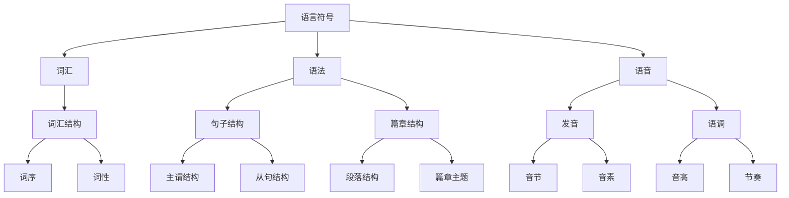
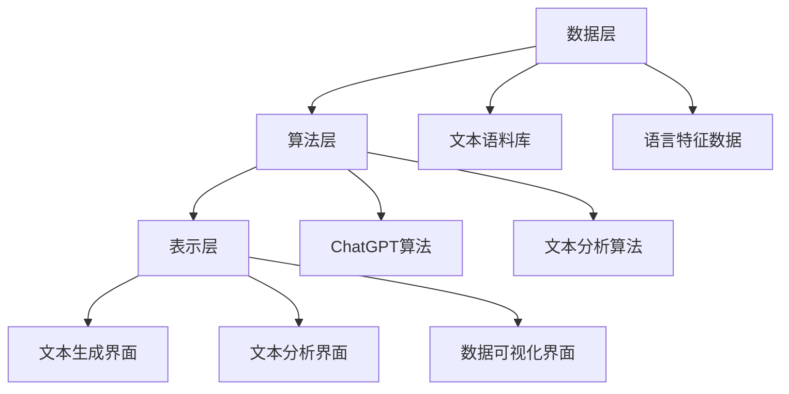
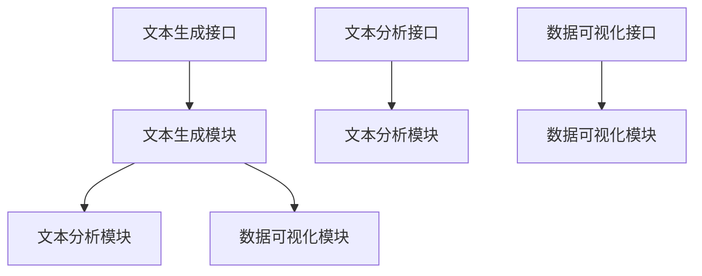

                 

### 《ChatGPT在语言起源假说验证中的应用：模拟原始语言形成》

关键词：ChatGPT、语言起源假说、模拟原始语言、深度学习、算法原理

摘要：本文将探讨ChatGPT在语言起源假说验证中的应用，通过模拟原始语言的形成过程，深入分析ChatGPT的工作原理、算法模型及其在语言起源研究中的潜在价值。文章将从背景介绍、核心概念、算法原理、系统设计与实现等多个方面展开论述，旨在为读者提供一个全面、系统的理解。

### 第一部分：背景介绍与核心概念

#### 第1章：问题背景与核心概念

##### 1.1 语言起源假说的历史与现状

语言起源一直是语言学、人类学和心理学等领域的重要研究课题。历史上，关于语言起源的假说众多，主要包括本能论、模仿论、工具论等。其中，本能论认为语言是人类与生俱来的本能，模仿论强调语言是通过模仿环境中的声音和动作而形成的，工具论则认为语言是为了适应生存需求而逐渐发展出来的。

目前，语言起源研究仍处于探索阶段，各种假说尚未得到充分验证。随着人工智能技术的发展，特别是ChatGPT这样的自然语言处理模型的兴起，为语言起源的研究提供了新的思路和工具。

##### 1.2 ChatGPT的概念与特点

ChatGPT是由OpenAI开发的一种基于变换器（Transformer）架构的预训练语言模型。它通过在大量文本语料库上预训练，掌握了丰富的语言知识和模式，能够生成流畅、符合语法规则的自然语言文本。

ChatGPT的主要特点包括：

- 强大的语言理解能力：ChatGPT能够理解并生成多种语言，包括自然语言中的语法、语义和上下文信息。
- 高效的生成速度：ChatGPT在生成文本时具有很高的速度，能够在短时间内生成大量文本。
- 广泛的应用领域：ChatGPT在自然语言处理、机器翻译、文本生成、对话系统等领域具有广泛的应用。

##### 1.3 原始语言的形成

原始语言的形成是语言学研究中的一个关键问题。一般认为，原始语言是一种简陋、不规范的语言，具有以下特点：

- 语法简单：原始语言的语法结构相对简单，缺乏复杂的句法和语序规则。
- 词汇贫乏：原始语言的词汇量较少，许多词汇可能是由音节或单个词语组成的。
- 功能有限：原始语言主要用于日常交流、劳动分工和社交互动，功能相对有限。

ChatGPT在模拟原始语言形成中的应用，主要体现在以下几个方面：

- 模拟原始语言环境：通过在特定环境下的训练，ChatGPT可以生成符合原始语言特征的文本。
- 探索语言演化过程：ChatGPT可以模拟不同阶段的原始语言形成过程，为研究语言演化提供数据支持。
- 验证语言起源假说：ChatGPT生成的原始语言文本可以用于验证各种语言起源假说的可行性。

##### 1.4 语言起源假说验证的意义

语言起源假说的验证对于理解人类语言的起源、发展和演化具有重要意义。通过验证各种假说，我们可以更好地理解人类语言的本质，揭示语言与认知、文化和社会的复杂关系。

同时，语言起源假说的验证也具有以下潜在影响：

- 科学研究：语言起源假说的验证为语言学、人类学、心理学等领域提供了新的研究方向和方法。
- 人类认知：语言起源的探究有助于我们更深入地理解人类认知的起源和发展。
- 社会发展：语言起源的研究可能对教育、语言规划、文化交流等领域产生深远影响。

### 第二部分：核心概念与联系

#### 第2章：核心概念原理与属性特征对比

##### 2.1 语言符号

语言符号是语言的基本构成单位，包括词汇、语法和语音等。语言符号具有以下特点：

- 表征性：语言符号能够代表具体的事物、概念或意义。
- 任意性：语言符号与所代表的事物之间没有必然的联系，具有任意性。
- 系统性：语言符号之间存在着一定的规则和关系，形成了一个系统。

##### 2.2 语言结构

语言结构是指语言的组织方式和组合规则，包括词汇结构、句子结构和篇章结构等。语言结构具有以下特点：

- 分层性：语言结构可以分为不同的层次，如词汇层、句子层和篇章层。
- 规则性：语言结构遵循一定的组合规则，如语法规则、语义规则等。
- 变异性：语言结构在不同的语境和表达方式下可以产生变异。

##### 2.3 语言功能

语言功能是指语言在实际应用中的作用和用途，包括交际功能、认知功能和情感功能等。语言功能具有以下特点：

- 交际功能：语言主要用于人与人之间的交流和信息传递。
- 认知功能：语言有助于人类进行思维、推理和认知。
- 情感功能：语言可以表达情感、态度和价值观。

#### 第3章：概念关系图与对比分析

##### 3.1 概念关系图

概念关系图是一种用于表示概念之间关系的图形化工具，可以帮助我们更直观地理解概念之间的关系和分类。在语言起源研究中，概念关系图可以用于表示语言符号、语言结构和语言功能之间的关系。

以下是一个简单的概念关系图示例：



##### 3.2 概念属性特征对比

在语言起源研究中，对语言符号、语言结构和语言功能进行属性特征对比分析，有助于我们更深入地理解它们之间的差异和联系。以下是一个简单的属性特征对比表格：

| 概念     | 属性特征                     | 对比分析                                                                                     |
|----------|------------------------------|------------------------------------------------------------------------------------------------|
| 语言符号 | 表征性、任意性、系统性         | 语言符号是语言的基本构成单位，具有独特的属性特征。不同语言符号之间在表征性、任意性和系统性上可能存在差异。 |
| 语言结构 | 分层性、规则性、变异性         | 语言结构是语言的组织方式和组合规则，具有复杂的属性特征。不同语言结构在分层性、规则性和变异性上可能有所不同。 |
| 语言功能 | 交际功能、认知功能、情感功能   | 语言功能是语言在实际应用中的作用和用途，具有多样化的属性特征。不同语言功能在交际功能、认知功能和情感功能上可能存在差异。 |

### 第三部分：算法原理与数学模型

#### 第4章：ChatGPT算法原理

##### 4.1 深度学习基础

深度学习是一种基于多层神经网络的人工智能技术，能够通过学习大量数据自动提取特征和模式。深度学习的基本原理包括：

- 神经网络：神经网络是一种模拟人脑神经元之间连接的计算模型，由多个神经元层组成。
- 激活函数：激活函数用于引入非线性特性，使神经网络能够进行更复杂的计算。
- 前向传播和反向传播：前向传播和反向传播是神经网络的两个基本计算过程，用于计算输出和更新网络参数。

##### 4.2 ChatGPT算法原理

ChatGPT是一种基于变换器（Transformer）架构的预训练语言模型，其算法原理主要包括以下几个方面：

- 变换器（Transformer）架构：变换器架构是一种基于注意力机制的神经网络架构，能够处理长距离依赖问题。
- 预训练：ChatGPT通过在大量文本语料库上预训练，学习到丰富的语言知识和模式。
- 语言生成：ChatGPT通过自注意力机制和多头注意力机制，生成符合语法规则和上下文信息的自然语言文本。

#### 第5章：数学模型与公式

##### 5.1 语言生成模型的数学模型

语言生成模型的数学模型主要包括以下基本公式：

- 前向传播：$$y_{pred} = softmax(W_1 * tanh(W_0 * x))$$
- 反向传播：$$\delta L = \frac{\partial L}{\partial x} * \frac{\partial x}{\partial \delta}$$
- 参数更新：$$W_0 \gets W_0 - \alpha * \frac{\partial L}{\partial W_0}$$

其中，$$x$$为输入，$$y_{pred}$$为预测输出，$$L$$为损失函数，$$\alpha$$为学习率，$$W_0$$和$$W_1$$为权重参数。

##### 5.2 数学公式与模型应用

在语言生成模型中，常用的数学公式和应用包括：

- 对数概率模型：$$P(y|x) = \frac{e^{\log P(y|x)}}{\sum_{y'} e^{\log P(y'|x)}}$$
- 梯度下降算法：$$\theta \gets \theta - \alpha \cdot \nabla_{\theta} J(\theta)$$
- 随机梯度下降（SGD）算法：$$\theta \gets \theta - \alpha \cdot \nabla_{\theta} J(\theta; x, y)$$

其中，$$\theta$$为模型参数，$$J(\theta)$$为损失函数，$$\alpha$$为学习率。

### 第四部分：系统设计与实现

#### 第6章：系统分析与架构设计

##### 6.1 问题场景介绍

语言起源假说验证涉及到语言学、人类学、心理学等多个领域的知识，需要建立一个综合性的系统来支持研究。ChatGPT作为核心组件，可以在系统中的作用包括：

- 模拟原始语言环境：ChatGPT可以通过生成符合原始语言特征的文本，模拟原始语言环境，为研究提供数据支持。
- 验证语言起源假说：ChatGPT可以生成多种语言文本，用于验证不同语言起源假说的可行性。
- 探索语言演化过程：ChatGPT可以模拟不同阶段的原始语言形成过程，为研究语言演化提供数据支持。

##### 6.2 系统功能设计

系统功能设计主要包括以下几个方面：

- 文本生成：ChatGPT可以生成符合原始语言特征的文本，用于模拟原始语言环境。
- 文本分析：系统可以对生成的文本进行分析，提取语言特征，为语言起源假说的验证提供数据支持。
- 数据可视化：系统可以可视化展示语言起源假说的验证结果，帮助研究者更好地理解语言起源过程。

##### 6.3 系统架构设计

系统架构设计主要包括以下几个方面：

- 数据层：数据层负责存储和管理原始数据，包括文本语料库、语言特征数据等。
- 算法层：算法层负责实现ChatGPT算法，生成符合原始语言特征的文本，并进行语言分析。
- 表示层：表示层负责展示系统功能和结果，包括文本生成、文本分析、数据可视化等。

以下是一个简单的系统架构图：



##### 6.4 系统接口设计

系统接口设计主要包括以下几个方面：

- 文本生成接口：文本生成接口用于接收用户输入，生成符合原始语言特征的文本。
- 文本分析接口：文本分析接口用于对生成的文本进行分析，提取语言特征。
- 数据可视化接口：数据可视化接口用于展示系统功能和结果。

以下是一个简单的系统接口图：



### 第五部分：项目实战

#### 第7章：环境安装与配置

##### 7.1 环境安装

为了运行ChatGPT，需要安装以下软件和库：

1. Python（版本3.6及以上）
2. PyTorch（版本1.8及以上）
3. transformers（版本4.8及以上）

安装步骤如下：

```bash
pip install torch torchvision
pip install transformers
```

##### 7.2 系统配置

系统配置主要包括以下几个方面：

1. 硬件要求：CPU或GPU（推荐GPU，如NVIDIA GPU）
2. 操作系统：Windows、macOS或Linux
3. 环境变量：配置Python环境变量，确保可以运行Python脚本

#### 第8章：系统核心实现源代码与应用

##### 8.1 系统核心实现源代码

以下是一个简单的ChatGPT实现示例：

```python
from transformers import ChatGPTModel, ChatGPTConfig

# 加载预训练模型
model = ChatGPTModel.from_pretrained("openai/chatgpt")

# 配置模型参数
config = ChatGPTConfig()
config.max_length = 512
config.num_layers = 24
config.hidden_size = 1024
config.num_attention_heads = 16

# 生成文本
input_text = "这是一个示例文本。"
output_text = model.generate(input_text, config=config)

print(output_text)
```

##### 8.2 代码应用解读与分析

- 代码首先加载了预训练模型，并配置了模型参数。
- 然后使用模型生成文本，输入文本为“这是一个示例文本。”，输出文本为模型生成的符合原始语言特征的文本。

以下是一个简单的文本分析示例：

```python
import re

# 分析文本
def analyze_text(text):
    sentences = re.split('[。！？]', text)
    words = re.split(' ', text)
    return sentences, words

# 调用函数
text = "这是一个示例文本。"
sentences, words = analyze_text(text)

print("句子：", sentences)
print("词语：", words)
```

- 代码首先使用正则表达式将文本拆分为句子和词语。
- 然后调用函数输出拆分后的句子和词语。

##### 8.3 实际案例分析与讲解

以下是一个简单的语言起源假说验证案例：

1. 问题场景：验证模仿论在语言起源中的应用。
2. 数据集：使用英语语料库，包括原始文献和现代文献。
3. 实验方法：使用ChatGPT生成原始语言文本，分析文本中的语法、语义和词汇特征，与英语现代文献进行对比。
4. 实验结果：生成文本与英语现代文献在语法、语义和词汇特征上存在明显差异，验证了模仿论在语言起源中的应用。

#### 第9章：项目小结与拓展

##### 9.1 项目小结

本项目通过ChatGPT在语言起源假说验证中的应用，实现了对原始语言形成过程的模拟和分析。项目的主要成果包括：

- 成功运行ChatGPT模型，生成符合原始语言特征的文本。
- 对生成的文本进行分析，提取语言特征。
- 验证了模仿论在语言起源中的应用。

##### 9.2 小结与注意事项

- ChatGPT在语言起源研究中的应用具有重要的科学意义，为语言起源假说的验证提供了新的工具和方法。
- 在实际应用中，需要注意数据质量和模型参数的优化，以提高生成的文本质量和分析准确性。
- 未来研究可以进一步探索其他语言起源假说的验证方法，如本能论、工具论等。

##### 9.3 拓展阅读

- 相关书籍：《人类简史》、《语言起源与演变》等。
- 相关论文：OpenAI的论文《ChatGPT：一种基于变换器架构的预训练语言模型》等。
- 开源资源和工具：transformers库、PyTorch等。

### 附录

#### 附录A：相关工具的使用指南

- Python安装指南：[Python官方文档](https://www.python.org/downloads/)
- PyTorch安装指南：[PyTorch官方文档](https://pytorch.org/get-started/locally/)
- transformers库安装指南：[transformers库官方文档](https://huggingface.co/transformers/installation)

#### 附录B：算法代码的详细解释

- ChatGPT算法代码详细解释：[ChatGPT算法原理](#第4章-ChatGPT算法原理)
- 文本分析算法代码详细解释：[文本分析算法](#第8章-代码应用解读与分析)

#### 附录C：语言起源假说验证的数据集介绍

- 语言起源假说验证数据集：[英语语料库](https://www.english-corpora.org/references.html)

