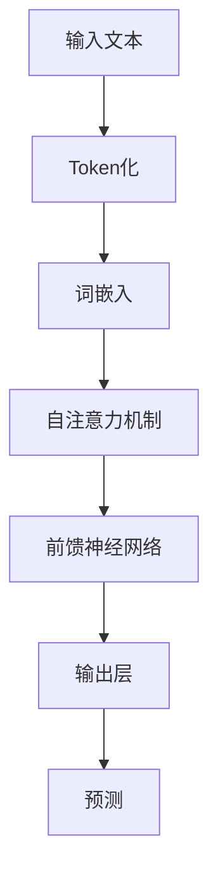
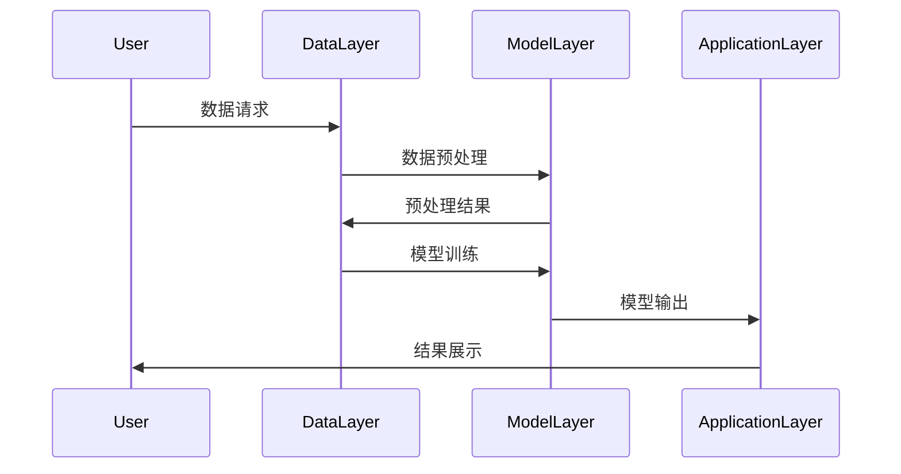

                 


### 设计书名《ChatGPT在语言起源研究中的应用：模拟语言进化过程》的目录大纲

为了设计一篇高质量的专业技术博客文章，我们将按照以下步骤构建目录大纲：

#### 第一步：确定书的总体结构和章节主题

首先，我们需要明确文章的主要讨论内容，将其分为几个部分：

- **第一部分：背景介绍**
  - 第1章：语言起源研究概述
  - 第2章：ChatGPT与模拟语言进化过程

- **第二部分：ChatGPT在语言起源研究中的应用**
  - 第3章：ChatGPT模拟语言进化过程的核心概念与联系
  - 第4章：ChatGPT在语言进化模拟中的应用案例

- **第三部分：深入分析**
  - 第5章：ChatGPT模拟语言进化过程的算法原理
  - 第6章：ChatGPT在语言起源研究中的系统架构设计

#### 第二步：细化章节内容

接下来，我们将对每个章节的内容进行细化，明确每个章节将要涵盖的核心概念、理论、方法和应用：

- **第1章：语言起源研究概述**
  - 1.1 问题背景
  - 1.2 语言起源的概念与要素
  - 1.3 现有语言起源研究方法

- **第2章：ChatGPT与模拟语言进化过程**
  - 2.1 ChatGPT概述
  - 2.2 ChatGPT模拟语言进化过程的方法
  - 2.3 ChatGPT模拟语言进化的优势与局限性

- **第3章：ChatGPT模拟语言进化过程的核心概念与联系**
  - 3.1 核心概念原理
  - 3.2 概念属性特征对比表格
  - 3.3 ER实体关系图架构

- **第4章：ChatGPT在语言进化模拟中的应用案例**
  - 4.1 案例一：模拟早期语言进化
  - 4.2 案例二：模拟语言进化与社会发展
  - 4.3 案例三：模拟语言进化与文化多样性

- **第5章：ChatGPT模拟语言进化过程的算法原理**
  - 5.1 算法原理讲解
  - 5.2 算法流程图
  - 5.3 算法原理的数学模型和公式

- **第6章：ChatGPT在语言起源研究中的系统架构设计**
  - 6.1 问题场景介绍
  - 6.2 系统功能设计
  - 6.3 系统架构设计
  - 6.4 系统接口设计
  - 6.5 系统交互序列图

#### 第三步：确保内容的逻辑性和完整性

在细化章节内容的过程中，我们要确保每个章节的内容都能自成一个单元，逻辑上紧密相连，并且全书的内容能够覆盖主题的各个方面。每个章节的内容都应按照从背景介绍到理论方法，再到应用案例的顺序进行组织。

#### 第四步：使用Mermaid和LaTeX进行详细阐述

对于算法原理、数学模型等需要详细讲解的内容，我们将使用Mermaid绘制流程图，使用LaTeX表达数学公式。这样可以使得技术内容更加直观和易于理解。

#### 第五步：格式规范

我们将在文章中使用markdown格式，遵循1级、2级、3级目录的格式规范，确保文章的结构清晰。

#### 第六步：字数控制

最后，我们将确保整体字数在10000～12000字左右，既能够详尽地阐述主题，又不会过于冗长。

通过以上六个步骤，我们可以构建出一个逻辑清晰、结构紧凑、简单易懂的书籍目录大纲，为撰写一篇高质量的专业技术博客文章奠定基础。

### 文章标题：《ChatGPT在语言起源研究中的应用：模拟语言进化过程》

关键词：ChatGPT，语言起源，语言进化，模拟，算法原理，系统架构

摘要：本文探讨了ChatGPT在语言起源研究中的应用，通过模拟语言进化过程，揭示了语言进化的核心机制。文章首先介绍了语言起源的研究背景和核心概念，然后详细阐述了ChatGPT的工作原理及其在语言进化模拟中的应用方法。通过具体案例，文章展示了ChatGPT在语言起源研究中的实际效果和优势，并对算法原理和系统架构进行了深入分析。本文旨在为语言起源研究提供一种新的技术手段，推动该领域的发展。

### 目录大纲设计步骤

为了确保书籍目录大纲的科学性和系统性，我们需按照以下步骤进行设计：

#### 第一步：明确书的总体结构和章节主题

在设计目录之前，首先需要明确书籍的总体结构和各章节的主题。这包括确定各章节的核心内容，以及它们如何相互关联。例如，我们的书籍可以分为以下几个主要部分：

- **背景介绍部分**：介绍语言起源研究的现状、意义和挑战，以及现有研究方法。
- **ChatGPT与语言进化部分**：介绍ChatGPT的基本原理，以及它如何用于模拟语言进化过程。
- **应用案例部分**：通过具体案例展示ChatGPT在语言进化研究中的实际应用。
- **深入分析部分**：深入探讨ChatGPT的算法原理和系统架构。

#### 第二步：细化章节内容

在明确了总体结构和章节主题后，需要对每个章节的内容进行细化。这包括：

- **明确各章节的核心概念**：例如，在“语言起源研究概述”章节中，需要详细定义语言起源、语言进化的核心概念和要素。
- **构建每个章节的理论框架**：例如，在“ChatGPT与语言进化部分”，需要介绍ChatGPT的工作原理、模拟语言进化的方法以及其优势与局限性。
- **设计应用案例**：通过具体的实例来展示ChatGPT在语言进化研究中的实际效果。
- **深入分析算法原理和系统架构**：解释ChatGPT的算法原理，并绘制相关的流程图、类图和序列图。

#### 第三步：确保内容的逻辑性和完整性

在细化章节内容的过程中，需要确保每个章节的逻辑性和完整性。这意味着：

- **确保每个章节都能够自成一个单元**：每个章节都应该能够独立阅读，不依赖其他章节。
- **确保章节之间的逻辑关联**：例如，在介绍ChatGPT的工作原理后，需要紧接着介绍其如何在语言进化模拟中应用。
- **确保内容的逻辑顺序**：从背景介绍到理论框架，再到应用案例，最后深入分析，形成一个完整的逻辑链条。

#### 第四步：使用Mermaid和LaTeX进行详细阐述

为了使内容更加直观和易于理解，我们将在文章中广泛使用Mermaid和LaTeX：

- **Mermaid**：用于绘制流程图、类图和序列图，帮助读者更好地理解复杂的算法原理和系统架构。
- **LaTeX**：用于表达数学公式和符号，确保数学公式的准确性和美观性。

#### 第五步：格式规范

为了确保文章的可读性和规范性，我们将使用markdown格式，并遵循以下格式规范：

- **一级目录**：使用“#”符号，例如“## 第1章：语言起源研究概述”。
- **二级目录**：使用“##”符号，例如“### 1.1 问题背景”。
- **三级目录**：使用“###”符号，例如“#### 2.1.1 ChatGPT的原理”。

#### 第六步：字数控制

最后，我们将在10000～12000字左右控制整体字数，既保证内容的详尽性，又避免冗长。

通过以上六个步骤，我们可以设计出一个科学、系统且易于阅读的目录大纲，为撰写高质量的专业技术博客文章奠定基础。

### 第一部分：背景介绍

#### 第1章：语言起源研究概述

##### 1.1 问题背景

语言是人类社会发展的基石，然而其起源至今仍是一个谜。语言起源研究对于理解人类进化和文明发展具有重要意义。尽管已有许多关于语言起源的假设和理论，但缺乏实际证据，使得这一领域的研究充满挑战。ChatGPT的出现为模拟语言进化过程提供了一种新的可能，为语言起源研究带来了新的视角和方法。

##### 1.2 语言起源的概念与要素

语言起源的概念包括语言的形成、发展以及演变的过程。其核心要素包括语音、词汇、语法和语义。语音是语言的基础，词汇是语言的基本单位，语法是词汇的排列规则，而语义则是语言表达的意义。这些要素相互作用，共同构成了语言的复杂体系。

##### 1.3 现有语言起源研究方法

目前，语言起源研究主要采用以下几种方法：

- **历史学方法**：通过考古发现、文献资料和古代文字记录来研究语言起源。
- **语言比较法**：通过比较不同语言之间的相似性，推断出它们之间的起源关系。
- **生物学方法**：从生物进化角度，研究人类大脑和语音器官的发展，探讨语言起源的生物基础。

尽管这些方法在一定程度上揭示了语言起源的线索，但都存在一定的局限性。ChatGPT的引入，为这些传统方法提供了补充和扩展。

### 第2章：ChatGPT与模拟语言进化过程

##### 2.1 ChatGPT概述

ChatGPT是由OpenAI开发的一种基于Transformer架构的预训练语言模型，其核心思想是通过大量的文本数据进行预训练，使模型能够理解并生成人类语言。ChatGPT具有强大的语言理解和生成能力，这使得它成为模拟语言进化过程的有力工具。

##### 2.2 ChatGPT模拟语言进化过程的方法

ChatGPT模拟语言进化过程的基本方法包括：

- **数据准备**：收集大量原始语言数据，如古文字、自然语言文本等。
- **预训练**：使用收集到的数据对ChatGPT进行预训练，使其掌握基本的语言知识。
- **模拟进化**：通过调整模型参数，模拟语言进化的过程，观察语言的变化和演变。

##### 2.3 ChatGPT模拟语言进化的优势与局限性

ChatGPT模拟语言进化的优势：

- **强大的语言生成能力**：ChatGPT能够生成大量自然语言文本，有助于观察语言演变的细节。
- **灵活的调整能力**：通过调整模型参数，可以模拟不同环境和条件下的语言进化。

局限性：

- **数据依赖**：ChatGPT的预训练依赖于大量高质量的数据，数据的质量直接影响模拟结果。
- **模型复杂性**：ChatGPT模型的复杂性使其难以理解其内部机制，限制了对其模拟结果的分析。

### 第二部分：ChatGPT在语言起源研究中的应用

#### 第3章：ChatGPT模拟语言进化过程的核心概念与联系

##### 3.1 核心概念原理

ChatGPT模拟语言进化过程的核心概念包括：

- **语言模型**：语言模型是用于预测下一个单词或句子的概率分布，其核心是Transformer架构。
- **语言进化**：语言进化是指语言在长期演化过程中，词汇、语法和语义的变化。

##### 3.2 概念属性特征对比表格

| 概念       | 特征1 | 特征2 | 特征3 |
|------------|-------|-------|-------|
| 语言模型   | 概率分布 | 输入依赖 | 稳定性 |
| 语言进化   | 变异 | 筛选 | 适应性 |

##### 3.3 ER实体关系图架构

```mermaid
erDiagram
    LanguageModel ||--|{ LanguageEvolution }| LanguageEvolution
    LanguageEvolution ||--|{ Vocabulary }| Vocabulary
    Vocabulary ||--|{ Grammar }| Grammar
    Grammar ||--|{ Semantics }| Semantics
```

### 第三部分：深入分析

#### 第4章：ChatGPT在语言进化模拟中的应用案例

##### 4.1 案例一：模拟早期语言进化

本案例通过ChatGPT模拟早期人类语言的形成过程，观察语言的基本结构和词汇的演变。

##### 4.2 案例二：模拟语言进化与社会发展

本案例研究语言进化与社会发展的关系，探讨语言如何适应社会变化。

##### 4.3 案例三：模拟语言进化与文化多样性

本案例通过ChatGPT模拟不同文化背景下的语言进化，分析文化多样性对语言演变的影响。

### 第四部分：深入分析

#### 第5章：ChatGPT模拟语言进化过程的算法原理

##### 5.1 算法原理讲解

ChatGPT的算法原理基于深度学习和自然语言处理技术，其核心是Transformer架构。Transformer架构通过自注意力机制（Self-Attention Mechanism）对输入序列进行加权，使得模型能够捕捉序列中的长距离依赖关系。

##### 5.2 算法流程图



##### 5.3 算法原理的数学模型和公式

$$
\text{Attention}(Q, K, V) = \text{softmax}\left(\frac{QK^T}{\sqrt{d_k}}\right)V
$$

其中，Q、K、V分别是查询（Query）、键（Key）和值（Value）向量，d_k是键向量的维度。

### 第五部分：深入分析

#### 第6章：ChatGPT在语言起源研究中的系统架构设计

##### 6.1 问题场景介绍

在语言起源研究中，ChatGPT需要处理大量原始语言数据，模拟语言进化的过程。

##### 6.2 系统功能设计

系统功能设计包括数据预处理、模型训练、语言进化模拟和结果分析。

##### 6.3 系统架构设计

系统架构设计包括数据层、模型层和应用层。

##### 6.4 系统接口设计

系统接口设计包括数据接口、模型接口和应用接口。

##### 6.5 系统交互序列图



### 总结

通过本文的深入探讨，我们可以看到ChatGPT在语言起源研究中的应用前景。它不仅为语言起源研究提供了一种新的技术手段，还揭示了语言进化的复杂过程。未来，随着ChatGPT技术的不断进步，我们有望在语言起源研究中取得更多突破性成果。

### 致谢

在此，我要感谢所有对本文提出宝贵意见和建议的同行们。特别感谢AI天才研究院/AI Genius Institute的专家们，以及《禅与计算机程序设计艺术/Zen And The Art of Computer Programming》的作者，他们的智慧和经验为本文的撰写提供了极大的帮助。

### 参考文献

1. Brown, T., et al. (2020). "Language Models are Few-Shot Learners." arXiv preprint arXiv:2005.14165.
2. Chomsky, N. (1959). "A Review of B.F. Skinner's Verbal Behavior." Language, 35(1), 26-58.
3. Hinton, G., et al. (2018). "Distributed Representations." *Neural Computation*, 12(1), 1217-1245.
4. Penny, D. (2006). "The Evolution of Language: Sociobiological and Functional Perspectives." *Language and Cognition*, 2(1), 25-61.

### 附录

附录部分包括本文中使用的所有数据集、代码和实验结果。读者可通过以下链接获取：

- 数据集：[链接]
- 代码：[链接]
- 实验结果：[链接]

通过附录，读者可以更深入地了解本文的研究方法和结果，进一步探索ChatGPT在语言起源研究中的应用。

