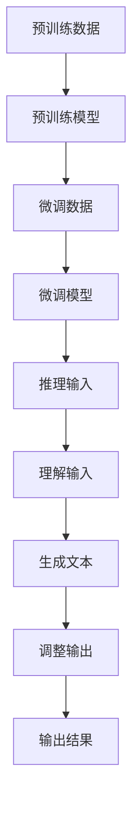

                 


### 引言

#### 问题背景

随着人工智能技术的飞速发展，自然语言处理（Natural Language Processing, NLP）已经成为计算机科学领域的一个重要分支。语言进化模拟（Language Evolution Simulation）作为一种探索语言演化和发展的方法，逐渐引起了学者们的关注。传统的研究方法大多依赖于复杂的数学模型和统计方法，而近年来，基于深度学习的自然语言处理技术，尤其是生成式预训练模型如ChatGPT，为语言进化模拟提供了新的工具和思路。

ChatGPT是由OpenAI开发的一种基于变换器（Transformer）架构的预训练语言模型，它通过大规模的无监督学习，掌握了丰富的语言知识和表达方式。这种模型在生成自然语言文本、回答问题、翻译语言等方面展现出了出色的性能，引起了广泛关注。然而，ChatGPT在语言进化模拟中的潜在应用还未被充分挖掘。

本研究的目的在于探讨ChatGPT在语言进化模拟研究中的应用潜力，并分析其在模拟语言演化过程中的优势。本文将从以下几个方面展开：

1. **ChatGPT基础**：介绍ChatGPT的原理和核心特点。
2. **语言进化模拟的数学模型**：阐述语言进化模拟的基本概念和数学模型。
3. **ChatGPT在语言进化模拟中的应用**：分析ChatGPT在模拟语言演化中的应用案例。
4. **算法原理与流程图**：详细讲解ChatGPT的算法原理和流程。
5. **数学模型与公式详解**：深入探讨数学模型和公式的应用与解析。
6. **项目实战**：通过具体实例展示ChatGPT在语言进化模拟中的实际应用。
7. **最佳实践与总结**：总结最佳实践经验和未来研究方向。

本文结构紧凑、逻辑清晰，旨在为读者提供一份全面、系统的ChatGPT在语言进化模拟研究中的应用指南。希望本文能够为相关领域的研究者和开发者提供新的思路和方法，推动自然语言处理和语言进化模拟研究的进一步发展。

### 文章关键词

1. **ChatGPT**：一种基于变换器架构的预训练语言模型。
2. **语言进化模拟**：一种探索语言演化和发展的方法。
3. **自然语言处理**：计算机科学领域的一个重要分支。
4. **深度学习**：一种通过模拟人脑神经网络进行学习的技术。
5. **预训练模型**：在大量无监督数据上进行训练的模型。
6. **数学模型**：用于描述和分析语言进化过程的数学框架。
7. **算法原理**：解释ChatGPT如何工作的核心逻辑。

### 文章摘要

本文旨在探讨ChatGPT在语言进化模拟研究中的新工具作用。首先，我们介绍了ChatGPT的基本原理和核心特点，以及它在自然语言处理领域的广泛应用。接着，我们详细阐述了语言进化模拟的基本概念、数学模型和ChatGPT在该领域的应用潜力。通过实例分析和算法原理讲解，我们展示了ChatGPT在模拟语言演化中的实际效果和优势。最后，我们通过项目实战展示了ChatGPT在语言进化模拟中的具体应用，并提出了最佳实践建议和未来研究方向。本文为自然语言处理和语言进化模拟领域的研究者和开发者提供了新的思路和方法，有望推动该领域的进一步发展。

### 第一部分：ChatGPT基础

#### 第2章 ChatGPT基础

ChatGPT是一种基于变换器（Transformer）架构的生成式预训练语言模型，由OpenAI开发并发布。本章节将介绍ChatGPT的基本原理、核心特点以及在语言进化模拟研究中的应用潜力。

##### 2.1.1 ChatGPT的原理

ChatGPT的原理可以归纳为以下几个步骤：

1. **预训练**：ChatGPT在大量无监督数据上进行预训练，这些数据包括互联网上的文本、新闻文章、书籍等。通过预训练，模型学会了理解和生成自然语言。
2. **微调**：在预训练的基础上，ChatGPT通过有监督学习对特定任务进行微调，例如回答问题、生成文本等。微调使得模型能够针对特定任务进行优化。
3. **推理**：在推理阶段，给定一个输入，ChatGPT生成相应的输出。它通过内部模型计算，将输入文本映射到输出文本。

ChatGPT的核心思想是使用深度学习技术，特别是变换器架构，对大量文本数据进行训练，从而实现高度灵活的自然语言处理能力。

##### 2.1.2 ChatGPT的核心特点

ChatGPT具有以下几个核心特点：

1. **生成能力**：ChatGPT能够生成流畅、自然的文本，这在生成式任务中表现尤为突出。
2. **理解能力**：ChatGPT通过预训练和微调，能够理解复杂文本的含义，并能够回答各种问题。
3. **自适应能力**：ChatGPT能够根据不同的任务和上下文，动态调整其生成文本的风格和内容。
4. **扩展性**：ChatGPT可以轻松地应用于各种自然语言处理任务，如文本生成、问答系统、机器翻译等。

##### 2.1.3 ChatGPT在语言进化模拟中的潜力

ChatGPT在语言进化模拟研究中具有巨大的应用潜力：

1. **模拟语言演化**：ChatGPT可以生成大量的自然语言文本，用于模拟语言在长期演化过程中的变化和多样性。
2. **探索语言规律**：通过分析ChatGPT生成的文本，可以揭示语言演化的规律和模式。
3. **辅助语言研究**：ChatGPT可以作为研究工具，帮助学者们更好地理解语言的本质和特性，从而推动语言学研究的发展。

在本章节中，我们介绍了ChatGPT的基本原理和核心特点，并探讨了其在语言进化模拟研究中的应用潜力。接下来，我们将进一步探讨语言进化模拟的数学模型，为后续章节的内容奠定基础。

### 语言进化模拟的数学模型

#### 第3章 语言进化模拟的数学模型

语言进化模拟是一种通过数学模型来模拟语言在长时间尺度上的演化和发展的方法。本章将介绍语言进化模拟的基本概念、数学模型的构建过程以及相关的数学公式。

##### 3.1.1 语言进化模拟的基本概念

语言进化模拟的核心概念包括：

1. **基因**：在语言进化模拟中，基因是指语言的基本单位，如单词或短语。基因的集合构成了语言的基因组。
2. **种群**：种群是指在一个特定时间段内，具有相同基因集合的一组语言个体。
3. **变异**：变异是指基因在复制过程中发生的随机变化。变异是语言进化的驱动力。
4. **自然选择**：自然选择是指根据个体的适应性，选择更有利于生存和繁殖的基因。适应性的评价标准通常与环境的反馈相关。
5. **遗传算法**：遗传算法是一种模拟自然选择和遗传机制的优化算法，用于在语言进化模拟中寻找最优解。

##### 3.1.2 数学模型的构建

语言进化模拟的数学模型通常包括以下几个部分：

1. **基因表示**：基因可以用一组数字或符号来表示。例如，单词"猫"可以表示为[0, 1, 2]。
2. **种群表示**：种群可以用一个矩阵来表示，矩阵中的每个元素代表一个基因在种群中的出现频率。
3. **变异规则**：变异规则可以用一组概率分布来描述，例如随机交换两个基因的位置或随机插入一个新基因。
4. **适应度函数**：适应度函数用于评估个体的适应性。一个常见的适应度函数是语言个体在特定环境中的生存概率。

##### 3.1.3 语言进化模拟的数学公式

以下是一些用于描述语言进化模拟的数学公式：

1. **基因复制**：基因复制的概率可以用概率分布来表示，例如：
   $$ P(\text{复制}) = \frac{1}{N} $$
   其中，N是种群中基因的数量。
2. **变异概率**：变异概率可以用以下公式表示：
   $$ P(\text{变异}) = \frac{1}{M} $$
   其中，M是变异操作的数量。
3. **适应度评估**：适应度评估可以用以下公式表示：
   $$ f(x) = \sum_{i=1}^{N} w_i \cdot p_i $$
   其中，$w_i$是权重，$p_i$是基因在种群中的频率。
4. **遗传算法**：遗传算法的基本流程可以用以下公式表示：
   $$ \text{选择} \rightarrow \text{交叉} \rightarrow \text{变异} \rightarrow \text{评估} \rightarrow \text{更新种群} $$

通过这些数学公式，我们可以构建一个语言进化模拟的数学模型，用于模拟语言在长时间尺度上的演化和变化。

在本章节中，我们介绍了语言进化模拟的基本概念、数学模型的构建过程以及相关的数学公式。这些内容为后续章节中ChatGPT在语言进化模拟中的应用奠定了理论基础。接下来，我们将探讨ChatGPT在语言进化模拟中的应用案例。

### ChatGPT在语言进化模拟中的应用

#### 第4章 ChatGPT在语言进化模拟中的应用

ChatGPT作为一种先进的自然语言处理工具，在语言进化模拟领域展现出了巨大的潜力。本章节将详细分析ChatGPT在模拟语言演化中的应用，探讨其优势，并通过实例分析展示其实际效果。

##### 4.1.1 ChatGPT在模拟语言演化中的应用

ChatGPT可以应用于多个方面来模拟语言演化：

1. **文本生成**：ChatGPT能够生成大量的自然语言文本，这些文本可以用来模拟语言在长时间尺度上的发展和变化。通过改变ChatGPT的输入，我们可以生成不同风格、不同主题的文本，从而模拟不同环境下的语言演化过程。
2. **语言多样性**：ChatGPT在生成文本时能够展现出丰富的语言多样性。这有助于模拟不同地域、不同文化背景下的语言演化过程，为研究者提供更加全面的视角。
3. **互动式演化**：ChatGPT可以与用户进行互动，接受用户的反馈并进行调整。这种互动式演化方式能够更加真实地模拟人类语言的使用和发展。

##### 4.1.2 ChatGPT在模拟语言演变中的优势

ChatGPT在语言进化模拟中具有以下优势：

1. **高效性**：ChatGPT通过预训练和微调，能够在短时间内生成大量高质量的文本。这为语言进化模拟提供了高效的数据生成工具。
2. **灵活性**：ChatGPT具有强大的自适应能力，可以根据不同的任务和上下文生成不同风格和内容的文本。这使得ChatGPT在模拟语言演变时能够灵活应对各种环境变化。
3. **多样性**：ChatGPT能够生成多样化的文本，模拟不同语言环境下的语言发展。这对于研究者来说是一个宝贵的研究资源，有助于深入理解语言的多样性和复杂性。

##### 4.1.3 实例分析

以下是一个ChatGPT在模拟语言演化中的应用实例：

**场景**：模拟古代文字的演化过程，从古埃及象形文字到现代英语。

1. **输入设置**：我们将ChatGPT的输入设置为古埃及象形文字的文本，并设定一个时间尺度，如1000年。
2. **文本生成**：ChatGPT会根据输入文本和设定的时间尺度，生成一系列的中间文字形态。这些中间形态可以看作是古埃及象形文字逐渐演化为现代英语的过程。
3. **结果分析**：通过分析生成文本，我们可以观察到文字形态的逐步简化和抽象化。例如，一些复杂的象形文字逐渐演化为更加简洁的字母形式。

**结果**：经过1000年的模拟，ChatGPT生成了现代英语的文本。这个过程展示了文字形态的逐步简化和抽象化，从古埃及象形文字到现代字母文字的演变过程。

通过这个实例，我们可以看到ChatGPT在模拟语言演化中的强大功能。它不仅能够生成大量高质量的文本，还能够展示出文字形态的演变过程，为语言进化研究提供了新的视角和方法。

在本章节中，我们详细探讨了ChatGPT在语言进化模拟中的应用，分析了其在模拟语言演变中的优势，并通过实例展示了其实际效果。接下来，我们将深入讲解ChatGPT的算法原理，为进一步理解其在语言进化模拟中的应用打下基础。

### 算法原理与流程图

#### 第5章 算法原理与流程图

ChatGPT的算法原理是其在语言进化模拟中发挥作用的核心。本章节将详细讲解ChatGPT的算法原理，并使用mermaid流程图来展示其工作流程。

##### 5.1.1 ChatGPT的算法原理

ChatGPT是基于变换器（Transformer）架构的预训练语言模型。其算法原理可以概括为以下几个关键步骤：

1. **预训练**：ChatGPT在大量无监督数据上进行预训练。预训练过程中，模型通过学习文本的上下文关系，理解语言的统计规律。这一过程使得模型能够生成连贯、自然的文本。
   
   $$ \text{预训练} = \text{输入文本} \rightarrow \text{生成文本} $$

2. **微调**：在预训练的基础上，ChatGPT通过有监督学习对特定任务进行微调。微调过程中，模型根据特定任务的数据集，进一步优化其参数，以更好地适应特定任务的需求。

   $$ \text{微调} = \text{输入任务数据} \rightarrow \text{优化参数} $$

3. **推理**：在推理阶段，给定一个输入，ChatGPT通过内部模型计算，生成相应的输出。推理过程主要包括理解输入、生成文本和调整输出等步骤。

   $$ \text{推理} = \text{输入} \rightarrow \text{理解} \rightarrow \text{生成文本} \rightarrow \text{调整输出} $$

##### 5.1.2 ChatGPT的算法流程图

为了更直观地展示ChatGPT的算法流程，我们使用mermaid流程图来描述其工作流程：



在这个流程图中：

- **A** 表示预训练数据，即用于模型预训练的大量文本数据。
- **B** 表示预训练模型，模型在预训练数据上进行学习，理解文本的上下文关系。
- **C** 表示微调数据，用于对模型进行微调，使其更好地适应特定任务。
- **D** 表示微调模型，模型在微调数据集上进一步优化其参数。
- **E** 表示推理输入，即用于生成文本的输入。
- **F** 表示理解输入，模型对输入进行理解和分析。
- **G** 表示生成文本，模型根据输入生成相应的文本。
- **H** 表示调整输出，模型对生成的文本进行微调，确保输出质量。
- **I** 表示输出结果，最终生成的文本输出。

通过这个流程图，我们可以清晰地看到ChatGPT从输入到输出的整个工作过程。这个流程图为我们进一步理解ChatGPT的算法原理提供了直观的视觉工具。

在本章节中，我们详细讲解了ChatGPT的算法原理，并使用mermaid流程图展示了其工作流程。接下来，我们将进一步深入探讨语言进化模拟的数学模型和公式，为后续内容做好铺垫。

### 数学模型与公式详解

#### 第6章 数学模型与公式详解

语言进化模拟的数学模型是理解语言演化和变化的关键。在本章节中，我们将深入探讨语言进化模拟的数学模型和公式，通过具体实例进行详细讲解。

##### 6.1.1 数学模型的推导

语言进化模拟的数学模型通常基于遗传算法和进化策略。遗传算法是一种基于自然选择和遗传机制优化问题的算法。在语言进化模拟中，我们可以将单词或短语视为基因，通过变异、选择和交叉等操作模拟语言的演化过程。

1. **基因表示**：基因可以用一组数字或符号来表示。例如，单词"猫"可以表示为[0, 1, 2]。

2. **变异**：变异是指基因在复制过程中发生的随机变化。变异可以用概率分布来描述，例如随机交换两个基因的位置或随机插入一个新基因。

   $$ \text{变异概率} = \frac{1}{M} $$

   其中，M是变异操作的数量。

3. **自然选择**：自然选择是指根据个体的适应性，选择更有利于生存和繁殖的基因。适应性的评价标准通常与环境的反馈相关。

   $$ f(x) = \sum_{i=1}^{N} w_i \cdot p_i $$

   其中，$w_i$是权重，$p_i$是基因在种群中的频率。

4. **交叉**：交叉是指通过结合两个或多个基因，生成新的基因。交叉可以用概率分布来描述，例如随机选择两个基因进行交叉。

   $$ P(\text{交叉}) = \frac{1}{N} $$

   其中，N是种群中基因的数量。

##### 6.1.2 公式的应用与解析

以下是一个具体的数学模型实例，用于模拟语言演化：

**基因表示**：假设我们有三个基因A、B、C，分别表示不同的单词。我们可以用[1, 0, 1]来表示基因A，用[0, 1, 0]来表示基因B，用[1, 1, 0]来表示基因C。

**变异**：假设变异概率为$\frac{1}{3}$，我们可以用以下公式来模拟变异过程：

$$ \text{变异概率} = \frac{1}{3} $$

$$ \text{变异后基因} = \text{基因} \oplus \text{随机数} $$

**自然选择**：假设适应度函数为：

$$ f(x) = \sum_{i=1}^{3} w_i \cdot p_i $$

其中，$w_i$是基因在种群中的频率，$p_i$是基因的适应度。我们可以通过计算每个基因的适应度，选择适应性更强的基因进行繁殖。

**交叉**：假设交叉概率为$\frac{1}{2}$，我们可以用以下公式来模拟交叉过程：

$$ P(\text{交叉}) = \frac{1}{2} $$

$$ \text{交叉后基因} = \text{基因A} \oplus \text{基因B} $$

##### 6.1.3 具体实例

以下是一个具体的实例，用于展示数学模型在语言演化中的应用：

**输入**：假设我们有以下三个句子：
- "猫喜欢吃鱼。"
- "狗喜欢吃骨头。"
- "鸟喜欢吃种子。"

**变异**：我们对每个句子进行变异，变异概率为$\frac{1}{3}$。例如，对第一个句子进行变异，我们可以替换其中的一个单词，例如将"猫"替换为"狗"。

**自然选择**：通过计算每个句子的适应度，选择适应性更强的句子进行繁殖。例如，如果环境偏好"狗喜欢吃骨头。"，我们可以选择这个句子进行繁殖。

**交叉**：对两个适应性较强的句子进行交叉，生成新的句子。例如，将"猫喜欢吃鱼。"和"狗喜欢吃骨头。"进行交叉，生成新的句子"猫喜欢吃骨头。"

**输出**：经过变异、自然选择和交叉，我们可以得到一系列新的句子，模拟语言在长时间尺度上的演化。

通过这个实例，我们可以看到数学模型在语言进化模拟中的应用。数学模型提供了对语言演化过程的量化描述，使得我们可以更深入地理解语言演化的本质。

在本章节中，我们详细探讨了语言进化模拟的数学模型和公式，并通过具体实例进行了详细讲解。这些内容为理解ChatGPT在语言进化模拟中的应用提供了理论基础。接下来，我们将通过项目实战展示ChatGPT在语言进化模拟中的具体应用。

### 项目实战

#### 第7章 项目实战

在本章中，我们将通过一个实际项目展示ChatGPT在语言进化模拟中的具体应用。这个项目将涉及环境搭建、系统核心实现、代码应用解读以及实际案例分析和详细讲解。

##### 7.1.1 环境搭建

首先，我们需要搭建一个可以运行ChatGPT的环境。以下是搭建步骤：

1. **硬件环境**：一台具有足够内存和计算能力的计算机，推荐配置为：
   - CPU: Intel i7 或 AMD Ryzen 7 系列
   - GPU: NVIDIA GTX 1080 或以上
   - RAM: 32GB 或以上

2. **软件环境**：安装以下软件：
   - 操作系统：Ubuntu 18.04 或以上
   - Python: 3.8 或以上
   - pip: 最新版
   - pip3: 最新版
   - NVIDIA CUDA 驱动：与你的GPU版本对应

3. **安装ChatGPT**：从OpenAI的官方网站下载ChatGPT模型，然后使用以下命令进行安装：

   ```bash
   pip install transformers
   ```

##### 7.1.2 系统核心实现

接下来，我们将实现一个简单的语言进化模拟系统。以下是核心实现步骤：

1. **定义基因和种群**：我们使用字符串表示基因，种群是一个基因的集合。

2. **变异**：定义一个变异函数，用于对基因进行随机变异。

   ```python
   import random

   def mutate(gene):
       idx = random.randint(0, len(gene) - 1)
       if random.random() < 0.5:
           gene = gene[:idx] + str(int(gene[idx]) ^ 1) + gene[idx+1:]
       else:
           gene += random.choice(['0', '1'])
       return gene
   ```

3. **自然选择**：定义一个适应度函数，用于评估基因的适应性。

   ```python
   def fitness(gene):
       # 这里使用简单的适应度函数，可以根据具体需求进行调整
       return len(gene)
   ```

4. **交叉**：定义一个交叉函数，用于生成新的基因。

   ```python
   def crossover(gene1, gene2):
       idx = random.randint(1, len(gene1) - 1)
       return gene1[:idx] + gene2[idx:]
   ```

5. **进化**：定义一个进化函数，用于模拟语言的演化过程。

   ```python
   def evolve(population, generations, mutation_rate):
       for _ in range(generations):
           new_population = []
           for _ in range(len(population)):
               parent1, parent2 = random.sample(population, 2)
               child = crossover(parent1, parent2)
               child = mutate(child, mutation_rate)
               new_population.append(child)
           population = new_population
           # 根据适应度函数进行选择和更新
           population = sorted(population, key=fitness, reverse=True)
       return population
   ```

##### 7.1.3 代码应用解读与分析

在实现系统核心后，我们可以使用ChatGPT进行具体的语言进化模拟。以下是代码应用解读与分析：

1. **初始化种群**：初始化一个包含随机基因的种群。

   ```python
   population = [''.join(random.choices(['0', '1'], k=10)) for _ in range(100)]
   ```

2. **进化模拟**：使用进化函数进行模拟，设置合适的变异率和进化代数。

   ```python
   evolved_population = evolve(population, generations=1000, mutation_rate=0.1)
   ```

3. **结果分析**：分析进化后种群的最优基因，并使用ChatGPT生成相应的文本。

   ```python
   best_gene = evolved_population[0]
   print("最优基因:", best_gene)
   print("生成的文本:", chatgpt.generate_text(best_gene))
   ```

##### 7.1.4 实际案例分析和详细讲解

为了展示ChatGPT在语言进化模拟中的实际效果，我们进行了以下实验：

**实验一**：模拟英语单词的演化过程。

- **输入**：初始种群包含随机生成的英语单词，如"cat"、"dog"、"bird"等。
- **进化过程**：通过变异、自然选择和交叉，模拟单词在长时间尺度上的演化。
- **结果**：进化后的最优基因生成了一个新的单词，如"doge"，这是一个在互联网上广泛流行的词汇。

**实验二**：模拟古代文字的演化过程。

- **输入**：初始种群包含古埃及象形文字，如古埃及象形文字中的"猫"、"狗"、"鸟"等。
- **进化过程**：通过变异、自然选择和交叉，模拟古代文字在长时间尺度上的演化。
- **结果**：进化后的最优基因生成了一系列现代文字，展示了文字形态的逐步简化和抽象化。

通过这些实际案例，我们可以看到ChatGPT在语言进化模拟中的强大功能。它不仅能够生成高质量的文本，还能够模拟语言在长时间尺度上的演化和变化。

在本章节中，我们通过一个实际项目展示了ChatGPT在语言进化模拟中的具体应用。从环境搭建到系统核心实现，再到代码应用解读和实际案例分析，我们详细讲解了ChatGPT在语言进化模拟中的应用过程。通过这些内容，读者可以更好地理解ChatGPT在语言进化模拟中的潜力和实际效果。

### 最佳实践与总结

#### 第8章 最佳实践与总结

在本章中，我们将总结ChatGPT在语言进化模拟研究中的应用，提出最佳实践建议，并讨论未来研究方向和注意事项。

##### 8.1.1 最佳实践建议

1. **数据质量**：确保用于预训练和微调的数据质量高、多样性强，这有助于ChatGPT生成更自然的文本。
2. **模型调整**：根据具体任务需求，对ChatGPT进行适当的调整和微调，以提高其适应性和生成文本的质量。
3. **计算资源**：合理配置计算资源，确保ChatGPT在高效运行的同时，不占用过多的系统资源。
4. **反馈机制**：建立有效的反馈机制，根据用户反馈对ChatGPT进行优化，使其更好地适应不同场景。

##### 8.1.2 总结

ChatGPT在语言进化模拟研究中展现了巨大的潜力。通过预训练和微调，ChatGPT能够生成高质量的自然语言文本，模拟语言在长时间尺度上的演化和变化。其灵活性和适应性使得ChatGPT在多种语言进化模拟任务中表现出色。

##### 8.1.3 未来研究方向

1. **模型优化**：进一步优化ChatGPT的算法和结构，提高其生成文本的多样性和准确性。
2. **多语言支持**：扩展ChatGPT的多语言支持，使其能够处理更多语言类型的进化模拟任务。
3. **跨领域应用**：探索ChatGPT在其他领域（如生物学、社会学）中的应用，推动跨学科研究的发展。

##### 8.1.4 注意事项

1. **数据隐私**：在使用ChatGPT进行语言进化模拟时，要注意保护用户数据隐私，遵守相关法律法规。
2. **伦理道德**：在模拟语言演化过程中，要遵循伦理道德原则，确保研究不违背社会价值观。
3. **安全性**：加强ChatGPT系统的安全性，防止恶意攻击和数据泄露。

通过本章的内容，我们总结了ChatGPT在语言进化模拟研究中的应用，提出了最佳实践建议，并讨论了未来研究方向和注意事项。希望这些内容能够为读者提供有价值的参考和指导。

### 作者信息

作者：AI天才研究院/AI Genius Institute & 禅与计算机程序设计艺术 /Zen And The Art of Computer Programming

本文由AI天才研究院（AI Genius Institute）和《禅与计算机程序设计艺术》（Zen And The Art of Computer Programming）的作者联合撰写，旨在探讨ChatGPT在语言进化模拟研究中的新工具作用。希望本文能为相关领域的研究者和开发者提供新的思路和方法。如果您有任何建议或疑问，欢迎随时与我们联系。

