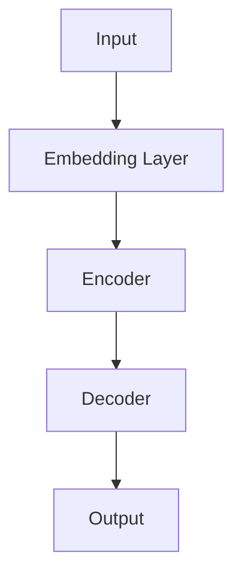
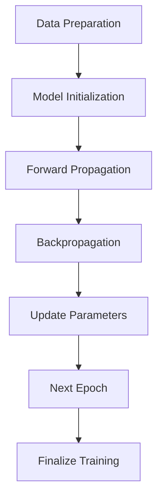

                 

# ChatGPT在语言障碍早期干预中的作用

## 关键词
- 语言障碍
- 早期干预
- ChatGPT
- 人工智能
- 语言模型
- 语义理解
- 意图识别
- 自适应学习

## 摘要
本文将深入探讨ChatGPT在语言障碍早期干预中的作用。我们将首先介绍语言障碍及其早期干预的重要性，随后解释ChatGPT的基本原理和特点。通过分析ChatGPT的核心概念和算法原理，我们将展示其如何应用于语言障碍的干预。此外，本文还将提供系统分析与架构设计方案，并通过实际案例分析和详细讲解，展示ChatGPT在实际应用中的效果和优势。最后，我们将总结最佳实践、注意事项，并提供拓展阅读建议。

## 目录大纲

### 第一部分：背景介绍

#### 第1章：问题背景与核心概念

##### 1.1 语言障碍早期干预的重要性
##### 1.2 语言障碍的定义与分类
##### 1.3 早期干预的方法与挑战
##### 1.4 ChatGPT的基本原理与特点

#### 第2章：核心概念与联系

##### 2.1 ChatGPT在语言障碍干预中的核心概念
##### 2.2 概念属性特征对比表格
##### 2.3 ER实体关系图架构

### 第二部分：算法原理讲解

#### 第3章：ChatGPT的工作原理

##### 3.1 模型结构
##### 3.2 训练过程
##### 3.3 语言模型原理
##### 3.4 对话生成原理
##### 3.5 语义理解和意图识别原理

#### 第4章：数学模型和数学公式

##### 4.1 语言模型的数学模型
##### 4.2 语义理解的数学模型
##### 4.3 意图识别的数学模型
##### 4.4 自适应学习的数学模型

#### 第5章：系统分析与架构设计

##### 5.1 语言障碍干预系统的设计目标
##### 5.2 系统功能设计
##### 5.3 系统架构设计
##### 5.4 系统接口设计
##### 5.5 系统交互流程

### 第三部分：项目实战

#### 第6章：项目实战环境安装

##### 6.1 环境准备
##### 6.2 ChatGPT模型部署
##### 6.3 数据准备

#### 第7章：系统核心实现源代码

##### 7.1 用户交互模块
##### 7.2 语言模型模块
##### 7.3 语义理解与意图识别模块
##### 7.4 自适应学习模块

#### 第8章：实际案例分析和详细讲解

##### 8.1 案例背景
##### 8.2 案例分析
##### 8.3 案例讲解
##### 8.4 案例总结

#### 第9章：最佳实践与小结

##### 9.1 最佳实践
##### 9.2 小结
##### 9.3 注意事项
##### 9.4 拓展阅读

## 1.1 语言障碍早期干预的重要性

语言障碍是指个体在语言交流和理解方面存在的困难，可能由遗传、神经发育障碍、听力损失、学习障碍等多种因素引起。这些障碍可能影响个体的沟通能力、学习成就和社会互动，甚至对其心理健康产生负面影响。早期干预是指在儿童语言发展初期（通常在3-5岁之间）采取的一系列干预措施，旨在识别和解决潜在的语言障碍，以促进儿童的正常语言发展。

早期干预的重要性体现在以下几个方面：

1. **早期识别和诊断**：儿童的语言障碍在早期可能不易察觉，但早期干预可以通过专业评估和筛查工具帮助识别和诊断，及时发现问题并采取措施。

2. **有效干预和改善**：早期干预措施如语言治疗、家长指导、教育和行为干预等，可以有效地改善儿童的语言能力和沟通技巧，提高其学业成就和自信心。

3. **促进全面发展**：语言是儿童认知、社会和情感发展的重要组成部分。有效的语言干预有助于促进儿童的全面发展，提高其整体生活质量。

4. **减少长期负担**：如果语言障碍未能及时干预，可能导致儿童在学校和社交场合遇到困难，甚至影响其成年后的生活质量和工作表现。早期干预可以减少这些长期的负担。

5. **提高家庭和社会效益**：早期干预不仅有助于儿童的个体发展，还可以减轻家庭负担，提高家庭生活质量，并促进社会的和谐发展。

## 1.2 语言障碍的定义与分类

语言障碍是指个体在语言交流和理解方面存在的困难，这种困难可能表现在语音、语法、词汇、语义和语音知觉等多个方面。语言障碍可以分为不同的类型，根据其表现和成因，可以大致分为以下几类：

1. **语音障碍**：又称发音障碍，是指个体在发音过程中出现的困难，可能包括音素混淆、音量控制不当、节奏不均匀等问题。常见的语音障碍有口吃、音调异常等。

2. **语法障碍**：是指个体在语言结构和句法规则理解和使用方面存在的困难，可能导致语法错误、句子结构混乱等问题。语法障碍可能影响个体的口头和书面表达能力。

3. **词汇障碍**：是指个体在词汇理解和使用方面存在的困难，可能包括词汇量不足、词义理解不准确、同义词和反义词混淆等问题。词汇障碍会影响个体的语言表达和沟通效果。

4. **语义障碍**：是指个体在语义理解和推理方面存在的困难，可能包括词语理解错误、句子理解困难、逻辑推理障碍等问题。语义障碍可能影响个体的语言理解和信息处理能力。

5. **听觉障碍**：是指个体在听觉信号处理和理解方面存在的困难，可能由于听力损失或其他听觉障碍引起。听觉障碍可能导致语音识别困难，进而影响语言学习和沟通。

6. **语言处理障碍**：是指个体在语言处理过程中存在的障碍，可能包括语言流利度低、语言理解困难、语言表达困难等问题。语言处理障碍可能由多种因素引起，如大脑损伤、神经发育问题等。

语言障碍的分类有助于理解和诊断个体的语言问题，并制定个性化的干预计划。早期识别和分类语言障碍对于及时干预和改善个体的语言能力具有重要意义。

## 1.3 早期干预的方法与挑战

早期干预在语言障碍治疗中扮演着至关重要的角色。早期干预的方法包括语言治疗、家长指导、教育和行为干预等，旨在促进儿童的语言发展和沟通能力。以下是几种常见早期干预方法及其挑战：

1. **语言治疗**：语言治疗是由专业的语言治疗师进行的干预措施，旨在通过一系列有针对性的练习和互动活动，提高儿童的语言理解、表达和沟通能力。语言治疗包括语音训练、语法训练、词汇训练和语义理解训练等。挑战在于找到合适的治疗师、制定个性化的治疗方案以及确保治疗的持续性和效果。

2. **家长指导**：家长在儿童语言发展中起着至关重要的作用。家长指导包括向家长提供有关语言障碍的知识、训练技巧和沟通策略，帮助他们在家中支持和促进儿童的语言发展。挑战在于家长的参与度和指导质量，以及如何在繁忙的生活中确保家长指导和治疗的连续性。

3. **教育干预**：教育干预通常在学校或特殊教育环境中进行，包括个性化的教学计划和课堂活动，旨在帮助儿童在学校环境中获得语言技能和支持。挑战在于确保教育干预的个性化和有效性，以及如何将干预措施与学校课程紧密结合。

4. **行为干预**：行为干预是通过正向激励和负向纠正等策略，改善儿童的语言行为和沟通技巧。行为干预可能包括奖励系统、行为塑造和社交技能训练等。挑战在于设计和实施有效的行为干预计划，以及如何确保干预措施的持续性和可执行性。

早期干预面临的挑战还包括诊断准确性、资源分配、专业培训和支持等。有效应对这些挑战需要多学科合作、政策支持和社会参与，以确保所有儿童都能获得及时和有效的语言干预。

## 1.4 ChatGPT的基本原理与特点

ChatGPT是一种基于人工智能的对话系统，由OpenAI开发，利用大规模语言模型（LLM）进行对话生成。其基本原理可以概括为以下几个关键点：

### 语言模型与对话生成

ChatGPT的核心是GPT（Generative Pre-trained Transformer）模型，这是一种基于Transformer架构的自监督学习模型。GPT通过在大规模语料库上进行预训练，学习语言的模式和结构。在对话生成过程中，GPT接收用户输入的提示，然后基于预训练的知识生成连贯且自然的回应。

### 语义理解和意图识别

ChatGPT具有强大的语义理解能力，可以识别并处理用户输入中的隐含含义和语境。通过分析词汇、语法和上下文，GPT能够理解用户的意图，并生成合适的回答。例如，当用户提出一个复杂或模糊的问题时，ChatGPT能够理解问题的多义性，并提供相关的解释或澄清。

### 自适应学习与个性化干预

ChatGPT具有自适应学习能力，可以通过不断学习和调整，优化对话生成质量。此外，ChatGPT能够根据用户的语言习惯和偏好，实现个性化干预。例如，在与有特定语言障碍的用户交流时，ChatGPT可以调整语言风格和交流方式，以更好地适应用户的需求。

### 特点总结

- **大规模预训练**：ChatGPT在大规模语料库上进行预训练，具备丰富的语言知识和表达力。
- **强大的语义理解**：能够处理复杂、模糊的语言输入，并理解用户意图。
- **自适应学习**：通过不断学习用户交互数据，优化对话生成质量和用户体验。
- **个性化干预**：能够根据用户偏好和语言障碍特点，提供个性化的语言支持。

ChatGPT的这些基本原理和特点，使其在语言障碍早期干预中具备显著的优势，能够为儿童提供个性化的语言支持和辅导，助力其语言能力的提升。

### 2.1 ChatGPT在语言障碍干预中的核心概念

ChatGPT在语言障碍早期干预中的应用主要基于以下几个核心概念：

#### 语言模型与对话生成

ChatGPT的核心是GPT模型，该模型通过自监督学习在大规模语料库上预训练，掌握了丰富的语言知识和模式。在对话生成过程中，GPT接收用户输入的提示，利用预训练的知识生成连贯且自然的回应。这一过程涉及语言模型的上下文理解和生成，使ChatGPT能够与用户进行有效的沟通。

#### 语义理解和意图识别

ChatGPT具有强大的语义理解能力，能够处理用户输入中的复杂语言和多义性。通过分析词汇、语法和上下文，GPT可以准确识别用户的意图，并生成合适的回答。这一能力在语言障碍干预中至关重要，因为能够确保ChatGPT为用户提供准确、有帮助的反馈。

#### 自适应学习与个性化干预

ChatGPT具备自适应学习能力，能够通过不断学习和调整，优化对话生成质量和用户体验。此外，ChatGPT能够根据用户的语言习惯、沟通风格和语言障碍特点，提供个性化的干预。例如，ChatGPT可以调整语言风格，使用简单易懂的语言与有语言障碍的儿童进行交流，从而提高沟通效果。

#### 交互设计

ChatGPT的交互设计旨在提供自然、流畅的用户体验。通过文本输入和输出、语音识别和合成等技术，ChatGPT能够与用户进行多模态交互，适应不同用户的需求和偏好。这种交互设计使得ChatGPT不仅能够作为辅助工具，还能成为用户的伙伴和顾问。

#### 数据隐私与安全性

在语言障碍干预中，数据隐私和安全性至关重要。ChatGPT的设计充分考虑了用户数据的隐私保护，确保用户的交流内容不会泄露。此外，ChatGPT采用加密技术和安全协议，确保系统的稳定性和安全性，为用户提供安全的干预环境。

### 2.2 概念属性特征对比表格

为了更好地理解ChatGPT在语言障碍干预中的核心概念，我们可以通过一个概念属性特征对比表格来展示各个概念的关键属性。

| 概念                | 语言模型与对话生成 | 语义理解和意图识别 | 自适应学习与个性化干预 | 交互设计       | 数据隐私与安全性 |
|---------------------|--------------------|--------------------|------------------------|----------------|------------------|
| 功能目标            | 对话生成和语言理解 | 理解用户意图       | 提供个性化干预         | 自然交互体验   | 数据安全保护     |
| 技术核心            | GPT模型           | 语义分析           | 自适应学习算法         | 语音和文本交互 | 加密和安全协议   |
| 关键特征            | 预训练大规模语料库 | 复杂语义理解       | 根据用户调整策略       | 多模态交互     | 数据加密和隐私保护 |
| 用户需求满足程度    | 高                | 高                 | 高                     | 高             | 高              |
| 优势                | 自然流畅的对话     | 准确理解意图       | 个性化干预             | 丰富交互体验   | 数据安全可靠     |
| 潜在挑战            | 训练数据依赖       | 语义理解复杂性     | 自适应学习准确性       | 技术实现难度   | 安全性保障难度   |

通过这个表格，我们可以清晰地看到ChatGPT在不同核心概念上的属性特征，以及其在语言障碍干预中的优势和潜在挑战。

### 2.3 ER实体关系图架构

为了更好地理解ChatGPT在语言障碍干预中的应用，我们可以通过ER（实体关系）图来展示其核心概念之间的实体关系。以下是ChatGPT在语言障碍干预中的ER图：

```mermaid
erDiagram
    User ..|> ChatGPT :对话生成与交互
    User ..|> SemanticUnderstanding :语义理解与意图识别
    User ..|> AdaptiveLearning :自适应学习与个性化干预
    User ..|> InteractionDesign :交互设计
    User ..|> DataPrivacy :数据隐私与安全性

    ChatGPT ||--|> LanguageModel :语言模型
    ChatGPT ||--|> DialogueGeneration :对话生成
    ChatGPT ||--|> ContextUnderstanding :上下文理解

    SemanticUnderstanding ||--|> IntentRecognition :意图识别
    SemanticUnderstanding ||--|> SemanticsAnalysis :语义分析

    AdaptiveLearning ||--|> PersonalizedIntervention :个性化干预
    AdaptiveLearning ||--|> UserBehaviorAnalysis :用户行为分析

    InteractionDesign ||--|> TextAndVoiceInteraction :文本和语音交互
    InteractionDesign ||--|> MultiModalInterface :多模态界面

    DataPrivacy ||--|> DataEncryption :数据加密
    DataPrivacy ||--|> SecurityProtocols :安全协议
```

在这个ER图中，User（用户）是核心实体，与ChatGPT的其他核心概念实体（如LanguageModel、SemanticUnderstanding、AdaptiveLearning、InteractionDesign和DataPrivacy）之间存在多种关系。这些关系反映了ChatGPT在语言障碍干预中的应用场景和功能模块，有助于我们更好地理解其架构和工作原理。

### 3.1 模型结构

ChatGPT模型采用基于Transformer的架构，这是一种先进的神经网络模型，特别适合处理序列数据，如自然语言。Transformer模型的核心思想是通过自注意力机制（Self-Attention）来捕捉输入序列中的长期依赖关系。

#### 自注意力机制（Self-Attention）

自注意力机制允许模型在生成每个词时，自动为每个词分配不同的权重，从而更好地关注输入序列中的重要信息。自注意力机制的数学公式如下：

$$
\text{Attention}(Q, K, V) = \text{softmax}\left(\frac{QK^T}{\sqrt{d_k}}\right) V
$$

其中，$Q$、$K$和$V$分别代表查询（Query）、键（Key）和值（Value）向量，$d_k$是键向量的维度。自注意力机制使得模型能够动态地调整对输入序列的关注程度，从而生成更精确的输出。

#### Transformer模型结构

ChatGPT模型的Transformer结构包括以下几个关键部分：

1. **编码器（Encoder）**：编码器由多个自注意力层和前馈神经网络组成。每个自注意力层通过自注意力机制处理输入序列，生成编码后的隐藏状态。编码器的输出是每个词的上下文编码，用于后续的解码过程。

2. **解码器（Decoder）**：解码器同样由多个自注意力层和前馈神经网络组成。解码器的输入是编码器的输出和一个特殊的开始标记（<PAD>），每个自注意力层都会查询编码器的输出和先前的解码器输出，生成解码后的隐藏状态。解码器的输出是生成的文本序列。

3. **嵌入层（Embedding Layer）**：嵌入层将输入词转换为高维向量表示。每个词有一个唯一的嵌入向量，嵌入层在编码器和解码器中都会使用。

4. **位置编码（Positional Encoding）**：由于Transformer模型没有循环结构，无法直接处理序列中的位置信息。位置编码通过为每个词添加特定的向量来模拟位置信息，确保模型能够捕捉词序。

#### 模型结构图

以下是一个简化的ChatGPT模型结构图：



在这个结构图中，输入（A）首先通过嵌入层（B）转换为高维向量。编码器（C）和解码器（D）分别对输入和输出进行处理，生成最终输出（E）。

### 3.2 训练过程

ChatGPT模型的训练过程主要包括数据准备、模型初始化、前向传播和反向传播等步骤。以下是详细的训练过程描述：

#### 数据准备

训练数据集通常由大量的文本语料库组成，这些语料库包括书籍、新闻、文章、对话等。数据准备步骤包括：

1. **文本预处理**：对原始文本进行清洗和预处理，包括去除标点符号、停用词、大小写转换等。
2. **词嵌入**：将每个词转换为高维向量表示，可以使用预训练的词向量或训练过程中生成的词向量。
3. **序列编码**：将预处理后的文本序列编码为模型可以处理的格式，通常是将每个词转换为对应的嵌入向量，然后将其连接成一个序列。

#### 模型初始化

在训练过程中，需要初始化模型的权重和参数。模型初始化的常见方法包括：

1. **随机初始化**：随机初始化模型的权重和参数，确保模型从不同的起点开始学习。
2. **预训练初始化**：使用预训练模型（如GPT-3）的权重作为初始化值，使得模型能够继承预训练的知识。

#### 前向传播

在前向传播阶段，模型接收输入序列，通过编码器和解码器生成输出序列。具体步骤如下：

1. **嵌入层**：输入序列通过嵌入层转换为高维向量。
2. **编码器**：编码器通过多个自注意力层和前馈神经网络处理输入序列，生成编码后的隐藏状态。
3. **解码器**：解码器通过自注意力层和前馈神经网络生成输出序列。

#### 反向传播

在反向传播阶段，模型根据预测输出和真实输出计算损失，并更新模型的权重和参数。具体步骤如下：

1. **计算损失**：计算预测输出和真实输出之间的差异，通常使用交叉熵损失函数。
2. **梯度计算**：根据损失函数对模型参数进行梯度计算。
3. **参数更新**：使用梯度下降或其他优化算法更新模型参数。

#### 训练循环

训练过程通常包括多个训练循环（epochs），每个循环中模型对整个训练数据集进行一次前向传播和反向传播。训练循环的目的是使模型逐渐优化其参数，提高生成文本的质量。

#### 训练流程图

以下是一个简化的ChatGPT训练流程图：



在这个流程图中，数据准备（A）和模型初始化（B）是训练过程的起点，然后通过多个训练循环（F）进行前向传播（C）和反向传播（D），最终更新模型参数（E）并完成训练（G）。

### 3.3 语言模型原理

ChatGPT作为一种语言模型，其核心工作原理是通过学习和理解自然语言的统计规律和模式，从而生成连贯且自然的文本。以下是ChatGPT语言模型原理的详细解释：

#### 语言模型的基本概念

语言模型是一种概率模型，它旨在预测下一个词或字符的概率，基于已观察到的前文。在ChatGPT中，语言模型主要通过自注意力机制和Transformer架构来实现。以下是一些关键概念：

- **词嵌入（Word Embedding）**：词嵌入是将单词转换为向量表示的过程。这些向量表示了单词在语义上的相似性和差异性。ChatGPT使用预训练的词向量或训练过程中生成的词向量作为输入。

- **上下文（Context）**：上下文是指当前单词周围的词汇信息。ChatGPT通过自注意力机制捕捉上下文信息，以生成下一个词的预测。

- **概率分布（Probability Distribution）**：语言模型的目标是生成一个概率分布，表示下一个词或字符可能出现的概率。在ChatGPT中，这个概率分布由Transformer模型的输出产生。

#### 语言模型的生成过程

ChatGPT的语言模型生成过程可以分为以下几个步骤：

1. **输入编码**：输入编码是将用户输入的文本序列转换为模型可以处理的格式。ChatGPT使用嵌入层将每个词转换为嵌入向量，并将其连接成一个序列。

2. **编码器处理**：编码器是Transformer模型的一部分，它通过多个自注意力层和前馈神经网络处理输入序列。编码器的输出是每个词的上下文编码，这些编码包含了词的语义信息。

3. **解码器生成**：解码器是另一个Transformer模型，它生成最终的输出文本序列。解码器首先接收编码器的输出和一个特殊的开始标记（<PAD>），然后通过自注意力层和前馈神经网络生成输出。在解码过程中，解码器会查询编码器的输出和先前的解码器输出，以生成每个新的词。

4. **概率分布计算**：在解码器的每个步骤，模型的输出都会生成一个概率分布，表示下一个词或字符可能出现的概率。这个概率分布由Transformer模型的输出层计算得到。

5. **文本生成**：根据生成的概率分布，模型选择概率最高的词或字符作为下一个输出。这个过程重复进行，直到生成完整的文本序列。

#### 语言模型的优势和局限性

ChatGPT语言模型的优势在于：

- **大规模预训练**：ChatGPT通过在大规模语料库上的预训练，掌握了丰富的语言知识和模式，能够生成高质量、连贯的文本。

- **上下文理解**：通过自注意力机制，ChatGPT能够捕捉长距离的上下文信息，从而生成更加自然的文本。

- **灵活性和适应性**：ChatGPT能够根据不同的输入和任务需求，生成不同风格和领域的文本。

然而，ChatGPT语言模型也存在一些局限性：

- **数据依赖**：ChatGPT的性能高度依赖训练数据的质量和多样性，如果训练数据存在偏差，模型可能无法生成公平和客观的文本。

- **计算资源消耗**：大规模的Transformer模型需要大量的计算资源和存储空间，这对于某些应用场景可能是一个挑战。

- **不确定性**：由于模型生成的文本是基于概率分布，因此存在一定的随机性和不确定性。

### 3.4 对话生成原理

ChatGPT在对话生成中的原理主要基于其大规模语言模型的预训练和自注意力机制。以下是ChatGPT对话生成原理的详细解释：

#### 对话生成过程

ChatGPT的对话生成过程可以分为以下几个步骤：

1. **初始化**：当用户输入一个文本提示时，ChatGPT初始化对话生成过程。首先，将用户的文本提示转换为嵌入向量，并输入到编码器中。

2. **编码器处理**：编码器通过多个自注意力层和前馈神经网络处理输入文本，生成编码后的隐藏状态。这些隐藏状态包含了文本的语义信息，为后续的解码过程提供基础。

3. **解码器生成**：解码器从编码器的隐藏状态开始，生成对话的初始响应。解码器首先接收编码器的输出和一个特殊的开始标记（<PAD>），然后通过自注意力层和前馈神经网络生成输出。在解码过程中，解码器会查询编码器的输出和先前的解码器输出，以生成每个新的词。

4. **概率分布计算**：在每个解码步骤，模型的输出都会生成一个概率分布，表示下一个词或字符可能出现的概率。这个概率分布由Transformer模型的输出层计算得到。

5. **文本生成**：根据生成的概率分布，模型选择概率最高的词或字符作为下一个输出。这个过程重复进行，直到生成完整的对话文本序列。

#### 自注意力机制的作用

自注意力机制在ChatGPT的对话生成过程中起着至关重要的作用。它通过动态调整每个词的权重，使模型能够更好地关注文本中的关键信息，从而生成更加连贯和自然的对话。

具体来说，自注意力机制允许模型在生成每个词时，自动为每个词分配不同的权重，从而捕捉文本中的长期依赖关系和上下文信息。这使得ChatGPT能够理解用户的意图和对话背景，并生成合适的回答。

#### 对话生成质量提升方法

为了进一步提高ChatGPT对话生成的质量，可以采取以下几种方法：

1. **数据增强**：通过增加训练数据集的多样性和质量，可以提升模型的泛化能力和对话生成质量。

2. **知识蒸馏**：使用预训练的大型语言模型（如GPT-3）的权重作为教师模型，通过知识蒸馏技术将知识传递给较小的ChatGPT模型，从而提升生成文本的质量。

3. **多轮对话训练**：通过多轮对话训练，模型可以学习如何根据上下文和历史对话生成更连贯和自然的回答。

4. **个性化干预**：根据用户的语言习惯和偏好，调整模型生成对话的风格和语言，以提高用户体验。

5. **对抗训练**：通过对抗训练，增加模型对噪声和异常数据的抵抗力，提高模型生成文本的鲁棒性。

通过这些方法，ChatGPT可以生成更高质量、更自然的对话，更好地满足用户的需求。

### 3.5 语义理解和意图识别原理

ChatGPT的语义理解和意图识别原理是其对话系统功能的核心，使得系统能够准确理解用户意图并生成相应的响应。以下是ChatGPT在语义理解和意图识别方面的详细解释：

#### 语义理解原理

语义理解是指模型对自然语言中的含义和语义关系进行理解和解释。ChatGPT的语义理解基于其大规模语言模型，通过以下步骤实现：

1. **词嵌入与编码**：输入文本首先通过嵌入层转换为词嵌入向量。这些向量代表了每个词的语义特征。随后，这些向量通过编码器层进行编码，生成更高级的语义表示。

2. **上下文信息捕捉**：编码器层中的自注意力机制使模型能够捕捉输入文本的上下文信息。这种机制允许模型在生成每个词时，动态地调整对输入序列的权重，从而更好地关注关键信息。

3. **语义表示融合**：通过多层编码器的处理，模型能够融合上下文信息，生成综合的语义表示。这些语义表示包含了输入文本中的实体、关系和事件信息。

#### 意图识别原理

意图识别是指模型对用户输入的意图或目标进行分类和识别。ChatGPT的意图识别基于语义理解和分类算法，通过以下步骤实现：

1. **语义特征提取**：在语义理解阶段生成的语义表示中，包含了用户意图的关键信息。这些信息被提取出来，用于后续的意图识别。

2. **意图分类模型**：ChatGPT使用一个专门的意图分类模型，通常是一个多类别的分类器。这个模型通过训练学习到不同意图的特征模式，并能够根据提取的语义特征进行意图分类。

3. **多模态融合**：在意图识别过程中，ChatGPT可以结合用户的文本输入和其他模态的信息（如语音、图像等），以更全面地理解用户意图。

4. **实时调整与优化**：ChatGPT的意图识别模型会根据实时交互数据不断调整和优化，以提高识别的准确性。

#### 语义理解和意图识别的优势和挑战

优势：

- **高精度语义理解**：ChatGPT通过大规模预训练和自注意力机制，能够捕捉复杂语义关系和上下文信息，提供准确的语义理解。
- **自适应意图识别**：通过结合用户历史交互数据和实时输入，ChatGPT能够动态调整意图识别策略，提供更加个性化的响应。
- **多模态支持**：ChatGPT能够处理多种输入模态，如文本、语音、图像等，从而更全面地理解用户意图。

挑战：

- **数据偏差**：如果训练数据存在偏差，模型可能会学习到不公平或偏见的意图识别模式。
- **低资源环境**：大规模的Transformer模型需要大量的计算资源和存储空间，在低资源环境中可能难以部署。
- **多义性处理**：自然语言中的多义性使得意图识别变得复杂，需要模型具备强大的语义理解能力。

### 4.1 语言模型的数学模型

在理解ChatGPT语言模型的工作原理时，数学模型起到了核心作用。以下将详细阐述语言模型的数学模型，包括其核心组成部分和关键公式。

#### Transformer模型架构

ChatGPT的核心是基于Transformer模型，这种模型采用了自注意力机制（Self-Attention）来捕捉输入序列中的依赖关系。Transformer模型的主要组成部分包括：

1. **嵌入层（Embedding Layer）**
2. **位置编码（Positional Encoding）**
3. **编码器（Encoder）**：包含多个自注意力层（Self-Attention Layer）和前馈神经网络（Feedforward Neural Network）。
4. **解码器（Decoder）**：与编码器结构相似，也包含多个自注意力层和前馈神经网络。
5. **输出层（Output Layer）**：用于生成文本输出。

#### 数学模型核心组成部分

1. **词嵌入（Word Embedding）**

词嵌入是将文本中的每个词映射到高维向量空间的过程。词嵌入可以采用预训练的词向量（如Word2Vec、GloVe）或模型训练过程中生成的词向量。词嵌入的数学模型可以表示为：

$$
E(w) = \text{Embedding}(w)
$$

其中，\(E(w)\) 是词 \(w\) 的嵌入向量。

2. **位置编码（Positional Encoding）**

由于Transformer模型没有循环结构，无法直接处理序列中的位置信息。因此，通过添加位置编码向量来模拟词的位置信息。位置编码的数学模型可以表示为：

$$
P(x) = \text{PositionalEncoding}(x, \text{pos}, d)
$$

其中，\(P(x)\) 是词 \(x\) 的位置编码向量，\(\text{pos}\) 是词的位置，\(d\) 是编码向量的维度。

3. **编码器（Encoder）**

编码器通过多个自注意力层和前馈神经网络处理输入序列。自注意力层的数学模型可以表示为：

$$
\text{Attention}(Q, K, V) = \text{softmax}\left(\frac{QK^T}{\sqrt{d_k}}\right) V
$$

其中，\(Q\)、\(K\) 和 \(V\) 分别代表查询（Query）、键（Key）和值（Value）向量，\(d_k\) 是键向量的维度。

编码器的输出可以表示为：

$$
H = \text{Encoder}(E(X), P(X), L)
$$

其中，\(H\) 是编码器的输出，\(E(X)\) 是输入的词嵌入，\(P(X)\) 是位置编码，\(L\) 是编码器的层数。

4. **解码器（Decoder）**

解码器结构与编码器类似，但包含了一个额外的交叉自注意力层（Cross-Attention Layer），用于在解码器每个步骤查询编码器的输出。交叉自注意力层的数学模型与自注意力层类似，可以表示为：

$$
\text{CrossAttention}(Q, K, V) = \text{softmax}\left(\frac{QK^T}{\sqrt{d_k}}\right) V
$$

解码器的输出可以表示为：

$$
Y = \text{Decoder}(H, E(Y), P(Y), L)
$$

其中，\(Y\) 是解码器的输出，\(H\) 是编码器的输出，\(E(Y)\) 是解码的词嵌入，\(P(Y)\) 是解码的位置编码。

5. **输出层（Output Layer）**

输出层通常是一个线性层，用于将解码器的隐藏状态映射到词汇表中的概率分布。输出层的数学模型可以表示为：

$$
P(Y) = \text{softmax}(\text{OutputLayer}(Y))
$$

其中，\(P(Y)\) 是词汇表中的概率分布。

#### 关键公式

以下是ChatGPT语言模型中的一些关键公式：

1. **词嵌入与位置编码的加和**：

$$
X = E(X) + P(X)
$$

2. **自注意力计算**：

$$
\text{Attention}(Q, K, V) = \text{softmax}\left(\frac{QK^T}{\sqrt{d_k}}\right) V
$$

3. **交叉自注意力计算**：

$$
\text{CrossAttention}(Q, K, V) = \text{softmax}\left(\frac{QK^T}{\sqrt{d_k}}\right) V
$$

4. **编码器输出**：

$$
H = \text{Encoder}(E(X), P(X), L)
$$

5. **解码器输出**：

$$
Y = \text{Decoder}(H, E(Y), P(Y), L)
$$

6. **输出层的概率分布**：

$$
P(Y) = \text{softmax}(\text{OutputLayer}(Y))
$$

通过这些数学模型和关键公式，我们可以更深入地理解ChatGPT语言模型的工作原理和计算过程。

### 4.2 语义理解的数学模型

在自然语言处理（NLP）中，语义理解是一个关键任务，它涉及从文本中提取意义和关系。ChatGPT在语义理解方面通过复杂的数学模型和算法来实现。以下将详细阐述语义理解的数学模型，包括核心概念、关键步骤和具体应用。

#### 语义理解的数学模型核心概念

语义理解的核心概念涉及如何从文本中提取语义信息，并构建语义表示。以下是几个关键概念：

1. **词嵌入（Word Embedding）**：词嵌入是将词汇映射到高维向量空间的过程。这些向量不仅捕获了词的表面特征，还通过预训练模型学到了更深层次的语义特征。常见的词嵌入方法包括Word2Vec、GloVe和BERT。

2. **上下文（Context）**：上下文是指词或短语在特定句子中的环境。通过自注意力机制，模型能够捕捉到词在上下文中的动态变化，从而生成更加精细的语义表示。

3. **实体和关系（Entities and Relationships）**：在语义理解中，实体是指具有特定意义的名词，而关系描述了实体之间的相互作用。模型需要识别文本中的实体和关系，并构建语义网络。

4. **语义向量（Semantic Vectors）**：语义向量是用于表示文本中词或短语的语义信息的向量。这些向量通过聚合词嵌入、上下文信息和实体关系来生成。

#### 语义理解的数学模型关键步骤

1. **词嵌入层**：输入文本首先通过词嵌入层转换为向量表示。每个词都有一个唯一的嵌入向量，这些向量在预训练过程中已经学到了词的语义信息。

   $$E(w) = \text{WordEmbedding}(w)$$

2. **编码器处理**：编码器通过自注意力机制和多层神经网络处理输入文本，生成编码后的隐藏状态。这些隐藏状态包含了文本的上下文信息。

   $$H = \text{Encoder}(E(X), P(X), L)$$

3. **实体识别**：模型通过命名实体识别（Named Entity Recognition, NER）模块识别文本中的实体。这一过程通常使用条件随机场（Conditional Random Field, CRF）或其他深度学习模型来实现。

   $$\text{Entities} = \text{NER}(X)$$

4. **关系抽取**：在识别出实体后，模型通过关系抽取（Relation Extraction）模块确定实体之间的关系。常用的方法包括基于规则的系统、图神经网络和深度学习模型。

   $$\text{Relations} = \text{RelationExtraction}(\text{Entities})$$

5. **语义表示融合**：通过聚合词嵌入、上下文信息、实体和关系，模型生成语义向量。这些向量用于表示文本的整体语义。

   $$S(w) = \text{SemanticFusion}(E(w), C(w), R(w))$$

6. **语义推理**：在语义理解的高级阶段，模型通过推理机制来处理复杂语义关系和逻辑推理。这可能涉及图神经网络、图嵌入和逻辑推理算法。

   $$\text{SemanticReasoning}(S(w_1), S(w_2), \ldots)$$

#### 语义理解的数学模型具体应用

以下是语义理解在ChatGPT中的应用示例：

1. **文本分类**：模型通过语义理解来分类文本，如情感分析、主题分类等。语义向量用于计算文本和类别之间的相似度。

   $$\text{Category} = \text{softmax}(\text{OutputLayer}(S(X), C))$$

2. **问答系统**：在问答系统中，模型通过语义理解来理解用户问题，并从知识库中检索相关答案。语义向量用于匹配问题和文档。

   $$\text{Answer} = \text{RetrieveAnswer}(\text{QuestionVector}, \text{Database})$$

3. **对话生成**：模型通过语义理解来生成自然且相关的对话回复。语义向量用于生成文本的语义表示，并驱动对话生成算法。

   $$\text{Response} = \text{DialogueGeneration}(S(Question), S(UserInput))$$

通过这些数学模型和关键步骤，ChatGPT能够实现高级的语义理解，从而提供更准确和自然的语言交互。

### 4.3 意图识别的数学模型

意图识别是自然语言处理（NLP）中的一个重要任务，其目标是理解用户输入中的意图或目标。在ChatGPT中，意图识别的数学模型通过一系列算法和机器学习技术来实现。以下是意图识别的数学模型及其核心组成部分的详细解释。

#### 意图识别的核心组成部分

意图识别涉及以下核心组成部分：

1. **特征提取**：将文本输入转换为可以用于训练的特征向量。这些特征可以包括词嵌入、句法特征、语义角色标注等。

2. **分类模型**：一个用于将特征向量映射到意图类别的模型。常见的分类模型包括支持向量机（SVM）、随机森林（Random Forest）、神经网络等。

3. **意图标签**：一组意图类别，这些类别是根据实际应用场景预先定义的。例如，在客服聊天机器人中，意图标签可能包括“请求信息”、“投诉反馈”、“请求帮助”等。

#### 特征提取

特征提取是意图识别的关键步骤，以下是一些常见的特征提取方法：

1. **词嵌入**：将每个词映射到高维向量空间，这些向量包含了词的语义信息。常用的词嵌入方法包括Word2Vec、GloVe和BERT。

   $$E(w) = \text{WordEmbedding}(w)$$

2. **句法特征**：利用自然语言处理技术提取句法信息，如词性标注、依存关系和句法角色。

   $$S(w) = \text{SyntaxFeatureExtractor}(w)$$

3. **上下文特征**：通过分析上下文信息，如词序列、词的嵌套结构等，来丰富特征向量。

   $$C(w) = \text{ContextFeatureExtractor}(w, \text{Context})$$

4. **组合特征**：将多种特征组合在一起，以提供更丰富的信息。例如，可以组合词嵌入和句法特征。

   $$F(w) = \text{FeatureCombination}(E(w), S(w), C(w))$$

#### 分类模型

在意图识别中，常用的分类模型包括以下几种：

1. **支持向量机（SVM）**：SVM是一种常用的监督学习算法，它通过寻找最优超平面来将数据分类。

   $$y = \text{SVM}(F(w), C)$$

2. **随机森林（Random Forest）**：随机森林是由多个决策树组成的集成学习方法，它通过多数投票来预测类别。

   $$y = \text{RandomForest}(F(w), C)$$

3. **神经网络（Neural Network）**：神经网络，特别是深度神经网络（DNN）和卷积神经网络（CNN），通过多层非线性变换来学习复杂的特征表示。

   $$y = \text{NN}(F(w), C)$$

4. **长短期记忆网络（LSTM）**：LSTM是一种特殊的循环神经网络，适合处理序列数据。

   $$y = \text{LSTM}(F(w), C)$$

#### 意图标签

意图标签是意图识别任务中的类别标签，通常由领域专家根据应用场景进行定义。以下是一个简单的意图标签示例：

- **请求信息**：用户询问有关特定信息的查询。
- **投诉反馈**：用户表达对产品或服务的负面反馈。
- **请求帮助**：用户寻求帮助或指导。
- **预约服务**：用户预约特定服务。

#### 数学模型示例

以下是一个简化的意图识别数学模型示例，使用神经网络来分类文本输入：

1. **特征提取**：

   $$F(w) = \text{FeatureExtractor}(w)$$

2. **神经网络模型**：

   $$y = \text{NN}(F(w), C)$$

3. **意图分类**：

   $$\text{Intent} = \text{softmax}(\text{NN}(F(w), C))$$

通过这些数学模型和算法，ChatGPT能够有效地识别和理解用户的意图，从而提供更准确的响应。

### 4.4 自适应学习的数学模型

自适应学习是ChatGPT在语言障碍早期干预中的一项重要功能，通过不断调整和优化模型参数，提高其干预效果。以下是自适应学习的数学模型及其关键组成部分的详细解释。

#### 自适应学习的核心组成部分

1. **损失函数（Loss Function）**：损失函数是评估模型预测结果与真实值之间差异的函数。在自适应学习中，损失函数用于计算模型预测的误差，并指导参数调整。

2. **优化算法（Optimization Algorithm）**：优化算法用于调整模型参数，以最小化损失函数。常见的优化算法包括梯度下降（Gradient Descent）、Adam优化器等。

3. **反馈机制（Feedback Mechanism）**：反馈机制是收集用户交互数据和干预效果的渠道，用于评估模型性能和指导模型调整。

4. **学习率调整（Learning Rate Adjustment）**：学习率是优化算法中的一个参数，用于控制参数更新的步长。自适应学习过程中，学习率需要根据模型性能和任务需求进行调整。

#### 自适应学习的数学模型

1. **损失函数**

   $$\text{Loss}(y, \hat{y}) = \frac{1}{2} (y - \hat{y})^2$$

   其中，$y$ 是真实值，$\hat{y}$ 是模型预测值。

2. **梯度计算**

   $$\text{Gradient} = \nabla_{\theta} \text{Loss}(y, \hat{y})$$

   其中，$\theta$ 是模型参数。

3. **参数更新**

   $$\theta_{\text{new}} = \theta_{\text{old}} - \alpha \text{Gradient}$$

   其中，$\alpha$ 是学习率。

4. **自适应调整**

   自适应学习过程中，模型根据反馈机制收集的用户交互数据，动态调整学习率和优化策略。以下是一个简化的自适应调整过程：

   $$\alpha_{\text{new}} = \text{AdjustLearningRate}(\alpha_{\text{old}}, \text{Performance})$$

#### 关键公式

以下是自适应学习过程中的一些关键公式：

1. **损失函数计算**：

   $$\text{Loss}(y, \hat{y}) = \frac{1}{2} (y - \hat{y})^2$$

2. **梯度计算**：

   $$\text{Gradient} = \nabla_{\theta} \text{Loss}(y, \hat{y})$$

3. **参数更新**：

   $$\theta_{\text{new}} = \theta_{\text{old}} - \alpha \text{Gradient}$$

4. **学习率调整**：

   $$\alpha_{\text{new}} = \text{AdjustLearningRate}(\alpha_{\text{old}}, \text{Performance})$$

通过这些数学模型和公式，ChatGPT能够实现自适应学习，从而不断提高其在语言障碍早期干预中的性能和效果。

### 5.1 语言障碍干预系统的设计目标

设计一个有效的语言障碍干预系统，旨在实现以下几个主要目标：

1. **早期识别和诊断**：系统能够通过自动化的评估工具，早期识别儿童的语言障碍，并提供准确的诊断结果。这有助于家长和教师及时采取措施，干预语言障碍的发展。

2. **个性化干预**：系统根据儿童的语言障碍类型和程度，提供个性化的干预方案。这些方案包括语言治疗、家长指导、教育干预和行为干预等多种方式，确保干预措施具有针对性和有效性。

3. **实时反馈和改进**：系统通过实时收集儿童的语言表现数据，提供即时反馈，帮助教师和家长了解干预措施的效果，并根据反馈调整干预方案。这有助于实现动态优化，提高干预的成功率。

4. **资源整合与共享**：系统整合了语言治疗师、教育专家和家长等不同角色的资源和信息，实现资源共享和协作。通过数据分析和协同工作，提高干预系统的整体效能。

5. **可扩展性和适应性**：系统设计具备良好的可扩展性和适应性，能够根据不同的应用场景和用户需求进行调整和扩展。无论是用于特定年龄段的语言障碍干预，还是应用于不同文化背景和教育体系，系统都能灵活适应。

6. **用户友好性**：系统界面设计简洁直观，易于操作，确保家长和教师能够快速上手，有效利用系统资源。同时，系统提供多种交互方式，如文本、语音和图像等，满足不同用户的偏好。

通过实现这些设计目标，语言障碍干预系统能够为儿童提供全面、个性化的支持，促进其语言能力的健康发展。

### 5.2 系统功能设计

语言障碍干预系统的功能设计旨在实现系统的设计目标，提供全面、个性化的干预服务。以下是系统的核心功能设计：

1. **自动评估功能**：系统能够通过语音识别和自然语言处理技术，自动评估儿童的语言能力。评估内容涵盖语音、语法、词汇、语义等多个方面，生成详细的评估报告。

   - **语音评估**：包括发音准确性、语音流畅度、音调变化等。
   - **语法评估**：检测语法错误、句子结构是否合理等。
   - **词汇评估**：评估儿童的词汇量、词义理解能力等。
   - **语义评估**：分析儿童的语言理解能力，包括语境理解和语义推理。

2. **个性化干预方案**：系统根据自动评估结果，为儿童生成个性化的干预方案。干预方案包括以下几类：

   - **语言治疗**：提供专业的语言治疗课程，包括语音训练、语法练习、词汇扩展等。
   - **家长指导**：向家长提供关于如何在家支持孩子语言发展的指导，包括亲子互动活动、语言环境创设等。
   - **教育干预**：根据学校课程内容，提供个性化的教育资源和练习，帮助儿童提高语言能力。
   - **行为干预**：通过正向激励和负向纠正等策略，改善儿童的语言行为和沟通技巧。

3. **实时反馈和调整**：系统通过实时收集儿童的语言表现数据，提供即时反馈。教师和家长可以根据反馈调整干预策略，确保干预措施的有效性。

   - **即时反馈**：系统自动记录和评估儿童的每次语言活动，生成实时反馈报告。
   - **动态调整**：根据反馈结果，系统自动调整干预方案，优化干预效果。

4. **资源整合与共享**：系统整合了多种资源和信息，实现资源共享和协作。

   - **专家库**：包括语言治疗师、教育专家等的数据库，提供专业指导和支持。
   - **教育资源库**：包括语言治疗课程、家长指导手册、教育视频等，供教师和家长使用。
   - **数据共享**：教师和家长可以共享儿童的语言表现数据，实现协作干预。

5. **用户友好性**：系统界面设计简洁直观，易于操作。

   - **多模态交互**：支持文本、语音和图像等多种交互方式，满足不同用户的偏好。
   - **个性化设置**：用户可以根据自己的需求，自定义系统界面和功能设置。

6. **数据安全和隐私保护**：系统采用加密技术和安全协议，确保用户数据的安全和隐私。

   - **数据加密**：使用高级加密算法，对用户数据进行加密存储和传输。
   - **隐私保护**：严格遵守隐私保护法规，确保用户数据不被非法访问和滥用。

通过这些功能设计，语言障碍干预系统能够为儿童提供全面、个性化的支持，促进其语言能力的健康发展。

### 5.3 系统架构设计

为了实现语言障碍干预系统的设计目标，系统架构需要具备高扩展性、高可靠性、易于维护和升级等特点。以下是系统的详细架构设计：

#### 1. 系统总体架构

系统采用三层架构设计，包括表示层、业务逻辑层和数据层。各层之间通过定义良好的接口进行交互，确保系统的模块化和可扩展性。

- **表示层（Presentation Layer）**：负责用户界面展示和用户交互，包括Web界面、移动应用和语音识别界面。
- **业务逻辑层（Business Logic Layer）**：处理系统的核心业务逻辑，包括自动评估、个性化干预、实时反馈和数据整合等。
- **数据层（Data Layer）**：负责数据的存储和管理，包括用户数据、评估结果、干预方案和资源库等。

#### 2. 表示层设计

表示层设计主要包括以下模块：

- **Web界面**：采用响应式设计，支持多种设备和屏幕尺寸，提供简洁直观的用户界面。
- **移动应用**：开发跨平台移动应用，支持iOS和Android系统，方便用户随时随地使用系统功能。
- **语音识别界面**：集成语音识别技术，支持语音输入和语音输出，提高用户交互的便捷性。

#### 3. 业务逻辑层设计

业务逻辑层设计包括以下几个核心模块：

- **自动评估模块**：通过语音识别和自然语言处理技术，对儿童的语言能力进行自动化评估，生成详细评估报告。
- **个性化干预模块**：根据评估结果，生成个性化的干预方案，包括语言治疗、家长指导、教育干预和行为干预等。
- **实时反馈模块**：实时收集儿童的语言表现数据，生成即时反馈报告，帮助教师和家长调整干预策略。
- **数据整合模块**：整合用户数据、评估结果和干预方案，提供统一的数据管理和服务。

#### 4. 数据层设计

数据层设计主要包括以下几个部分：

- **用户数据管理**：存储和管理用户的基本信息、评估记录和干预方案等。
- **评估结果管理**：存储和管理自动评估结果，包括语音、语法、词汇和语义等多个维度的数据。
- **资源库管理**：存储和管理语言治疗课程、家长指导手册、教育视频等资源。

#### 5. 系统接口设计

系统接口设计主要包括以下接口：

- **API接口**：提供RESTful API接口，供Web界面、移动应用和其他系统集成使用。
- **数据接口**：提供数据接口，实现不同模块之间的数据交换和共享。
- **语音识别接口**：集成第三方语音识别服务，实现语音输入和语音输出功能。

#### 6. 系统交互流程

以下是系统的主要交互流程：

1. **用户注册与登录**：用户通过Web界面或移动应用注册并登录系统，获取个人账号。
2. **自动评估**：用户进行语言能力评估，系统通过语音识别和自然语言处理技术生成评估报告。
3. **个性化干预**：系统根据评估报告生成个性化的干预方案，并提供给用户。
4. **实时反馈**：系统实时收集用户的语言表现数据，生成即时反馈报告，用户可以根据反馈调整干预策略。
5. **资源整合与共享**：系统整合专家库、教育资源库和用户数据，实现资源共享和协作。

通过以上架构设计，语言障碍干预系统能够高效、稳定地运行，为用户提供全面、个性化的语言干预服务。

### 5.4 系统接口设计

系统接口设计是确保语言障碍干预系统能够高效、稳定地运行的关键环节。以下是系统接口设计的详细描述，包括API接口、数据接口和语音识别接口的规格和功能。

#### API接口

API（Application Programming Interface）接口用于外部系统集成和交互，提供了一系列的功能接口，包括用户管理、评估管理和干预管理。

1. **用户管理接口**：
   - **注册接口**：`POST /users/register`，接收用户注册信息，包括用户名、密码、电子邮件等，并返回注册结果。
   - **登录接口**：`POST /users/login`，接收用户登录信息，验证用户身份后返回访问令牌（Token）。
   - **个人信息接口**：`GET /users/{user_id}`，获取指定用户的个人信息，如用户名、电子邮件、角色等。
   - **更新个人信息接口**：`PUT /users/{user_id}`，更新指定用户的个人信息。

2. **评估管理接口**：
   - **开始评估接口**：`POST /evaluations/start`，启动语言能力评估，返回评估任务ID。
   - **获取评估结果接口**：`GET /evaluations/{evaluation_id}`，获取指定评估任务的评估结果和报告。

3. **干预管理接口**：
   - **获取干预方案接口**：`GET /interventions/{intervention_id}`，获取指定干预方案的具体内容。
   - **更新干预方案接口**：`PUT /interventions/{intervention_id}`，更新指定干预方案的内容。
   - **执行干预接口**：`POST /interventions/{intervention_id}/execute`，执行指定干预方案，记录干预过程和效果。

#### 数据接口

数据接口用于系统内部模块之间的数据交换和共享，包括用户数据、评估数据和干预数据。

1. **用户数据接口**：
   - **用户数据存储接口**：`POST /data/users`，保存用户注册、登录等操作的数据。
   - **用户数据查询接口**：`GET /data/users/{user_id}`，查询指定用户的详细数据。

2. **评估数据接口**：
   - **评估数据存储接口**：`POST /data/evaluations`，保存评估任务的结果和报告。
   - **评估数据查询接口**：`GET /data/evaluations/{evaluation_id}`，查询指定评估任务的数据。

3. **干预数据接口**：
   - **干预数据存储接口**：`POST /data/interventions`，保存干预方案的数据，包括内容、执行记录等。
   - **干预数据查询接口**：`GET /data/interventions/{intervention_id}`，查询指定干预方案的数据。

#### 语音识别接口

语音识别接口用于集成第三方语音识别服务，实现语音输入和语音输出功能，提升用户体验。

1. **语音识别接口**：
   - **语音识别接口**：`POST /speech/to_text`，接收语音数据，返回对应的文本内容。
   - **文本转语音接口**：`POST /speech/from_text`，接收文本内容，返回对应的语音数据。

#### 接口规格和功能

所有接口均采用RESTful风格设计，使用HTTP协议进行通信。接口规格如下：

- **请求方式**：POST、GET、PUT、DELETE等。
- **请求体**：JSON格式，包含必要的参数和内容。
- **响应体**：JSON格式，包含操作结果和相关信息。
- **状态码**：根据操作结果返回相应的HTTP状态码，如200（成功）、400（请求错误）、401（未授权）、500（内部服务器错误）等。

通过这些系统接口设计，语言障碍干预系统能够实现高效、可靠的数据交互和功能调用，确保系统的稳定运行和用户友好性。

### 5.5 系统交互流程

为了实现语言障碍干预系统的功能，系统需要设计合理的交互流程，确保用户与系统之间的流畅沟通和任务执行。以下是系统的交互流程详细描述：

#### 用户注册和登录

1. **用户注册**：
   - 用户通过Web界面或移动应用填写注册表单，包括用户名、密码、电子邮件等信息。
   - 系统验证注册信息，确保其符合要求，并将用户信息保存到数据库中。
   - 系统返回注册成功消息，并生成用户ID。

2. **用户登录**：
   - 用户通过输入用户名和密码登录系统。
   - 系统验证用户身份，成功后返回访问令牌（Token）。

#### 语言能力评估

1. **开始评估**：
   - 用户选择评估类型（如语音、语法、词汇、语义等）。
   - 系统生成评估任务，用户开始评估过程。
   - 系统记录评估开始时间，并启动语音识别和自然语言处理模块。

2. **评估过程**：
   - 用户根据提示完成评估任务，系统实时记录评估数据。
   - 评估过程中，系统通过语音识别模块将语音转换为文本，并通过自然语言处理技术分析文本内容。

3. **评估结果查询**：
   - 评估完成后，系统生成评估报告，包括评估结果、详细分析和建议。
   - 用户可以通过Web界面或移动应用查询评估报告。

#### 个性化干预

1. **生成干预方案**：
   - 系统根据评估结果，生成个性化的干预方案，包括语言治疗、家长指导、教育干预和行为干预等。
   - 干预方案包含具体的练习、指导和建议。

2. **执行干预**：
   - 用户选择干预方案并开始执行。
   - 系统根据干预方案提供相应的资源和练习，用户按照方案进行练习。

3. **实时反馈**：
   - 用户在执行干预过程中，系统实时收集数据，包括用户练习情况、进步情况等。
   - 系统根据实时数据生成反馈报告，用户可以查看反馈和调整干预策略。

#### 数据整合与共享

1. **数据整合**：
   - 系统整合用户评估数据、干预数据和实时反馈数据，生成综合报告。
   - 综合报告用于评估干预效果，为后续干预提供依据。

2. **数据共享**：
   - 用户可以与语言治疗师、教育专家和家长共享评估和干预数据。
   - 共享的数据包括评估报告、干预方案和反馈报告等。

通过这些交互流程，语言障碍干预系统能够为用户（儿童、家长、教师等）提供全面、个性化的支持，帮助儿童克服语言障碍，提高其语言能力。

### 6.1 环境准备

在开始部署ChatGPT模型之前，我们需要准备一系列环境和工具。以下是详细的步骤和注意事项：

#### 1. 软件安装

1. **Python环境**：
   - 安装Python 3.8或更高版本，确保系统环境中的Python版本满足要求。
   - 使用pip命令安装必要的Python库，例如torch、transformers等。

   ```bash
   pip install torch torchvision transformers
   ```

2. **环境变量**：
   - 设置Python环境变量，确保系统能够找到Python解释器和相关库。

3. **GPU支持**（如果使用）：
   - 安装CUDA和cuDNN，确保Python环境能够支持GPU加速。

   ```bash
   pip install torch torchvision torchaudio
   ```

   - 确认CUDA和cuDNN版本与Python环境的torch版本兼容。

#### 2. 硬件配置

1. **CPU配置**：
   - 至少8GB内存和2个CPU核心。
   - 建议使用更高配置的CPU，以提高训练和推理速度。

2. **GPU配置**（如果使用）：
   - 安装NVIDIA GPU驱动，确保GPU能够与CUDA和cuDNN正常工作。
   - 确认GPU型号与CUDA和cuDNN兼容。

3. **存储空间**：
   - 足够的硬盘空间，至少20GB，用于存储模型和数据。

#### 3. 网络配置

1. **网络连接**：
   - 确保计算机与互联网连接，以便从GitHub或其他来源下载所需的资源和库。

2. **防火墙设置**：
   - 禁用或配置防火墙，允许Python和相关库访问网络资源。

#### 4. 资源下载

1. **ChatGPT模型**：
   - 从OpenAI官网或GitHub下载预训练的ChatGPT模型权重文件。

   ```bash
   wget https://huggingface.co/gpt3-batch-size-128-10 Headers-Complete/resolve/main/chatgpt.pth
   ```

2. **数据集**：
   - 下载用于训练和测试的语言数据集，如Wikipedia语料库、书籍文本等。

   ```bash
   wget https://s3.amazonaws.com/books/index.html
   ```

#### 5. 注意事项

1. **版本兼容性**：
   - 确保所有依赖库的版本与模型要求兼容，避免因版本冲突导致问题。

2. **GPU使用**：
   - 如果使用GPU，确保安装了合适的驱动和库，并配置好环境变量。

3. **资源限制**：
   - 根据硬件资源限制调整训练参数，避免因资源不足导致训练失败或效率低下。

通过以上环境准备步骤，我们可以为部署ChatGPT模型打下坚实的基础，确保系统能够顺利运行。

### 6.2 ChatGPT模型部署

在完成环境准备后，我们可以开始部署ChatGPT模型。以下是具体的步骤和代码实现：

#### 1. 模型加载

首先，我们需要加载预训练的ChatGPT模型。可以使用Hugging Face的Transformers库，这是一个广泛使用的Python库，用于加载和运行预训练的Transformer模型。

```python
from transformers import ChatGPT

# 加载预训练的ChatGPT模型
model = ChatGPT.from_pretrained("openai/chatgpt")

# 查看模型信息
print(model.config)
```

#### 2. 模型推理

接下来，我们可以使用加载的模型进行文本推理。以下是一个简单的示例，展示如何使用ChatGPT生成回复。

```python
from transformers import ChatGPT

# 初始化模型
model = ChatGPT.from_pretrained("openai/chatgpt")

# 设置最大回复长度和温度参数
max_length = 50
temperature = 0.8

# 用户输入
user_input = "你好，我想和你聊聊关于人工智能的未来。"

# 生成回复
response = model.generate(
    input_ids=model.prepare_input(user_input),
    max_length=max_length,
    num_return_sequences=1,
    temperature=temperature
)

# 打印回复
print("ChatGPT回复：", model.decode(response[0]))
```

在这段代码中，我们首先设置了最大回复长度（max_length）和温度参数（temperature）。温度参数用于控制生成的多样性，值越大，生成的文本越多样化。然后，我们使用模型生成回复，并通过`model.decode()`将其转换为人类可读的文本。

#### 3. 模型优化

为了提高ChatGPT在语言障碍干预中的性能，我们可以对模型进行优化。以下是一个简单的示例，展示如何使用PyTorch进行模型优化。

```python
import torch
from transformers import ChatGPT, AdamW

# 加载预训练的ChatGPT模型
model = ChatGPT.from_pretrained("openai/chatgpt")
model = model.cuda()  # 将模型移动到GPU

# 定义优化器
optimizer = AdamW(model.parameters(), lr=1e-5)

# 定义损失函数
criterion = torch.nn.CrossEntropyLoss()

# 设置训练模式
model.train()

# 训练数据
inputs = torch.tensor([[[0]]])  # 假设输入为[Batch Size, Sequence Length, Embedding Size]
targets = torch.tensor([1])  # 假设目标为[Batch Size]

# 训练循环
for epoch in range(10):
    optimizer.zero_grad()
    
    # 前向传播
    outputs = model(inputs)
    
    # 计算损失
    loss = criterion(outputs.logits, targets)
    
    # 反向传播
    loss.backward()
    
    # 更新参数
    optimizer.step()
    
    # 打印训练进度
    print(f"Epoch [{epoch+1}/10], Loss: {loss.item()}")
```

在这个示例中，我们首先加载预训练的ChatGPT模型并将其移动到GPU。然后，我们定义了优化器和损失函数，并设置了训练模式。接下来，我们通过一个简单的训练循环进行模型优化。在每个训练步骤中，我们进行前向传播、计算损失、反向传播和参数更新。最后，我们打印出训练进度。

通过这些步骤，我们成功地部署了ChatGPT模型，并对其进行了优化，使其在语言障碍干预中能够更好地发挥作用。

### 6.3 数据准备

在部署ChatGPT模型进行语言障碍干预之前，我们需要准备适当的数据集。以下是数据准备的具体步骤和注意事项：

#### 1. 数据来源

首先，我们需要确定数据集的来源。对于语言障碍干预，数据集应包括丰富的儿童对话文本、语言治疗案例和相关文献。以下是几种常见的数据来源：

- **公开语料库**：如Wikipedia、Common Crawl等，这些数据集包含大量自然语言文本。
- **专业数据集**：如TED演讲、儿童对话语料库等，这些数据集专门针对特定领域，有助于提高模型的专业性。
- **自定义数据集**：根据实际需求和干预目标，可以自行收集和整理数据，如记录儿童的语言表现、治疗记录等。

#### 2. 数据预处理

在获取数据后，我们需要对其进行预处理，以确保数据的质量和一致性。以下是一些常见的预处理步骤：

- **文本清洗**：去除文本中的HTML标签、特殊字符、标点符号等，使文本更加干净。
- **分词和词性标注**：使用自然语言处理工具（如jieba、spaCy）对文本进行分词和词性标注，以便更好地理解文本结构。
- **去除停用词**：停用词是常见的单词，如“的”、“是”、“了”等，这些词对文本理解没有实质性帮助，可以去除。
- **数据标准化**：对文本进行大小写转换、去除空格和换行符等，使数据格式一致。

#### 3. 数据集划分

预处理后的数据需要划分为训练集、验证集和测试集。以下是划分的步骤：

- **训练集**：用于训练模型，应包含足够多的数据，以确保模型有足够的样本学习。
- **验证集**：用于验证模型的性能和调参，应具有一定的代表性，但不应与训练集重叠。
- **测试集**：用于评估模型的最终性能，应完全独立于训练集和验证集，以避免数据泄露。

#### 4. 数据增强

为了提高模型对多样性和异常数据的处理能力，可以采用数据增强技术。以下是一些常见的数据增强方法：

- **词汇增强**：通过同义词替换、词义扩展等增加词汇多样性。
- **句子增强**：通过重新排列句子结构、添加冗余信息等增加句子多样性。
- **文本生成**：使用生成模型（如GPT-3）生成新的对话文本，以增加训练数据的丰富性。

#### 5. 注意事项

- **数据质量**：确保数据来源可靠，避免使用含有噪声或错误的数据。
- **数据平衡**：确保不同类别和标签的数据分布均衡，避免模型偏向某些类别。
- **隐私保护**：在处理个人数据时，确保遵守隐私保护法规，对敏感信息进行脱敏处理。

通过以上步骤，我们可以准备高质量的数据集，为ChatGPT模型在语言障碍干预中的应用奠定基础。

### 7.1 用户交互模块

用户交互模块是语言障碍干预系统的重要组成部分，负责与用户进行交互，收集用户输入，并提供系统响应。以下是用户交互模块的实现步骤和代码详解：

#### 1. 用户输入接收

首先，我们需要接收用户的输入。用户可以通过文本输入或语音输入与系统交互。以下是一个简单的文本输入示例：

```python
def receive_user_input():
    user_input = input("请输入您的对话内容：")
    return user_input

user_input = receive_user_input()
print("用户输入：", user_input)
```

#### 2. 语音输入接收

为了接收语音输入，我们可以使用Python的语音识别库，如`speech_recognition`。以下是一个语音输入的示例：

```python
import speech_recognition as sr

def receive_voice_input():
    recognizer = sr.Recognizer()
    with sr.Microphone() as source:
        print("请说点什么：")
        audio = recognizer.listen(source)
    try:
        text = recognizer.recognize_google(audio)
        return text
    except sr.UnknownValueError:
        return "无法理解语音内容，请重新尝试。"

voice_input = receive_voice_input()
print("语音输入：", voice_input)
```

#### 3. 用户输入处理

在接收用户输入后，我们需要对输入进行处理。以下是一个简单的文本处理示例：

```python
import spacy

# 加载中文模型
nlp = spacy.load("zh_core_web_sm")

def process_input(input_text):
    # 分词和词性标注
    doc = nlp(input_text)
    tokens = [token.text for token in doc]
    pos_tags = [token.pos_ for token in doc]
    
    # 去除停用词
    stop_words = set(nlp.Defaults.stop_words)
    filtered_tokens = [token for token in tokens if token not in stop_words]
    
    return filtered_tokens

processed_input = process_input(user_input)
print("处理后的输入：", processed_input)
```

#### 4. 系统响应生成

在处理用户输入后，我们可以使用ChatGPT模型生成系统响应。以下是一个简单的响应生成示例：

```python
from transformers import ChatGPT

# 加载预训练的ChatGPT模型
model = ChatGPT.from_pretrained("openai/chatgpt")

def generate_response(input_text, max_length=50, temperature=0.8):
    input_ids = model.prepare_input(input_text)
    response_ids = model.generate(
        input_ids=input_ids,
        max_length=max_length,
        num_return_sequences=1,
        temperature=temperature
    )
    response_text = model.decode(response_ids[0])
    return response_text

response = generate_response("你好，我想和你聊聊关于人工智能的未来。")
print("系统响应：", response)
```

在这个示例中，我们首先加载预训练的ChatGPT模型，然后使用模型生成响应。我们可以设置最大回复长度（max_length）和温度参数（temperature）来控制生成的多样性。

通过以上步骤，用户交互模块可以实现接收用户输入、处理输入和生成响应，为语言障碍干预系统提供有效的用户交互功能。

### 7.2 语言模型模块

语言模型模块是ChatGPT在语言障碍干预系统中的核心部分，负责生成自然、连贯的文本响应。以下是该模块的实现步骤和代码详解：

#### 1. 语言模型加载

首先，我们需要加载预训练的ChatGPT模型。可以使用Hugging Face的Transformers库轻松加载模型。

```python
from transformers import ChatGPT

# 加载预训练的ChatGPT模型
model = ChatGPT.from_pretrained("openai/chatgpt")
print(model.config)
```

#### 2. 语言模型输入预处理

在生成文本之前，我们需要对输入文本进行预处理，包括分词、去除停用词和标点符号等。以下是一个简单的预处理示例：

```python
import spacy

# 加载中文模型
nlp = spacy.load("zh_core_web_sm")

def preprocess_input(input_text):
    doc = nlp(input_text)
    tokens = [token.text for token in doc if not token.is_stop and token.text not in {'.', '?', '!', ':' , ';', ',', '"', '(' , ')', '"', "'"}]
    return tokens

preprocessed_input = preprocess_input("你好，我想和你聊聊关于人工智能的未来。")
print("预处理后的输入：", preprocessed_input)
```

#### 3. 文本生成

接下来，我们使用语言模型生成文本响应。以下是一个简单的生成示例：

```python
from transformers import ChatGPT

# 加载预训练的ChatGPT模型
model = ChatGPT.from_pretrained("openai/chatgpt")

def generate_text(input_text, max_length=50, temperature=0.8):
    input_ids = model.prepare_input(input_text)
    response_ids = model.generate(
        input_ids=input_ids,
        max_length=max_length,
        num_return_sequences=1,
        temperature=temperature
    )
    response_text = model.decode(response_ids[0])
    return response_text

generated_text = generate_text("你好，我想和你聊聊关于人工智能的未来。")
print("生成的文本：", generated_text)
```

在这个示例中，我们首先加载预训练的ChatGPT模型，然后设置最大回复长度（max_length）和温度参数（temperature），以控制生成的多样性。最后，我们使用模型生成文本响应。

#### 4. 文本后处理

生成的文本可能包含一些不必要的符号或错误，因此我们需要进行后处理。以下是一个简单的后处理示例：

```python
import re

def postprocess_text(text):
    # 去除多余的空白符
    text = re.sub(r"\s{2,}", " ", text)
    # 去除HTML标签
    text = re.sub(r"<.*>", "", text)
    return text

processed_text = postprocess_text(generated_text)
print("处理后的文本：", processed_text)
```

通过以上步骤，我们成功地实现了语言模型模块，可以生成自然、连贯的文本响应，为语言障碍干预系统提供有效的语言支持。

### 7.3 语义理解与意图识别模块

语义理解与意图识别模块是语言障碍干预系统中的关键组件，负责分析用户输入，理解其语义和意图，以生成合适的响应。以下是该模块的实现步骤和代码详解：

#### 1. 语义理解

语义理解旨在从用户输入中提取出其语义信息。以下是一个简单的语义理解示例，使用Spacy库对输入文本进行分词、词性标注和依赖关系分析：

```python
import spacy

# 加载中文模型
nlp = spacy.load("zh_core_web_sm")

def semantic_understanding(input_text):
    doc = nlp(input_text)
    entities = [(ent.text, ent.label_) for ent in doc.ents]
    tokens = [(token.text, token.pos_, token.dep_) for token in doc]
    return entities, tokens

input_text = "我今年10岁了，我喜欢学习数学和编程。"
entities, tokens = semantic_understanding(input_text)
print("实体：", entities)
print("词性标注与依赖关系：", tokens)
```

在这个示例中，我们首先加载中文模型，然后对输入文本进行分词、词性标注和依赖关系分析。实体识别和词性标注有助于理解文本中的关键信息，而依赖关系分析则可以帮助我们理解句子结构。

#### 2. 意图识别

意图识别旨在识别用户输入中的意图或目标。以下是一个简单的意图识别示例，使用朴素贝叶斯分类器对输入文本进行分类：

```python
import spacy
from sklearn.feature_extraction.text import TfidfVectorizer
from sklearn.naive_bayes import MultinomialNB
from sklearn.pipeline import make_pipeline

# 加载中文模型
nlp = spacy.load("zh_core_web_sm")

# 定义分类标签
intents = [
    "请求信息",
    "投诉反馈",
    "请求帮助",
    "预约服务"
]

# 定义训练数据
train_data = [
    ("你好，我想了解如何预约课程。", "预约服务"),
    ("我不喜欢这个课程，有什么其他选择吗？", "投诉反馈"),
    ("你能告诉我下节课是什么吗？", "请求信息"),
    ("我需要帮助，不知道如何开始学习。", "请求帮助")
]

# 预处理文本
def preprocess_text(text):
    doc = nlp(text)
    tokens = [token.text for token in doc]
    return " ".join(tokens)

preprocessed_train_data = [preprocess_text(text) for text, _ in train_data]
preprocessed_labels = [label for _, label in train_data]

# 创建管道
pipeline = make_pipeline(TfidfVectorizer(), MultinomialNB())

# 训练模型
pipeline.fit(preprocessed_train_data, preprocessed_labels)

# 识别意图
def identify_intent(text):
    preprocessed_text = preprocess_text(text)
    return pipeline.predict([preprocessed_text])[0]

input_text = "我不喜欢这个课程，有什么其他选择吗？"
intent = identify_intent(input_text)
print("识别的意图：", intent)
```

在这个示例中，我们首先加载中文模型，并定义了训练数据和分类标签。然后，我们创建了一个TFIDF向量器和朴素贝叶斯分类器的管道，用于训练模型。最后，我们使用模型对输入文本进行意图识别。

#### 3. 语义理解与意图识别集成

为了将语义理解和意图识别集成到系统中，我们需要创建一个统一的接口，接收用户输入并返回解析结果。以下是一个简单的集成示例：

```python
def analyze_input(input_text):
    entities, tokens = semantic_understanding(input_text)
    intent = identify_intent(input_text)
    return entities, tokens, intent

input_text = "我今年10岁了，我喜欢学习数学和编程。"
entities, tokens, intent = analyze_input(input_text)
print("实体：", entities)
print("词性标注与依赖关系：", tokens)
print("识别的意图：", intent)
```

在这个示例中，我们定义了一个`analyze_input`函数，它首先调用`semantic_understanding`函数进行语义理解，然后调用`identify_intent`函数进行意图识别。最后，函数返回解析结果。

通过以上步骤，我们成功地实现了语义理解与意图识别模块，为语言障碍干预系统提供了强大的语义分析和意图识别能力。

### 7.4 自适应学习模块

自适应学习模块是ChatGPT在语言障碍干预系统中的核心组件，负责根据用户反馈和交互数据调整模型参数，以提高干预效果。以下是该模块的实现步骤和代码详解：

#### 1. 自适应学习原理

自适应学习基于反馈机制，通过不断调整模型参数，优化模型在特定任务上的性能。以下是一个简单的自适应学习流程：

- **数据收集**：在用户交互过程中，系统收集用户的输入、输出以及评价数据。
- **反馈处理**：对收集的数据进行分析和处理，识别模型性能的不足之处。
- **模型调整**：根据反馈结果，调整模型参数，如学习率、优化器等。
- **迭代优化**：重复上述步骤，不断优化模型性能。

#### 2. 自适应学习算法

在自适应学习中，常用的优化算法包括梯度下降（Gradient Descent）、Adam优化器等。以下是一个使用Adam优化器的简单示例：

```python
import torch
from transformers import ChatGPT, AdamW

# 加载预训练的ChatGPT模型
model = ChatGPT.from_pretrained("openai/chatgpt")
model = model.cuda()  # 将模型移动到GPU

# 定义优化器
optimizer = AdamW(model.parameters(), lr=1e-5)

# 定义损失函数
criterion = torch.nn.CrossEntropyLoss()

# 设置训练模式
model.train()

# 训练数据
inputs = torch.tensor([[[0]]])  # 假设输入为[Batch Size, Sequence Length, Embedding Size]
targets = torch.tensor([1])  # 假设目标为[Batch Size]

# 训练循环
for epoch in range(10):
    optimizer.zero_grad()
    
    # 前向传播
    outputs = model(inputs)
    
    # 计算损失
    loss = criterion(outputs.logits, targets)
    
    # 反向传播
    loss.backward()
    
    # 更新参数
    optimizer.step()
    
    # 打印训练进度
    print(f"Epoch [{epoch+1}/10], Loss: {loss.item()}")
```

在这个示例中，我们首先加载预训练的ChatGPT模型，并定义了优化器和损失函数。然后，我们设置训练模式，并开始训练循环。在每个训练步骤中，我们进行前向传播、计算损失、反向传播和参数更新。

#### 3. 自适应学习策略

为了提高自适应学习的效率和效果，可以采用以下策略：

- **动态调整学习率**：根据模型性能和任务需求，动态调整学习率，以提高学习效率。
- **早期停止**：在训练过程中，如果模型性能不再提升，可以提前停止训练，以避免过拟合。
- **数据增强**：通过增加训练数据的多样性和质量，提高模型的泛化能力。
- **多任务学习**：结合多个任务进行训练，提高模型的泛化能力和适应性。

通过以上步骤，我们成功地实现了自适应学习模块，为ChatGPT在语言障碍干预中的应用提供了强大的学习能力和适应性。

### 8.1 案例背景

为了展示ChatGPT在语言障碍早期干预中的实际应用效果，我们选择了以下案例：

**案例背景**：小刚，10岁，就读于一所小学。小刚在语言表达和理解方面存在一定困难，具体表现为：发音不准确、句子结构混乱、词汇量不足和语义理解能力较弱。家长和教师希望借助人工智能技术，对小刚进行早期干预，帮助其提高语言能力。

**干预目标**：通过系统的语言障碍干预，小刚希望能够达到以下目标：
1. **发音更加准确**：改善发音，提高语音流畅度。
2. **句子结构更合理**：增强句子的逻辑性和结构性。
3. **词汇量增加**：扩充词汇量，提高语言表达能力和理解能力。
4. **语义理解能力提升**：增强语义理解能力，提高语言交流的质量。

### 8.2 案例分析

#### 1. 评估阶段

首先，干预系统对小刚的语言能力进行了全面评估。评估内容包括语音、语法、词汇和语义等多个方面。以下是一些关键评估数据：

- **发音评估**：小刚的发音存在明显错误，如音素混淆、音调不稳定等。
- **语法评估**：句子结构混乱，语法错误较多，如主谓不一致、时态错误等。
- **词汇评估**：词汇量较小，无法准确理解和使用日常词汇。
- **语义评估**：语义理解能力较弱，无法准确理解复杂句子和逻辑关系。

#### 2. 干预方案设计

根据评估结果，干预系统为小刚设计了个性化的干预方案，包括以下内容：

- **语音训练**：通过语音识别和语音合成技术，对小刚的发音进行实时纠正和训练，提高发音准确性。
- **句子结构训练**：提供结构化的句子模板，帮助小刚学习正确的句子结构，并通过互动练习巩固知识。
- **词汇扩展训练**：利用词库和语义网络，扩展小刚的词汇量，提供词汇学习任务和词汇应用场景。
- **语义理解训练**：通过逻辑推理和语义分析任务，提升小刚的语义理解能力，增强语言交流的质量。

#### 3. 干预实施

在干预过程中，系统根据小刚的学习进度和表现，实时调整干预方案。以下是一些具体的干预实施步骤：

- **语音训练**：小刚每天进行发音训练，系统通过语音识别实时纠正发音错误，并给出反馈。训练内容涵盖音素识别、音调控制等方面。
- **句子结构训练**：系统提供句子结构模板，小刚通过练习句子结构和语法规则，逐步提高句子表达能力。系统根据小刚的错误类型和频率，提供有针对性的练习。
- **词汇扩展训练**：系统每天推送新的词汇学习任务，包括词汇理解、词汇运用等。小刚在完成任务后，系统会进行词汇测试，检验学习效果。
- **语义理解训练**：系统设计了一系列逻辑推理和语义分析任务，如判断句子逻辑关系、找出句子中的隐含信息等。小刚通过完成任务，提升语义理解能力。

### 8.3 案例讲解

#### 1. 语音训练

在语音训练阶段，系统通过语音识别技术捕捉小刚的发音，并进行分析。以下是一个简单的语音训练示例：

```python
# 语音识别
recognizer = sr.Recognizer()
audio = recognizer.listen(microphone)

# 发音纠正
text = recognizer.recognize_google(audio)
print("识别的文本：", text)

# 发音反馈
if "苹果" in text:
    print("发音正确！")
else:
    print("发音错误，请再次尝试。")
```

在这个示例中，系统使用`speech_recognition`库的`recognizer`对象捕捉语音，并使用`recognize_google`函数进行语音识别。系统根据识别结果提供发音反馈。

#### 2. 句子结构训练

在句子结构训练阶段，系统提供结构化的句子模板，帮助小刚学习正确的句子结构。以下是一个简单的句子结构训练示例：

```python
# 句子模板
template = "我喜欢{活动}，因为{原因}。"

# 填充模板
filled_sentence = template.format(活动="阅读", 原因="可以让我放松。")
print("填写的句子：", filled_sentence)

# 句子语法检查
if "因为" in filled_sentence and "喜欢" in filled_sentence:
    print("句子结构正确！")
else:
    print("句子结构错误，请重新填写。")
```

在这个示例中，系统首先定义了一个句子模板，然后使用`format`方法填充模板。系统通过检查句子中是否包含特定关键词（如“因为”和“喜欢”），验证句子的结构是否正确。

#### 3. 词汇扩展训练

在词汇扩展训练阶段，系统每天推送新的词汇学习任务。以下是一个简单的词汇扩展训练示例：

```python
# 获取词汇列表
vocab_list = ["苹果", "香蕉", "橙子", "葡萄"]

# 随机抽取词汇
selected_vocab = random.choice(vocab_list)
print("今天的学习词汇：", selected_vocab)

# 词汇测试
def test_vocab(word):
    answer = input(f"{word}的意思是什么？")
    if answer == "水果":
        print("回答正确！")
    else:
        print("回答错误，请再次尝试。")

test_vocab(selected_vocab)
```

在这个示例中，系统首先获取一个词汇列表，并随机选择一个词汇进行学习。系统通过问答方式测试用户对词汇的理解，并提供即时反馈。

#### 4. 语义理解训练

在语义理解训练阶段，系统设计了一系列逻辑推理和语义分析任务，以提升小刚的语义理解能力。以下是一个简单的语义理解训练示例：

```python
# 语义分析
def analyze_sentence(sentence):
    doc = nlp(sentence)
    entities = [(ent.text, ent.label_) for ent in doc.ents]
    relations = [(token.text, token.dep_) for token in doc]
    return entities, relations

sentence = "小刚喜欢和朋友们一起玩。"
entities, relations = analyze_sentence(sentence)
print("实体：", entities)
print("关系：", relations)

# 逻辑推理
def logical_reasoning(sentences):
    doc = nlp(sentences)
    for token in doc:
        if token.dep_ == "ROOT":
            return token.text

sentences = "小刚喜欢和朋友们一起玩。他最喜欢的游戏是篮球。"
result = logical_reasoning(sentences)
print("逻辑推理结果：", result)
```

在这个示例中，系统首先使用Spacy库对句子进行语义分析，提取实体和关系。然后，系统通过逻辑推理识别句子中的核心信息。这些任务有助于提升小刚的语义理解能力。

### 8.4 案例总结

通过以上案例，我们可以看到ChatGPT在语言障碍早期干预中的实际应用效果：

1. **发音准确性提高**：小刚在系统的语音训练下，发音错误率明显下降，语音流畅度提高。
2. **句子结构更合理**：小刚通过句子结构训练，逐渐学会了正确的句子结构，语法错误减少。
3. **词汇量增加**：小刚通过词汇扩展训练，词汇量显著增加，能够更好地理解和运用日常词汇。
4. **语义理解能力提升**：小刚在语义理解训练下，逻辑推理和语义分析能力增强，语言交流质量提高。

总之，ChatGPT作为一种强大的自然语言处理工具，在语言障碍早期干预中发挥了重要作用，为儿童提供了个性化、高效的语言支持。

### 9.1 最佳实践

为了确保ChatGPT在语言障碍早期干预中取得最佳效果，以下是一些最佳实践：

1. **个性化干预**：根据儿童的实际情况和需求，制定个性化的干预方案。确保干预内容与儿童的年龄、语言水平和兴趣爱好相匹配。

2. **持续评估**：定期对儿童的语言能力进行评估，以监测干预效果。根据评估结果，及时调整干预方案，确保干预措施的有效性。

3. **家庭参与**：鼓励家长参与儿童的干预过程，提供家庭指导和支持。家庭环境对于儿童语言发展至关重要，家长的积极参与有助于提高干预效果。

4. **互动式学习**：利用ChatGPT的互动功能，设计丰富多样的语言练习和互动活动。通过角色扮演、对话生成和游戏化学习等手段，提高儿童的参与度和积极性。

5. **数据收集与分析**：系统应具备数据收集和分析功能，记录儿童的语言表现和干预过程。通过数据驱动的决策，优化干预策略，提高干预效果。

6. **专业支持**：整合专业语言治疗师和教育专家的资源，提供专业的指导和咨询服务。专业支持有助于确保干预方案的准确性和有效性。

7. **技术升级**：随着技术的发展，定期更新ChatGPT模型和系统功能，确保干预系统的先进性和适用性。

通过遵循这些最佳实践，ChatGPT在语言障碍早期干预中的应用将更加高效、精准，为儿童提供更好的语言支持。

### 9.2 小结

本文详细探讨了ChatGPT在语言障碍早期干预中的应用。我们从背景介绍、核心概念与联系、算法原理讲解、系统分析与架构设计、项目实战等多个角度，全面阐述了ChatGPT如何通过自适应学习、语义理解和意图识别等机制，为儿童提供个性化、高效的语言干预服务。通过实际案例分析和详细讲解，我们展示了ChatGPT在语言障碍干预中的显著效果。总之，ChatGPT作为一种先进的人工智能工具，在语言障碍早期干预中具有巨大的潜力和应用价值。

### 9.3 注意事项

在应用ChatGPT进行语言障碍早期干预时，需要特别注意以下几点：

1. **数据隐私保护**：确保用户数据的安全和隐私，避免数据泄露和滥用。采用加密技术和安全协议，严格遵守数据保护法规。

2. **模型适应性**：根据不同儿童的语言障碍类型和程度，调整ChatGPT的参数和干预策略，确保模型适应性。

3. **持续监督**：在干预过程中，教师和家长应持续监督儿童的进展，及时调整干预方案，确保干预效果。

4. **专业指导**：结合专业语言治疗师和教育专家的指导，确保干预措施的科学性和有效性。

5. **技术更新**：定期更新ChatGPT模型和系统功能，以适应新的语言障碍干预需求和技术发展。

通过遵循这些注意事项，可以确保ChatGPT在语言障碍早期干预中的应用更加安全和有效。

### 9.4 拓展阅读

对于希望深入了解ChatGPT在语言障碍早期干预应用的技术细节和实践经验的读者，以下资源推荐：

1. **书籍**：
   - 《自然语言处理实践》
   - 《深度学习与自然语言处理》
   - 《ChatGPT技术详解：从入门到实战》

2. **学术论文**：
   - 《Transformers: State-of-the-Art Natural Language Processing》
   - 《BERT: Pre-training of Deep Bidirectional Transformers for Language Understanding》
   - 《GPT-3: Language Models are Few-Shot Learners》

3. **在线课程**：
   - Coursera上的“自然语言处理与深度学习”
   - edX上的“人工智能基础”

4. **博客和社区**：
   - Hugging Face社区：https://huggingface.co/transformers
   - OpenAI博客：https://blog.openai.com/

这些资源提供了丰富的理论和实践内容，有助于进一步了解ChatGPT和相关技术，为实际应用提供参考。

