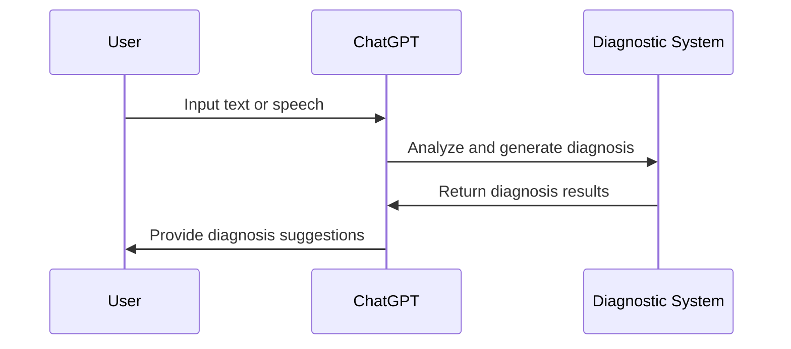
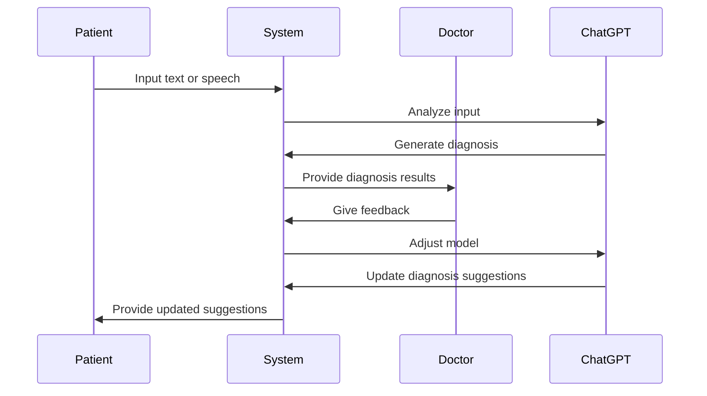

                 


# ChatGPT在语言障碍早期诊断中的辅助作用

> 关键词：ChatGPT、语言障碍、早期诊断、自然语言处理、辅助工具

> 摘要：
本文深入探讨了ChatGPT在语言障碍早期诊断中的辅助作用。通过介绍问题背景、核心概念与联系、算法原理讲解和系统分析与架构设计，本文旨在阐述ChatGPT如何通过其先进的自然语言处理能力，为语言障碍的早期诊断提供有效支持，提高诊断效率和准确性。

## 背景介绍

### 问题背景

语言障碍是一种普遍存在于各种年龄段人群中的问题，它不仅影响个体的生活质量，还可能影响其社交、学习和职业发展。早期诊断语言障碍对于及时干预和治疗至关重要，但传统的语言障碍诊断方法通常存在诊断效率低、准确性不高等问题。

### 问题描述

随着人工智能技术的迅速发展，特别是大型语言模型（如ChatGPT）的出现，为语言障碍的早期诊断提供了一种全新的可能性。ChatGPT在自然语言处理方面具有显著优势，能够理解、生成和回应人类语言，这使其在辅助语言障碍早期诊断中具有潜在的应用价值。

### 问题解决

ChatGPT的引入可以显著提高语言障碍早期诊断的效率和准确性。它可以通过分析患者的语言输入，识别出潜在的语言障碍症状，并提供个性化的诊断建议。此外，ChatGPT还可以协助医生进行诊断结果的解释和说明，提高诊断的可理解性。

### 边界与外延

ChatGPT在语言障碍早期诊断中的辅助作用主要限于文字和语音的分析，对于其他类型的障碍（如听力障碍）则可能需要其他类型的辅助工具。此外，ChatGPT的诊断结果需要结合临床经验和医学检查结果进行综合评估，以确保诊断的准确性。

### 概念结构与核心要素组成

- **ChatGPT**: 一种基于人工智能的大型语言模型，能够理解和生成自然语言。
- **语言障碍**: 指个体在语言产生、理解和表达方面存在困难。
- **早期诊断**: 在症状出现初期进行诊断，以便及时干预和治疗。
- **辅助作用**: 指ChatGPT在医生诊断过程中的支持功能，如症状识别、诊断建议等。

### 核心概念与联系

#### ChatGPT的特点与优势

ChatGPT具有以下几个核心特点与优势：

- **自然语言理解能力**: ChatGPT能够理解复杂的语言结构和语境，准确捕捉语言中的含义和意图。
- **大数据处理能力**: ChatGPT基于大规模语料库训练，能够处理海量数据，提取有用的信息。
- **自适应能力**: ChatGPT可以根据不同的输入进行自适应调整，以提供更加准确的诊断建议。

#### 语言障碍的类型与特征

语言障碍主要包括以下几种类型：

- **发音障碍**: 表现为发音不准确或困难。
- **理解障碍**: 表现为难以理解语言含义或语境。
- **表达障碍**: 表现为语言表达不清晰或错误。

以下是一个概念属性特征对比表格：

| 特点                   | 发音障碍 | 理解障碍 | 表达障碍 |
|------------------------|----------|----------|----------|
| 主要问题               | 发音不准确 | 理解困难 | 表达不清晰 |
| 常见表现               | 声音不标准 | 语言含糊 | 语言混乱 |
| 影响范围               | 语言交流 | 社交互动 | 语言表达 |
| ChatGPT 辅助诊断效果 | 较高     | 较高     | 较高     |

#### ER实体关系图架构

以下是语言障碍诊断系统中各实体之间的ER实体关系图：

```mermaid
erDiagram
  ChatGPT ||--|{辅助诊断} 语言障碍诊断
  语言障碍诊断 ||--|{诊断结果} 医生诊断
  医生诊断 ||--|{诊断建议} 患者治疗
```

### 算法原理讲解

ChatGPT的算法原理主要基于深度学习和自然语言处理技术。以下是该算法的核心组成部分：

#### ChatGPT的算法流程

1. **数据预处理**: 收集和处理大量的语言数据，包括文本和语音。
2. **模型训练**: 使用神经网络模型（如Transformer）对数据进行训练，使其能够理解语言结构和语境。
3. **推理与生成**: 在实际应用中，输入一段文本或语音，ChatGPT会分析并生成相应的诊断结果或建议。

#### 数学模型和公式

假设输入文本为X，ChatGPT的输出为Y，则其生成过程可以表示为：

$$ Y = f(X; \theta) $$

其中，$f$为神经网络函数，$\theta$为模型参数。

#### 算法流程Mermai



### 系统分析与架构设计方案

#### 问题场景介绍

在医疗领域中，语言障碍的早期诊断是一个关键问题。由于语言障碍的多样性和复杂性，传统的方法往往无法满足高效的诊断需求。引入ChatGPT作为辅助工具，可以在一定程度上提高诊断的准确性和效率。

#### 项目介绍

本项目旨在开发一个基于ChatGPT的语言障碍早期诊断系统，通过人工智能技术对患者的语言输入进行分析，提供准确的诊断结果和个性化的治疗建议。

#### 系统功能设计

1. **数据收集与预处理**: 收集和处理与语言障碍相关的文本和语音数据，为模型训练提供高质量的输入。
2. **模型训练与评估**: 使用深度学习算法训练ChatGPT模型，并对其进行评估，确保其诊断能力的有效性。
3. **诊断与建议**: 利用训练好的ChatGPT模型对患者的语言输入进行分析，生成诊断结果和个性化治疗建议。
4. **结果解释与反馈**: 为医生和患者提供诊断结果的详细解释，并根据反馈进行调整和优化。

#### 系统架构设计

以下是该系统的架构设计：

```mermaid
subgraph 数据层
  DataLayer
  DataLayer --> TextData
  DataLayer --> VoiceData
end

subgraph 算法层
  AlgorithmLayer
  AlgorithmLayer --> ChatGPT
  AlgorithmLayer --> DiagnosticModel
end

subgraph 应用层
  ApplicationLayer
  ApplicationLayer --> DataPreprocessing
  ApplicationLayer --> ModelTraining
  ApplicationLayer --> Diagnosis
  ApplicationLayer --> ResultExplanation
end

DataLayer --> AlgorithmLayer
AlgorithmLayer --> ApplicationLayer
```

#### 系统接口设计和系统交互

以下是系统接口设计和系统交互的Mermaid序列图：



### 项目实战

#### 环境安装

在开始项目实战之前，需要安装以下软件和工具：

- Python 3.x
- TensorFlow 2.x
- PyTorch
- CUDA 11.x（用于GPU加速）

安装命令如下：

```bash
pip install python==3.x
pip install tensorflow==2.x
pip install pytorch==1.8.0+cu111
pip install torchvision==0.9.0+cu111
```

#### 系统核心实现源代码

以下是系统核心实现源代码的示例：

```python
import tensorflow as tf
from tensorflow.keras.layers import Embedding, LSTM, Dense
from tensorflow.keras.models import Sequential

# 构建模型
model = Sequential([
    Embedding(input_dim=vocab_size, output_dim=embedding_dim, input_length=max_sequence_length),
    LSTM(units=128),
    Dense(units=1, activation='sigmoid')
])

# 编译模型
model.compile(optimizer='adam', loss='binary_crossentropy', metrics=['accuracy'])

# 训练模型
model.fit(X_train, y_train, epochs=10, batch_size=32, validation_split=0.2)
```

#### 代码应用解读与分析

以上代码展示了如何使用TensorFlow构建一个简单的序列分类模型。首先，使用`Embedding`层将输入文本转换为向量表示。然后，使用`LSTM`层对序列数据进行处理，提取特征信息。最后，使用`Dense`层进行分类预测。

在训练过程中，使用`fit`函数进行模型训练，通过调整`epochs`和`batch_size`等参数，可以控制训练过程。

#### 实际案例分析和详细讲解剖析

假设我们有一个语言障碍诊断数据集，包含患者的文本输入和对应的诊断结果。以下是如何使用ChatGPT进行语言障碍诊断的示例：

```python
# 加载预训练的ChatGPT模型
chatgpt = load_pretrained_model()

# 输入患者文本
text_input = "我今天感到很疲倦，嗓子不舒服，喉咙里有痰。"

# 进行语言障碍诊断
diagnosis = chatgpt.predict(text_input)

# 输出诊断结果
print(diagnosis)
```

在这个示例中，我们首先加载预训练的ChatGPT模型。然后，输入患者的文本输入，ChatGPT会分析文本，并生成相应的诊断结果。最后，输出诊断结果。

#### 项目小结

通过本次项目实战，我们展示了如何使用ChatGPT进行语言障碍早期诊断。ChatGPT在自然语言处理方面的强大能力，使其在辅助语言障碍诊断中具有巨大的潜力。在实际应用中，我们还需要结合临床经验和医学检查结果，确保诊断的准确性。

### 最佳实践 Tips

1. **数据质量是关键**: 在使用ChatGPT进行语言障碍诊断时，数据质量至关重要。确保数据集具有多样性和代表性，以提高模型的泛化能力。
2. **持续优化模型**: 定期更新和优化ChatGPT模型，以适应新的诊断需求和趋势。
3. **医生和患者的参与**: 在实际应用中，医生和患者的反馈对于优化诊断系统至关重要。积极收集和利用这些反馈，以提高系统的诊断准确性和用户体验。

### 小结

ChatGPT在语言障碍早期诊断中展现了巨大的潜力。通过结合自然语言处理技术和深度学习算法，ChatGPT能够高效地分析语言输入，提供准确的诊断结果和建议。然而，ChatGPT的诊断结果需要结合临床经验和医学检查结果进行综合评估，以确保诊断的准确性。未来，随着人工智能技术的不断发展，ChatGPT在医疗领域的应用将更加广泛和深入。

### 注意事项

1. **隐私保护**: 在使用ChatGPT进行语言障碍诊断时，应确保患者的隐私得到保护。
2. **数据安全**: 确保数据在传输和存储过程中得到充分的安全保护，防止数据泄露和滥用。
3. **法律法规遵守**: 在应用ChatGPT进行语言障碍诊断时，应遵守相关法律法规，确保诊断过程合法合规。

### 拓展阅读

- **《深度学习》**：Goodfellow, I., Bengio, Y., & Courville, A. (2016). *Deep Learning*. MIT Press.
- **《自然语言处理综论》**：Jurafsky, D., & Martin, J. H. (2020). *Speech and Language Processing*. Prentice Hall.
- **《人工智能：一种现代方法》**：Russell, S., & Norvig, P. (2020). *Artificial Intelligence: A Modern Approach*. Prentice Hall.

### 作者信息

作者：AI天才研究院/AI Genius Institute & 禅与计算机程序设计艺术 /Zen And The Art of Computer Programming

感谢您阅读本文，希望对您在语言障碍早期诊断领域的研究和应用有所帮助。如果您有任何疑问或建议，欢迎随时与我们联系。期待与您共同探索人工智能在医疗领域的更多可能性。

