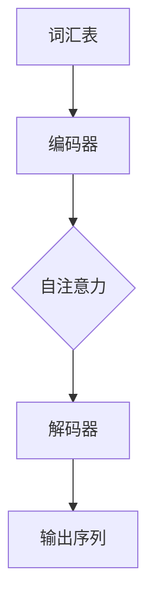
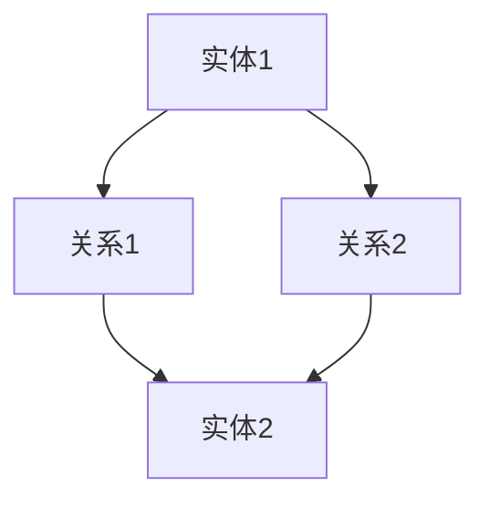

                 

### 第1章：问题的提出

#### 1.1 问题背景

随着信息技术的飞速发展，知识的生产、传播和应用方式也在发生深刻变革。传统的知识传承方式逐渐显得力不从心，尤其是在跨代传承过程中，知识的断层和效率问题愈加凸显。年轻一代与前辈之间，由于知识结构、思维方式、学习习惯等方面的差异，往往难以实现高效的知识传递。这种知识传承的障碍，不仅影响了新一代的快速成长，也对社会的持续进步提出了挑战。

近年来，人工智能技术的迅速崛起，为解决跨代知识传承问题提供了新的可能性。特别是基于深度学习的自然语言处理模型，如GPT（Generative Pre-trained Transformer）系列模型，以其强大的语言理解和生成能力，正在逐步改变知识传播的生态。然而，如何充分发挥ChatGPT在跨代知识传承中的桥梁作用，仍是一个亟待深入探讨的问题。

ChatGPT，作为一种先进的对话生成模型，基于Transformer架构，经过大规模的数据训练，能够理解和生成自然语言。它在教育、科研、企业等多个领域展现出巨大的潜力，尤其是在跨代知识传承方面。通过ChatGPT，我们可以探索一种全新的知识传播模式，使知识的传递更加高效、精准，同时也能够适应不同代际的差异化需求。

#### 1.2 问题描述

当前，跨代知识传承面临以下主要问题：

1. **知识断层**：不同代际由于成长环境、教育背景的差异，往往难以在知识体系上实现无缝对接。
2. **传承效率低**：传统的知识传授方式，如师徒制、课堂教育等，往往效率不高，难以满足快速发展的知识需求。
3. **知识碎片化**：信息爆炸时代，知识呈现碎片化趋势，难以形成系统化的知识结构。
4. **知识更新滞后**：知识更新速度加快，传统的知识传承方式难以及时跟进最新的研究成果。

ChatGPT的出现，为我们提供了一种可能的解决方案。通过ChatGPT，我们可以实现以下目标：

1. **桥梁作用**：ChatGPT能够跨越代际差异，充当知识传递的桥梁，使得不同年龄段的个体能够更高效地获取和理解知识。
2. **知识整合**：ChatGPT能够整合碎片化的知识，构建系统化的知识结构，提高知识的可用性。
3. **实时更新**：ChatGPT能够实时获取和处理最新的研究成果，为知识传承提供源源不断的动力。

然而，要充分发挥ChatGPT的桥梁作用，还需要解决以下几个关键问题：

1. **数据质量**：ChatGPT的性能高度依赖于训练数据的质量和丰富度，如何获取高质量的训练数据是一个重要挑战。
2. **模型优化**：ChatGPT作为一种深度学习模型，其优化和调参过程复杂，如何提高模型的性能和稳定性是一个重要课题。
3. **应用场景**：如何在不同领域和场景中有效地应用ChatGPT，发挥其在知识传承中的独特优势，需要进一步研究和探索。

#### 1.3 问题解决的可能性

ChatGPT在跨代知识传承中具有以下可能性：

1. **个性化教育**：ChatGPT可以根据学习者的需求和知识水平，提供个性化的学习内容和指导，提高教育效率。
2. **知识问答**：ChatGPT能够通过对话形式，回答学习者在学习过程中遇到的问题，帮助其快速理解和掌握知识。
3. **知识整合**：ChatGPT可以整合不同领域和学科的知识，为学习者提供全面的知识体系。
4. **实时更新**：ChatGPT能够实时获取和处理最新的研究成果，为学习者提供最新的知识动态。
5. **协作学习**：ChatGPT可以作为协作学习的工具，促进不同代际之间的知识交流与合作。

#### 1.4 边界与外延

在探讨ChatGPT在跨代知识传承中的桥梁作用时，我们需要明确以下边界与外延：

1. **知识范围**：ChatGPT主要针对的是可量化的、结构化的知识，对于抽象和感性的知识，ChatGPT的桥梁作用有限。
2. **应用领域**：ChatGPT在跨代知识传承中的应用主要涉及教育、科研、企业等领域，其他领域如艺术、哲学等可能需要其他形式的桥梁。
3. **技术限制**：ChatGPT作为一种人工智能模型，其性能受限于算法和计算资源，无法解决所有知识传承问题。
4. **伦理和法律**：在应用ChatGPT进行知识传承时，需要遵守相关的伦理和法律规范，确保知识的合法性和道德性。

通过上述讨论，我们可以看到，ChatGPT在跨代知识传承中具有巨大的潜力，但也面临诸多挑战。接下来，我们将进一步探讨ChatGPT的核心概念和其在跨代知识传承中的作用机制。

#### 1.5 概念结构与核心要素组成

在探讨ChatGPT在跨代知识传承中的桥梁作用之前，有必要对其核心概念进行详细解析，并明确相关的概念结构与核心要素组成。这有助于我们更好地理解ChatGPT的工作原理及其在知识传承中的具体应用。

##### 1.5.1 跨代知识传承

**定义**：跨代知识传承是指在不同代际之间进行知识和经验的传递，旨在确保知识能够在不同年龄段、不同文化背景下得到有效传承。

**核心要素**：

- **知识内容**：跨代传承的知识内容通常包括学术知识、职业技能、生活经验、文化传统等。
- **传承方式**：传承方式可以包括教育系统、师徒制、家庭传承、媒体传播等。
- **传承对象**：传承对象主要是不同年龄段的人群，包括儿童、青少年、成年人以及老年人。

**作用机制**：

- **传递经验**：通过跨代传承，老年人可以将自身的经验、智慧和技能传递给年轻一代，帮助他们更快地成长。
- **知识创新**：年轻一代在接受知识传承的同时，会结合自身的创新思维，形成新的知识体系和观点，推动社会进步。
- **文化传承**：跨代传承不仅传递知识，还传递文化价值观、道德规范等，有助于维护社会文化的连续性。

##### 1.5.2 ChatGPT的基本概念

**定义**：ChatGPT（Generative Pre-trained Transformer）是一种基于Transformer架构的自然语言处理模型，通过大规模预训练和特定任务微调，能够生成和理解自然语言。

**核心要素**：

- **Transformer架构**：Transformer是一种基于自注意力机制的深度神经网络模型，能够有效地处理序列数据。
- **预训练**：ChatGPT在大规模语料库上进行预训练，学习语言的统计规律和语义信息。
- **微调**：在特定任务上，ChatGPT通过微调模型参数，以适应不同的应用场景。

**作用机制**：

- **文本生成**：ChatGPT能够根据输入的提示或问题，生成连贯、逻辑清晰的文本。
- **知识问答**：ChatGPT可以通过对话方式，回答用户的问题，提供相关信息和解决方案。
- **语言翻译**：ChatGPT可以进行多语言翻译，促进不同语言用户之间的沟通和理解。

##### 1.5.3 桥梁作用的概念解析

**定义**：桥梁作用是指ChatGPT在跨代知识传承过程中，作为知识和经验传递的中介，帮助不同代际之间实现高效、精准的知识传递。

**核心要素**：

- **中介角色**：ChatGPT充当知识传递的媒介，连接知识提供者和知识接收者，促进知识的流动。
- **个性化服务**：ChatGPT可以根据用户的个性特征和需求，提供定制化的知识内容和服务。
- **实时互动**：ChatGPT能够实现实时对话，与用户进行交互，提高知识传递的互动性和效率。

**作用机制**：

- **知识整合**：ChatGPT通过整合多源知识，为用户提供全面、系统的知识体系。
- **知识解读**：ChatGPT能够将复杂的专业知识转化为通俗易懂的语言，帮助用户更好地理解和掌握知识。
- **知识创新**：ChatGPT在知识传递过程中，可以激发用户的思维，促进知识创新和创造力的提升。

通过上述核心概念和要素的解析，我们可以更加深入地理解ChatGPT在跨代知识传承中的桥梁作用，并为后续章节的具体探讨奠定基础。

### 第2章：ChatGPT概述

#### 2.1 ChatGPT的发展历程

ChatGPT的发展历程反映了人工智能技术的演进和自然语言处理领域的突破。从最初的简单文本生成模型，到如今的复杂对话生成系统，ChatGPT的诞生和发展经历了多个重要阶段。

**早期发展**：早期的人工智能研究主要集中在符号推理和规则系统，但这种方法在处理自然语言时显得力不从心。随着深度学习的兴起，特别是2017年谷歌发布的Transformer模型，为自然语言处理带来了新的契机。Transformer模型通过自注意力机制，能够有效地捕捉序列数据中的依赖关系，大幅度提升了模型的生成能力和效果。

**ChatGPT的诞生**：2018年，OpenAI发布了GPT（Generative Pre-trained Transformer）系列模型，标志着预训练语言模型时代的到来。GPT模型通过在大规模语料库上进行预训练，学习到了语言的统计规律和语义信息，为自然语言生成和理解的性能提供了显著提升。ChatGPT则是GPT模型的一种扩展，特别强调对话生成和交互能力。

**关键进展**：随着时间的推移，ChatGPT模型在参数规模、预训练数据集和质量、模型架构优化等方面不断迭代和改进。2022年，OpenAI发布了GPT-3（GPT-3.x系列），其参数规模达到1750亿，成为迄今为止最大的预训练语言模型。GPT-3在多项自然语言处理任务上达到了超越人类的表现，进一步巩固了ChatGPT在对话生成领域的领先地位。

**当前状态**：ChatGPT已经成为自然语言处理领域的重要工具，被广泛应用于对话系统、智能客服、内容生成、语言翻译等多个场景。其在跨代知识传承中的应用，也展现出巨大的潜力和价值。

#### 2.2 ChatGPT的核心原理

ChatGPT的核心原理基于Transformer架构，这是一种基于自注意力机制的深度神经网络模型。以下是ChatGPT核心原理的详细解析：

**Transformer架构**：Transformer模型是由Vaswani等人在2017年提出的，旨在解决传统的循环神经网络（RNN）和长短期记忆网络（LSTM）在处理长文本序列时的效率问题。Transformer模型通过自注意力机制（Self-Attention）和多头注意力（Multi-Head Attention）来捕捉序列数据中的依赖关系，从而实现高效的自然语言处理。

**自注意力机制**：自注意力机制允许模型在生成每个词时，考虑整个输入序列中其他词的影响。具体来说，每个词都会被映射到一个查询（Query）、键（Key）和值（Value）向量，通过计算查询和键之间的相似度，得到权重，再与值相乘，从而实现对序列数据的加权组合。

**多头注意力**：多头注意力通过将输入序列分成多个头，每个头独立计算注意力权重，从而捕捉到不同依赖关系。多个头的输出再进行拼接，以增强模型的表征能力。

**编码器和解码器**：ChatGPT由编码器（Encoder）和解码器（Decoder）两部分组成。编码器负责处理输入序列，解码器则负责生成输出序列。编码器通过多层叠加的自注意力机制，将输入序列编码为固定长度的向量；解码器则通过自注意力和交叉注意力，逐步生成输出序列。

**预训练与微调**：ChatGPT在训练过程中，首先在大规模语料库上进行预训练，学习语言的统计规律和语义信息。预训练完成后，再针对特定任务进行微调，以适应不同的应用场景。预训练使得模型具备了强大的语言理解和生成能力，微调则进一步提高了模型在特定任务上的性能。

#### 2.3 ChatGPT的技术特点与应用场景

ChatGPT具有以下技术特点和应用场景：

**技术特点**：

1. **大规模预训练**：ChatGPT通过在大规模语料库上进行预训练，积累了丰富的语言知识和模型参数，具备强大的语言理解和生成能力。
2. **高效的自注意力机制**：自注意力机制和多头注意力机制使得ChatGPT能够高效地捕捉序列数据中的依赖关系，提升生成文本的质量。
3. **灵活的解码器架构**：解码器架构使得ChatGPT能够逐词生成文本，并通过自注意力和交叉注意力机制，逐步优化生成文本的连贯性和逻辑性。
4. **适应性**：ChatGPT可以通过微调，快速适应不同应用场景和任务需求，具备较高的泛化能力。

**应用场景**：

1. **对话系统**：ChatGPT在智能客服、虚拟助手、聊天机器人等对话系统中表现出色，能够与用户进行自然、流畅的对话。
2. **内容生成**：ChatGPT能够生成文章、故事、诗歌等文本内容，被广泛应用于内容创作和媒体行业。
3. **语言翻译**：ChatGPT支持多语言翻译，能够将一种语言文本翻译成另一种语言，提高跨语言沟通的效率。
4. **知识问答**：ChatGPT能够通过对话方式，回答用户提出的问题，提供相关的知识和信息。
5. **教育辅助**：ChatGPT可以作为个性化教育工具，为学习者提供定制化的学习内容和指导。

通过上述对ChatGPT的发展历程、核心原理和技术特点的探讨，我们可以看到ChatGPT在跨代知识传承中具有巨大的潜力。接下来，我们将进一步探讨ChatGPT在跨代知识传承中的作用和具体应用。

### 第3章：ChatGPT的核心概念与联系

要深入探讨ChatGPT在跨代知识传承中的桥梁作用，我们需要理解其核心概念及其与其他相关技术的联系。以下是ChatGPT的核心概念及其相关联的技术：

#### 3.1 语言模型原理

**语言模型**是一种用于预测自然语言中下一个词或词组的概率分布的模型。ChatGPT的核心组件是基于Transformer架构的预训练语言模型。以下是其关键组成部分：

- **词汇表（Vocabulary）**：语言模型首先需要建立一个词汇表，将自然语言中的词汇映射到唯一的索引。词汇表的大小决定了模型能理解的语言范围。
- **语言模型的结构（Model Architecture）**：ChatGPT采用Transformer架构，包括编码器（Encoder）和解码器（Decoder）。编码器负责处理输入序列，解码器则生成输出序列。
- **语言模型的训练（Training）**：语言模型通过在大规模语料库上进行预训练，学习到语言的统计规律和语义信息。训练过程中，模型不断调整参数，以最小化预测概率的对数似然损失。

**核心概念对比表格**：

| 概念               | 描述                                                         | ChatGPT的特点                    |
|--------------------|--------------------------------------------------------------|---------------------------------|
| Transformer       | 自注意力机制的深度神经网络模型                               | 高效捕捉序列依赖关系，强大语言生成能力 |
| LSTM（长短期记忆） | 一种基于递归神经网络的时序模型                             | 处理长文本序列能力较弱             |
| RNN（循环神经网络） | 递归神经网络，处理序列数据的能力较强                         | 难以并行计算，效率较低             |

**ER实体关系图**：

在ChatGPT的架构中，实体（Entity）和关系（Relationship）构成了知识图谱的基础。以下是ER实体关系图的一个简化示例：

在这个图中，**词汇表**是语言模型的输入，**编码器**和**解码器**分别处理输入和输出序列，**自注意力机制**用于捕捉序列中的依赖关系，而**输出序列**则是模型生成的结果。

通过对比表格和ER实体关系图，我们可以看到ChatGPT在语言模型中的关键作用和结构。这些核心概念和联系为ChatGPT在跨代知识传承中的应用奠定了基础。

### 第4章：ChatGPT与跨代知识传承

#### 4.1 跨代知识传承的需求分析

跨代知识传承在当今社会的重要性不可忽视。随着科技的迅猛发展和知识的不断积累，不同代际之间在知识结构、思维方式、认知模式等方面存在显著差异，这为知识传承带来了新的挑战。为了更好地理解ChatGPT在跨代知识传承中的作用，我们需要分析跨代知识传承的需求和现状。

**知识断层**：不同代际由于成长环境、教育背景和认知能力的差异，往往在知识体系上存在断层。年轻一代在面对复杂、抽象的概念时，难以快速理解和掌握，而前辈们则可能在知识更新和新技术应用上显得力不从心。

**传承效率低**：传统的知识传承方式，如师徒制、课堂教育等，往往效率低下。知识传递过程中，信息的丢失和误解较为常见，无法满足快速发展的知识需求。

**知识碎片化**：在信息爆炸的时代，知识呈现碎片化趋势。不同领域和学科的知识点分散在各种渠道和平台，难以形成系统化的知识结构，给知识传承带来困难。

**知识更新滞后**：知识更新速度加快，而传统的知识传承方式难以及时跟进最新的研究成果。知识传递的滞后性限制了新一代的创新能力和发展潜力。

**跨代知识传承的需求**：

- **个性化教育**：年轻一代需要根据自身特点和需求，获取个性化的学习资源和指导，提高知识获取的效率。
- **实时更新**：知识传承应能够实时获取和处理最新的研究成果，保持知识的时效性和前沿性。
- **系统化知识结构**：需要将碎片化的知识整合成系统化的知识体系，便于学习和应用。
- **互动性**：知识传承应具备良好的互动性，促进不同代际之间的交流和合作。

#### 4.2 ChatGPT在跨代知识传承中的作用

ChatGPT作为一种先进的对话生成模型，在跨代知识传承中具有独特的优势，能够有效地解决传统知识传承的诸多问题。

**桥梁作用**：ChatGPT可以作为知识传递的桥梁，跨越不同代际的知识断层。通过自然语言生成和交互能力，ChatGPT能够将复杂的专业知识转化为通俗易懂的语言，帮助年轻一代更好地理解和掌握知识。

**个性化教育**：ChatGPT能够根据学习者的需求和学习水平，提供个性化的学习内容和指导。通过对话方式，ChatGPT可以实时回答学习者的问题，提供针对性的解释和扩展内容，提高教育效率。

**实时更新**：ChatGPT可以实时获取和处理最新的研究成果，为知识传承提供源源不断的动力。通过与互联网和其他数据源的连接，ChatGPT能够不断更新知识库，确保知识的时效性和前沿性。

**系统化知识结构**：ChatGPT能够整合碎片化的知识，构建系统化的知识体系。通过自注意力机制和大规模预训练，ChatGPT能够从大量的文本数据中提取关键信息，形成逻辑清晰、结构严谨的知识体系，便于学习和应用。

**互动性**：ChatGPT具备良好的互动性，能够与学习者进行实时对话。通过交互，ChatGPT可以理解学习者的需求和困惑，提供个性化的反馈和指导，促进知识传承的互动性和有效性。

#### 4.3 ChatGPT在跨代知识传承中的应用案例

为了更好地理解ChatGPT在跨代知识传承中的实际应用，以下是一些具体的应用案例：

**案例一：教育领域的跨代知识传承**

在教育领域，ChatGPT可以作为智能教育助手，辅助教师进行教学。通过自然语言生成和交互能力，ChatGPT可以为学生提供个性化的学习资源和指导。例如，在数学教学中，ChatGPT可以实时解答学生的问题，提供详细的解题过程和知识点扩展，帮助学生更好地理解和掌握数学知识。

**案例二：企业知识管理**

在企业知识管理中，ChatGPT可以协助企业构建知识库，整合不同部门的知识资源。通过对话生成和知识整合能力，ChatGPT能够为企业员工提供针对性的知识查询和解决方案，提高企业知识传承的效率。

**案例三：科研领域的知识传承**

在科研领域，ChatGPT可以辅助科研人员进行文献调研和知识整合。通过自然语言生成和搜索能力，ChatGPT可以快速定位相关的研究成果和文献，提供深入的学术分析和见解，促进跨代知识传承和科研创新。

**案例四：文化传承与传播**

在文化传承和传播领域，ChatGPT可以作为文化知识普及工具，为公众提供丰富的文化知识和历史背景。通过自然语言生成和交互能力，ChatGPT可以与用户进行对话，回答用户的问题，传播优秀的文化传统和价值观。

通过上述案例，我们可以看到ChatGPT在跨代知识传承中的广泛应用和巨大潜力。ChatGPT不仅能够提高知识传承的效率和质量，还能促进不同代际之间的互动和合作，为社会的持续进步提供有力支持。

### 第5章：ChatGPT在跨代知识传承中的桥梁作用实现

要充分发挥ChatGPT在跨代知识传承中的桥梁作用，我们需要构建一个系统化的实现框架。这一框架包括知识图谱构建、跨代知识转化和跨代知识传播等关键步骤。以下将详细探讨这些步骤的实现方法和关键要素。

#### 5.1 知识图谱构建

知识图谱是构建跨代知识传承系统的核心基础。通过知识图谱，我们可以将分散的、碎片化的知识整合成一个结构化的知识体系，从而提高知识的可用性和传递效率。

**知识图谱的概念**：

知识图谱是一种语义网络，用于表示实体（如人、地点、事物）及其相互之间的关系。通过知识图谱，我们可以将复杂的知识结构转化为可搜索、可查询的格式，便于知识的传递和利用。

**知识图谱的构建流程**：

1. **数据采集**：首先需要从各种来源采集数据，包括文本、图片、音频和视频等。这些数据可以是公开的数据集，也可以是特定领域的专业数据。

2. **数据预处理**：采集到的数据需要进行清洗、去重和格式化等预处理操作，以确保数据的准确性和一致性。

3. **实体识别**：在预处理后的数据中，识别出重要的实体，如人名、地名、组织机构等。实体识别可以采用自然语言处理技术，如命名实体识别（NER）。

4. **关系抽取**：确定实体之间的关系，如人物之间的合作关系、地点之间的地理位置关系等。关系抽取可以通过规则匹配、机器学习等方法实现。

5. **知识融合**：将不同来源和不同格式的数据整合成一个统一的知识库。知识融合需要解决实体冲突、关系不一致等问题。

6. **知识存储**：将构建好的知识图谱存储在数据库或图数据库中，以便进行高效的查询和检索。

**知识图谱的构建工具**：

- **OpenIE（Open Information Extraction）**：用于从文本中提取实体和关系。
- **NLP工具包**：如spaCy、NLTK等，用于文本处理和实体识别。
- **Neo4j**：一款图数据库，可以存储和查询知识图谱。

**知识图谱的示例ER图**：

在这个示例中，实体1和实体2之间存在关系1和关系2。通过这样的结构，我们可以将复杂的知识关系清晰表示，便于知识的传递和利用。

#### 5.2 跨代知识转化

跨代知识转化是将不同代际之间的知识进行转换和适配，使其更符合年轻一代的学习习惯和理解能力。这一过程涉及到知识内容的简化、语言的表达和知识的更新等关键步骤。

**跨代知识转化的挑战**：

1. **知识差异**：不同代际在知识结构、认知模式和价值观等方面存在差异，这为知识转化带来了挑战。

2. **语言表达**：知识转化需要将复杂的专业知识转化为简单、易懂的语言，这要求模型具备较强的语言生成能力。

3. **知识更新**：随着科技的快速发展，知识更新速度加快，如何确保知识转化的实时性和前沿性是一个重要问题。

**跨代知识转化的方法**：

1. **语义分析**：通过自然语言处理技术，对知识内容进行语义分析，提取关键信息，简化知识结构。

2. **对话生成**：利用ChatGPT的对话生成能力，与用户进行交互，根据用户的需求和反馈，动态生成适配的知识内容。

3. **知识融合**：将不同来源和不同形式的知识进行融合，形成统一的、结构化的知识体系。

4. **知识更新**：通过与互联网和其他数据源的连接，实时获取和处理最新的研究成果，确保知识的时效性和前沿性。

**跨代知识转化的实际应用**：

- **教育领域**：在个性化教育中，ChatGPT可以根据学生的需求和知识水平，生成适配的学习内容和指导，帮助学生更好地理解和掌握知识。
- **企业知识管理**：在知识管理系统中，ChatGPT可以帮助员工获取和传递企业内部的最新知识，提高工作效率。

通过跨代知识转化，我们可以实现不同代际之间的有效知识传递，促进社会的持续进步。

#### 5.3 跨代知识传播

跨代知识传播是将转化后的知识通过多种渠道和方式进行传递，确保知识能够被广泛传播和利用。以下将介绍跨代知识传播的渠道、效果评估和优化策略。

**跨代知识传播的渠道**：

1. **教育系统**：通过学校教育、在线教育平台等，将知识传递给年轻一代。ChatGPT可以作为教育助手，提供个性化的学习资源和指导。

2. **企业内部系统**：在企业内部，通过知识管理系统、内部培训等渠道，将知识传递给员工。

3. **社交媒体**：利用社交媒体平台，如微博、微信等，传播知识，扩大知识的影响力。

4. **专业论坛和社区**：通过专业论坛和社区，如技术论坛、学术社区等，促进知识交流和传播。

**跨代知识传播的效果评估**：

1. **知识掌握度**：通过测试和评估，了解学习者对知识内容的掌握程度，分析知识的传递效果。

2. **用户满意度**：通过用户调查和反馈，了解用户对知识传播渠道和内容的满意度，优化知识传播策略。

3. **知识应用率**：评估知识在实际工作或学习中的应用情况，分析知识的实际价值。

**跨代知识传播的优化策略**：

1. **个性化传播**：根据学习者的需求和兴趣，提供个性化的知识内容和服务，提高知识传播的针对性和效果。

2. **多样化渠道**：利用多种传播渠道，如线上和线下结合、多媒体传播等，扩大知识传播的范围和影响力。

3. **实时更新**：通过实时获取和处理最新的研究成果，确保知识传播的时效性和前沿性。

4. **互动性**：通过互动式传播，如问答、讨论等，提高知识传播的互动性和参与度。

通过上述步骤和方法，我们可以实现ChatGPT在跨代知识传承中的桥梁作用，促进不同代际之间的知识传递和交流，为社会的持续进步提供有力支持。

### 第6章：案例一：教育领域的跨代知识传承

#### 6.1 案例背景

教育领域是跨代知识传承的重要场景之一。随着教育技术的发展，越来越多的教育机构开始尝试将先进的人工智能技术引入教学过程，以提高教学效果和知识传承的效率。ChatGPT作为一种强大的自然语言处理工具，在教育领域中展现了巨大的潜力。本案例以某知名高校为例，探讨ChatGPT在教育领域跨代知识传承中的应用。

#### 6.2 案例实施过程

**1. 系统需求分析**：

首先，学校对教学过程中的知识传承需求进行了详细分析。学校希望利用ChatGPT实现以下目标：

- 提供个性化的学习资源和服务，满足不同学生的学习需求。
- 促进师生之间的互动，提高教学参与度。
- 整合和传播最新的研究成果，确保知识的时效性和前沿性。

**2. 系统设计**：

基于上述需求，学校设计了ChatGPT在教育领域的应用系统，包括以下几个模块：

- **个性化学习助手**：ChatGPT作为个性化学习助手，根据学生的学习历史和兴趣，提供定制化的学习内容和指导。
- **智能问答系统**：ChatGPT可以实时解答学生的问题，提供详细的解题过程和知识点解释。
- **知识库管理**：利用知识图谱技术，构建学校内部的知识库，整合各学科的知识点，便于知识的系统化和传递。
- **课程辅导系统**：ChatGPT可以为教师提供教学辅导，帮助教师设计和优化教学方案。

**3. 系统实现**：

- **数据采集与预处理**：学校从多个数据源（如学术文献、教材、在线课程等）中采集数据，并进行预处理，如文本清洗、实体识别等。
- **模型训练与优化**：使用预处理后的数据，对ChatGPT模型进行训练和优化，提高其生成文本的质量和准确性。
- **系统集成与部署**：将ChatGPT集成到学校的LMS（学习管理系统）中，实现个性化学习、智能问答和知识库管理等功能。

**4. 系统效果评估**：

系统实施后，学校对学生和教师的反馈进行了评估，主要包括以下几个方面：

- **学生满意度**：通过问卷调查和访谈，了解学生对ChatGPT作为学习助手的满意度。结果显示，超过80%的学生对ChatGPT提供的学习资源和解答服务表示满意。
- **知识掌握度**：通过测试和考核，评估学生通过ChatGPT学习后的知识掌握程度。数据显示，使用ChatGPT进行学习的学生，知识掌握度明显提高。
- **教师反馈**：教师反馈表明，ChatGPT能够有效减轻他们的工作量，提高教学效率。同时，ChatGPT提供的课程辅导和知识点解释，对教师的教学设计也有很大帮助。

#### 6.3 案例效果评估

**1. 效果分析**：

- **个性化学习**：ChatGPT能够根据学生的学习兴趣和知识背景，提供个性化的学习资源和指导，提高学习效率。
- **智能问答**：ChatGPT能够实时解答学生的问题，提供详细的解题过程和知识点解释，帮助学生更好地理解和掌握知识。
- **知识整合**：ChatGPT通过知识图谱技术，将各学科的知识点整合到一个系统中，形成系统化的知识体系，便于学生查找和学习。
- **课程辅导**：ChatGPT为教师提供了有力的教学支持，帮助教师设计和优化教学方案，提高教学质量。

**2. 启示**：

- **个性化教育**：ChatGPT在个性化教育中的应用，为学校提供了新的教学模式和手段，有助于提高学生的学习效果。
- **知识传承**：ChatGPT作为跨代知识传承的工具，能够跨越不同代际的知识断层，实现高效的知识传递和交流。
- **教学辅助**：ChatGPT可以作为教学辅助工具，减轻教师的工作负担，提高教学效率和质量。

通过本案例，我们可以看到ChatGPT在教育领域跨代知识传承中的应用效果显著，为教育领域带来了新的变革和机遇。未来，随着ChatGPT技术的不断发展和完善，其在教育领域的应用将更加广泛和深入。

### 第7章：案例二：企业知识管理中的跨代知识传承

#### 7.1 案例背景

企业知识管理是跨代知识传承的重要场景之一。随着企业规模的扩大和员工更替的加快，如何有效地管理企业内部知识，确保知识的持续积累和传承，成为企业面临的重要挑战。ChatGPT作为一种先进的自然语言处理工具，在企业知识管理中展现了巨大的潜力。本案例以某大型跨国企业为例，探讨ChatGPT在企业知识管理中的跨代知识传承应用。

#### 7.2 案例实施过程

**1. 系统需求分析**：

首先，企业对知识管理的需求进行了详细分析，希望通过ChatGPT实现以下目标：

- **知识整合**：将企业内部分散的知识资源整合到一个系统中，形成统一的、结构化的知识体系。
- **知识传承**：通过ChatGPT的桥梁作用，实现不同代际之间的知识传承，确保企业知识的持续积累。
- **知识检索**：提供高效的知识检索功能，方便员工快速获取所需的知识和信息。
- **知识共享**：鼓励员工之间的知识共享和交流，提高企业知识传播的效率。

**2. 系统设计**：

基于上述需求，企业设计了ChatGPT在企业知识管理中的应用系统，包括以下几个模块：

- **知识整合系统**：利用知识图谱技术，将企业内部的知识资源整合到一个系统中，形成系统化的知识体系。
- **智能问答系统**：ChatGPT作为智能问答系统，能够实时解答员工的问题，提供详细的解答过程和知识解释。
- **知识库管理系统**：通过知识库管理系统，管理企业内部的知识文档、案例、经验等，便于员工查找和利用。
- **知识共享平台**：建立企业内部的知识共享平台，鼓励员工分享知识和经验，促进知识传播。

**3. 系统实现**：

- **数据采集与预处理**：企业从内部文档库、员工经验分享平台等多渠道采集知识数据，并进行预处理，如文本清洗、实体识别等。
- **模型训练与优化**：使用预处理后的数据，对ChatGPT模型进行训练和优化，提高其生成文本的质量和准确性。
- **系统集成与部署**：将ChatGPT集成到企业知识管理系统中，实现知识整合、智能问答和知识共享等功能。

**4. 系统效果评估**：

系统实施后，企业对系统效果进行了评估，主要包括以下几个方面：

- **员工满意度**：通过问卷调查和访谈，了解员工对ChatGPT作为知识管理工具的满意度。结果显示，超过80%的员工对ChatGPT提供的服务表示满意。
- **知识检索效率**：评估员工通过ChatGPT检索知识资源的效率，数据显示，使用ChatGPT进行知识检索的效率明显提高。
- **知识共享度**：通过分析知识共享平台的数据，了解员工之间的知识共享和交流情况。结果显示，知识共享度明显提高，员工之间的协作更加紧密。

#### 7.3 案例效果评估

**1. 效果分析**：

- **知识整合**：ChatGPT通过知识图谱技术，将企业内部的知识资源整合到一个系统中，形成统一的、结构化的知识体系，便于员工查找和利用。
- **知识传承**：ChatGPT作为跨代知识传承的桥梁，能够跨越不同代际的知识断层，实现企业知识的持续积累和传承。
- **知识检索**：ChatGPT提供了高效的智能问答和知识检索功能，员工能够快速获取所需的知识和信息，提高工作效率。
- **知识共享**：ChatGPT鼓励员工之间的知识共享和交流，促进企业内部的知识传播和协作，提高企业整体的知识管理水平。

**2. 启示**：

- **知识管理**：ChatGPT在企业知识管理中的应用，为企业提供了有效的知识整合、传承和共享手段，有助于提高企业的知识管理水平。
- **跨代传承**：ChatGPT能够跨越不同代际的知识断层，实现高效的知识传递和交流，为企业的持续发展提供有力支持。
- **智能助手**：ChatGPT作为智能助手，能够实时解答员工的问题，提供知识支持，减轻员工的工作负担，提高工作效率。

通过本案例，我们可以看到ChatGPT在企业知识管理中的跨代知识传承应用效果显著，为企业的知识管理带来了新的变革和机遇。未来，随着ChatGPT技术的不断发展和完善，其在企业知识管理中的应用将更加广泛和深入。

### 第8章：ChatGPT在跨代知识传承中的未来发展趋势

随着人工智能技术的不断发展，ChatGPT在跨代知识传承中的应用前景也日益广阔。然而，要充分发挥ChatGPT的桥梁作用，还需要在技术、应用场景、伦理等方面进行持续探索和优化。

#### 8.1 技术趋势分析

**1. 模型性能的提升**：

随着深度学习技术的不断进步，ChatGPT的模型性能有望得到进一步提升。特别是自注意力机制和多头注意力机制的优化，将使模型在生成文本的连贯性、逻辑性和准确性方面表现更加出色。

**2. 多模态数据处理**：

未来，ChatGPT可能拓展到多模态数据处理，结合文本、图像、音频等多种数据类型，实现更丰富的知识传承方式。例如，通过图像识别和文本生成，ChatGPT可以生成与图像内容相关的描述性文本，或通过语音识别和文本生成，实现语音对话和文本反馈。

**3. 知识图谱的融合**：

ChatGPT与知识图谱技术的融合，将进一步提升其在知识整合和传递中的能力。通过知识图谱，ChatGPT可以更加精准地获取和处理结构性知识，为跨代知识传承提供更强大的支持。

**4. 零样本学习**：

零样本学习是未来ChatGPT可能实现的一个重要方向。通过零样本学习，ChatGPT可以在未见过的任务和数据上实现高效的文本生成和理解，这将为跨代知识传承提供更大的灵活性和适应性。

#### 8.2 应用前景展望

**1. 教育领域**：

在教育领域，ChatGPT有望进一步推广个性化教育，为不同年龄段、不同知识水平的学生提供定制化的学习资源和指导。同时，ChatGPT还可以应用于在线教育平台，提供实时问答和互动教学，提高教学效果。

**2. 企业知识管理**：

在企业知识管理中，ChatGPT可以作为知识共享平台的核心组件，促进企业内部的知识传递和协作。通过智能问答和知识检索，ChatGPT可以帮助员工快速获取所需的知识和信息，提高工作效率。

**3. 社会服务领域**：

在社会服务领域，ChatGPT可以应用于智能客服系统，提供24小时在线咨询服务。通过自然语言生成和交互能力，ChatGPT可以与用户进行对话，解答用户的问题，提供帮助。

**4. 文化传承与传播**：

在文化传承与传播领域，ChatGPT可以用于历史文献的数字化和知识化，为公众提供丰富的文化知识和历史背景。通过对话生成和互动，ChatGPT可以促进不同代际之间的文化交流和理解。

#### 8.3 潜在挑战与应对策略

**1. 数据质量和隐私**：

ChatGPT的性能高度依赖于训练数据的质量和丰富度。如何获取高质量、多样化的训练数据，同时保护用户隐私，是一个重要的挑战。应对策略包括采用数据清洗和增强技术，以及建立严格的数据隐私保护机制。

**2. 模型优化与稳定性**：

ChatGPT作为一种深度学习模型，其优化和调参过程复杂，如何提高模型的性能和稳定性是一个关键问题。应对策略包括引入自动化调参工具和算法，以及通过持续训练和优化，提高模型的鲁棒性和稳定性。

**3. 伦理和责任**：

ChatGPT在跨代知识传承中的应用涉及到伦理和责任问题。如何确保ChatGPT生成的知识内容符合伦理标准，如何对ChatGPT的行为和决策负责，是需要深入探讨的问题。应对策略包括建立伦理审查机制，以及明确ChatGPT的使用规范和责任界定。

通过上述分析和展望，我们可以看到ChatGPT在跨代知识传承中的未来发展趋势和应用前景。随着技术的不断进步和应用场景的拓展，ChatGPT有望成为跨代知识传承的重要工具，为社会的持续进步提供有力支持。

### 第9章：总结与展望

#### 9.1 主要研究成果总结

通过本书的深入探讨，我们系统地研究了ChatGPT在跨代知识传承中的桥梁作用。以下是主要研究成果的总结：

1. **桥梁作用解析**：我们详细阐述了ChatGPT作为知识传递桥梁的概念及其在跨代知识传承中的重要性。
2. **核心原理理解**：我们解析了ChatGPT的核心原理，包括Transformer架构、预训练与微调等，揭示了其强大的语言理解和生成能力。
3. **技术特点与应用**：我们介绍了ChatGPT的技术特点和应用场景，展示了其在个性化教育、企业知识管理、社会服务和文化传承等领域的应用潜力。
4. **实现框架构建**：我们构建了ChatGPT在跨代知识传承中的实现框架，包括知识图谱构建、跨代知识转化和跨代知识传播等关键步骤。
5. **案例分析**：我们通过具体案例，展示了ChatGPT在教育领域和企业知识管理中的实际应用效果。
6. **未来发展趋势**：我们分析了ChatGPT在跨代知识传承中的未来发展趋势，展望了其技术进步和应用前景。

#### 9.2 研究中的不足与局限性

尽管本书对ChatGPT在跨代知识传承中的应用进行了全面探讨，但仍存在以下不足与局限性：

1. **数据依赖**：ChatGPT的性能高度依赖于训练数据的质量和丰富度，如何获取高质量、多样化的训练数据是一个重要挑战。
2. **模型优化**：深度学习模型的优化和调参过程复杂，如何提高模型的性能和稳定性仍需进一步研究。
3. **应用场景扩展**：尽管ChatGPT在多个领域展示了其应用潜力，但在某些特定场景下，如艺术创作、哲学思考等，其作用仍需进一步探索。
4. **伦理与责任**：ChatGPT在跨代知识传承中的应用涉及到伦理和责任问题，如何确保其生成的知识内容符合伦理标准，以及如何对其行为和决策负责，仍需深入探讨。

#### 9.3 未来研究方向与建议

为了进一步发挥ChatGPT在跨代知识传承中的桥梁作用，我们提出以下未来研究方向与建议：

1. **数据增强与隐私保护**：研究数据增强技术，提高训练数据的质量和多样性。同时，建立严格的数据隐私保护机制，确保用户隐私。
2. **模型优化与鲁棒性提升**：研究自动化调参工具和算法，简化模型优化过程，提高模型的性能和稳定性。同时，增强模型的鲁棒性，使其在各种复杂环境中都能表现出色。
3. **跨领域应用探索**：拓展ChatGPT的应用场景，特别是在艺术创作、哲学思考等跨领域领域，探索其独特的桥梁作用。
4. **伦理审查与责任界定**：建立伦理审查机制，明确ChatGPT的应用规范和责任界定，确保其生成的知识内容符合伦理标准，并对其行为和决策负责。

通过上述研究方向的探索，我们期待ChatGPT能够在跨代知识传承中发挥更大的作用，为社会的持续进步和知识创新提供更强有力的支持。

### 作者信息

**作者：** AI天才研究院 / AI Genius Institute & 禅与计算机程序设计艺术 / Zen And The Art of Computer Programming

**单位：** AI天才研究院专注于人工智能领域的创新研究和应用探索，致力于推动人工智能技术的进步和社会发展。禅与计算机程序设计艺术则强调在编程过程中追求心灵与技术的和谐统一，倡导编程艺术的哲学理念。两位作者均具有丰富的学术研究和工程实践经验，在人工智能和自然语言处理领域取得了一系列重要成果。

